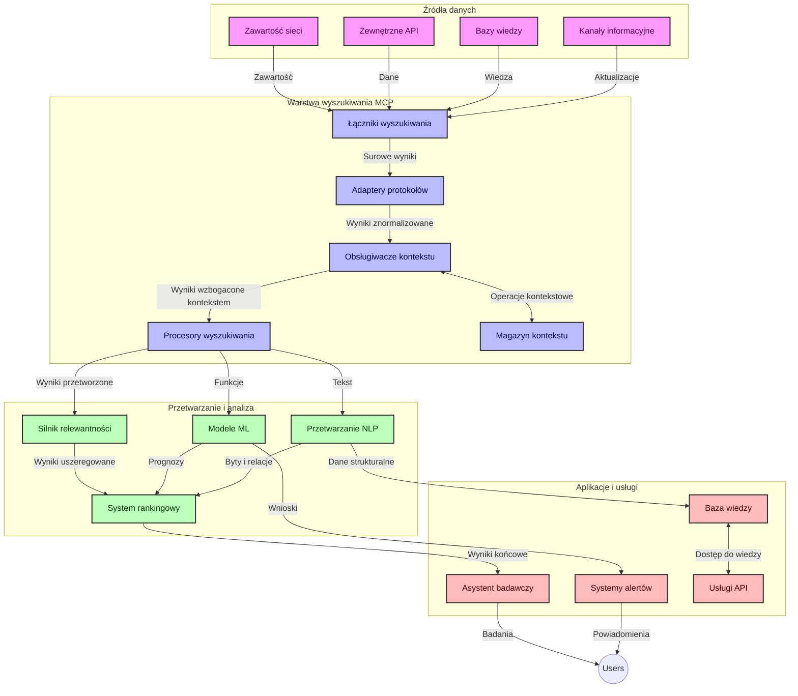
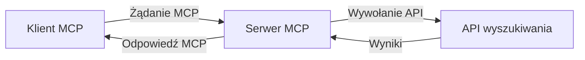
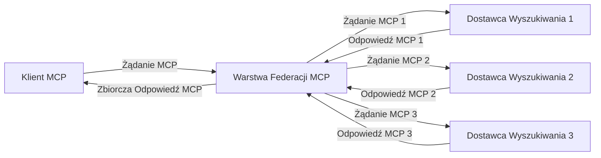
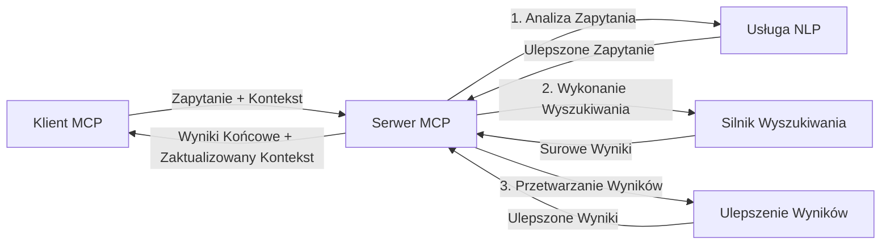

# Protokół Kontekstu Modelu do Wyszukiwania WWW w Czasie Rzeczywistym

## Przegląd

Wyszukiwanie w sieci w czasie rzeczywistym stało się niezbędne w dzisiejszym środowisku opartym na informacji, gdzie aplikacje potrzebują natychmiastowego dostępu do aktualnych informacji w Internecie, aby zapewnić odpowiednie i terminowe odpowiedzi. Protokół Kontekstu Modelu (MCP) stanowi znaczący postęp w optymalizacji tych procesów wyszukiwania w czasie rzeczywistym, zwiększając efektywność wyszukiwania, zachowując integralność kontekstu oraz poprawiając ogólną wydajność systemu.

Ten moduł bada, jak MCP zmienia wyszukiwanie WWW w czasie rzeczywistym, oferując ustandaryzowane podejście do zarządzania kontekstem pomiędzy modelami AI, wyszukiwarkami oraz aplikacjami.

### Czego się Nauczysz

W tym kompleksowym przewodniku poznasz:

- Jak MCP tworzy płynne połączenie pomiędzy modelami AI a możliwościami wyszukiwania w czasie rzeczywistym
- Wzorce architektoniczne do wdrażania efektywnych i skalowalnych rozwiązań wyszukiwania z MCP
- Techniki zachowania kontekstu wyszukiwania na wielu zapytaniach i interakcjach
- Praktyczne implementacje kodu w Pythonie i JavaScript dla różnych scenariuszy wyszukiwania
- Metody równoważenia trafności, aktualności i wydajności w systemach wyszukiwania opartych na MCP

## Wprowadzenie do Wyszukiwania WWW w Czasie Rzeczywistym

Wyszukiwanie WWW w czasie rzeczywistym to podejście technologiczne umożliwiające ciągłe zapytywanie, przetwarzanie i analizę informacji dostępnych w sieci w momencie ich publikacji lub aktualizacji, co pozwala systemom dostarczać świeże i odpowiednie informacje z minimalnym opóźnieniem. W przeciwieństwie do tradycyjnych systemów wyszukiwania operujących na zindeksowanych danych, które mogą mieć od kilku godzin do dni, wyszukiwanie w czasie rzeczywistym działa na danych na żywo z internetu, dostarczając wgląd i informacje odzwierciedlające aktualny stan treści online.

### Podstawowe Koncepcje Wyszukiwania WWW w Czasie Rzeczywistym:

- **Ciągłe Przetwarzanie Zapytań**: Zapytania są przetwarzane wobec stale aktualizowanych źródeł danych
- **Priorytet Aktualności**: Systemy zaprojektowane do faworyzowania świeżych informacji
- **Równowaga Trafności**: Utrzymanie balansu pomiędzy trafnością a aktualnością
- **Skalowalna Architektura**: Systemy muszą radzić sobie z różnym obciążeniem zapytań i wolumenem danych
- **Zrozumienie Kontekstowe**: Utrzymywanie kontekstu użytkownika między iteracjami wyszukiwania jest kluczowe dla znaczących wyników
- **Dynamiczna Reformulacja Zapytania**: Adaptacyjne modyfikowanie zapytań na podstawie kontekstu i poprzednich wyników
- **Integracja Wielu Źródeł**: Łączenie wyników z wielu dostawców i źródeł WWW
- **Zrozumienie Semantyczne**: Przetwarzanie zapytań i treści na podstawie znaczenia zamiast tylko słów kluczowych
- **Ranking w Czasie Rzeczywistym**: Ciągłe dostosowywanie pozycji wyników wraz z pojawianiem się nowych informacji

### Protokół Kontekstu Modelu a Wyszukiwanie WWW w Czasie Rzeczywistym

Protokół Kontekstu Modelu (MCP) rozwiązuje kilka kluczowych wyzwań w środowiskach wyszukiwania w czasie rzeczywistym:

1. **Zachowanie Kontekstu Wyszukiwania**: MCP standaryzuje sposób utrzymywania kontekstu pomiędzy rozproszonymi komponentami wyszukiwania, zapewniając modelom AI i węzłom przetwarzającym dostęp do historii zapytań i preferencji użytkownika.

2. **Efektywne Zarządzanie Zapytaniami**: Dostarczając ustrukturyzowane mechanizmy przesyłu kontekstu, MCP zmniejsza nadmiarowość powtarzania kontekstu przy każdej iteracji wyszukiwania.

3. **Interoperacyjność**: MCP tworzy wspólny język do dzielenia się kontekstem pomiędzy różnorodnymi technologiami wyszukiwania i modelami AI, umożliwiając bardziej elastyczne i rozszerzalne architektury.

4. **Optymalizacja Kontekstu pod Wyszukiwanie**: Implementacje MCP mogą priorytetyzować, które elementy kontekstu są najistotniejsze dla efektywnego wyszukiwania, optymalizując zarówno wydajność, jak i dokładność.

5. **Adaptacyjne Przetwarzanie Wyszukiwania**: Dzięki właściwemu zarządzaniu kontekstem przez MCP, systemy wyszukiwania mogą dynamicznie dostosowywać przetwarzanie na podstawie zmieniających się potrzeb użytkownika i krajobrazów informacyjnych.

W nowoczesnych aplikacjach, od agregacji wiadomości po asystentów badawczych, integracja MCP z technologiami wyszukiwania internetowego umożliwia bardziej inteligentne, kontekstowo świadome wyszukiwanie, które może dostarczać coraz bardziej trafne wyniki w miarę kontynuacji interakcji użytkownika.

## Cele Nauki

Pod koniec tej lekcji będziesz potrafił:

- Zrozumieć podstawy wyszukiwania w czasie rzeczywistym i jego wyzwania we współczesnych aplikacjach
- Wyjaśnić, jak Protokół Kontekstu Modelu (MCP) wzmacnia możliwości wyszukiwania w czasie rzeczywistym
- Implementować rozwiązania wyszukiwania oparte na MCP, korzystając z popularnych frameworków i API
- Projektować i wdrażać skalowalne, wysokowydajne architektury wyszukiwania z MCP
- Stosować koncepcje MCP w różnych przypadkach użycia, w tym wyszukiwanie semantyczne, asystę badawczą i przeglądanie wspomagane AI
- Ocenić pojawiające się trendy i przyszłe innowacje w technologiach wyszukiwania opartych na MCP
- Tworzyć systemy wyszukiwania świadome kontekstu, które uczą się na podstawie interakcji użytkownika
- Integrować możliwości wyszukiwania internetowego z asystentami AI przy użyciu ustandaryzowanych protokołów MCP
- Tworzyć wieloetapowe potoki wyszukiwania, które stopniowo udoskonalają wyniki na podstawie kontekstu
- Optymalizować wydajność wyszukiwania przy jednoczesnym zachowaniu pełnej świadomości kontekstu

### Definicja i Znaczenie

Wyszukiwanie WWW w czasie rzeczywistym obejmuje ciągłe zapytywanie, pobieranie i dostarczanie informacji internetowych z minimalnym opóźnieniem. W przeciwieństwie do tradycyjnych wyszukiwarek, które okresowo indeksują i przeszukują sieć, wyszukiwanie w czasie rzeczywistym ma na celu ujawnianie informacji w miarę ich pojawiania się, umożliwiając natychmiastowy dostęp do najbardziej aktualnych treści.

Kluczowe cechy wyszukiwania WWW w czasie rzeczywistym to:

- **Świeżość**: Priorytetowanie najnowszych treści i aktualizacji
- **Ciągłe Przetwarzanie**: Stałe monitorowanie nowych informacji
- **Adaptacja Zapytania**: Ulepszanie zapytań na podstawie kontekstu i informacji zwrotnych
- **Natychmiastowa Dostawa**: Udostępnianie wyników z minimalnym opóźnieniem
- **Zachowanie Kontekstu**: Budowanie na podstawie poprzednich zapytań dla lepszej trafności

### Wyzwania w Tradycyjnym Wyszukiwaniu w Sieci

Tradycyjne podejścia do wyszukiwania w sieci napotykają na kilka ograniczeń stosowanych w scenariuszach czasu rzeczywistego:

1. **Fragmentacja Kontekstu**: Trudności w utrzymaniu kontekstu wyszukiwania w wielu zapytaniach
2. **Świeżość Informacji**: Problemy z dostępem i priorytetem najnowszych informacji
3. **Złożoność Integracji**: Trudności z interoperacyjnością między systemami wyszukiwania i aplikacjami
4. **Problemy z Opóźnieniami**: Równoważenie pełnego zakresu wyszukiwania z wymaganiami czasu reakcji
5. **Dostosowanie Trafności**: Zapewnienie dokładności i relewantności przy priorytetyzacji aktualności

## Zrozumienie Protokółu Kontekstu Modelu (MCP) dla Wyszukiwania

### Czym jest MCP w Kontekstach Wyszukiwania?

Protokół Kontekstu Modelu (MCP) to ustandaryzowany protokół komunikacyjny zaprojektowany do ułatwienia efektywnej interakcji między modelami AI i aplikacjami. W kontekście wyszukiwania WWW w czasie rzeczywistym MCP zapewnia ramy do:

- Zachowania kontekstu wyszukiwania w całej sekwencji zapytań
- Standaryzacji formatów zapytań i wyników wyszukiwania
- Optymalizacji przesyłu parametrów i wyników wyszukiwania
- Ulepszenia komunikacji między modelem a silnikiem wyszukiwania

### Główne Komponenty i Architektura

Architektura MCP dla wyszukiwania WWW w czasie rzeczywistym składa się z kilku kluczowych komponentów:

1. **Obsługiwacze Kontekstu Zapytania**: Zarządzają i utrzymują kontekst wyszukiwania na wielu zapytaniach
2. **Procesory Wyszukiwania**: Przetwarzają przychodzące żądania wyszukiwania za pomocą technik uwzględniających kontekst
3. **Adaptery Protokółu**: Konwertują między różnymi API wyszukiwania zachowując kontekst
4. **Magazyn Kontekstu**: Efektywnie przechowuje i pobiera historię wyszukiwania oraz preferencje
5. **Konektory Wyszukiwania**: Łączą się z różnymi silnikami wyszukiwania i API internetowymi



### Jak MCP Ulepsza Wyszukiwanie WWW w Czasie Rzeczywistym

MCP rozwiązuje tradycyjne problemy związane z wyszukiwaniem w sieci poprzez:

- **Ciągłość Kontekstową**: Utrzymywanie relacji między zapytaniami przez całą sesję wyszukiwania
- **Optymalizację Przesyłu**: Zmniejszanie nadmiarowości parametrów wyszukiwania przez inteligentne zarządzanie kontekstem
- **Standaryzowane Interfejsy**: Zapewnianie spójnych API dla komponentów wyszukiwania
- **Zmniejszenie Opóźnień**: Minimalizacja narzutu przetwarzania dzięki efektywnemu zarządzaniu kontekstem
- **Zwiększona Trafność**: Poprawa trafności wyników przez zachowanie intencji użytkownika na wielu zapytaniach

## Integracja i Implementacja

Systemy wyszukiwania w czasie rzeczywistym wymagają starannego projektowania architektury i implementacji, aby utrzymać zarówno wydajność, jak i integralność kontekstu. Protokół Kontekstu Modelu oferuje ustandaryzowane podejście do integracji modeli AI i technologii wyszukiwania, umożliwiając bardziej zaawansowane, świadome kontekstu potoki wyszukiwania.

### Przegląd Integracji MCP w Architekturach Wyszukiwania

Implementacja MCP w środowiskach wyszukiwania w czasie rzeczywistym obejmuje kilka kluczowych kwestii:

1. **Serializacja Kontekstu Wyszukiwania**: MCP dostarcza efektywne mechanizmy do kodowania informacji kontekstowej w żądaniach wyszukiwania, zapewniając, że niezbędny kontekst podąża za zapytaniem w całej ścieżce przetwarzania. Obejmuje to ustandaryzowane formaty serializacji zoptymalizowane pod kątem metadanych związanych z wyszukiwaniem.

2. **Stanowe Przetwarzanie Wyszukiwania**: MCP pozwala na inteligentne, stanowe przetwarzanie przez utrzymywanie spójnej reprezentacji kontekstu na wielu iteracjach wyszukiwania. Jest to szczególnie cenne w wieloetapowych potokach wyszukiwania, gdzie dopracowanie kontekstu poprawia wyniki.

3. **Rozszerzenie i Udoskonalenie Zapytania**: Implementacje MCP w systemach wyszukiwania mogą ułatwiać zaawansowane rozszerzenie i udoskonalanie zapytań na podstawie nagromadzonego kontekstu, pozwalając na coraz trafniejsze wyniki w miarę postępu sesji wyszukiwania.

4. **Buforowanie i Priorytetyzacja Wyników**: Standaryzując obsługę kontekstu, MCP pomaga zarządzać buforowaniem i priorytetyzacją wyników, umożliwiając komponentom adaptację na podstawie ewoluującego kontekstu wyszukiwania.

5. **Federacja i Agregacja Wyszukiwania**: MCP ułatwia bardziej zaawansowaną federację wyszukiwania w wielu zapleczach, dostarczając ustrukturyzowane reprezentacje kontekstu wyszukiwania, co umożliwia bardziej znaczącą agregację wyników z różnych źródeł.

Implementacja MCP w różnych technologiach wyszukiwania tworzy jednolite podejście do zarządzania kontekstem, zmniejszając potrzebę tworzenia niestandardowego kodu integracyjnego oraz zwiększając zdolność systemu do utrzymywania znaczącego kontekstu wraz z ewolucją zapytań.

### MCP w Różnych Implementacjach Wyszukiwania WWW

Te przykłady opierają się na aktualnej specyfikacji MCP, która koncentruje się na protokole opartym na JSON-RPC z różnymi mechanizmami transportu. Kod pokazuje, jak można wdrożyć niestandardowe integracje wyszukiwania, zachowując pełną kompatybilność z protokołem MCP.


<details>
<summary>Implementacja Python z Uniwersalnym API Wyszukiwania</summary>

```python
import asyncio
import json
import aiohttp
from typing import Dict, Any, Optional, List
from contextlib import asynccontextmanager
from collections.abc import AsyncIterator

# Importuj standardowe biblioteki MCP
from mcp.client.session import ClientSession
from mcp.client.streamable_http import streamablehttp_client
from mcp.types import TextContent, CreateMessageRequestParams, CreateMessageResult
from mcp.server.fastmcp import FastMCP

# Utwórz serwer FastMCP do wyszukiwania w sieci
search_server = FastMCP("WebSearch")

# Klasa do obsługi operacji wyszukiwania w sieci
class WebSearchHandler:
    def __init__(self, api_endpoint: str, api_key: str):
        self.api_endpoint = api_endpoint
        self.api_key = api_key
        self.session = None
        
    async def initialize(self):
        """Initialize the HTTP session"""
        self.session = aiohttp.ClientSession(
            headers={"Authorization": f"Bearer {self.api_key}"}
        )
    
    async def close(self):
        """Close the HTTP session"""
        if self.session:
            await self.session.close()
            
    async def perform_search(self, query: str, max_results: int = 5, 
                           include_domains: List[str] = None, 
                           exclude_domains: List[str] = None,
                           time_period: str = "any") -> Dict[str, Any]:
        """Perform web search using the search API"""
        # Konstrukcja parametrów wyszukiwania
        search_params = {
            "q": query,
            "limit": max_results,
            "time": time_period
        }
        
        if include_domains:
            search_params["site"] = ",".join(include_domains)
            
        if exclude_domains:
            search_params["exclude_site"] = ",".join(exclude_domains)
        
        # Wykonaj zapytanie wyszukiwania
        try:
            async with self.session.get(
                self.api_endpoint,
                params=search_params
            ) as response:
                if response.status != 200:
                    error_text = await response.text()
                    raise Exception(f"Search API error: {response.status} - {error_text}")
                
                search_data = await response.json()
                
                # Przekształć odpowiedź specyficzną dla API do standardowego formatu
                results = []
                for item in search_data.get("results", []):
                    results.append({
                        "title": item.get("title", ""),
                        "url": item.get("url", ""),
                        "snippet": item.get("snippet", ""),
                        "date": item.get("published_date", ""),
                        "source": item.get("source", "")
                    })
                
                return {
                    "query": query,
                    "totalResults": len(results),
                    "results": results
                }
        except Exception as e:
            print(f"Search API request error: {e}")
            raise

# Inicjalizuj obsługę wyszukiwania
search_handler = WebSearchHandler(
    api_endpoint="https://api.search-service.example/search",
    api_key="your-api-key-here"
)

# Skonfiguruj czas życia, aby zarządzać obsługą wyszukiwania
@asyncio.asynccontextmanager
async def app_lifespan(server: FastMCP):
    """Manage application lifecycle"""
    await search_handler.initialize()
    try:
        yield {"search_handler": search_handler}
    finally:
        await search_handler.close()

# Ustaw czas życia serwera
search_server = FastMCP("WebSearch", lifespan=app_lifespan)

# Zarejestruj narzędzie do wyszukiwania w sieci
@search_server.tool()
async def web_search(query: str, max_results: int = 5, 
                   include_domains: List[str] = None,
                   exclude_domains: List[str] = None,
                   time_period: str = "any") -> Dict[str, Any]:
    """
    Search the web for information
    
    Args:
        query: The search query
        max_results: Maximum number of results to return (default: 5)
        include_domains: List of domains to include in search results
        exclude_domains: List of domains to exclude from search results
        time_period: Time period for results ("day", "week", "month", "any")
        
    Returns:
        Dictionary containing search results
    """
    ctx = search_server.get_context()
    search_handler = ctx.request_context.lifespan_context["search_handler"]
    
    results = await search_handler.perform_search(
        query=query,
        max_results=max_results,
        include_domains=include_domains,
        exclude_domains=exclude_domains,
        time_period=time_period
    )
    
    return results

# Przykład użycia klienta
async def client_example():
    # Połącz się z serwerem wyszukiwania za pomocą strumieniowego transportu HTTP
    async with streamablehttp_client("http://localhost:8000/mcp") as (read, write, _):
        async with ClientSession(read, write) as session:
            # Inicjalizuj połączenie
            await session.initialize()
            
            # Wywołaj narzędzie web_search
            search_results = await session.call_tool(
                "web_search", 
                {
                    "query": "latest developments in AI and Model Context Protocol",
                    "max_results": 5,
                    "time_period": "day",
                    "include_domains": ["github.com", "microsoft.com"]
                }
            )
            
            print(f"Search results: {search_results}")

# Przykład uruchomienia serwera
if __name__ == "__main__":
    # Uruchom serwer ze strumieniowym transportem HTTP
    search_server.run(transport="streamable-http")
```
</details> 

<details>
<summary>Implementacja JavaScript z Wyszukiwaniem opartym na Przeglądarce</summary>


```javascript
// Implementacja serwera MCP do wyszukiwania w sieci
import { McpServer, ResourceTemplate } from '@modelcontextprotocol/sdk/server/mcp.js';
import { StreamableHTTPServerTransport } from '@modelcontextprotocol/sdk/server/streamableHttp.js';
import { z } from 'zod';

// Utwórz serwer MCP do wyszukiwania w sieci
const searchServer = new McpServer({
    name: "BrowserSearch",
    description: "A server that provides web search capabilities"
});

// Klasa usługi wyszukiwania
class SearchService {
    constructor(searchApiUrl, apiKey) {
        this.searchApiUrl = searchApiUrl;
        this.apiKey = apiKey;
    }

    async performSearch(parameters) {
        const {
            query = '',
            maxResults = 5,
            includeDomains = [],
            excludeDomains = [],
            timePeriod = 'any'
        } = parameters;
        
        // Konstrukcja URL wyszukiwania z parametrami
        const url = new URL(this.searchApiUrl);
        url.searchParams.append('q', query);
        url.searchParams.append('limit', maxResults);
        url.searchParams.append('time', timePeriod);
        
        if (includeDomains.length > 0) {
            url.searchParams.append('site', includeDomains.join(','));
        }
        
        if (excludeDomains.length > 0) {
            url.searchParams.append('exclude_site', excludeDomains.join(','));
        }
        
        try {
            const response = await fetch(url.toString(), {
                method: 'GET',
                headers: {
                    'Authorization': `Bearer ${this.apiKey}`,
                    'Content-Type': 'application/json'
                }
            });
            
            if (!response.ok) {
                const errorText = await response.text();
                throw new Error(`Search API error: ${response.status} - ${errorText}`);
            }
            
            const searchData = await response.json();
            
            // Przekształć odpowiedź specyficzną dla API na standardowy format
            const results = searchData.results?.map(item => ({
                title: item.title || '',
                url: item.url || '',
                snippet: item.snippet || '',
                date: item.published_date || '',
                source: item.source || ''
            })) || [];
            
            return {
                query,
                totalResults: results.length,
                results
            };
        } catch (error) {
            console.error('Search API request error:', error);
            throw error;
        }
    }
}

// Inicjalizuj usługę wyszukiwania
const searchService = new SearchService(
    'https://api.search-service.example/search',
    'your-api-key-here'
);

// Skonfiguruj dostawcę kontekstu dla serwera
searchServer.setContextProvider(() => {
    return {
        searchService
    };
});

// Zarejestruj narzędzie do wyszukiwania w sieci
searchServer.tool({
    name: 'web_search',
    description: 'Search the web for information',
    parameters: {
        type: 'object',
        properties: {
            query: {
                type: 'string',
                description: 'The search query'
            },
            maxResults: {
                type: 'integer',
                description: 'Maximum number of results to return',
                default: 5
            },
            includeDomains: {
                type: 'array',
                items: { type: 'string' },
                description: 'List of domains to include in search results'
            },
            excludeDomains: {
                type: 'array',
                items: { type: 'string' },
                description: 'List of domains to exclude from search results'
            },
            timePeriod: {
                type: 'string',
                description: 'Time period for results',
                enum: ['day', 'week', 'month', 'any'],
                default: 'any'
            }
        },
        required: ['query']
    },
    handler: async (params, context) => {
        const { searchService } = context;
        return await searchService.performSearch(params);
    }
});

// Przykładowy kod klienta łączącego się z serwerem wyszukiwania
import { Client } from '@modelcontextprotocol/sdk/client/index.js';
import { StreamableHTTPClientTransport } from '@modelcontextprotocol/sdk/client/streamableHttp.js';

async function connectToSearchServer() {
    // Połącz się z serwerem wyszukiwania
    const transport = new StreamableHTTPClientTransport(
        new URL('http://localhost:8000/mcp')
    );
    
    const client = new Client({
        name: 'search-client',
        version: '1.0.0'
    });
    
    await client.connect(transport);
    
    // Wykonaj narzędzie wyszukiwania
    const searchResults = await client.callTool({
        name: 'web_search',
        arguments: {
            query: 'Model Context Protocol implementation examples',
            maxResults: 10,
            timePeriod: 'week',
            includeDomains: ['github.com', 'docs.microsoft.com']
        }
    });
    
    console.log('Search results:', searchResults);
    
    // Sprzątanie
    await client.disconnect();
}

// Uruchom serwer
const transport = new StreamableHTTPServerTransport();
await searchServer.connect(transport);
console.log('Search server running at http://localhost:8000/mcp');

// W osobnym procesie lub po uruchomieniu serwera
// connectToSearchServer().catch(console.error);
```
</details> 


## Zastrzeżenie dotyczące Przykładów Kodów

> **Ważna Uwaga**: Poniższe przykłady kodu demonstrują integrację Protokołu Kontekstu Modelu (MCP) z funkcjonalnością wyszukiwania w sieci. Choć podążają za wzorcami i strukturami oficjalnych SDK MCP, zostały uproszczone do celów edukacyjnych.
> 
> Te przykłady przedstawiają:
> 
> 1. **Implementację w Pythonie**: Serwer FastMCP, który zapewnia narzędzie do wyszukiwania internetowego oraz łączy się z zewnętrznym API wyszukiwania. Przykład demonstruje właściwe zarządzanie czasem życia, obsługę kontekstu oraz implementację narzędzia według wzorców z [oficjalnego MCP Python SDK](https://github.com/modelcontextprotocol/python-sdk). Serwer używa zalecanego transportu Streamable HTTP, który zastąpił starszy transport SSE w zastosowaniach produkcyjnych.
> 
> 2. **Implementację JavaScript**: Implementacja w TypeScript/JavaScript stosująca wzorzec FastMCP z [oficjalnego MCP TypeScript SDK](https://github.com/modelcontextprotocol/typescript-sdk) do stworzenia serwera wyszukiwania z odpowiednimi definicjami narzędzi i połączeniami klienta. Podąża za najnowszymi zalecanymi wzorcami zarządzania sesją i zachowania kontekstu.
> 
> Do zastosowania produkcyjnego te przykłady wymagałyby dodatkowej obsługi błędów, uwierzytelniania oraz specyficznego kodu integracyjnego API. Pokazane punkty końcowe API wyszukiwania (`https://api.search-service.example/search`) są przykładowe i powinny zostać zastąpione rzeczywistymi adresami usług wyszukiwania.
> 
> Szczegółowe informacje dotyczące implementacji i najnowszych podejść,
> zawarte są w [oficjalnej specyfikacji MCP](https://modelcontextprotocol.io/specification/2026-07-28/)
> oraz dokumentacji SDK.

## Podstawowe Koncepcje

### Ramy Protokołu Kontekstu Modelu (MCP)

Na swoich fundamentach Protokół Kontekstu Modelu zapewnia ustandaryzowany sposób wymiany kontekstu pomiędzy modelami AI, aplikacjami i usługami. W wyszukiwaniu WWW w czasie rzeczywistym ramy te są niezbędne do tworzenia spójnych, wieloetapowych doświadczeń wyszukiwania. Kluczowe komponenty obejmują:

1. **Architektura Klient-Serwer**: MCP ustanawia wyraźny podział między klientami wyszukiwania (żądającymi) a serwerami wyszukiwania (dostarczającymi), pozwalając na elastyczne modele wdrożeniowe.

2. **Komunikacja JSON-RPC**: Protokół używa JSON-RPC do wymiany wiadomości, co czyni go kompatybilnym z technologiami webowymi i łatwym do implementacji na różnych platformach.

3. **Zarządzanie Kontekstem**: MCP definiuje ustrukturyzowane metody do utrzymywania, aktualizacji i wykorzystywania kontekstu wyszukiwania przez wiele interakcji.

4. **Definicje Narzędzi**: Możliwości wyszukiwania są udostępniane jako ustandaryzowane narzędzia z jasno określonymi parametrami i wartościami zwracanymi.

5. **Obsługa Strumieniowania**: Protokół wspiera strumieniowanie wyników, co jest kluczowe dla wyszukiwania w czasie rzeczywistym, gdzie wyniki mogą pojawiać się stopniowo.

### Wzorce Integracji Wyszukiwania WWW

Przy integracji MCP z wyszukiwaniem WWW pojawia się kilka wzorców:

#### 1. Bezpośrednia Integracja z Dostawcą Wyszukiwania



W tym wzorcu serwer MCP bezpośrednio łączy się z jednym lub wieloma API wyszukiwania, tłumacząc żądania MCP na specyficzne wywołania API i formatując wyniki jako odpowiedzi MCP.

#### 2. Federacyjne Wyszukiwanie z Zachowaniem Kontekstu



Ten wzorzec rozdziela zapytania wyszukiwania na wielu kompatybilnych z MCP dostawców, z których każdy może specjalizować się w różnych typach treści lub zdolnościach wyszukiwawczych przy jednoczesnym utrzymaniu jednolitego kontekstu.

#### 3. Łańcuch Wyszukiwania Wzbogacony Kontekstem



W tym wzorcu proces wyszukiwania jest podzielony na wiele etapów, przy czym na każdym kroku kontekst jest wzbogacany, co skutkuje stopniowo coraz bardziej trafnymi wynikami.

### Elementy Kontekstu Wyszukiwania

W wyszukiwaniu sieciowym opartym na MCP kontekst zazwyczaj obejmuje:

- **Historię Zapytania**: Poprzednie zapytania wyszukiwania w sesji
- **Preferencje Użytkownika**: Język, region, ustawienia bezpiecznego wyszukiwania
- **Historię Interakcji**: Które wyniki zostały kliknięte, czas spędzony na wynikach
- **Parametry Wyszukiwania**: Filtry, kolejność sortowania i inne modyfikatory wyszukiwania
- **Wiedzę Domenową**: Kontekst specyficzny dla tematu wyszukiwania
- **Kontekst Czasowy**: Czynniki trafności oparte na czasie
- **Preferencje Źródeł**: Zaufane lub preferowane źródła informacji

## Przypadki Użycia i Zastosowania

### Badania i Gromadzenie Informacji

MCP wzmacnia przepływy pracy badawczej poprzez:

- Zachowanie kontekstu badań podczas sesji wyszukiwania
- Umożliwianie bardziej zaawansowanych i kontekstowo istotnych zapytań
- Wspieranie federacji wyszukiwania z wielu źródeł
- Ułatwianie ekstrakcji wiedzy z wyników wyszukiwania

### Monitorowanie Aktualności i Trendów w Czasie Rzeczywistym

Wyszukiwanie zasilane MCP oferuje zalety dla monitoringu wiadomości:

- Niemal w czasie rzeczywistym odkrywanie pojawiających się informacji
- Kontekstowe filtrowanie istotnych informacji
- Śledzenie tematów i podmiotów z wielu źródeł
- Spersonalizowane alerty newsowe na podstawie kontekstu użytkownika

### Przeglądanie i Badania Wspomagane przez AI

MCP otwiera nowe możliwości dla przeglądania wspomaganego przez AI:

- Kontekstowe sugestie wyszukiwania oparte na bieżącej aktywności przeglądarki
- Bezproblemowa integracja wyszukiwania internetowego z asystentami opartymi na dużych modelach językowych (LLM)
- Wieloetapowe udoskonalanie wyszukiwania przy utrzymanym kontekście
- Ulepszone sprawdzanie faktów i weryfikacja informacji

## Przyszłe Trendy i Innowacje

### Ewolucja MCP w Wyszukiwaniu Internetowym

Patrząc w przyszłość, przewidujemy rozwój MCP w kierunku uwzględnienia:


- **Wyszukiwanie multimodalne**: Integracja wyszukiwania tekstu, obrazów, dźwięku i wideo z zachowaniem kontekstu
- **Wyszukiwanie zdecentralizowane**: Wspieranie rozproszonych i federacyjnych ekosystemów wyszukiwania
- **Prywatność wyszukiwania**: Mechanizmy wyszukiwania wspierające zachowanie prywatności z uwzględnieniem kontekstu
- **Rozumienie zapytań**: Głębokie parsowanie semantyczne zapytań wyszukiwania w języku naturalnym

### Potencjalne postępy w technologii

Nowe technologie, które ukształtują przyszłość wyszukiwania MCP:

1. **Architektury wyszukiwania neuronowego**: Systemy wyszukiwania oparte na osadzaniu zoptymalizowane pod kątem MCP
2. **Spersonalizowany kontekst wyszukiwania**: Nauka indywidualnych wzorców wyszukiwania użytkowników na przestrzeni czasu
3. **Integracja grafów wiedzy**: Wyszukiwanie kontekstowe wzbogacone o dziedzinowe grafy wiedzy
4. **Kontekst międzymodalny**: Utrzymanie kontekstu między różnymi modalnościami wyszukiwania

## Ćwiczenia praktyczne

### Ćwiczenie 1: Konfiguracja podstawowego potoku wyszukiwania MCP

W tym ćwiczeniu nauczysz się jak:
- Skonfigurować podstawowe środowisko wyszukiwania MCP
- Implementować obsługę kontekstu dla wyszukiwania internetowego
- Testować i weryfikować zachowanie kontekstu podczas kolejnych iteracji wyszukiwania

### Ćwiczenie 2: Budowa asystenta badawczego z użyciem wyszukiwania MCP

Stwórz kompletną aplikację, która:
- Przetwarza pytania badawcze w języku naturalnym
- Wykonuje wyszukiwania internetowe uwzględniające kontekst
- Synthesizuje informacje z wielu źródeł
- Prezentuje zorganizowane wyniki badań

### Ćwiczenie 3: Implementacja federacji wyszukiwania wieloźródłowego z MCP

Zaawansowane ćwiczenie obejmujące:
- Kontekstowe rozsyłanie zapytań do wielu silników wyszukiwawczych
- Ranking i agregację wyników
- Kontekstowe usuwanie duplikatów wyników wyszukiwania
- Obsługę metadanych specyficznych dla źródeł

## Dodatkowe zasoby

- [Model Context Protocol Specification](https://modelcontextprotocol.io/specification/2026-07-28/) - Oficjalna specyfikacja MCP i szczegółowa dokumentacja protokołu
- [Model Context Protocol Documentation](https://modelcontextprotocol.io/) - Szczegółowe samouczki i przewodniki implementacyjne
- [MCP Python SDK](https://github.com/modelcontextprotocol/python-sdk) - Oficjalna implementacja protokołu MCP w Pythonie
- [MCP TypeScript SDK](https://github.com/modelcontextprotocol/typescript-sdk) - Oficjalna implementacja protokołu MCP w TypeScript
- [MCP Reference Servers](https://github.com/modelcontextprotocol/servers) - Referencyjne implementacje serwerów MCP
- [Bing Web Search API Documentation](https://learn.microsoft.com/en-us/bing/search-apis/bing-web-search/overview) - API wyszukiwania internetowego Microsoftu
- [Google Custom Search JSON API](https://developers.google.com/custom-search/v1/overview) - Programowalny silnik wyszukiwania Google
- [SerpAPI Documentation](https://serpapi.com/search-api) - API stron wyników wyszukiwarki
- [Meilisearch Documentation](https://www.meilisearch.com/docs) - Otwarty silnik wyszukiwania
- [Elasticsearch Documentation](https://www.elastic.co/guide/index.html) - Rozproszony silnik wyszukiwania i analityki
- [LangChain Documentation](https://python.langchain.com/docs/get_started/introduction) - Budowanie aplikacji z dużymi modelami językowymi (LLM)

## Efekty nauki

Po ukończeniu tego modułu będziesz potrafił:

- Zrozumieć podstawy wyszukiwania internetowego w czasie rzeczywistym oraz wyzwania z nim związane
- Wyjaśnić, jak Model Context Protocol (MCP) usprawnia możliwości wyszukiwania w czasie rzeczywistym
- Implementować rozwiązania wyszukiwania oparte na MCP z użyciem popularnych frameworków i API
- Projektować i wdrażać skalowalne, wysokowydajne architektury wyszukiwania oparte na MCP
- Stosować koncepcje MCP w różnych zastosowaniach, w tym wyszukiwaniu semantycznym, asystentach badawczych oraz zautomatyzowanym przeglądaniu wspomaganym AI
- Ocenić pojawiające się trendy i przyszłe innowacje w technologiach wyszukiwania opartych na MCP


### Rozważania dotyczące zaufania i bezpieczeństwa

Implementując rozwiązania wyszukiwania internetowego oparte na MCP, pamiętaj o następujących zasadach z specyfikacji MCP:

1. **Zgoda i kontrola użytkownika**: Użytkownicy muszą wyraźnie wyrazić zgodę i rozumieć wszystkie operacje oraz dostęp do danych. Jest to szczególnie istotne w implementacjach wyszukiwania internetowego, które mogą uzyskiwać dostęp do zewnętrznych źródeł danych.

2. **Prywatność danych**: Zapewnij odpowiednie przetwarzanie zapytań wyszukiwania i wyników, szczególnie gdy mogą zawierać dane wrażliwe. Wdroż odpowiednie mechanizmy kontroli dostępu chroniące dane użytkowników.

3. **Bezpieczeństwo narzędzi**: Zapewnij właściwą autoryzację i walidację narzędzi wyszukiwania, ponieważ mogą one stanowić potencjalne zagrożenie bezpieczeństwa przez wykonywanie dowolnego kodu. Opisy działania narzędzi powinny być uważane za niezweryfikowane, chyba że pochodzą z zaufanego serwera.

4. **Jasna dokumentacja**: Zapewnij jasną dokumentację dotyczącą możliwości, ograniczeń oraz aspektów bezpieczeństwa swojej implementacji wyszukiwania opartej na MCP, zgodnie z wytycznymi implementacyjnymi z specyfikacji MCP.

5. **Solidne mechanizmy zgody**: Buduj solidne procesy uzyskiwania zgody i autoryzacji, które jasno wyjaśniają, co wykonuje każde narzędzie przed autoryzacją jego użycia, zwłaszcza dla narzędzi współdziałających z zewnętrznymi zasobami internetowymi.

Pełne informacje na temat bezpieczeństwa i zaufania w MCP znajdziesz w
[oficjalnej dokumentacji](https://modelcontextprotocol.io/specification/2026-07-28/basic/security_best_practices).

## Co dalej

- [5.12 Uwierzytelnianie Entra ID dla serwerów Model Context Protocol](../mcp-security-entra/README.md)

---

<!-- CO-OP TRANSLATOR DISCLAIMER START -->
**Zastrzeżenie**:
Niniejszy dokument został przetłumaczony za pomocą usługi tłumaczenia AI [Co-op Translator](https://github.com/Azure/co-op-translator). Choć dążymy do dokładności, prosimy pamiętać, że automatyczne tłumaczenia mogą zawierać błędy lub niedokładności. Oryginalny dokument w jego języku źródłowym należy uznawać za autorytatywne źródło. W przypadku informacji krytycznych zalecane jest skorzystanie z profesjonalnego tłumaczenia wykonanego przez człowieka. Nie ponosimy odpowiedzialności za jakiekolwiek nieporozumienia lub błędne interpretacje wynikające z użycia tego tłumaczenia.
<!-- CO-OP TRANSLATOR DISCLAIMER END -->