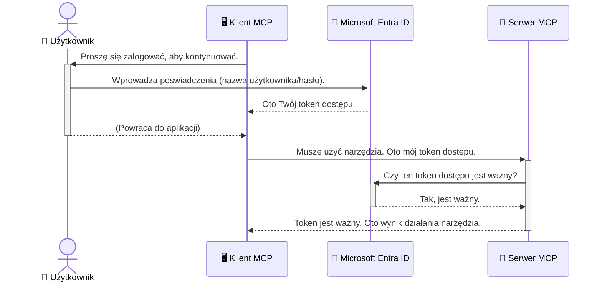

# Zabezpieczanie przepływów pracy AI: Uwierzytelnianie Entra ID dla serwerów Model Context Protocol

> [!NOTE]
> Kod zdalnego serwera w tej lekcji chroni legacy'owe punkty końcowe `/sse` i `/message`
> oraz celuje w MCP `2025-11-25`. Zachowaj jego praktyki dotyczące tożsamości i walidacji tokenów,
> ale do nowych implementacji używaj kompatybilnego z `2026-07-28` transportu Streamable HTTP.


## Wprowadzenie
Zabezpieczenie serwera Model Context Protocol (MCP) jest tak samo ważne jak zamknięcie drzwi wejściowych do twojego domu. Pozostawienie serwera MCP otwartego naraża twoje narzędzia i dane na nieautoryzowany dostęp, co może prowadzić do naruszeń bezpieczeństwa. Microsoft Entra ID zapewnia solidne, oparte na chmurze rozwiązanie do zarządzania tożsamością i dostępem, które pomaga zagwarantować, że tylko autoryzowani użytkownicy i aplikacje mogą wchodzić w interakcje z twoim serwerem MCP. W tej sekcji dowiesz się, jak chronić przepływy pracy AI, korzystając z uwierzytelniania Entra ID.

## Cele nauki
Po przeczytaniu tej sekcji będziesz potrafił:

- Zrozumieć znaczenie zabezpieczania serwerów MCP.
- Wyjaśnić podstawy Microsoft Entra ID i uwierzytelniania OAuth 2.0.
- Rozróżnić klientów publicznych i poufnych.
- Zaimplementować uwierzytelnianie Entra ID zarówno w lokalnych (klient publiczny), jak i zdalnych (klient poufny) scenariuszach serwera MCP.
- Stosować najlepsze praktyki bezpieczeństwa podczas tworzenia przepływów pracy AI.

## Bezpieczeństwo i MCP

Tak jak nie zostawiasz otwartych drzwi frontowych w swoim domu, tak nie powinieneś pozostawiać otwartego serwera MCP dla każdego. Zabezpieczenie twoich przepływów pracy AI jest kluczowe dla tworzenia solidnych, wiarygodnych i bezpiecznych aplikacji. Ten rozdział wprowadzi Cię do używania Microsoft Entra ID do zabezpieczania serwerów MCP, zapewniając, że tylko autoryzowani użytkownicy i aplikacje będą mogły korzystać z twoich narzędzi i danych.

## Dlaczego bezpieczeństwo ma znaczenie dla serwerów MCP

Wyobraź sobie, że twój serwer MCP ma narzędzie, które może wysyłać e-maile lub uzyskiwać dostęp do bazy danych klientów. Niechroniony serwer oznacza, że każdy mógłby potencjalnie używać tego narzędzia, co prowadziłoby do nieautoryzowanego dostępu do danych, spamu lub innych złośliwych działań.

Wdrożenie uwierzytelniania pozwala upewnić się, że każde żądanie do twojego serwera jest weryfikowane, potwierdzając tożsamość użytkownika lub aplikacji wysyłającej żądanie. To pierwszy i najważniejszy krok w zabezpieczaniu przepływów pracy AI.

## Wprowadzenie do Microsoft Entra ID

[**Microsoft Entra ID**](https://adoption.microsoft.com/microsoft-security/entra/) to oparte na chmurze rozwiązanie do zarządzania tożsamością i dostępem. Można to porównać do uniwersalnego ochroniarza twoich aplikacji. Obsługuje skomplikowany proces weryfikacji tożsamości użytkowników (uwierzytelnianie) oraz ustala, co im wolno robić (autoryzacja).

Korzystając z Entra ID, możesz:

- Umożliwić bezpieczne logowanie użytkowników.
- Chronić interfejsy API i usługi.
- Zarządzać politykami dostępu z jednego miejsca.

Dla serwerów MCP, Entra ID stanowi solidne i szeroko zaufane rozwiązanie do zarządzania tym, kto ma dostęp do funkcji twojego serwera.

---

## Zrozumienie magii: Jak działa uwierzytelnianie Entra ID

Entra ID używa otwartych standardów takich jak **OAuth 2.0** do obsługi uwierzytelniania. Chociaż szczegóły mogą być złożone, podstawowa idea jest prosta i można ją zrozumieć za pomocą analogii.

### Łagodne wprowadzenie do OAuth 2.0: Klucz dla woźnego

Pomyśl o OAuth 2.0 jak o usłudze woźnego do twojego samochodu. Gdy przyjeżdżasz do restauracji, nie dajesz woźnemu swojego głównego klucza. Zamiast tego dostarczasz **klucz woźnego**, który posiada ograniczone uprawnienia — może uruchomić samochód i zamknąć drzwi, ale nie może otworzyć bagażnika ani schowka.

W tej analogii:

- **Ty** jesteś **Użytkownikiem**.
- **Twój samochód** to **serwer MCP** z jego cennymi narzędziami i danymi.
- **Woźny** to **Microsoft Entra ID**.
- **Parkingowy** to **klient MCP** (aplikacja próbująca uzyskać dostęp do serwera).
- **Klucz woźnego** to **token dostępu**.

Token dostępu to bezpieczny ciąg tekstowy, który klient MCP otrzymuje od Entra ID po zalogowaniu się użytkownika. Klient następnie przedstawia ten token serwerowi MCP przy każdym żądaniu. Serwer może zweryfikować token, aby upewnić się, że żądanie jest prawidłowe i że klient ma odpowiednie uprawnienia, wszystko to bez potrzeby obsługiwania twoich prawdziwych danych uwierzytelniających (np. hasła).

### Przebieg uwierzytelniania

Oto jak ten proces działa w praktyce:



### Wprowadzenie do Microsoft Authentication Library (MSAL)

Zanim przejdziemy do kodu, ważne jest, aby poznać kluczowy komponent pojawiający się w przykładach: **Microsoft Authentication Library (MSAL)**.

MSAL to biblioteka opracowana przez Microsoft, która znacznie ułatwia deweloperom obsługę uwierzytelniania. Zamiast pisać skomplikowany kod do obsługi tokenów bezpieczeństwa, zarządzania logowaniami i odświeżania sesji, MSAL wykonuje za ciebie tę ciężką pracę.

Korzystanie z biblioteki takiej jak MSAL jest wysoce zalecane ponieważ:

- **Jest bezpieczna:** Implementuje standardy branżowe i najlepsze praktyki bezpieczeństwa, zmniejszając ryzyko podatności w twoim kodzie.
- **Upraszcza rozwój:** Ukrywa złożoność protokołów OAuth 2.0 i OpenID Connect, pozwalając ci dodać solidne uwierzytelnianie do aplikacji przy kilku linijkach kodu.
- **Jest utrzymywana:** Microsoft aktywnie utrzymuje i aktualizuje MSAL, aby sprostać nowym zagrożeniom bezpieczeństwa i zmianom platform.

MSAL wspiera wiele języków i frameworków, w tym .NET, JavaScript/TypeScript, Python, Java, Go oraz platformy mobilne takie jak iOS i Android. Oznacza to, że możesz stosować te same spójne wzorce uwierzytelniania w całym swoim stosie technologicznym.

Aby dowiedzieć się więcej o MSAL, możesz zapoznać się z oficjalną [dokumentacją przeglądową MSAL](https://learn.microsoft.com/entra/identity-platform/msal-overview).

---

## Zabezpieczanie serwera MCP za pomocą Entra ID: przewodnik krok po kroku

Teraz przejdźmy przez proces zabezpieczania lokalnego serwera MCP (komunikującego się przez `stdio`) przy użyciu Entra ID. Ten przykład wykorzystuje **klienta publicznego**, co jest odpowiednie dla aplikacji działających na komputerze użytkownika, takich jak aplikacje desktopowe lub lokalne serwery developerskie.

### Scenariusz 1: Zabezpieczenie lokalnego serwera MCP (z klientem publicznym)

W tym scenariuszu przyjrzymy się lokalnemu serwerowi MCP, który komunikuje się przez `stdio` i korzysta z Entra ID do uwierzytelniania użytkownika przed udostępnieniem mu narzędzi. Serwer będzie miał jedno narzędzie, które pobiera informacje o profilu użytkownika z Microsoft Graph API.

#### 1. Konfiguracja aplikacji w Entra ID

Zanim zaczniesz pisać kod, musisz zarejestrować swoją aplikację w Microsoft Entra ID. Informuje to Entra ID o twojej aplikacji i przyznaje jej uprawnienia do korzystania z usługi uwierzytelniania.

1. Przejdź do **[portalu Microsoft Entra](https://entra.microsoft.com/)**.
2. Wejdź do **App registrations** i kliknij **New registration**.
3. Nadaj aplikacji nazwę (np. „Mój lokalny serwer MCP”).
4. W polu **Supported account types** wybierz **Accounts in this organizational directory only**.
5. Możesz zostawić **Redirect URI** puste dla tego przykładu.
6. Kliknij **Register**.

Po zarejestrowaniu zanotuj **Application (client) ID** oraz **Directory (tenant) ID**. Będą potrzebne w kodzie.

#### 2. Kod: podsumowanie

Przyjrzyjmy się kluczowym częściom kodu obsługującego uwierzytelnianie. Pełny kod tego przykładu znajduje się w folderze [Entra ID - Local - WAM](https://github.com/Azure-Samples/mcp-auth-servers/tree/main/src/entra-id-local-wam) w repozytorium [mcp-auth-servers GitHub](https://github.com/Azure-Samples/mcp-auth-servers).

**`AuthenticationService.cs`**

Ta klasa jest odpowiedzialna za obsługę interakcji z Entra ID.

- **`CreateAsync`**: Ta metoda inicjalizuje `PublicClientApplication` z MSAL (Microsoft Authentication Library). Jest skonfigurowana z `clientId` i `tenantId` twojej aplikacji.
- **`WithBroker`**: Umożliwia użycie brokera (np. Windows Web Account Manager), co zapewnia bardziej bezpieczne i płynne logowanie jednokrotne (SSO).
- **`AcquireTokenAsync`**: To kluczowa metoda. Najpierw próbuje pozyskać token cicho (silent), czyli użytkownik nie musi ponownie się logować, jeśli ma ważną sesję. Jeśli nie uda się uzyskać takiego tokenu, wyświetli interaktywny prompt do logowania.

```csharp
// Simplified for clarity
public static async Task<AuthenticationService> CreateAsync(ILogger<AuthenticationService> logger)
{
    var msalClient = PublicClientApplicationBuilder
        .Create(_clientId) // Your Application (client) ID
        .WithAuthority(AadAuthorityAudience.AzureAdMyOrg)
        .WithTenantId(_tenantId) // Your Directory (tenant) ID
        .WithBroker(new BrokerOptions(BrokerOptions.OperatingSystems.Windows))
        .Build();

    // ... cache registration ...

    return new AuthenticationService(logger, msalClient);
}

public async Task<string> AcquireTokenAsync()
{
    try
    {
        // Try silent authentication first
        var accounts = await _msalClient.GetAccountsAsync();
        var account = accounts.FirstOrDefault();

        AuthenticationResult? result = null;

        if (account != null)
        {
            result = await _msalClient.AcquireTokenSilent(_scopes, account).ExecuteAsync();
        }
        else
        {
            // If no account, or silent fails, go interactive
            result = await _msalClient.AcquireTokenInteractive(_scopes).ExecuteAsync();
        }

        return result.AccessToken;
    }
    catch (Exception ex)
    {
        _logger.LogError(ex, "An error occurred while acquiring the token.");
        throw; // Optionally rethrow the exception for higher-level handling
    }
}
```

**`Program.cs`**

Tutaj konfiguruje się serwer MCP i integruje usługę uwierzytelniania.

- **`AddSingleton<AuthenticationService>`**: Rejestruje `AuthenticationService` w kontenerze dependency injection, dzięki czemu może być używany w innych częściach aplikacji (np. w naszym narzędziu).
- **narzędzie `GetUserDetailsFromGraph`**: To narzędzie wymaga instancji `AuthenticationService`. Na początku wywołuje `authService.AcquireTokenAsync()`, aby uzyskać ważny token dostępu. Jeśli uwierzytelnianie jest udane, narzędzie używa tokenu, aby wywołać Microsoft Graph API i pobrać szczegóły użytkownika.

```csharp
// Simplified for clarity
[McpServerTool(Name = "GetUserDetailsFromGraph")]
public static async Task<string> GetUserDetailsFromGraph(
    AuthenticationService authService)
{
    try
    {
        // This will trigger the authentication flow
        var accessToken = await authService.AcquireTokenAsync();

        // Use the token to create a GraphServiceClient
        var graphClient = new GraphServiceClient(
            new BaseBearerTokenAuthenticationProvider(new TokenProvider(authService)));

        var user = await graphClient.Me.GetAsync();

        return System.Text.Json.JsonSerializer.Serialize(user);
    }
    catch (Exception ex)
    {
        return $"Error: {ex.Message}";
    }
}
```

#### 3. Jak to wszystko działa razem

1. Gdy klient MCP próbuje użyć narzędzia `GetUserDetailsFromGraph`, narzędzie najpierw wywołuje `AcquireTokenAsync`.
2. `AcquireTokenAsync` powoduje, że biblioteka MSAL sprawdza, czy istnieje ważny token.
3. Jeśli nie ma tokenu, MSAL za pośrednictwem brokera wyświetla użytkownikowi stronę logowania Entra ID.
4. Po zalogowaniu Entra ID wydaje token dostępu.
5. Narzędzie otrzymuje token i używa go do bezpiecznego wywołania Microsoft Graph API.
6. Szczegóły użytkownika są zwracane do klienta MCP.

Ten proces zapewnia, że tylko uwierzytelnieni użytkownicy mogą korzystać z narzędzia, skutecznie zabezpieczając lokalny serwer MCP.

### Scenariusz 2: Zabezpieczenie zdalnego serwera MCP (z klientem poufnym)

Gdy twój serwer MCP działa na zdalnej maszynie (np. serwerze w chmurze) i komunikuje się poprzez protokół strumieniowego HTTP, wymagania bezpieczeństwa są inne. W tym przypadku powinieneś użyć **klienta poufnego** oraz **Authorization Code Flow**. To bezpieczniejsza metoda, ponieważ sekrety aplikacji nigdy nie są ujawniane przeglądarce.

Ten przykład używa serwera MCP opartego na TypeScript z Express.js do obsługi żądań HTTP.

#### 1. Konfiguracja aplikacji w Entra ID

Konfiguracja w Entra ID jest podobna do klienta publicznego, ale z jedną kluczową różnicą: musisz utworzyć **sekret klienta**.

1. Przejdź do **[portalu Microsoft Entra](https://entra.microsoft.com/)**.
2. W rejestracji aplikacji przejdź do zakładki **Certificates & secrets**.
3. Kliknij **New client secret**, podaj opis i kliknij **Add**.
4. **Ważne:** Skopiuj wartość sekretu od razu. Nie będziesz mógł jej później zobaczyć.
5. Musisz też skonfigurować **Redirect URI**. Wejdź na zakładkę **Authentication**, kliknij **Add a platform**, wybierz **Web** i wpisz redirect URI dla twojej aplikacji (np. `http://localhost:3001/auth/callback`).

> **⚠️ Ważna uwaga dotycząca bezpieczeństwa:** W aplikacjach produkcyjnych Microsoft zdecydowanie zaleca stosowanie metod uwierzytelniania bezsecytowych, takich jak **Managed Identity** lub **Workload Identity Federation**, zamiast sekretów klienta. Sekrety klienta niosą ryzyko ujawnienia lub kompromitacji. Tożsamości zarządzane oferują bezpieczniejsze podejście, eliminując konieczność przechowywania danych uwierzytelniających w kodzie lub konfiguracji.
>
> Aby dowiedzieć się więcej o tożsamościach zarządzanych i jak je wdrożyć, zobacz [Przegląd zarządzanych tożsamości dla zasobów Azure](https://learn.microsoft.com/entra/identity/managed-identities-azure-resources/overview).

#### 2. Kod: podsumowanie

Ten przykład wykorzystuje podejście oparte na sesji. Po uwierzytelnieniu użytkownika serwer przechowuje token dostępu i token odświeżania w sesji, a użytkownikowi wydaje się token sesji. Token sesji jest następnie używany przy kolejnych żądaniach. Pełny kod tego przykładu znajduje się w folderze [Entra ID - Confidential client](https://github.com/Azure-Samples/mcp-auth-servers/tree/main/src/entra-id-cca-session) w repozytorium [mcp-auth-servers GitHub](https://github.com/Azure-Samples/mcp-auth-servers).

**`Server.ts`**

Ten plik konfiguruje serwer Express i warstwę transportu MCP.

- **`requireBearerAuth`**: To middleware, które chroni punkty końcowe `/sse` i `/message`. Sprawdza poprawny token bearer w nagłówku `Authorization` żądania.
- **`EntraIdServerAuthProvider`**: To klasa niestandardowa implementująca interfejs `McpServerAuthorizationProvider`. Odpowiada za obsługę przepływu OAuth 2.0.
- **`/auth/callback`**: Ten endpoint obsługuje przekierowanie z Entra ID po uwierzytelnieniu użytkownika. Wymienia kod autoryzacyjny na token dostępu i token odświeżania.

```typescript
// Uproszczone dla przejrzystości
const app = express();
const { server } = createServer();
const provider = new EntraIdServerAuthProvider();

// Chroń punkt końcowy SSE
app.get("/sse", requireBearerAuth({
  provider,
  requiredScopes: ["User.Read"]
}), async (req, res) => {
  // ... połącz się z transportem ...
});

// Chroń punkt końcowy wiadomości
app.post("/message", requireBearerAuth({
  provider,
  requiredScopes: ["User.Read"]
}), async (req, res) => {
  // ... obsłuż wiadomość ...
});

// Obsłuż wywołanie zwrotne OAuth 2.0
app.get("/auth/callback", (req, res) => {
  provider.handleCallback(req.query.code, req.query.state)
    .then(result => {
      // ... obsłuż sukces lub niepowodzenie ...
    });
});
```

**`Tools.ts`**

Ten plik definiuje narzędzia udostępniane przez serwer MCP. Narzędzie `getUserDetails` jest podobne do poprzedniego przykładu, ale pobiera token dostępu z sesji.

```typescript
// Uproszczone dla przejrzystości
server.setRequestHandler(CallToolRequestSchema, async (request) => {
  const { name } = request.params;
  const context = request.params?.context as { token?: string } | undefined;
  const sessionToken = context?.token;

  if (name === ToolName.GET_USER_DETAILS) {
    if (!sessionToken) {
      throw new AuthenticationError("Authentication token is missing or invalid. Ensure the token is provided in the request context.");
    }

    // Pobierz token Entra ID ze sklepu sesji
    const tokenData = tokenStore.getToken(sessionToken);
    const entraIdToken = tokenData.accessToken;

    const graphClient = Client.init({
      authProvider: (done) => {
        done(null, entraIdToken);
      }
    });

    const user = await graphClient.api('/me').get();

    // ... zwróć szczegóły użytkownika ...
  }
});
```

**`auth/EntraIdServerAuthProvider.ts`**

Ta klasa obsługuje logikę:

- Przekierowania użytkownika do strony logowania Entra ID.
- Wymiany kodu autoryzacyjnego na token dostępu.
- Przechowywania tokenów w `tokenStore`.
- Odświeżania tokenu dostępu po wygaśnięciu.


#### 3. Jak to wszystko działa razem

1. Gdy użytkownik po raz pierwszy próbuje połączyć się z serwerem MCP, middleware `requireBearerAuth` zauważy, że nie ma ważnej sesji i przekieruje go na stronę logowania Entra ID.
2. Użytkownik loguje się za pomocą swojego konta Entra ID.
3. Entra ID przekierowuje użytkownika z powrotem do punktu końcowego `/auth/callback` z kodem autoryzacyjnym.
4. Serwer wymienia kod na token dostępu i token odświeżający, zapisuje je oraz tworzy token sesji, który jest wysyłany do klienta.
5. Klient może teraz używać tego tokenu sesji w nagłówku `Authorization` dla wszystkich przyszłych żądań do serwera MCP.
6. Gdy narzędzie `getUserDetails` jest wywoływane, używa tokenu sesji do znalezienia tokenu dostępu Entra ID, a następnie używa go do wywołania API Microsoft Graph.

Ten proces jest bardziej skomplikowany niż przepływ klienta publicznego, ale jest wymagany dla punktów końcowych dostępnych z internetu. Ponieważ zdalne serwery MCP są dostępne przez publiczny internet, potrzebują silniejszych zabezpieczeń, aby chronić się przed nieautoryzowanym dostępem i potencjalnymi atakami.


## Najlepsze praktyki zabezpieczeń

- **Zawsze używaj HTTPS**: Szyfruj komunikację między klientem a serwerem, aby chronić tokeny przed przechwyceniem.
- **Wdróż kontrolę dostępu opartą na rolach (RBAC)**: Nie sprawdzaj tylko *czy* użytkownik jest uwierzytelniony; sprawdzaj *co* jest uprawniony robić. Możesz definiować role w Entra ID i sprawdzać je na swoim serwerze MCP.
- **Monitoruj i audytuj**: Rejestruj wszystkie zdarzenia uwierzytelniania, aby móc wykrywać i reagować na podejrzane działania.
- **Obsługuj ograniczenia tempa i throttling**: Microsoft Graph i inne API wprowadzają ograniczenia tempa, aby zapobiegać nadużyciom. Wdróż eksponencjalny powrót (exponential backoff) oraz logikę ponawiania prób w swoim serwerze MCP, aby łagodnie obsługiwać odpowiedzi HTTP 429 (Too Many Requests). Rozważ buforowanie często wykorzystywanych danych, aby zmniejszyć liczbę wywołań API.
- **Bezpieczne przechowywanie tokenów**: Przechowuj tokeny dostępu i tokeny odświeżające bezpiecznie. W aplikacjach lokalnych używaj mechanizmów bezpiecznego przechowywania systemu. W aplikacjach serwerowych rozważ użycie szyfrowanego magazynu lub bezpiecznych usług zarządzania kluczami, takich jak Azure Key Vault.
- **Obsługa wygaśnięcia tokenów**: Tokeny dostępu mają ograniczony czas życia. Wdróż automatyczne odświeżanie tokenów przy użyciu tokenów odświeżających, aby utrzymać płynne doświadczenie użytkownika bez konieczności ponownego uwierzytelniania.
- **Rozważ użycie Azure API Management**: Chociaż implementacja zabezpieczeń bezpośrednio w serwerze MCP daje precyzyjną kontrolę, bramki API, takie jak Azure API Management, mogą automatycznie obsługiwać wiele kwestii bezpieczeństwa, w tym uwierzytelnianie, autoryzację, ograniczenia tempa i monitorowanie. Zapewniają one scentralizowaną warstwę zabezpieczeń między klientami a serwerami MCP. Po więcej informacji na temat używania bramek API z MCP zobacz nasz [Azure API Management Your Auth Gateway For MCP Servers](https://techcommunity.microsoft.com/blog/integrationsonazureblog/azure-api-management-your-auth-gateway-for-mcp-servers/4402690).


## Kluczowe wnioski

- Zabezpieczenie serwera MCP jest kluczowe dla ochrony Twoich danych i narzędzi.
- Microsoft Entra ID zapewnia solidne i skalowalne rozwiązanie do uwierzytelniania i autoryzacji.
- Używaj **klienta publicznego** w lokalnych aplikacjach i **klienta poufnego** dla serwerów zdalnych.
- **Authorization Code Flow** jest najbezpieczniejszą opcją dla aplikacji webowych.


## Ćwiczenie

1. Pomyśl o serwerze MCP, który chciałbyś zbudować. Czy byłby to serwer lokalny czy zdalny?
2. Na podstawie Twojej odpowiedzi, czy użyłbyś klienta publicznego, czy poufnego?
3. Jakie uprawnienia Twojego serwera MCP byłyby wymagane do wykonywania działań na Microsoft Graph?


## Ćwiczenia praktyczne

### Ćwiczenie 1: Zarejestruj aplikację w Entra ID
Przejdź do portalu Microsoft Entra.
Zarejestruj nową aplikację dla swojego serwera MCP.
Zanotuj identyfikator aplikacji (client ID) oraz identyfikator katalogu (tenant ID).

### Ćwiczenie 2: Zabezpiecz lokalny serwer MCP (klient publiczny)
- Postępuj według przykładu kodu, aby zintegrować MSAL (Microsoft Authentication Library) do uwierzytelniania użytkownika.
- Przetestuj przepływ uwierzytelniania, wywołując narzędzie MCP pobierające dane użytkownika z Microsoft Graph.

### Ćwiczenie 3: Zabezpiecz zdalny serwer MCP (klient poufny)
- Zarejestruj klienta poufnego w Entra ID i utwórz sekret klienta.
- Skonfiguruj swój serwer Express.js MCP do użycia Authorization Code Flow.
- Przetestuj chronione końcówki i potwierdź dostęp za pomocą tokenów.

### Ćwiczenie 4: Wdróż najlepsze praktyki zabezpieczeń
- Włącz HTTPS dla swojego lokalnego lub zdalnego serwera.
- Wdróż kontrolę dostępu opartą na rolach (RBAC) w logice serwera.
- Dodaj obsługę wygaśnięcia tokenów i bezpieczne przechowywanie tokenów.

## Zasoby

1. **Dokumentacja przeglądowa MSAL**  
   Dowiedz się, jak Microsoft Authentication Library (MSAL) umożliwia bezpieczne pozyskiwanie tokenów na różnych platformach:  
   [MSAL Overview on Microsoft Learn](https://learn.microsoft.com/en-gb/entra/msal/overview)

2. **Repozytorium Azure-Samples/mcp-auth-servers na GitHub**  
   Przykłady referencyjne serwerów MCP demonstrujące przepływy uwierzytelniania:  
   [Azure-Samples/mcp-auth-servers on GitHub](https://github.com/Azure-Samples/mcp-auth-servers)

3. **Przegląd Managed Identities dla zasobów Azure**  
   Dowiedz się, jak wyeliminować sekrety, używając zarządzanych tożsamości przypisanych do systemu lub użytkownika:  
   [Managed Identities Overview on Microsoft Learn](https://learn.microsoft.com/en-us/entra/identity/managed-identities-azure-resources/)

4. **Azure API Management: Twoja brama uwierzytelniania dla serwerów MCP**  
   Szczegółowe omówienie wykorzystania APIM jako bezpiecznej bramy OAuth2 dla serwerów MCP:  
   [Azure API Management Your Auth Gateway For MCP Servers](https://techcommunity.microsoft.com/blog/integrationsonazureblog/azure-api-management-your-auth-gateway-for-mcp-servers/4402690)

5. **Referencja uprawnień Microsoft Graph**  
   Kompleksowa lista uprawnień delegowanych i aplikacyjnych dla Microsoft Graph:  
   [Microsoft Graph Permissions Reference](https://learn.microsoft.com/zh-tw/graph/permissions-reference)


## Efekty nauki
Po ukończeniu tej sekcji będziecie mogli:

- Wyjaśnić, dlaczego uwierzytelnianie jest kluczowe dla serwerów MCP i przepływów AI.
- Skonfigurować uwierzytelnianie Entra ID dla lokalnych i zdalnych scenariuszy serwerów MCP.
- Wybrać odpowiedni typ klienta (publiczny lub poufny) w zależności od wdrożenia serwera.
- Wdrążyć bezpieczne praktyki kodowania, w tym przechowywanie tokenów i autoryzację opartą na rolach.
- Pewnie chronić swój serwer MCP i jego narzędzia przed nieautoryzowanym dostępem.

## Co dalej

- [5.13 Model Context Protocol (MCP) Integration with Microsoft Foundry](../mcp-foundry-agent-integration/README.md)

---

<!-- CO-OP TRANSLATOR DISCLAIMER START -->
**Zastrzeżenie**:
Niniejszy dokument został przetłumaczony za pomocą usługi tłumaczenia AI [Co-op Translator](https://github.com/Azure/co-op-translator). Choć dążymy do dokładności, prosimy pamiętać, że automatyczne tłumaczenia mogą zawierać błędy lub niedokładności. Oryginalny dokument w jego języku źródłowym należy uznawać za autorytatywne źródło. W przypadku informacji krytycznych zalecane jest skorzystanie z profesjonalnego tłumaczenia wykonanego przez człowieka. Nie ponosimy odpowiedzialności za jakiekolwiek nieporozumienia lub błędne interpretacje wynikające z użycia tego tłumaczenia.
<!-- CO-OP TRANSLATOR DISCLAIMER END -->