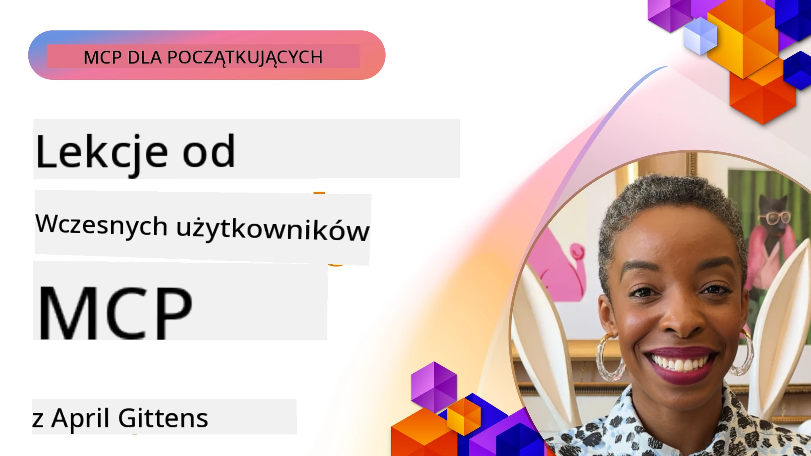

# 🌟 Lekcje od Wczesnych Użytkowników

[](https://youtu.be/jds7dSmNptE)

_(Kliknij powyższy obraz, aby obejrzeć wideo z tej lekcji)_

## 🎯 Co obejmuje ten moduł

Ten moduł bada, jak rzeczywiste organizacje i deweloperzy wykorzystują Model Context Protocol (MCP) do rozwiązywania prawdziwych wyzwań i napędzania innowacji. Poprzez szczegółowe studia przypadków, praktyczne projekty i przykłady dowiesz się, jak MCP umożliwia bezpieczną, skalowalną integrację AI łączącą modele językowe, narzędzia i dane przedsiębiorstwa.

### 📚 Zobacz MCP w praktyce

Chcesz zobaczyć, jak te zasady są stosowane w gotowych do produkcji narzędziach? Sprawdź nasz [**10 Microsoft MCP Servers That Are Transforming Developer Productivity**](microsoft-mcp-servers.md), który prezentuje rzeczywiste serwery Microsoft MCP dostępne już dziś.

## Przegląd

Ta lekcja pokazuje, jak wczesni użytkownicy wykorzystali Model Context Protocol (MCP) do rozwiązywania rzeczywistych problemów i napędzania innowacji w różnych branżach. Poprzez szczegółowe studia przypadków i praktyczne projekty zobaczysz, jak MCP umożliwia standaryzowaną, bezpieczną i skalowalną integrację AI — łącząc duże modele językowe, narzędzia i dane przedsiębiorstwa w zintegrowanym systemie. Zdobędziesz praktyczne doświadczenie w projektowaniu i budowie rozwiązań opartych na MCP, poznasz sprawdzone wzorce implementacji oraz odkryjesz najlepsze praktyki wdrażania MCP w środowiskach produkcyjnych. Lekcja podkreśla także pojawiające się trendy, przyszłe kierunki rozwoju oraz zasoby open-source, które pomogą Ci pozostać na czele technologii MCP i jej rozwijającego się ekosystemu.

## Cele nauki

- Analizować rzeczywiste implementacje MCP w różnych branżach
- Projektować i budować kompletne aplikacje oparte na MCP
- Eksplorować pojawiające się trendy i przyszłe kierunki w technologii MCP
- Stosować najlepsze praktyki w rzeczywistych scenariuszach rozwojowych

## Rzeczywiste implementacje MCP

### Studium przypadku 1: Automatyzacja obsługi klienta w przedsiębiorstwie

Międzynarodowa korporacja wdrożyła rozwiązanie oparte na MCP, aby znormalizować interakcje AI w ich systemach obsługi klienta. Pozwoliło im to na:

- Stworzenie jednolitego interfejsu dla wielu dostawców dużych modeli językowych
- Utrzymanie spójnego zarządzania promptami w różnych działach
- Wdrożenie solidnych mechanizmów bezpieczeństwa i zgodności
- Łatwe przełączanie między różnymi modelami AI w zależności od potrzeb

**Implementacja techniczna:**

```python
# Implementacja serwera MCP w Pythonie dla wsparcia klienta
import logging
import asyncio
from modelcontextprotocol import create_server, ServerConfig
from modelcontextprotocol.server import MCPServer
from modelcontextprotocol.transports import create_http_transport
from modelcontextprotocol.resources import ResourceDefinition
from modelcontextprotocol.prompts import PromptDefinition
from modelcontextprotocol.tool import ToolDefinition

# Konfiguracja logowania
logging.basicConfig(level=logging.INFO)

async def main():
    # Utwórz konfigurację serwera
    config = ServerConfig(
        name="Enterprise Customer Support Server",
        version="1.0.0",
        description="MCP server for handling customer support inquiries"
    )
    
    # Inicjalizuj serwer MCP
    server = create_server(config)
    
    # Zarejestruj zasoby bazy wiedzy
    server.resources.register(
        ResourceDefinition(
            name="customer_kb",
            description="Customer knowledge base documentation"
        ),
        lambda params: get_customer_documentation(params)
    )
    
    # Zarejestruj szablony zapytań
    server.prompts.register(
        PromptDefinition(
            name="support_template",
            description="Templates for customer support responses"
        ),
        lambda params: get_support_templates(params)
    )
    
    # Zarejestruj narzędzia wsparcia
    server.tools.register(
        ToolDefinition(
            name="ticketing",
            description="Create and update support tickets"
        ),
        handle_ticketing_operations
    )
    
    # Uruchom serwer z transportem HTTP
    transport = create_http_transport(port=8080)
    await server.run(transport)

if __name__ == "__main__":
    asyncio.run(main())
```

**Wyniki:** Redukcja kosztów modeli o 30%, poprawa spójności odpowiedzi o 45% oraz zwiększenie zgodności w globalnej działalności.

### Studium przypadku 2: Asystent diagnostyczny w służbie zdrowia

Dostawca usług medycznych opracował infrastrukturę MCP do integracji wielu specjalistycznych modeli AI medycznych, jednocześnie zapewniając ochronę wrażliwych danych pacjentów:

- Płynne przełączanie między modelami ogólnymi i specjalistycznymi
- Ścisła kontrola prywatności i ścieżki audytowe
- Integracja z istniejącymi systemami Elektronicznej Dokumentacji Medycznej (EHR)
- Spójne tworzenie promptów dla terminologii medycznej

**Implementacja techniczna:**

```csharp
// C# MCP host application implementation in healthcare application
using Microsoft.Extensions.DependencyInjection;
using ModelContextProtocol.SDK.Client;
using ModelContextProtocol.SDK.Security;
using ModelContextProtocol.SDK.Resources;

public class DiagnosticAssistant
{
    private readonly MCPHostClient _mcpClient;
    private readonly PatientContext _patientContext;
    
    public DiagnosticAssistant(PatientContext patientContext)
    {
        _patientContext = patientContext;
        
        // Configure MCP client with healthcare-specific settings
        var clientOptions = new ClientOptions
        {
            Name = "Healthcare Diagnostic Assistant",
            Version = "1.0.0",
            Security = new SecurityOptions
            {
                Encryption = EncryptionLevel.Medical,
                AuditEnabled = true
            }
        };
        
        _mcpClient = new MCPHostClientBuilder()
            .WithOptions(clientOptions)
            .WithTransport(new HttpTransport("https://healthcare-mcp.example.org"))
            .WithAuthentication(new HIPAACompliantAuthProvider())
            .Build();
    }
    
    public async Task<DiagnosticSuggestion> GetDiagnosticAssistance(
        string symptoms, string patientHistory)
    {
        // Create request with appropriate resources and tool access
        var resourceRequest = new ResourceRequest
        {
            Name = "patient_records",
            Parameters = new Dictionary<string, object>
            {
                ["patientId"] = _patientContext.PatientId,
                ["requestingProvider"] = _patientContext.ProviderId
            }
        };
        
        // Request diagnostic assistance using appropriate prompt
        var response = await _mcpClient.SendPromptRequestAsync(
            promptName: "diagnostic_assistance",
            parameters: new Dictionary<string, object>
            {
                ["symptoms"] = symptoms,
                patientHistory = patientHistory,
                relevantGuidelines = _patientContext.GetRelevantGuidelines()
            });
            
        return DiagnosticSuggestion.FromMCPResponse(response);
    }
}
```

**Wyniki:** Ulepszone sugestie diagnostyczne dla lekarzy przy pełnej zgodności z HIPAA i istotne zmniejszenie przełączania się między systemami.

### Studium przypadku 3: Analiza ryzyka w usługach finansowych

Instytucja finansowa wdrożyła MCP, aby znormalizować procesy analizy ryzyka w różnych działach:

- Stworzyła jednolity interfejs dla modeli ryzyka kredytowego, wykrywania oszustw i ryzyka inwestycyjnego
- Wdrożyła ścisłe kontrole dostępu i wersjonowanie modeli
- Zapewniła audytowalność wszystkich rekomendacji AI
- Utrzymała spójne formatowanie danych w różnych systemach

**Implementacja techniczna:**

```java
// Serwer MCP w Javie do oceny ryzyka finansowego
import org.mcp.server.*;
import org.mcp.security.*;

public class FinancialRiskMCPServer {
    public static void main(String[] args) {
        // Utwórz serwer MCP z funkcjami zgodności finansowej
        MCPServer server = new MCPServerBuilder()
            .withModelProviders(
                new ModelProvider("risk-assessment-primary", new AzureOpenAIProvider()),
                new ModelProvider("risk-assessment-audit", new LocalLlamaProvider())
            )
            .withPromptTemplateDirectory("./compliance/templates")
            .withAccessControls(new SOCCompliantAccessControl())
            .withDataEncryption(EncryptionStandard.FINANCIAL_GRADE)
            .withVersionControl(true)
            .withAuditLogging(new DatabaseAuditLogger())
            .build();
            
        server.addRequestValidator(new FinancialDataValidator());
        server.addResponseFilter(new PII_RedactionFilter());
        
        server.start(9000);
        
        System.out.println("Financial Risk MCP Server running on port 9000");
    }
}
```

**Wyniki:** Zwiększona zgodność regulacyjna, o 40% szybsze cykle wdrażania modeli oraz poprawa spójności oceny ryzyka w działach.

### Studium przypadku 4: Microsoft Playwright MCP Server do automatyzacji przeglądarki

Microsoft opracował [serwer Playwright MCP](https://github.com/microsoft/playwright-mcp), aby umożliwić bezpieczną, standaryzowaną automatyzację przeglądarki przez Model Context Protocol. Ten gotowy do produkcji serwer pozwala agentom AI i dużym modelom językowym na interakcję z przeglądarkami internetowymi w sposób kontrolowany, audytowalny i rozszerzalny — umożliwiając zastosowania takie jak zautomatyzowane testy webowe, ekstrakcja danych i kompleksowe przepływy pracy.

> **🎯 Narzędzie gotowe do produkcji**
> 
> To studium przypadku prezentuje rzeczywisty serwer MCP, którego możesz używać już dziś! Dowiedz się więcej o Playwright MCP Server i 9 innych gotowych do produkcji serwerach Microsoft MCP w naszym [**Przewodniku po serwerach Microsoft MCP**](microsoft-mcp-servers.md#8--playwright-mcp-server).

**Kluczowe funkcje:**
- Udostępnia możliwości automatyzacji przeglądarki (nawigacja, wypełnianie formularzy, przechwytywanie zrzutów ekranu itp.) jako narzędzia MCP
- Wdraża ścisłe kontrole dostępu i sandboxing, aby zapobiec nieautoryzowanym działaniom
- Dostarcza szczegółowe logi audytowe wszystkich interakcji z przeglądarką
- Wspiera integrację z Azure OpenAI i innymi dostawcami LLM dla automatyzacji sterowanej agentami
- Zasila agenta kodowania GitHub Copilot z funkcjami przeglądania sieci

**Implementacja techniczna:**

```typescript
// TypeScript: Rejestrowanie narzędzi automatyzacji przeglądarki Playwright w serwerze MCP
import { createServer, ToolDefinition } from 'modelcontextprotocol';
import { launch } from 'playwright';

const server = createServer({
  name: 'Playwright MCP Server',
  version: '1.0.0',
  description: 'MCP server for browser automation using Playwright'
});

// Zarejestruj narzędzie do nawigacji do URL i robienia zrzutu ekranu
server.tools.register(
  new ToolDefinition({
    name: 'navigate_and_screenshot',
    description: 'Navigate to a URL and capture a screenshot',
    parameters: {
      url: { type: 'string', description: 'The URL to visit' }
    }
  }),
  async ({ url }) => {
    const browser = await launch();
    const page = await browser.newPage();
    await page.goto(url);
    const screenshot = await page.screenshot();
    await browser.close();
    return { screenshot };
  }
);

// Uruchom serwer MCP
server.listen(8080);
```

**Wyniki:**

- Umożliwienie bezpiecznej, programowej automatyzacji przeglądarek dla agentów AI i LLM
- Zmniejszenie nakładu pracy ręcznych testów i poprawa pokrycia testowego aplikacji webowych
- Dostarczenie wielokrotnego użytku, rozszerzalnej platformy do integracji narzędzi opartych na przeglądarce w środowiskach korporacyjnych
- Zasila funkcje przeglądania sieci GitHub Copilot

**Referencje:**

- [Playwright MCP Server GitHub Repository](https://github.com/microsoft/playwright-mcp)
- [Microsoft AI and Automation Solutions](https://azure.microsoft.com/en-us/products/ai-services/)

### Studium przypadku 5: Azure MCP – Model Context Protocol klasy przedsiębiorstw jako usługa

Azure MCP Server ([https://aka.ms/azmcp](https://aka.ms/azmcp)) to zarządzana przez Microsoft wdrożenie Model Context Protocol klasy przedsiębiorstw, zaprojektowane do zapewniania skalowalnych, bezpiecznych i zgodnych z przepisami możliwości serwera MCP jako usługi w chmurze. Azure MCP umożliwia organizacjom szybkie wdrażanie, zarządzanie i integrację serwerów MCP z usługami Azure AI, danymi i bezpieczeństwem, zmniejszając nakład operacyjny i przyspieszając wdrażanie AI.

> **🎯 Narzędzie gotowe do produkcji**
> 
> To jest prawdziwy serwer MCP, którego możesz używać już dziś! Dowiedz się więcej o Microsoft Foundry MCP Server w naszym [**Przewodniku po serwerach Microsoft MCP**](microsoft-mcp-servers.md).


- Całkowicie zarządzany hosting serwera MCP z wbudowanym skalowaniem, monitorowaniem i zabezpieczeniami
- Nattywna integracja z Azure OpenAI, Azure AI Search i innymi usługami Azure
- Uwierzytelnianie i autoryzacja przedsiębiorstw poprzez Microsoft Entra ID
- Wsparcie dla niestandardowych narzędzi, szablonów promptów i konektorów zasobów
- Zgodność z wymaganiami bezpieczeństwa i regulacyjnymi przedsiębiorstw

**Implementacja techniczna:**

```yaml
# Example: Azure MCP server deployment configuration (YAML)
apiVersion: mcp.microsoft.com/v1
kind: McpServer
metadata:
  name: enterprise-mcp-server
spec:
  modelProviders:
    - name: azure-openai
      type: AzureOpenAI
      endpoint: https://<your-openai-resource>.openai.azure.com/
      apiKeySecret: <your-azure-keyvault-secret>
  tools:
    - name: document_search
      type: AzureAISearch
      endpoint: https://<your-search-resource>.search.windows.net/
      apiKeySecret: <your-azure-keyvault-secret>
  authentication:
    type: EntraID
    tenantId: <your-tenant-id>
  monitoring:
    enabled: true
    logAnalyticsWorkspace: <your-log-analytics-id>
```

**Wyniki:**  
- Skrócony czas przynoszenia wartości projektów AI przedsiębiorstw dzięki gotowej, zgodnej platformie serwerów MCP
- Uproszczenie integracji LLM, narzędzi i źródeł danych przedsiębiorstw
- Zwiększone bezpieczeństwo, obserwowalność i efektywność operacyjna obciążeń MCP
- Poprawa jakości kodu dzięki najlepszym praktykom Azure SDK i współczesnym wzorcom uwierzytelniania

**Referencje:**  
- [Dokumentacja Azure MCP](https://aka.ms/azmcp)
- [Azure MCP Server GitHub Repository](https://github.com/Azure/azure-mcp)
- [Usługi Azure AI](https://azure.microsoft.com/en-us/products/ai-services/)
- [Microsoft MCP Center](https://mcp.azure.com)

## Studium przypadku 6: NLWeb 
MCP (Model Context Protocol) to nowy protokół umożliwiający chatbotom i asystentom AI interakcję z narzędziami. Każda instancja NLWeb jest również serwerem MCP, który obsługuje jedną podstawową metodę ask, służącą do zadawania pytań stronie internetowej w języku naturalnym. Zwracana odpowiedź wykorzystuje schema.org, powszechnie używaną słownictwo do opisywania danych sieciowych. W uproszczeniu, MCP jest dla NLWeb tym, czym HTTP jest dla HTML. NLWeb łączy protokoły, formaty Schema.org i przykładowy kod, aby pomóc stronom szybko tworzyć te punkty końcowe, przynosząc korzyści zarówno ludziom przez interfejsy konwersacyjne, jak i maszynom przez naturalną interakcję agent- agent.

NLWeb składa się z dwóch odrębnych komponentów.
- Protokół, bardzo prosty na początek, do interfejsu z witryną w języku naturalnym oraz format opierający się na json i schema.org dla zwracanej odpowiedzi. Szczegóły znajdziesz w dokumentacji REST API.
- Prosta implementacja (1), która wykorzystuje istniejący markup, dla stron, które można przedstawić jako listy elementów (produkty, przepisy, atrakcje, recenzje itp.). Wraz z zestawem widżetów interfejsu użytkownika, strony mogą łatwo zapewniać konwersacyjne interfejsy do swojej zawartości. Zobacz dokumentację o życiu zapytania czatu, aby dowiedzieć się więcej, jak to działa.
 
**Referencje:**  
- [Dokumentacja Azure MCP](https://aka.ms/azmcp)
- [NLWeb](https://github.com/microsoft/NlWeb)

### Studium przypadku 7: Microsoft Foundry MCP Server – Integracja agentów AI przedsiębiorstw

Serwery Microsoft Foundry MCP pokazują, jak MCP może być używany do orkiestracji i zarządzania agentami AI oraz przepływami pracy w środowiskach korporacyjnych. Poprzez integrację MCP z Microsoft Foundry organizacje mogą standaryzować interakcje agentów, wykorzystywać zarządzanie przepływem pracy Foundry oraz zapewnić bezpieczne i skalowalne wdrożenia.

> **🎯 Narzędzie gotowe do produkcji**
> 
> To jest prawdziwy serwer MCP, którego możesz używać już dziś! Dowiedz się więcej o Microsoft Foundry MCP Server w naszym [**Przewodniku po serwerach Microsoft MCP**](microsoft-mcp-servers.md#9--microsoft-foundry-mcp-server).

**Kluczowe funkcje:**
- Kompleksowy dostęp do ekosystemu AI Azure, w tym katalogów modeli i zarządzania wdrożeniami
- Indeksowanie wiedzy za pomocą Azure AI Search dla zastosowań RAG
- Narzędzia oceny wydajności modeli AI i zapewnienia jakości
- Integracja z Microsoft Foundry Catalog i Labs dla zaawansowanych modeli badawczych
- Zarządzanie agentami i możliwości oceny dla scenariuszy produkcyjnych

**Wyniki:**
- Szybkie prototypowanie i solidne monitorowanie przepływów pracy agentów AI
- Bezproblemowa integracja z usługami Azure AI dla zaawansowanych scenariuszy
- Jednolity interfejs do tworzenia, wdrażania i monitorowania pipeline'ów agentów
- Poprawa bezpieczeństwa, zgodności i efektywności operacyjnej przedsiębiorstw
- Przyspieszone wdrażanie AI przy zachowaniu kontroli nad złożonymi procesami prowadzonymi przez agentów

**Referencje:**
- [Microsoft Foundry MCP Server GitHub Repository](https://github.com/azure-ai-foundry/mcp-foundry)
- [Integracja agentów Azure AI z MCP (Blog Microsoft Foundry)](https://devblogs.microsoft.com/foundry/integrating-azure-ai-agents-mcp/)

### Studium przypadku 8: Foundry MCP Playground – Eksperymenty i prototypowanie

Foundry MCP Playground oferuje gotowe do użycia środowisko do eksperymentowania z serwerami MCP i integracjami Microsoft Foundry. Deweloperzy mogą szybko prototypować, testować i oceniać modele AI oraz przepływy pracy agentów z zasobami z katalogu i laboratoriów Microsoft Foundry. Playground upraszcza konfigurację, oferuje przykładowe projekty i wspiera rozwój zespołowy, ułatwiając eksplorację najlepszych praktyk i nowych scenariuszy przy minimalnym nakładzie. Jest szczególnie przydatny dla zespołów chcących weryfikować pomysły, dzielić się eksperymentami i przyspieszać naukę bez potrzeby skomplikowanej infrastruktury. Obniżając próg wejścia, playground wspiera innowacje i wkład społeczności w ekosystem MCP i Microsoft Foundry.

**Referencje:**

- [Foundry MCP Playground GitHub Repository](https://github.com/azure-ai-foundry/foundry-mcp-playground)

### Studium przypadku 9: Microsoft Learn Docs MCP Server – Dokumentacja wspomagana AI

Microsoft Learn Docs MCP Server to usługa hostowana w chmurze, która zapewnia asystentom AI dostęp w czasie rzeczywistym do oficjalnej dokumentacji Microsoft za pomocą Model Context Protocol. Ten gotowy do produkcji serwer łączy się z rozbudowanym ekosystemem Microsoft Learn i umożliwia semantyczne wyszukiwanie we wszystkich oficjalnych źródłach Microsoft.

> **🎯 Narzędzie gotowe do produkcji**
> 
> To jest prawdziwy serwer MCP, którego możesz używać już dziś! Dowiedz się więcej o Microsoft Learn Docs MCP Server w naszym [**Przewodniku po serwerach Microsoft MCP**](microsoft-mcp-servers.md#1--microsoft-learn-docs-mcp-server).

**Kluczowe funkcje:**
- Dostęp w czasie rzeczywistym do oficjalnej dokumentacji Microsoft, dokumentacji Azure i Microsoft 365
- Zaawansowane możliwości semantycznego wyszukiwania rozumiejące kontekst i intencje
- Zawsze aktualne informacje, ponieważ treści Microsoft Learn są publikowane na bieżąco
- Kompleksowe pokrycie Microsoft Learn, dokumentacji Azure i źródeł Microsoft 365
- Zwraca do 10 wysokiej jakości fragmentów treści z tytułami artykułów i adresami URL

**Dlaczego to ważne:**
- Rozwiązuje problem „przestarzałej wiedzy AI” dla technologii Microsoft
- Zapewnia asystentom AI dostęp do najnowszych funkcji .NET, C#, Azure i Microsoft 365
- Dostarcza autorytatywne informacje pierwszej ręki dla dokładnego generowania kodu
- Niezbędne dla programistów pracujących z szybko ewoluującymi technologiami Microsoft

**Wyniki:**
- Drastycznie poprawiona dokładność generowanego kodu AI dla technologii Microsoft
- Skrócony czas poszukiwania aktualnej dokumentacji i najlepszych praktyk
- Zwiększona produktywność deweloperów dzięki dokumentacji świadomej kontekstu
- Bezproblemowa integracja z workflow rozwojowymi bez wychodzenia z IDE

**Referencje:**
- [Microsoft Learn Docs MCP Server GitHub Repository](https://github.com/MicrosoftDocs/mcp)
- [Dokumentacja Microsoft Learn](https://learn.microsoft.com/)

## Projekty praktyczne

### Projekt 1: Budowa serwera MCP z wieloma dostawcami

**Cel:** Stwórz serwer MCP, który może kierować żądania do wielu dostawców modeli AI w zależności od określonych kryteriów.

**Wymagania:**

- Wsparcie co najmniej trzech różnych dostawców modeli (np. OpenAI, Anthropic, modele lokalne)
- Implementacja mechanizmu routingu na podstawie metadanych żądań
- Stworzenie systemu konfiguracji do zarządzania poświadczeniami dostawców
- Dodanie cache'owania w celu optymalizacji wydajności i kosztów
- Zbudowanie prostego panelu monitorującego zużycie

**Kroki wdrożenia:**

1. Skonfiguruj podstawową infrastrukturę serwera MCP
2. Zaimplementuj adaptery dostawców dla każdej usługi modeli AI
3. Stwórz logikę routingu opartą na atrybutach żądań
4. Dodaj mechanizmy cache'owania dla często występujących żądań
5. Opracuj panel monitorujący
6. Przetestuj na różnych wzorcach żądań

**Technologie:** Wybierz spośród Python (.NET/Java/Python według preferencji), Redis do cache'owania oraz prosty framework webowy do panelu.

### Projekt 2: System zarządzania promptami dla przedsiębiorstw

**Cel:** Rozwijanie systemu opartego na MCP do zarządzania, wersjonowania i wdrażania szablonów promptów w organizacji.

**Wymagania:**


- Utwórz scentralizowane repozytorium dla szablonów promptów
- Wdroż wersjonowanie i przepływy pracy zatwierdzania
- Zbuduj możliwości testowania szablonów z przykładowymi danymi wejściowymi
- Opracuj kontrolę dostępu opartą na rolach
- Stwórz API do pobierania i wdrażania szablonów

**Kroki wdrożeniowe:**

1. Zaprojektuj schemat bazy danych do przechowywania szablonów
2. Utwórz podstawowe API do operacji CRUD na szablonach
3. Wdroż system wersjonowania
4. Zbuduj przepływ pracy zatwierdzania
5. Opracuj framework testowania
6. Stwórz prosty interfejs webowy do zarządzania
7. Zintegruj się z serwerem MCP

**Technologie:** Wybrany przez Ciebie framework backendowy, baza danych SQL lub NoSQL oraz framework frontendowy do interfejsu zarządzania.

### Projekt 3: Platforma generowania treści oparta na MCP

**Cel:** Zbuduj platformę generującą treści, która korzysta z MCP, aby zapewnić spójne wyniki dla różnych typów treści.

**Wymagania:**

- Obsługa wielu formatów treści (posty na bloga, media społecznościowe, teksty marketingowe)
- Wdroż generowanie oparte na szablonach z opcjami dostosowywania
- Stwórz system przeglądu treści i informacji zwrotnej
- Śledzenie metryk wydajności treści
- Obsługa wersjonowania i iteracji treści

**Kroki wdrożeniowe:**

1. Skonfiguruj infrastrukturę klienta MCP
2. Utwórz szablony dla różnych typów treści
3. Zbuduj pipeline generowania treści
4. Wdroż system recenzji
5. Opracuj system śledzenia metryk
6. Stwórz interfejs użytkownika do zarządzania szablonami i generowania treści

**Technologie:** Preferowany język programowania, framework webowy i system bazy danych.

## Przyszłe kierunki rozwoju technologii MCP

### Nowe trendy

1. **Multi-modalny MCP**
   - Rozszerzenie MCP o standaryzację interakcji z modelami obrazów, dźwięków i wideo
   - Rozwój zdolności rozumowania międzymodalnego
   - Standaryzowane formaty promptów dla różnych modalności

2. **Federacyjna infrastruktura MCP**
   - Rozproszone sieci MCP umożliwiające współdzielenie zasobów pomiędzy organizacjami
   - Standardowe protokoły do bezpiecznego udostępniania modeli
   - Techniki obliczeń chroniących prywatność

3. **Rynki MCP**
   - Ekosystemy do dzielenia się i monetyzacji szablonów oraz wtyczek MCP
   - Procesy zapewniania jakości i certyfikacji
   - Integracje z rynkami modeli

4. **MCP dla edge computingu**
   - Adaptacja standardów MCP do urządzeń edge o ograniczonych zasobach
   - Optymalizowane protokoły do środowisk o niskim pasmie
   - Specjalistyczne implementacje MCP dla ekosystemów IoT

5. **Ramowe regulacje prawne**
   - Rozwój rozszerzeń MCP dla zgodności regulacyjnej
   - Standaryzowane ścieżki audytowe i interfejsy wyjaśnialności
   - Integracja z nowo powstającymi ramami zarządzania AI

### Rozwiązania MCP od Microsoft

Microsoft i Azure opracowały kilka repozytoriów open-source, które pomagają programistom wdrażać MCP w różnych scenariuszach:

#### Organizacja Microsoft

1. [playwright-mcp](https://github.com/microsoft/playwright-mcp) - Serwer MCP Playwright do automatyzacji i testów przeglądarki
2. [files-mcp-server](https://github.com/microsoft/files-mcp-server) - Implementacja serwera MCP OneDrive do lokalnego testowania i wkładu społeczności
3. [NLWeb](https://github.com/microsoft/NlWeb) - NLWeb to zbiór otwartych protokołów i powiązanych narzędzi open source, skoncentrowanych na budowie fundamentu dla AI Web

#### Organizacja Azure-Samples

1. [mcp](https://github.com/Azure-Samples/mcp) - Linki do przykładów, narzędzi i zasobów do budowy i integracji serwerów MCP na platformie Azure z wykorzystaniem wielu języków programowania
2. [mcp-auth-servers](https://github.com/Azure-Samples/mcp-auth-servers) - Referencyjne serwery MCP demonstrujące uwierzytelnianie według aktualnej specyfikacji Model Context Protocol
3. [remote-mcp-functions](https://github.com/Azure-Samples/remote-mcp-functions) - Strona startowa dla zdalnych implementacji serwerów MCP w Azure Functions z linkami do repozytoriów specyficznych dla języków
4. [remote-mcp-functions-python](https://github.com/Azure-Samples/remote-mcp-functions-python) - Szablon startowy do budowy i wdrażania niestandardowych zdalnych serwerów MCP w Azure Functions przy użyciu Pythona
5. [remote-mcp-functions-dotnet](https://github.com/Azure-Samples/remote-mcp-functions-dotnet) - Szablon startowy do budowy i wdrażania niestandardowych zdalnych serwerów MCP w Azure Functions przy użyciu .NET/C#
6. [remote-mcp-functions-typescript](https://github.com/Azure-Samples/remote-mcp-functions-typescript) - Szablon startowy do budowy i wdrażania niestandardowych zdalnych serwerów MCP w Azure Functions przy użyciu TypeScript
7. [remote-mcp-apim-functions-python](https://github.com/Azure-Samples/remote-mcp-apim-functions-python) - Azure API Management jako brama AI do zdalnych serwerów MCP korzystających z Pythona
8. [AI-Gateway](https://github.com/Azure-Samples/AI-Gateway) - Eksperymenty APIM ❤️ AI, w tym możliwości MCP, integrujące się z Azure OpenAI i AI Foundry

Te repozytoria dostarczają różne implementacje, szablony i zasoby do pracy z Modelem Context Protocol w różnych językach programowania i usługach Azure. Obejmują one szeroki zakres zastosowań, od podstawowych implementacji serwerów po uwierzytelnianie, wdrożenia w chmurze oraz scenariusze integracji korporacyjnej.

#### Katalog zasobów MCP

[Katalog zasobów MCP](https://github.com/microsoft/mcp/tree/main/Resources) w oficjalnym repozytorium Microsoft MCP zawiera wyselekcjonowany zbiór przykładowych zasobów, szablonów promptów oraz definicji narzędzi do użycia z serwerami Model Context Protocol. Katalog ten ma pomóc programistom szybko rozpocząć pracę z MCP, oferując wielokrotnego użytku bloki konstrukcyjne i przykłady najlepszych praktyk dla:

- **Szablony promptów:** Gotowe do użycia szablony dla typowych zadań i scenariuszy AI, które można dostosować do własnych implementacji serwerów MCP.
- **Definicje narzędzi:** Przykładowe schematy narzędzi i metadane do standaryzacji integracji i wywoływania narzędzi w różnych serwerach MCP.
- **Przykładowe zasoby:** Przykładowe definicje zasobów do łączenia się z źródłami danych, API i usługami zewnętrznymi w ramach MCP.
- **Przykładowe implementacje:** Praktyczne przykłady pokazujące, jak strukturyzować i organizować zasoby, prompty i narzędzia w prawdziwych projektach MCP.

Te zasoby przyspieszają rozwój, promują standaryzację i pomagają zapewnić najlepsze praktyki podczas budowania i wdrażania rozwiązań opartych na MCP.

#### Katalog zasobów MCP

- [MCP Resources (Sample Prompts, Tools, and Resource Definitions)](https://github.com/microsoft/mcp/tree/main/Resources)

### Możliwości badawcze

- Efektywne techniki optymalizacji promptów w ramach MCP
- Modele bezpieczeństwa dla wdrożeń MCP wieloużytkownikowych
- Benchmarking wydajności różnych implementacji MCP
- Formalne metody weryfikacji serwerów MCP

## Podsumowanie

Model Context Protocol (MCP) szybko kształtuje przyszłość standaryzowanej, bezpiecznej i interoperacyjnej integracji AI w różnych branżach. Poprzez studia przypadków i praktyczne projekty w tej lekcji, widziałeś, jak wczesni użytkownicy — w tym Microsoft i Azure — wykorzystują MCP do rozwiązywania rzeczywistych wyzwań, przyspieszania adopcji AI oraz zapewniania zgodności, bezpieczeństwa i skalowalności. Modularne podejście MCP umożliwia organizacjom łączenie dużych modeli językowych, narzędzi i danych korporacyjnych w zintegrowanym, audytowalnym frameworku. W miarę jak MCP będzie się rozwijać, kluczowe dla budowy solidnych, gotowych na przyszłość rozwiązań AI będzie utrzymywanie kontaktu ze społecznością, eksploracja zasobów open-source oraz stosowanie najlepszych praktyk.

## Dodatkowe zasoby

- [Repozytorium MCP Foundry na GitHubie](https://github.com/azure-ai-foundry/mcp-foundry)
- [MCP Playground Foundry](https://github.com/azure-ai-foundry/foundry-mcp-playground)
- [Integracja agentów Azure AI z MCP (Blog Microsoft Foundry)](https://devblogs.microsoft.com/foundry/integrating-azure-ai-agents-mcp/)
- [Repozytorium MCP na GitHubie (Microsoft)](https://github.com/microsoft/mcp)
- [Katalog zasobów MCP (przykłady promptów, narzędzi i definicji zasobów)](https://github.com/microsoft/mcp/tree/main/Resources)
- [Społeczność MCP i Dokumentacja](https://modelcontextprotocol.io/introduction)
- [Specyfikacja MCP (2026-07-28)](https://modelcontextprotocol.io/specification/2026-07-28/)
- [Dokumentacja Azure MCP](https://aka.ms/azmcp)
- [OWASP MCP Top 10](https://microsoft.github.io/mcp-azure-security-guide/mcp/) - Najlepsze praktyki bezpieczeństwa
- [Repozytorium Playwright MCP Server na GitHubie](https://github.com/microsoft/playwright-mcp)
- [Files MCP Server (OneDrive)](https://github.com/microsoft/files-mcp-server)
- [Azure-Samples MCP](https://github.com/Azure-Samples/mcp)
- [MCP Auth Servers (Azure-Samples)](https://github.com/Azure-Samples/mcp-auth-servers)
- [Remote MCP Functions (Azure-Samples)](https://github.com/Azure-Samples/remote-mcp-functions)
- [Remote MCP Functions Python (Azure-Samples)](https://github.com/Azure-Samples/remote-mcp-functions-python)
- [Remote MCP Functions .NET (Azure-Samples)](https://github.com/Azure-Samples/remote-mcp-functions-dotnet)
- [Remote MCP Functions TypeScript (Azure-Samples)](https://github.com/Azure-Samples/remote-mcp-functions-typescript)
- [Remote MCP APIM Functions Python (Azure-Samples)](https://github.com/Azure-Samples/remote-mcp-apim-functions-python)
- [AI-Gateway (Azure-Samples)](https://github.com/Azure-Samples/AI-Gateway)
- [Microsoft AI i rozwiązania automatyzacji](https://azure.microsoft.com/en-us/products/ai-services/)

## Ćwiczenia

1. Przeanalizuj jedno ze studiów przypadków i zaproponuj alternatywne podejście do implementacji.
2. Wybierz jeden z pomysłów na projekt i stwórz szczegółową specyfikację techniczną.
3. Zbadaj branżę, która nie została omówiona w studiach przypadków, i nakreśl, jak MCP mogłoby rozwiązać jej specyficzne wyzwania.
4. Zbadaj jeden z przyszłych kierunków i stwórz koncept nowego rozszerzenia MCP wspierającego go.

## Co dalej

Poznaj więcej: [Microsoft MCP Servers](./microsoft-mcp-servers.md)

Kontynuuj: [Moduł 8: Najlepsze praktyki](../08-BestPractices/README.md)

---

<!-- CO-OP TRANSLATOR DISCLAIMER START -->
**Zastrzeżenie**:
Niniejszy dokument został przetłumaczony za pomocą usługi tłumaczenia AI [Co-op Translator](https://github.com/Azure/co-op-translator). Choć dążymy do dokładności, prosimy pamiętać, że automatyczne tłumaczenia mogą zawierać błędy lub niedokładności. Oryginalny dokument w jego języku źródłowym należy uznawać za autorytatywne źródło. W przypadku informacji krytycznych zalecane jest skorzystanie z profesjonalnego tłumaczenia wykonanego przez człowieka. Nie ponosimy odpowiedzialności za jakiekolwiek nieporozumienia lub błędne interpretacje wynikające z użycia tego tłumaczenia.
<!-- CO-OP TRANSLATOR DISCLAIMER END -->