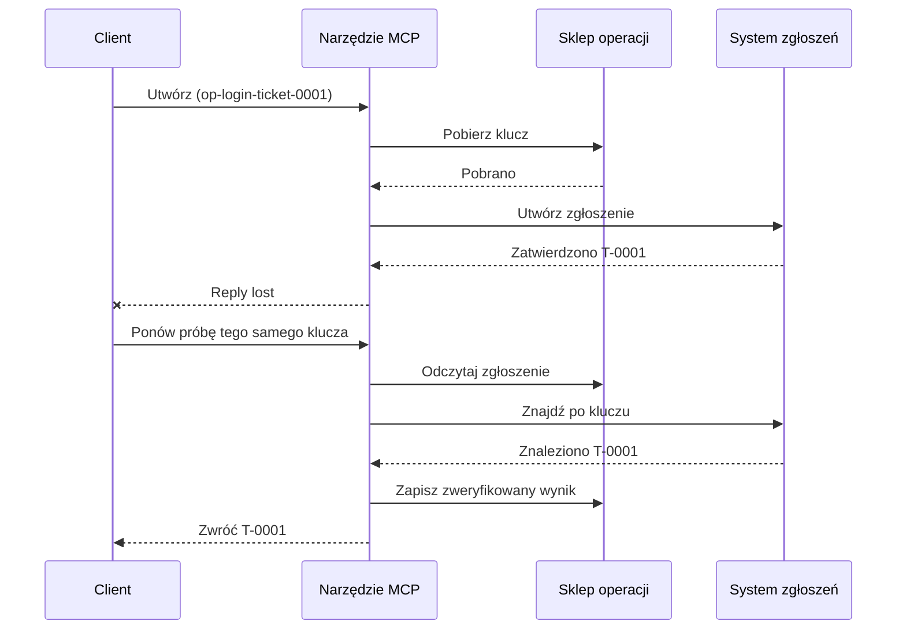
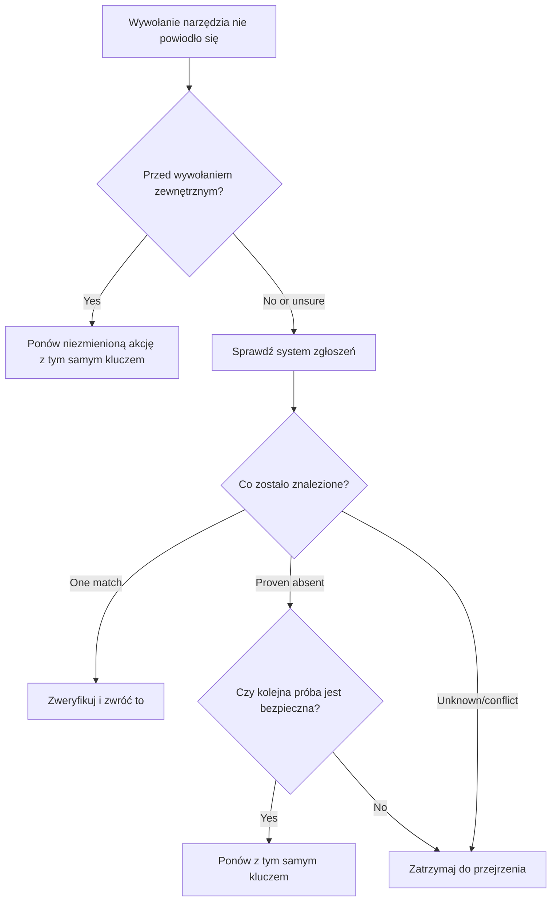

# Bezpieczne ponawianie prób dla narzędzi MCP: wzorzec niezawodności Sidecar

Brak odpowiedzi nie oznacza, że działanie nie zostało wykonane. Narzędzie do zgłoszeń wsparcia
może utworzyć zgłoszenie `T-0001`, a następnie stracić połączenie zanim klient zobaczy
wynik. Jeśli klient będzie ponawiał próbę bez rozróżnienia, może utworzyć `T-0002`.

Ta lekcja pokazuje, jak rozpoznać taki niepewny wynik, utrzymać jedną stabilną
tożsamość dla zamierzonego działania oraz sprawdzić system zgłoszeń przed ponowną próbą.
Towarzyszące ćwiczenie w Pythonie działa lokalnie z użyciem standardowej biblioteki
oraz SQLite.

## Dlaczego przekroczenie limitu czasu oznacza "wynik nieznany"

Załóżmy, że klient wywołuje `create_support_ticket` z kluczem operacji
`op-login-ticket-0001`:



Połączenie zawodzi po zatwierdzeniu zgłoszenia, ale przed nadejściem wyniku.
Klient wie tylko, że odpowiedź jest nieobecna. Nie wie, czy
zgłoszenie istnieje. Ponowne użycie klucza operacji pozwala narzędziu odnaleźć i zwrócić
`T-0001` zamiast tworzyć `T-0002`.

## Co robi niezawodny Sidecar

Sidecar niezawodności to kod aplikacji, który utrzymuje stan odzyskiwania wokół
narzędzia. Może to być biblioteka, middleware, usługa oparta na bazie danych lub po prostu
część implementacji narzędzia. Nie musi to być osobny proces,
i nie jest to funkcja protokołu MCP.

Sidecar ma cztery zadania:

1. zapisać zamierzone działanie przed wywołaniem systemu zewnętrznego;
2. pozwolić tylko jednemu workerowi przejąć to działanie;
3. zapamiętać wystarczająco dużo stanu, aby odzyskać po awarii; oraz
4. sprawdzić system zewnętrzny, gdy wynik jest niepewny.

Ta lekcja jest skierowana do ostatecznej specyfikacji MCP `2026-07-28`. MCP nie ma
sesji na poziomie protokołu, więc klucz operacji jest zwykłym argumentem narzędzia
wspieranym trwałym stanem aplikacji. Ten sam wzorzec działa również z wcześniejszymi
wersjami MCP.

## Cztery identyfikatory rozwiązujące różne problemy

Te identyfikatory są powiązane, ale nie są zamienne:

| Identyfikator | Co identyfikuje | Czy przetrwa ponowienie? |
| --- | --- | --- |
| ID JSON-RPC | Jedno żądanie i odpowiedź | Nie; użyj nowego ID żądania |
| ID zadania MCP | Jedno długotrwałe zadanie | Tak; zachowaj go do odpytywania |
| Klucz operacji | Jedno zamierzone działanie | Tak; używaj go ponownie dla tego działania |
| ID zgłoszenia | Przechowywany wynik | Tak; zwróć go po weryfikacji |

Powiadomienia o postępie i kontekst śledzenia pomagają obserwować żądanie.
Anulowanie prosi o zatrzymanie pracy. Żadne z nich nie zapobiega duplikatowi zgłoszenia.

## Zbuduj strażnika

Utwórz klucz operacji przed pierwszym wywołaniem narzędzia i zapisz go wraz z
workflow. Każda próba utworzenia tego samego zamierzonego zgłoszenia używa tego samego klucza:

```json
{
  "operation_key": "op-login-ticket-0001",
  "title": "Cannot sign in"
}
```

Inne zamierzone zgłoszenie otrzymuje nowy klucz. W produkcji generuj nieprzejrzystą,
nie do odgadnięcia wartość zamiast umieszczać dane klienta w kluczu.

Oto kompletny schemat narzędzia MCP używany w tej lekcji:

```json
{
  "name": "create_support_ticket",
  "title": "Create support ticket",
  "description": "Creates or recovers one support ticket for an operation key.",
  "inputSchema": {
    "$schema": "https://json-schema.org/draft/2020-12/schema",
    "type": "object",
    "properties": {
      "operation_key": {
        "type": "string",
        "minLength": 16,
        "maxLength": 128,
        "description": "Stable key reused for the same intended action."
      },
      "title": {
        "type": "string",
        "minLength": 1,
        "maxLength": 200
      }
    },
    "required": ["operation_key", "title"],
    "additionalProperties": false
  },
  "outputSchema": {
    "$schema": "https://json-schema.org/draft/2020-12/schema",
    "type": "object",
    "properties": {
      "ticket_id": {
        "type": "string"
      },
      "operation_key": {
        "type": "string"
      },
      "status": {
        "type": "string",
        "const": "verified"
      }
    },
    "required": ["ticket_id", "operation_key", "status"],
    "additionalProperties": false
  }
}
```

Uwierzytelniona tożsamość dzwoniącego pochodzi z kontekstu serwera, a nie z
danych wejściowych dostarczanych przez model. Zakres każdego zapisanego działania obejmuje:

- tego dzwoniącego, najemcę lub konto serwisowe;
- nazwę i wersję narzędzia; oraz
- hash znormalizowanych danych wejściowych definiujących działanie zewnętrzne.

Hash wejściowy odpowiada na proste pytanie: "Czy ta próba ponowienia dotyczy tego samego
zgłoszenia?" Jeśli klucz należy już do innego tytułu, odrzuć wywołanie.

Zwrot wcześniejszego wyniku dla zmienionego wejścia ukryłby błąd kontraktu.

Zapisz roszczenie za pomocą jednej atomowej operacji bazodanowej. "Atomowa" oznacza, że dwaj pracownicy
nie mogą jednocześnie zaobserwować pustego rekordu i obaj stać się właścicielem. Lokalny
blokada procesu nie wystarcza, gdy inna instancja serwera może otrzymać powtórkę.

Workflow tworzy klucz, gdy akcja jest `planned`. Przykład następnie
zapisuje te stany:

- `claimed`: jeden pracownik zarezerwował operację;
- `completed`: system biletowy zwrócił wynik; oraz
- `verified`: odczyt z systemu biletowego potwierdza wynik.

Awaria może pozostawić zapisany stan jako `claimed` nawet po utworzeniu biletu.
Traktuj każde niedające się zakończyć roszczenie jako niepewne, dopóki zewnętrzne dowody
tego nie potwierdzą. Nie zakładaj, że `claimed` oznacza "nic się nie stało."

## Odzyskaj przed ponowną próbą

Gdy wywołanie narzędzia się nie powiedzie, zdecyduj, co jest znane przed wysłaniem kolejnego zewnętrznego
zapisu:



Walidacja, która kończy się niepowodzeniem przed wywołaniem API biletu, jest znanym błędem.
Powtórz niezmienioną akcję z tym samym kluczem operacji. Jeśli korekta danych wejściowych
zmienia zamierzony bilet, utwórz nowy klucz dla tej nowej akcji.

Jeśli żądanie mogło dotrzeć do systemu biletowego, najpierw je pogodź.
Pojednanie oznacza porównanie zapisanego roszczenia z wiarygodnym rekordem biletu.
Zwróć istniejący bilet, gdy zostanie znaleziony dokładnie jeden pasujący rekord.
Powtórz tylko wtedy, gdy bilet jest jednoznacznie nieobecny i kontrakt pośredni
umożliwia bezpieczne podjęcie kolejnej próby.

"Nie znaleziono" nie zawsze jest rozstrzygające. Dostawca z ostatecznie spójnym
wyszukiwaniem może wymagać ograniczonego oczekiwania i kolejnego sprawdzenia. Jeśli systemu nie można
przeszukać, daje sprzeczne wyniki lub nie można bezpiecznie zduplikować kolejnej
próby, zatrzymaj i zgłoś `wynik nieznany`. Zatrzymanie się tutaj nazywa się czasem
"awarią zamkniętą": workflow odmawia zgadywania.

## Dowody, zadania i anulowanie

Odpowiedź narzędzia mówi, co narzędzie zgłosiło. Zapisany punkt kontrolny mówi, co
workflow zarejestrował. Najsilniejsze dowody pochodzą z systemu, który jest właścicielem
wyniku: dla tego przykładu, odczyt z systemu biletowego, który znajduje dokładnie jeden
pasujący bilet.

Dopasuj dowody do ryzyka. ID wiadomości dostawcy może wystarczyć do
powiadomienia o niskim ryzyku. Płatności, wdrożenia i destrukcyjne działania mogą
wymagać dowodów statusu dostawcy, księgi lub ręcznej kontroli.

Rozszerzenie MCP Tasks uzupełnia ten wzorzec dla długo trwającej pracy. ID zadania
pozwala klientowi wznowić odpytywanie po rozłączeniu, ale nie identyfikuje
ani nie eliminuje duplikatów samego biletu. Gdy używa się Tasks, tożsamości łączą się
w ten sposób:

```text
operation key -> Task ID -> ticket ID -> verification evidence
```

Anulowanie jest kooperacyjne, nie jest to wycofanie. Bilet może być nadal tworzony
po potwierdzeniu anulowania, więc niepewny wynik nadal wymaga
pojednania.

## Uruchom ćwiczenie wstrzyknięcia awarii

Przykład używa dwóch plików SQLite: jeden reprezentuje magazyn operacji, a
drugi reprezentuje zewnętrzny system biletowy. Nie ma transakcji obejmującej
oba pliki. Awaria jest wstrzykiwana po zatwierdzeniu biletu, ale przed
zapisaniem ukończenia przez sidecara.

Bezpośrednia metoda Python akceptuje `caller_id` jako zastępstwo uwierzytelnionego
kontekstu serwera. Nie dodawaj `caller_id` do schematu wejściowego MCP kontrolowanego modelem.


Przewidź wynik przed uruchomieniem testów:

| Path | Result after retry | Ticket count |
| --- | --- | --- |
| Blind retry | Tworzy `T-0002` po utracie odpowiedzi dla `T-0001` | 2 |

| Chroniona próba ponowienia | Znajduje i zwraca `T-0001` | 1 |

Uruchom:

```bash
cd 08-BestPractices/reliability-sidecars/python
python -m unittest discover -p "test_*.py" -v
```

Sześć testów pokazuje, że:

1. ślepa próba ponowienia tworzy duplikat;
2. utrata odpowiedzi plus ponowne uruchomienie odzyskuje jeden bilet z trwałego roszczenia;
3. zweryfikowana próba ponowienia ponownie używa zapisanego wyniku;
4. zmienione dane wejściowe lub konfliktujące dowody zewnętrzne są odrzucane;
5. istniejące roszczenie bez dowodów zewnętrznych zatrzymuje się bezpiecznie; oraz
6. współbieżne roszczenia dopuszczają jednego właściciela bez cofania zweryfikowanego wyniku.

Otwórz przykład:

- [Implementacja w Pythonie](../../../../08-BestPractices/reliability-sidecars/python/reliability_sidecar.py)
- [Deterministyczne testy](../../../../08-BestPractices/reliability-sidecars/python/test_reliability_sidecar.py)

Przykład celowo pomija dzierżawy nieaktualnych roszczeń. Polityka przejęcia produkcyjnego
wymaga ograniczonej dzierżawy, atomowego transferu własności oraz kolejnej zewnętrznej
kontroli przed wykonaniem.

## Opcjonalna implementacja społecznościowa

Agent Enhancer Utilities to jedna z implementacji społecznościowych tego
wzorca na poziomie aplikacji. Jej planista wybiera podejście do odzyskiwania, podczas gdy
punkt kontrolny rejestruje stany roszczeń i niepewnych wyników. Narzędzie domenowe lub serwer MCP
nadal wykonuje i weryfikuje prawdziwą akcję. Ta usługa nie jest częścią
specyfikacji MCP i nie jest wymagana w tej lekcji.

| Koncepcja lekcji | Element Agent Enhancer | Ważne ograniczenie |
| --- | --- | --- |
| Plan odzyskiwania | `workflow-guard-planner` | Nie wywołuje narzędzia domenowego |
| Roszczenie i odzyskiwanie | `workflow-checkpoint` | `external_proof` pozostaje `false` |
| Dokładne odtworzenie sidecara | `lab.invoke_tool` | Używa oddzielnego klucza idempotencji |
| Weryfikacja prawdziwej akcji | Wyszukiwanie/odczyt miejsca docelowego | Należy do domenowego MCP |

Dla dokładnej próby powtórnej wywołania jednego sidecara, `lab.invoke_tool` akceptuje zewnętrzny
`idempotency_key`. Ten klucz identyfikuje wywołanie sidecara; nie jest to
biznesowy `operation_key` używany dla biletu.

Oznakowany publiczny kontrakt oraz opcjonalny przykład sieciowy są dostępne
tutaj:

- [Kontrakt Reliability Sidecar v1](https://github.com/artiehinz/Agent-Enhancer-Utilities/blob/v1.6.0/docs/RELIABILITY_SIDECAR_CONTRACT_V1.md)
- [Przykład planisty i mock-domeny](https://github.com/artiehinz/Agent-Enhancer-Utilities/tree/v1.6.0/examples/reliability-sidecar)

Te odnośniki ilustrują wzorzec aplikacji. Nie twierdzą, że
hostowana usługa spełnia MCP `2026-07-28`, a stan punktu kontrolnego nigdy nie liczy się
jako zewnętrzny dowód biletu.

## Lista kontrolna produkcji

- [ ] Utwórz i zapisz klucz operacji przed pierwszą zewnętrzną próbą.
- [ ] Powiąż klucz z wywołującym, wersją narzędzia oraz znormalizowanym skrótem danych wejściowych.
- [ ] Odrzuć zmienione dane wejściowe pod istniejącym kluczem.
- [ ] Dopuszczaj jednego właściciela przez atomową operację współdzielonego magazynu.
- [ ] Przekaż klucz do dostawcy dalszego etapu, gdy obsługuje idempotencję.
- [ ] Pogódź niepewne wyniki przed kolejnym zapisem.
- [ ] Przechowuj zweryfikowane wyniki i dowody przez cały okres prób ponowienia.
- [ ] Zatrzymaj się na przegląd, gdy bezpieczne ustalenie wyniku zewnętrznego jest niemożliwe.

## Odniesienia

- [Specyfikacja MCP `2026-07-28`](https://modelcontextprotocol.io/specification/2026-07-28)
- [Wytyczne narzędzi MCP `2026-07-28`](https://modelcontextprotocol.io/specification/2026-07-28/server/tools)
- [Rozszerzenie MCP zadań](https://modelcontextprotocol.io/extensions/tasks/overview)
- [Specyfikacja JSON-RPC 2.0](https://www.jsonrpc.org/specification)

---

<!-- CO-OP TRANSLATOR DISCLAIMER START -->
**Zastrzeżenie**:
Niniejszy dokument został przetłumaczony za pomocą usługi tłumaczenia AI [Co-op Translator](https://github.com/Azure/co-op-translator). Choć dążymy do dokładności, prosimy pamiętać, że automatyczne tłumaczenia mogą zawierać błędy lub niedokładności. Oryginalny dokument w jego języku źródłowym należy uznawać za autorytatywne źródło. W przypadku informacji krytycznych zalecane jest skorzystanie z profesjonalnego tłumaczenia wykonanego przez człowieka. Nie ponosimy odpowiedzialności za jakiekolwiek nieporozumienia lub błędne interpretacje wynikające z użycia tego tłumaczenia.
<!-- CO-OP TRANSLATOR DISCLAIMER END -->