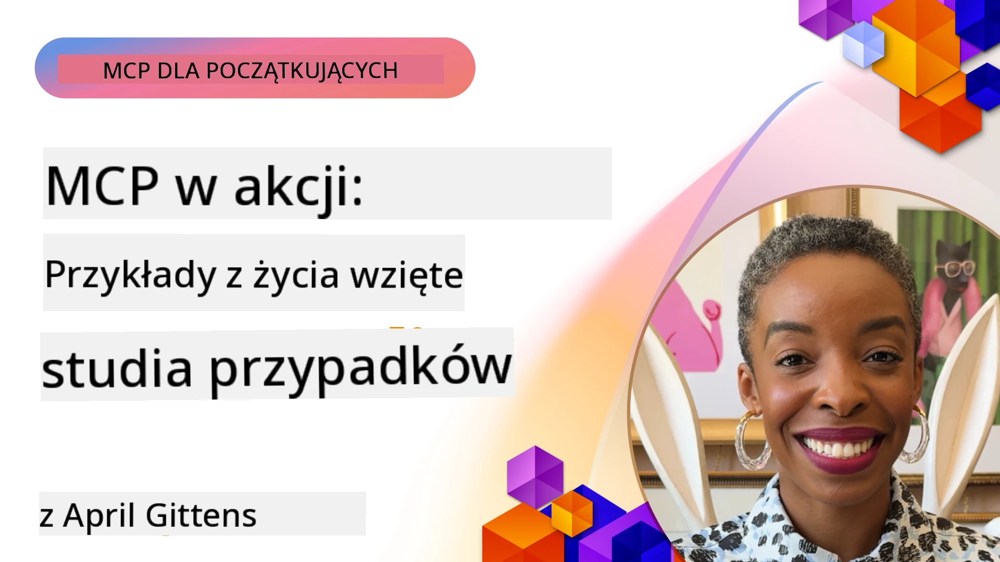

# MCP w działaniu: Studium przypadków z rzeczywistego świata

_(Kliknij powyższy obraz, aby obejrzeć wideo tej lekcji)_

Protokół kontekstu modelu (MCP) zmienia sposób, w jaki aplikacje AI wchodzą w interakcje z danymi, narzędziami i usługami. Ta sekcja przedstawia studia przypadków z rzeczywistego świata, które demonstrują praktyczne zastosowania MCP w różnych scenariuszach korporacyjnych.

## Przegląd

Ta sekcja prezentuje konkretne przykłady wdrożeń MCP, podkreślając, jak organizacje wykorzystują ten protokół do rozwiązywania złożonych problemów biznesowych. Analizując te studia przypadków, zdobędziesz wiedzę na temat wszechstronności, skalowalności i praktycznych korzyści MCP w rzeczywistych scenariuszach.

## Kluczowe cele nauki

Analizując te studia przypadków, będziesz:

- Rozumieć, jak MCP może być stosowany do rozwiązywania konkretnych problemów biznesowych
- Poznasz różne wzorce integracji i podejścia architektoniczne
- Rozpoznasz najlepsze praktyki implementacji MCP w środowiskach korporacyjnych
- Zyskasz wgląd w wyzwania i rozwiązania napotkane we wdrożeniach rzeczywistych
- Zidentyfikujesz możliwości zastosowania podobnych wzorców we własnych projektach

## Prezentowane studia przypadków

### 1. [Azure AI Travel Agents – Wzorcowa implementacja](./travelagentsample.md)

To studium przypadku analizuje kompleksowe rozwiązanie referencyjne firmy Microsoft, które pokazuje, jak zbudować aplikację do planowania podróży z wieloma agentami, zasilaną przez AI, przy użyciu MCP, Azure OpenAI i Azure AI Search. Projekt pokazuje:

- Wieloagentową orkiestrację za pomocą MCP
- Integrację danych korporacyjnych z Azure AI Search
- Bezpieczną, skalowalną architekturę z wykorzystaniem usług Azure
- Rozszerzalne narzędzia z wielokrotnego użytku komponentów MCP
- Konwersacyjne doświadczenie użytkownika napędzane przez Azure OpenAI

Architektura i szczegóły implementacji dostarczają cennych wskazówek dotyczących budowy złożonych systemów wieloagentowych z MCP jako warstwą koordynacyjną.

### 2. [Aktualizacja elementów Azure DevOps na podstawie danych z YouTube](./UpdateADOItemsFromYT.md)

To studium przypadku pokazuje praktyczne zastosowanie MCP do automatyzacji procesów pracy. Pokazuje, jak narzędzia MCP mogą być używane do:

- Pobierania danych z platform internetowych (YouTube)
- Aktualizacji elementów pracy w systemach Azure DevOps
- Tworzenia powtarzalnych procesów automatyzacji
- Integracji danych pomiędzy różnymi systemami

Ten przykład ilustruje, jak nawet stosunkowo proste implementacje MCP mogą przynieść znaczące korzyści efektywności poprzez automatyzację rutynowych zadań i poprawę spójności danych w systemach.

### 3. [Pobieranie dokumentacji w czasie rzeczywistym z MCP](./docs-mcp/README.md)

To studium przypadku prowadzi Cię przez połączenie klienta konsoli Python z serwerem Model Context Protocol (MCP), aby pobierać i rejestrować w czasie rzeczywistym kontekstowo świadomą dokumentację Microsoft. Nauczysz się, jak:

- Połączyć się z serwerem MCP za pomocą klienta Python i oficjalnego SDK MCP
- Używać klientów HTTP streamingowych dla efektywnego pobierania danych w czasie rzeczywistym
- Wywoływać narzędzia dokumentacyjne na serwerze i logować odpowiedzi bezpośrednio do konsoli
- Włączyć aktualną dokumentację Microsoft do swojego workflow bez opuszczania terminala

Rozdział zawiera zadanie praktyczne, minimalny działający przykład kodu oraz linki do dodatkowych zasobów dla głębszej nauki. Zobacz pełne przejście i kod w powiązanym rozdziale, aby zrozumieć, jak MCP może zmienić dostęp do dokumentacji i produktywność programisty w środowiskach konsolowych.

### 4. [Interaktywny generator planu nauki w aplikacji webowej z MCP](./docs-mcp/README.md)

To studium przypadku pokazuje, jak zbudować interaktywną aplikację internetową wykorzystującą Chainlit i Protokół Kontekstu Modelu (MCP) do generowania spersonalizowanych planów nauki dla dowolnego tematu. Użytkownicy mogą określić przedmiot (np. "certyfikat AI-900") oraz czas nauki (np. 8 tygodni), a aplikacja dostarczy tygodniowy podział zalecanej treści. Chainlit umożliwia konwersacyjny interfejs czatu, co sprawia, że doświadczenie jest angażujące i adaptacyjne.

- Konwersacyjna aplikacja internetowa napędzana przez Chainlit
- Polecenia użytkownika dla tematu i czasu trwania
- Rekomendacje treści tygodniowo z użyciem MCP
- Odpowiedzi adaptacyjne i w czasie rzeczywistym w interfejsie czatu

Projekt obrazuje, jak sztuczna inteligencja konwersacyjna i MCP mogą być połączone, tworząc dynamiczne, sterowane przez użytkownika narzędzia edukacyjne w nowoczesnym środowisku webowym.

### 5. [Dokumentacja w edytorze z MCP Server w VS Code](./docs-mcp/README.md)

To studium przypadku pokazuje, jak można przenieść Microsoft Learn Docs bezpośrednio do środowiska VS Code korzystając z serwera MCP — koniec z przełączaniem kart w przeglądarce! Zobaczysz, jak:

- Natychmiast wyszukiwać i czytać dokumentację w VS Code za pomocą panelu MCP lub palety poleceń
- Odnosić się do dokumentacji i wstawiać linki bezpośrednio do plików README lub kursów w formacie markdown
- Używać GitHub Copilot razem z MCP dla płynnych, zasilanych AI procesów tworzenia dokumentacji i kodu
- Weryfikować i ulepszać dokumentację dzięki natychmiastowym informacjom zwrotnym i dokładności pochodzącej od Microsoft
- Integrwać MCP z przepływami pracy GitHub dla ciągłej walidacji dokumentacji

Implementacja zawiera:

- Przykładową konfigurację `.vscode/mcp.json` dla łatwego uruchomienia
- Instrukcje opatrzone zrzutami ekranu doświadczenia w edytorze
- Wskazówki dotyczące łączenia Copilota i MCP dla maksymalnej produktywności

Ten scenariusz jest idealny dla autorów kursów, pisarzy dokumentacji oraz programistów, którzy chcą pozostać skoncentrowani w swoim edytorze podczas pracy z dokumentacją, Copilotem i narzędziami walidacji — wszystko zasilane przez MCP.

### 6. [Tworzenie serwera MCP za pomocą APIM](./apimsample.md)

To studium przypadku oferuje przewodnik krok po kroku, jak stworzyć serwer MCP używając Azure API Management (APIM). Obejmuje:

- Konfigurację serwera MCP w Azure API Management
- Udostępnianie operacji API jako narzędzi MCP
- Konfigurowanie polityk ograniczania prędkości i zabezpieczeń
- Testowanie serwera MCP przy użyciu Visual Studio Code i GitHub Copilot

Ten przykład pokazuje, jak wykorzystać możliwości Azure do stworzenia solidnego serwera MCP, który można używać w różnych aplikacjach, zwiększając integrację systemów AI z korporacyjnymi API.

### 7. [Rejestr MCP GitHub — Przyspieszanie integracji agentów](https://github.com/mcp)

To studium przypadku analizuje, jak Rejestr MCP GitHub, uruchomiony we wrześniu 2025 roku, rozwiązuje krytyczne wyzwanie w ekosystemie AI: rozproszone odkrywanie i wdrażanie serwerów Model Context Protocol (MCP).

#### Przegląd
**Rejestr MCP** rozwiązuje rosnący problem rozrzuconych serwerów MCP w repozytoriach i rejestrach, co wcześniej utrudniało integrację, czyniąc ją powolną i podatną na błędy. Te serwery umożliwiają agentom AI interakcję z zewnętrznymi systemami takimi jak API, bazy danych i źródła dokumentacji.

#### Problem
Programiści budujący przepływy pracy agentów napotykali szereg wyzwań:
- **Niska wykrywalność** serwerów MCP na różnych platformach
- **Powielanie pytań konfiguracyjnych** rozproszonych w forach i dokumentacji
- **Ryzyko bezpieczeństwa** z niezweryfikowanych i nieznanych źródeł
- **Brak standaryzacji** w jakości i kompatybilności serwerów

#### Architektura rozwiązania
Rejestr MCP GitHub centralizuje zaufane serwery MCP z kluczowymi funkcjami:
- **Instalacja jednym kliknięciem** integracja przez VS Code dla uproszczonej konfiguracji
- **Sortowanie sygnału względem szumu** według gwiazdek, aktywności oraz walidacji społeczności
- **Bezpośrednia integracja** z GitHub Copilot i innymi narzędziami kompatybilnymi z MCP
- **Otwartość na wkład** umożliwiająca wkład zarówno społeczności, jak i partnerów korporacyjnych

#### Wpływ biznesowy
Rejestr przyniósł mierzalne usprawnienia:
- **Szybsze wdrożenie** dla programistów korzystających z narzędzi takich jak Microsoft Learn MCP Server, który strumieniuje oficjalną dokumentację bezpośrednio do agentów
- **Zwiększona produktywność** dzięki specjalizowanym serwerom jak `github-mcp-server`, umożliwiającym automatyzację GitHub naturalnym językiem (tworzenie PR, ponowne uruchamianie CI, skanowanie kodu)
- **Silniejsze zaufanie ekosystemu** dzięki kuratorowanym listom i przejrzystym standardom konfiguracji

#### Wartość strategiczna
Dla praktyków specjalizujących się w zarządzaniu cyklem życia agentów i powtarzalnych przepływach pracy, Rejestr MCP oferuje:
- **Modularne wdrażanie agentów** z ustandaryzowanymi komponentami
- **Pipeline'y ewaluacyjne wspierane przez rejestr** dla spójnego testowania i walidacji
- **Interoperacyjność między narzędziami** umożliwiająca płynną integrację na różnych platformach AI

To studium przypadku pokazuje, że Rejestr MCP to nie tylko katalog — to fundamentalna platforma dla skalowalnej, rzeczywistej integracji modeli i wdrażania agentowych systemów.

### 8. [Publikowanie do sieci społecznościowych z agenta](./publora-social-publishing.md)

To studium przypadku prowadzi przez **zdalny serwer MCP z funkcją zapisu** — którego narzędzia dokonują nieodwracalnych działań w imieniu użytkownika — z publikowaniem w sieciach społecznościowych jako przykładem. Agent przygotowuje post, człowiek go zatwierdza, a serwer planuje publikację w różnych sieciach.

Interesujące są ograniczenia projektowe, jakie nakłada publikowanie, które obowiązują każdy serwer piszący zamiast tylko czytającego:

- **Otwarta odkrywalność, uwierzytelnione wykonanie** — `tools/list` zwracane bez poświadczeń, aby rejestry i klienci mogli introspekcję, podczas gdy każde `tools/call` wymaga tokena i w przeciwnym razie zwraca `401` z nagłówkiem `WWW-Authenticate`
- **Rejestracja OAuth bez kroku poza pasmem** — dynamiczna rejestracja klienta dziś, z dokumentami metadanych Client ID jako kierunkiem dla specyfikacji `2026-07-28`
- **Adnotacje narzędzi** (`readOnlyHint`, `destructiveHint`, `idempotentHint`) używane przez klientów do decydowania, co potwierdzić — wskazówki zamiast wymuszeń, i coś, czego oczekują już katalogi konektorów podczas przeglądu
- **Nie do wymyślenia identyfikatory**, aby wyimaginowana wartość od razu wywoływała błąd zamiast działać na podstawie pozornie prawdopodobnej
- **Klucze idempotencji na narzędziach tworzących posty**, aby ponowne próby w czasie działania agenta nie powodowały duplikacji publikacji
- **Cel pustej operacji opisany w schemacie narzędzia**, który ćwiczy pełną ścieżkę zapisu i nic nie publikuje, dla recenzentów i CI

Rozdział kończy się krótką listą kontrolną, którą możesz zastosować do serwera, który budujesz.

## Podsumowanie

Osiem kompleksowych studiów przypadków pokazuje niezwykłą wszechstronność i praktyczne zastosowania Protokołu Kontekstu Modelu w różnych rzeczywistych scenariuszach. Od złożonych systemów planowania wieloagentowego i zarządzania API w przedsiębiorstwie po usprawnione procesy dokumentacji i rewolucyjny Rejestr MCP GitHub, te przykłady pokazują, jak MCP zapewnia ustandaryzowany, skalowalny sposób łączenia systemów AI z narzędziami, danymi i usługami niezbędnymi do dostarczania wyjątkowej wartości.

Studia przypadków obejmują wiele wymiarów implementacji MCP:
- **Integracja korporacyjna**: Automatyzacja Azure API Management i Azure DevOps
- **Orkiestracja wieloagentowa**: Planowanie podróży z koordynowanymi agentami AI
- **Produktywność programistów**: Integracja z VS Code i dostęp do dokumentacji w czasie rzeczywistym
- **Rozwój ekosystemu**: Rejestr MCP GitHub jako platforma fundamentowa
- **Zastosowania edukacyjne**: Interaktywne generatory planów nauki i interfejsy konwersacyjne

Studiując te wdrożenia, zyskujesz kluczowe wglądy w:
- **Wzorce architektoniczne** dla różnych skali i zastosowań
- **Strategie implementacji** równoważące funkcjonalność z utrzymaniem
- **Zagadnienia bezpieczeństwa i skalowalności** dla wdrożeń produkcyjnych
- **Najlepsze praktyki** w rozwoju serwerów MCP i integracji klientów
- **Myślenie ekosystemowe** dla budowy powiązanych rozwiązań AI

Te przykłady łącznie pokazują, że MCP to nie tylko teoretyczne ramy, lecz dojrzały, gotowy do produkcji protokół umożliwiający praktyczne rozwiązania złożonych wyzwań biznesowych. Niezależnie od tego, czy budujesz proste narzędzia automatyzacji, czy zaawansowane systemy wieloagentowe, wzorce i podejścia tu przedstawione stanowią solidną podstawę dla twoich własnych projektów MCP.

## Dodatkowe zasoby

- [Repozytorium GitHub Azure AI Travel Agents](https://github.com/Azure-Samples/azure-ai-travel-agents)
- [Narzędzie MCP Azure DevOps](https://github.com/microsoft/azure-devops-mcp)
- [Narzędzie MCP Playwright](https://github.com/microsoft/playwright-mcp)
- [Serwer MCP Microsoft Docs](https://github.com/MicrosoftDocs/mcp)
- [Rejestr MCP GitHub — Przyspieszanie integracji agentów](https://github.com/mcp)
- [Przykłady społeczności MCP](https://github.com/microsoft/mcp)

## Co dalej

- Poprzedni: [Moduł 8: Najlepsze praktyki](../08-BestPractices/README.md)
- Następny: [Moduł 10: Usprawnianie przepływów pracy AI: Budowa serwera MCP z zestawem narzędzi AI](../10-StreamliningAIWorkflowsBuildingAnMCPServerWithAIToolkit/README.md)

---

<!-- CO-OP TRANSLATOR DISCLAIMER START -->
**Zastrzeżenie**:
Niniejszy dokument został przetłumaczony za pomocą usługi tłumaczenia AI [Co-op Translator](https://github.com/Azure/co-op-translator). Choć dążymy do dokładności, prosimy pamiętać, że automatyczne tłumaczenia mogą zawierać błędy lub niedokładności. Oryginalny dokument w jego języku źródłowym należy uznawać za autorytatywne źródło. W przypadku informacji krytycznych zalecane jest skorzystanie z profesjonalnego tłumaczenia wykonanego przez człowieka. Nie ponosimy odpowiedzialności za jakiekolwiek nieporozumienia lub błędne interpretacje wynikające z użycia tego tłumaczenia.
<!-- CO-OP TRANSLATOR DISCLAIMER END -->