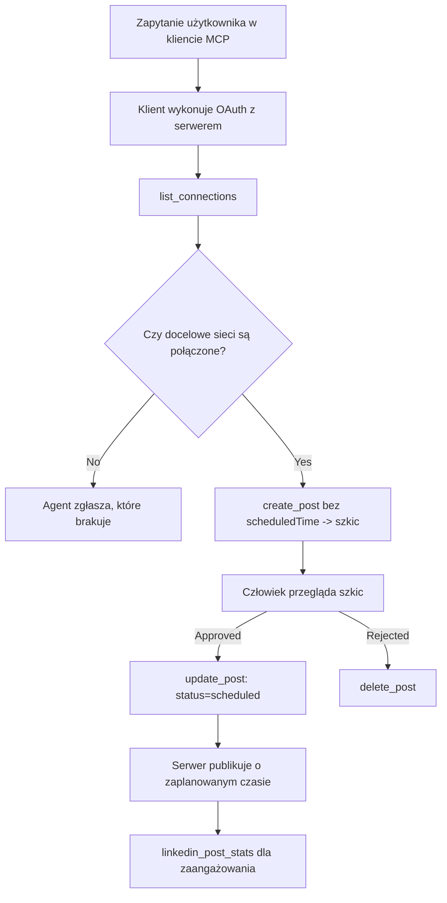

# Studium przypadku: Publikowanie w sieciach społecznościowych z agenta za pomocą zdalnego serwera MCP

> **Zastrzeżenie:** Istnieje wiele serwisów i projektów open source umożliwiających publikowanie w sieciach społecznościowych, a zespół może również integrować bezpośrednio API każdej sieci. Poniższy scenariusz przedstawia przykład tego, jak można zaprojektować i używać **zdalnego serwera MCP z możliwością zapisu**. Publora to komercyjna usługa z darmowym planem; opisane wzorce są stosowalne do każdego serwera MCP wykonującego nieodwracalne akcje w imieniu użytkownika.

## Przegląd

Agenci dobrze radzą sobie z tworzeniem treści, ale słabo z ich dostarczaniem. Model może napisać ogłoszenie o wydaniu w kilka sekund, a potem praca się kończy: publikacja wymaga API dla każdej sieci, aplikacji OAuth dla każdej z nich oraz różnych zasad dotyczących mediów. Większość zespołów rozwiązuje to, kopiując ręcznie tekst do przeglądarki.

To studium przypadku pokazuje, jak zamknąć ostatni krok jednym zdalnym serwerem MCP, a co ważniejsze dla osób go tworzących — jakie decyzje projektowe musi podjąć serwer z możliwością zapisu. Odczyt danych jest wyrozumiały. Publikacja nie: złe wywołanie narzędzia jest widoczne dla odbiorców i nie da się go cofnąć.

## Scenariusz

Mały zespół ds. relacji z programistami tworzy posty w agencie (Claude, VS Code, Cursor — klient nie ma znaczenia). Chcą, żeby agent:

- widział, które konta społecznościowe są połączone,
- pisał post i przechowywał go jako szkic do zatwierdzenia przez człowieka,
- dołączał obraz,
- planował publikację na kilku sieciach o wybranej godzinie,
- i później raportował, jak post się sprawował.

Co istotne, chcą, aby agent *nie* mógł przypadkowo opublikować podczas eksperymentów.

## Użyte narzędzia

- [Publora MCP Server](https://github.com/publora/mcp-server) — zdalny serwer MCP (`streamable-http`) udostępniający funkcje publikowania, planowania, mediów i analityki LinkedIn. Zarejestrowany w oficjalnym rejestrze MCP jako `com.publora/mcp-server`.

## Przebieg krok po kroku

1. **Połącz serwer.** Klienci obsługujący OAuth wykonują flow autoryzacji z kodem autoryzacyjnym i PKCE na ekranie zgody serwera; klienci bez tego, jak CLI bez interfejsu, używają klucza API Publora w nagłówku. Obie drogi są wspierane, a którą dostaniesz, zależy od klienta, nie serwera.
2. **Wyświetl połączenia.** Agent wywołuje `list_connections` i otrzymuje połączone konta z ich identyfikatorami.
3. **Szkic.** Agent wywołuje `create_post` *bez* zaplanowanego czasu. Post jest przechowywany jako szkic — nic nie jest publikowane.
4. **Dołącz media.** Publiczne URL-e obrazów są przekazywane w tej samej komendzie; serwer je pobiera i waliduje.
5. **Zaplanuj.** Po zatwierdzeniu przez człowieka `update_post` ustawia status na zaplanowany z czasem w formacie ISO 8601.
6. **Mierz.** Dla LinkedIn `linkedin_post_stats` zwraca zaangażowanie, gdy post jest publiczny.

## Przykładowa komenda

```text
Which social accounts do I have connected?
Draft a post announcing our new changelog page, attach the screenshot at
https://example.com/changelog.png, and keep it as a draft — do not publish it.
Once I approve, schedule it to LinkedIn and Bluesky for tomorrow at 09:00 UTC.
```

## Diagram Mermaid



## Implementacja techniczna

Poniższe lekcje to część tego studium, którą można przenieść.

### Otwarta dystrybucja, wykonanie z autoryzacją

`tools/list` jest dostępne bez poświadczeń; każde `tools/call` wymaga tokena, inaczej zwraca `401` z nagłówkiem `WWW-Authenticate` wskazującym metadane chronionego zasobu. (Serwer odpowiada też na nieautoryzowane `initialize`, co ma znaczenie tylko dla klientów ze starszymi wersjami protokołu niż `2026-07-28`; ta wersja usunęła handshake całkowicie.)

To rozdzielenie ma znaczenie w praktyce. Rejestry, katalogi i klienci mogą introspektować powierzchnię narzędzi — nazwy, schematy, adnotacje — bez trzymania sekretu, podczas gdy nic nie może być *wykonane* anonimowo. Serwer żądający tokena dla `initialize` jest praktycznie niewidoczny dla narzędzi; serwer dopuszczający anonimowe `tools/call` jest ryzykowny.

### Rejestracja: dynamiczna rejestracja klienta i co ją zastępuje

Serwer udostępnia `/.well-known/oauth-protected-resource` i `/.well-known/oauth-authorization-server`, oraz wspiera flow z kodem autoryzacyjnym z PKCE (`S256`), tokeny odświeżające i **dynamiczną rejestrację klientów**.

Dynamiczna rejestracja usuwa krok ręczny: bez niej każdy klient potrzebuje wcześniej wygenerowanego `client_id`, co oznacza oddzielną prośbę do dostawcy dla każdego nowego klienta.

Traktuj to jako zachowanie kompatybilności, a nie wzór do kopiowania. Rewizja specyfikacji z `2026-07-28` deprecjonuje dynamiczną rejestrację na rzecz Client ID Metadata Documents, gdzie klient hostuje dokument metadanych na stabilnym adresie HTTPS, a ten adres *jest* `client_id`. DCR działa nadal, ale nowy serwer powinien planować CIMD i trzymać DCR tylko dla starszych klientów.

### Adnotacje narzędzi to nie tylko dekoracja

Każde narzędzie ma `title` oraz stosowne wskazówki: `readOnlyHint`, `destructiveHint`, `idempotentHint`, `openWorldHint`.

Dwa powody, by w nie inwestować. Po pierwsze, klienci używają ich do decyzji, co potwierdzić z użytkownikiem — klient może automatycznie wykonać zapytanie tylko do odczytu i zatrzymać się po potwierdzenie przed usunięciem. Specyfikacja jasno mówi, że adnotacje to wskazówki niebudzące zaufania, nie mechanizm autoryzacji: kształtują, co klient oferuje, ale nic na serwerze nie zatrzymują, który i tak musi wymusić własne reguły. Po drugie, główne katalogi konektorów *wymagają* ich do recenzji; serwer bez tytułów i wskazówek narzędzi zostanie odrzucony bez względu na działanie.

### Nie pozwól na wymyślanie identyfikatorów

Identyfikatory platform to nieprzejrzyste ciągi zwracane przez `list_connections`, a opis schematu jasno mówi, że trzeba je kopiować dokładnie i nigdy nie zgadywać. Serwer odrzuca inaczej.

Modele potrafią świetnie zgadywać. Każdy serwer z możliwością zapisu powinien zakładać, że identyfikator w końcu zostanie wymyślony i niech ta droga kończy się głośnym i wczesnym błędem, zamiast działać na podobnie wyglądającej wartości.

### Zakończ z błędem przed publikacją, z komunikatem możliwym do działania

Niektóre sieci odrzucają posty tylko z tekstem i wymagają obrazu lub filmu. Walidacja odbywa się przy planowaniu, błąd wskazuje platformę i brakujący wymóg.

Agent może się podnieść po komunikacie "Instagram wymaga mediów — dołącz obraz lub wideo" bez kolejnej rundy zapytań. Nie podniesie się po ogólnym `400`.

### Spraw, by ponawianie było bezpieczne

Dwa narzędzia tworzące treść, `create_post` i `update_post`, akceptują klucz idempotencji: ponowne użycie z identycznym zapytaniem zwraca oryginalną odpowiedź, zamiast tworzyć drugi post. Środowiska agenta powtarzają zapytania przy timeoutach; bez idempotencji wolna odpowiedź oznacza duplikat publikacji. Inne narzędzia zapisujące — usuwanie, media, reakcje i komentarze LinkedIn — nie przyjmują klucza, więc tam ponawianie nie jest automatycznie bezpieczne. Warto wiedzieć, które własne zmiany są chronione, a które nie.

### Zapewnij sposób testowania publikując bez efektów

Serwer akceptuje zarezerwowany cel `publora-playground`, który jest walidowany i zatwierdzany jak prawdziwy, a potem odrzucany — nic nie trafia na prawdziwe konto. Jest opisany w schemacie narzędzia, które każdy klient może przeczytać bez poświadczeń: pole `platforms` w `create_post` dokumentuje go jako "cel testu połączenia, który nie wymaga realnego połączenia — post jest zatwierdzany i odrzucany, nic nie jest publikowane". Wywołaj, przekazując go jako jedyny wpis: `platforms: ["publora-playground"]`.

To okazało się jednym z najcenniejszych szczegółów całej powierzchni. Recenzenci katalogów konektorów, współtwórcy i CI mogą testować pełną ścieżkę zapisu od początku do końca bez ryzyka dla prawdziwej publiczności. Każdy serwer MCP z nieodwracalnymi akcjami korzysta na udokumentowanym celu no-op.

## Wyniki i wpływ

- Krok publikacji przeniósł się z przeglądarki do tej samej rozmowy, w której tworzona jest treść, a nawyk szkicu pierwszego utrzymuje człowieka w procesie. Bądź precyzyjny, co to znaczy: szkic to konwencja, nie granica. Te same poświadczenia mogą planować lub publikować, więc kto potrzebuje realnej bramki zatwierdzającej, musi to wymusić poza powierzchnią narzędzia — osobne poświadczenia lub warstwę polityk przed serwerem.
- Różnice między sieciami — wymagania medialne, wątki, kontrola odpowiedzi — są obsługiwane raz na serwerze, zamiast w każdym agencie.
- Ten sam serwer obsługuje kilku klientów MCP bez pracy na klienta, bo odkrywanie jest otwarte, a rejestracja dynamiczna.
- Ograniczenia projektowe powyżej ukształtowały przeglądy katalogów konektorów równie mocno jak użytkownicy: adnotacje, OAuth i bezpieczny cel testowy były wymagane przez co najmniej jeden z nich.

## Źródła

- [Publora MCP Server (źródło)](https://github.com/publora/mcp-server)
- [Publora API i dokumentacja MCP](https://docs.publora.com)
- [Rejestr MCP: `com.publora/mcp-server`](https://registry.modelcontextprotocol.io/v0/servers?search=com.publora/mcp-server)
- [Specyfikacja MCP — Autoryzacja](https://modelcontextprotocol.io/specification/draft/basic/authorization)
- [Specyfikacja MCP — Adnotacje narzędzi](https://modelcontextprotocol.io/docs/concepts/tools)

## Co dalej

- Weź serwer MCP, który tworzysz i sprawdź trzy najtańsze do wdrożenia usprawnienia: adnotacje dla każdego narzędzia, klucz idempotencji dla każdego zapisu oraz udokumentowany cel no-op.
- Wypróbuj otwarte odkrywanie: wywołaj `tools/list` na publicznym serwerze bez poświadczeń, potem wywołaj narzędzie i zbadaj wyzwanie `401`.
- Zastanów się, co oznacza „cofnij” w twojej domenie. Publikowanie ma szkice i usuwanie; jeśli twoje akcje ich nie mają, potwierdzenie należy do projektu narzędzia, nie prompta.

---

<!-- CO-OP TRANSLATOR DISCLAIMER START -->
**Zastrzeżenie**:
Niniejszy dokument został przetłumaczony za pomocą usługi tłumaczenia AI [Co-op Translator](https://github.com/Azure/co-op-translator). Choć dążymy do dokładności, prosimy pamiętać, że automatyczne tłumaczenia mogą zawierać błędy lub niedokładności. Oryginalny dokument w jego języku źródłowym należy uznawać za autorytatywne źródło. W przypadku informacji krytycznych zalecane jest skorzystanie z profesjonalnego tłumaczenia wykonanego przez człowieka. Nie ponosimy odpowiedzialności za jakiekolwiek nieporozumienia lub błędne interpretacje wynikające z użycia tego tłumaczenia.
<!-- CO-OP TRANSLATOR DISCLAIMER END -->