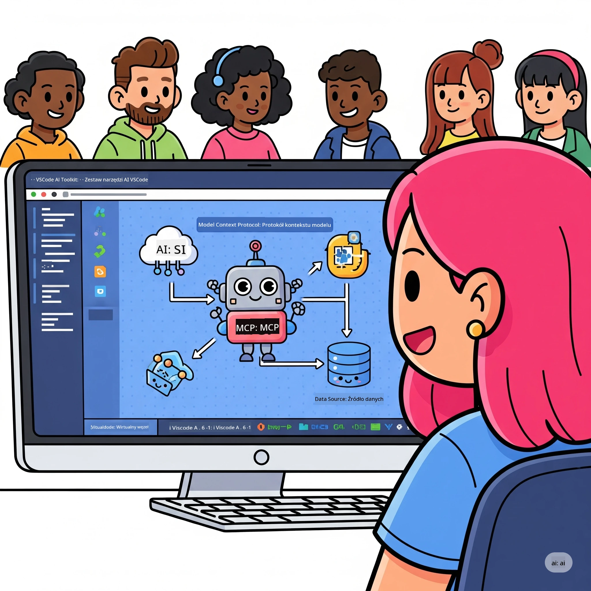
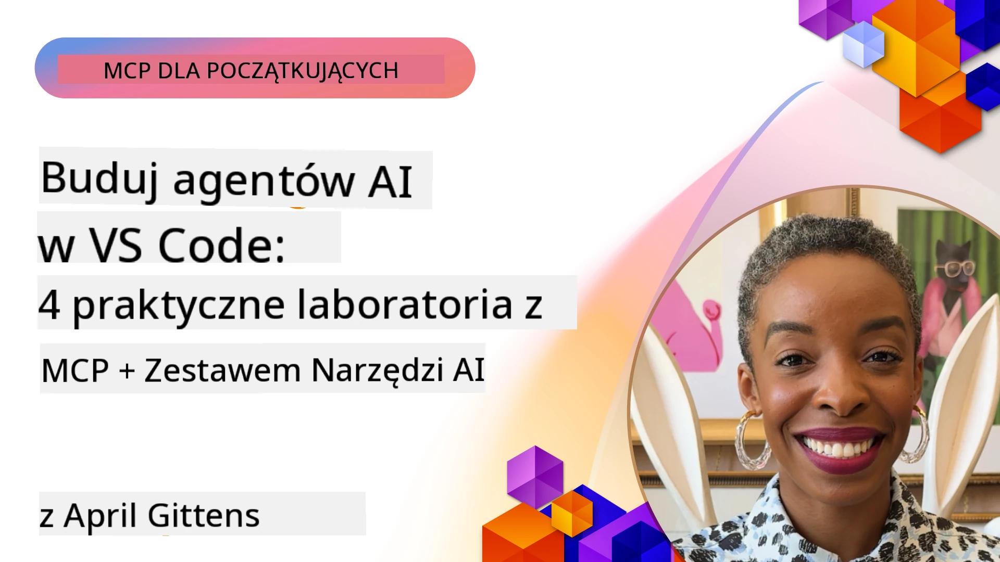

# Usprawnianie przepływów pracy AI: Budowanie serwera MCP za pomocą Microsoft Foundry Toolkit

## 🎯 Przegląd

_(Kliknij powyższy obraz, aby obejrzeć wideo z tej lekcji)_

Witamy na warsztatach **Model Context Protocol (MCP)**! Ten kompleksowy warsztat praktyczny łączy dwie najnowocześniejsze technologie, aby zrewolucjonizować rozwój aplikacji AI:

> **Uwaga dotycząca zgodności:** kod warsztatowy został zbudowany i przetestowany z MCP
> `2025-11-25`, co pokazuje powyższa plakietka. Użyj
> [aktualnej specyfikacji `2026-07-28`](https://modelcontextprotocol.io/specification/2026-07-28/)
> do nowych implementacji protokołu i przejrzyj notatki do wydania SDK przed
> migracją laboratoriów.

- **🔗 Model Context Protocol (MCP)**: otwarty standard umożliwiający płynną integrację narzędzi AI
- **🛠️ Microsoft Foundry Toolkit Extension for VS Code**: potężne rozszerzenie Microsoft do rozwoju AI

### 🎓 Czego się nauczysz

Po zakończeniu tego warsztatu opanujesz sztukę budowania inteligentnych aplikacji łączących modele AI z rzeczywistymi narzędziami i usługami. Od automatyzacji testów po niestandardowe integracje API, zdobędziesz praktyczne umiejętności rozwiązywania złożonych wyzwań biznesowych.

## 🏗️ Stos technologiczny

### 🔌 Model Context Protocol (MCP)

MCP to **„USB-C dla AI”** – uniwersalny standard łączący modele AI z zewnętrznymi narzędziami i źródłami danych.

**✨ Kluczowe cechy:**

- 🔄 **Standaryzowana integracja**: uniwersalny interfejs do połączeń narzędzi AI
- 🏛️ **Elastyczna architektura**: lokalne i zdalne serwery przez transport stdio/SSE
- 🧰 **Bogaty ekosystem**: narzędzia, podpowiedzi i zasoby w jednym protokole
- 🔒 **Gotowość korporacyjna**: wbudowane zabezpieczenia i niezawodność

**🎯 Dlaczego MCP jest ważny:**
Podobnie jak USB-C wyeliminowało bałagan z kablami, MCP eliminuje złożoność integracji AI. Jeden protokół, nieskończone możliwości.

### 🤖 Microsoft Foundry Toolkit Extension for VS Code

Flagowe rozszerzenie Microsoft do rozwoju AI, które zamienia VS Code w potęgę AI.

**🚀 Główne możliwości:**

- 📦 **Katalog modeli**: dostęp do modeli z Azure AI, GitHub, Hugging Face, Ollama
- ⚡ **Lokalne wnioskowanie**: wykonanie zoptymalizowane dla ONNX na CPU/GPU/NPU
- 🏗️ **Agent Builder**: wizualne tworzenie agentów AI z integracją MCP
- 🎭 **Multi-modalność**: wsparcie dla tekstu, wizji i wyjścia strukturalnego

**💡 Korzyści z rozwoju:**

- Wdrożenie modeli bez konfiguracji
- Wizualne inżynieria podpowiedzi
- Plac zabaw do testów w czasie rzeczywistym
- Płynna integracja serwera MCP

## 📚 Ścieżka nauki

### [🚀 Moduł 1: Podstawy Microsoft Foundry Toolkit](./lab1/README.md)

**Czas trwania**: 15 minut

- 🛠️ Instalacja i konfiguracja Microsoft Foundry Toolkit dla VS Code
- 🗂️ Eksploracja Katalogu Modeli (100+ modeli z GitHub, ONNX, OpenAI, Anthropic, Google)
- 🎮 Opanowanie interaktywnego placu zabaw do testowania modeli w czasie rzeczywistym
- 🤖 Budowa pierwszego agenta AI za pomocą Agent Builder
- 📊 Ocena wydajności modeli przy użyciu wbudowanych metryk (F1, relewantność, podobieństwo, spójność)
- ⚡ Nauka przetwarzania wsadowego i wsparcia multi-modalnego

**🎯 Efekt nauki**: Stwórz funkcjonalnego agenta AI z pełnym zrozumieniem możliwości Microsoft Foundry Toolkit

### [🌐 Moduł 2: MCP z podstawami Microsoft Foundry Toolkit](./lab2/README.md)

**Czas trwania**: 20 minut

- 🧠 Opanuj architekturę i koncepcje Model Context Protocol (MCP)
- 🌐 Poznaj ekosystem serwerów MCP Microsoft
- 🤖 Zbuduj agenta automatyzacji przeglądarki z użyciem serwera MCP Playwright
- 🔧 Zintegruj serwery MCP z Microsoft Foundry Toolkit Agent Builder
- 📊 Skonfiguruj i przetestuj narzędzia MCP w swoich agentach
- 🚀 Eksportuj i wdrażaj agentów zasilanych MCP do użytku produkcyjnego

**🎯 Efekt nauki**: Wdróż agenta AI wspartego zewnętrznymi narzędziami przez MCP

### [🔧 Moduł 3: Zaawansowany rozwój MCP z Microsoft Foundry Toolkit](./lab3/README.md)

**Czas trwania**: 20 minut

- 💻 Twórz niestandardowe serwery MCP za pomocą Microsoft Foundry Toolkit
- 🐍 Konfiguruj i korzystaj z najnowszego MCP Python SDK (v1.9.3)
- 🔍 Skonfiguruj i używaj MCP Inspector do debugowania
- 🛠️ Buduj serwer pogodowy MCP z profesjonalnymi przepływami debugowania
- 🧪 Debuguj serwery MCP zarówno w środowisku Agent Builder, jak i Inspector

**🎯 Efekt nauki**: Twórz i debuguj niestandardowe serwery MCP z nowoczesnymi narzędziami

### [🐙 Moduł 4: Praktyczny rozwój MCP - niestandardowy serwer GitHub Clone](./lab4/README.md)

**Czas trwania**: 30 minut

- 🏗️ Zbuduj rzeczywisty serwer GitHub Clone MCP do przepływów pracy developerskich
- 🔄 Wdroż inteligentne klonowanie repozytoriów z walidacją i obsługą błędów
- 📁 Twórz inteligentne zarządzanie katalogami i integrację z VS Code
- 🤖 Korzystaj z trybu agenta GitHub Copilot z niestandardowymi narzędziami MCP
- 🛡️ Zapewnij niezawodność produkcyjną i kompatybilność wieloplatformową

**🎯 Efekt nauki**: Wdróż produkcyjny serwer MCP, który usprawnia rzeczywiste przepływy pracy

## 💡 Zastosowania i wpływ w rzeczywistym świecie

### 🏢 Zastosowania korporacyjne

#### 🔄 Automatyzacja DevOps

Zmień swój przepływ pracy developerskiej dzięki inteligentnej automatyzacji:

- **Inteligentne zarządzanie repozytoriami**: przeglądy kodu i decyzje scalania oparte na AI
- **Inteligentne CI/CD**: automatyczna optymalizacja pipeline na podstawie zmian w kodzie
- **Triage zagadnień**: automatyczna klasyfikacja i przydział błędów

#### 🧪 Rewolucja w zapewnianiu jakości

Podnieś testowanie dzięki automatyzacji AI:

- **Inteligentne generowanie testów**: automatyczne tworzenie kompleksowych zestawów testów
- **Testy regresji wizualnej**: wykrywanie zmian UI wspierane przez AI
- **Monitorowanie wydajności**: proaktywne wykrywanie i rozwiązywanie problemów

#### 📊 Inteligencja w przepływach danych

Buduj mądrzejsze przepływy przetwarzania danych:

- **Adaptacyjne procesy ETL**: samodostosowujące się przekształcenia danych
- **Wykrywanie anomalii**: monitorowanie jakości danych w czasie rzeczywistym
- **Inteligentne kierowanie**: zarządzanie przepływem danych

#### 🎧 Ulepszenie doświadczenia klienta

Twórz wyjątkowe interakcje z klientami:

- **Wsparcie kontekstowe**: agenci AI z dostępem do historii klienta
- **Proaktywne rozwiązywanie problemów**: predykcyjna obsługa klienta
- **Integracja wielokanałowa**: zunifikowane doświadczenie AI na różnych platformach

## 🛠️ Wymagania wstępne i konfiguracja

### 💻 Wymagania systemowe

| Komponent | Wymaganie | Uwagi |
|-----------|-------------|-------|
| **System operacyjny** | Windows 10+, macOS 10.15+, Linux | Dowolny nowoczesny system |
| **Visual Studio Code** | Najnowsza stabilna wersja | Wymagane do Microsoft Foundry Toolkit |
| **Node.js** | v18.0+ i npm | Do rozwoju serwera MCP |
| **Python** | 3.10+ | Opcjonalne dla serwerów Python MCP |
| **Pamięć** | minimum 8GB RAM | Zalecane 16GB dla modeli lokalnych |

### 🔧 Środowisko deweloperskie

#### Zalecane rozszerzenia VS Code

- **Microsoft Foundry Toolkit** (ms-windows-ai-studio.windows-ai-studio)
- **Python** (ms-python.python)
- **Python Debugger** (ms-python.debugpy)
- **GitHub Copilot** (GitHub.copilot) - opcjonalne, ale pomocne

#### Narzędzia opcjonalne

- **uv**: nowoczesny menedżer pakietów Python
- **MCP Inspector**: wizualne narzędzie do debugowania serwerów MCP
- **Playwright**: do przykładów automatyzacji webowej

## 🎖️ Efekty nauki i ścieżka certyfikacji

### 🏆 Lista umiejętności do opanowania

Ukończenie tego warsztatu pozwoli Ci osiągnąć biegłość w:

#### 🎯 Kluczowe kompetencje

- [ ] **Mistrzostwo protokołu MCP**: dogłębne zrozumienie architektury i wzorców implementacji
- [ ] **Biegłość w Microsoft Foundry Toolkit**: eksperckie korzystanie z Microsoft Foundry Toolkit dla szybkiego rozwoju
- [ ] **Rozwój niestandardowych serwerów**: budowa, wdrażanie i utrzymanie produkcyjnych serwerów MCP
- [ ] **Doskonałość integracji narzędzi**: płynne łączenie AI z istniejącymi przepływami pracy dev
- [ ] **Zastosowanie w rozwiązywaniu problemów**: wykorzystanie nauczonych umiejętności w realnych wyzwaniach biznesowych

#### 🔧 Umiejętności techniczne

- [ ] Ustawienie i konfiguracja Microsoft Foundry Toolkit w VS Code
- [ ] Projektowanie i implementacja niestandardowych serwerów MCP
- [ ] Integracja modeli GitHub z architekturą MCP
- [ ] Budowa zautomatyzowanych przepływów testów z Playwright
- [ ] Wdrażanie agentów AI do produkcji
- [ ] Debugowanie i optymalizacja wydajności serwerów MCP

#### 🚀 Zaawansowane możliwości

- [ ] Architektura integracji AI na skalę przedsiębiorstwa
- [ ] Wdrażanie najlepszych praktyk bezpieczeństwa dla aplikacji AI
- [ ] Projektowanie skalowalnych architektur serwerów MCP
- [ ] Tworzenie niestandardowych łańcuchów narzędzi dla konkretnych dziedzin
- [ ] Mentorowanie w rozwoju natywnym AI

## 📖 Dodatkowe zasoby

- [MCP Specification (2026-07-28)](https://modelcontextprotocol.io/specification/2026-07-28/)
- [Microsoft Foundry Toolkit GitHub Repository](https://github.com/microsoft/vscode-ai-toolkit)
- [Sample MCP Servers Collection](https://github.com/modelcontextprotocol/servers)
- [Best Practices Guide](https://modelcontextprotocol.io/docs/best-practices)
- [OWASP MCP Top 10](https://microsoft.github.io/mcp-azure-security-guide/mcp/) - najlepsze praktyki bezpieczeństwa

---

**🚀 Gotowy zrewolucjonizować swój przepływ pracy rozwoju AI?**

Zbudujmy razem przyszłość inteligentnych aplikacji z MCP i Microsoft Foundry Toolkit!

## Co dalej

Kontynuuj do: [Moduł 11: MCP Server Hands-On Labs](../11-MCPServerHandsOnLabs/README.md)

---

<!-- CO-OP TRANSLATOR DISCLAIMER START -->
**Zastrzeżenie**:
Niniejszy dokument został przetłumaczony za pomocą usługi tłumaczenia AI [Co-op Translator](https://github.com/Azure/co-op-translator). Choć dążymy do dokładności, prosimy pamiętać, że automatyczne tłumaczenia mogą zawierać błędy lub niedokładności. Oryginalny dokument w jego języku źródłowym należy uznawać za autorytatywne źródło. W przypadku informacji krytycznych zalecane jest skorzystanie z profesjonalnego tłumaczenia wykonanego przez człowieka. Nie ponosimy odpowiedzialności za jakiekolwiek nieporozumienia lub błędne interpretacje wynikające z użycia tego tłumaczenia.
<!-- CO-OP TRANSLATOR DISCLAIMER END -->