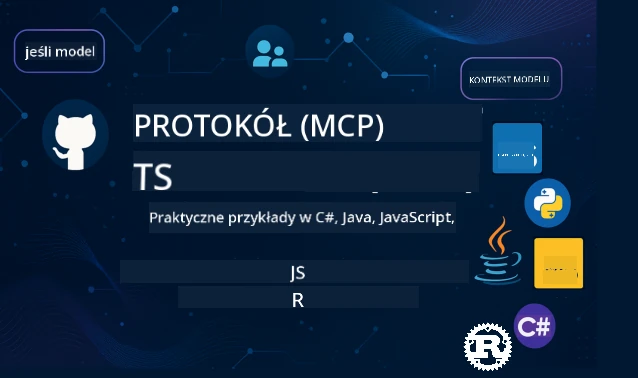

 

[](https://GitHub.com/microsoft/mcp-for-beginners/graphs/contributors)
[](https://GitHub.com/microsoft/mcp-for-beginners/issues)
[](https://GitHub.com/microsoft/mcp-for-beginners/pulls)
[](http://makeapullrequest.com)

[](https://GitHub.com/microsoft/mcp-for-beginners/watchers)
[](https://GitHub.com/microsoft/mcp-for-beginners/fork)
[](https://GitHub.com/microsoft/mcp-for-beginners/stargazers)


[](https://discord.gg/nTYy5BXMWG)

Postępuj zgodnie z tymi krokami, aby rozpocząć korzystanie z tych zasobów:
1. **Zrób forka repozytorium**: Kliknij [](https://GitHub.com/microsoft/mcp-for-beginners/fork)
2. **Sklonuj repozytorium**:   `git clone https://github.com/microsoft/mcp-for-beginners.git`
3. **Dołącz do** [](https://discord.gg/nTYy5BXMWG)


### 🌐 Wspieranie wielu języków

#### Obsługiwane przez GitHub Action (Zautomatyzowane i Zawsze Aktualne)

<!-- CO-OP TRANSLATOR LANGUAGES TABLE START -->
[Arabski](../ar/README.md) | [Bengalski](../bn/README.md) | [Bułgarski](../bg/README.md) | [Birmański (Myanmar)](../my/README.md) | [Chiński (uproszczony)](../zh-CN/README.md) | [Chiński (tradycyjny, Hongkong)](../zh-HK/README.md) | [Chiński (tradycyjny, Macao)](../zh-MO/README.md) | [Chiński (tradycyjny, Tajwan)](../zh-TW/README.md) | [Chorwacki](../hr/README.md) | [Czeski](../cs/README.md) | [Duński](../da/README.md) | [Holenderski](../nl/README.md) | [Estoński](../et/README.md) | [Fiński](../fi/README.md) | [Francuski](../fr/README.md) | [Niemiecki](../de/README.md) | [Grecki](../el/README.md) | [Hebrajski](../he/README.md) | [Hindi](../hi/README.md) | [Węgierski](../hu/README.md) | [Indonezyjski](../id/README.md) | [Włoski](../it/README.md) | [Japoński](../ja/README.md) | [Kannada](../kn/README.md) | [Koreański](../ko/README.md) | [Litewski](../lt/README.md) | [Malajski](../ms/README.md) | [Malajalam](../ml/README.md) | [Marathi](../mr/README.md) | [Nepalski](../ne/README.md) | [Pidgin nigeryjski](../pcm/README.md) | [Norweski](../no/README.md) | [Perski (Farsi)](../fa/README.md) | [Polski](./README.md) | [Portugalski (Brazylia)](../pt-BR/README.md) | [Portugalski (Portugalia)](../pt-PT/README.md) | [Pendżabski (Gurmukhi)](../pa/README.md) | [Rumuński](../ro/README.md) | [Rosyjski](../ru/README.md) | [Serbski (cyrylica)](../sr/README.md) | [Słowacki](../sk/README.md) | [Słoweński](../sl/README.md) | [Hiszpański](../es/README.md) | [Suahili](../sw/README.md) | [Szwedzki](../sv/README.md) | [Tagalog (Filipiński)](../tl/README.md) | [Tamilski](../ta/README.md) | [Telugu](../te/README.md) | [Tajski](../th/README.md) | [Turecki](../tr/README.md) | [Ukraiński](../uk/README.md) | [Urdu](../ur/README.md) | [Wietnamski](../vi/README.md)

> **Wolisz klonować lokalnie?**

> To repozytorium zawiera tłumaczenia na ponad 50 języków, co znacząco zwiększa rozmiar pobierania. Aby sklonować bez tłumaczeń, użyj sparse checkout:
> ```bash
> git clone --filter=blob:none --sparse https://github.com/microsoft/mcp-for-beginners.git
> cd mcp-for-beginners
> git sparse-checkout set --no-cone '/*' '!translations' '!translated_images'
> ```
> To da ci wszystko, czego potrzebujesz, aby ukończyć kurs z dużo szybszym pobieraniem.
<!-- CO-OP TRANSLATOR LANGUAGES TABLE END -->

# 🚀 Curriculum Model Context Protocol (MCP) dla początkujących

## **Naucz się MCP dzięki praktycznym przykładom kodu w C#, Java, JavaScript, Rust, Python i TypeScript**

## 🧠 Przegląd Programu Nauczania Model Context Protocol
Witamy na Twojej drodze do poznania Model Context Protocol! Jeśli kiedykolwiek zastanawiałeś się, jak aplikacje AI komunikują się z różnymi narzędziami i usługami, zaraz odkryjesz eleganckie rozwiązanie, które zmienia sposób, w jaki deweloperzy budują inteligentne systemy.

Pomyśl o MCP jak o uniwersalnym tłumaczu dla aplikacji AI – tak jak porty USB pozwalają podłączyć dowolne urządzenie do komputera, MCP pozwala modelom AI łączyć się z dowolnym narzędziem lub usługą w ustandaryzowany sposób. Niezależnie od tego, czy tworzysz swojego pierwszego chatbota, czy pracujesz nad skomplikowanymi przepływami AI, zrozumienie MCP da Ci moc tworzenia bardziej zdolnych i elastycznych aplikacji.

Ten program nauczania został zaprojektowany z cierpliwością i troską o Twoją ścieżkę nauki. Zaczniemy od prostych koncepcji, które już rozumiesz, i stopniowo będziemy budować Twoją wiedzę poprzez praktykę w Twoim ulubionym języku programowania. Każdy krok zawiera jasne wyjaśnienia, praktyczne przykłady i mnóstwo wsparcia na tej drodze.

Po ukończeniu tej podróży będziesz pewny siebie w budowaniu własnych serwerów MCP, integrowaniu ich z popularnymi platformami AI oraz zrozumieniu, jak ta technologia kształtuje przyszłość rozwoju AI. Zacznijmy razem tę ekscytującą przygodę!

### Oficjalna dokumentacja i specyfikacje

Te zasoby stają się bardziej wartościowe wraz z rosnącym poziomem wiedzy, ale nie czuj presji, aby czytać wszystko od razu. Zacznij od obszarów, które najbardziej Cię interesują!
- 📘 [Dokumentacja MCP](https://modelcontextprotocol.io/) – To jest Twoje główne źródło samouczków krok po kroku i przewodników użytkownika. Dokumentacja jest napisana z myślą o początkujących, oferując jasne przykłady, które możesz ćwiczyć we własnym tempie.
- 📜 [Specyfikacja MCP](https://modelcontextprotocol.io/docs/) – Traktuj to jako swój kompleksowy podręcznik referencyjny. Podczas pracy z programem nauczania będziesz tu często wracać, aby sprawdzić szczegółowe informacje i zbadać zaawansowane funkcje.
- 📜 [Oryginalna specyfikacja MCP](https://modelcontextprotocol.io/specification/versioning) – Zawiera dodatkowe szczegóły techniczne, które mogą być przydatne przy zaawansowanych implementacjach. Jest tu, gdy jej potrzebujesz, ale nie martw się, jeśli dopiero zaczynasz.
- 🧑‍💻 [Repozytorium MCP na GitHub](https://github.com/modelcontextprotocol) – Znajdziesz tu SDK, narzędzia i przykłady kodu w wielu językach programowania. To prawdziwa skarbnica praktycznych przykładów i gotowych komponentów.
- 🌐 [Społeczność MCP](https://github.com/orgs/modelcontextprotocol/discussions) – Dołącz do innych uczących się i doświadczonych programistów w dyskusjach na temat MCP. To wspierająca społeczność, gdzie pytania są mile widziane, a wiedza jest dzielona swobodnie.
  
## Cele nauki

Po ukończeniu tego programu nauczania poczujesz się pewnie i podekscytowany swoimi nowymi umiejętnościami. Oto, co osiągniesz:

• **Zrozumiesz podstawy MCP**: Pojmiesz, czym jest Model Context Protocol i dlaczego rewolucjonizuje współpracę aplikacji AI, dzięki analogiom i przykładom, które są łatwe do zrozumienia.

• **Zbudujesz swój pierwszy serwer MCP**: Stworzysz działający serwer MCP w swoim ulubionym języku programowania, zaczynając od prostych przykładów i rozwijając swoje umiejętności krok po kroku.

• **Połączysz modele AI z rzeczywistymi narzędziami**: Nauczysz się, jak połączyć modele AI z faktycznymi usługami, dając swoim aplikacjom potężne nowe możliwości.

• **Wdrożysz najlepsze praktyki bezpieczeństwa**: Zrozumiesz, jak utrzymać swoje implementacje MCP bezpieczne, chroniąc zarówno swoje aplikacje, jak i użytkowników.

• **Wdróżysz projekty z pewnością**: Będziesz wiedział, jak przeprowadzić projekty MCP od fazy rozwoju do produkcji, korzystając z praktycznych strategii wdrożeniowych działających w rzeczywistym świecie.

• **Dołączysz do społeczności MCP**: Zostaniesz częścią rosnącej społeczności programistów kształtujących przyszłość rozwoju aplikacji AI.

## Podstawowa wiedza wstępna

Zanim zanurzymy się w szczegóły MCP, upewnijmy się, że czujesz się komfortowo z pewnymi podstawowymi pojęciami. Nie martw się, jeśli nie jesteś ekspertem w tych dziedzinach — wszystko wyjaśnimy, gdy będziemy iść dalej!

### Zrozumienie protokołów (Podstawa)

Pomyśl o protokole jak o zasadach rozmowy. Kiedy dzwonisz do przyjaciela, oboje wiecie, żeby powiedzieć "cześć" na początku, mówić na zmianę i na końcu powiedzieć "do widzenia". Programy komputerowe potrzebują podobnych zasad, aby skutecznie się komunikować.

MCP to protokół – zbiór ustalonych zasad, które pomagają modelom AI i aplikacjom prowadzić produktywne „rozmowy” z narzędziami i usługami. Tak jak zasady rozmowy ułatwiają komunikację ludziom, tak MCP sprawia, że komunikacja aplikacji AI jest znacznie bardziej niezawodna i potężna.

### Relacje klient-serwer (Jak programy współpracują)

Codziennie korzystasz z relacji klient-serwer! Gdy używasz przeglądarki internetowej (klienta) do odwiedzenia strony www, łączysz się z serwerem internetowym, który wysyła Ci zawartość strony. Przeglądarka wie, jak poprosić o informacje, a serwer wie, jak odpowiedzieć.

W MCP mamy podobną relację: modele AI działają jako klienci, którzy żądają informacji lub akcji, podczas gdy serwery MCP dostarczają te możliwości. To jak posiadanie pomocnego asystenta (serwera), którego AI może poprosić o wykonanie konkretnych zadań.

### Dlaczego standardyzacja ma znaczenie (Sprawianie, by rzeczy działały razem)

Wyobraź sobie, że każdy producent samochodów używa innych kształtów wtyczek do tankowania – potrzebowałbyś innego adaptera do każdego auta! Standaryzacja oznacza uzgadnianie wspólnych podejść, by wszystko działało bezproblemowo.

MCP zapewnia tę standaryzację dla aplikacji AI. Zamiast tworzyć dla każdego modelu AI osobny kod, MCP tworzy uniwersalny sposób ich komunikacji. To oznacza, że deweloperzy mogą budować narzędzia raz i sprawić, by działały z wieloma różnymi systemami AI.

## 🧭 Przegląd Twojej ścieżki nauki

Twoja podróż z MCP jest starannie zaplanowana, aby stopniowo budować Twoją pewność siebie i umiejętności. Każda faza wprowadza nowe koncepcje, jednocześnie utrwalając już poznane.

### 🌱 Faza podstawowa: Zrozumienie podstaw (Moduły 0-2)

Tu zaczyna się Twoja przygoda! Przedstawimy Ci koncepcje MCP za pomocą znanych analogii i prostych przykładów. Zrozumiesz, czym jest MCP, dlaczego istnieje i jak wpisuje się w szerszy świat rozwoju AI.

• **Moduł 0 - Wprowadzenie do MCP**: Zaczniemy od odkrycia, czym jest MCP i dlaczego jest tak ważny dla nowoczesnych aplikacji AI. Zobaczysz przykłady MCP w rzeczywistym świecie i zrozumiesz, jak rozwiązuje powszechne problemy deweloperów.

• **Moduł 1 - Wyjaśnienie podstawowych koncepcji**: Tutaj poznasz podstawowe elementy MCP. Użyjemy wielu analogii i wizualnych przykładów, aby te koncepcje stały się naturalne i zrozumiałe.

• **Moduł 2 - Bezpieczeństwo w MCP**: Bezpieczeństwo może wydawać się trudne, ale pokażemy Ci, jak MCP zawiera wbudowane funkcje ochronne i nauczymy najlepszych praktyk, które chronią Twoje aplikacje od samego początku.

### 🔨 Faza budowy: Tworzenie pierwszych implementacji (Moduł 3)

Teraz zaczyna się prawdziwa zabawa! Zdobędziesz praktyczne doświadczenie w tworzeniu rzeczywistych serwerów i klientów MCP. Nie martw się — zaczniemy od prostych przykładów i przeprowadzimy Cię przez każdy krok.

Ten moduł zawiera wiele przewodników praktycznych, które pozwalają ćwiczyć w preferowanym języku programowania. Stworzysz swój pierwszy serwer, zbudujesz klienta do połączenia się z nim, a nawet zintegrujesz go z popularnymi narzędziami programistycznymi, takimi jak VS Code.
Każdy przewodnik zawiera kompletne przykłady kodu, wskazówki dotyczące rozwiązywania problemów oraz wyjaśnienia, dlaczego podejmujemy konkretne wybory projektowe. Pod koniec tej fazy będziesz mieć działające implementacje MCP, z których możesz być dumny!

### 🚀 Faza rozwoju: Zaawansowane koncepcje i praktyczne zastosowanie (Moduły 4-5)

Opanowawszy podstawy, jesteś gotowy, aby odkrywać bardziej zaawansowane funkcje MCP. Omówimy praktyczne strategie wdrożeniowe, techniki debugowania oraz zaawansowane tematy, takie jak integracja AI wielomodalnej.

Nauczysz się także, jak skalować swoje implementacje MCP do użytku produkcyjnego oraz integrować się z platformami chmurowymi, takimi jak Azure. Te moduły przygotują Cię do tworzenia rozwiązań MCP, które sprostają wymaganiom rzeczywistych zastosowań.

### 🌟 Faza mistrzostwa: Społeczność i specjalizacja (Moduły 6-11)

Ostatnia faza skupia się na dołączeniu do społeczności MCP oraz specjalizacji w obszarach, które Cię najbardziej interesują. Nauczysz się, jak wnosić wkład do projektów MCP open-source, wdrażać zaawansowane wzorce uwierzytelniania oraz tworzyć kompleksowe rozwiązania z integracją bazy danych.

Moduł 11 zasługuje na szczególną uwagę – to kompletny, 13-laboratoryjny, praktyczny kurs uczący budowy produkcyjnych serwerów MCP z integracją PostgreSQL. To jak projekt dyplomowy, który scala wszystko, czego się nauczyłeś!

### 📚 Kompletny schemat programu nauczania

| Moduł | Temat | Opis | Link |
|--------|-------|-------------|------|
| **Moduł 1-3: Podstawy** | | | |
| 00 | Wprowadzenie do MCP | Przegląd Model Context Protocol i jego znaczenie w pipeline’ach AI | [Czytaj więcej](./00-Introduction/README.md) |
| 01 | Wyjaśnienie podstawowych koncepcji | Dogłębne omówienie podstawowych koncepcji MCP | [Czytaj więcej](./01-CoreConcepts/README.md) |
| 02 | Bezpieczeństwo w MCP | Zagrożenia bezpieczeństwa i najlepsze praktyki | [Czytaj więcej](./02-Security/README.md) |
| 03 | Pierwsze kroki z MCP | Konfiguracja środowiska, podstawowe serwery/klienci, integracja | [Czytaj więcej](./03-GettingStarted/README.md) |
| **Moduł 3: Budowa pierwszego serwera i klienta** | | | |
| 3.1 | Pierwszy serwer | Stwórz swój pierwszy serwer MCP | [Poradnik](./03-GettingStarted/01-first-server/README.md) |
| 3.2 | Pierwszy klient | Opracuj podstawowego klienta MCP | [Poradnik](./03-GettingStarted/02-client/README.md) |
| 3.3 | Klient z LLM | Integracja dużych modeli językowych | [Poradnik](./03-GettingStarted/03-llm-client/README.md) |
| 3.4 | Integracja z VS Code | Konsumowanie serwerów MCP w VS Code | [Poradnik](./03-GettingStarted/04-vscode/README.md) |
| 3.5 | Serwer stdio | Tworzenie serwerów używając transportu stdio | [Poradnik](./03-GettingStarted/05-stdio-server/README.md) |
| 3.6 | Strumieniowanie HTTP | Implementacja strumieniowania HTTP w MCP | [Poradnik](./03-GettingStarted/06-http-streaming/README.md) |
| 3.7 | Zestaw narzędzi AI | Używanie AI Toolkit z MCP | [Poradnik](./03-GettingStarted/07-aitk/README.md) |
| 3.8 | Testowanie | Testowanie implementacji serwera MCP | [Poradnik](./03-GettingStarted/08-testing/README.md) |
| 3.9 | Wdrożenie | Wdrażanie serwerów MCP do produkcji | [Poradnik](./03-GettingStarted/09-deployment/README.md) |
| 3.10 | Zaawansowane użycie serwera | Użycie zaawansowanych serwerów dla zaawansowanych funkcji i lepszej architektury | [Poradnik](./03-GettingStarted/10-advanced/README.md) |
| 3.11 | Prosta autoryzacja | Rozdział pokazujący uwierzytelnianie od podstaw i RBAC | [Poradnik](./03-GettingStarted/11-simple-auth/README.md) |
| **Moduł 4-5: Praktyczne i zaawansowane** | | | |
| 04 | Praktyczna implementacja | SDK, debugowanie, testowanie, wielokrotnego użytku szablony promptów | [Czytaj więcej](./04-PracticalImplementation/README.md) |
| 05 | Zaawansowane tematy w MCP | AI wielomodalna, skalowanie, zastosowania korporacyjne | [Czytaj więcej](./05-AdvancedTopics/README.md) |
| 5.1 | Integracja z Azure | Integracja MCP z Azure | [Poradnik](./05-AdvancedTopics/mcp-integration/README.md) |
| 5.2 | Wielomodalność | Praca z wieloma modalnościami | [Poradnik](./05-AdvancedTopics/mcp-multi-modality/README.md) |
| 5.3 | Demonstracja OAuth2 | Implementacja uwierzytelniania OAuth2 | [Poradnik](./05-AdvancedTopics/mcp-oauth2-demo/README.md) |
| 5.4 | Konteksty podstawowe | Zrozumienie i wdrożenie kontekstów podstawowych | [Poradnik](./05-AdvancedTopics/mcp-root-contexts/README.md) |
| 5.5 | Trasowanie | Strategie trasowania MCP | [Poradnik](./05-AdvancedTopics/mcp-routing/README.md) |
| 5.6 | Próbkowanie | Techniki próbkowania w MCP | [Poradnik](./05-AdvancedTopics/mcp-sampling/README.md) |
| 5.7 | Skalowanie | Skalowanie implementacji MCP | [Poradnik](./05-AdvancedTopics/mcp-scaling/README.md) |
| 5.8 | Bezpieczeństwo | Zaawansowane rozważania dotyczące bezpieczeństwa | [Poradnik](./05-AdvancedTopics/mcp-security/README.md) |
| 5.9 | Wyszukiwanie w sieci | Implementacja funkcji wyszukiwania webowego | [Poradnik](./05-AdvancedTopics/web-search-mcp/README.md) |
| 5.10 | Strumieniowanie w czasie rzeczywistym | Budowa funkcjonalności strumieniowania w czasie rzeczywistym | [Poradnik](./05-AdvancedTopics/mcp-realtimestreaming/README.md) |
| 5.11 | Wyszukiwanie w czasie rzeczywistym | Implementacja wyszukiwania w czasie rzeczywistym | [Poradnik](./05-AdvancedTopics/mcp-realtimesearch/README.md) |
| 5.12 | Uwierzytelnianie Entra ID | Uwierzytelnianie za pomocą Microsoft Entra ID | [Poradnik](./05-AdvancedTopics/mcp-security-entra/README.md) |
| 5.13 | Integracja Foundry | Integracja z Azure AI Foundry | [Poradnik](./05-AdvancedTopics/mcp-foundry-agent-integration/README.md) |
| 5.14 | Inżynieria kontekstu | Techniki skutecznej inżynierii kontekstu | [Poradnik](./05-AdvancedTopics/mcp-contextengineering/README.md) |
| 5.15 | Niestandardowy transport MCP | Implementacje niestandardowego transportu | [Poradnik](./05-AdvancedTopics/mcp-transport/README.md) |
| **Moduł 6-10: Społeczność i najlepsze praktyki** | | | |
| 06 | Wkłady społeczności | Jak przyczyniać się do ekosystemu MCP | [Poradnik](./06-CommunityContributions/README.md) |
| 07 | Wnioski z wczesnej adopcji | Historie wdrożeń z prawdziwego świata | [Poradnik](./07-LessonsFromEarlyAdoption/README.md) |
| 08 | Najlepsze praktyki MCP | Wydajność, odporność na błędy, niezawodność | [Poradnik](./08-BestPractices/README.md) |
| 09 | Studium przypadków MCP | Praktyczne przykłady implementacji | [Poradnik](./09-CaseStudy/README.md) |
| 10 | Warsztat praktyczny | Budowa serwera MCP z AI Toolkit | [Laboratorium](./10-StreamliningAIWorkflowsBuildingAnMCPServerWithAIToolkit/README.md) |
| **Moduł 11: Praktyczne laboratoria serwera MCP** | | | |
| 11 | Integracja serwera MCP z bazą danych | Kompleksowy, 13-laboratoryjny praktyczny kurs integracji PostgreSQL | [Laboratoria](./11-MCPServerHandsOnLabs/README.md) |
| 11.1 | Wprowadzenie | Przegląd MCP z integracją bazy danych i przypadek użycia analityki retailowej | [Lab 00](./11-MCPServerHandsOnLabs/00-Introduction/README.md) |
| 11.2 | Podstawowa architektura | Zrozumienie architektury serwera MCP, warstw bazy danych i wzorców bezpieczeństwa | [Lab 01](./11-MCPServerHandsOnLabs/01-Architecture/README.md) |
| 11.3 | Bezpieczeństwo i multi-tenantowość | Row Level Security, uwierzytelnianie i wielo-dostęp do danych | [Lab 02](./11-MCPServerHandsOnLabs/02-Security/README.md) |
| 11.4 | Konfiguracja środowiska | Przygotowanie środowiska deweloperskiego, Docker, zasoby Azure | [Lab 03](./11-MCPServerHandsOnLabs/03-Setup/README.md) |
| 11.5 | Projektowanie bazy danych | Konfiguracja PostgreSQL, projekt schematu retail i dane przykładowe | [Lab 04](./11-MCPServerHandsOnLabs/04-Database/README.md) |
| 11.6 | Implementacja serwera MCP | Budowa serwera FastMCP z integracją bazy danych | [Lab 05](./11-MCPServerHandsOnLabs/05-MCP-Server/README.md) |
| 11.7 | Tworzenie narzędzi | Tworzenie narzędzi do zapytań bazodanowych i introspekcji schematu | [Lab 06](./11-MCPServerHandsOnLabs/06-Tools/README.md) |
| 11.8 | Wyszukiwanie semantyczne | Implementacja wektorowych osadzeń z Azure OpenAI i pgvector | [Lab 07](./11-MCPServerHandsOnLabs/07-Semantic-Search/README.md) |
| 11.9 | Testowanie i debugowanie | Strategie testowania, narzędzia do debugowania i podejścia do walidacji | [Lab 08](./11-MCPServerHandsOnLabs/08-Testing/README.md) |
| 11.10 | Integracja z VS Code | Konfiguracja integracji MCP w VS Code i użycie AI Chat | [Lab 09](./11-MCPServerHandsOnLabs/09-VS-Code/README.md) |
| 11.11 | Strategie wdrożenia | Wdrożenie Docker, Azure Container Apps i rozważania dotyczące skalowania | [Lab 10](./11-MCPServerHandsOnLabs/10-Deployment/README.md) |
| 11.12 | Monitorowanie | Application Insights, logowanie, monitorowanie wydajności | [Lab 11](./11-MCPServerHandsOnLabs/11-Monitoring/README.md) |
| 11.13 | Najlepsze praktyki | Optymalizacja wydajności, wzmacnianie bezpieczeństwa i wskazówki produkcyjne | [Lab 12](./11-MCPServerHandsOnLabs/12-Best-Practices/README.md) |

### 💻 Przykładowe projekty kodu

Jedną z najbardziej ekscytujących części nauki MCP jest obserwowanie, jak Twoje umiejętności programistyczne rozwijają się stopniowo. Zaprojektowaliśmy nasze przykłady kodu tak, aby zaczynały się od prostych i stawały się coraz bardziej zaawansowane wraz z pogłębianiem Twojej wiedzy. Tak właśnie wprowadzamy koncepcje – za pomocą kodu, który jest łatwy do zrozumienia, ale demonstruje prawdziwe zasady MCP, zrozumiesz nie tylko co ten kod robi, ale także dlaczego jest tak zbudowany i jak wpisuje się w większe zastosowania MCP.

#### Podstawowe przykłady kalkulatora MCP

| Język | Opis | Link |
|----------|-------------|------|
| C# | Przykład serwera MCP | [Zobacz kod](./03-GettingStarted/samples/csharp/README.md) |
| Java | Kalkulator MCP | [Zobacz kod](./03-GettingStarted/samples/java/calculator/README.md) |
| JavaScript | Demo MCP | [Zobacz kod](./03-GettingStarted/samples/javascript/README.md) |
| Python | Serwer MCP | [Zobacz kod](../../03-GettingStarted/samples/python/mcp_calculator_server.py) |
| TypeScript | Przykład MCP | [Zobacz kod](./03-GettingStarted/samples/typescript/README.md) |
| Rust | Przykład MCP | [Zobacz kod](./03-GettingStarted/samples/rust/README.md) |

#### Zaawansowane implementacje MCP

| Język | Opis | Link |
|----------|-------------|------|
| C# | Zaawansowany przykład | [Zobacz kod](./04-PracticalImplementation/samples/csharp/README.md) |
| Java ze Spring | Przykład aplikacji kontenerowej | [Zobacz kod](./04-PracticalImplementation/samples/java/containerapp/README.md) |
| JavaScript | Zaawansowany przykład | [Zobacz kod](./04-PracticalImplementation/samples/javascript/README.md) |
| Python | Złożona implementacja | [Zobacz kod](../../04-PracticalImplementation/samples/python/READMEmd) |
| TypeScript | Przykład kontenera | [Zobacz kod](./04-PracticalImplementation/samples/typescript/README.md) |


## 🎯 Wymagania wstępne do nauki MCP

Aby w pełni wykorzystać ten program nauczania, powinieneś mieć:

- Podstawową znajomość programowania w co najmniej jednym z następujących języków: C#, Java, JavaScript, Python lub TypeScript
- Zrozumienie modelu klient-serwer i API
- Znajomość koncepcji REST i HTTP
- (Opcjonalnie) Podstawy koncepcji AI/ML

- Dołączanie do dyskusji w naszej społeczności w celu wsparcia

## 📚 Przewodnik oraz zasoby do nauki

To repozytorium zawiera liczne zasoby, które pomogą Ci efektywnie się uczyć i poruszać po materiale:

### Przewodnik nauki

Dostępny jest obszerny [Przewodnik nauki](./study_guide.md), który pomoże Ci skutecznie nawigować po tym repozytorium. Ten wizualny mapę programu nauczania pokazuje, jak powiązane są wszystkie tematy i zapewnia wskazówki, jak efektywnie korzystać z przykładów projektów. Jest szczególnie pomocny, jeśli uczysz się wizualnie i lubisz widzieć całościowy obraz.

Przewodnik zawiera:
- Wizualną mapę programu nauczania pokazującą wszystkie omawiane tematy
- Szczegółowy podział każdej sekcji repozytorium
- Wskazówki, jak korzystać z projektów przykładowych
- Zalecane ścieżki nauki dla różnych poziomów zaawansowania
- Dodatkowe zasoby wspierające Twoją naukę

### Dziennik zmian

Prowadzimy szczegółowy [Dziennik zmian](./changelog.md), który śledzi wszystkie istotne aktualizacje materiałów programu, dzięki czemu możesz być na bieżąco z najnowszymi ulepszeniami i dodatkami.
- Nowe treści
- Zmiany strukturalne
- Udoskonalenia funkcji
- Aktualizacje dokumentacji

## 🛠️ Jak efektywnie korzystać z tego programu nauczania

Każda lekcja w tym przewodniku zawiera:
1. Jasne wyjaśnienia koncepcji MCP  
2. Przykłady kodu na żywo w wielu językach  
3. Ćwiczenia do tworzenia rzeczywistych aplikacji MCP  
4. Dodatkowe zasoby dla zaawansowanych uczniów

## Treści na żądanie

### [MCP Dev Days lipiec 2025](https://developer.microsoft.com/en-us/reactor/series/S-1563/)
#### [➡️Obejrzyj na żądanie - MCP Dev Days](https://developer.microsoft.com/en-us/reactor/series/S-1563/)
Przygotuj się na dwa dni dogłębnych technicznych wglądów, połączeń w społeczności i praktycznej nauki podczas MCP Dev Days, wirtualnego wydarzenia poświęconego Model Context Protocol (MCP) — nowemu standardowi łączącemu modele AI i narzędzia, na których polegają.  
Możesz oglądać MCP Dev Days rejestrując się na naszej stronie wydarzenia: https://aka.ms/mcpdevdays.

#### [Dzień 1: Produktywność MCP, narzędzia deweloperskie i społeczność:](https://developer.microsoft.com/en-us/reactor/series/S-1563/)

Dotyczy wzmacniania deweloperów w wykorzystaniu MCP w ich workflow oraz świętowania niesamowitej społeczności MCP. Dołączą do nas członkowie społeczności i partnerzy, tacy jak Arcade, Block, Okta i Neon, aby pokazać, jak współpracują z Microsoftem, tworząc otwarty, rozszerzalny ekosystem MCP. Prawdziwe demonstracje w VS Code, Visual Studio, GitHub Copilot i popularnych narzędziach społecznościowych  
Praktyczne, kontekstowe workflow deweloperskie  
Sesje i spostrzeżenia prowadzone przez społeczność  
Niezależnie od tego czy zaczynasz z MCP, czy już z nim pracujesz, Dzień 1 da Ci inspirację i praktyczne wskazówki.

#### [Dzień 2: Buduj serwery MCP z pewnością siebie](https://developer.microsoft.com/en-us/reactor/series/S-1563/)

Dla twórców MCP. Zanurzymy się w strategie implementacji oraz najlepsze praktyki tworzenia serwerów MCP i integracji MCP w twoich przepływach pracy AI.

#### Tematy obejmują:

- Budowanie serwerów MCP i integrowanie ich z doświadczeniami agentów  
- Rozwój oparty na promptach  
- Najlepsze praktyki bezpieczeństwa  
- Wykorzystanie elementów takich jak Functions, ACA i API Management  
- Wyrównanie rejestru i narzędzia (1P + 3P)

Jeśli jesteś deweloperem, twórcą narzędzi lub strategiem produktu AI, ten dzień jest pełen wglądów potrzebnych do budowy skalowalnych, bezpiecznych i gotowych na przyszłość rozwiązań MCP.

### MCP Boot Camp sierpień 2025  
Naucz się w intensywnych sesjach wideo, jak tworzyć serwery MCP, integrować je z VS Code i wdrażać profesjonalnie na Azure w oparciu o materiały z kursu MCP dla początkujących. Zdobądź praktyczne umiejętności w technologii, której już używają wielkie firmy.

#### [➡️Obejrzyj na żądanie MCP Bootcamp | English](https://developer.microsoft.com/en-us/reactor/series/s-1568/)
#### [➡️Obejrzyj na żądanie MCP Bootcamp | Brasil](https://developer.microsoft.com/en-us/reactor/series/S-1566/)
#### [➡️Obejrzyj na żądanie MCP Bootcamp | Spanish](https://developer.microsoft.com/en-us/reactor/series/S-1567/)

### Uczmy się MCP z C# - seria tutoriali  
Poznaj Model Context Protocol (MCP), nowoczesny framework zaprojektowany do standaryzacji interakcji między modelami AI a aplikacjami klienckimi. W tym przyjaznym dla początkujących kursie wprowadzimy Cię w MCP i poprowadzimy przez stworzenie pierwszego serwera MCP.  
#### C#: [https://aka.ms/letslearnmcp-csharp](https://aka.ms/letslearnmcp-csharp)  
#### Java: [https://aka.ms/letslearnmcp-java](https://aka.ms/letslearnmcp-java)  
#### JavaScript: [https://aka.ms/letslearnmcp-javascript](https://aka.ms/letslearnmcp-javascript)  
#### Python: [https://aka.ms/letslearnmcp-python](https://aka.ms/letslearnmcp-python)  

## 🎓 Twoja podróż z MCP się zaczyna

Gratulacje! Właśnie zrobiłeś pierwszy krok w ekscytującej podróży, która rozwinie Twoje możliwości programistyczne i połączy Cię z czołową technologią rozwoju AI.

### Co już osiągnąłeś

Czytając to wprowadzenie, zacząłeś budować fundament wiedzy o MCP. Rozumiesz, czym jest MCP, dlaczego jest ważny oraz jak ten kurs będzie wspierał Twoją naukę. To duże osiągnięcie i początek Twojej ekspertyzy w tej ważnej technologii.

### Przygoda przed Tobą

W miarę przechodzenia przez moduły pamiętaj, że każdy ekspert był kiedyś początkującym. Koncepty, które teraz wydają się skomplikowane, staną się drugą naturą w miarę praktyki i stosowania ich. Każdy mały krok prowadzi do potężnych możliwości, które będą Ci służyć w całej karierze deweloperskiej.

### Twoja sieć wsparcia

Dołączasz do społeczności uczących się i ekspertów, którzy pasjonują się MCP i chętnie pomagają innym odnieść sukces. Niezależnie czy utkniesz na wyzwaniu kodowania czy będziesz chciał podzielić się przełomem, społeczność wspiera Twoją drogę.

Jeśli utkniesz lub masz pytania dotyczące tworzenia aplikacji AI, dołącz do dyskusji z pozostałymi uczniami i doświadczonymi deweloperami na temat MCP. To wspierająca społeczność, w której pytania są mile widziane, a wiedza dzielona bezpłatnie.

[](https://discord.gg/nTYy5BXMWG)

Jeśli masz uwagi dotyczące produktów lub błędy podczas tworzenia, odwiedź:

[](https://aka.ms/foundry/forum)

### Gotowy na start?

Twoja przygoda z MCP zaczyna się teraz! Zacznij od Modułu 0, aby zanurzyć się w pierwsze praktyczne doświadczenia z MCP, lub eksploruj przykładowe projekty, aby zobaczyć, co zbudujesz. Pamiętaj — każdy ekspert zaczynał dokładnie tam, gdzie Ty teraz jesteś, a z cierpliwością i praktyką zdziwisz się, co potrafisz osiągnąć.

Witamy w świecie rozwoju Model Context Protocol. Zbudujmy coś niesamowitego razem!

## 🤝 Współtworzenie społeczności edukacyjnej

Ten kurs staje się silniejszy dzięki wkładowi uczniów takich jak Ty! Niezależnie od tego, czy poprawiasz literówkę, sugerujesz jaśniejsze wyjaśnienie, czy dodajesz nowy przykład, Twoje zaangażowanie pomaga innym początkującym odnosić sukcesy.

Dziękujemy Microsoft Valued Professional [Shivam Goyal](https://www.linkedin.com/in/shivam2003/) za wkład w przykłady kodu.

Proces współtworzenia jest zaprojektowany tak, by być przyjazny i wspierający. Większość wkładów wymaga podpisania Contributor License Agreement (CLA), ale automatyczne narzędzia poprowadzą Cię płynnie przez ten proces.

## 📜 Nauka open source

Cały ten kurs jest dostępny na licencji MIT [LICENSE](../../LICENSE), co oznacza, że możesz go używać, modyfikować i swobodnie udostępniać. Wspiera to naszą misję uczynienia wiedzy o MCP dostępną dla programistów wszędzie.  
## 🤝 Zasady współpracy

Ten projekt zaprasza do współpracy i sugestii. Większość wkładów wymaga zgody na  
Contributor License Agreement (CLA), który oświadcza, że masz prawo i faktycznie przyznajesz nam  
prawa do korzystania z twojego wkładu. Szczegóły znajdziesz na <https://cla.opensource.microsoft.com>.

Po zgłoszeniu pull request, bot CLA automatycznie oceni, czy musisz dostarczyć  
CLA i odpowiednio oznaczy PR (np. kontrola statusu, komentarz). Po prostu postępuj zgodnie z instrukcjami bota. Będziesz musiał to zrobić tylko raz we wszystkich repozytoriach korzystających z naszego CLA.

Projekt przyjął [Microsoft Open Source Code of Conduct](https://opensource.microsoft.com/codeofconduct/).  
Więcej informacji znajdziesz w [Code of Conduct FAQ](https://opensource.microsoft.com/codeofconduct/faq/) lub  
kontaktując się pod adresem [opencode@microsoft.com](mailto:opencode@microsoft.com).

---

*Gotowy rozpocząć swoją podróż z MCP? Zacznij od [Moduł 00 - Wprowadzenie do MCP](./00-Introduction/README.md) i stawiaj pierwsze kroki w świecie Model Context Protocol!*

## 🎒 Inne kursy  
Nasz zespół tworzy również inne kursy! Sprawdź:

<!-- CO-OP TRANSLATOR OTHER COURSES START -->
### LangChain  
[](https://aka.ms/langchain4j-for-beginners)  
[](https://aka.ms/langchainjs-for-beginners?WT.mc_id=m365-94501-dwahlin)

---

### Azure / Edge / MCP / Agenci  
[](https://github.com/microsoft/AZD-for-beginners?WT.mc_id=academic-105485-koreyst)  
[](https://github.com/microsoft/edgeai-for-beginners?WT.mc_id=academic-105485-koreyst)  
[](https://github.com/microsoft/mcp-for-beginners?WT.mc_id=academic-105485-koreyst)  
[](https://github.com/microsoft/ai-agents-for-beginners?WT.mc_id=academic-105485-koreyst)

---

### Generatywna seria AI  
[](https://github.com/microsoft/generative-ai-for-beginners?WT.mc_id=academic-105485-koreyst)  
[-9333EA?style=for-the-badge&labelColor=E5E7EB&color=9333EA)](https://github.com/microsoft/Generative-AI-for-beginners-dotnet?WT.mc_id=academic-105485-koreyst)  
[-C084FC?style=for-the-badge&labelColor=E5E7EB&color=C084FC)](https://github.com/microsoft/generative-ai-for-beginners-java?WT.mc_id=academic-105485-koreyst)  
[-E879F9?style=for-the-badge&labelColor=E5E7EB&color=E879F9)](https://github.com/microsoft/generative-ai-with-javascript?WT.mc_id=academic-105485-koreyst)

---

### Podstawowa nauka  
[](https://aka.ms/ml-beginners?WT.mc_id=academic-105485-koreyst)  
[](https://aka.ms/datascience-beginners?WT.mc_id=academic-105485-koreyst)  
[](https://aka.ms/ai-beginners?WT.mc_id=academic-105485-koreyst)  
[](https://github.com/microsoft/Security-101?WT.mc_id=academic-96948-sayoung)
[](https://aka.ms/webdev-beginners?WT.mc_id=academic-105485-koreyst)
[](https://aka.ms/iot-beginners?WT.mc_id=academic-105485-koreyst)
[](https://github.com/microsoft/xr-development-for-beginners?WT.mc_id=academic-105485-koreyst)

---
 
### Seria Copilot
[](https://aka.ms/GitHubCopilotAI?WT.mc_id=academic-105485-koreyst)
[](https://github.com/microsoft/mastering-github-copilot-for-dotnet-csharp-developers?WT.mc_id=academic-105485-koreyst)
[](https://github.com/microsoft/CopilotAdventures?WT.mc_id=academic-105485-koreyst)
<!-- CO-OP TRANSLATOR OTHER COURSES END -->

---

<!-- CO-OP TRANSLATOR DISCLAIMER START -->
**Zastrzeżenie**:  
Niniejszy dokument został przetłumaczony za pomocą usługi tłumaczeniowej AI [Co-op Translator](https://github.com/Azure/co-op-translator). Dokładamy wszelkich starań, aby tłumaczenie było precyzyjne, jednak prosimy pamiętać, że automatyczne tłumaczenia mogą zawierać błędy lub nieścisłości. Oryginalny dokument w języku źródłowym powinien być traktowany jako źródło autorytatywne. W przypadku informacji o kluczowym znaczeniu zalecane jest skorzystanie z profesjonalnego tłumaczenia wykonanego przez człowieka. Nie ponosimy odpowiedzialności za jakiekolwiek nieporozumienia lub błędne interpretacje wynikające z użycia tego tłumaczenia.
<!-- CO-OP TRANSLATOR DISCLAIMER END -->