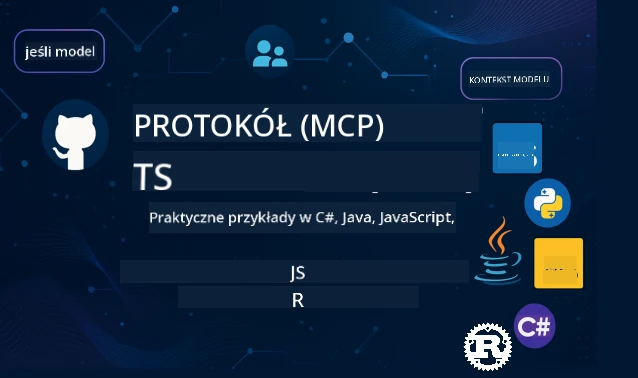

 

[](https://GitHub.com/microsoft/mcp-for-beginners/graphs/contributors)
[](https://GitHub.com/microsoft/mcp-for-beginners/issues)
[](https://GitHub.com/microsoft/mcp-for-beginners/pulls)
[](http://makeapullrequest.com)

[](https://GitHub.com/microsoft/mcp-for-beginners/watchers)
[](https://GitHub.com/microsoft/mcp-for-beginners/fork)
[](https://GitHub.com/microsoft/mcp-for-beginners/stargazers)


[](https://discord.gg/nTYy5BXMWG)

Wykonaj następujące kroki, aby rozpocząć korzystanie z tych zasobów:
1. **Wykonaj fork repozytorium**: Kliknij [](https://GitHub.com/microsoft/mcp-for-beginners/fork)
2. **Sklonuj repozytorium**:   `git clone https://github.com/microsoft/mcp-for-beginners.git`
3. **Dołącz do** [](https://discord.gg/nTYy5BXMWG)


### 🌐 Wsparcie wielojęzyczne

#### Wsparcie przez GitHub Action (automatyczne i zawsze aktualne)

<!-- CO-OP TRANSLATOR LANGUAGES TABLE START -->
[Arabski](../ar/README.md) | [Bengalski](../bn/README.md) | [Bułgarski](../bg/README.md) | [Birmański (Myanmar)](../my/README.md) | [Chiński (uproszczony)](../zh-CN/README.md) | [Chiński (tradycyjny, Hongkong)](../zh-HK/README.md) | [Chiński (tradycyjny, Makau)](../zh-MO/README.md) | [Chiński (tradycyjny, Tajwan)](../zh-TW/README.md) | [Chorwacki](../hr/README.md) | [Czeski](../cs/README.md) | [Duński](../da/README.md) | [Niderlandzki](../nl/README.md) | [Estoński](../et/README.md) | [Fiński](../fi/README.md) | [Francuski](../fr/README.md) | [Niemiecki](../de/README.md) | [Grecki](../el/README.md) | [Hebrajski](../he/README.md) | [Hindi](../hi/README.md) | [Węgierski](../hu/README.md) | [Indonezyjski](../id/README.md) | [Włoski](../it/README.md) | [Japoński](../ja/README.md) | [Kannada](../kn/README.md) | [Koreański](../ko/README.md) | [Litewski](../lt/README.md) | [Malajski](../ms/README.md) | [Malajalam](../ml/README.md) | [Marathi](../mr/README.md) | [Nepalski](../ne/README.md) | [Pidgin nigeryjski](../pcm/README.md) | [Norweski](../no/README.md) | [Perski (Farsi)](../fa/README.md) | [Polski](./README.md) | [Portugalski (Brazylia)](../pt-BR/README.md) | [Portugalski (Portugalia)](../pt-PT/README.md) | [Pendżabski (Gurmukhi)](../pa/README.md) | [Rumuński](../ro/README.md) | [Rosyjski](../ru/README.md) | [Serbski (cyrylica)](../sr/README.md) | [Słowacki](../sk/README.md) | [Słoweński](../sl/README.md) | [Hiszpański](../es/README.md) | [Suahili](../sw/README.md) | [Szwedzki](../sv/README.md) | [Tagalog (Filipiński)](../tl/README.md) | [Tamilski](../ta/README.md) | [Telugu](../te/README.md) | [Tajski](../th/README.md) | [Turecki](../tr/README.md) | [Ukraiński](../uk/README.md) | [Urdu](../ur/README.md) | [Wietnamski](../vi/README.md)

> **Wolisz klonować lokalnie?**
>
> To repozytorium zawiera tłumaczenia na 50+ języków, co znacznie zwiększa rozmiar pobierania. Aby klonować bez tłumaczeń, użyj sparse checkout:
>
> **Bash / macOS / Linux:**
> ```bash
> git clone --filter=blob:none --sparse https://github.com/microsoft/mcp-for-beginners.git
> cd mcp-for-beginners
> git sparse-checkout set --no-cone '/*' '!translations' '!translated_images'
> ```
>
> **CMD (Windows):**
> ```cmd
> git clone --filter=blob:none --sparse https://github.com/microsoft/mcp-for-beginners.git
> cd mcp-for-beginners
> git sparse-checkout set --no-cone "/*" "!translations" "!translated_images"
> ```
>
> To daje wszystko, czego potrzebujesz, aby ukończyć kurs znacznie szybciej.
<!-- CO-OP TRANSLATOR LANGUAGES TABLE END -->

# 🚀 Program nauczania Model Context Protocol (MCP) dla początkujących

## **Ucz się MCP na praktycznych przykładach w C#, Java, JavaScript, Rust, Python i TypeScript**

## 🧠 Przegląd programu nauczania Model Context Protocol
Witamy na Twojej drodze do poznania Model Context Protocol! Jeśli kiedykolwiek zastanawiałeś się, jak aplikacje AI komunikują się z różnymi narzędziami i usługami, właśnie odkryjesz eleganckie rozwiązanie, które zmienia sposób, w jaki deweloperzy tworzą inteligentne systemy.

Pomyśl o MCP jako uniwersalnym tłumaczu dla aplikacji AI - podobnie jak porty USB pozwalają podłączyć dowolne urządzenie do komputera, MCP pozwala modelom AI łączyć się z dowolnym narzędziem lub usługą w ustandaryzowany sposób. Niezależnie od tego, czy tworzysz swojego pierwszego chatbota, czy pracujesz nad złożonymi procesami AI, zrozumienie MCP da Ci moc tworzenia bardziej zaawansowanych i elastycznych aplikacji.

Ten program nauczania został zaprojektowany z cierpliwością i troską o Twoją ścieżkę nauki. Zaczniemy od prostych pojęć, które już znasz, i stopniowo rozwiniesz swoje umiejętności przez praktyczne ćwiczenia w ulubionym języku programowania. Każdy krok zawiera jasne wyjaśnienia, praktyczne przykłady i dużo wsparcia na każdym etapie.

Kiedy ukończysz tę podróż, będziesz pewny siebie w budowaniu własnych serwerów MCP, integracji ich z popularnymi platformami AI i zrozumieniu, jak ta technologia kształtuje przyszłość rozwoju AI. Zacznijmy tę ekscytującą przygodę razem!

### Oficjalna dokumentacja i specyfikacje

Ten program jest zgodny ze **Specyfikacją MCP 2025-11-25** (najświeższe stabilne wydanie). Specyfikacja MCP używa wersjonowania opartego na dacie (format RRRR-MM-DD), aby zapewnić jasne śledzenie wersji protokołu.

Te zasoby stają się bardziej wartościowe wraz z Twoim wzrostem wiedzy, ale nie czuj presji, aby czytać wszystko od razu. Zacznij od obszarów, które najbardziej Cię interesują!
- 📘 [Dokumentacja MCP](https://modelcontextprotocol.io/) – To Twoje główne źródło krok po kroku instrukcji i przewodników użytkownika. Dokumentacja jest napisana z myślą o początkujących, z jasnymi przykładami, które możesz realizować we własnym tempie.
- 📜 [Specyfikacja MCP](https://modelcontextprotocol.io/specification/2025-11-25) – Myśl o tym jako o kompleksowym podręczniku referencyjnym. Pracując nad programem, będziesz tu wracać, by szukać szczegółów i badać zaawansowane funkcje.
- 📜 [Wersjonowanie specyfikacji MCP](https://modelcontextprotocol.io/specification/versioning) – Zawiera informacje o historii wersji protokołu i sposobie wykorzystania wersjonowania opartego na dacie (format RRRR-MM-DD).
- 🧑‍💻 [Repozytorium MCP na GitHub](https://github.com/modelcontextprotocol) – Znajdziesz tu SDK, narzędzia i przykładowy kod w wielu językach programowania. To prawdziwa skarbnica praktycznych przykładów i gotowych komponentów.
- 🌐 [Społeczność MCP](https://github.com/orgs/modelcontextprotocol/discussions) – Dołącz do innych uczących się i doświadczonych deweloperów, by dyskutować o MCP. To wspierająca społeczność, gdzie pytania są mile widziane, a wiedza dzielona bez ograniczeń.

## Cele nauki

Po ukończeniu tego programu poczujesz się pewnie i podekscytowany nowymi umiejętnościami. Oto, co osiągniesz:

• **Zrozumiesz podstawy MCP**: Poznasz, czym jest Model Context Protocol i dlaczego rewolucjonizuje sposób współpracy aplikacji AI, wykorzystując analogie i przykłady, które mają sens.

• **Zbudujesz swój pierwszy serwer MCP**: Stworzysz działający serwer MCP w preferowanym języku programowania, zaczynając od prostych przykładów i rozwijając umiejętności krok po kroku.

• **Połączysz modele AI z prawdziwymi narzędziami**: Nauczysz się budować most między modelami AI a rzeczywistymi usługami, dając Twoim aplikacjom nowe, potężne możliwości.

• **Wdrożysz najlepsze praktyki bezpieczeństwa**: Dowiesz się, jak zapewnić bezpieczne i chronione implementacje MCP, chroniąc zarówno aplikacje, jak i użytkowników.

• **Wdrożysz projekty z pewnością**: Poznasz praktyczne strategie wdrażania MCP od fazy rozwoju do produkcji, sprawdzone w rzeczywistych zastosowaniach.

• **Dołączysz do społeczności MCP**: Zostaniesz częścią rosnącej społeczności deweloperów, którzy kształtują przyszłość tworzenia aplikacji AI.

## Nieodzowne tło

Zanim zagłębimy się w szczegóły MCP, upewnijmy się, że czujesz się komfortowo z pewnymi podstawowymi pojęciami. Nie martw się, jeśli nie jesteś ekspertem w tych dziedzinach – wszystko wyjaśnimy po drodze!

### Zrozumienie protokołów (Podstawa)

Pomyśl o protokole jak o zasadach rozmowy. Kiedy dzwonisz do przyjaciela, oboje wiecie, by powiedzieć „cześć” na powitanie, mówić na zmianę i na końcu powiedzieć „do widzenia”. Programy komputerowe potrzebują podobnych zasad, by skutecznie się komunikować.

MCP to protokół – zbiór uzgodnionych reguł, które pomagają modelom AI i aplikacjom prowadzić produktywne „rozmowy” z narzędziami i usługami. Tak jak zasady rozmowy ułatwiają komunikację ludziom, tak MCP sprawia, że komunikacja aplikacji AI jest zdecydowanie bardziej niezawodna i wydajna.

### Relacje klient-serwer (Jak programy współpracują)

Już dziś korzystasz z relacji klient-serwer! Gdy używasz przeglądarki (klienta), aby odwiedzić stronę internetową, łączysz się z serwerem WWW, który przesyła Ci zawartość strony. Przeglądarka wie, jak prosić o informacje, a serwer wie, jak na nie odpowiadać.

W MCP mamy podobną relację: modele AI są klientami, które żądają informacji lub działań, a serwery MCP dostarczają takie możliwości. To jak mieć pomocnego asystenta (serwer), którego AI może prosić o wykonanie konkretnych zadań.

### Dlaczego standaryzacja ma znaczenie (Sprawianie, by rzeczy działały razem)

Wyobraź sobie, że każdy producent samochodów używa innego kształtu pompek do tankowania – potrzebowałbyś innego adaptera do każdego auta! Standaryzacja oznacza uzgodnienie wspólnych standardów, aby wszystko działało razem bezproblemowo.

MCP zapewnia tę standaryzację dla aplikacji AI. Zamiast tworzyć niestandardowy kod dla każdego modelu AI i każdego narzędzia, MCP tworzy uniwersalny sposób komunikacji. To pozwala deweloperom budować narzędzia raz i sprawiać, że działają z wieloma różnymi systemami AI.

## 🧭 Przegląd Twojej ścieżki nauki

Twoja podróż z MCP jest starannie zaplanowana, aby stopniowo rozwijać Twoją pewność i umiejętności. Każda faza wprowadza nowe pojęcia i utrwala już poznane.

### 🌱 Faza podstawowa: Zrozumienie podstaw (Moduły 0-2)

To tutaj zaczyna się Twoja przygoda! Przedstawimy Ci koncepcje MCP poprzez znane analogie i proste przykłady. Zrozumiesz, czym MCP jest, dlaczego istnieje i jak wpisuje się w szerszy świat rozwoju AI.

• **Moduł 0 - Wprowadzenie do MCP**: Zaczniemy od poznania, czym jest MCP i dlaczego jest tak ważny dla nowoczesnych aplikacji AI. Zobaczysz prawdziwe przykłady wykorzystania MCP i zrozumiesz, jak rozwiązuje typowe problemy, z jakimi mierzą się deweloperzy.

• **Moduł 1 - Wyjaśnienie kluczowych pojęć**: Poznasz tutaj podstawowe elementy MCP. Użyjemy wielu analogii i wizualnych przykładów, abyś dobrze zrozumiał te pojęcia.

• **Moduł 2 - Bezpieczeństwo w MCP**: Bezpieczeństwo może wydawać się trudne, ale pokażemy Ci, jak MCP zawiera wbudowane mechanizmy bezpieczeństwa oraz nauczymy najlepszych praktyk, które chronią Twoje aplikacje od samego początku.

### 🔨 Faza budowania: Tworzenie pierwszych implementacji (Moduł 3)

Teraz zaczyna się prawdziwa zabawa! Zdobędziesz praktyczne doświadczenie w budowaniu rzeczywistych serwerów i klientów MCP. Nie martw się – zaczniemy od prostych rzeczy i poprowadzimy Cię przez każdy krok.
Ten moduł zawiera wiele praktycznych przewodników, które pozwalają ćwiczyć w preferowanym przez Ciebie języku programowania. Stworzysz swój pierwszy serwer, zbudujesz klienta do połączenia z nim, a nawet zintegrujesz się z popularnymi narzędziami deweloperskimi, takimi jak VS Code.

Każdy przewodnik zawiera kompletne przykłady kodu, wskazówki dotyczące rozwiązywania problemów oraz wyjaśnienia, dlaczego podejmujemy konkretne decyzje projektowe. Na koniec tej fazy będziesz mieć działające implementacje MCP, z których możesz być dumny!

### 🚀 Faza Rozwoju: Zaawansowane Koncepcje i Zastosowania w Rzeczywistych Projektach (Moduły 4-5)

Po opanowaniu podstaw jesteś gotów, aby zbadać bardziej zaawansowane funkcje MCP. Omówimy praktyczne strategie implementacji, techniki debugowania oraz zaawansowane tematy, takie jak integracja wielomodalnej sztucznej inteligencji.

Nauczysz się również, jak skalować swoje implementacje MCP do użytku produkcyjnego oraz integrować je z platformami chmurowymi, takimi jak Azure. Te moduły przygotują Cię do tworzenia rozwiązań MCP zdolnych sprostać rzeczywistym wymaganiom.

### 🌟 Faza Mistrzowska: Społeczność i Specjalizacja (Moduły 6-11)

Ostatnia faza koncentruje się na dołączeniu do społeczności MCP oraz specjalizacji w obszarach, które Cię najbardziej interesują. Dowiesz się, jak wnosić wkład do projektów open-source MCP, wdrażać zaawansowane wzorce uwierzytelniania i budować kompleksowe rozwiązania zintegrowane z bazami danych.

Moduł 11 zasługuje na szczególne wyróżnienie – to pełna ścieżka nauki składająca się z 13 praktycznych warsztatów, które uczą, jak budować produkcyjne serwery MCP z integracją PostgreSQL. To niczym projekt zamykający, łączący wszystko, czego się nauczyłeś!

### 📚 Kompletny Plan Nauki

| Moduł | Temat | Opis | Link |
|--------|-------|-------------|------|
| **Moduły 0-3: Podstawy** | | | |
| 00 | Wprowadzenie do MCP | Przegląd Model Context Protocol i jego znaczenie w pipeline’ach AI | [Czytaj więcej](./00-Introduction/README.md) |
| 01 | Wyjaśnienie Kluczowych Koncepcji | Dogłębne omówienie podstawowych koncepcji MCP | [Czytaj więcej](./01-CoreConcepts/README.md) |
| 02 | Bezpieczeństwo w MCP | Zagrożenia bezpieczeństwa i najlepsze praktyki | [Czytaj więcej](./02-Security/README.md) |
| 03 | Pierwsze Kroki z MCP | Konfiguracja środowiska, podstawowe serwery/klienci, integracja | [Czytaj więcej](./03-GettingStarted/README.md) |
| **Moduł 3: Budowanie Pierwszego Serwera i Klienta** | | | |
| 3.1 | Pierwszy Serwer | Stwórz swój pierwszy serwer MCP | [Przewodnik](./03-GettingStarted/01-first-server/README.md) |
| 3.2 | Pierwszy Klient | Opracuj podstawowego klienta MCP | [Przewodnik](./03-GettingStarted/02-client/README.md) |
| 3.3 | Klient z LLM | Integracja dużych modeli językowych | [Przewodnik](./03-GettingStarted/03-llm-client/README.md) |
| 3.4 | Integracja z VS Code | Korzystaj z serwerów MCP w VS Code | [Przewodnik](./03-GettingStarted/04-vscode/README.md) |
| 3.5 | Serwer stdio | Twórz serwery używając transportu stdio | [Przewodnik](./03-GettingStarted/05-stdio-server/README.md) |
| 3.6 | Strumieniowanie HTTP | Implementuj strumieniowanie HTTP w MCP | [Przewodnik](./03-GettingStarted/06-http-streaming/README.md) |
| 3.7 | AI Toolkit | Używaj AI Toolkit z MCP | [Przewodnik](./03-GettingStarted/07-aitk/README.md) |
| 3.8 | Testowanie | Testuj swoją implementację serwera MCP | [Przewodnik](./03-GettingStarted/08-testing/README.md) |
| 3.9 | Wdrożenie | Wdrażaj serwery MCP do produkcji | [Przewodnik](./03-GettingStarted/09-deployment/README.md) |
| 3.10 | Zaawansowane użycie serwera | Wykorzystuj zaawansowane serwery do rozszerzonych funkcji i lepszej architektury | [Przewodnik](./03-GettingStarted/10-advanced/README.md) |
| 3.11 | Prosta autoryzacja | Rozdział pokazujący uwierzytelnianie od podstaw i RBAC | [Przewodnik](./03-GettingStarted/11-simple-auth/README.md) |
| 3.12 | Hosty MCP | Konfiguracja Claude Desktop, Cursor, Cline i innych hostów MCP | [Przewodnik](./03-GettingStarted/12-mcp-hosts/README.md) |
| 3.13 | MCP Inspector | Debuguj i testuj serwery MCP za pomocą narzędzia Inspector | [Przewodnik](./03-GettingStarted/13-mcp-inspector/README.md) |
| 3.14 | Próbkowanie | Używaj próbkowania do współpracy z klientem | [Przewodnik](./03-GettingStarted/14-sampling/README.md) |
| 3.15 | Aplikacje MCP | Buduj aplikacje MCP | [Przewodnik](./03-GettingStarted/15-mcp-apps/README.md) |
| **Moduły 4-5: Praktyczne i Zaawansowane** | | | |
| 04 | Praktyczna Implementacja | SDK, debugowanie, testowanie, wielokrotnego użytku szablony promptów | [Czytaj więcej](./04-PracticalImplementation/README.md) |
| 4.1 | Paginacja | Obsługa dużych zestawów wyników z paginacją opartą na kursorze | [Przewodnik](./04-PracticalImplementation/pagination/README.md) |
| 05 | Zaawansowane Tematy w MCP | Wielomodalna AI, skalowanie, zastosowania korporacyjne | [Czytaj więcej](./05-AdvancedTopics/README.md) |
| 5.1 | Integracja z Azure | Integracja MCP z Azure | [Przewodnik](./05-AdvancedTopics/mcp-integration/README.md) |
| 5.2 | Wielomodalność | Praca z wieloma modalnościami | [Przewodnik](./05-AdvancedTopics/mcp-multi-modality/README.md) |
| 5.3 | Demo OAuth2 | Implementacja uwierzytelniania OAuth2 | [Przewodnik](./05-AdvancedTopics/mcp-oauth2-demo/README.md) |
| 5.4 | Root Contexts | Zrozumienie i implementacja root contexts | [Przewodnik](./05-AdvancedTopics/mcp-root-contexts/README.md) |
| 5.5 | Routing | Strategie routingu MCP | [Przewodnik](./05-AdvancedTopics/mcp-routing/README.md) |
| 5.6 | Próbkowanie | Techniki próbkowania w MCP | [Przewodnik](./05-AdvancedTopics/mcp-sampling/README.md) |
| 5.7 | Skalowanie | Skalowanie implementacji MCP | [Przewodnik](./05-AdvancedTopics/mcp-scaling/README.md) |
| 5.8 | Bezpieczeństwo | Zaawansowane aspekty bezpieczeństwa | [Przewodnik](./05-AdvancedTopics/mcp-security/README.md) |
| 5.9 | Wyszukiwanie w sieci | Implementacja możliwości wyszukiwania w sieci | [Przewodnik](./05-AdvancedTopics/web-search-mcp/README.md) |
| 5.10 | Strumieniowanie w czasie rzeczywistym | Budowanie funkcjonalności strumieniowania na żywo | [Przewodnik](./05-AdvancedTopics/mcp-realtimestreaming/README.md) |
| 5.11 | Wyszukiwanie na żywo | Implementacja wyszukiwania w czasie rzeczywistym | [Przewodnik](./05-AdvancedTopics/mcp-realtimesearch/README.md) |
| 5.12 | Uwierzytelnianie Entra ID | Uwierzytelnianie z Microsoft Entra ID | [Przewodnik](./05-AdvancedTopics/mcp-security-entra/README.md) |
| 5.13 | Integracja Foundry | Integracja z Azure AI Foundry | [Przewodnik](./05-AdvancedTopics/mcp-foundry-agent-integration/README.md) |
| 5.14 | Inżynieria kontekstu | Techniki efektywnej inżynierii kontekstu | [Przewodnik](./05-AdvancedTopics/mcp-contextengineering/README.md) |
| 5.15 | Własny Transport MCP | Implementacje własnych transportów | [Przewodnik](./05-AdvancedTopics/mcp-transport/README.md) |
| 5.16 | Funkcje protokołu | Powiadomienia o postępie, anulowanie, szablony zasobów | [Przewodnik](./05-AdvancedTopics/mcp-protocol-features/README.md) |
| **Moduły 6-10: Społeczność i Najlepsze Praktyki** | | | |
| 06 | Wkład Społeczności | Jak wnosić wkład do ekosystemu MCP | [Przewodnik](./06-CommunityContributions/README.md) |
| 07 | Wnioski z Wczesnej Adopcji | Historie implementacji z życia wzięte | [Przewodnik](./07-LessonsfromEarlyAdoption/README.md) |
| 08 | Najlepsze Praktyki dla MCP | Wydajność, odporność na błędy, niezawodność | [Przewodnik](./08-BestPractices/README.md) |
| 09 | Studium Przypadków MCP | Praktyczne przykłady implementacji | [Przewodnik](./09-CaseStudy/README.md) |
| 10 | Warsztaty Praktyczne | Budowanie serwera MCP z AI Toolkit | [Lab](./10-StreamliningAIWorkflowsBuildingAnMCPServerWithAIToolkit/README.md) |
| **Moduł 11: MCP Server Hands On Lab** | | | |
| 11 | Integracja Serwera MCP z Bazą Danych | Kompleksowa ścieżka nauki składająca się z 13 praktycznych laboratoriów integrujących PostgreSQL | [Laboratoria](./11-MCPServerHandsOnLabs/README.md) |
| 11.1 | Wprowadzenie | Przegląd MCP z integracją bazy danych i przypadek użycia analityki retailowej | [Lab 00](./11-MCPServerHandsOnLabs/00-Introduction/README.md) |
| 11.2 | Architektura Podstawowa | Zrozumienie architektury serwera MCP, warstw bazy danych i wzorców bezpieczeństwa | [Lab 01](./11-MCPServerHandsOnLabs/01-Architecture/README.md) |
| 11.3 | Bezpieczeństwo i Wielu Najemców | Row Level Security, uwierzytelnianie oraz dostęp do danych dla wielu najemców | [Lab 02](./11-MCPServerHandsOnLabs/02-Security/README.md) |
| 11.4 | Konfiguracja Środowiska | Ustawianie środowiska deweloperskiego, Docker, zasoby Azure | [Lab 03](./11-MCPServerHandsOnLabs/03-Setup/README.md) |
| 11.5 | Projekt Bazy Danych | Konfiguracja PostgreSQL, projektowanie schematu retail oraz przykładowe dane | [Lab 04](./11-MCPServerHandsOnLabs/04-Database/README.md) |
| 11.6 | Implementacja Serwera MCP | Budowa serwera FastMCP z integracją bazy danych | [Lab 05](./11-MCPServerHandsOnLabs/05-MCP-Server/README.md) |
| 11.7 | Tworzenie Narzędzi | Tworzenie narzędzi zapytań do bazy danych oraz introspekcja schematu | [Lab 06](./11-MCPServerHandsOnLabs/06-Tools/README.md) |
| 11.8 | Wyszukiwanie Semantyczne | Implementacja wektorowych osadzeń z Azure OpenAI i pgvector | [Lab 07](./11-MCPServerHandsOnLabs/07-Semantic-Search/README.md) |
| 11.9 | Testowanie i Debugowanie | Strategie testowania, narzędzia debugowania i podejścia do walidacji | [Lab 08](./11-MCPServerHandsOnLabs/08-Testing/README.md) |
| 11.10 | Integracja z VS Code | Konfiguracja integracji MCP z VS Code i użycie AI Chat | [Lab 09](./11-MCPServerHandsOnLabs/09-VS-Code/README.md) |
| 11.11 | Strategie Wdrożenia | Wdrożenie za pomocą Dockera, Azure Container Apps i kwestie skalowania | [Lab 10](./11-MCPServerHandsOnLabs/10-Deployment/README.md) |
| 11.12 | Monitorowanie | Azure Application Insights, logowanie, monitorowanie wydajności | [Lab 11](./11-MCPServerHandsOnLabs/11-Monitoring/README.md) |
| 11.13 | Najlepsze Praktyki | Optymalizacja wydajności, zabezpieczenia i wskazówki produkcyjne | [Lab 12](./11-MCPServerHandsOnLabs/12-Best-Practices/README.md) |

### 💻 Przykładowe Projekty Kodów

Jednym z najbardziej ekscytujących aspektów nauki MCP jest stopniowy rozwój Twoich umiejętności programistycznych. Zaprojektowaliśmy nasze przykłady kodu tak, aby zaczynały się prosto, a następnie stopniowo stawały się bardziej zaawansowane wraz ze wzrostem Twojego zrozumienia. Oto jak wprowadzamy koncepcje - z kodem łatwym do zrozumienia, ale pokazującym prawdziwe zasady MCP, zrozumiesz nie tylko, co kod robi, ale również dlaczego jest tak zbudowany i jak wpisuje się w większe aplikacje MCP.

#### Podstawowe Przykłady Kalkulatora MCP

| Język | Opis | Link |
|----------|-------------|------|
| C# | Przykład serwera MCP | [Zobacz kod](./03-GettingStarted/samples/csharp/README.md) |
| Java | Kalkulator MCP | [Zobacz kod](./03-GettingStarted/samples/java/calculator/README.md) |
| JavaScript | Demo MCP | [Zobacz kod](./03-GettingStarted/samples/javascript/README.md) |
| Python | Serwer MCP | [Zobacz kod](../../03-GettingStarted/samples/python/mcp_calculator_server.py) |
| TypeScript | Przykład MCP | [Zobacz kod](./03-GettingStarted/samples/typescript/README.md) |
| Rust | Przykład MCP | [Zobacz kod](./03-GettingStarted/samples/rust/README.md) |

#### Zaawansowane Implementacje MCP

| Język | Opis | Link |
|----------|-------------|------|
| C# | Zaawansowany przykład | [Zobacz kod](./04-PracticalImplementation/samples/csharp/README.md) |
| Java ze Spring | Przykład aplikacji kontenerowej | [Zobacz kod](./04-PracticalImplementation/samples/java/containerapp/README.md) |
| JavaScript | Zaawansowany przykład | [Zobacz kod](./04-PracticalImplementation/samples/javascript/README.md) |
| Python | Złożona implementacja | [Zobacz kod](./04-PracticalImplementation/samples/python/README.md) |
| TypeScript | Przykład kontenera | [Zobacz kod](./04-PracticalImplementation/samples/typescript/README.md) |


## 🎯 Wymagania Wstępne do Nauki MCP

Aby w pełni skorzystać z tego planu nauki, powinieneś mieć:
- Podstawowa znajomość programowania w co najmniej jednym z następujących języków: C#, Java, JavaScript, Python lub TypeScript  
- Zrozumienie modelu klient-serwer oraz API  
- Znajomość koncepcji REST i HTTP  
- (Opcjonalnie) Podstawy koncepcji AI/ML  

- Dołączenie do dyskusji naszej społeczności w celu uzyskania wsparcia  

## 📚 Przewodnik i zasoby do nauki

To repozytorium zawiera kilka zasobów, które pomogą Ci skutecznie się uczyć i nawigować:

### Przewodnik do nauki

Dostępny jest kompleksowy [Przewodnik do nauki](./study_guide.md), który pomoże Ci skutecznie poruszać się po tym repozytorium. Ten wizualny mapy programu nauczania pokazuje, jak wszystkie tematy są ze sobą powiązane i dostarcza wskazówek, jak efektywnie korzystać z projektów przykładowych. Szczególnie przydatny jest, jeśli jesteś uczniem wizualnym, który lubi widzieć pełny obraz.

Przewodnik zawiera:  
- Wizualną mapę programu nauczania obejmującą wszystkie tematy  
- Szczegółowy podział każdej sekcji repozytorium  
- Wskazówki, jak korzystać z projektów przykładowych  
- Zalecane ścieżki nauki dla różnych poziomów zaawansowania  
- Dodatkowe zasoby uzupełniające Twoją drogę nauki  

### Dziennik zmian

Prowadzimy szczegółowy [Dziennik zmian](./changelog.md), który śledzi wszystkie istotne aktualizacje materiałów programu nauczania, abyś mógł być na bieżąco z najnowszymi ulepszeniami i dodatkami.  
- Nowe treści  
- Zmiany strukturalne  
- Ulepszenia funkcji  
- Aktualizacje dokumentacji  

## 🛠️ Jak skutecznie korzystać z tego programu nauczania

Każda lekcja w tym przewodniku zawiera:

1. Jasne wyjaśnienia koncepcji MCP  
2. Przykłady kodu w czasie rzeczywistym w różnych językach  
3. Ćwiczenia do tworzenia rzeczywistych aplikacji MCP  
4. Dodatkowe zasoby dla zaawansowanych uczniów  

### Nauka MCP z C# - seria tutoriali

Poznajmy Model Context Protocol (MCP) - nowoczesny framework mający na celu standaryzację interakcji pomiędzy modelami AI a aplikacjami klienckimi. W tym przyjaznym dla początkujących module wprowadzimy Cię do MCP i poprowadzimy przez tworzenie pierwszego serwera MCP.  
#### C#: [https://aka.ms/letslearnmcp-csharp](https://aka.ms/letslearnmcp-csharp)  
#### Java: [https://aka.ms/letslearnmcp-java](https://aka.ms/letslearnmcp-java)  
#### JavaScript: [https://aka.ms/letslearnmcp-javascript](https://aka.ms/letslearnmcp-javascript)  
#### Python: [https://aka.ms/letslearnmcp-python](https://aka.ms/letslearnmcp-python)  

## 🎓 Twoja podróż z MCP się zaczyna

Gratulacje! Właśnie zrobiłeś pierwszy krok w ekscytującej podróży, która poszerzy Twoje umiejętności programistyczne i połączy Cię z najnowszymi osiągnięciami w rozwoju AI.

### Co już osiągnąłeś

Czytając to wprowadzenie, zacząłeś już budować swoją wiedzę na temat MCP. Rozumiesz, czym jest MCP, dlaczego jest ważny i jak ten program nauczania pomoże Ci w nauce. To znaczące osiągnięcie i początek Twojej ekspertyzy w tej ważnej technologii.

### Przygoda przed Tobą

W miarę postępów przez kolejne moduły pamiętaj, że każdy ekspert kiedyś był początkującym. Koncepcje, które teraz mogą wydawać się skomplikowane, staną się naturalne, gdy będziesz je praktykować i stosować. Każdy mały krok buduje potężne umiejętności, które będą Ci służyć w całej karierze programistycznej.

### Twoja sieć wsparcia

Dołączasz do społeczności uczniów i ekspertów, którzy są pasjonatami MCP i chętnie pomagają innym osiągnąć sukces. Bez względu na to, czy utknąłeś przy wyzwaniu programistycznym, czy chcesz się podzielić przełomowym odkryciem, społeczność jest tutaj, aby wspierać Twoją podróż.

Jeśli utkniesz lub masz pytania dotyczące budowy aplikacji AI, dołącz do pozostałych uczących się i doświadczonych programistów w dyskusjach o MCP. To wspierająca społeczność, gdzie pytania są mile widziane, a wiedza jest swobodnie dzielona.

[](https://discord.gg/nTYy5BXMWG)

Jeśli masz opinię o produkcie lub napotkasz błędy podczas tworzenia, odwiedź:

[](https://aka.ms/foundry/forum)

### Gotowy, by zacząć?

Twoja przygoda z MCP zaczyna się teraz! Zacznij od Modułu 0, aby zanurzyć się w pierwszych praktycznych doświadczeniach z MCP, lub przejrzyj projekty przykładowe, aby zobaczyć, co będziesz tworzyć. Pamiętaj — każdy ekspert zaczynał dokładnie tam, gdzie jesteś teraz, a dzięki cierpliwości i praktyce będziesz zadziwiony tym, co możesz osiągnąć.

Witamy w świecie rozwoju Model Context Protocol. Zbudujmy coś niesamowitego razem!

## 🤝 Współtworzenie społeczności uczących się

Ten program nauczania staje się silniejszy dzięki wkładowi uczniów takich jak Ty! Niezależnie od tego, czy poprawiasz literówkę, proponujesz jaśniejsze wyjaśnienie, czy dodajesz nowy przykład, Twoje wkłady pomagają innym początkującym odnieść sukces.

Dziękujemy Microsoft Valued Professional [Shivam Goyal](https://www.linkedin.com/in/shivam2003/) za dostarczenie przykładowego kodu.

Proces współtworzenia jest zaprojektowany tak, aby był przyjazny i wspierający. Większość wkładów wymaga podpisania Contributor License Agreement (CLA), ale automatyczne narzędzia poprowadzą Cię przez ten proces bez problemów.

## 📜 Nauka open source

Cały ten program nauczania jest dostępny na licencji MIT [LICENSE](../../LICENSE), co oznacza, że możesz go używać, modyfikować i udostępniać swobodnie. Wspiera to naszą misję uczynienia wiedzy o MCP dostępną dla programistów na całym świecie.  
## 🤝 Zasady współpracy

Ten projekt zaprasza do współpracy i sugestii. Większość wkładów wymaga zgody na Contributor License Agreement (CLA), który deklaruje, że masz prawo i rzeczywiście udzielasz nam praw do wykorzystania Twojego wkładu. Szczegóły znajdziesz na <https://cla.opensource.microsoft.com>.

Po wysłaniu pull request, bot CLA automatycznie sprawdzi, czy musisz dostarczyć CLA i odpowiednio oznaczy PR (np. status check, komentarz). Po prostu postępuj zgodnie z instrukcjami podanymi przez bota. Będziesz musiał to zrobić tylko raz dla wszystkich repozytoriów korzystających z naszego CLA.

Ten projekt przyjął [Microsoft Open Source Code of Conduct](https://opensource.microsoft.com/codeofconduct/).  
Więcej informacji znajdziesz w [Code of Conduct FAQ](https://opensource.microsoft.com/codeofconduct/faq/) lub kontaktując się pod adresem [opencode@microsoft.com](mailto:opencode@microsoft.com).

---

*Gotowy, by rozpocząć swoją podróż MCP? Zacznij od [Moduł 00 - Wprowadzenie do MCP](./00-Introduction/README.md) i postaw pierwsze kroki w świecie rozwoju Model Context Protocol!*


## 🎒 Inne kursy

Nasz zespół tworzy także inne kursy! Sprawdź:

<!-- CO-OP TRANSLATOR OTHER COURSES START -->
### LangChain  
[](https://aka.ms/langchain4j-for-beginners)  
[](https://aka.ms/langchainjs-for-beginners?WT.mc_id=m365-94501-dwahlin)  
[](https://github.com/microsoft/langchain-for-beginners?WT.mc_id=m365-94501-dwahlin)  
---

### Azure / Edge / MCP / Agenci  
[](https://github.com/microsoft/AZD-for-beginners?WT.mc_id=academic-105485-koreyst)  
[](https://github.com/microsoft/edgeai-for-beginners?WT.mc_id=academic-105485-koreyst)  
[](https://github.com/microsoft/mcp-for-beginners?WT.mc_id=academic-105485-koreyst)  
[](https://github.com/microsoft/ai-agents-for-beginners?WT.mc_id=academic-105485-koreyst)  

---

### Seria Generative AI  
[](https://github.com/microsoft/generative-ai-for-beginners?WT.mc_id=academic-105485-koreyst)  
[-9333EA?style=for-the-badge&labelColor=E5E7EB&color=9333EA)](https://github.com/microsoft/Generative-AI-for-beginners-dotnet?WT.mc_id=academic-105485-koreyst)  
[-C084FC?style=for-the-badge&labelColor=E5E7EB&color=C084FC)](https://github.com/microsoft/generative-ai-for-beginners-java?WT.mc_id=academic-105485-koreyst)  
[-E879F9?style=for-the-badge&labelColor=E5E7EB&color=E879F9)](https://github.com/microsoft/generative-ai-with-javascript?WT.mc_id=academic-105485-koreyst)  

---

### Podstawowa nauka  
[](https://aka.ms/ml-beginners?WT.mc_id=academic-105485-koreyst)  
[](https://aka.ms/datascience-beginners?WT.mc_id=academic-105485-koreyst)  
[](https://aka.ms/ai-beginners?WT.mc_id=academic-105485-koreyst)  
[](https://github.com/microsoft/Security-101?WT.mc_id=academic-96948-sayoung)  
[](https://aka.ms/webdev-beginners?WT.mc_id=academic-105485-koreyst)  
[](https://aka.ms/iot-beginners?WT.mc_id=academic-105485-koreyst)  
[](https://github.com/microsoft/xr-development-for-beginners?WT.mc_id=academic-105485-koreyst)  

---

### Seria Copilot
[](https://aka.ms/GitHubCopilotAI?WT.mc_id=academic-105485-koreyst)
[](https://github.com/microsoft/mastering-github-copilot-for-dotnet-csharp-developers?WT.mc_id=academic-105485-koreyst)
[](https://github.com/microsoft/CopilotAdventures?WT.mc_id=academic-105485-koreyst)
<!-- CO-OP TRANSLATOR OTHER COURSES END -->

---

<!-- CO-OP TRANSLATOR DISCLAIMER START -->
**Zastrzeżenie**:  
Niniejszy dokument został przetłumaczony za pomocą usługi tłumaczeniowej AI [Co-op Translator](https://github.com/Azure/co-op-translator). Mimo że dokładamy starań, aby tłumaczenie było jak najbardziej precyzyjne, prosimy pamiętać, że automatyczne tłumaczenia mogą zawierać błędy lub niedokładności. Oryginalny dokument w języku źródłowym należy traktować jako dokument wiążący. W przypadku informacji o znaczeniu krytycznym zalecane jest skorzystanie z profesjonalnego tłumaczenia wykonanego przez człowieka. Nie ponosimy odpowiedzialności za jakiekolwiek nieporozumienia lub błędne interpretacje wynikające z użycia tego tłumaczenia.
<!-- CO-OP TRANSLATOR DISCLAIMER END -->