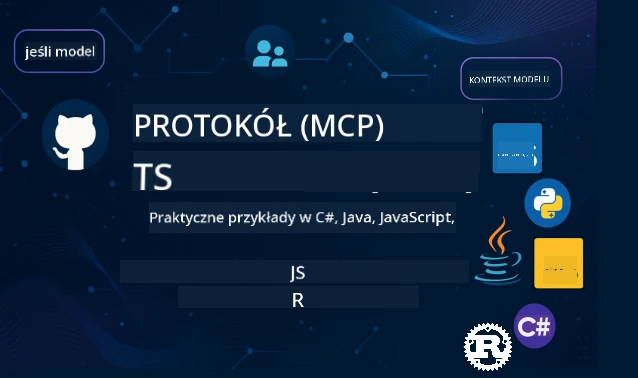

 

[](https://GitHub.com/microsoft/mcp-for-beginners/graphs/contributors)
[](https://GitHub.com/microsoft/mcp-for-beginners/issues)
[](https://GitHub.com/microsoft/mcp-for-beginners/pulls)
[](http://makeapullrequest.com)
[](https://mcptoplist.com/server/mcp.so%2Fmcp-for-beginners%2Fmicrosoft)

[](https://GitHub.com/microsoft/mcp-for-beginners/watchers)
[](https://GitHub.com/microsoft/mcp-for-beginners/fork)
[](https://GitHub.com/microsoft/mcp-for-beginners/stargazers)


[](https://discord.gg/nTYy5BXMWG)

Wykonaj te kroki, aby rozpocząć korzystanie z tych zasobów:
1. **Zrób Fork Repozytorium**: Kliknij [](https://GitHub.com/microsoft/mcp-for-beginners/fork)
2. **Sklonuj Repozytorium**: `git clone https://github.com/microsoft/mcp-for-beginners.git`
3. **Dołącz do** [](https://discord.gg/nTYy5BXMWG)


### 🌐 Wsparcie wielojęzyczne

#### Wsparcie przez GitHub Action (Automatyczne i Zawsze Aktualne)

<!-- CO-OP TRANSLATOR LANGUAGES TABLE START -->
[Arabic](../ar/README.md) | [Bengali](../bn/README.md) | [Bulgarian](../bg/README.md) | [Burmese (Myanmar)](../my/README.md) | [Chinese (Simplified)](../zh-CN/README.md) | [Chinese (Traditional, Hong Kong)](../zh-HK/README.md) | [Chinese (Traditional, Macau)](../zh-MO/README.md) | [Chinese (Traditional, Taiwan)](../zh-TW/README.md) | [Croatian](../hr/README.md) | [Czech](../cs/README.md) | [Danish](../da/README.md) | [Dutch](../nl/README.md) | [Estonian](../et/README.md) | [Finnish](../fi/README.md) | [French](../fr/README.md) | [German](../de/README.md) | [Greek](../el/README.md) | [Hebrew](../he/README.md) | [Hindi](../hi/README.md) | [Hungarian](../hu/README.md) | [Indonesian](../id/README.md) | [Italian](../it/README.md) | [Japanese](../ja/README.md) | [Kannada](../kn/README.md) | [Khmer](../km/README.md) | [Korean](../ko/README.md) | [Lithuanian](../lt/README.md) | [Malay](../ms/README.md) | [Malayalam](../ml/README.md) | [Marathi](../mr/README.md) | [Nepali](../ne/README.md) | [Nigerian Pidgin](../pcm/README.md) | [Norwegian](../no/README.md) | [Persian (Farsi)](../fa/README.md) | [Polish](./README.md) | [Portuguese (Brazil)](../pt-BR/README.md) | [Portuguese (Portugal)](../pt-PT/README.md) | [Punjabi (Gurmukhi)](../pa/README.md) | [Romanian](../ro/README.md) | [Russian](../ru/README.md) | [Serbian (Cyrillic)](../sr/README.md) | [Slovak](../sk/README.md) | [Slovenian](../sl/README.md) | [Spanish](../es/README.md) | [Swahili](../sw/README.md) | [Swedish](../sv/README.md) | [Tagalog (Filipino)](../tl/README.md) | [Tamil](../ta/README.md) | [Telugu](../te/README.md) | [Thai](../th/README.md) | [Turkish](../tr/README.md) | [Ukrainian](../uk/README.md) | [Urdu](../ur/README.md) | [Vietnamese](../vi/README.md)

> **Wolisz klonować lokalnie?**
>
> To repozytorium zawiera ponad 50 tłumaczeń językowych, co znacznie zwiększa rozmiar pobierania. Aby klonować bez tłumaczeń, użyj funkcji sparse checkout:
>
> **Bash / macOS / Linux:**
> ```bash
> git clone --filter=blob:none --sparse https://github.com/microsoft/mcp-for-beginners.git
> cd mcp-for-beginners
> git sparse-checkout set --no-cone '/*' '!translations' '!translated_images'
> ```
>
> **CMD (Windows):**
> ```cmd
> git clone --filter=blob:none --sparse https://github.com/microsoft/mcp-for-beginners.git
> cd mcp-for-beginners
> git sparse-checkout set --no-cone "/*" "!translations" "!translated_images"
> ```
>
> To dostarczy Ci wszystko, czego potrzebujesz, aby ukończyć kurs, z dużo szybszym pobraniem.
<!-- CO-OP TRANSLATOR LANGUAGES TABLE END -->

# 🚀 Program Nauczania Model Context Protocol (MCP) dla Początkujących

## **Ucz się MCP na praktycznych przykładach kodu w C#, Java, JavaScript, Rust, Python i TypeScript**

## 🧠 Przegląd programu nauczania Model Context Protocol
Witamy na Twojej drodze do Model Context Protocol! Jeśli kiedykolwiek zastanawiałeś się, jak aplikacje AI komunikują się z różnymi narzędziami i usługami, zaraz poznasz eleganckie rozwiązanie, które zmienia sposób tworzenia inteligentnych systemów przez deweloperów.

Pomyśl o MCP jak o uniwersalnym tłumaczu dla aplikacji AI – tak jak porty USB pozwalają podłączyć dowolne urządzenie do komputera, tak MCP pozwala modelom AI łączyć się z dowolnym narzędziem lub usługą w ustandaryzowany sposób. Niezależnie, czy tworzysz swojego pierwszego chatbota, czy pracujesz nad złożonymi przepływami AI, zrozumienie MCP da Ci moc tworzenia bardziej zdolnych i elastycznych aplikacji.

Ten program nauczania został zaprojektowany z cierpliwością i troską o Twoją ścieżkę uczenia się. Zaczniemy od prostych pojęć, które już znasz, i stopniowo będziemy budować Twoją wiedzę poprzez praktyczne ćwiczenia w Twoim ulubionym języku programowania. Każdy krok zawiera jasne wyjaśnienia, praktyczne przykłady i mnóstwo zachęty.

Po ukończeniu tej drogi będziesz miał pewność, że potrafisz tworzyć własne serwery MCP, integrować je z popularnymi platformami AI i rozumieć, jak ta technologia zmienia przyszłość rozwoju AI. Rozpocznijmy tę ekscytującą przygodę razem!

### Oficjalna dokumentacja i specyfikacje

Ten program nauczania jest zgodny z **Specyfikacją MCP 2025-11-25** (najnowszym stabilnym wydaniem). Specyfikacja MCP używa wersjonowania według daty (format RRRR-MM-DD), aby zapewnić jasne śledzenie wersji protokołu.

> **Patrząc w przyszłość:** kandydat na wydanie kolejnej wersji specyfikacji, **2026-07-28**, ma zostać wydany 28 lipca 2026. Uczynia protokół bezstanowym na warstwie transportu, formalizuje ramy rozszerzeń (Aplikacje MCP, Zadania), wzmacnia autoryzację i wycofuje Roots, Sampling oraz Logging. Zobacz [Co się zmienia w MCP: Kandydat na wydanie 2026-07-28](./01-CoreConcepts/mcp-2026-07-28-release-candidate.md) dla pełnego przeglądu.

Te zasoby stają się bardziej wartościowe wraz z pogłębianiem Twojej wiedzy, ale nie czuj presji, aby od razu przeczytać wszystko. Zacznij od obszarów, które interesują Cię najbardziej!
- 📘 [Dokumentacja MCP](https://modelcontextprotocol.io/) – To Twoje podstawowe źródło krok po kroku z samouczkami i przewodnikami użytkownika. Dokumentacja jest napisana z myślą o początkujących, oferując jasne przykłady, które możesz śledzić we własnym tempie.
- 📜 [Specyfikacja MCP](https://modelcontextprotocol.io/specification/2025-11-25) – Traktuj to jak kompleksowy podręcznik referencyjny. Podczas pracy z programem nauczania będziesz tu wracać, aby sprawdzić szczegóły i zgłębiać zaawansowane funkcje.
- 📜 [Wersjonowanie Specyfikacji MCP](https://modelcontextprotocol.io/specification/versioning) – Zawiera informacje o historii wersji protokołu i jak MCP używa wersjonowania według dat (format RRRR-MM-DD).
- 🧑‍💻 [Repozytorium MCP na GitHub](https://github.com/modelcontextprotocol) – Znajdziesz tu zestawy SDK, narzędzia i przykłady kodu w wielu językach programowania. To jak skarbnica praktycznych przykładów i gotowych do użycia komponentów.
- 🌐 [Społeczność MCP](https://github.com/orgs/modelcontextprotocol/discussions) – Dołącz do innych uczących się i doświadczonych programistów w dyskusjach na temat MCP. To wspierająca społeczność, gdzie pytania są mile widziane, a wiedza swobodnie dzielona.
  
## Cele nauki

Po zakończeniu tego programu nauczania będziesz czuć się pewnie i podekscytowany nowymi umiejętnościami. Oto, co osiągniesz:

• **Zrozumiesz podstawy MCP**: Poznasz, czym jest Model Context Protocol i dlaczego rewolucjonizuje współpracę aplikacji AI, korzystając z analogii i przykładów, które mają sens.

• **Zbudujesz swój pierwszy serwer MCP**: Stworzysz działający serwer MCP w swoim ulubionym języku programowania, zaczynając od prostych przykładów i rozwijając swoje umiejętności krok po kroku.

• **Połączysz modele AI z prawdziwymi narzędziami**: Nauczysz się, jak zbudować most między modelami AI a rzeczywistymi usługami, dając swoim aplikacjom potężne nowe możliwości.

• **Wdrożysz najlepsze praktyki bezpieczeństwa**: Zrozumiesz, jak zabezpieczyć swoje implementacje MCP, chroniąc zarówno aplikacje, jak i użytkowników.

• **Wdrażanie z pewnością siebie**: Dowiesz się, jak przenieść projekty MCP od etapu rozwoju do produkcji, korzystając z praktycznych strategii wdrożeniowych działających w prawdziwym świecie.

• **Dołącz do społeczności MCP**: Staniesz się częścią rosnącej społeczności programistów, którzy kształtują przyszłość rozwoju aplikacji AI. 

## Niezbędne podstawy

Zanim zagłębimy się w szczegóły MCP, upewnijmy się, że czujesz się komfortowo z podstawowymi pojęciami. Nie martw się, jeśli nie jesteś ekspertem w tych dziedzinach – wszystko Ci wyjaśnimy po drodze!

### Zrozumienie protokołów (podstawa)

Pomyśl o protokole jak o zasadach prowadzenia rozmowy. Gdy dzwonisz do przyjaciela, oboje wiecie, żeby powiedzieć „cześć” na powitanie, robić przerwy na rozmowę i zakończyć słowami „do widzenia”. Programy komputerowe potrzebują podobnych reguł, by skutecznie się komunikować.

MCP to protokół – zbiór ustalonych zasad, które pomagają modelom AI i aplikacjom prowadzić produktywne „rozmowy” z narzędziami i usługami. Tak jak zasady rozmowy ułatwiają komunikację ludzi, tak MCP czyni komunikację aplikacji AI bardziej niezawodną i skuteczną.

### Relacje klient-serwer (jak programy współpracują)

Już codziennie korzystasz z relacji klient-serwer! Gdy używasz przeglądarki internetowej (klienta), aby odwiedzić witrynę, łączysz się z serwerem, który wysyła Ci zawartość strony. Przeglądarka wie, jak zadawać pytania, a serwer jak odpowiadać.

W MCP mamy podobną relację: modele AI działają jako klienci, którzy żądają informacji lub działań, a serwery MCP dostarczają te możliwości. To jak posiadanie pomocnego asystenta (serwera), o którego AI może prosić o wykonanie konkretnych zadań.

### Dlaczego standaryzacja ma znaczenie (sprawia, że rzeczy działają razem)

Wyobraź sobie, że każdy producent samochodów używał innego kształtu pomp do tankowania – potrzebowałbyś innego adaptera do każdego auta! Standaryzacja oznacza zgodę co do wspólnych rozwiązań, by rzeczy działały razem bez przeszkód.

MCP zapewnia tę standaryzację dla aplikacji AI. Zamiast tego, aby każdy model AI potrzebował własnego kodu, by działać z każdym narzędziem, MCP tworzy uniwersalny sposób komunikacji. To pozwala deweloperom tworzyć narzędzia raz, które działają z wieloma systemami AI.

## 🧭 Przegląd Twojej ścieżki nauki

Twoja podróż z MCP jest starannie zaplanowana, aby stopniowo budować Twoją pewność i umiejętności. Każda faza wprowadza nowe pojęcia i utrwala to, czego już się nauczyłeś.

### 🌱 Faza podstawowa: Zrozumienie podstaw (moduły 0-2)

To tutaj zaczyna się Twoja przygoda! Wprowadzimy Cię w pojęcia MCP za pomocą znanych analogii i prostych przykładów. Zrozumiesz, czym jest MCP, dlaczego istnieje i jak wpisuje się w szerszy świat rozwoju AI.


• **Moduł 0 - Wprowadzenie do MCP**: Zaczniemy od poznania, czym jest MCP i dlaczego jest tak ważny dla nowoczesnych aplikacji AI. Zobaczysz przykłady MCP w działaniu z rzeczywistego świata i zrozumiesz, jak rozwiązuje powszechne problemy, z którymi mierzą się programiści.

• **Moduł 1 - Wyjaśnienie podstawowych koncepcji**: Tutaj nauczysz się podstawowych elementów MCP. Użyjemy wielu analogii i przykładów wizualnych, aby te koncepcje stały się naturalne i łatwe do zrozumienia.

• **Moduł 2 - Bezpieczeństwo w MCP**: Bezpieczeństwo może brzmieć onieśmielająco, ale pokażemy Ci, jak MCP zawiera wbudowane funkcje bezpieczeństwa oraz nauczymy najlepszych praktyk, które chronią Twoje aplikacje od samego początku.

### 🔨 Faza budowy: Tworzenie pierwszych implementacji (Moduł 3)

Teraz zaczyna się prawdziwa zabawa! Zdobędziesz praktyczne doświadczenie w budowaniu rzeczywistych serwerów i klientów MCP. Nie martw się – zaczniemy prosto i przeprowadzimy Cię przez każdy krok.

Ten moduł zawiera wiele praktycznych przewodników, które pozwolą Ci ćwiczyć w preferowanym języku programowania. Stworzysz swój pierwszy serwer, zbudujesz klienta do połączenia z nim, a nawet zintegrujesz się z popularnymi narzędziami programistycznymi jak VS Code.

Każdy przewodnik zawiera kompletne przykłady kodu, wskazówki dotyczące rozwiązywania problemów oraz wyjaśnienia, dlaczego podejmujemy konkretne decyzje projektowe. Po zakończeniu tej fazy będziesz mieć działające implementacje MCP, z których możesz być dumny!

### 🚀 Faza rozwoju: Zaawansowane koncepcje i zastosowania praktyczne (Moduły 4-5)

Opanowawszy podstawy, jesteś gotów odkrywać bardziej zaawansowane funkcje MCP. Omówimy praktyczne strategie implementacji, techniki debugowania oraz zaawansowane tematy, takie jak integracja AI multimodalnej.

Nauczysz się także, jak skalować swoje implementacje MCP do użytku produkcyjnego oraz integrować je z platformami chmurowymi, takimi jak Azure. Moduły te przygotują Cię do budowy rozwiązań MCP zdolnych sprostać wymaganiom realnego świata.

### 🌟 Faza mistrzostwa: Społeczność i specjalizacja (Moduły 6-11)

Ostatnia faza skupia się na dołączeniu do społeczności MCP i specjalizacji w obszarach, które najbardziej Cię interesują. Nauczysz się, jak współtworzyć otwarte projekty MCP, implementować zaawansowane wzorce uwierzytelniania oraz budować kompleksowe rozwiązania zintegrowane z bazami danych.

Moduł 11 zasługuje na szczególną uwagę – to kompletny, 13-laboratoryjny praktyczny cykl nauki, który nauczy Cię budować produkcyjne serwery MCP z integracją PostgreSQL. To jak projekt końcowy, który scala wszystko, czego się nauczyłeś!

### 📚 Kompletny schemat programu nauczania

| Moduł | Temat | Opis | Link |
|--------|-------|-------------|------|
| **Moduły 0-3: Fundamenty** | | | |
| 00 | Wprowadzenie do MCP | Przegląd Model Context Protocol i jego znaczenia w pipeline'ach AI | [Czytaj więcej](./00-Introduction/README.md) |
| 01 | Wyjaśnienie podstawowych koncepcji | Dogłębne omówienie podstawowych koncepcji MCP | [Czytaj więcej](./01-CoreConcepts/README.md) |
| 1.1 | Co się zmienia w MCP (2026-07-28 RC) | Protokół bezstanowy, framework rozszerzeń i wycofania funkcji w nadchodzącej wersji specyfikacji | [Przewodnik](./01-CoreConcepts/mcp-2026-07-28-release-candidate.md) |
| 02 | Bezpieczeństwo w MCP | Zagrożenia bezpieczeństwa i najlepsze praktyki | [Czytaj więcej](./02-Security/README.md) |
| 03 | Pierwsze kroki z MCP | Konfiguracja środowiska, podstawowe serwery/klienci, integracja | [Czytaj więcej](./03-GettingStarted/README.md) |
| **Moduł 3: Tworzenie pierwszego serwera i klienta** | | | |
| 3.1 | Pierwszy serwer | Stwórz swój pierwszy serwer MCP | [Przewodnik](./03-GettingStarted/01-first-server/README.md) |
| 3.2 | Pierwszy klient | Rozwijaj podstawowego klienta MCP | [Przewodnik](./03-GettingStarted/02-client/README.md) |
| 3.3 | Klient z LLM | Integracja dużych modeli językowych | [Przewodnik](./03-GettingStarted/03-llm-client/README.md) |
| 3.4 | Integracja z VS Code | Konsumuj serwery MCP w VS Code | [Przewodnik](./03-GettingStarted/04-vscode/README.md) |
| 3.5 | Serwer stdio | Twórz serwery używając transportu stdio | [Przewodnik](./03-GettingStarted/05-stdio-server/README.md) |
| 3.6 | Strumieniowanie HTTP | Wdrażanie strumieniowania HTTP w MCP | [Przewodnik](./03-GettingStarted/06-http-streaming/README.md) |
| 3.7 | Microsoft Foundry Toolkit | Użyj Microsoft Foundry Toolkit z MCP | [Przewodnik](./03-GettingStarted/07-aitk/README.md) |
| 3.8 | Testowanie | Testuj swoją implementację serwera MCP | [Przewodnik](./03-GettingStarted/08-testing/README.md) |
| 3.9 | Wdrożenie | Wdrażaj serwery MCP do produkcji | [Przewodnik](./03-GettingStarted/09-deployment/README.md) |
| 3.10 | Zaawansowane użycie serwera | Używaj zaawansowanych serwerów dla funkcji zaawansowanych i lepszej architektury | [Przewodnik](./03-GettingStarted/10-advanced/README.md) |
| 3.11 | Proste uwierzytelnianie | Rozdział pokazujący uwierzytelnianie od podstaw i RBAC | [Przewodnik](./03-GettingStarted/11-simple-auth/README.md) |
| 3.12 | Hosty MCP | Konfiguruj Claude Desktop, Cursor, Cline i inne hosty MCP | [Przewodnik](./03-GettingStarted/12-mcp-hosts/README.md) |
| 3.13 | MCP Inspector | Debuguj i testuj serwery MCP narzędziem Inspector | [Przewodnik](./03-GettingStarted/13-mcp-inspector/README.md) |
| 3.14 | Próbkowanie | Używaj próbkowania, aby współpracować z klientem | [Przewodnik](./03-GettingStarted/14-sampling/README.md) |
| 3.15 | Aplikacje MCP | Buduj aplikacje MCP | [Przewodnik](./03-GettingStarted/15-mcp-apps/README.md) |
| **Moduły 4-5: Praktyczne i zaawansowane** | | | |
| 04 | Praktyczna implementacja | SDK, debugowanie, testowanie, wielokrotnego użytku szablony promptów | [Czytaj więcej](./04-PracticalImplementation/README.md) |
| 4.1 | Paginacja | Obsługa dużych zestawów wyników z paginacją opartą na kursorze | [Przewodnik](./04-PracticalImplementation/pagination/README.md) |
| 05 | Zaawansowane tematy w MCP | AI multimodalna, skalowanie, użycie korporacyjne | [Czytaj więcej](./05-AdvancedTopics/README.md) |
| 5.1 | Integracja z Azure | Integracja MCP z Azure | [Przewodnik](./05-AdvancedTopics/mcp-integration/README.md) |
| 5.2 | Multimodalność | Praca z wieloma modalnościami | [Przewodnik](./05-AdvancedTopics/mcp-multi-modality/README.md) |
| 5.3 | Demo OAuth2 | Implementacja uwierzytelniania OAuth2 | [Przewodnik](./05-AdvancedTopics/mcp-oauth2-demo/README.md) |
| 5.4 | Konteksty główne | Zrozumienie i implementacja kontekstów głównych | [Przewodnik](./05-AdvancedTopics/mcp-root-contexts/README.md) |
| 5.5 | Routing | Strategie routingu MCP | [Przewodnik](./05-AdvancedTopics/mcp-routing/README.md) |
| 5.6 | Próbkowanie | Techniki próbkowania w MCP | [Przewodnik](./05-AdvancedTopics/mcp-sampling/README.md) |
| 5.7 | Skalowanie | Skaluje implementacje MCP | [Przewodnik](./05-AdvancedTopics/mcp-scaling/README.md) |
| 5.8 | Bezpieczeństwo | Zaawansowane kwestie bezpieczeństwa | [Przewodnik](./05-AdvancedTopics/mcp-security/README.md) |
| 5.9 | Wyszukiwanie w sieci | Wdrażanie możliwości wyszukiwania w sieci | [Przewodnik](./05-AdvancedTopics/web-search-mcp/README.md) |
| 5.10 | Strumieniowanie w czasie rzeczywistym | Budowanie funkcjonalności strumieniowania w czasie rzeczywistym | [Przewodnik](./05-AdvancedTopics/mcp-realtimestreaming/README.md) |
| 5.11 | Wyszukiwanie w czasie rzeczywistym | Implementacja wyszukiwania w czasie rzeczywistym | [Przewodnik](./05-AdvancedTopics/mcp-realtimesearch/README.md) |
| 5.12 | Uwierzytelnianie Entra ID | Uwierzytelnianie z Microsoft Entra ID | [Przewodnik](./05-AdvancedTopics/mcp-security-entra/README.md) |
| 5.13 | Integracja Foundry | Integracja z Microsoft Foundry | [Przewodnik](./05-AdvancedTopics/mcp-foundry-agent-integration/README.md) |
| 5.14 | Inżynieria kontekstów | Techniki efektywnej inżynierii kontekstów | [Przewodnik](./05-AdvancedTopics/mcp-contextengineering/README.md) |
| 5.15 | Niestandardowy transport MCP | Implementacje niestandardowego transportu | [Przewodnik](./05-AdvancedTopics/mcp-transport/README.md) |
| 5.16 | Funkcje protokołu | Powiadomienia o postępie, anulowanie, szablony zasobów | [Przewodnik](./05-AdvancedTopics/mcp-protocol-features/README.md) |
| 5.17 | Adwersaryjne rozumowanie multi-agentowe | Dwóch agentów argumentuje przeciwne strony, używając wspólnych narzędzi MCP, ocenianych przez agenta sędziego | [Przewodnik](./05-AdvancedTopics/mcp-adversarial-agents/README.md) |
| **Moduły 6-10: Społeczność i najlepsze praktyki** | | | |
| 06 | Wkłady społeczności | Jak współtworzyć ekosystem MCP | [Przewodnik](./06-CommunityContributions/README.md) |
| 07 | Wnioski z wczesnego wdrożenia | Historie implementacji z rzeczywistego świata | [Przewodnik](./07-LessonsfromEarlyAdoption/README.md) |
| 08 | Najlepsze praktyki dla MCP | Wydajność, odporność na błędy, niezawodność | [Przewodnik](./08-BestPractices/README.md) |
| 09 | Studia przypadków MCP | Praktyczne przykłady implementacji | [Przewodnik](./09-CaseStudy/README.md) |
| 10 | Warsztat praktyczny | Budowa serwera MCP z Microsoft Foundry Toolkit | [Laboratorium](./10-StreamliningAIWorkflowsBuildingAnMCPServerWithAIToolkit/README.md) |
| **Moduł 11: Laboratorium praktyczne serwera MCP** | | | |
| 11 | Integracja serwera MCP z bazą danych | Kompleksowa ścieżka 13 laboratoriów praktycznych dla integracji PostgreSQL | [Laboratoria](./11-MCPServerHandsOnLabs/README.md) |
| 11.1 | Wprowadzenie | Przegląd MCP z integracją bazy danych oraz przypadek użycia analiz detalicznych | [Laboratorium 00](./11-MCPServerHandsOnLabs/00-Introduction/README.md) |
| 11.2 | Architektura podstawowa | Zrozumienie architektury serwera MCP, warstw bazy danych oraz wzorców bezpieczeństwa | [Laboratorium 01](./11-MCPServerHandsOnLabs/01-Architecture/README.md) |
| 11.3 | Bezpieczeństwo i multi-tenancy | Bezpieczeństwo na poziomie wiersza, uwierzytelnianie i dostęp do danych wielu tenantów | [Laboratorium 02](./11-MCPServerHandsOnLabs/02-Security/README.md) |
| 11.4 | Konfiguracja środowiska | Konfiguracja środowiska deweloperskiego, Docker, zasoby Azure | [Laboratorium 03](./11-MCPServerHandsOnLabs/03-Setup/README.md) |
| 11.5 | Projektowanie bazy danych | Konfiguracja PostgreSQL, projekt schema handlu detalicznego i przykładowe dane | [Laboratorium 04](./11-MCPServerHandsOnLabs/04-Database/README.md) |
| 11.6 | Implementacja serwera MCP | Budowanie serwera FastMCP z integracją bazy danych | [Laboratorium 05](./11-MCPServerHandsOnLabs/05-MCP-Server/README.md) |
| 11.7 | Tworzenie narzędzi | Tworzenie narzędzi do zapytań bazodanowych i introspekcji schematu | [Laboratorium 06](./11-MCPServerHandsOnLabs/06-Tools/README.md) |
| 11.8 | Wyszukiwanie semantyczne | Implementacja osadzeń wektorowych z Azure OpenAI i pgvector | [Laboratorium 07](./11-MCPServerHandsOnLabs/07-Semantic-Search/README.md) |
| 11.9 | Testowanie i debugowanie | Strategie testowania, narzędzia debugowania i podejścia walidacyjne | [Laboratorium 08](./11-MCPServerHandsOnLabs/08-Testing/README.md) |
| 11.10 | Integracja z VS Code | Konfiguracja integracji MCP w VS Code i korzystanie z czatu AI | [Laboratorium 09](./11-MCPServerHandsOnLabs/09-VS-Code/README.md) |
| 11.11 | Strategie wdrożeniowe | Wdrożenie Docker, Azure Container Apps i rozważania dotyczące skalowania | [Laboratorium 10](./11-MCPServerHandsOnLabs/10-Deployment/README.md) |
| 11.12 | Monitorowanie | Application Insights, logowanie, monitorowanie wydajności | [Laboratorium 11](./11-MCPServerHandsOnLabs/11-Monitoring/README.md) |
| 11.13 | Najlepsze praktyki | Optymalizacja wydajności, wzmacnianie bezpieczeństwa, wskazówki produkcyjne | [Laboratorium 12](./11-MCPServerHandsOnLabs/12-Best-Practices/README.md) |
| **Moduł 12: Narzędzia MCP** | | | |
| 12.1 | Narzędzia | Użycie MCP w aplikacji Copilot | [ Przewodnik ](./12-tooling/README.md) |

### 💻 Przykładowe projekty kodu

Jedną z najbardziej ekscytujących części nauki MCP jest stopniowy rozwój Twoich umiejętności kodowania. Zaprojektowaliśmy nasze przykłady kodu tak, aby zaczynały się prosto, a potem stawały się coraz bardziej zaawansowane w miarę pogłębiania Twojej wiedzy. Oto, jak wprowadzamy koncepcje — kod, który jest łatwy do zrozumienia, ale pokazuje prawdziwe zasady MCP, pozwoli Ci zrozumieć nie tylko, co ten kod robi, ale dlaczego jest tak zbudowany i jak wpisuje się w większe aplikacje MCP.

#### Podstawowe przykłady kalkulatora MCP

| Język | Opis | Link |
|----------|-------------|------|

| C# | Przykład serwera MCP | [Zobacz kod](./03-GettingStarted/samples/csharp/README.md) |
| Java | Kalkulator MCP | [Zobacz kod](./03-GettingStarted/samples/java/calculator/README.md) |
| JavaScript | Demo MCP | [Zobacz kod](./03-GettingStarted/samples/javascript/README.md) |
| Python | Serwer MCP | [Zobacz kod](../../03-GettingStarted/samples/python/mcp_calculator_server.py) |
| TypeScript | Przykład MCP | [Zobacz kod](./03-GettingStarted/samples/typescript/README.md) |
| Rust | Przykład MCP | [Zobacz kod](./03-GettingStarted/samples/rust/README.md) |

#### Zaawansowane implementacje MCP

| Język | Opis | Link |
|----------|-------------|------|
| C# | Zaawansowany przykład | [Zobacz kod](./04-PracticalImplementation/samples/csharp/README.md) |
| Java z Spring | Przykład aplikacji kontenerowej | [Zobacz kod](./04-PracticalImplementation/samples/java/containerapp/README.md) |
| JavaScript | Zaawansowany przykład | [Zobacz kod](./04-PracticalImplementation/samples/javascript/README.md) |
| Python | Złożona implementacja | [Zobacz kod](./04-PracticalImplementation/samples/python/README.md) |
| TypeScript | Przykład kontenera | [Zobacz kod](./04-PracticalImplementation/samples/typescript/README.md) |


## 🎯 Wymagania wstępne do nauki MCP

Aby maksymalnie skorzystać z tego programu nauczania, powinieneś mieć:

- Podstawową znajomość programowania w przynajmniej jednym z następujących języków: C#, Java, JavaScript, Python lub TypeScript
- Zrozumienie modelu klient-serwer oraz interfejsów API
- Znajomość koncepcji REST i HTTP
- (Opcjonalnie) Tło w koncepcjach sztucznej inteligencji / uczenia maszynowego

- Udział w dyskusjach naszej społeczności dla wsparcia

## 📚 Przewodnik i zasoby do nauki

To repozytorium zawiera kilka zasobów, które pomogą Ci skutecznie się uczyć i nawigować:

### Przewodnik do nauki

Dostępny jest obszerny [Przewodnik do nauki](./study_guide.md), który pomaga skutecznie poruszać się po tym repozytorium. Ten wizualny plan lekcji pokazuje, jak wszystkie tematy są powiązane i dostarcza wskazówek, jak efektywnie korzystać z projektów przykładowych. Jest szczególnie pomocny dla osób uczących się wizualnie, które lubią widzieć całościowy obraz.

Przewodnik zawiera:
- Wizualny plan lekcji pokazujący wszystkie omówione tematy
- Szczegółowy podział każdej sekcji repozytorium
- Wskazówki, jak korzystać z projektów przykładowych
- Rekomendowane ścieżki nauki dla różnych poziomów zaawansowania
- Dodatkowe zasoby uzupełniające proces nauki

### Dziennik zmian

Prowadzimy szczegółowy [Dziennik zmian](./changelog.md), który śledzi wszystkie znaczące aktualizacje materiałów programu nauczania, dzięki czemu możesz być na bieżąco z najnowszymi ulepszeniami i dodatkami.
- Dodanie nowej zawartości
- Zmiany strukturalne
- Ulepszenia funkcji
- Aktualizacje dokumentacji

## 🛠️ Jak skutecznie korzystać z tego programu nauczania

Każda lekcja w tym przewodniku zawiera:

1. Jasne wyjaśnienia koncepcji MCP  
2. Przykłady kodu w czasie rzeczywistym w wielu językach  
3. Ćwiczenia do tworzenia rzeczywistych aplikacji MCP  
4. Dodatkowe zasoby dla zaawansowanych uczniów

### Nauczmy się MCP z C# - seria tutoriali
Poznajemy Model Context Protocol (MCP), nowoczesny framework zaprojektowany w celu standaryzacji interakcji między modelami AI a aplikacjami klienckimi. Podczas tej sesji dla początkujących wprowadzimy Cię w MCP i pokażemy, jak stworzyć swój pierwszy serwer MCP.
#### C#: [https://aka.ms/letslearnmcp-csharp](https://aka.ms/letslearnmcp-csharp)
#### Java: [https://aka.ms/letslearnmcp-java](https://aka.ms/letslearnmcp-java)
#### JavaScript: [https://aka.ms/letslearnmcp-javascript](https://aka.ms/letslearnmcp-javascript)
#### Python: [https://aka.ms/letslearnmcp-python](https://aka.ms/letslearnmcp-python)

## 🎓 Twoja podróż z MCP zaczyna się

Gratulacje! Właśnie wykonałeś pierwszy krok w ekscytującej podróży, która poszerzy twoje umiejętności programistyczne i połączy Cię z najnowszymi osiągnięciami w rozwoju AI.

### Co już osiągnąłeś

Czytając to wprowadzenie, już zacząłeś budować fundament wiedzy o MCP. Rozumiesz, czym jest MCP, dlaczego jest ważne i jak ten program nauczania wesprze twoją naukę. To znaczące osiągnięcie i początek Twojej ekspertyzy w tej ważnej technologii.

### Przygoda przed Tobą

W miarę postępów w modułach pamiętaj, że każdy ekspert był kiedyś początkującym. Koncepcje, które teraz mogą wydawać się skomplikowane, staną się drugą naturą, gdy będziesz je ćwiczyć i stosować. Każdy mały krok buduje potężne umiejętności, które będą Ci służyć przez całą karierę programistyczną.

### Twoja sieć wsparcia

Dołączasz do społeczności uczniów i ekspertów, którzy pasjonują się MCP i chętnie pomagają innym osiągać sukcesy. Niezależnie od tego, czy utkniesz na wyzwaniu programistycznym, czy zechcesz podzielić się odkryciem, społeczność jest tutaj, by wspierać twoją podróż.

Jeśli utkniesz lub masz pytania dotyczące tworzenia aplikacji AI, dołącz do dyskusji z innymi uczniami i doświadczonymi deweloperami o MCP. To wspierająca społeczność, gdzie pytania są mile widziane, a wiedza dzielona jest bez ograniczeń.

[](https://discord.gg/nTYy5BXMWG)

Jeśli masz opinie o produkcie lub błędy podczas tworzenia, odwiedź:

[](https://aka.ms/foundry/forum)

### Gotowy, by zacząć?

Twoja przygoda z MCP zaczyna się teraz! Zacznij od Modułu 0, aby zanurzyć się w swoje pierwsze praktyczne doświadczenia z MCP, lub zapoznaj się z projektami przykładowymi, aby zobaczyć, co będziesz tworzyć. Pamiętaj - każdy ekspert zaczynał dokładnie tam, gdzie ty teraz, a z cierpliwością i praktyką będziesz zdumiony swoimi możliwościami.

Witamy w świecie tworzenia Model Context Protocol. Zbudujmy razem coś niesamowitego!

## 🤝 Współtworzenie społeczności uczących się

Ten program nauczania staje się silniejszy dzięki wkładowi uczących się, takich jak ty! Niezależnie, czy poprawiasz literówkę, proponujesz jaśniejsze wyjaśnienie, czy dodajesz nowy przykład, twoje wkłady pomagają innym początkującym odnieść sukces.

Podziękowania dla Microsoft Valued Professional [Shivam Goyal](https://www.linkedin.com/in/shivam2003/) za dostarczenie próbek kodu.

Proces zgłaszania wkładów jest zaprojektowany tak, by być gościnny i wspierający. Większość wkładów wymaga umowy licencyjnej dla współtwórców (CLA), ale narzędzia automatyczne przeprowadzą cię przez proces bez problemów.

## 📜 Nauka open source

Cały ten program nauczania jest dostępny na licencji MIT [LICENSE](../../LICENSE), co oznacza, że możesz go używać, modyfikować i swobodnie udostępniać. Wspiera to naszą misję uczynienia wiedzy o MCP dostępną dla programistów na całym świecie.
## 🤝 Zasady współtworzenia

Projekt ten zaprasza do współpracy i sugestii. Większość wkładów wymaga, abyś zgodził się na
Contributor License Agreement (CLA), deklarując, że masz prawo i faktycznie udzielasz nam
praw do korzystania z twojego wkładu. Szczegóły znajdziesz pod adresem <https://cla.opensource.microsoft.com>.

Podczas zgłaszania pull requesta, bot CLA automatycznie określi, czy musisz dostarczyć
CLA i odpowiednio oznaczy PR (np. kontrola statusu, komentarz). Po prostu postępuj zgodnie z instrukcjami
przekazanymi przez bota. Będziesz musiał to zrobić tylko raz dla wszystkich repozytoriów korzystających z naszego CLA.

Projekt ten przyjął [Microsoft Open Source Code of Conduct](https://opensource.microsoft.com/codeofconduct/).
Więcej informacji znajdziesz w [Code of Conduct FAQ](https://opensource.microsoft.com/codeofconduct/faq/) lub
skontaktuj się z [opencode@microsoft.com](mailto:opencode@microsoft.com) w razie dodatkowych pytań lub uwag.

---

*Gotowy na rozpoczęcie swojej przygody z MCP? Zacznij od [Modułu 00 - Wprowadzenie do MCP](./00-Introduction/README.md) i zrób pierwsze kroki w świecie tworzenia Model Context Protocol!*


## 🎒 Inne kursy
Nasz zespół tworzy inne kursy! Sprawdź:

<!-- CO-OP TRANSLATOR OTHER COURSES START -->
### LangChain
[](https://aka.ms/langchain4j-for-beginners)
[](https://aka.ms/langchainjs-for-beginners?WT.mc_id=m365-94501-dwahlin)
[](https://github.com/microsoft/langchain-for-beginners?WT.mc_id=m365-94501-dwahlin)
---

### Azure / Edge / MCP / Agenci
[](https://github.com/microsoft/AZD-for-beginners?WT.mc_id=academic-105485-koreyst)
[](https://github.com/microsoft/edgeai-for-beginners?WT.mc_id=academic-105485-koreyst)
[](https://github.com/microsoft/mcp-for-beginners?WT.mc_id=academic-105485-koreyst)
[](https://github.com/microsoft/ai-agents-for-beginners?WT.mc_id=academic-105485-koreyst)

---
 
### Seria Generatywnej AI
[](https://github.com/microsoft/generative-ai-for-beginners?WT.mc_id=academic-105485-koreyst)
[-9333EA?style=for-the-badge&labelColor=E5E7EB&color=9333EA)](https://github.com/microsoft/Generative-AI-for-beginners-dotnet?WT.mc_id=academic-105485-koreyst)
[-C084FC?style=for-the-badge&labelColor=E5E7EB&color=C084FC)](https://github.com/microsoft/generative-ai-for-beginners-java?WT.mc_id=academic-105485-koreyst)
[-E879F9?style=for-the-badge&labelColor=E5E7EB&color=E879F9)](https://github.com/microsoft/generative-ai-with-javascript?WT.mc_id=academic-105485-koreyst)

---
 
### Podstawowa nauka
[](https://aka.ms/ml-beginners?WT.mc_id=academic-105485-koreyst)
[](https://aka.ms/datascience-beginners?WT.mc_id=academic-105485-koreyst)
[](https://aka.ms/ai-beginners?WT.mc_id=academic-105485-koreyst)

[](https://github.com/microsoft/Security-101?WT.mc_id=academic-96948-sayoung)
[](https://aka.ms/webdev-beginners?WT.mc_id=academic-105485-koreyst)
[](https://aka.ms/iot-beginners?WT.mc_id=academic-105485-koreyst)
[](https://github.com/microsoft/xr-development-for-beginners?WT.mc_id=academic-105485-koreyst)

---
 
### Seria Copilot
[](https://aka.ms/GitHubCopilotAI?WT.mc_id=academic-105485-koreyst)
[](https://github.com/microsoft/mastering-github-copilot-for-dotnet-csharp-developers?WT.mc_id=academic-105485-koreyst)
[](https://github.com/microsoft/CopilotAdventures?WT.mc_id=academic-105485-koreyst)
<!-- CO-OP TRANSLATOR OTHER COURSES END -->

---

<!-- CO-OP TRANSLATOR DISCLAIMER START -->
**Zastrzeżenie**:
Niniejszy dokument został przetłumaczony za pomocą usługi tłumaczenia AI [Co-op Translator](https://github.com/Azure/co-op-translator). Choć dążymy do dokładności, prosimy pamiętać, że automatyczne tłumaczenia mogą zawierać błędy lub niedokładności. Oryginalny dokument w jego języku źródłowym należy uznawać za autorytatywne źródło. W przypadku informacji krytycznych zalecane jest skorzystanie z profesjonalnego tłumaczenia wykonanego przez człowieka. Nie ponosimy odpowiedzialności za jakiekolwiek nieporozumienia lub błędne interpretacje wynikające z użycia tego tłumaczenia.
<!-- CO-OP TRANSLATOR DISCLAIMER END -->