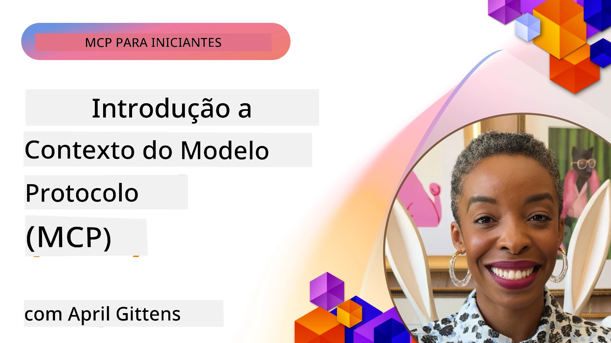
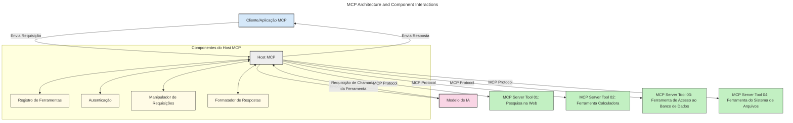
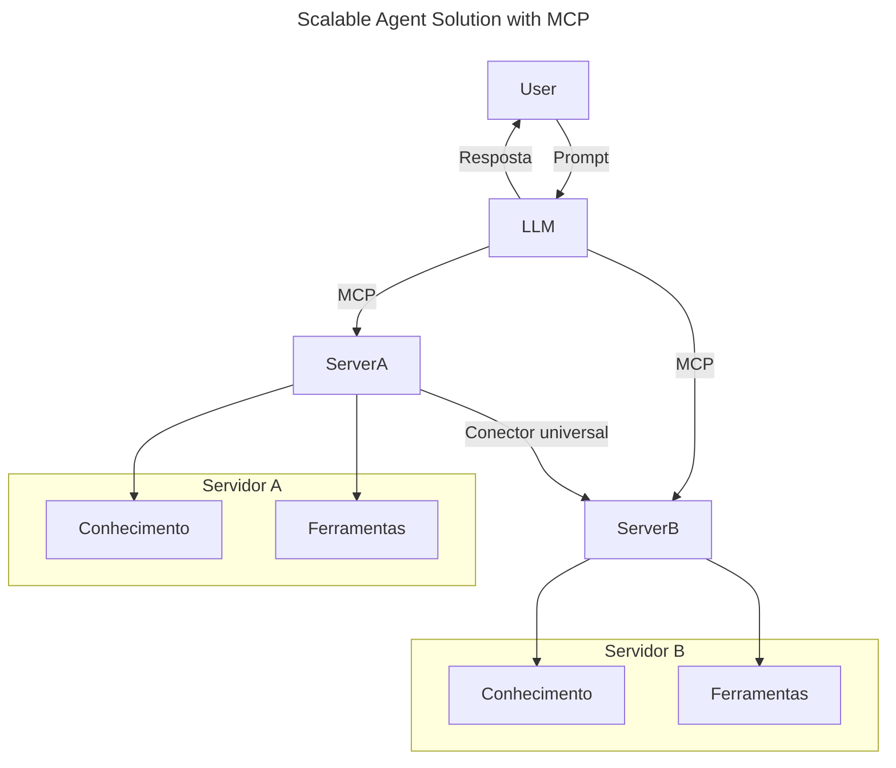
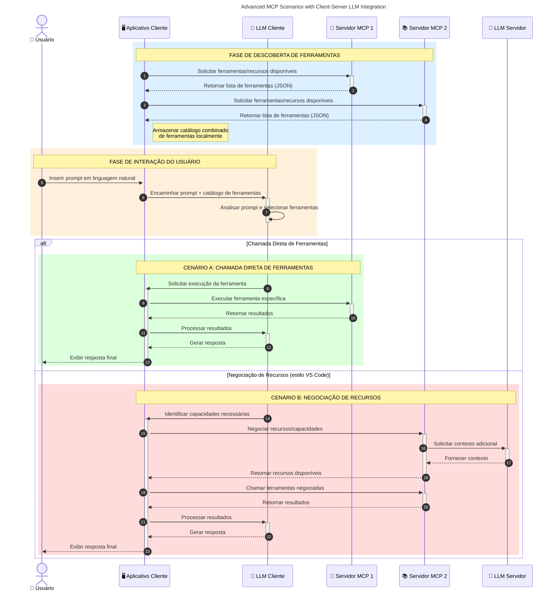

# Introdução ao Protocolo de Contexto do Modelo (MCP): Por Que Ele Importa para Aplicações de IA Escaláveis

_(Clique na imagem acima para assistir ao vídeo desta lição)_

Aplicações de IA generativa são um grande avanço, pois frequentemente permitem que o usuário interaja com o app usando comandos em linguagem natural. No entanto, à medida que mais tempo e recursos são investidos nessas aplicações, você quer garantir que seja fácil integrar funcionalidades e recursos de modo que seja simples expandir, que seu app possa atender a mais de um modelo sendo usado e lidar com várias particularidades de modelos. Em resumo, construir apps de IA generativa é fácil no começo, mas conforme crescem e se tornam mais complexos, você precisa começar a definir uma arquitetura e provavelmente confiará em um padrão para garantir que seus apps sejam construídos de maneira consistente. É aí que o MCP entra para organizar as coisas e fornecer um padrão.

---

## **🔍 O Que É o Protocolo de Contexto do Modelo (MCP)?**

O **Protocolo de Contexto do Modelo (MCP)** é uma **interface aberta e padronizada** que permite que Modelos de Linguagem de Grande Escala (LLMs) interajam perfeitamente com ferramentas externas, APIs e fontes de dados. Ele fornece uma arquitetura consistente para melhorar a funcionalidade do modelo de IA além dos seus dados de treinamento, possibilitando sistemas de IA mais inteligentes, escaláveis e responsivos.

---

## **🎯 Por Que a Padronização em IA Importa**

Conforme as aplicações de IA generativa se tornam mais complexas, é essencial adotar padrões que garantam **escalabilidade, extensibilidade, manutenção** e **evitar aprisionamento por fornecedor**. O MCP atende a essas necessidades ao:

- Unificar integrações modelo-ferramenta
- Reduzir soluções únicas e frágeis feitas sob medida
- Permitir que múltiplos modelos de diferentes fornecedores coexistam em um só ecossistema

**Nota:** Embora o MCP se denomine um padrão aberto, não há planos para padronizar o MCP por nenhum órgão de padrões existente como IEEE, IETF, W3C, ISO ou qualquer outro órgão.

---

## **📚 Objetivos de Aprendizagem**

Ao final deste artigo, você será capaz de:

- Definir o **Protocolo de Contexto do Modelo (MCP)** e seus casos de uso
- Entender como o MCP padroniza a comunicação modelo-ferramenta
- Identificar os componentes principais da arquitetura do MCP
- Explorar aplicações reais do MCP em contextos empresariais e de desenvolvimento

---

## **💡 Por Que o Protocolo de Contexto do Modelo (MCP) É uma Mudança de Jogo**

### **🔗 MCP Resolve a Fragmentação nas Interações de IA**

Antes do MCP, integrar modelos com ferramentas exigia:

- Código personalizado para cada par ferramenta-modelo
- APIs não padronizadas para cada fornecedor
- Quebras frequentes devido a atualizações
- Escalabilidade pobre com mais ferramentas

### **✅ Benefícios da Padronização MCP**

| **Benefício**              | **Descrição**                                                                |
|--------------------------|--------------------------------------------------------------------------------|
| Interoperabilidade         | LLMs funcionam de forma integrada com ferramentas de diferentes fornecedores   |
| Consistência              | Comportamento uniforme entre plataformas e ferramentas                        |
| Reutilização              | Ferramentas construídas uma vez podem ser usadas em vários projetos e sistemas|
| Desenvolvimento Acelerado  | Reduz o tempo de desenvolvimento usando interfaces padronizadas plug-and-play |

---

## **🧱 Visão Geral da Arquitetura MCP em Alto Nível**

O MCP segue um **modelo cliente-servidor**, onde:

- **Hosts MCP** executam os modelos de IA
- **Clientes MCP** iniciam as requisições
- **Servidores MCP** oferecem contexto, ferramentas e capacidades

### **Componentes Chave:**

- **Recursos** – Dados estáticos ou dinâmicos para modelos  
- **Prompts** – Fluxos de trabalho predefinidos para geração guiada  
- **Ferramentas** – Funções executáveis como busca, cálculos  
- **Amostragem** – Comportamento agente via interações recursivas (obsoleto no
    MCP `2026-07-28`; novas implementações devem integrar diretamente com um
    provedor de LLM)
- **Elicitação** – Requisições iniciadas pelo servidor para entrada do usuário
- **Raízes** – Localizações informacionais no sistema de arquivos relevantes para um servidor
    (obsoleto no MCP `2026-07-28`; prefira parâmetros de ferramentas, URIs de recursos,
    ou configuração do servidor)

### **Arquitetura do Protocolo:**

O MCP usa uma arquitetura de duas camadas:
- **Camada de Dados**: mensagens JSON-RPC 2.0, metadados por requisição, descoberta e
    primitivas do protocolo
- **Camada de Transporte**: stdio para subprocessos locais e HTTP Transmitido para
    servidores remotos. O HTTP Transmitido pode usar framing SSE para respostas
    transmitidas, mas o transporte HTTP+SSE antigo está obsoleto.

---

## Como Funcionam os Servidores MCP

Os servidores MCP operam da seguinte forma:

- **Fluxo de Requisição**:
    1. Uma requisição é iniciada por um usuário final ou software atuando em seu nome.
    2. O **Cliente MCP** envia a requisição a um **Host MCP**, que gerencia o runtime do Modelo de IA.
    3. O **Modelo de IA** recebe o prompt do usuário e pode solicitar acesso a ferramentas externas ou dados via uma ou mais chamadas de ferramentas.
    4. O **Host MCP**, e não o modelo diretamente, comunica-se com os **Servidores MCP** apropriados usando o protocolo padronizado.
- **Funcionalidade do Host MCP**:
    - **Registro de Ferramentas**: Mantém um catálogo de ferramentas disponíveis e suas capacidades.
    - **Autenticação**: Verifica permissões para acesso a ferramentas.
    - **Manipulador de Requisições**: Processa as requisições de ferramentas vindas do modelo.
    - **Formatador de Resposta**: Estrutura as saídas das ferramentas em formato compreensível pelo modelo.
- **Execução do Servidor MCP**:
    - O **Host MCP** direciona as chamadas de ferramentas para um ou mais **Servidores MCP**, cada um expondo funções especializadas (ex.: busca, cálculos, consultas a banco de dados).
    - Os **Servidores MCP** realizam suas operações respectivas e retornam resultados ao **Host MCP** em formato consistente.
    - O **Host MCP** formata e repassa esses resultados ao **Modelo de IA**.
- **Finalização da Resposta**:
    - O **Modelo de IA** incorpora as saídas das ferramentas em uma resposta final.
    - O **Host MCP** envia essa resposta de volta ao **Cliente MCP**, que a entrega ao usuário final ou software solicitante.
    

## 👨‍💻 Como Construir um Servidor MCP (Com Exemplos)

Servidores MCP permitem expandir as capacidades do LLM fornecendo dados e funcionalidades. 

Pronto para experimentar? Aqui estão SDKs específicos por linguagem e stack com exemplos de criação de servidores MCP simples em diferentes linguagens/stacks:

- **SDK Python**: https://github.com/modelcontextprotocol/python-sdk

- **SDK TypeScript**: https://github.com/modelcontextprotocol/typescript-sdk

- **SDK Java**: https://github.com/modelcontextprotocol/java-sdk

- **SDK C#/.NET**: https://github.com/modelcontextprotocol/csharp-sdk

## 🌍 Casos de Uso Reais para MCP

O MCP possibilita uma ampla variedade de aplicações ao expandir as capacidades da IA:

| **Aplicação**              | **Descrição**                                                                |
|------------------------------|--------------------------------------------------------------------------------|
| Integração de Dados Empresariais  | Conecte LLMs a bancos de dados, CRMs ou ferramentas internas               |
| Sistemas de IA Agentes           | Habilite agentes autônomos com acesso a ferramentas e fluxos de decisão     |
| Aplicações Multimodais           | Combine ferramentas de texto, imagem e áudio em um único app de IA          |
| Integração de Dados em Tempo Real| Traga dados ao vivo para interações de IA para respostas mais precisas e atuais |

### 🧠 MCP = Padrão Universal para Interações de IA

O Protocolo de Contexto do Modelo (MCP) atua como um padrão universal para interações de IA, assim como o USB-C padronizou conexões físicas para dispositivos. No mundo da IA, o MCP fornece uma interface consistente, permitindo que modelos (clientes) integrem-se perfeitamente a ferramentas externas e provedores de dados (servidores). Isso elimina a necessidade de protocolos diversos e customizados para cada API ou fonte de dados.

Sob o MCP, uma ferramenta compatível (chamada servidor MCP) segue um padrão unificado. Esses servidores podem listar as ferramentas ou ações que oferecem e executá-las quando solicitados por um agente de IA. Plataformas de agentes de IA que suportam MCP podem descobrir as ferramentas disponíveis nos servidores e invocá-las por meio deste protocolo padrão.

### 💡 Facilita o acesso ao conhecimento

Além de oferecer ferramentas, o MCP também facilita o acesso ao conhecimento. Ele permite que aplicações forneçam contexto para grandes modelos de linguagem (LLMs) ao conectá-los a várias fontes de dados. Por exemplo, um servidor MCP pode representar o repositório de documentos de uma empresa, permitindo que agentes recuperem informação relevante sob demanda. Outro servidor pode lidar com ações específicas como enviar emails ou atualizar registros. Da perspectiva do agente, esses são simplesmente ferramentas que ele pode usar — algumas retornam dados (contexto de conhecimento), enquanto outras executam ações. O MCP gerencia ambos eficientemente.

Um agente que se conecta a um servidor MCP aprende automaticamente as capacidades disponíveis e os dados acessíveis pelo servidor através de um formato padrão. Essa padronização permite disponibilidade dinâmica de ferramentas. Por exemplo, adicionar um novo servidor MCP ao sistema de um agente torna suas funções imediatamente utilizáveis sem necessidade de personalização adicional das instruções do agente.

Essa integração simplificada alinha-se ao fluxo mostrado no diagrama a seguir, onde servidores fornecem tanto ferramentas quanto conhecimento, assegurando colaboração perfeita entre sistemas.

### 👉 Exemplo: Solução de Agente Escalável

O Conector Universal permite que servidores MCP comuniquem e compartilhem capacidades entre si, permitindo que o ServerA delegue tarefas ao ServerB ou acesse suas ferramentas e conhecimento. Isso federara ferramentas e dados entre servidores, apoiando arquiteturas modulares e escaláveis para agentes. Por padronizar a exposição das ferramentas, o MCP permite que agentes descubram dinamicamente e encaminhem requisições entre servidores sem integrações codificadas.

Federação de ferramentas e conhecimento: ferramentas e dados podem ser acessados entre servidores, possibilitando arquiteturas mais modulares e escaláveis para agentes.

### 🔄 Cenários Avançados MCP com Integração LLM no Cliente

Além da arquitetura básica MCP, existem cenários avançados onde tanto cliente quanto servidor contêm LLMs, permitindo interações mais sofisticadas. No diagrama seguinte, o **App Cliente** pode ser um IDE com várias ferramentas MCP disponíveis para uso do LLM:

## 🔐 Benefícios Práticos do MCP

Aqui estão os benefícios práticos de usar MCP:

- **Atualização**: Modelos podem acessar informações atualizadas além dos seus dados de treinamento
- **Extensão de Capacidades**: Modelos podem usar ferramentas especializadas para tarefas para as quais não foram treinados
- **Redução de Alucinações**: Fontes externas de dados fornecem base factual
- **Privacidade**: Dados sensíveis podem permanecer em ambientes seguros em vez de serem incorporados em prompts

## 📌 Principais Conclusões

Seguem os principais pontos sobre o uso do MCP:

- O **MCP** padroniza como modelos de IA interagem com ferramentas e dados
- Promove **extensibilidade, consistência e interoperabilidade**
- O MCP ajuda a **reduzir o tempo de desenvolvimento, melhorar a confiabilidade e expandir as capacidades do modelo**
- A arquitetura cliente-servidor **permite aplicações de IA flexíveis e extensíveis**

## 🧠 Exercício

Pense em uma aplicação de IA que você tem interesse em construir.

- Quais **ferramentas ou dados externos** poderiam melhorar suas capacidades?
- Como o MCP poderia tornar a integração **mais simples e confiável?**

## Recursos Adicionais

- [Repositório MCP no GitHub](https://github.com/modelcontextprotocol)

## O que vem a seguir

Próximo: [Capítulo 1: Conceitos Básicos](../01-CoreConcepts/README.md)

---

<!-- CO-OP TRANSLATOR DISCLAIMER START -->
**Aviso Legal**:
Este documento foi traduzido usando o serviço de tradução por IA [Co-op Translator](https://github.com/Azure/co-op-translator). Embora nos esforcemos pela precisão, por favor, esteja ciente de que traduções automatizadas podem conter erros ou imprecisões. O documento original em seu idioma nativo deve ser considerado a fonte autorizada. Para informações críticas, recomenda-se tradução profissional humana. Não nos responsabilizamos por quaisquer mal-entendidos ou interpretações incorretas decorrentes do uso desta tradução.
<!-- CO-OP TRANSLATOR DISCLAIMER END -->