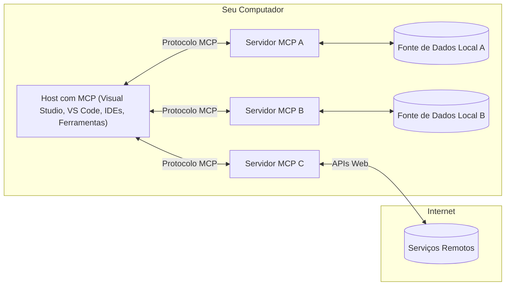

# Conceitos Básicos do MCP: Dominando o Protocolo de Contexto do Modelo para Integração de IA

[](https://youtu.be/earDzWGtE84)

_(Clique na imagem acima para assistir ao vídeo desta lição)_

O [Protocolo de Contexto do Modelo (MCP)](https://github.com/modelcontextprotocol) é uma estrutura poderosa e padronizada que otimiza a comunicação entre Grandes Modelos de Linguagem (LLMs) e ferramentas externas, aplicativos e fontes de dados.  
Este guia irá conduzi-lo pelos conceitos básicos do MCP. Você aprenderá sobre sua arquitetura cliente-servidor, componentes essenciais, mecânica de comunicação e melhores práticas de implementação.

- **Consentimento Explícito do Usuário**: Todo acesso a dados e operações requer aprovação explícita do usuário antes da execução. Os usuários devem entender claramente quais dados serão acessados e quais ações serão realizadas, com controle granular sobre permissões e autorizações.

- **Proteção da Privacidade dos Dados**: Os dados do usuário são expostos apenas com consentimento explícito e devem ser protegidos por controles robustos de acesso durante todo o ciclo de vida da interação. As implementações devem impedir a transmissão não autorizada de dados e manter limites rigorosos de privacidade.

- **Segurança na Execução de Ferramentas**: Toda invocação de ferramenta requer consentimento explícito do usuário com compreensão clara da funcionalidade, parâmetros e impacto potencial da ferramenta. Limites de segurança robustos devem prevenir execuções não intencionais, inseguras ou maliciosas.

- **Segurança na Camada de Transporte**: Todos os canais de comunicação devem usar mecanismos apropriados de criptografia e autenticação. Conexões remotas devem implementar protocolos de transporte seguros e gerenciamento adequado de credenciais.

#### Diretrizes de Implementação:

- **Gerenciamento de Permissões**: Implemente sistemas de permissão granulares que permitam aos usuários controlar quais servidores, ferramentas e recursos são acessíveis  
- **Autenticação & Autorização**: Use métodos seguros de autenticação (OAuth, chaves de API) com gerenciamento adequado de tokens e expiração  
- **Validação de Entrada**: Valide todos os parâmetros e entradas de dados conforme esquemas definidos para prevenir ataques de injeção  
- **Registro de Auditoria**: Mantenha logs abrangentes de todas as operações para monitoramento de segurança e conformidade

## Visão Geral

Esta lição explora a arquitetura fundamental e os componentes que compõem o ecossistema do Protocolo de Contexto do Modelo (MCP). Você aprenderá sobre a arquitetura cliente-servidor, componentes-chave e mecanismos de comunicação que alimentam as interações do MCP.

## Objetivos Principais de Aprendizagem

Ao final desta lição, você irá:

- Compreender a arquitetura cliente-servidor do MCP.  
- Identificar papéis e responsabilidades de Hosts, Clientes e Servidores.  
- Analisar os recursos centrais que tornam o MCP uma camada de integração flexível.  
- Aprender como a informação flui dentro do ecossistema MCP.  
- Obter insights práticos por meio de exemplos de código em .NET, Java, Python e JavaScript.

## Arquitetura do MCP: Um Olhar Mais Profundo

O ecossistema MCP é construído sobre um modelo cliente-servidor. Essa estrutura modular permite que aplicações de IA interajam com ferramentas, bancos de dados, APIs e recursos contextuais de forma eficiente. Vamos detalhar essa arquitetura em seus componentes principais.

No seu núcleo, o MCP segue uma arquitetura cliente-servidor onde uma aplicação host pode se conectar a múltiplos servidores:


- **Hosts MCP**: Programas como VSCode, Claude Desktop, IDEs ou ferramentas de IA que desejam acessar dados via MCP  
- **Clientes MCP**: Clientes do protocolo que mantêm conexões 1:1 com servidores  
- **Servidores MCP**: Programas leves que expõem capacidades específicas através do Protocolo de Contexto do Modelo padronizado  
- **Fontes de Dados Locais**: Arquivos, bancos de dados e serviços do seu computador que os servidores MCP podem acessar com segurança  
- **Serviços Remotos**: Sistemas externos disponíveis pela internet que os servidores MCP podem conectar via APIs.

O Protocolo MCP é um padrão em evolução que usa versionamento baseado em data (formato AAAA-MM-DD). A versão atual do protocolo é **2025-11-25**. Você pode ver as últimas atualizações na [especificação do protocolo](https://modelcontextprotocol.io/specification/2025-11-25/)

### 1. Hosts

No Protocolo de Contexto do Modelo (MCP), **Hosts** são aplicações de IA que servem como a interface principal pela qual os usuários interagem com o protocolo. Hosts coordenam e gerenciam conexões com múltiplos servidores MCP criando clientes MCP dedicados para cada conexão de servidor. Exemplos de Hosts incluem:

- **Aplicações de IA**: Claude Desktop, Visual Studio Code, Claude Code  
- **Ambientes de Desenvolvimento**: IDEs e editores de código com integração MCP  
- **Aplicações Personalizadas**: Agentes e ferramentas de IA construídos para propósitos específicos

**Hosts** são aplicações que coordenam interações com modelos de IA. Eles:

- **Orquestram Modelos de IA**: Executam ou interagem com LLMs para gerar respostas e coordenar fluxos de trabalho de IA  
- **Gerenciam Conexões de Clientes**: Criam e mantêm um cliente MCP por conexão de servidor MCP  
- **Controlam a Interface do Usuário**: Gerenciam o fluxo da conversa, interações do usuário e apresentação das respostas  
- **Aplicam Segurança**: Controlam permissões, restrições de segurança e autenticação  
- **Gerenciam Consentimento do Usuário**: Administram a aprovação do usuário para compartilhamento de dados e execução de ferramentas

### 2. Clientes

**Clientes** são componentes essenciais que mantêm conexões dedicadas um-para-um entre Hosts e servidores MCP. Cada cliente MCP é instanciado pelo Host para conectar-se a um servidor MCP específico, garantindo canais de comunicação organizados e seguros. Múltiplos clientes permitem que Hosts se conectem a vários servidores simultaneamente.

**Clientes** são componentes conectores dentro da aplicação host. Eles:

- **Comunicação do Protocolo**: Enviam requisições JSON-RPC 2.0 para servidores com prompts e instruções  
- **Negociação de Capacidades**: Negociam recursos suportados e versões do protocolo com servidores durante a inicialização  
- **Execução de Ferramentas**: Gerenciam requisições de execução de ferramentas dos modelos e processam respostas  
- **Atualizações em Tempo Real**: Lidam com notificações e atualizações em tempo real dos servidores  
- **Processamento de Respostas**: Processam e formatam respostas do servidor para exibição aos usuários

### 3. Servidores

**Servidores** são programas que fornecem contexto, ferramentas e capacidades para clientes MCP. Eles podem executar localmente (na mesma máquina do Host) ou remotamente (em plataformas externas), e são responsáveis por lidar com requisições dos clientes e fornecer respostas estruturadas. Servidores expõem funcionalidades específicas através do Protocolo de Contexto do Modelo padronizado.

**Servidores** são serviços que fornecem contexto e capacidades. Eles:

- **Registro de Recursos**: Registram e expõem primitivas disponíveis (recursos, prompts, ferramentas) para clientes  
- **Processamento de Requisições**: Recebem e executam chamadas de ferramentas, requisições de recursos e prompts dos clientes  
- **Fornecimento de Contexto**: Oferecem informações contextuais e dados para melhorar respostas do modelo  
- **Gerenciamento de Estado**: Mantêm estado de sessão e lidam com interações com estado quando necessário  
- **Notificações em Tempo Real**: Enviam notificações sobre mudanças de capacidades e atualizações para clientes conectados

Servidores podem ser desenvolvidos por qualquer pessoa para estender capacidades do modelo com funcionalidades especializadas, e suportam cenários de implantação local e remota.

### 4. Primitivas do Servidor

Servidores no Protocolo de Contexto do Modelo (MCP) fornecem três **primitivas** centrais que definem os blocos fundamentais para interações ricas entre clientes, hosts e modelos de linguagem. Essas primitivas especificam os tipos de informações contextuais e ações disponíveis através do protocolo.

Servidores MCP podem expor qualquer combinação das seguintes três primitivas centrais:

#### Recursos

**Recursos** são fontes de dados que fornecem informações contextuais para aplicações de IA. Eles representam conteúdo estático ou dinâmico que pode aprimorar a compreensão e tomada de decisão do modelo:

- **Dados Contextuais**: Informações estruturadas e contexto para consumo do modelo de IA  
- **Bases de Conhecimento**: Repositórios de documentos, artigos, manuais e trabalhos de pesquisa  
- **Fontes de Dados Locais**: Arquivos, bancos de dados e informações do sistema local  
- **Dados Externos**: Respostas de APIs, serviços web e dados de sistemas remotos  
- **Conteúdo Dinâmico**: Dados em tempo real que se atualizam conforme condições externas

Recursos são identificados por URIs e suportam descoberta via métodos `resources/list` e recuperação via `resources/read`:

```text
file://documents/project-spec.md
database://production/users/schema
api://weather/current
```

#### Prompts

**Prompts** são templates reutilizáveis que ajudam a estruturar interações com modelos de linguagem. Eles fornecem padrões padronizados de interação e fluxos de trabalho modelados:

- **Interações Baseadas em Template**: Mensagens pré-estruturadas e iniciadores de conversa  
- **Templates de Fluxo de Trabalho**: Sequências padronizadas para tarefas e interações comuns  
- **Exemplos Few-shot**: Templates baseados em exemplos para instrução do modelo  
- **Prompts do Sistema**: Prompts fundamentais que definem comportamento e contexto do modelo  
- **Templates Dinâmicos**: Prompts parametrizados que se adaptam a contextos específicos

Prompts suportam substituição de variáveis e podem ser descobertos via `prompts/list` e recuperados com `prompts/get`:

```markdown
Generate a {{task_type}} for {{product}} targeting {{audience}} with the following requirements: {{requirements}}
```

#### Ferramentas

**Ferramentas** são funções executáveis que modelos de IA podem invocar para realizar ações específicas. Elas representam os "verbos" do ecossistema MCP, permitindo que modelos interajam com sistemas externos:

- **Funções Executáveis**: Operações discretas que modelos podem invocar com parâmetros específicos  
- **Integração com Sistemas Externos**: Chamadas de API, consultas a bancos de dados, operações em arquivos, cálculos  
- **Identidade Única**: Cada ferramenta tem nome distinto, descrição e esquema de parâmetros  
- **Entrada/Saída Estruturada**: Ferramentas aceitam parâmetros validados e retornam respostas estruturadas e tipadas  
- **Capacidades de Ação**: Permitem que modelos realizem ações no mundo real e recuperem dados ao vivo

Ferramentas são definidas com JSON Schema para validação de parâmetros e descobertas via `tools/list` e executadas via `tools/call`:

```typescript
server.tool(
  "search_products", 
  {
    query: z.string().describe("Search query for products"),
    category: z.string().optional().describe("Product category filter"),
    max_results: z.number().default(10).describe("Maximum results to return")
  }, 
  async (params) => {
    // Execute a busca e retorne resultados estruturados
    return await productService.search(params);
  }
);
```

## Primitivas do Cliente

No Protocolo de Contexto do Modelo (MCP), **clientes** podem expor primitivas que permitem que servidores solicitem capacidades adicionais da aplicação host. Essas primitivas do lado do cliente permitem implementações de servidor mais ricas e interativas que podem acessar capacidades do modelo de IA e interações do usuário.

### Amostragem

**Amostragem** permite que servidores solicitem completions de modelos de linguagem da aplicação de IA do cliente. Essa primitiva permite que servidores acessem capacidades LLM sem incorporar suas próprias dependências de modelo:

- **Acesso Independente do Modelo**: Servidores podem solicitar completions sem incluir SDKs LLM ou gerenciar acesso ao modelo  
- **IA Iniciada pelo Servidor**: Permite que servidores gerem conteúdo autonomamente usando o modelo de IA do cliente  
- **Interações Recursivas com LLM**: Suporta cenários complexos onde servidores precisam de assistência de IA para processamento  
- **Geração Dinâmica de Conteúdo**: Permite que servidores criem respostas contextuais usando o modelo do host

A amostragem é iniciada através do método `sampling/complete`, onde servidores enviam requisições de completion para clientes.

### Elicitação

**Elicitação** permite que servidores solicitem informações adicionais ou confirmação dos usuários através da interface do cliente:

- **Solicitações de Entrada do Usuário**: Servidores podem pedir informações adicionais quando necessário para execução de ferramentas  
- **Diálogos de Confirmação**: Solicitar aprovação do usuário para operações sensíveis ou impactantes  
- **Fluxos de Trabalho Interativos**: Permitem que servidores criem interações passo a passo com o usuário  
- **Coleta Dinâmica de Parâmetros**: Reunir parâmetros faltantes ou opcionais durante a execução da ferramenta

Requisições de elicitação são feitas usando o método `elicitation/request` para coletar entrada do usuário pela interface do cliente.

### Registro de Logs

**Registro de Logs** permite que servidores enviem mensagens de log estruturadas para clientes para depuração, monitoramento e visibilidade operacional:

- **Suporte à Depuração**: Permite que servidores forneçam logs detalhados de execução para solução de problemas  
- **Monitoramento Operacional**: Envia atualizações de status e métricas de desempenho para clientes  
- **Relato de Erros**: Fornece contexto detalhado de erros e informações diagnósticas  
- **Trilhas de Auditoria**: Cria logs abrangentes das operações e decisões do servidor

Mensagens de log são enviadas para clientes para fornecer transparência nas operações do servidor e facilitar a depuração.

## Fluxo de Informação no MCP

O Protocolo de Contexto do Modelo (MCP) define um fluxo estruturado de informações entre hosts, clientes, servidores e modelos. Compreender esse fluxo ajuda a esclarecer como as requisições dos usuários são processadas e como ferramentas externas e dados são integrados nas respostas do modelo.

- **Host Inicia Conexão**  
  A aplicação host (como um IDE ou interface de chat) estabelece uma conexão com um servidor MCP, tipicamente via STDIO, WebSocket ou outro transporte suportado.

- **Negociação de Capacidades**  
  O cliente (embutido no host) e o servidor trocam informações sobre seus recursos suportados, ferramentas, recursos e versões do protocolo. Isso garante que ambos os lados entendam quais capacidades estão disponíveis para a sessão.

- **Requisição do Usuário**  
  O usuário interage com o host (ex.: insere um prompt ou comando). O host coleta essa entrada e a passa para o cliente para processamento.

- **Uso de Recurso ou Ferramenta**  
  - O cliente pode solicitar contexto adicional ou recursos do servidor (como arquivos, entradas de banco de dados ou artigos de base de conhecimento) para enriquecer a compreensão do modelo.  
  - Se o modelo determinar que uma ferramenta é necessária (ex.: para buscar dados, realizar um cálculo ou chamar uma API), o cliente envia uma requisição de invocação de ferramenta ao servidor, especificando o nome da ferramenta e parâmetros.

- **Execução no Servidor**  
  O servidor recebe a requisição de recurso ou ferramenta, executa as operações necessárias (como rodar uma função, consultar um banco de dados ou recuperar um arquivo) e retorna os resultados ao cliente em formato estruturado.

- **Geração da Resposta**  
  O cliente integra as respostas do servidor (dados de recursos, saídas de ferramentas, etc.) na interação contínua com o modelo. O modelo usa essa informação para gerar uma resposta abrangente e contextualmente relevante.

- **Apresentação do Resultado**  
  O host recebe a saída final do cliente e a apresenta ao usuário, frequentemente incluindo tanto o texto gerado pelo modelo quanto quaisquer resultados de execuções de ferramentas ou consultas a recursos.

Esse fluxo permite que o MCP suporte aplicações de IA avançadas, interativas e conscientes do contexto, conectando modelos com ferramentas externas e fontes de dados de forma fluida.

## Arquitetura & Camadas do Protocolo

O MCP consiste em duas camadas arquitetônicas distintas que trabalham juntas para fornecer uma estrutura completa de comunicação:

### Camada de Dados

A **Camada de Dados** implementa o protocolo central do MCP usando **JSON-RPC 2.0** como base. Essa camada define a estrutura das mensagens, semântica e padrões de interação:

#### Componentes Centrais:

- **Protocolo JSON-RPC 2.0**: Toda comunicação usa o formato padronizado de mensagens JSON-RPC 2.0 para chamadas de método, respostas e notificações
- **Gerenciamento de Ciclo de Vida**: Gerencia a inicialização da conexão, negociação de capacidades e término da sessão entre clientes e servidores
- **Primitivas do Servidor**: Permite que servidores forneçam funcionalidades principais por meio de ferramentas, recursos e prompts
- **Primitivas do Cliente**: Permite que servidores solicitem amostragem de LLMs, obtenham entrada do usuário e enviem mensagens de log
- **Notificações em Tempo Real**: Suporta notificações assíncronas para atualizações dinâmicas sem polling

#### Principais Recursos:

- **Negociação de Versão do Protocolo**: Usa versionamento baseado em data (AAAA-MM-DD) para garantir compatibilidade
- **Descoberta de Capacidades**: Clientes e servidores trocam informações sobre recursos suportados durante a inicialização
- **Sessões com Estado**: Mantém o estado da conexão em múltiplas interações para continuidade de contexto

### Camada de Transporte

A **Camada de Transporte** gerencia canais de comunicação, enquadramento de mensagens e autenticação entre participantes MCP:

#### Mecanismos de Transporte Suportados:

1. **Transporte STDIO**:
   - Usa fluxos padrão de entrada/saída para comunicação direta entre processos
   - Ideal para processos locais na mesma máquina sem overhead de rede
   - Comumente usado para implementações locais de servidores MCP

2. **Transporte HTTP Streamable**:
   - Usa HTTP POST para mensagens cliente-servidor  
   - Eventos enviados pelo servidor (SSE) opcionais para streaming servidor-cliente
   - Permite comunicação remota entre servidores através de redes
   - Suporta autenticação HTTP padrão (tokens bearer, chaves API, cabeçalhos customizados)
   - MCP recomenda OAuth para autenticação segura baseada em tokens

#### Abstração de Transporte:

A camada de transporte abstrai detalhes de comunicação da camada de dados, permitindo o mesmo formato de mensagem JSON-RPC 2.0 em todos os mecanismos de transporte. Essa abstração permite que aplicações alternem entre servidores locais e remotos sem dificuldades.

### Considerações de Segurança

Implementações MCP devem aderir a vários princípios críticos de segurança para garantir interações seguras, confiáveis e protegidas em todas as operações do protocolo:

- **Consentimento e Controle do Usuário**: Usuários devem fornecer consentimento explícito antes que qualquer dado seja acessado ou operações sejam realizadas. Eles devem ter controle claro sobre quais dados são compartilhados e quais ações são autorizadas, suportado por interfaces intuitivas para revisar e aprovar atividades.

- **Privacidade de Dados**: Dados do usuário devem ser expostos somente com consentimento explícito e protegidos por controles de acesso apropriados. Implementações MCP devem proteger contra transmissão não autorizada de dados e garantir que a privacidade seja mantida em todas as interações.

- **Segurança das Ferramentas**: Antes de invocar qualquer ferramenta, é necessário consentimento explícito do usuário. Usuários devem compreender claramente a funcionalidade de cada ferramenta, e limites robustos de segurança devem ser aplicados para evitar execuções não intencionais ou inseguras.

Seguindo esses princípios de segurança, o MCP assegura que a confiança, privacidade e segurança do usuário sejam mantidas em todas as interações do protocolo, enquanto possibilita integrações poderosas com IA.

## Exemplos de Código: Componentes Principais

A seguir, exemplos de código em várias linguagens populares que ilustram como implementar componentes chave do servidor MCP e ferramentas.

### Exemplo .NET: Criando um Servidor MCP Simples com Ferramentas

Aqui está um exemplo prático em .NET demonstrando como implementar um servidor MCP simples com ferramentas customizadas. Este exemplo mostra como definir e registrar ferramentas, tratar requisições e conectar o servidor usando o Model Context Protocol.

```csharp
using System;
using System.Threading.Tasks;
using ModelContextProtocol.Server;
using ModelContextProtocol.Server.Transport;
using ModelContextProtocol.Server.Tools;

public class WeatherServer
{
    public static async Task Main(string[] args)
    {
        // Create an MCP server
        var server = new McpServer(
            name: "Weather MCP Server",
            version: "1.0.0"
        );
        
        // Register our custom weather tool
        server.AddTool<string, WeatherData>("weatherTool", 
            description: "Gets current weather for a location",
            execute: async (location) => {
                // Call weather API (simplified)
                var weatherData = await GetWeatherDataAsync(location);
                return weatherData;
            });
        
        // Connect the server using stdio transport
        var transport = new StdioServerTransport();
        await server.ConnectAsync(transport);
        
        Console.WriteLine("Weather MCP Server started");
        
        // Keep the server running until process is terminated
        await Task.Delay(-1);
    }
    
    private static async Task<WeatherData> GetWeatherDataAsync(string location)
    {
        // This would normally call a weather API
        // Simplified for demonstration
        await Task.Delay(100); // Simulate API call
        return new WeatherData { 
            Temperature = 72.5,
            Conditions = "Sunny",
            Location = location
        };
    }
}

public class WeatherData
{
    public double Temperature { get; set; }
    public string Conditions { get; set; }
    public string Location { get; set; }
}
```

### Exemplo Java: Componentes do Servidor MCP

Este exemplo demonstra o mesmo servidor MCP e registro de ferramentas do exemplo .NET acima, mas implementado em Java.

```java
import io.modelcontextprotocol.server.McpServer;
import io.modelcontextprotocol.server.McpToolDefinition;
import io.modelcontextprotocol.server.transport.StdioServerTransport;
import io.modelcontextprotocol.server.tool.ToolExecutionContext;
import io.modelcontextprotocol.server.tool.ToolResponse;

public class WeatherMcpServer {
    public static void main(String[] args) throws Exception {
        // Criar um servidor MCP
        McpServer server = McpServer.builder()
            .name("Weather MCP Server")
            .version("1.0.0")
            .build();
            
        // Registrar uma ferramenta de clima
        server.registerTool(McpToolDefinition.builder("weatherTool")
            .description("Gets current weather for a location")
            .parameter("location", String.class)
            .execute((ToolExecutionContext ctx) -> {
                String location = ctx.getParameter("location", String.class);
                
                // Obter dados do clima (simplificado)
                WeatherData data = getWeatherData(location);
                
                // Retornar resposta formatada
                return ToolResponse.content(
                    String.format("Temperature: %.1f°F, Conditions: %s, Location: %s", 
                    data.getTemperature(), 
                    data.getConditions(), 
                    data.getLocation())
                );
            })
            .build());
        
        // Conectar o servidor usando transporte stdio
        try (StdioServerTransport transport = new StdioServerTransport()) {
            server.connect(transport);
            System.out.println("Weather MCP Server started");
            // Manter o servidor em execução até o processo ser encerrado
            Thread.currentThread().join();
        }
    }
    
    private static WeatherData getWeatherData(String location) {
        // A implementação chamaria uma API de clima
        // Simplificado para fins de exemplo
        return new WeatherData(72.5, "Sunny", location);
    }
}

class WeatherData {
    private double temperature;
    private String conditions;
    private String location;
    
    public WeatherData(double temperature, String conditions, String location) {
        this.temperature = temperature;
        this.conditions = conditions;
        this.location = location;
    }
    
    public double getTemperature() {
        return temperature;
    }
    
    public String getConditions() {
        return conditions;
    }
    
    public String getLocation() {
        return location;
    }
}
```

### Exemplo Python: Construindo um Servidor MCP

Este exemplo usa fastmcp, portanto, certifique-se de instalá-lo primeiro:

```python
pip install fastmcp
```
Exemplo de Código:

```python
#!/usr/bin/env python3
import asyncio
from fastmcp import FastMCP
from fastmcp.transports.stdio import serve_stdio

# Criar um servidor FastMCP
mcp = FastMCP(
    name="Weather MCP Server",
    version="1.0.0"
)

@mcp.tool()
def get_weather(location: str) -> dict:
    """Gets current weather for a location."""
    return {
        "temperature": 72.5,
        "conditions": "Sunny",
        "location": location
    }

# Abordagem alternativa usando uma classe
class WeatherTools:
    @mcp.tool()
    def forecast(self, location: str, days: int = 1) -> dict:
        """Gets weather forecast for a location for the specified number of days."""
        return {
            "location": location,
            "forecast": [
                {"day": i+1, "temperature": 70 + i, "conditions": "Partly Cloudy"}
                for i in range(days)
            ]
        }

# Registrar ferramentas da classe
weather_tools = WeatherTools()

# Iniciar o servidor
if __name__ == "__main__":
    asyncio.run(serve_stdio(mcp))
```

### Exemplo JavaScript: Criando um Servidor MCP

Este exemplo mostra a criação de um servidor MCP em JavaScript e como registrar duas ferramentas relacionadas ao clima.

```javascript
// Usando o SDK oficial do Protocolo de Contexto de Modelo
import { McpServer } from "@modelcontextprotocol/sdk/server/mcp.js";
import { StdioServerTransport } from "@modelcontextprotocol/sdk/server/stdio.js";
import { z } from "zod"; // Para validação de parâmetros

// Criar um servidor MCP
const server = new McpServer({
  name: "Weather MCP Server",
  version: "1.0.0"
});

// Definir uma ferramenta de clima
server.tool(
  "weatherTool",
  {
    location: z.string().describe("The location to get weather for")
  },
  async ({ location }) => {
    // Normalmente isso chamaria uma API de clima
    // Simplificado para demonstração
    const weatherData = await getWeatherData(location);
    
    return {
      content: [
        { 
          type: "text", 
          text: `Temperature: ${weatherData.temperature}°F, Conditions: ${weatherData.conditions}, Location: ${weatherData.location}` 
        }
      ]
    };
  }
);

// Definir uma ferramenta de previsão
server.tool(
  "forecastTool",
  {
    location: z.string(),
    days: z.number().default(3).describe("Number of days for forecast")
  },
  async ({ location, days }) => {
    // Normalmente isso chamaria uma API de clima
    // Simplificado para demonstração
    const forecast = await getForecastData(location, days);
    
    return {
      content: [
        { 
          type: "text", 
          text: `${days}-day forecast for ${location}: ${JSON.stringify(forecast)}` 
        }
      ]
    };
  }
);

// Funções auxiliares
async function getWeatherData(location) {
  // Simular chamada de API
  return {
    temperature: 72.5,
    conditions: "Sunny",
    location: location
  };
}

async function getForecastData(location, days) {
  // Simular chamada de API
  return Array.from({ length: days }, (_, i) => ({
    day: i + 1,
    temperature: 70 + Math.floor(Math.random() * 10),
    conditions: i % 2 === 0 ? "Sunny" : "Partly Cloudy"
  }));
}

// Conectar o servidor usando transporte stdio
const transport = new StdioServerTransport();
server.connect(transport).catch(console.error);

console.log("Weather MCP Server started");
```

Este exemplo em JavaScript demonstra como criar um cliente MCP que conecta a um servidor, envia um prompt e processa a resposta incluindo quaisquer chamadas de ferramentas realizadas.

## Segurança e Autorização

O MCP inclui vários conceitos e mecanismos embutidos para gerenciar segurança e autorização ao longo do protocolo:

1. **Controle de Permissão de Ferramentas**:  
  Clientes podem especificar quais ferramentas um modelo pode usar durante uma sessão. Isso garante que apenas ferramentas explicitamente autorizadas estejam acessíveis, reduzindo riscos de operações não intencionais ou inseguras. Permissões podem ser configuradas dinamicamente com base em preferências do usuário, políticas organizacionais ou contexto da interação.

2. **Autenticação**:  
  Servidores podem exigir autenticação antes de conceder acesso a ferramentas, recursos ou operações sensíveis. Isso pode envolver chaves API, tokens OAuth ou outros esquemas de autenticação. Autenticação adequada garante que apenas clientes e usuários confiáveis possam invocar capacidades do servidor.

3. **Validação**:  
  Validação de parâmetros é aplicada para todas as invocações de ferramentas. Cada ferramenta define tipos, formatos e restrições esperados para seus parâmetros, e o servidor valida as requisições recebidas conforme. Isso previne entrada malformada ou maliciosa de alcançar implementações de ferramentas e ajuda a manter a integridade das operações.

4. **Limitação de Taxa**:  
  Para prevenir abusos e garantir uso justo dos recursos do servidor, servidores MCP podem implementar limitação de taxa para chamadas de ferramentas e acesso a recursos. Limites podem ser aplicados por usuário, por sessão ou globalmente, ajudando a proteger contra ataques de negação de serviço ou consumo excessivo de recursos.

Combinando esses mecanismos, o MCP fornece uma base segura para integrar modelos de linguagem com ferramentas externas e fontes de dados, enquanto oferece controle granular a usuários e desenvolvedores sobre acesso e uso.

## Mensagens do Protocolo & Fluxo de Comunicação

A comunicação MCP usa mensagens estruturadas **JSON-RPC 2.0** para facilitar interações claras e confiáveis entre hosts, clientes e servidores. O protocolo define padrões específicos de mensagens para diferentes tipos de operações:

### Tipos Principais de Mensagens:

#### **Mensagens de Inicialização**
- Requisição **`initialize`**: Estabelece conexão e negocia versão do protocolo e capacidades
- Resposta **`initialize`**: Confirma recursos suportados e informações do servidor  
- **`notifications/initialized`**: Indica que a inicialização está completa e a sessão está pronta

#### **Mensagens de Descoberta**
- Requisição **`tools/list`**: Descobre ferramentas disponíveis no servidor
- Requisição **`resources/list`**: Lista recursos disponíveis (fontes de dados)
- Requisição **`prompts/list`**: Recupera templates de prompt disponíveis

#### **Mensagens de Execução**  
- Requisição **`tools/call`**: Executa uma ferramenta específica com parâmetros fornecidos
- Requisição **`resources/read`**: Recupera conteúdo de um recurso específico
- Requisição **`prompts/get`**: Busca um template de prompt com parâmetros opcionais

#### **Mensagens do Lado do Cliente**
- Requisição **`sampling/complete`**: Servidor solicita completions LLM do cliente
- **`elicitation/request`**: Servidor solicita entrada do usuário via interface do cliente
- Mensagens de Log: Servidor envia mensagens de log estruturadas para o cliente

#### **Mensagens de Notificação**
- **`notifications/tools/list_changed`**: Servidor notifica cliente sobre mudanças nas ferramentas
- **`notifications/resources/list_changed`**: Servidor notifica cliente sobre mudanças nos recursos  
- **`notifications/prompts/list_changed`**: Servidor notifica cliente sobre mudanças nos prompts

### Estrutura da Mensagem:

Todas as mensagens MCP seguem o formato JSON-RPC 2.0 com:
- **Mensagens de Requisição**: Incluem `id`, `method` e `params` opcionais
- **Mensagens de Resposta**: Incluem `id` e `result` ou `error`  
- **Mensagens de Notificação**: Incluem `method` e `params` opcionais (sem `id` ou resposta esperada)

Essa comunicação estruturada assegura interações confiáveis, rastreáveis e extensíveis, suportando cenários avançados como atualizações em tempo real, encadeamento de ferramentas e tratamento robusto de erros.

## Principais Conclusões

- **Arquitetura**: MCP usa arquitetura cliente-servidor onde hosts gerenciam múltiplas conexões de clientes a servidores
- **Participantes**: O ecossistema inclui hosts (aplicações de IA), clientes (conectores de protocolo) e servidores (provedores de capacidades)
- **Mecanismos de Transporte**: Comunicação suporta STDIO (local) e HTTP Streamable com SSE opcional (remoto)
- **Primitivas Centrais**: Servidores expõem ferramentas (funções executáveis), recursos (fontes de dados) e prompts (templates)
- **Primitivas do Cliente**: Servidores podem solicitar amostragem (completions LLM), elicitação (entrada do usuário) e logging dos clientes
- **Fundação do Protocolo**: Construído sobre JSON-RPC 2.0 com versionamento baseado em data (atual: 2025-11-25)
- **Capacidades em Tempo Real**: Suporta notificações para atualizações dinâmicas e sincronização em tempo real
- **Segurança em Primeiro Lugar**: Consentimento explícito do usuário, proteção da privacidade de dados e transporte seguro são requisitos centrais

## Exercício

Projete uma ferramenta MCP simples que seria útil no seu domínio. Defina:
1. Qual seria o nome da ferramenta
2. Quais parâmetros ela aceitaria
3. Qual saída ela retornaria
4. Como um modelo poderia usar essa ferramenta para resolver problemas do usuário


---

## O que vem a seguir

Próximo: [Capítulo 2: Segurança](../02-Security/README.md)

---

<!-- CO-OP TRANSLATOR DISCLAIMER START -->
**Aviso Legal**:  
Este documento foi traduzido utilizando o serviço de tradução por IA [Co-op Translator](https://github.com/Azure/co-op-translator). Embora nos esforcemos para garantir a precisão, esteja ciente de que traduções automáticas podem conter erros ou imprecisões. O documento original em seu idioma nativo deve ser considerado a fonte autorizada. Para informações críticas, recomenda-se tradução profissional humana. Não nos responsabilizamos por quaisquer mal-entendidos ou interpretações incorretas decorrentes do uso desta tradução.
<!-- CO-OP TRANSLATOR DISCLAIMER END -->