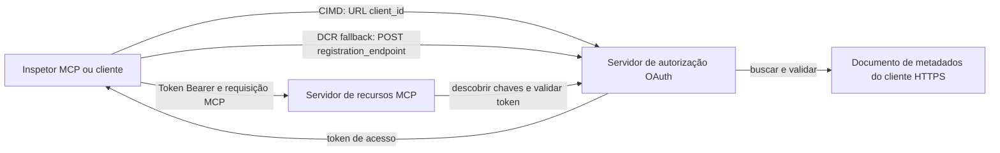

# Amostra de Autorização CIMD e DCR

Esta amostra em TypeScript compara duas maneiras de um cliente OAuth obter uma identidade
antes de acessar um servidor MCP protegido:

- **Documentos de Metadados de ID do Cliente (CIMD)** usam uma URL HTTPS estável como o
  `client_id`. Este é o mecanismo preferido para clientes e servidores de autorização
  que não possuem relacionamento pré-existente.
- **Registro Dinâmico de Cliente (DCR)** solicita ao servidor de autorização que crie
  um ID opaco de cliente em tempo de execução. O MCP `2026-07-28` mantém o DCR apenas para compatibilidade
  retroativa.

A amostra usa o SDK MCP TypeScript estável v2 e o modelo de requisição sem estado
MCP `2026-07-28`. Funciona com um servidor externo de autorização OAuth 2.1/OpenID
Connect, como o Auth0. O servidor MCP é um servidor de recursos:
ele valida tokens de acesso, mas não autentica usuários nem emite
tokens.

## Objetivos de Aprendizagem

Ao completar esta amostra, você será capaz de:

- Explicar por que o CIMD é preferido ao DCR para novos clientes MCP.
- Publicar um documento CIMD válido para um cliente nativo público.
- Configurar um servidor de recursos MCP para descoberta OAuth e validação JWT.
- Exercitar CIMD e DCR com o mesmo servidor MCP e servidor de autorização.
- Aplicar uma permissão OAuth dentro de uma ferramenta MCP.
- Identificar quais responsabilidades pertencem ao cliente, servidor de recursos e
  servidor de autorização.

## Arquitetura



O servidor de autorização escolhe e valida o mecanismo de registro.
O servidor MCP vê apenas a reivindicação `client_id` verificada resultante. Uma URL HTTPS
com um caminho identifica o CIMD. Um ID opaco não é suficiente para provar o DCR porque um
cliente pré-registrado também pode usar um ID opaco; a configuração opcional
`DCR_CLIENT_ID_PREFIX` fornece uma dica de demonstração específica do provedor.

## Prioridade de Registro

Clientes MCP que suportam todos os mecanismos devem usar esta ordem:

1. Use informações de cliente pré-registradas quando já estiverem disponíveis.
2. Use CIMD quando o servidor de autorização anunciar
   `client_id_metadata_document_supported: true`.
3. Use DCR apenas como um recurso quando o servidor anunciar um
   `registration_endpoint`.
4. Pergunte ao usuário informações de cliente pré-registradas quando nenhuma das opções acima estiver
   disponível.

## Layout do Projeto

```text
src/
  config.ts          Environment validation
  dcr.ts             DCR compatibility request
  mcp.ts             MCP tools and scope checks
  oauth.ts           Authorization metadata and JWT verification
  register-dcr.ts    DCR command-line helper
  registration.ts    CIMD document and mechanism classification
  server.ts          Express, OAuth discovery, and MCP endpoint
test/
  dcr.test.ts
  oauth.test.ts
  registration.test.ts
  server.test.ts
```

## Pré-requisitos

- Node.js 20.6 ou superior. Os scripts usam `--env-file` e `--import`.
- Um servidor de autorização OAuth 2.1/OpenID Connect que suporte:
  - Fluxo de código de autorização com S256 PKCE.
  - Metadados de Recursos Protegidos OAuth e Indicadores de Recurso.
  - Tokens de acesso JWT e um endpoint JWKS.
  - CIMD, além de DCR se você quiser comparar a alternativa legada.
- MCP Inspector ou outro cliente MCP `2026-07-28`.
- Uma URL HTTPS pública para o documento CIMD. Um túnel de desenvolvimento é adequado
  para o laboratório; use um domínio estável em produção.

## Instalar e Testar

```bash
npm install
npm run build
npm test
```

Os doze testes usam chaves locais e endpoints HTTP simulados. Eles não requerem uma
conta em servidor de autorização. Eles verificam:

- Forma do documento CIMD e restrições de URL.
- Classificação honesta de URLs e IDs opacos de cliente.
- Manipulação de requisição e resposta DCR.
- Rejeição de endpoints DCR inseguros não-loopback.
- Validação de assinatura JWT, emissor, público, expiração, ID do cliente e escopo.
- Uma chamada em processo MCP `2026-07-28` para `registration-info`.

## Configurar o Servidor de Autorização

Os nomes exatos de controle variam por provedor. Configure essas capacidades:

1. Crie uma API ou servidor de recurso cujo identificador coincida exatamente com sua URL
   MCP, incluindo `/mcp`, por exemplo `http://127.0.0.1:3001/mcp`.
2. Use tokens de acesso RS256 e inclua uma reivindicação `client_id` ou `azp`.
3. Adicione a permissão ou escopo `tool:greet`.
4. Habilite o fluxo de código de autorização com S256 PKCE para clientes nativos públicos.
5. Habilite Documentos de Metadados de ID do Cliente.
6. Para comparação apenas, habilite o Registro Dinâmico de Cliente.
7. Assegure que os metadados do servidor de autorização anunciem:
   - `issuer`
   - `authorization_endpoint`
   - `token_endpoint`
   - `jwks_uri`
   - `client_id_metadata_document_supported: true`
   - `registration_endpoint` quando o DCR estiver habilitado

### Exemplo Auth0

Para Auth0, habilite o Registro do Documento de Metadados de ID do Cliente, Registro Dinâmico OIDC
de Aplicações e compatibilidade com Parâmetro de Recurso. Crie uma API
cujo identificador seja exatamente a URL MCP e adicione a permissão `tool:greet`.
Permita que o usuário de teste e clientes de terceiros solicitem essa permissão.

Painéis de provedor e disponibilidade de recursos mudam com o tempo. Verifique a
documentação do provedor antes de usar essas configurações fora deste laboratório.

## Configurar a Amostra

Crie `.env` a partir do exemplo:

```powershell
Copy-Item .env.example .env
```

Em shells compatíveis com bash:

```bash
cp .env.example .env
```

Defina estes valores:

```dotenv
MCP_SERVER_URL=http://127.0.0.1:3001/mcp
AUTHORIZATION_SERVER_ISSUER=https://your-tenant.example.com/
AUTHORIZATION_SERVER_METADATA_URL=https://your-tenant.example.com/.well-known/openid-configuration
CLIENT_METADATA_URL=https://your-public-host.example.com/client-metadata.json
OAUTH_REDIRECT_URIS=http://127.0.0.1:6274/oauth/callback
DCR_CLIENT_ID_PREFIX=tpc_
```

Detalhes importantes:

- `AUTHORIZATION_SERVER_ISSUER` deve corresponder exatamente ao `issuer` nos metadados
  do servidor de autorização descobertos, incluindo qualquer barra final.
- `MCP_SERVER_URL` deve corresponder ao público do token de acesso.
- `CLIENT_METADATA_URL` deve usar HTTPS, conter um caminho não raíz, e ser a
  URL pública que serve a rota de metadados. Strings de consulta e fragmentos são
  rejeitados para que rota e `client_id` permaneçam idênticos.
- `OAUTH_REDIRECT_URIS` é uma lista permitida separada por vírgulas. O padrão é a
  callback loopback do MCP Inspector.
- `DCR_CLIENT_ID_PREFIX` é opcional e específico do provedor. Deixe vazio quando
  seu provedor não possui um prefixo DCR confiável.

## Publique o Documento CIMD

Inicie um túnel que encaminhe sua origem HTTPS pública para `127.0.0.1:3001`.
Defina `CLIENT_METADATA_URL` para essa origem mais `/client-metadata.json`, então execute:

```bash
npm run build
npm start
```

Verifique ambos os documentos de descoberta:

```bash
curl http://127.0.0.1:3001/health
curl http://127.0.0.1:3001/client-metadata.json
curl http://127.0.0.1:3001/.well-known/oauth-protected-resource/mcp
```

O `client_id` retornado pela URL pública HTTPS de metadados deve ser idêntico byte a byte
a essa URL. O servidor de autorização deve validar o documento e
seu URI de redirecionamento antes de emitir um token.

> [!NOTE]
> A amostra hospeda o documento do cliente e o servidor de recursos MCP em um único processo
> para manter o laboratório pequeno. Em produção, o cliente MCP possui e hospeda seu documento CIMD
> independentemente do servidor de recursos.

## Compare CIMD e DCR

Inicie o MCP Inspector:

```bash
npx @modelcontextprotocol/inspector
```

Use HTTP Streamable e conecte-se a `http://127.0.0.1:3001/mcp`.

### CIMD (Preferido)


1. Insira o `CLIENT_METADATA_URL` público como o ID do Cliente OAuth.
2. Solicite `tool:greet` mais quaisquer escopos de identidade exigidos pelo seu provedor.
3. Conclua o login e o consentimento.
4. Chame `registration-info`. Ele informa `mechanism: "cimd"`.
5. Chame `greet` para verificar a aplicação do escopo.

### DCR (Compatibilidade de Retorno)

1. Limpe o estado OAuth salvo no Inspector.
2. Deixe o ID do Cliente OAuth vazio para que o Inspector possa usar o
   `registration_endpoint` anunciado.
3. Conclua o login e o consentimento.
4. Chame `registration-info`.
5. Se `DCR_CLIENT_ID_PREFIX` corresponder aos IDs gerados pelo provedor, a ferramenta
   informa `mechanism: "dcr"`; caso contrário, ela informa corretamente
   `opaque-client-id`.

Você também pode demonstrar diretamente a requisição de registro:

```bash
npm run build
npm run register:dcr
```

O ajudante imprime o ID do cliente retornado, mas nunca imprime um segredo do cliente.
Trate qualquer segredo retornado como sensível e armazene-o em um repositório de segredos adequado.

## Ferramentas

| Ferramenta | Escopo requerido | Propósito |
| --- | --- | --- |
| `registration-info` | Cliente verificado | Relatar o tipo de ID do cliente |
| `greet` | `tool:greet` | Demonstrar autorização por ferramenta |

## Notas de Segurança

- Valide assinaturas JWT através do endpoint JWKS do servidor de autorização.
- Exija correspondências exatas de emissor e audiência.
- Exija reivindicações de expiração e ID do cliente.
- Nunca aceite um token emitido para um recurso diferente.
- Nunca transmita o token MCP para uma API downstream.
- Mantenha as credenciais DCR vinculadas ao emissor que as criou.
- Valide URIs de redirecionamento CIMD com correspondência exata.
- Aplique controles SSRF quando um servidor de autorização busca URLs CIMD.
- Use HTTPS para endpoints de autorização e metadados fora do loopback
  para desenvolvimento.
- Não infira o DCR a partir de um ID de cliente opaco a menos que o provedor documente uma
  convenção confiável de identificador.

## Referências

- [Especificação de autorização MCP](https://modelcontextprotocol.io/specification/2026-07-28/basic/authorization)
- [Registro de cliente MCP](https://modelcontextprotocol.io/specification/2026-07-28/basic/authorization/client-registration)
- [Melhores práticas de segurança MCP](https://modelcontextprotocol.io/specification/2026-07-28/basic/security_best_practices)
- [Guia de autorização MCP SDK TypeScript v2](https://ts.sdk.modelcontextprotocol.io/v2/serving/authorization)
- [Registro Dinâmico de Cliente OAuth (RFC 7591)](https://datatracker.ietf.org/doc/html/rfc7591)
- [Rascunho do Documento de Metadados do ID do Cliente OAuth](https://datatracker.ietf.org/doc/html/draft-ietf-oauth-client-id-metadata-document-00)

## Agradecimentos

A abordagem de ensino lado a lado foi inspirada por
[Sambego/auth0-xmcp-cimd](https://github.com/Sambego/auth0-xmcp-cimd). Esta
amostra é uma implementação original, neutra ao provedor, construída com o SDK oficial
MCP TypeScript v2 para este currículo.

---

<!-- CO-OP TRANSLATOR DISCLAIMER START -->
**Aviso Legal**:
Este documento foi traduzido usando o serviço de tradução por IA [Co-op Translator](https://github.com/Azure/co-op-translator). Embora nos esforcemos pela precisão, por favor, esteja ciente de que traduções automatizadas podem conter erros ou imprecisões. O documento original em seu idioma nativo deve ser considerado a fonte autorizada. Para informações críticas, recomenda-se tradução profissional humana. Não nos responsabilizamos por quaisquer mal-entendidos ou interpretações incorretas decorrentes do uso desta tradução.
<!-- CO-OP TRANSLATOR DISCLAIMER END -->