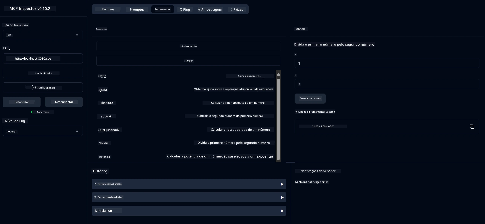

# Serviço Básico de Calculadora MCP

> [!NOTE]
> Esta solução Java usa o transporte legado HTTP+SSE e é compatível com um SDK
> compatível com MCP `2025-11-25`. É mantida para corresponder ao código do curso;
> novos servidores remotos devem usar o suporte HTTP Streamable `2026-07-28`.

Este serviço fornece operações básicas de calculadora por meio do Protocolo de Contexto de Modelo (MCP) usando Spring Boot com transporte WebFlux. É projetado como um exemplo simples para iniciantes aprendendo sobre implementações MCP.

Para mais informações, consulte a documentação de referência do [MCP Server Boot Starter](https://docs.spring.io/spring-ai/reference/api/mcp/mcp-server-boot-starter-docs.html).


## Usando o Serviço

O serviço expõe os seguintes endpoints API através do protocolo MCP:

- `add(a, b)`: Somar dois números 
- `subtract(a, b)`: Subtrair o segundo número do primeiro
- `multiply(a, b)`: Multiplicar dois números
- `divide(a, b)`: Dividir o primeiro número pelo segundo (com verificação de zero)
- `power(base, exponent)`: Calcular a potência de um número
- `squareRoot(number)`: Calcular a raiz quadrada (com verificação de número negativo)
- `modulus(a, b)`: Calcular o resto da divisão
- `absolute(number)`: Calcular o valor absoluto

## Dependências

O projeto requer as seguintes dependências principais:

```xml
<dependency>
    <groupId>org.springframework.ai</groupId>
    <artifactId>spring-ai-starter-mcp-server-webflux</artifactId>
</dependency>
```

## Construindo o Projeto

Construa o projeto usando Maven:
```bash
./mvnw clean install -DskipTests
```

## Executando o Servidor

### Usando Java

```bash
java -jar target/calculator-server-0.0.1-SNAPSHOT.jar
```

### Usando MCP Inspector

O MCP Inspector é uma ferramenta útil para interagir com serviços MCP. Para usá-lo com este serviço de calculadora:

1. **Instale e execute o MCP Inspector** em uma nova janela do terminal:
   ```bash
   npx @modelcontextprotocol/inspector
   ```

2. **Acesse a interface web** clicando na URL exibida pelo app (tipicamente http://localhost:6274)

3. **Configure a conexão**:
   - Defina o tipo de transporte para "SSE"
   - Defina a URL para o endpoint SSE do seu servidor em execução: `http://localhost:8080/sse`
   - Clique em "Connect"

4. **Use as ferramentas**:
   - Clique em "List Tools" para ver as operações de calculadora disponíveis
   - Selecione uma ferramenta e clique em "Run Tool" para executar uma operação



---

<!-- CO-OP TRANSLATOR DISCLAIMER START -->
**Aviso Legal**:
Este documento foi traduzido usando o serviço de tradução por IA [Co-op Translator](https://github.com/Azure/co-op-translator). Embora nos esforcemos pela precisão, por favor, esteja ciente de que traduções automatizadas podem conter erros ou imprecisões. O documento original em seu idioma nativo deve ser considerado a fonte autorizada. Para informações críticas, recomenda-se tradução profissional humana. Não nos responsabilizamos por quaisquer mal-entendidos ou interpretações incorretas decorrentes do uso desta tradução.
<!-- CO-OP TRANSLATOR DISCLAIMER END -->