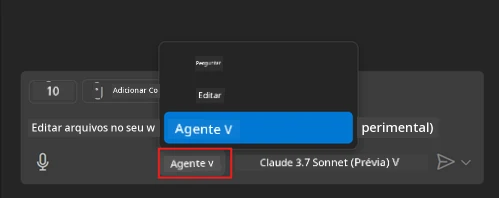
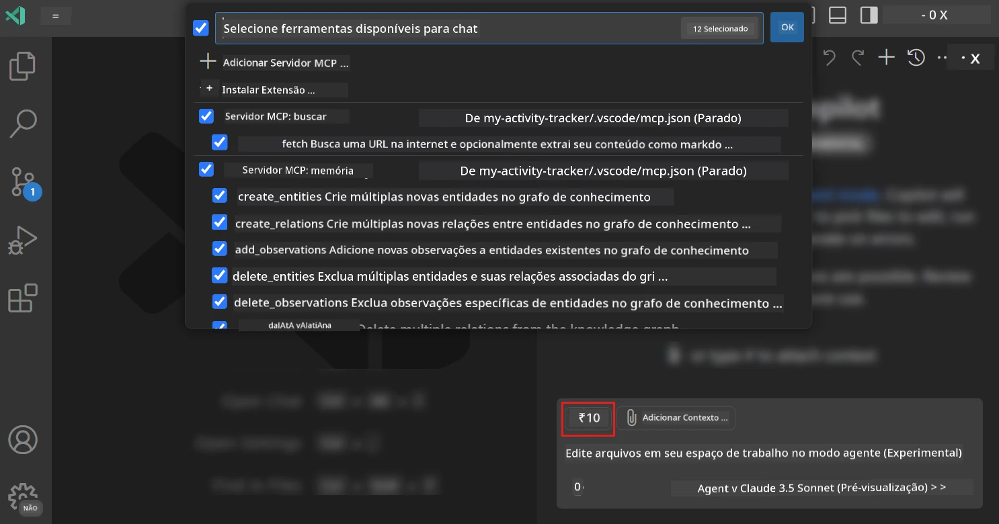
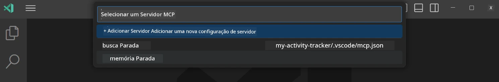
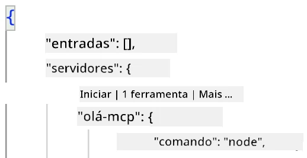
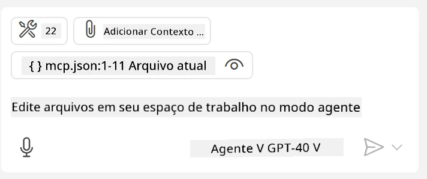
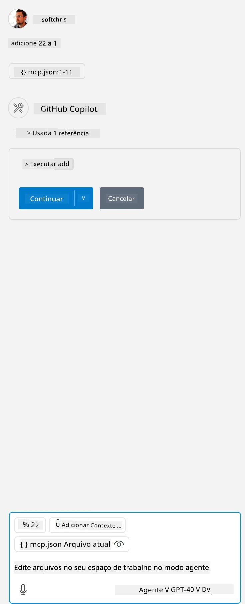

# Consumindo um servidor no modo Agente do GitHub Copilot

Visual Studio Code e GitHub Copilot podem atuar como cliente e consumir um Servidor MCP. Você pode estar se perguntando, por que faríamos isso? Bem, isso significa que quaisquer recursos que o Servidor MCP tenha agora podem ser usados dentro do seu IDE. Imagine adicionar, por exemplo, o servidor MCP do GitHub, isso permitiria controlar o GitHub via prompts em vez de digitar comandos específicos no terminal. Ou imagine algo em geral que pudesse melhorar sua experiência como desenvolvedor, tudo controlado por linguagem natural. Agora você começa a ver a vantagem, certo?

## Visão Geral

Esta lição cobre como usar o Visual Studio Code e o modo Agente do GitHub Copilot como cliente para seu Servidor MCP.

## Objetivos de Aprendizagem

Ao final desta lição, você será capaz de:

- Consumir um Servidor MCP via Visual Studio Code.
- Executar funcionalidades como ferramentas via GitHub Copilot.
- Configurar o Visual Studio Code para encontrar e gerenciar seu Servidor MCP.

## Uso

Você pode controlar seu servidor MCP de duas maneiras diferentes:

- Interface do usuário, você verá como isso é feito mais adiante neste capítulo.
- Terminal, é possível controlar coisas pelo terminal usando o executável `code`:

  Para adicionar um servidor MCP ao seu perfil de usuário, use a opção de linha de comando --add-mcp, e forneça a configuração JSON do servidor no formato {\"name\":\"server-name\",\"command\":...}.

  ```
  code --add-mcp "{\"name\":\"my-server\",\"command\": \"uvx\",\"args\": [\"mcp-server-fetch\"]}"
  ```

### Capturas de tela





Vamos falar mais sobre como usamos a interface visual nas próximas seções.

## Abordagem

Aqui está como precisamos abordar isso em alto nível:

- Configurar um arquivo para encontrar nosso Servidor MCP.
- Inicializar/Conectar ao referido servidor para que ele liste suas capacidades.
- Usar essas capacidades através da interface do GitHub Copilot Chat.

Ótimo, agora que entendemos o fluxo, vamos tentar usar um Servidor MCP através do Visual Studio Code por meio de um exercício.

## Exercício: Consumindo um servidor

Neste exercício, vamos configurar o Visual Studio Code para encontrar seu servidor MCP para que ele possa ser usado na interface do GitHub Copilot Chat.

### -0- Pré-passo, habilitar descoberta do Servidor MCP

Pode ser necessário habilitar a descoberta de Servidores MCP.

1. Vá em `Arquivo -> Preferências -> Configurações` no Visual Studio Code.

1. Procure por "MCP" e habilite `chat.mcp.discovery.enabled` no arquivo settings.json.

### -1- Criar arquivo de configuração

Comece criando um arquivo de configuração na raiz do seu projeto, você precisará de um arquivo chamado MCP.json e colocá-lo em uma pasta chamada .vscode. Ele deve ficar assim:

```text
.vscode
|-- mcp.json
```

Em seguida, veja como podemos adicionar uma entrada de servidor.

### -2- Configurar um servidor

Adicione o seguinte conteúdo ao *mcp.json*:

```json
{
    "inputs": [],
    "servers": {
       "hello-mcp": {
           "command": "node",
           "args": [
               "build/index.js"
           ]
       }
    }
}
```

Acima está um exemplo simples de como iniciar um servidor escrito em Node.js, para outras runtimes, defina o comando adequado para iniciar o servidor usando `command` e `args`.

### -3- Iniciar o servidor

Agora que você adicionou uma entrada, vamos iniciar o servidor:

1. Localize sua entrada em *mcp.json* e certifique-se de encontrar o ícone "play":

    

1. Clique no ícone "play", você deverá ver o ícone de ferramentas no GitHub Copilot Chat aumentar o número de ferramentas disponíveis. Se clicar neste ícone de ferramentas, verá uma lista de ferramentas registradas. Você pode marcar/desmarcar cada ferramenta dependendo se quer que o GitHub Copilot as use como contexto:

  

1. Para executar uma ferramenta, digite um prompt que saiba que corresponderá à descrição de uma de suas ferramentas, por exemplo, um prompt como "adicionar 22 a 1":

  

  Você deverá ver uma resposta dizendo 23.

## Tarefa

Tente adicionar uma entrada de servidor ao seu arquivo *mcp.json* e certifique-se de que pode iniciar/parar o servidor. Certifique-se também de conseguir comunicar-se com as ferramentas do seu servidor via interface do GitHub Copilot Chat.

## Solução

[Solução](./solution/README.md)

## Principais Conclusões

Os pontos principais deste capítulo são os seguintes:

- Visual Studio Code é um ótimo cliente que permite consumir vários Servidores MCP e suas ferramentas.
- A interface do GitHub Copilot Chat é como você interage com os servidores.
- Você pode pedir ao usuário entradas como chaves API que podem ser passadas para o Servidor MCP ao configurar a entrada do servidor no arquivo *mcp.json*.

## Exemplos

- [Calculadora Java](../samples/java/calculator/README.md)
- [Calculadora .Net](../../../../03-GettingStarted/samples/csharp)
- [Calculadora JavaScript](../samples/javascript/README.md)
- [Calculadora TypeScript](../samples/typescript/README.md)
- [Calculadora Python](../../../../03-GettingStarted/samples/python)

## Recursos Adicionais

- [Documentação do Visual Studio](https://code.visualstudio.com/docs/copilot/chat/mcp-servers)

## O que vem a seguir

- Próximo: [Criando um Servidor stdio](../05-stdio-server/README.md)

---

<!-- CO-OP TRANSLATOR DISCLAIMER START -->
**Aviso Legal**:
Este documento foi traduzido usando o serviço de tradução por IA [Co-op Translator](https://github.com/Azure/co-op-translator). Embora nos esforcemos pela precisão, por favor, esteja ciente de que traduções automatizadas podem conter erros ou imprecisões. O documento original em seu idioma nativo deve ser considerado a fonte autorizada. Para informações críticas, recomenda-se tradução profissional humana. Não nos responsabilizamos por quaisquer mal-entendidos ou interpretações incorretas decorrentes do uso desta tradução.
<!-- CO-OP TRANSLATOR DISCLAIMER END -->