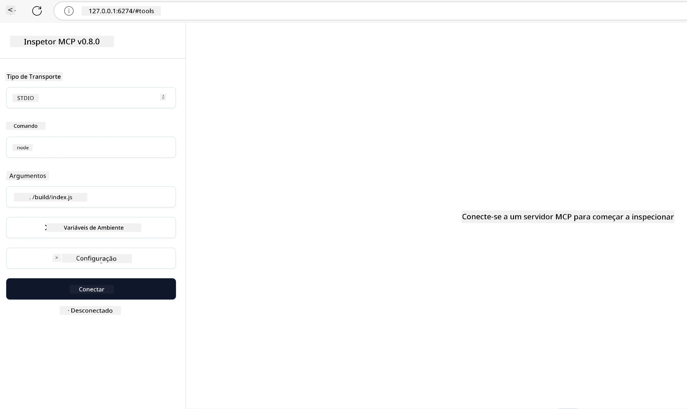

## Testando e Depurando

Antes de começar a testar seu servidor MCP, é importante entender as ferramentas disponíveis e as melhores práticas para depuração. Testes eficazes garantem que seu servidor se comporte conforme o esperado e ajudam a identificar e resolver problemas rapidamente. A seção a seguir descreve abordagens recomendadas para validar sua implementação MCP.

## Visão Geral

Esta lição aborda como selecionar a abordagem de teste correta e a ferramenta de teste mais eficaz.

## Objetivos de Aprendizagem

Ao final desta lição, você será capaz de:

- Descrever várias abordagens para testes.
- Usar diferentes ferramentas para testar seu código de forma eficaz.


## Testando Servidores MCP

O MCP fornece ferramentas para ajudar a testar e depurar seus servidores:

- **MCP Inspector**: Uma ferramenta de linha de comando que pode ser usada tanto como CLI quanto como ferramenta visual.
- **Teste manual**: Você pode usar uma ferramenta como curl para executar requisições web, mas qualquer ferramenta capaz de realizar HTTP serve.
- **Teste unitário**: É possível usar seu framework de teste preferido para testar funcionalidades tanto do servidor quanto do cliente.

### Usando o MCP Inspector

Já descrevemos o uso desta ferramenta em lições anteriores, mas vamos falar um pouco sobre ela em um nível geral. É uma ferramenta construída em Node.js e você pode usá-la chamando o executável `npx`, que baixa e instala temporariamente a ferramenta e a remove assim que termina de executar sua solicitação.

O [MCP Inspector](https://github.com/modelcontextprotocol/inspector) ajuda você a:

- **Descobrir Capacidades do Servidor**: Detectar automaticamente recursos, ferramentas e prompts disponíveis
- **Testar Execução de Ferramentas**: Experimentar diferentes parâmetros e ver respostas em tempo real
- **Visualizar Metadados do Servidor**: Examinar informações do servidor, esquemas e configurações

Uma execução típica da ferramenta se parece com isto:

```bash
npx @modelcontextprotocol/inspector node build/index.js
```

O comando acima inicia um MCP e sua interface visual e abre uma interface web local no seu navegador. Você pode esperar ver um painel exibindo seus servidores MCP registrados, suas ferramentas disponíveis, recursos e prompts. A interface permite testar interativamente a execução das ferramentas, inspecionar os metadados do servidor e ver respostas em tempo real, facilitando validar e depurar suas implementações de servidores MCP.

Veja como pode ser: 

Você também pode executar esta ferramenta em modo CLI, para isso adicione o atributo `--cli`. Aqui está um exemplo de execução da ferramenta no modo "CLI", que lista todas as ferramentas no servidor:

```sh
npx @modelcontextprotocol/inspector --cli node build/index.js --method tools/list
```

### Teste Manual

Além de usar a ferramenta inspector para testar capacidades do servidor, outra abordagem semelhante é executar um cliente capaz de usar HTTP, como o curl, por exemplo.

Com o curl, você pode testar servidores MCP diretamente usando requisições HTTP:

```bash
# Exemplo: Metadados do servidor de teste
curl http://localhost:3000/v1/metadata

# Exemplo: Executar uma ferramenta
curl -X POST http://localhost:3000/v1/tools/execute \
  -H "Content-Type: application/json" \
  -d '{"name": "calculator", "parameters": {"expression": "2+2"}}'
```

Como pode ser visto no exemplo acima usando curl, você usa uma requisição POST para invocar uma ferramenta usando uma carga útil composta pelo nome da ferramenta e seus parâmetros. Use a abordagem que melhor se adapta a você. Ferramentas CLI em geral tendem a ser mais rápidas e se prestam a serem automatizadas, o que pode ser útil em um ambiente de CI/CD.

### Teste Unitário

Crie testes unitários para suas ferramentas e recursos para garantir que funcionem conforme o esperado. Aqui está um exemplo de código de teste.

```python
import pytest

from mcp.server.fastmcp import FastMCP
from mcp.shared.memory import (
    create_connected_server_and_client_session as create_session,
)

# Marcar todo o módulo para testes assíncronos
pytestmark = pytest.mark.anyio


async def test_list_tools_cursor_parameter():
    """Test that the cursor parameter is accepted for list_tools.

    Note: FastMCP doesn't currently implement pagination, so this test
    only verifies that the cursor parameter is accepted by the client.
    """

 server = FastMCP("test")

    # Criar um par de ferramentas de teste
    @server.tool(name="test_tool_1")
    async def test_tool_1() -> str:
        """First test tool"""
        return "Result 1"

    @server.tool(name="test_tool_2")
    async def test_tool_2() -> str:
        """Second test tool"""
        return "Result 2"

    async with create_session(server._mcp_server) as client_session:
        # Testar sem o parâmetro cursor (omitido)
        result1 = await client_session.list_tools()
        assert len(result1.tools) == 2

        # Testar com cursor=None
        result2 = await client_session.list_tools(cursor=None)
        assert len(result2.tools) == 2

        # Testar com cursor como string
        result3 = await client_session.list_tools(cursor="some_cursor_value")
        assert len(result3.tools) == 2

        # Testar com cursor string vazio
        result4 = await client_session.list_tools(cursor="")
        assert len(result4.tools) == 2
    
```

O código acima faz o seguinte:

- Utiliza o framework pytest que permite criar testes como funções e usar declarações assert.
- Cria um Servidor MCP com duas ferramentas diferentes.
- Usa a declaração `assert` para verificar se certas condições são atendidas.

Veja o [arquivo completo aqui](https://github.com/modelcontextprotocol/python-sdk/blob/main/tests/client/test_list_methods_cursor.py)

Com base no arquivo acima, você pode testar seu próprio servidor para garantir que as capacidades sejam criadas como esperado.

Todos os principais SDKs têm seções de teste semelhantes, para que você possa ajustar ao seu runtime escolhido.

## Exemplos

- [Calculadora Java](../samples/java/calculator/README.md)
- [Calculadora .Net](../../../../03-GettingStarted/samples/csharp)
- [Calculadora JavaScript](../samples/javascript/README.md)
- [Calculadora TypeScript](../samples/typescript/README.md)
- [Calculadora Python](../../../../03-GettingStarted/samples/python) 

## Recursos Adicionais

- [SDK Python](https://github.com/modelcontextprotocol/python-sdk)

## O que vem a seguir

- Próximo: [Implantação](../09-deployment/README.md)

---

<!-- CO-OP TRANSLATOR DISCLAIMER START -->
**Aviso Legal**:
Este documento foi traduzido usando o serviço de tradução por IA [Co-op Translator](https://github.com/Azure/co-op-translator). Embora nos esforcemos pela precisão, por favor, esteja ciente de que traduções automatizadas podem conter erros ou imprecisões. O documento original em seu idioma nativo deve ser considerado a fonte autorizada. Para informações críticas, recomenda-se tradução profissional humana. Não nos responsabilizamos por quaisquer mal-entendidos ou interpretações incorretas decorrentes do uso desta tradução.
<!-- CO-OP TRANSLATOR DISCLAIMER END -->