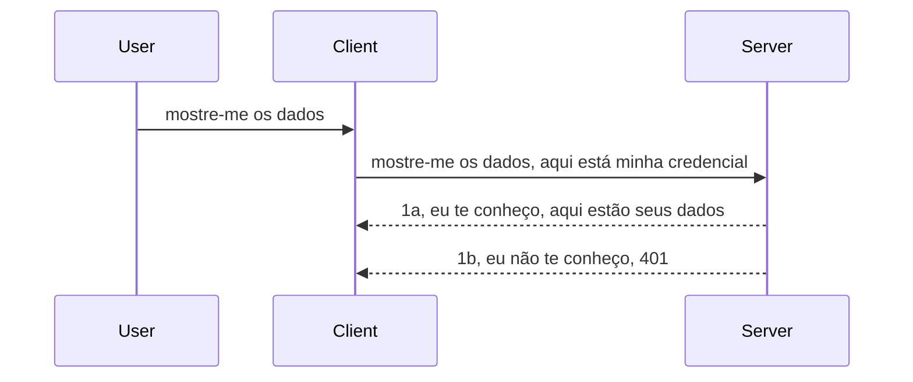

# Autenticação simples

Os SDKs MCP suportam o uso do OAuth 2.1 que, para ser justo, é um processo bastante complexo envolvendo conceitos como servidor de autenticação, servidor de recursos, envio de credenciais, obtenção de um código, troca do código por um token bearer até que você finalmente obtenha os dados do recurso. Se você não está acostumado com OAuth, que é algo ótimo para implementar, é uma boa ideia começar com um nível básico de autenticação e evoluir para uma segurança cada vez melhor. É por isso que este capítulo existe, para prepará-lo para uma autenticação mais avançada.

## Autenticação, o que queremos dizer?

Auth é abreviação de autenticação e autorização. A ideia é que precisamos fazer duas coisas:

- **Autenticação**, que é o processo de descobrir se deixamos uma pessoa entrar na nossa casa, que ela tem o direito de estar "aqui", ou seja, ter acesso ao nosso servidor de recursos onde as funcionalidades do nosso MCP Server vivem.
- **Autorização**, é o processo de descobrir se um usuário deve ter acesso a esses recursos específicos que ele está pedindo, por exemplo, esses pedidos ou esses produtos ou se ele está autorizado a ler o conteúdo, mas não excluir, como outro exemplo.

## Credenciais: como informamos o sistema quem somos

Bem, a maioria dos desenvolvedores web pensa em termos de fornecer uma credencial ao servidor, geralmente um segredo que diz se eles têm permissão para estar aqui ("Autenticação"). Essa credencial geralmente é uma versão codificada em base64 de nome de usuário e senha ou uma chave de API que identifica exclusivamente um usuário específico.

Isso envolve enviá-la via um cabeçalho chamado "Authorization" assim:

```json
{ "Authorization": "secret123" }
```

Isso geralmente é referido como autenticação básica. O fluxo geral funciona da seguinte forma:


Agora que entendemos como funciona do ponto de vista do fluxo, como implementamos? Bem, a maioria dos servidores web possui um conceito chamado middleware, um pedaço de código que roda como parte da requisição que pode verificar as credenciais e, se forem válidas, permite que a requisição passe. Se a requisição não tiver credenciais válidas, você recebe um erro de autenticação. Vamos ver como isso pode ser implementado:

**Python**

```python
class AuthMiddleware(BaseHTTPMiddleware):
    async def dispatch(self, request, call_next):

        has_header = request.headers.get("Authorization")
        if not has_header:
            print("-> Missing Authorization header!")
            return Response(status_code=401, content="Unauthorized")

        if not valid_token(has_header):
            print("-> Invalid token!")
            return Response(status_code=403, content="Forbidden")

        print("Valid token, proceeding...")
       
        response = await call_next(request)
        # adicione quaisquer cabeçalhos do cliente ou altere a resposta de alguma forma
        return response


starlette_app.add_middleware(CustomHeaderMiddleware)
```

Aqui temos: 

- Criado um middleware chamado `AuthMiddleware` onde seu método `dispatch` é invocado pelo servidor web.
- Adicionado o middleware ao servidor web:

    ```python
    starlette_app.add_middleware(AuthMiddleware)
    ```

- Escrito lógica de validação que verifica se o cabeçalho Authorization está presente e se o segredo enviado é válido:

    ```python
    has_header = request.headers.get("Authorization")
    if not has_header:
        print("-> Missing Authorization header!")
        return Response(status_code=401, content="Unauthorized")

    if not valid_token(has_header):
        print("-> Invalid token!")
        return Response(status_code=403, content="Forbidden")
    ```

    se o segredo está presente e válido, então deixamos a requisição passar chamando `call_next` e retornamos a resposta.

    ```python
    response = await call_next(request)
    # adicionar quaisquer cabeçalhos personalizados ou alterar a resposta de alguma forma
    return response
    ```

Como funciona é que, se uma requisição web é feita ao servidor, o middleware será invocado e, dado sua implementação, ele deixará a requisição passar ou terminará retornando um erro que indica que o cliente não tem permissão para continuar.

**TypeScript**

Aqui criamos um middleware com o popular framework Express e interceptamos a requisição antes dela alcançar o MCP Server. Aqui está o código para isso:

```typescript
function isValid(secret) {
    return secret === "secret123";
}

app.use((req, res, next) => {
    // 1. Cabeçalho de autorização presente?
    if(!req.headers["Authorization"]) {
        res.status(401).send('Unauthorized');
    }
    
    let token = req.headers["Authorization"];

    // 2. Verificar validade.
    if(!isValid(token)) {
        res.status(403).send('Forbidden');
    }

   
    console.log('Middleware executed');
    // 3. Passa a requisição para a próxima etapa no pipeline de requisição.
    next();
});
```

Neste código nós:

1. Verificamos se o cabeçalho Authorization está presente inicialmente, se não estiver, enviamos um erro 401.
2. Garantimos que a credencial/token é válido, se não for, enviamos um erro 403.
3. Finalmente, passamos a requisição no pipeline e retornamos o recurso solicitado.

## Exercício: implementar autenticação

Vamos aplicar nosso conhecimento e tentar implementar. Aqui está o plano:

Servidor

- Criar um servidor web e uma instância MCP.
- Implementar um middleware para o servidor.

Cliente

- Enviar requisição web, com credencial, via cabeçalho.

### -1- Criar um servidor web e uma instância MCP

No primeiro passo, precisamos criar a instância do servidor web e o MCP Server.

**Python**

Aqui criamos uma instância do MCP Server, criamos um app web starlette e o hospedamos com uvicorn.

```python
# criando servidor MCP

app = FastMCP(
    name="MCP Resource Server",
    instructions="Resource Server that validates tokens via Authorization Server introspection",
    host=settings["host"],
    port=settings["port"],
    debug=True
)

# criando aplicativo web starlette
starlette_app = app.streamable_http_app()

# servindo aplicativo via uvicorn
async def run(starlette_app):
    import uvicorn
    config = uvicorn.Config(
            starlette_app,
            host=app.settings.host,
            port=app.settings.port,
            log_level=app.settings.log_level.lower(),
        )
    server = uvicorn.Server(config)
    await server.serve()

run(starlette_app)
```

Neste código nós:

- Criamos o MCP Server.
- Construímos o app web starlette a partir do MCP Server, `app.streamable_http_app()`.
- Hospedamos e servimos o app web usando uvicorn `server.serve()`.

**TypeScript**

Aqui criamos uma instância do MCP Server.

```typescript
const server = new McpServer({
      name: "example-server",
      version: "1.0.0"
    });

    // ... configurar recursos do servidor, ferramentas e prompts ...
```

Essa criação do MCP Server precisa acontecer dentro da definição da rota POST /mcp, então vamos pegar o código acima e movê-lo assim:

```typescript
import express from "express";
import { randomUUID } from "node:crypto";
import { McpServer } from "@modelcontextprotocol/sdk/server/mcp.js";
import { StreamableHTTPServerTransport } from "@modelcontextprotocol/sdk/server/streamableHttp.js";
import { isInitializeRequest } from "@modelcontextprotocol/sdk/types.js"

const app = express();
app.use(express.json());

// Mapa para armazenar transportes por ID de sessão
const transports: { [sessionId: string]: StreamableHTTPServerTransport } = {};

// Lidar com requisições POST para comunicação cliente-servidor
app.post('/mcp', async (req, res) => {
  // Verificar se existe ID de sessão
  const sessionId = req.headers['mcp-session-id'] as string | undefined;
  let transport: StreamableHTTPServerTransport;

  if (sessionId && transports[sessionId]) {
    // Reutilizar transporte existente
    transport = transports[sessionId];
  } else if (!sessionId && isInitializeRequest(req.body)) {
    // Novo pedido de inicialização
    transport = new StreamableHTTPServerTransport({
      sessionIdGenerator: () => randomUUID(),
      onsessioninitialized: (sessionId) => {
        // Armazenar o transporte pelo ID de sessão
        transports[sessionId] = transport;
      },
      // A proteção contra DNS rebinding está desabilitada por padrão para compatibilidade retroativa. Se você estiver executando este servidor
      // localmente, certifique-se de definir:
      // enableDnsRebindingProtection: true,
      // allowedHosts: ['127.0.0.1'],
    });

    // Limpar transporte quando fechado
    transport.onclose = () => {
      if (transport.sessionId) {
        delete transports[transport.sessionId];
      }
    };
    const server = new McpServer({
      name: "example-server",
      version: "1.0.0"
    });

    // ... configurar recursos do servidor, ferramentas e prompts ...

    // Conectar ao servidor MCP
    await server.connect(transport);
  } else {
    // Requisição inválida
    res.status(400).json({
      jsonrpc: '2.0',
      error: {
        code: -32000,
        message: 'Bad Request: No valid session ID provided',
      },
      id: null,
    });
    return;
  }

  // Lidar com a requisição
  await transport.handleRequest(req, res, req.body);
});

// Manipulador reutilizável para requisições GET e DELETE
const handleSessionRequest = async (req: express.Request, res: express.Response) => {
  const sessionId = req.headers['mcp-session-id'] as string | undefined;
  if (!sessionId || !transports[sessionId]) {
    res.status(400).send('Invalid or missing session ID');
    return;
  }
  
  const transport = transports[sessionId];
  await transport.handleRequest(req, res);
};

// Lidar com requisições GET para notificações do servidor para o cliente via SSE
app.get('/mcp', handleSessionRequest);

// Lidar com requisições DELETE para término de sessão
app.delete('/mcp', handleSessionRequest);

app.listen(3000);
```

Agora você vê como a criação do MCP Server foi movida para dentro de `app.post("/mcp")`.

Vamos passar para o próximo passo que é criar o middleware para podermos validar a credencial recebida.

### -2- Implementar um middleware para o servidor

Vamos para a parte do middleware agora. Aqui criaremos um middleware que busca uma credencial no cabeçalho `Authorization` e a valida. Se for aceitável, a requisição continuará para fazer o que precisa (ex: listar ferramentas, ler um recurso ou qualquer funcionalidade MCP que o cliente estava solicitando).

**Python**

Para criar o middleware, precisamos criar uma classe que herda de `BaseHTTPMiddleware`. Há dois pontos interessantes:

- A requisição `request`, de onde lemos a informação do cabeçalho.
- `call_next`, a callback que precisamos invocar se o cliente trouxe uma credencial que aceitamos.

Primeiro, precisamos lidar com o caso em que o cabeçalho `Authorization` está ausente:

```python
has_header = request.headers.get("Authorization")

# nenhum cabeçalho presente, falhar com 401, caso contrário, continuar.
if not has_header:
    print("-> Missing Authorization header!")
    return Response(status_code=401, content="Unauthorized")
```

Aqui enviamos uma mensagem 401 unauthorized pois o cliente falhou na autenticação.

Depois, se uma credencial foi enviada, temos que verificar a validade dela assim:

```python
 if not valid_token(has_header):
    print("-> Invalid token!")
    return Response(status_code=403, content="Forbidden")
```

Note como enviamos uma mensagem 403 forbidden acima. Veja o middleware completo abaixo implementando tudo que mencionamos:

```python
class AuthMiddleware(BaseHTTPMiddleware):
    async def dispatch(self, request, call_next):

        has_header = request.headers.get("Authorization")
        if not has_header:
            print("-> Missing Authorization header!")
            return Response(status_code=401, content="Unauthorized")

        if not valid_token(has_header):
            print("-> Invalid token!")
            return Response(status_code=403, content="Forbidden")

        print("Valid token, proceeding...")
        print(f"-> Received {request.method} {request.url}")
        response = await call_next(request)
        response.headers['Custom'] = 'Example'
        return response

```

Ótimo, mas e a função `valid_token`? Aqui está ela abaixo:
:

```python
# NÃO use em produção - melhore isso !!
def valid_token(token: str) -> bool:
    # remova o prefixo "Bearer "
    if token.startswith("Bearer "):
        token = token[7:]
        return token == "secret-token"
    return False
```

Isso obviamente deveria melhorar.

IMPORTANTE: Você NUNCA deve ter segredos assim no código. Idealmente, deve recuperar o valor para comparar de uma fonte de dados ou de um IDP (provedor de serviço de identidade) ou melhor ainda, deixar o IDP fazer a validação.

**TypeScript**

Para implementar isso com Express, precisamos chamar o método `use` que aceita funções middleware.

Precisamos:

- Interagir com a variável request para verificar a credencial passada na propriedade `Authorization`.
- Validar a credencial, e se estiver ok deixar a requisição continuar e fazer com que a requisição MCP do cliente execute o que deve (ex: listar ferramentas, ler recurso ou qualquer coisa relacionada ao MCP).

Aqui, estamos verificando se o cabeçalho `Authorization` está presente e, se não estiver, bloqueamos a requisição:

```typescript
if(!req.headers["authorization"]) {
    res.status(401).send('Unauthorized');
    return;
}
```

Se o cabeçalho não for enviado inicialmente, você recebe um 401.

Depois, verificamos se a credencial é válida, se não for, novamente bloqueamos a requisição, mas com uma mensagem um pouco diferente:

```typescript
if(!isValid(token)) {
    res.status(403).send('Forbidden');
    return;
} 
```

Note que agora você recebe um erro 403.

Aqui está o código completo:

```typescript
app.use((req, res, next) => {
    console.log('Request received:', req.method, req.url, req.headers);
    console.log('Headers:', req.headers["authorization"]);
    if(!req.headers["authorization"]) {
        res.status(401).send('Unauthorized');
        return;
    }
    
    let token = req.headers["authorization"];

    if(!isValid(token)) {
        res.status(403).send('Forbidden');
        return;
    }  

    console.log('Middleware executed');
    next();
});
```

Configuramos o servidor web para aceitar um middleware para checar a credencial que o cliente espera nos enviar. E o cliente?

### -3- Enviar requisição web com credencial via cabeçalho

Precisamos garantir que o cliente esteja passando a credencial pelo cabeçalho. Como vamos usar um cliente MCP para isso, precisamos descobrir como fazer.

**Python**

Para o cliente, precisamos passar um cabeçalho com nossa credencial assim:

```python
# NÃO codifique o valor diretamente, tenha-o no mínimo em uma variável de ambiente ou em um armazenamento mais seguro
token = "secret-token"

async with streamablehttp_client(
        url = f"http://localhost:{port}/mcp",
        headers = {"Authorization": f"Bearer {token}"}
    ) as (
        read_stream,
        write_stream,
        session_callback,
    ):
        async with ClientSession(
            read_stream,
            write_stream
        ) as session:
            await session.initialize()
      
            # TODO, o que você quer que seja feito no cliente, por exemplo listar ferramentas, chamar ferramentas etc.
```

Note como preenchemos a propriedade `headers` assim: ` headers = {"Authorization": f"Bearer {token}"}`.

**TypeScript**

Isso podemos resolver em dois passos:

1. Popular um objeto de configuração com nossa credencial.
2. Passar esse objeto de configuração para o transporte.

```typescript

// NÃO codifique o valor diretamente como mostrado aqui. No mínimo, tenha-o como uma variável de ambiente e use algo como dotenv (no modo de desenvolvimento).
let token = "secret123"

// defina um objeto de opção de transporte do cliente
let options: StreamableHTTPClientTransportOptions = {
  sessionId: sessionId,
  requestInit: {
    headers: {
      "Authorization": "secret123"
    }
  }
};

// passe o objeto de opções para o transporte
async function main() {
   const transport = new StreamableHTTPClientTransport(
      new URL(serverUrl),
      options
   );
```

Aqui você vê acima como precisamos criar um objeto `options` e colocar nossos cabeçalhos na propriedade `requestInit`.

IMPORTANTE: Como melhorar isso daqui para frente? Bem, a implementação atual tem alguns problemas. Primeiro, passar uma credencial assim é bastante arriscado a menos que ao menos você tenha HTTPS. Mesmo assim, a credencial pode ser roubada, então você precisa de um sistema onde possa revogar facilmente o token e adicionar verificações adicionais como de onde no mundo ele está vindo, se a requisição acontece com muita frequência (comportamento de bot), em resumo, há uma série de preocupações.

Deve-se dizer, entretanto, que para APIs muito simples onde você não quer que ninguém chame sua API sem estar autenticado, o que temos aqui é um bom começo.

Dito isso, vamos tentar endurecer a segurança um pouco usando um formato padrão como JSON Web Token, também conhecido como JWT ou tokens "JOT".

## JSON Web Tokens, JWT

Então, estamos tentando melhorar as coisas além de enviar credenciais muito simples. Quais as melhorias imediatas que obtemos adotando JWT?

- **Melhorias de segurança**. Na autenticação básica, você envia nome de usuário e senha como um token codificado em base64 (ou envia uma chave API) várias vezes, aumentando o risco. Com JWT, você envia seu nome de usuário e senha e recebe um token em retorno que também é temporário, ou seja, vai expirar. JWT permite facilmente controlar acesso fino usando papéis, escopos e permissões.
- **Ausência de estado e escalabilidade**. JWTs são auto-contidos, carregam todas as informações do usuário e eliminam a necessidade de armazenamento de sessões no servidor. O token também pode ser validado localmente.
- **Interoperabilidade e federação**. JWTs são centrais no Open ID Connect e são usados com provedores de identidade conhecidos como Entra ID, Google Identity e Auth0. Eles também possibilitam o uso de login único (SSO) e muito mais, tornando-os de nível empresarial.
- **Modularidade e flexibilidade**. JWTs também podem ser usados com API Gateways como Azure API Management, NGINX e outros. Suportam cenários de autenticação de uso e comunicação servidor-a-servidor, incluindo cenários de personificação e delegação.
- **Desempenho e cache**. JWTs podem ser armazenados em cache após a decodificação, o que reduz a necessidade de parsing. Isso ajuda especialmente em apps de alto tráfego, melhorando a taxa de transferência e diminuindo a carga na infraestrutura escolhida.
- **Recursos avançados**. Também suportam introspecção (verificar validade no servidor) e revogação (tornar um token inválido).

Com todos esses benefícios, vejamos como podemos levar nossa implementação para o próximo nível.

## Transformando autenticação básica em JWT

Então, as mudanças que precisamos fazer em alto nível são:

- **Aprender a construir um token JWT** e prepará-lo para ser enviado do cliente para o servidor.
- **Validar um token JWT**, e se for válido, permitir que o cliente acesse nossos recursos.
- **Armazenamento seguro do token**. Como armazenamos esse token.
- **Proteger as rotas**. Precisamos proteger as rotas, no nosso caso, proteger rotas e funcionalidades específicas do MCP.
- **Adicionar tokens de atualização (refresh tokens)**. Garantir que criamos tokens com vida curta, mas tokens de atualização longos que podem ser usados para adquirir novos tokens se expirarem. Garantir também um endpoint de refresh e uma estratégia de rotação.

### -1- Construir um token JWT

Primeiro, um token JWT tem as seguintes partes:

- **header**, algoritmo usado e tipo do token.
- **payload**, claims, como sub (o usuário ou entidade que o token representa. Em um cenário de autenticação, tipicamente o userid), exp (quando expira), role (o papel)
- **signature**, assinada com um segredo ou chave privada.

Para isso, precisaremos construir o header, payload e o token codificado.

**Python**

```python

import jwt
import jwt
from jwt.exceptions import ExpiredSignatureError, InvalidTokenError
import datetime

# Chave secreta usada para assinar o JWT
secret_key = 'your-secret-key'

header = {
    "alg": "HS256",
    "typ": "JWT"
}

# as informações do usuário, suas reivindicações e tempo de expiração
payload = {
    "sub": "1234567890",               # Assunto (ID do usuário)
    "name": "User Userson",                # Reivindicação personalizada
    "admin": True,                     # Reivindicação personalizada
    "iat": datetime.datetime.utcnow(),# Emitido em
    "exp": datetime.datetime.utcnow() + datetime.timedelta(hours=1)  # Expiração
}

# codificar isso
encoded_jwt = jwt.encode(payload, secret_key, algorithm="HS256", headers=header)
```

No código acima nós:

- Definimos um header usando HS256 como algoritmo e tipo JWT.
- Construímos um payload que contém um sujeito ou id do usuário, um nome de usuário, um papel, quando foi emitido e quando vai expirar, implementando o aspecto temporal mencionado antes.

**TypeScript**

Aqui precisaremos de algumas dependências que nos ajudarão a construir o token JWT.

Dependências

```sh

npm install jsonwebtoken
npm install --save-dev @types/jsonwebtoken
```

Agora que temos isso, vamos criar o header, payload e por meio disso criar o token codificado.

```typescript
import jwt from 'jsonwebtoken';

const secretKey = 'your-secret-key'; // Use variáveis de ambiente na produção

// Defina a carga útil
const payload = {
  sub: '1234567890',
  name: 'User usersson',
  admin: true,
  iat: Math.floor(Date.now() / 1000), // Emitido em
  exp: Math.floor(Date.now() / 1000) + 60 * 60 // Expira em 1 hora
};

// Defina o cabeçalho (opcional, jsonwebtoken define padrões)
const header = {
  alg: 'HS256',
  typ: 'JWT'
};

// Crie o token
const token = jwt.sign(payload, secretKey, {
  algorithm: 'HS256',
  header: header
});

console.log('JWT:', token);
```

Este token é:

Assinado usando HS256
Válido por 1 hora
Inclui claims como sub, name, admin, iat e exp.

### -2- Validar um token

Também precisaremos validar um token, isso deve ser feito no servidor para garantir que o que o cliente está nos enviando seja realmente válido. Há muitas verificações que devemos fazer aqui, desde validar a estrutura até a validade. Você também é encorajado a adicionar outras checagens para ver se o usuário está no seu sistema e mais.

Para validar um token, precisamos decodificá-lo para podermos lê-lo e então começar a verificar sua validade:

**Python**

```python

# Decodificar e verificar o JWT
try:
    decoded = jwt.decode(token, secret_key, algorithms=["HS256"])
    print("✅ Token is valid.")
    print("Decoded claims:")
    for key, value in decoded.items():
        print(f"  {key}: {value}")
except ExpiredSignatureError:
    print("❌ Token has expired.")
except InvalidTokenError as e:
    print(f"❌ Invalid token: {e}")

```

Neste código, chamamos `jwt.decode` usando o token, a chave secreta e o algoritmo escolhido como entrada. Note como usamos um try-catch, já que uma validação falha gera uma exceção.

**TypeScript**

Aqui precisamos chamar `jwt.verify` para obter uma versão decodificada do token que podemos analisar mais. Se essa chamada falhar, significa que a estrutura do token está incorreta ou não é mais válido.

```typescript

try {
  const decoded = jwt.verify(token, secretKey);
  console.log('Decoded Payload:', decoded);
} catch (err) {
  console.error('Token verification failed:', err);
}
```

NOTA: como mencionado anteriormente, devemos realizar checagens adicionais para garantir que este token aponta para um usuário no nosso sistema e assegurar que o usuário tenha os direitos que afirma ter.

Agora, vamos olhar para o controle de acesso baseado em papéis, também conhecido como RBAC.
## Adicionando controle de acesso baseado em função

A ideia é que queremos expressar que diferentes funções têm diferentes permissões. Por exemplo, assumimos que um administrador pode fazer tudo e que um usuário normal pode ler/gravar e que um convidado só pode ler. Portanto, aqui estão alguns possíveis níveis de permissão:

- Admin.Write 
- User.Read
- Guest.Read

Vamos ver como podemos implementar esse controle com middleware. Middlewares podem ser adicionados por rota assim como para todas as rotas.

**Python**

```python
from starlette.middleware.base import BaseHTTPMiddleware
from starlette.responses import JSONResponse
import jwt

# NÃO deixe o segredo no código assim, isso é apenas para fins de demonstração. Leia de um lugar seguro.
SECRET_KEY = "your-secret-key" # coloque isso em uma variável de ambiente
REQUIRED_PERMISSION = "User.Read"

class JWTPermissionMiddleware(BaseHTTPMiddleware):
    async def dispatch(self, request, call_next):
        auth_header = request.headers.get("Authorization")
        if not auth_header or not auth_header.startswith("Bearer "):
            return JSONResponse({"error": "Missing or invalid Authorization header"}, status_code=401)

        token = auth_header.split(" ")[1]
        try:
            decoded = jwt.decode(token, SECRET_KEY, algorithms=["HS256"])
        except jwt.ExpiredSignatureError:
            return JSONResponse({"error": "Token expired"}, status_code=401)
        except jwt.InvalidTokenError:
            return JSONResponse({"error": "Invalid token"}, status_code=401)

        permissions = decoded.get("permissions", [])
        if REQUIRED_PERMISSION not in permissions:
            return JSONResponse({"error": "Permission denied"}, status_code=403)

        request.state.user = decoded
        return await call_next(request)


```

Existem algumas maneiras diferentes de adicionar o middleware como abaixo:

```python

# Alt 1: adicionar middleware durante a construção do app starlette
middleware = [
    Middleware(JWTPermissionMiddleware)
]

app = Starlette(routes=routes, middleware=middleware)

# Alt 2: adicionar middleware após o app starlette já estar construído
starlette_app.add_middleware(JWTPermissionMiddleware)

# Alt 3: adicionar middleware por rota
routes = [
    Route(
        "/mcp",
        endpoint=..., # manipulador
        middleware=[Middleware(JWTPermissionMiddleware)]
    )
]
```

**TypeScript**

Podemos usar `app.use` e um middleware que será executado para todas as requisições.

```typescript
app.use((req, res, next) => {
    console.log('Request received:', req.method, req.url, req.headers);
    console.log('Headers:', req.headers["authorization"]);

    // 1. Verifique se o cabeçalho de autorização foi enviado

    if(!req.headers["authorization"]) {
        res.status(401).send('Unauthorized');
        return;
    }
    
    let token = req.headers["authorization"];

    // 2. Verifique se o token é válido
    if(!isValid(token)) {
        res.status(403).send('Forbidden');
        return;
    }  

    // 3. Verifique se o usuário do token existe em nosso sistema
    if(!isExistingUser(token)) {
        res.status(403).send('Forbidden');
        console.log("User does not exist");
        return;
    }
    console.log("User exists");

    // 4. Verifique se o token possui as permissões corretas
    if(!hasScopes(token, ["User.Read"])){
        res.status(403).send('Forbidden - insufficient scopes');
    }

    console.log("User has required scopes");

    console.log('Middleware executed');
    next();
});

```

Há várias coisas que podemos permitir que nosso middleware faça e que nosso middleware DEVE fazer, a saber:

1. Verificar se o cabeçalho de autorização está presente
2. Verificar se o token é válido, chamamos `isValid`, que é um método que escrevemos para verificar a integridade e validade do token JWT.
3. Verificar se o usuário existe em nosso sistema, devemos verificar isso.

   ```typescript
    // usuários no banco de dados
   const users = [
     "user1",
     "User usersson",
   ]

   function isExistingUser(token) {
     let decodedToken = verifyToken(token);

     // TODO, verifique se o usuário existe no banco de dados
     return users.includes(decodedToken?.name || "");
   }
   ```

   Acima, criamos uma lista muito simples de `users`, que obviamente deveria estar em um banco de dados.

4. Além disso, também devemos verificar se o token tem as permissões corretas.

   ```typescript
   if(!hasScopes(token, ["User.Read"])){
        res.status(403).send('Forbidden - insufficient scopes');
   }
   ```

   No código acima do middleware, verificamos que o token contém a permissão User.Read, se não enviamos um erro 403. Abaixo está o método auxiliar `hasScopes`.

   ```typescript
   function hasScopes(scope: string, requiredScopes: string[]) {
     let decodedToken = verifyToken(scope);
    return requiredScopes.every(scope => decodedToken?.scopes.includes(scope));
  }
   ```

Have a think which additional checks you should be doing, but these are the absolute minimum of checks you should be doing.

Using Express as a web framework is a common choice. There are helpers library when you use JWT so you can write less code.

- `express-jwt`, helper library that provides a middleware that helps decode your token.
- `express-jwt-permissions`, this provides a middleware `guard` that helps check if a certain permission is on the token.

Here's what these libraries can look like when used:

```typescript
const express = require('express');
const jwt = require('express-jwt');
const guard = require('express-jwt-permissions')();

const app = express();
const secretKey = 'your-secret-key'; // put this in env variable

// Decode JWT and attach to req.user
app.use(jwt({ secret: secretKey, algorithms: ['HS256'] }));

// Check for User.Read permission
app.use(guard.check('User.Read'));

// multiple permissions
// app.use(guard.check(['User.Read', 'Admin.Access']));

app.get('/protected', (req, res) => {
  res.json({ message: `Welcome ${req.user.name}` });
});

// Error handler
app.use((err, req, res, next) => {
  if (err.code === 'permission_denied') {
    return res.status(403).send('Forbidden');
  }
  next(err);
});

```

Agora que você viu como o middleware pode ser usado tanto para autenticação quanto para autorização, e quanto ao MCP, ele muda a forma como fazemos autenticação? Vamos descobrir na próxima seção.

### -3- Adicionar RBAC ao MCP

Você viu até agora como adicionar RBAC via middleware, porém, para MCP não há uma maneira fácil de adicionar RBAC por recurso MCP, então o que fazemos? Bem, só precisamos adicionar um código assim que verifica, neste caso, se o cliente tem os direitos para chamar uma ferramenta específica:

Você tem algumas opções diferentes para realizar RBAC por recurso, aqui estão algumas:

- Adicionar uma verificação para cada ferramenta, recurso, prompt onde você precisa verificar o nível de permissão.

   **python**

   ```python
   @tool()
   def delete_product(id: int):
      try:
          check_permissions(role="Admin.Write", request)
      catch:
        pass # cliente falhou na autorização, gerar erro de autorização
   ```

   **typescript**

   ```typescript
   server.registerTool(
    "delete-product",
    {
      title: Delete a product",
      description: "Deletes a product",
      inputSchema: { id: z.number() }
    },
    async ({ id }) => {
      
      try {
        checkPermissions("Admin.Write", request);
        // todo, enviar id para productService e entrada remota
      } catch(Exception e) {
        console.log("Authorization error, you're not allowed");  
      }

      return {
        content: [{ type: "text", text: `Deletected product with id ${id}` }]
      };
    }
   );
   ```


- Usar uma abordagem avançada de servidor e os manipuladores de requisição para minimizar os lugares onde você precisa fazer a verificação.

   **Python**

   ```python
   
   tool_permission = {
      "create_product": ["User.Write", "Admin.Write"],
      "delete_product": ["Admin.Write"]
   }

   def has_permission(user_permissions, required_permissions) -> bool:
      # user_permissions: lista de permissões que o usuário possui
      # required_permissions: lista de permissões necessárias para a ferramenta
      return any(perm in user_permissions for perm in required_permissions)

   @server.call_tool()
   async def handle_call_tool(
     name: str, arguments: dict[str, str] | None
   ) -> list[types.TextContent]:
    # Suponha que request.user.permissions seja uma lista de permissões do usuário
     user_permissions = request.user.permissions
     required_permissions = tool_permission.get(name, [])
     if not has_permission(user_permissions, required_permissions):
        # Levantar erro "Você não tem permissão para chamar a ferramenta {name}"
        raise Exception(f"You don't have permission to call tool {name}")
     # continuar e chamar a ferramenta
     # ...
   ```   
   

   **TypeScript**

   ```typescript
   function hasPermission(userPermissions: string[], requiredPermissions: string[]): boolean {
       if (!Array.isArray(userPermissions) || !Array.isArray(requiredPermissions)) return false;
       // Retorna verdadeiro se o usuário tiver pelo menos uma permissão necessária
       
       return requiredPermissions.some(perm => userPermissions.includes(perm));
   }
  
   server.setRequestHandler(CallToolRequestSchema, async (request) => {
      const { params: { name } } = request;
  
      let permissions = request.user.permissions;
  
      if (!hasPermission(permissions, toolPermissions[name])) {
         return new Error(`You don't have permission to call ${name}`);
      }
  
      // continuar..
   });
   ```

   Nota, você precisará garantir que seu middleware atribua um token decodificado à propriedade user da requisição para que o código acima seja simples.

### Resumindo

Agora que discutimos como adicionar suporte a RBAC em geral e para MCP em particular, é hora de tentar implementar a segurança por conta própria para garantir que você entendeu os conceitos apresentados.

## Tarefa 1: Construir um servidor mcp e cliente mcp usando autenticação básica

Aqui você aplicará o que aprendeu em termos de envio de credenciais através de cabeçalhos.

## Solução 1

[Soluzione 1](./code/basic/README.md)

## Tarefa 2: Atualizar a solução da Tarefa 1 para usar JWT

Pegue a primeira solução, mas desta vez, vamos melhorá-la.

Em vez de usar Autenticação Básica, vamos usar JWT.

## Solução 2

[Soluzione 2](./solution/jwt-solution/README.md)

## Desafio

Adicione RBAC por ferramenta como descrevemos na seção "Adicionar RBAC ao MCP".

## Resumo

Esperamos que você tenha aprendido muito neste capítulo, desde nenhuma segurança, à segurança básica, ao JWT e como pode ser adicionado ao MCP.

Construímos uma base sólida com JWTs personalizados, mas à medida que escalamos, estamos avançando para um modelo de identidade baseado em padrões. Adotar um IdP como Entra ou Keycloak nos permite delegar emissão, validação e gerenciamento de ciclo de vida de tokens para uma plataforma confiável — liberando-nos para focar na lógica do aplicativo e na experiência do usuário.

Para isso, temos um capítulo mais [avançado sobre Entra](../../05-AdvancedTopics/mcp-security-entra/README.md)

## O que vem a seguir

- Próximo: [Configurando Hosts MCP](../12-mcp-hosts/README.md)

---

<!-- CO-OP TRANSLATOR DISCLAIMER START -->
**Aviso Legal**:  
Este documento foi traduzido utilizando o serviço de tradução por IA [Co-op Translator](https://github.com/Azure/co-op-translator). Embora nos esforcemos para garantir a precisão, esteja ciente de que traduções automatizadas podem conter erros ou imprecisões. O documento original em seu idioma nativo deve ser considerado a fonte autorizada. Para informações críticas, é recomendada a tradução profissional realizada por humanos. Não nos responsabilizamos por quaisquer mal-entendidos ou interpretações incorretas decorrentes do uso desta tradução.
<!-- CO-OP TRANSLATOR DISCLAIMER END -->