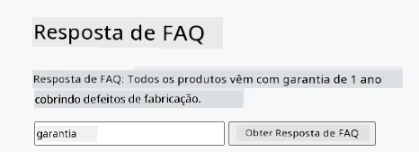
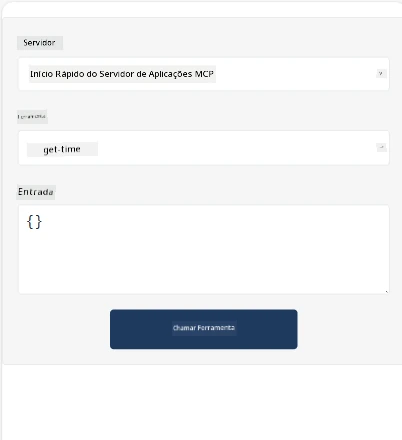
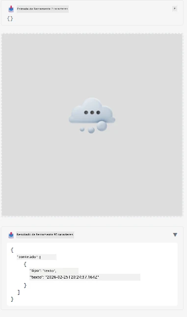

Aqui está um exemplo demonstrando o MCP App

## Instalar

1. Navegue até a pasta *mcp-app*
1. Execute `npm install`, isso deve instalar as dependências do frontend e backend

Verifique se o backend compila executando:

```sh
npx tsc --noEmit
```

Não deve haver nenhuma saída se tudo estiver correto.

## Executar backend

> Isso exige um pouco mais de trabalho se você estiver em uma máquina Windows, pois a solução MCP Apps usa a biblioteca `concurrently` para rodar, e você precisará encontrar um substituto. Aqui está a linha problemática no *package.json* do MCP App:

    ```json
    "start": "concurrently \"cross-env NODE_ENV=development INPUT=mcp-app.html vite build --watch\" \"tsx watch main.ts\""
    ```

Este app tem duas partes, uma parte backend e uma parte host.

Inicie o backend chamando:

```sh
npm start
```

Isso deve iniciar o backend em `http://localhost:3001/mcp`.

> Nota, se você estiver em um Codespace, pode ser necessário definir a visibilidade da porta para pública. Verifique se você consegue acessar o endpoint no navegador pelo endereço https://<nome do Codespace>.app.github.dev/mcp

## Opção -1 Testar o app no Visual Studio Code

Para testar a solução no Visual Studio Code, faça o seguinte:

- Adicione uma entrada de servidor ao `mcp.json` assim:

    ```json
    {
        "servers": {
            "my-mcp-server-7178eca7": {
                "url": "http://localhost:3001/mcp",
                "type": "http"
            }
        },
        "inputs": []
    }
    ```

1. Clique no botão "start" em *mcp.json*
1. Certifique-se de que uma janela de chat está aberta e digite `get-faq`, você deverá ver um resultado assim:

    

## Opção -2- Testar o app com um host

O repositório <https://github.com/modelcontextprotocol/ext-apps> contém vários hosts diferentes que você pode usar para testar seus MVP Apps.

Apresentaremos duas opções diferentes aqui:

### Máquina local

- Navegue até *ext-apps* após clonar o repositório.

- Instale as dependências

   ```sh
   npm install
   ```

- Em uma janela de terminal separada, navegue até *ext-apps/examples/basic-host*

    > Se você estiver em um Codespace, precisa navegar até serve.ts na linha 27 e substituir http://localhost:3001/mcp pela URL do seu Codespace para o backend, então, por exemplo: https://psychic-xylophone-657rpjgvxpc5g64-3001.app.github.dev/mcp

- Execute o host:

    ```sh
    npm start
    ```

    Isso deve conectar o host com o backend e você deverá ver o app rodando assim:

    

### Codespace

Leva um pouco mais de trabalho para fazer um ambiente Codespace funcionar. Para usar um host através do Codespace:

- Veja o diretório *ext-apps* e navegue até *examples/basic-host*.
- Execute `npm install` para instalar as dependências
- Execute `npm start` para iniciar o host.

## Teste o app

Experimente o app da seguinte maneira:

- Selecione o botão "Call Tool" e você deverá ver os resultados assim:

    

Ótimo, está tudo funcionando.

---

<!-- CO-OP TRANSLATOR DISCLAIMER START -->
**Aviso Legal**:
Este documento foi traduzido utilizando o serviço de tradução por IA [Co-op Translator](https://github.com/Azure/co-op-translator). Embora nos esforcemos para garantir a precisão, esteja ciente de que traduções automáticas podem conter erros ou imprecisões. O documento original em seu idioma nativo deve ser considerado a fonte autorizada. Para informações críticas, recomenda-se a tradução profissional feita por humanos. Não nos responsabilizamos por quaisquer mal-entendidos ou interpretações equivocadas decorrentes do uso desta tradução.
<!-- CO-OP TRANSLATOR DISCLAIMER END -->