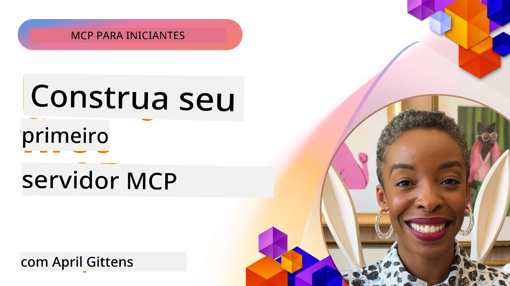

## Começando  

_(Clique na imagem acima para assistir ao vídeo desta lição)_

Esta seção consiste em várias lições:

- **1 Seu primeiro servidor**, nesta primeira lição, você aprenderá como criar seu primeiro servidor e inspecioná-lo com a ferramenta inspector, uma maneira valiosa de testar e depurar seu servidor, [para a lição](01-first-server/README.md)

- **2 Cliente**, nesta lição, você aprenderá como escrever um cliente que pode se conectar ao seu servidor, [para a lição](02-client/README.md)

- **3 Cliente com LLM**, uma maneira ainda melhor de escrever um cliente é adicionando um LLM a ele para que ele possa "negociar" com seu servidor o que fazer, [para a lição](03-llm-client/README.md)

- **4 Consumindo um modo Agente GitHub Copilot no Visual Studio Code**. Aqui, vamos ver como executar nosso MCP Server de dentro do Visual Studio Code, [para a lição](04-vscode/README.md)

- **5 Servidor de transporte stdio** transporte stdio é o padrão recomendado para comunicação local MCP servidor-cliente, proporcionando comunicação segura baseada em subprocessos com isolamento de processo incorporado [para a lição](05-stdio-server/README.md)

- **6 Streaming HTTP com MCP (HTTP Streaming)**. Aprenda sobre transporte HTTP moderno por streaming (a abordagem recomendada para servidores MCP remotos conforme [Especificação MCP 2025-11-25](https://spec.modelcontextprotocol.io/specification/2025-11-25/basic/transports/#streamable-http)), notificações de progresso e como implementar servidores e clientes MCP escaláveis e em tempo real usando HTTP Streaming. [para a lição](06-http-streaming/README.md)

- **7 Utilizando o Kit de Ferramentas de IA para VSCode** para consumir e testar seus Clientes e Servidores MCP [para a lição](07-aitk/README.md)

- **8 Testes**. Aqui vamos focar especialmente em como podemos testar nosso servidor e cliente de maneiras diferentes, [para a lição](08-testing/README.md)

- **9 Implantação**. Este capítulo abordará diferentes formas de implantar suas soluções MCP, [para a lição](09-deployment/README.md)

- **10 Uso avançado do servidor**. Este capítulo cobre uso avançado do servidor, [para a lição](./10-advanced/README.md)

- **11 Autenticação**. Este capítulo aborda como adicionar autenticação simples, desde Basic Auth até o uso de JWT e RBAC. É recomendável começar aqui e depois olhar para Tópicos Avançados no Capítulo 5 e realizar reforço adicional de segurança via recomendações no Capítulo 2, [para a lição](./11-simple-auth/README.md)

- **12 Hosts MCP**. Configure e use clientes host MCP populares, incluindo Claude Desktop, Cursor, Cline e Windsurf. Aprenda tipos de transporte e solução de problemas, [para a lição](./12-mcp-hosts/README.md)

- **13 MCP Inspector**. Depure e teste seus servidores MCP interativamente usando a ferramenta MCP Inspector. Aprenda a solucionar ferramentas, recursos e mensagens de protocolo, [para a lição](./13-mcp-inspector/README.md)

- **14 Amostragem**. Crie servidores MCP que colaboram com clientes MCP em tarefas relacionadas a LLM. [para a lição](./14-sampling/README.md)

- **15 Aplicativos MCP**. Construa servidores MCP que também respondam com instruções de interface do usuário, [para a lição](./15-mcp-apps/README.md)

O Model Context Protocol (MCP) é um protocolo aberto que padroniza como as aplicações fornecem contexto para LLMs. Pense no MCP como uma porta USB-C para aplicações de IA - ele fornece uma maneira padronizada de conectar modelos de IA a diferentes fontes de dados e ferramentas.

## Objetivos de Aprendizagem

Ao final desta lição, você será capaz de:

- Configurar ambientes de desenvolvimento para MCP em C#, Java, Python, TypeScript e JavaScript
- Construir e implantar servidores MCP básicos com funcionalidades personalizadas (recursos, prompts e ferramentas)
- Criar aplicações host que se conectam a servidores MCP
- Testar e depurar implementações MCP
- Compreender desafios comuns de configuração e suas soluções
- Conectar suas implementações MCP a serviços populares de LLM

## Configurando Seu Ambiente MCP

Antes de começar a trabalhar com MCP, é importante preparar seu ambiente de desenvolvimento e entender o fluxo básico de trabalho. Esta seção o guiará pelos passos iniciais para garantir um início tranquilo com MCP.

### Pré-requisitos

Antes de mergulhar no desenvolvimento MCP, certifique-se de ter:

- **Ambiente de Desenvolvimento**: Para a linguagem escolhida (C#, Java, Python, TypeScript ou JavaScript)
- **IDE/Editor**: Visual Studio, Visual Studio Code, IntelliJ, Eclipse, PyCharm ou qualquer editor de código moderno
- **Gerenciadores de Pacotes**: NuGet, Maven/Gradle, pip ou npm/yarn
- **Chaves de API**: Para quaisquer serviços de IA que você planeja usar em suas aplicações host

### SDKs Oficiais

Nos capítulos seguintes você verá soluções construídas usando Python, TypeScript, Java e .NET. Aqui estão todos os SDKs oficialmente suportados.

O MCP fornece SDKs oficiais para múltiplas linguagens (alinhados com [Especificação MCP 2025-11-25](https://spec.modelcontextprotocol.io/specification/2025-11-25/)):
- [SDK C#](https://github.com/modelcontextprotocol/csharp-sdk) - Mantido em colaboração com a Microsoft
- [SDK Java](https://github.com/modelcontextprotocol/java-sdk) - Mantido em colaboração com Spring AI
- [SDK TypeScript](https://github.com/modelcontextprotocol/typescript-sdk) - A implementação oficial em TypeScript
- [SDK Python](https://github.com/modelcontextprotocol/python-sdk) - A implementação oficial em Python (FastMCP)
- [SDK Kotlin](https://github.com/modelcontextprotocol/kotlin-sdk) - A implementação oficial em Kotlin
- [SDK Swift](https://github.com/modelcontextprotocol/swift-sdk) - Mantido em colaboração com Loopwork AI
- [SDK Rust](https://github.com/modelcontextprotocol/rust-sdk) - A implementação oficial em Rust
- [SDK Go](https://github.com/modelcontextprotocol/go-sdk) - A implementação oficial em Go

## Principais Lições

- Configurar um ambiente de desenvolvimento MCP é simples com SDKs específicos por linguagem
- Construir servidores MCP envolve criar e registrar ferramentas com esquemas claros
- Clientes MCP se conectam a servidores e modelos para aproveitar capacidades estendidas
- Testar e depurar são essenciais para implementações MCP confiáveis
- Opções de implantação variam de desenvolvimento local a soluções baseadas em nuvem

## Praticando

Temos um conjunto de exemplos que complementam os exercícios que você verá em todos os capítulos desta seção. Além disso, cada capítulo também possui seus próprios exercícios e tarefas

- [Calculadora Java](./samples/java/calculator/README.md)
- [Calculadora .Net](../../../03-GettingStarted/samples/csharp)
- [Calculadora JavaScript](./samples/javascript/README.md)
- [Calculadora TypeScript](./samples/typescript/README.md)
- [Calculadora Python](../../../03-GettingStarted/samples/python)

## Recursos Adicionais

- [Construa Agentes usando Model Context Protocol no Azure](https://learn.microsoft.com/azure/developer/ai/intro-agents-mcp)
- [MCP Remoto com Azure Container Apps (Node.js/TypeScript/JavaScript)](https://learn.microsoft.com/samples/azure-samples/mcp-container-ts/mcp-container-ts/)
- [Agente MCP OpenAI .NET](https://learn.microsoft.com/samples/azure-samples/openai-mcp-agent-dotnet/openai-mcp-agent-dotnet/)

## E o que vem depois

Comece com a primeira lição: [Criando seu primeiro Servidor MCP](01-first-server/README.md)

Depois de concluir este módulo, continue para: [Módulo 4: Implementação Prática](../04-PracticalImplementation/README.md)

---

<!-- CO-OP TRANSLATOR DISCLAIMER START -->
**Aviso Legal**:
Este documento foi traduzido utilizando o serviço de tradução por IA [Co-op Translator](https://github.com/Azure/co-op-translator). Embora nos esforcemos para garantir a precisão, esteja ciente de que traduções automatizadas podem conter erros ou imprecisões. O documento original em seu idioma nativo deve ser considerado a fonte oficial. Para informações críticas, recomenda-se tradução profissional realizada por humanos. Não nos responsabilizamos por quaisquer mal-entendidos ou interpretações incorretas decorrentes do uso desta tradução.
<!-- CO-OP TRANSLATOR DISCLAIMER END -->