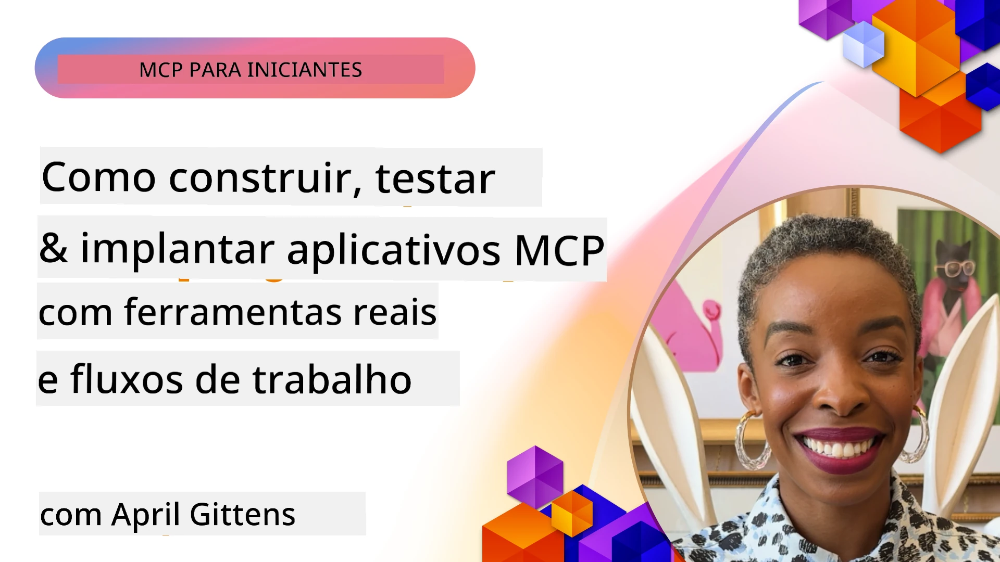
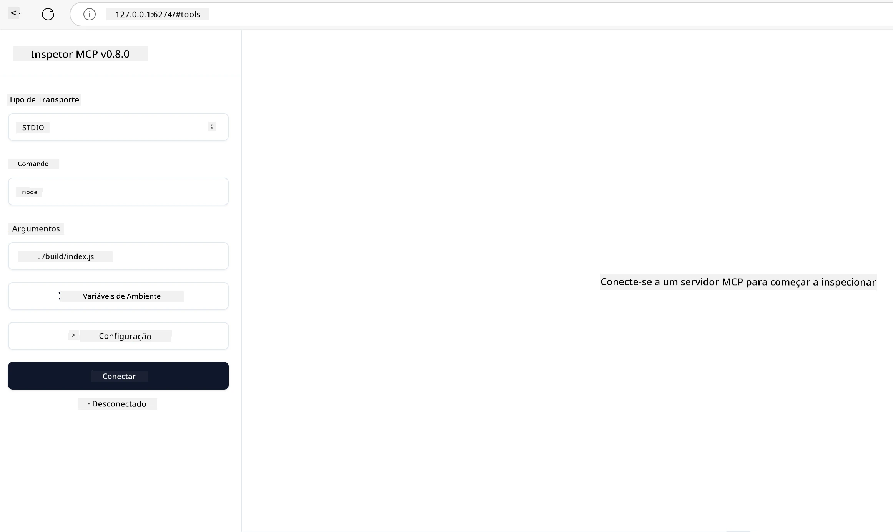

# Implementação Prática

[](https://youtu.be/vCN9-mKBDfQ)

_(Clique na imagem acima para assistir ao vídeo desta lição)_

A implementação prática é onde o poder do Model Context Protocol (MCP) se torna tangível. Embora entender a teoria e a arquitetura por trás do MCP seja importante, o verdadeiro valor surge quando você aplica esses conceitos para construir, testar e implantar soluções que resolvem problemas do mundo real. Este capítulo faz a ponte entre o conhecimento conceitual e o desenvolvimento prático, guiando você pelo processo de dar vida a aplicações baseadas em MCP.

Seja desenvolvendo assistentes inteligentes, integrando IA em fluxos de trabalho empresariais ou construindo ferramentas personalizadas para processamento de dados, o MCP fornece uma base flexível. Seu design independente de linguagem e SDKs oficiais para linguagens de programação populares o tornam acessível a uma ampla gama de desenvolvedores. Ao utilizar esses SDKs, você pode rapidamente prototipar, iterar e escalar suas soluções em diferentes plataformas e ambientes.

Nas seções seguintes, você encontrará exemplos práticos, códigos de amostra e estratégias de implantação que demonstram como implementar MCP em C#, Java com Spring, TypeScript, JavaScript e Python. Você também aprenderá a depurar e testar seus servidores MCP, gerenciar APIs e implantar soluções na nuvem usando o Azure. Estes recursos práticos são projetados para acelerar seu aprendizado e ajudá-lo a construir com confiança aplicativos MCP robustos e prontos para produção.

## Visão Geral

Esta lição foca nos aspectos práticos da implementação do MCP em múltiplas linguagens de programação. Exploraremos como usar os SDKs MCP em C#, Java com Spring, TypeScript, JavaScript e Python para construir aplicações robustas, depurar e testar servidores MCP, e criar recursos, prompts e ferramentas reutilizáveis.

## Objetivos de Aprendizagem

Ao final desta lição, você será capaz de:

- Implementar soluções MCP usando SDKs oficiais em diversas linguagens de programação
- Depurar e testar servidores MCP sistematicamente
- Criar e usar recursos do servidor (Recursos, Prompts e Ferramentas)
- Projetar fluxos de trabalho MCP eficazes para tarefas complexas
- Otimizar implementações MCP para desempenho e confiabilidade

## Recursos Oficiais dos SDKs

O Model Context Protocol oferece SDKs oficiais para múltiplas linguagens (alinhados com a [Especificação MCP 2025-11-25](https://spec.modelcontextprotocol.io/specification/2025-11-25/)):

- [SDK C#](https://github.com/modelcontextprotocol/csharp-sdk)
- [SDK Java com Spring](https://github.com/modelcontextprotocol/java-sdk) **Nota:** requer dependência do [Project Reactor](https://projectreactor.io). (Veja [discussão issue 246](https://github.com/orgs/modelcontextprotocol/discussions/246).)
- [SDK TypeScript](https://github.com/modelcontextprotocol/typescript-sdk)
- [SDK Python](https://github.com/modelcontextprotocol/python-sdk)
- [SDK Kotlin](https://github.com/modelcontextprotocol/kotlin-sdk)
- [SDK Go](https://github.com/modelcontextprotocol/go-sdk)

## Trabalhando com SDKs MCP

Esta seção fornece exemplos práticos de implementação do MCP em várias linguagens de programação. Você pode encontrar código de exemplo no diretório `samples`, organizado por linguagem.

### Exemplos Disponíveis

O repositório inclui [implementações de exemplo](../../../04-PracticalImplementation/samples) nas seguintes linguagens:

- [C#](./samples/csharp/README.md)
- [Java com Spring](./samples/java/containerapp/README.md)
- [TypeScript](./samples/typescript/README.md)
- [JavaScript](./samples/javascript/README.md)
- [Python](./samples/python/README.md)

Cada exemplo demonstra conceitos chave do MCP e padrões de implementação para aquela linguagem e ecossistema específicos.

### Guias Práticos

Guias adicionais para implementação prática do MCP:

- [Paginação e Grandes Conjuntos de Resultados](./pagination/README.md) – Como lidar com paginação baseada em cursor para ferramentas, recursos e grandes conjuntos de dados

## Funcionalidades Principais do Servidor

Servidores MCP podem implementar qualquer combinação dessas funcionalidades:

### Recursos

Recursos fornecem contexto e dados para o usuário ou modelo de IA usar:

- Repositórios de documentos
- Bases de conhecimento
- Fontes de dados estruturados
- Sistemas de arquivos

### Prompts

Prompts são mensagens e fluxos de trabalho modelados para usuários:

- Modelos de conversação pré-definidos
- Padrões de interação guiada
- Estruturas especializadas de diálogo

### Ferramentas

Ferramentas são funções para o modelo de IA executar:

- Utilitários de processamento de dados
- Integrações com APIs externas
- Capacidades computacionais
- Funcionalidade de busca

## Implementações de Exemplo: Implementação C#

O repositório oficial do SDK C# contém várias implementações de exemplo demonstrando diferentes aspectos do MCP:

- **Cliente MCP Básico**: Exemplo simples mostrando como criar um cliente MCP e chamar ferramentas
- **Servidor MCP Básico**: Implementação mínima de servidor com registro básico de ferramentas
- **Servidor MCP Avançado**: Servidor completo com registro de ferramentas, autenticação e tratamento de erros
- **Integração com ASP.NET**: Exemplos demonstrando integração com ASP.NET Core
- **Padrões de Implementação de Ferramentas**: Vários padrões para implementação de ferramentas com diferentes níveis de complexidade

O SDK MCP C# está em prévia e as APIs podem mudar. Atualizaremos continuamente este blog conforme o SDK evoluir.

### Funcionalidades Principais

- [Nuget MCP C# ModelContextProtocol](https://www.nuget.org/packages/ModelContextProtocol)
- Construindo seu [primeiro Servidor MCP](https://devblogs.microsoft.com/dotnet/build-a-model-context-protocol-mcp-server-in-csharp/).

Para exemplos completos de implementação em C#, visite o [repositório oficial de amostras do SDK C#](https://github.com/modelcontextprotocol/csharp-sdk)

## Implementação de Exemplo: Implementação Java com Spring

O SDK Java com Spring oferece opções robustas de implementação MCP com funcionalidades de nível empresarial.

### Funcionalidades Principais

- Integração com Spring Framework
- Forte tipagem segura
- Suporte a programação reativa
- Tratamento de erros abrangente

Para um exemplo completo de implementação em Java com Spring, veja [amostra Java com Spring](samples/java/containerapp/README.md) no diretório de exemplos.

## Implementação de Exemplo: Implementação JavaScript

O SDK JavaScript fornece uma abordagem leve e flexível para implementação MCP.

### Funcionalidades Principais

- Suporte a Node.js e navegador
- API baseada em Promises
- Integração fácil com Express e outros frameworks
- Suporte a WebSocket para streaming

Para um exemplo completo de implementação em JavaScript, veja [amostra JavaScript](samples/javascript/README.md) no diretório de exemplos.

## Implementação de Exemplo: Implementação Python

O SDK Python oferece uma abordagem “pythônica” para implementação MCP com excelentes integrações a frameworks de ML.

### Funcionalidades Principais

- Suporte a async/await com asyncio
- Integração FastAPI``
- Registro simples de ferramentas
- Integração nativa com bibliotecas populares de ML

Para um exemplo completo de implementação em Python, veja [amostra Python](samples/python/README.md) no diretório de exemplos.

## Gerenciamento de API

O Azure API Management é uma ótima solução para como podemos proteger Servidores MCP. A ideia é colocar uma instância do Azure API Management na frente do seu Servidor MCP e deixar que ele gerencie recursos que você provavelmente desejará, como:

- limitação de taxa
- gerenciamento de tokens
- monitoramento
- balanceamento de carga
- segurança

### Exemplo Azure

Aqui está um exemplo Azure fazendo exatamente isso, ou seja, [criando um Servidor MCP e protegendo-o com Azure API Management](https://github.com/Azure-Samples/remote-mcp-apim-functions-python).

Veja como o fluxo de autorização acontece na imagem abaixo:


Na imagem acima, ocorre o seguinte:

- A autenticação/autorização acontece usando Microsoft Entra.
- O Azure API Management atua como um gateway e usa políticas para direcionar e gerenciar o tráfego.
- O Azure Monitor registra todas as requisições para análise posterior.

#### Fluxo de autorização

Vamos analisar o fluxo de autorização mais detalhadamente:


#### Especificação de autorização MCP

Saiba mais sobre a [especificação de autorização MCP](https://spec.modelcontextprotocol.io/specification/2025-11-25/basic/authorization/)

## Implantar Servidor MCP Remoto no Azure

Vamos ver se conseguimos implantar o exemplo mencionado anteriormente:

1. Clone o repositório

    ```bash
    git clone https://github.com/Azure-Samples/remote-mcp-apim-functions-python.git
    cd remote-mcp-apim-functions-python
    ```

1. Registre o provedor de recursos `Microsoft.App`.

   - Se você estiver usando Azure CLI, execute `az provider register --namespace Microsoft.App --wait`.
   - Se estiver usando Azure PowerShell, execute `Register-AzResourceProvider -ProviderNamespace Microsoft.App`. Depois de algum tempo, execute `(Get-AzResourceProvider -ProviderNamespace Microsoft.App).RegistrationState` para verificar se o registro foi concluído.

1. Execute este comando [azd](https://aka.ms/azd) para provisionar o serviço de gerenciamento de API, o function app (com código) e todos os outros recursos do Azure necessários

    ```shell
    azd up
    ```

    Este comando deverá implantar todos os recursos na nuvem no Azure

### Testando seu servidor com o MCP Inspector

1. Em uma **nova janela de terminal**, instale e execute o MCP Inspector

    ```shell
    npx @modelcontextprotocol/inspector
    ```

    Você verá uma interface semelhante a:

    

1. Ctrl clique para carregar o aplicativo web MCP Inspector a partir da URL exibida pelo app (exemplo: [http://127.0.0.1:6274/#resources](http://127.0.0.1:6274/#resources))
1. Defina o tipo de transporte para `SSE`
1. Defina a URL para o endpoint SSE do Azure API Management exibido após o comando `azd up` e clique em **Conectar**:

    ```shell
    https://<apim-servicename-from-azd-output>.azure-api.net/mcp/sse
    ```

1. **Listar Ferramentas**. Clique em uma ferramenta e **Executar Ferramenta**.

Se todos os passos funcionaram, agora você estará conectado ao servidor MCP e terá conseguido chamar uma ferramenta.

## Servidores MCP para Azure

[Remote-mcp-functions](https://github.com/Azure-Samples/remote-mcp-functions-dotnet): Este conjunto de repositórios são um template de início rápido para construir e implantar servidores MCP remotos personalizados usando Azure Functions com Python, C# .NET ou Node/TypeScript.

Os exemplos fornecem uma solução completa que permite aos desenvolvedores:

- Construir e executar localmente: Desenvolver e depurar um servidor MCP em uma máquina local
- Implantar no Azure: Implantar facilmente na nuvem com um simples comando azd up
- Conectar de clientes: Conectar ao servidor MCP a partir de vários clientes, incluindo o modo agente Copilot do VS Code e a ferramenta MCP Inspector

### Funcionalidades Principais

- Segurança por design: O servidor MCP é protegido usando chaves e HTTPS
- Opções de autenticação: Suporta OAuth usando autenticação embutida e/ou API Management
- Isolamento de rede: Permite isolamento de rede usando Azure Virtual Networks (VNET)
- Arquitetura serverless: Usa Azure Functions para execução escalável e orientada a eventos
- Desenvolvimento local: Suporte completo para desenvolvimento local e depuração
- Implantação simples: Processo de implantação simplificado para o Azure

O repositório inclui todos os arquivos de configuração necessários, código-fonte e definições de infraestrutura para que você inicie rapidamente uma implementação de servidor MCP pronta para produção.

- [Azure Remote MCP Functions Python](https://github.com/Azure-Samples/remote-mcp-functions-python) – Implementação de exemplo do MCP usando Azure Functions com Python

- [Azure Remote MCP Functions .NET](https://github.com/Azure-Samples/remote-mcp-functions-dotnet) – Implementação de exemplo do MCP usando Azure Functions com C# .NET

- [Azure Remote MCP Functions Node/Typescript](https://github.com/Azure-Samples/remote-mcp-functions-typescript) – Implementação de exemplo do MCP usando Azure Functions com Node/TypeScript.

## Principais Lições

- Os SDKs MCP fornecem ferramentas específicas por linguagem para implementar soluções MCP robustas
- O processo de depuração e teste é crítico para aplicações MCP confiáveis
- Modelos de prompt reutilizáveis possibilitam interações de IA consistentes
- Fluxos de trabalho bem projetados podem orquestrar tarefas complexas usando múltiplas ferramentas
- Implementar soluções MCP requer atenção à segurança, desempenho e tratamento de erros

## Exercício

Projete um fluxo de trabalho MCP prático que aborde um problema do mundo real em seu domínio:

1. Identifique 3-4 ferramentas que seriam úteis para resolver este problema
2. Crie um diagrama de fluxo mostrando como essas ferramentas interagem
3. Implemente uma versão básica de uma das ferramentas usando sua linguagem preferida
4. Crie um modelo de prompt que ajude o modelo a usar sua ferramenta de forma eficaz

## Recursos Adicionais

---

## O Que Vem a Seguir

Próximo: [Tópicos Avançados](../05-AdvancedTopics/README.md)

---

<!-- CO-OP TRANSLATOR DISCLAIMER START -->
**Aviso Legal**:  
Este documento foi traduzido utilizando o serviço de tradução por IA [Co-op Translator](https://github.com/Azure/co-op-translator). Embora nos esforcemos para assegurar a precisão, esteja ciente de que traduções automáticas podem conter erros ou imprecisões. O documento original em seu idioma nativo deve ser considerado a fonte autorizada. Para informações críticas, recomenda-se a tradução profissional humana. Não nos responsabilizamos por quaisquer mal-entendidos ou interpretações incorretas decorrentes do uso desta tradução.
<!-- CO-OP TRANSLATOR DISCLAIMER END -->