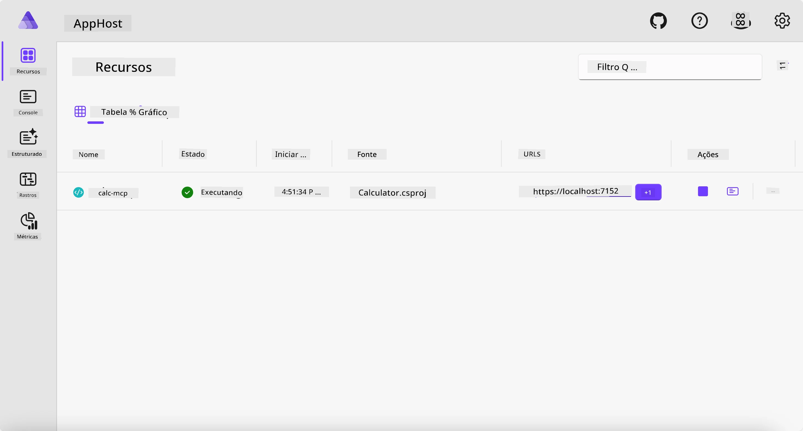
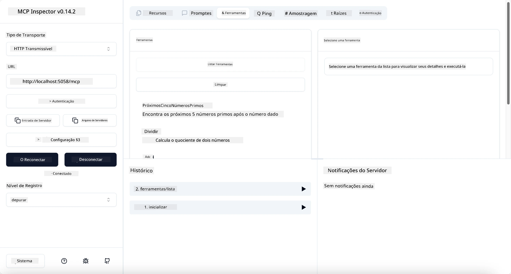
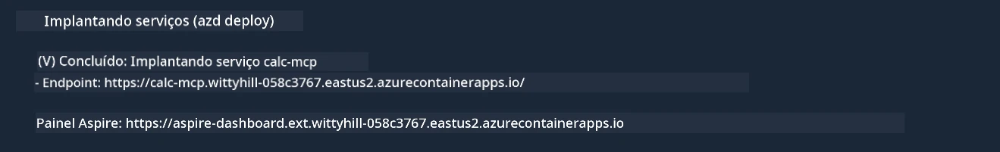

# Exemplo

O exemplo anterior mostra como usar um projeto local .NET com o tipo `stdio`. E como executar o servidor localmente em um contêiner. Essa é uma boa solução em muitas situações. No entanto, pode ser útil ter o servidor rodando remotamente, como em um ambiente na nuvem. É aí que o tipo `http` entra.

Olhando para a solução na pasta `04-PracticalImplementation`, pode parecer muito mais complexa do que a anterior. Mas, na realidade, não é. Se você olhar de perto o projeto `src/Calculator`, verá que é basicamente o mesmo código do exemplo anterior. A única diferença é que estamos usando uma biblioteca diferente, `ModelContextProtocol.AspNetCore`, para lidar com as requisições HTTP. E alteramos o método `IsPrime` para torná-lo privado, apenas para mostrar que você pode ter métodos privados no seu código. O resto do código é igual ao de antes.

Os outros projetos são do [Aspire](https://aspire.dev/get-started/what-is-aspire/). Ter o Aspire na solução melhora a experiência do desenvolvedor durante o desenvolvimento e testes e ajuda na observabilidade. Não é obrigatório para rodar o servidor, mas é uma boa prática tê-lo na sua solução.

## Inicie o servidor localmente

1. No VS Code (com a extensão C# DevKit), navegue até o diretório `04-PracticalImplementation/samples/csharp`.
1. Execute o seguinte comando para iniciar o servidor:

   ```bash
    dotnet watch run --project ./src/AppHost
   ```

1. Quando um navegador abrir o painel do Aspire, observe a URL `http`. Deve ser algo como `http://localhost:5058/`.

   

## Teste o Streamable HTTP com o MCP Inspector

Se você tem o Node.js 22.7.5 ou superior, pode usar o MCP Inspector para testar seu servidor.

Inicie o servidor e execute o seguinte comando em um terminal:

```bash
npx @modelcontextprotocol/inspector http://localhost:5058
```



- Selecione `Streamable HTTP` como o tipo de Transporte.
- No campo URL, insira a URL do servidor anotada anteriormente, e adicione `/mcp`. Deve ser `http` (não `https`) algo como `http://localhost:5058/mcp`.
- clique no botão Conectar.

Uma coisa boa do Inspector é que ele oferece uma boa visibilidade do que está acontecendo.

- Tente listar as ferramentas disponíveis
- Experimente algumas delas, deve funcionar igual ao antes.

## Teste o Servidor MCP com GitHub Copilot Chat no VS Code

Para usar o transporte Streamable HTTP com GitHub Copilot Chat, altere a configuração do servidor `calc-mcp` criado anteriormente para ficar assim:

```jsonc
// .vscode/mcp.json
{
  "servers": {
    "calc-mcp": {
      "type": "http",
      "url": "http://localhost:5058/mcp"
    }
  }
}
```

Faça alguns testes:

- Peça por "3 números primos após 6780". Note como o Copilot usará as novas ferramentas `NextFivePrimeNumbers` e retornará apenas os primeiros 3 números primos.
- Peça por "7 números primos após 111", para ver o que acontece.
- Peça por "John tem 24 pirulitos e quer distribuí-los igualmente para seus 3 filhos. Quantos pirulitos cada filho recebe?", para ver o que acontece.

## Faça o deploy do servidor para Azure

Vamos publicar o servidor no Azure para que mais pessoas possam usá-lo.

Em um terminal, navegue até a pasta `04-PracticalImplementation/samples/csharp` e execute o seguinte comando:

```bash
azd up
```

Quando o deploy for concluído, você verá uma mensagem semelhante a esta:



Copie a URL e use-a no MCP Inspector e no GitHub Copilot Chat.

```jsonc
// .vscode/mcp.json
{
  "servers": {
    "calc-mcp": {
      "type": "http",
      "url": "https://calc-mcp.gentleriver-3977fbcf.australiaeast.azurecontainerapps.io/mcp"
    }
  }
}
```

## E agora?

Tentamos diferentes tipos de transporte e ferramentas de teste. Também publicamos seu servidor MCP no Azure. Mas e se nosso servidor precisar acessar recursos privados? Por exemplo, um banco de dados ou uma API privada? No próximo capítulo, veremos como podemos melhorar a segurança do nosso servidor.

---

<!-- CO-OP TRANSLATOR DISCLAIMER START -->
**Aviso Legal**:
Este documento foi traduzido usando o serviço de tradução por IA [Co-op Translator](https://github.com/Azure/co-op-translator). Embora nos esforcemos pela precisão, por favor, esteja ciente de que traduções automatizadas podem conter erros ou imprecisões. O documento original em seu idioma nativo deve ser considerado a fonte autorizada. Para informações críticas, recomenda-se tradução profissional humana. Não nos responsabilizamos por quaisquer mal-entendidos ou interpretações incorretas decorrentes do uso desta tradução.
<!-- CO-OP TRANSLATOR DISCLAIMER END -->