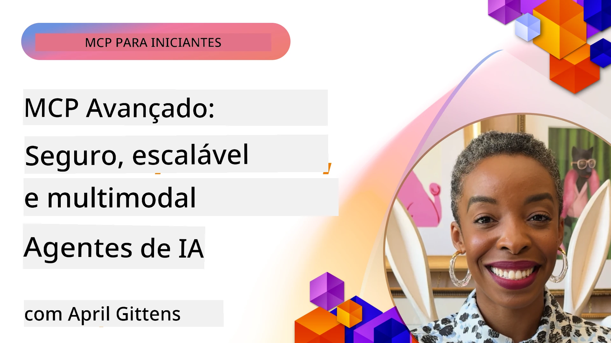

# Tópicos Avançados em MCP

_(Clique na imagem acima para assistir ao vídeo desta aula)_

Este capítulo aborda uma série de tópicos avançados na implementação do Protocolo de Contexto de Modelo (MCP), incluindo integração multimodal, escalabilidade, melhores práticas de segurança e integração corporativa. Esses tópicos são cruciais para construir aplicações MCP robustas e prontas para produção que atendam às demandas dos sistemas de IA modernos.

## Visão geral

Esta aula explora conceitos avançados na implementação do Protocolo de Contexto de Modelo, com foco na integração multimodal, escalabilidade, melhores práticas de segurança e integração corporativa. Esses tópicos são essenciais para construir aplicações MCP de nível de produção capazes de lidar com requisitos complexos em ambientes corporativos.

> **Nota da especificação atual:** O MCP `2026-07-28` descontinua as primitivas Roots e
> Sampling abordadas nas aulas 5.4 e 5.6. Também move o
> recurso experimental Tasks referenciado em Features do Protocolo (5.16) para uma
> extensão dedicada de Tasks. Essas aulas são mantidas para implementações legadas `2025-11-25`
> e incluem orientações de migração. Veja
> [O que mudou no MCP: A especificação 2026-07-28](../01-CoreConcepts/mcp-2026-07-28.md).

## Objetivos de aprendizagem

Ao final desta aula, você será capaz de:

- Implementar capacidades multimodais dentro de frameworks MCP
- Projetar arquiteturas MCP escaláveis para cenários de alta demanda
- Aplicar as melhores práticas de segurança alinhadas aos princípios de segurança do MCP
- Integrar MCP com sistemas e frameworks corporativos de IA
- Otimizar desempenho e confiabilidade em ambientes de produção

## Aulas e Projetos de exemplo

| Link | Título | Descrição |
|------|-------|-------------|
| [5.1 Integração com Azure](./mcp-integration/README.md) | Integração com Azure | Aprenda como integrar seu Servidor MCP no Azure |
| [5.2 Exemplo multimodal](./mcp-multi-modality/README.md) | Exemplos MCP multimodais  | Exemplos para respostas multimodais de áudio, imagem e multimodal |
| [5.3 Exemplo OAuth2 do MCP](../../../05-AdvancedTopics/mcp-oauth2-demo) | Demonstração MCP OAuth2 | Aplicação minimalista Spring Boot mostrando OAuth2 com MCP, atuando como Servidor de Autorização e Recurso. Demonstra emissão segura de tokens, endpoints protegidos, implantação no Azure Container Apps e integração com API Management. |
| [5.4 Contextos Raiz](./mcp-root-contexts/README.md) | Contextos raiz  | Aprenda a primitiva legada `2025-11-25` Roots e opções atuais de migração (descontinuada em `2026-07-28`) |
| [5.5 Roteamento](./mcp-routing/README.md) | Roteamento | Aprenda sobre diferentes tipos de roteamento |
| [5.6 Amostragem](./mcp-sampling/README.md) | Amostragem | Aprenda a primitiva legada `2025-11-25` Sampling e opções atuais de migração (descontinuada em `2026-07-28`) |
| [5.7 Escalonamento](./mcp-scaling/README.md) | Escalonamento  | Aprenda sobre escalonamento |
| [5.8 Segurança](./mcp-security/README.md) | Segurança  | Garanta a segurança do seu Servidor MCP |
| [5.9 Exemplo de Busca Web](./web-search-mcp/README.md) | Busca Web MCP | Servidor e cliente MCP Python integrando com SerpAPI para busca em tempo real na web, notícias, produtos e Q&A. Demonstra orquestração multi-ferramentas, integração de APIs externas e tratamento robusto de erros. |
| [5.10 Streaming em Tempo Real](./mcp-realtimestreaming/README.md) | Streaming  | Streaming de dados em tempo real tornou-se essencial no mundo atual movido a dados, onde empresas e aplicações exigem acesso imediato à informação para tomada de decisões oportunas.|
| [5.11 Busca Web em Tempo Real](./mcp-realtimesearch/README.md) | Busca Web | Como o MCP transforma a busca web em tempo real fornecendo uma abordagem padronizada para o gerenciamento de contexto entre modelos de IA, mecanismos de busca e aplicações.|
| [5.12 Autenticação Entra ID para Servidores de Protocolo de Contexto de Modelo](./mcp-security-entra/README.md) | Autenticação Entra ID | Microsoft Entra ID oferece uma solução robusta de identidade e gerenciamento de acesso na nuvem, ajudando a garantir que apenas usuários e aplicações autorizados possam interagir com seu servidor MCP.|
| [5.13 Integração com Agente Microsoft Foundry](./mcp-foundry-agent-integration/README.md) | Integração Microsoft Foundry | Aprenda a integrar servidores MCP com agentes Microsoft Foundry, possibilitando poderosa orquestração de ferramentas e capacidades corporativas de IA com conexões padronizadas a fontes de dados externas.|
| [5.14 Engenharia de Contexto](./mcp-contextengineering/README.md) | Engenharia de Contexto | A futura oportunidade das técnicas de engenharia de contexto para servidores MCP, incluindo otimização de contexto, gestão de contexto dinâmica e estratégias para engenharia eficaz de prompts dentro de frameworks MCP.|
| [5.15 Transporte Personalizado MCP](./mcp-transport/README.md) | Transporte Personalizado | Aprenda a implementar mecanismos de transporte personalizados para cenários especializados de comunicação MCP.|
| [5.16 Exploração Profunda das Features do Protocolo](./mcp-protocol-features/README.md) | Features do Protocolo | Domine recursos avançados do protocolo, incluindo notificações de progresso, cancelamento de requisições, templates de recursos e padrões de tratamento de erros.|
| [5.17 Raciocínio Multi-Agente Adversarial](./mcp-adversarial-agents/README.md) | Agentes Adversariais | Use dois agentes com posições opostas, compartilhando um único conjunto de ferramentas MCP, para identificar alucinações, expor casos limites e produzir resultados melhor calibrados através de debates estruturados.|

> **Nota histórica `2025-11-25`:** aquela revisão introduziu Tasks experimentais
> e expandiu vários recursos do protocolo. Em `2026-07-28`, Tasks passou a
> uma extensão oficial e Roots foi descontinuada. Não use o
> status de recurso de `2025-11-25` como orientação atual; veja o
> [changelog 2026-07-28](https://modelcontextprotocol.io/specification/2026-07-28/changelog).

## Referências adicionais

Para informações mais atualizadas sobre tópicos avançados de MCP, consulte:
- [Documentação MCP](https://modelcontextprotocol.io/)
- [Especificação MCP (2026-07-28)](https://modelcontextprotocol.io/specification/2026-07-28/)
- [Repositório GitHub](https://github.com/modelcontextprotocol)
- [OWASP MCP Top 10](https://microsoft.github.io/mcp-azure-security-guide/mcp/) - Riscos e mitigações de segurança
- [Workshop MCP Security Summit (Sherpa)](https://azure-samples.github.io/sherpa/) - Treinamento prático de segurança

## Principais conclusões

- Implementações MCP multimodais ampliam capacidades de IA além do processamento de texto
- Escalabilidade é essencial para implantações corporativas e pode ser abordada via escalonamento horizontal e vertical
- Medidas abrangentes de segurança protegem dados e garantem controle de acesso adequado
- Integração corporativa com plataformas como Azure OpenAI e Microsoft AI Foundry aprimora as capacidades MCP
- Implementações avançadas de MCP beneficiam-se de arquiteturas otimizadas e gestão cuidadosa de recursos

## Exercício

Projete uma implementação MCP em nível empresarial para um caso de uso específico:

1. Identifique os requisitos multimodais para seu caso de uso
2. Delineie os controles de segurança necessários para proteger dados sensíveis
3. Projete uma arquitetura escalável que possa lidar com cargas variáveis
4. Planeje pontos de integração com sistemas corporativos de IA
5. Documente potenciais gargalos de desempenho e estratégias de mitigação

## Recursos Adicionais

- [Documentação Azure OpenAI](https://learn.microsoft.com/en-us/azure/ai-services/openai/)
- [Documentação Microsoft AI Foundry](https://learn.microsoft.com/en-us/ai-services/)

---

## Próximos passos

Explore as aulas deste módulo começando por: [5.1 Integração MCP](./mcp-integration/README.md)

Após completar este módulo, continue para: [Módulo 6: Contribuições da Comunidade](../06-CommunityContributions/README.md)

---

<!-- CO-OP TRANSLATOR DISCLAIMER START -->
**Aviso Legal**:
Este documento foi traduzido usando o serviço de tradução por IA [Co-op Translator](https://github.com/Azure/co-op-translator). Embora nos esforcemos pela precisão, por favor, esteja ciente de que traduções automatizadas podem conter erros ou imprecisões. O documento original em seu idioma nativo deve ser considerado a fonte autorizada. Para informações críticas, recomenda-se tradução profissional humana. Não nos responsabilizamos por quaisquer mal-entendidos ou interpretações incorretas decorrentes do uso desta tradução.
<!-- CO-OP TRANSLATOR DISCLAIMER END -->