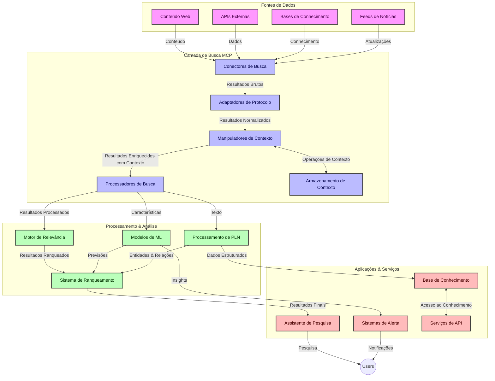
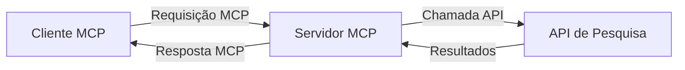
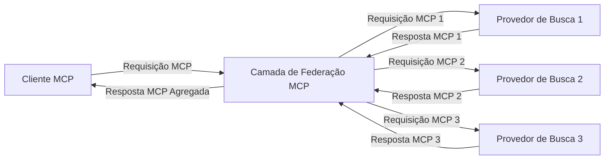
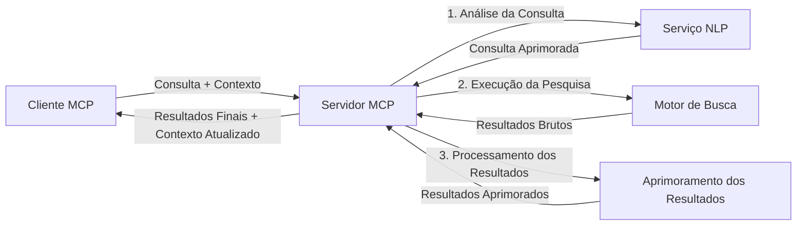

# Protocolo de Contexto de Modelo para Pesquisa Web em Tempo Real

## Visão Geral

A pesquisa web em tempo real tornou-se essencial no ambiente atual movido pela informação, onde aplicações precisam de acesso imediato a informações atualizadas na internet para fornecer respostas relevantes e oportunas. O Protocolo de Contexto de Modelo (MCP) representa um avanço significativo na otimização desses processos de busca em tempo real, melhorando a eficiência da busca, mantendo a integridade contextual e aprimorando o desempenho geral do sistema.

Este módulo explora como o MCP transforma a pesquisa web em tempo real ao fornecer uma abordagem padronizada para o gerenciamento de contexto entre modelos de IA, motores de busca e aplicações.

### O que Você Vai Aprender

Neste guia abrangente, você descobrirá:

- Como o MCP cria uma ponte contínua entre modelos de IA e capacidades de busca web em tempo real
- Padrões arquiteturais para implementação de soluções de busca eficientes e escaláveis com MCP
- Técnicas para preservar o contexto da busca em várias consultas e interações
- Implementações práticas de código em Python e JavaScript para diversos cenários de busca
- Métodos para equilibrar relevância, atualidade e desempenho em sistemas de busca com MCP

## Introdução à Pesquisa Web em Tempo Real

A pesquisa web em tempo real é uma abordagem tecnológica que possibilita consultas, processamento e análise contínuos de informações baseadas na web conforme são publicadas ou atualizadas, permitindo que os sistemas forneçam informações frescas e relevantes com baixa latência. Diferentemente dos sistemas tradicionais que operam sobre dados indexados que podem estar desatualizados em horas ou dias, a pesquisa em tempo real processa dados vivos da web, entregando insights e informações que refletem o estado atual do conteúdo online.

### Conceitos Fundamentais da Pesquisa Web em Tempo Real:

- **Processamento Contínuo de Consultas**: Consultas são processadas contra fontes de dados constantemente atualizadas
- **Prioridade para Atualidade**: Sistemas são projetados para priorizar informações recentes
- **Equilíbrio de Relevância**: Mantendo o equilíbrio entre relevância e atualidade
- **Arquitetura Escalável**: Sistemas devem lidar com cargas variáveis de consultas e volumes de dados
- **Entendimento Contextual**: Manter o contexto do usuário através de iterações de busca é crucial para resultados significativos
- **Reformulações Dinâmicas de Consultas**: Modificação adaptativa das consultas baseada no contexto e resultados anteriores
- **Integração Multifonte**: Combinando resultados de múltiplos provedores e fontes web
- **Compreensão Semântica**: Processamento de consultas e conteúdo baseado em significado, e não apenas palavras-chave
- **Classificação em Tempo Real**: Ajuste contínuo da classificação dos resultados conforme novas informações são disponibilizadas

### O Protocolo de Contexto de Modelo e a Pesquisa Web em Tempo Real

O Protocolo de Contexto de Modelo (MCP) aborda vários desafios críticos em ambientes de pesquisa web em tempo real:

1. **Preservação do Contexto de Busca**: O MCP padroniza como o contexto é mantido entre os componentes distribuídos da busca, garantindo que modelos de IA e nós de processamento tenham acesso ao histórico relevante da consulta e preferências do usuário.

2. **Gerenciamento Eficiente de Consultas**: Ao fornecer mecanismos estruturados para a transmissão do contexto, o MCP reduz o overhead de repetir o contexto em cada iteração de busca.

3. **Interoperabilidade**: O MCP cria uma linguagem comum para o compartilhamento de contexto entre tecnologias diversas de busca e modelos de IA, permitindo arquiteturas mais flexíveis e extensíveis.

4. **Contexto Otimizado para Busca**: Implementações do MCP podem priorizar quais elementos do contexto são mais relevantes para uma busca eficaz, otimizando tanto o desempenho quanto a precisão.

5. **Processamento Adaptativo de Busca**: Com o gerenciamento adequado do contexto por meio do MCP, sistemas de busca podem ajustar dinamicamente o processamento baseado nas necessidades do usuário e nos cenários de informação em evolução.

Em aplicações modernas, desde agregadores de notícias até assistentes de pesquisa, a integração do MCP com tecnologias de busca web possibilita uma busca mais inteligente, com consciência contextual, que pode fornecer resultados cada vez mais relevantes conforme as interações do usuário progridem.

## Objetivos de Aprendizagem

Ao final desta lição, você será capaz de:

- Compreender os fundamentos da pesquisa web em tempo real e seus desafios nas aplicações modernas
- Explicar como o Protocolo de Contexto de Modelo (MCP) melhora as capacidades de pesquisa web em tempo real
- Implementar soluções de busca baseadas em MCP usando frameworks e APIs populares
- Projetar e implantar arquiteturas de busca escaláveis e de alto desempenho com MCP
- Aplicar conceitos do MCP em diversos casos de uso, incluindo busca semântica, assistência em pesquisa e navegação aumentada por IA
- Avaliar tendências emergentes e futuras inovações em tecnologias de busca baseadas em MCP
- Desenvolver sistemas de busca com consciência contextual que aprendem com as interações do usuário
- Integrar capacidades de busca web em assistentes de IA usando protocolos padronizados do MCP
- Criar pipelines de busca em múltiplas etapas que refinam progressivamente os resultados com base no contexto
- Otimizar o desempenho da busca mantendo ampla consciência contextual

### Definição e Significado

A pesquisa web em tempo real envolve a consulta, recuperação e entrega contínua de informações baseadas na web com latência mínima. Diferente dos motores de busca tradicionais que periodicamente rastreiam e indexam a web, a busca em tempo real visa trazer informações assim que ficam disponíveis, possibilitando acesso imediato ao conteúdo mais atual.

As principais características da pesquisa web em tempo real incluem:

- **Atualidade**: Priorização de conteúdo e atualizações recentes
- **Processamento Contínuo**: Monitoramento constante por novas informações
- **Adaptação de Consultas**: Refinamento das consultas com base no contexto e feedback
- **Entrega Imediata**: Fornecimento dos resultados de busca com atraso mínimo
- **Retenção de Contexto**: Construção a partir de consultas anteriores para melhorar relevância

### Desafios na Pesquisa Web Tradicional

As abordagens tradicionais para pesquisa web enfrentam várias limitações quando aplicadas a cenários de tempo real:

1. **Fragmentação de Contexto**: Dificuldade de manter o contexto da busca em múltiplas consultas
2. **Atualidade da Informação**: Desafios para acessar e priorizar as informações mais recentes
3. **Complexidade de Integração**: Problemas de interoperabilidade entre sistemas de busca e aplicações
4. **Problemas de Latência**: Equilibrar uma busca abrangente com exigências de tempo de resposta
5. **Ajuste de Relevância**: Garantir precisão e relevância enquanto prioriza a atualidade

## Entendendo o Protocolo de Contexto de Modelo (MCP) para Busca

### O Que é MCP em Contextos de Busca?

O Protocolo de Contexto de Modelo (MCP) é um protocolo de comunicação padronizado projetado para facilitar a interação eficiente entre modelos de IA e aplicações. No contexto da pesquisa web em tempo real, o MCP fornece uma estrutura para:

- Preservar o contexto da busca ao longo das sequências de consultas
- Padronizar os formatos de consulta e resultados da busca
- Otimizar a transmissão de parâmetros e resultados da busca
- Aprimorar a comunicação entre modelo e motor de busca

### Componentes Centrais e Arquitetura

A arquitetura MCP para pesquisa web em tempo real consiste em vários componentes-chave:

1. **Gerenciadores de Contexto de Consulta**: Gerenciam e mantêm o contexto da busca entre várias consultas
2. **Processadores de Busca**: Processam requisições de busca entrantes usando técnicas cientes do contexto
3. **Adaptadores de Protocolo**: Convertem entre diferentes APIs de busca preservando o contexto
4. **Armazenamento de Contexto**: Armazena e recupera eficientemente histórico de busca e preferências
5. **Conectores de Busca**: Conectam-se a diversos motores de busca e APIs web



### Como o MCP Melhora a Pesquisa Web em Tempo Real

O MCP enfrenta os desafios da busca web tradicional por meio de:

- **Continuidade Contextual**: Mantendo relações entre consultas durante toda a sessão de busca
- **Transmissão Otimizada**: Reduzindo redundância nos parâmetros de busca através de gerenciamento inteligente do contexto
- **Interfaces Padronizadas**: Fornecendo APIs consistentes para componentes de busca
- **Latência Reduzida**: Minimização do overhead de processamento por meio do manejo eficiente do contexto
- **Relevância Aprimorada**: Melhorando a relevância da busca preservando a intenção do usuário em múltiplas consultas

## Integração e Implementação

Sistemas de busca web em tempo real exigem projeto arquitetural cuidadoso e implementação para manter tanto o desempenho quanto a integridade contextual. O Protocolo de Contexto de Modelo oferece uma abordagem padronizada para integrar modelos de IA e tecnologias de busca, permitindo pipelines de busca mais sofisticados e conscientes do contexto.

### Visão Geral da Integração MCP em Arquiteturas de Busca

A implementação do MCP em ambientes de busca web em tempo real envolve várias considerações-chave:

1. **Serialização do Contexto da Busca**: O MCP fornece mecanismos eficientes para codificar informações contextuais dentro de requisições de busca, garantindo que o contexto essencial acompanhe a consulta durante todo o pipeline de processamento. Isso inclui formatos de serialização padronizados otimizados para metadados relacionados à busca.

2. **Processamento Stateful da Busca**: O MCP possibilita um processamento mais inteligente e com estado, mantendo representação consistente de contexto através das iterações de busca. Isso é especialmente valioso em pipelines de busca de múltiplas etapas onde o refinamento do contexto melhora os resultados.

3. **Expansão e Refinamento de Consultas**: Implementações do MCP em sistemas de busca podem facilitar expansão e refinamento sofisticados da consulta baseado no contexto acumulado, permitindo resultados cada vez mais relevantes conforme a sessão de busca avança.

4. **Cache e Prioritização de Resultados**: Padronizando o manejo de contexto, o MCP ajuda a gerenciar cache e priorização dos resultados, permitindo que os componentes se adaptem conforme o contexto de busca evolui.

5. **Federação e Agregação de Busca**: O MCP facilita federação mais sofisticada da busca entre múltiplos backends ao fornecer representações estruturadas do contexto de busca, permitindo agregação mais significativa de resultados de fontes diversas.

A implementação do MCP em diversas tecnologias de busca cria uma abordagem unificada para gestão de contexto, reduzindo a necessidade de códigos de integração personalizados enquanto aprimora a capacidade do sistema de manter contexto significativo conforme as consultas evoluem.

### MCP em Diversas Implementações de Busca Web

Estes exemplos seguem a especificação MCP atual que foca em um protocolo baseado em JSON-RPC com mecanismos de transporte distintos. O código demonstra como você pode implementar integrações personalizadas de busca mantendo total compatibilidade com o protocolo MCP.


<details>
<summary>Implementação em Python com API de Busca Genérica</summary>

```python
import asyncio
import json
import aiohttp
from typing import Dict, Any, Optional, List
from contextlib import asynccontextmanager
from collections.abc import AsyncIterator

# Importar bibliotecas padrão do MCP
from mcp.client.session import ClientSession
from mcp.client.streamable_http import streamablehttp_client
from mcp.types import TextContent, CreateMessageRequestParams, CreateMessageResult
from mcp.server.fastmcp import FastMCP

# Criar um servidor FastMCP para busca na web
search_server = FastMCP("WebSearch")

# Classe para gerenciar operações de busca na web
class WebSearchHandler:
    def __init__(self, api_endpoint: str, api_key: str):
        self.api_endpoint = api_endpoint
        self.api_key = api_key
        self.session = None
        
    async def initialize(self):
        """Initialize the HTTP session"""
        self.session = aiohttp.ClientSession(
            headers={"Authorization": f"Bearer {self.api_key}"}
        )
    
    async def close(self):
        """Close the HTTP session"""
        if self.session:
            await self.session.close()
            
    async def perform_search(self, query: str, max_results: int = 5, 
                           include_domains: List[str] = None, 
                           exclude_domains: List[str] = None,
                           time_period: str = "any") -> Dict[str, Any]:
        """Perform web search using the search API"""
        # Construir parâmetros de busca
        search_params = {
            "q": query,
            "limit": max_results,
            "time": time_period
        }
        
        if include_domains:
            search_params["site"] = ",".join(include_domains)
            
        if exclude_domains:
            search_params["exclude_site"] = ",".join(exclude_domains)
        
        # Executar a requisição de busca
        try:
            async with self.session.get(
                self.api_endpoint,
                params=search_params
            ) as response:
                if response.status != 200:
                    error_text = await response.text()
                    raise Exception(f"Search API error: {response.status} - {error_text}")
                
                search_data = await response.json()
                
                # Transformar a resposta específica da API em um formato padrão
                results = []
                for item in search_data.get("results", []):
                    results.append({
                        "title": item.get("title", ""),
                        "url": item.get("url", ""),
                        "snippet": item.get("snippet", ""),
                        "date": item.get("published_date", ""),
                        "source": item.get("source", "")
                    })
                
                return {
                    "query": query,
                    "totalResults": len(results),
                    "results": results
                }
        except Exception as e:
            print(f"Search API request error: {e}")
            raise

# Inicializar o gerenciador de busca
search_handler = WebSearchHandler(
    api_endpoint="https://api.search-service.example/search",
    api_key="your-api-key-here"
)

# Configurar lifespan para gerenciar o gerenciador de busca
@asyncio.asynccontextmanager
async def app_lifespan(server: FastMCP):
    """Manage application lifecycle"""
    await search_handler.initialize()
    try:
        yield {"search_handler": search_handler}
    finally:
        await search_handler.close()

# Definir lifespan para o servidor
search_server = FastMCP("WebSearch", lifespan=app_lifespan)

# Registrar uma ferramenta de busca na web
@search_server.tool()
async def web_search(query: str, max_results: int = 5, 
                   include_domains: List[str] = None,
                   exclude_domains: List[str] = None,
                   time_period: str = "any") -> Dict[str, Any]:
    """
    Search the web for information
    
    Args:
        query: The search query
        max_results: Maximum number of results to return (default: 5)
        include_domains: List of domains to include in search results
        exclude_domains: List of domains to exclude from search results
        time_period: Time period for results ("day", "week", "month", "any")
        
    Returns:
        Dictionary containing search results
    """
    ctx = search_server.get_context()
    search_handler = ctx.request_context.lifespan_context["search_handler"]
    
    results = await search_handler.perform_search(
        query=query,
        max_results=max_results,
        include_domains=include_domains,
        exclude_domains=exclude_domains,
        time_period=time_period
    )
    
    return results

# Exemplo de uso do cliente
async def client_example():
    # Conectar ao servidor de busca usando transporte HTTP Streamable
    async with streamablehttp_client("http://localhost:8000/mcp") as (read, write, _):
        async with ClientSession(read, write) as session:
            # Inicializar a conexão
            await session.initialize()
            
            # Chamar a ferramenta de busca na web
            search_results = await session.call_tool(
                "web_search", 
                {
                    "query": "latest developments in AI and Model Context Protocol",
                    "max_results": 5,
                    "time_period": "day",
                    "include_domains": ["github.com", "microsoft.com"]
                }
            )
            
            print(f"Search results: {search_results}")

# Exemplo de execução do servidor
if __name__ == "__main__":
    # Executar o servidor com transporte HTTP Streamable
    search_server.run(transport="streamable-http")
```
</details> 

<details>
<summary>Implementação em JavaScript com Busca Baseada em Navegador</summary>


```javascript
// Implementação do servidor MCP para busca na web
import { McpServer, ResourceTemplate } from '@modelcontextprotocol/sdk/server/mcp.js';
import { StreamableHTTPServerTransport } from '@modelcontextprotocol/sdk/server/streamableHttp.js';
import { z } from 'zod';

// Criar um servidor MCP para busca na web
const searchServer = new McpServer({
    name: "BrowserSearch",
    description: "A server that provides web search capabilities"
});

// Classe de serviço de busca
class SearchService {
    constructor(searchApiUrl, apiKey) {
        this.searchApiUrl = searchApiUrl;
        this.apiKey = apiKey;
    }

    async performSearch(parameters) {
        const {
            query = '',
            maxResults = 5,
            includeDomains = [],
            excludeDomains = [],
            timePeriod = 'any'
        } = parameters;
        
        // Construir URL de busca com parâmetros
        const url = new URL(this.searchApiUrl);
        url.searchParams.append('q', query);
        url.searchParams.append('limit', maxResults);
        url.searchParams.append('time', timePeriod);
        
        if (includeDomains.length > 0) {
            url.searchParams.append('site', includeDomains.join(','));
        }
        
        if (excludeDomains.length > 0) {
            url.searchParams.append('exclude_site', excludeDomains.join(','));
        }
        
        try {
            const response = await fetch(url.toString(), {
                method: 'GET',
                headers: {
                    'Authorization': `Bearer ${this.apiKey}`,
                    'Content-Type': 'application/json'
                }
            });
            
            if (!response.ok) {
                const errorText = await response.text();
                throw new Error(`Search API error: ${response.status} - ${errorText}`);
            }
            
            const searchData = await response.json();
            
            // Transformar resposta específica da API para um formato padrão
            const results = searchData.results?.map(item => ({
                title: item.title || '',
                url: item.url || '',
                snippet: item.snippet || '',
                date: item.published_date || '',
                source: item.source || ''
            })) || [];
            
            return {
                query,
                totalResults: results.length,
                results
            };
        } catch (error) {
            console.error('Search API request error:', error);
            throw error;
        }
    }
}

// Inicializar o serviço de busca
const searchService = new SearchService(
    'https://api.search-service.example/search',
    'your-api-key-here'
);

// Configurar o provedor de contexto para o servidor
searchServer.setContextProvider(() => {
    return {
        searchService
    };
});

// Registrar a ferramenta de busca na web
searchServer.tool({
    name: 'web_search',
    description: 'Search the web for information',
    parameters: {
        type: 'object',
        properties: {
            query: {
                type: 'string',
                description: 'The search query'
            },
            maxResults: {
                type: 'integer',
                description: 'Maximum number of results to return',
                default: 5
            },
            includeDomains: {
                type: 'array',
                items: { type: 'string' },
                description: 'List of domains to include in search results'
            },
            excludeDomains: {
                type: 'array',
                items: { type: 'string' },
                description: 'List of domains to exclude from search results'
            },
            timePeriod: {
                type: 'string',
                description: 'Time period for results',
                enum: ['day', 'week', 'month', 'any'],
                default: 'any'
            }
        },
        required: ['query']
    },
    handler: async (params, context) => {
        const { searchService } = context;
        return await searchService.performSearch(params);
    }
});

// Código de exemplo do cliente para conectar ao servidor de busca
import { Client } from '@modelcontextprotocol/sdk/client/index.js';
import { StreamableHTTPClientTransport } from '@modelcontextprotocol/sdk/client/streamableHttp.js';

async function connectToSearchServer() {
    // Conectar ao servidor de busca
    const transport = new StreamableHTTPClientTransport(
        new URL('http://localhost:8000/mcp')
    );
    
    const client = new Client({
        name: 'search-client',
        version: '1.0.0'
    });
    
    await client.connect(transport);
    
    // Executar a ferramenta de busca
    const searchResults = await client.callTool({
        name: 'web_search',
        arguments: {
            query: 'Model Context Protocol implementation examples',
            maxResults: 10,
            timePeriod: 'week',
            includeDomains: ['github.com', 'docs.microsoft.com']
        }
    });
    
    console.log('Search results:', searchResults);
    
    // Limpeza
    await client.disconnect();
}

// Iniciar o servidor
const transport = new StreamableHTTPServerTransport();
await searchServer.connect(transport);
console.log('Search server running at http://localhost:8000/mcp');

// Em um processo separado ou após o servidor ser iniciado
// connectToSearchServer().catch(console.error);
```
</details> 


## Aviso sobre Exemplos de Código

> **Nota Importante**: Os exemplos de código abaixo demonstram a integração do Protocolo de Contexto de Modelo (MCP) com a funcionalidade de busca web. Embora sigam os padrões e estruturas dos SDKs oficiais do MCP, foram simplificados para fins educacionais.
> 
> Estes exemplos mostram:
> 
> 1. **Implementação em Python**: Uma implementação de servidor FastMCP que fornece uma ferramenta de busca web e conecta-se a uma API externa de busca. Este exemplo demonstra o gerenciamento correto de tempo de vida, manejo de contexto e implementação de ferramentas seguindo os padrões do [SDK oficial MCP Python](https://github.com/modelcontextprotocol/python-sdk). O servidor utiliza o transporte HTTP Streamable recomendado, que substituiu o antigo transporte SSE para implantações em produção.
> 
> 2. **Implementação em JavaScript**: Uma implementação em TypeScript/JavaScript usando o padrão FastMCP do [SDK oficial MCP TypeScript](https://github.com/modelcontextprotocol/typescript-sdk) para criar um servidor de busca com definições apropriadas de ferramentas e conexões de clientes. Segue os padrões mais recentes recomendados para gerenciamento de sessão e preservação de contexto.
> 
> Estes exemplos exigiriam tratamento adicional de erros, autenticação e código específico de integração da API para uso em produção. Os endpoints da API de busca mostrados (`https://api.search-service.example/search`) são espaços reservados e precisariam ser substituídos por endpoints reais dos serviços de busca.
> 
> Para detalhes completos de implementação e as abordagens mais atualizadas,
> consulte a [especificação oficial MCP](https://modelcontextprotocol.io/specification/2026-07-28/)
> e a documentação do SDK.

## Conceitos Fundamentais

### O Framework do Protocolo de Contexto de Modelo (MCP)

Na sua base, o Protocolo de Contexto de Modelo proporciona uma maneira padronizada para que modelos de IA, aplicações e serviços troquem contexto. Na pesquisa web em tempo real, este framework é essencial para criar experiências de busca coerentes e com múltiplas interações. Os principais componentes incluem:

1. **Arquitetura Cliente-Servidor**: O MCP estabelece uma clara separação entre clientes de busca (solicitantes) e servidores de busca (provedores), permitindo modelos de implantação flexíveis.

2. **Comunicação JSON-RPC**: O protocolo usa JSON-RPC para troca de mensagens, tornando-o compatível com tecnologias web e fácil de implementar em diferentes plataformas.

3. **Gerenciamento de Contexto**: O MCP define métodos estruturados para manter, atualizar e aproveitar o contexto da busca em múltiplas interações.

4. **Definições de Ferramentas**: As capacidades de busca são expostas como ferramentas padronizadas com parâmetros e valores de retorno bem definidos.

5. **Suporte a Streaming**: O protocolo suporta resultados em streaming, essencial para a busca em tempo real onde os resultados podem chegar progressivamente.

### Padrões de Integração de Busca Web

Ao integrar o MCP com a busca na web, surgem vários padrões:

#### 1. Integração Direta com Provedor de Busca



Neste padrão, o servidor MCP se conecta diretamente a uma ou mais APIs de busca, traduzindo requisições MCP em chamadas específicas da API e formatando os resultados como respostas MCP.

#### 2. Busca Federada com Preservação de Contexto



Este padrão distribui consultas de busca por múltiplos provedores compatíveis com MCP, cada um potencialmente especializado em diferentes tipos de conteúdo ou capacidades de busca, mantendo um contexto unificado.

#### 3. Cadeia de Busca Aprimorada com Contexto



Neste padrão, o processo de busca é dividido em múltiplas etapas, com o contexto sendo enriquecido a cada passo, resultando em resultados progressivamente mais relevantes.

### Componentes de Contexto de Busca

Na busca web baseada em MCP, o contexto geralmente inclui:

- **Histórico de Consultas**: Consultas anteriores na sessão
- **Preferências do Usuário**: Idioma, região, configurações de busca segura
- **Histórico de Interações**: Quais resultados foram clicados, tempo gasto nos resultados
- **Parâmetros de Busca**: Filtros, ordens de classificação e outros modificadores de busca
- **Conhecimento de Domínio**: Contexto específico do assunto relevante para a busca
- **Contexto Temporal**: Fatores de relevância baseados no tempo
- **Preferências de Fonte**: Fontes de informação confiáveis ou preferidas

## Casos de Uso e Aplicações

### Pesquisa e Coleta de Informações

O MCP aprimora fluxos de trabalho de pesquisa por:

- Preservar o contexto da pesquisa entre sessões de busca
- Possibilitar consultas mais sofisticadas e contextualmente relevantes
- Apoiar federação de busca multifonte
- Facilitar a extração de conhecimento a partir de resultados de busca

### Monitoramento de Notícias e Tendências em Tempo Real

A busca com MCP oferece vantagens para monitoramento de notícias:

- Descoberta quase em tempo real de notícias emergentes
- Filtragem contextual de informações relevantes
- Rastreamento de tópicos e entidades em múltiplas fontes
- Alertas personalizados de notícias baseados no contexto do usuário

### Navegação e Pesquisa Aumentadas por IA

O MCP cria novas possibilidades para navegação aumentada por IA:

- Sugestões de busca contextuais baseadas na atividade atual do navegador
- Integração perfeita da busca web com assistentes alimentados por LLMs
- Refinamento de busca em múltiplas interações com contexto mantido
- Verificação aprimorada de fatos e validação de informações

## Tendências e Inovações Futuras

### Evolução do MCP na Pesquisa Web

Olhando para o futuro, esperamos que o MCP evolua para abordar:


- **Busca Multimodal**: Integração de busca por texto, imagem, áudio e vídeo com contexto preservado
- **Busca Descentralizada**: Suporte a ecossistemas de busca distribuída e federada
- **Privacidade na Busca**: Mecanismos de busca que preservam a privacidade com consciência de contexto
- **Compreensão de Consultas**: Análise semântica profunda de consultas de busca em linguagem natural

### Avanços Potenciais em Tecnologia

Tecnologias emergentes que irão moldar o futuro da busca MCP:

1. **Arquiteturas de Busca Neural**: Sistemas de busca baseados em embeddings otimizados para MCP
2. **Contexto de Busca Personalizado**: Aprendizado de padrões individuais de busca dos usuários ao longo do tempo
3. **Integração com Grafos de Conhecimento**: Busca contextual aprimorada por grafos de conhecimento específicos de domínio
4. **Contexto Cross-Modal**: Manutenção do contexto entre diferentes modalidades de busca

## Exercícios Práticos

### Exercício 1: Configurando um Pipeline Básico de Busca MCP

Neste exercício, você aprenderá a:
- Configurar um ambiente básico de busca MCP
- Implementar manipuladores de contexto para busca web
- Testar e validar a preservação de contexto através das iterações de busca

### Exercício 2: Construindo um Assistente de Pesquisa com Busca MCP

Crie uma aplicação completa que:
- Processa perguntas de pesquisa em linguagem natural
- Realiza buscas na web com consciência de contexto
- Sintetiza informações de múltiplas fontes
- Apresenta resultados de pesquisa organizados

### Exercício 3: Implementando Federação de Busca Multi-Fonte com MCP

Exercício avançado cobrindo:
- Envio de consultas com consciência de contexto para múltiplos motores de busca
- Ranqueamento e agregação de resultados
- Deduplicação contextual dos resultados de busca
- Manipulação de metadados específicos de fonte

## Recursos Adicionais

- [Especificação do Protocolo Model Context](https://modelcontextprotocol.io/specification/2026-07-28/) - Especificação oficial do MCP e documentação detalhada do protocolo
- [Documentação do Protocolo Model Context](https://modelcontextprotocol.io/) - Tutoriais detalhados e guias de implementação
- [MCP Python SDK](https://github.com/modelcontextprotocol/python-sdk) - Implementação oficial em Python do protocolo MCP
- [MCP TypeScript SDK](https://github.com/modelcontextprotocol/typescript-sdk) - Implementação oficial em TypeScript do protocolo MCP
- [Servidores de Referência MCP](https://github.com/modelcontextprotocol/servers) - Implementações de referência de servidores MCP
- [Documentação da API Bing Web Search](https://learn.microsoft.com/en-us/bing/search-apis/bing-web-search/overview) - API de busca web da Microsoft
- [Google Custom Search JSON API](https://developers.google.com/custom-search/v1/overview) - Motor de busca programável do Google
- [Documentação SerpAPI](https://serpapi.com/search-api) - API para páginas de resultados de motores de busca
- [Documentação Meilisearch](https://www.meilisearch.com/docs) - Motor de busca open-source
- [Documentação Elasticsearch](https://www.elastic.co/guide/index.html) - Motor de busca e análise distribuído
- [Documentação LangChain](https://python.langchain.com/docs/get_started/introduction) - Construção de aplicações com LLMs

## Resultados de Aprendizagem

Ao completar este módulo, você será capaz de:

- Entender os fundamentos da busca web em tempo real e seus desafios
- Explicar como o Protocolo Model Context (MCP) aprimora as capacidades de busca web em tempo real
- Implementar soluções de busca baseadas em MCP usando frameworks e APIs populares
- Projetar e implementar arquiteturas de busca escaláveis e de alta performance com MCP
- Aplicar conceitos MCP em vários casos de uso incluindo busca semântica, assistência à pesquisa e navegação aumentada por IA
- Avaliar tendências emergentes e inovações futuras em tecnologias de busca baseadas em MCP


### Considerações sobre Confiança e Segurança

Ao implementar soluções de busca web baseadas em MCP, lembre-se destes princípios importantes da especificação MCP:

1. **Consentimento e Controle do Usuário**: Os usuários devem consentir explicitamente e compreender todo o acesso a dados e operações. Isso é especialmente importante para implementações de busca web que possam acessar fontes externas de dados.

2. **Privacidade de Dados**: Garanta o manuseio apropriado das consultas e resultados de busca, especialmente se contiverem informações sensíveis. Implemente controles de acesso adequados para proteger os dados dos usuários.

3. **Segurança das Ferramentas**: Implemente autorização e validação apropriadas para as ferramentas de busca, pois representam riscos potenciais de segurança por meio de execução arbitrária de código. Descrições do comportamento das ferramentas devem ser consideradas não confiáveis, a menos que obtidas de um servidor confiável.

4. **Documentação Clara**: Forneça documentação clara sobre as capacidades, limitações e considerações de segurança da sua implementação de busca baseada em MCP, seguindo as diretrizes da especificação MCP.

5. **Fluxos Robustos de Consentimento**: Construa fluxos robustos de consentimento e autorização que expliquem claramente o que cada ferramenta faz antes de autorizar seu uso, especialmente para ferramentas que interagem com recursos externos da web.

Para detalhes completos sobre segurança e considerações de confiança do MCP, consulte a
[documentação oficial](https://modelcontextprotocol.io/specification/2026-07-28/basic/security_best_practices).

## O que vem a seguir

- [5.12 Autenticação Entra ID para Servidores do Protocolo Model Context](../mcp-security-entra/README.md)

---

<!-- CO-OP TRANSLATOR DISCLAIMER START -->
**Aviso Legal**:
Este documento foi traduzido usando o serviço de tradução por IA [Co-op Translator](https://github.com/Azure/co-op-translator). Embora nos esforcemos pela precisão, por favor, esteja ciente de que traduções automatizadas podem conter erros ou imprecisões. O documento original em seu idioma nativo deve ser considerado a fonte autorizada. Para informações críticas, recomenda-se tradução profissional humana. Não nos responsabilizamos por quaisquer mal-entendidos ou interpretações incorretas decorrentes do uso desta tradução.
<!-- CO-OP TRANSLATOR DISCLAIMER END -->