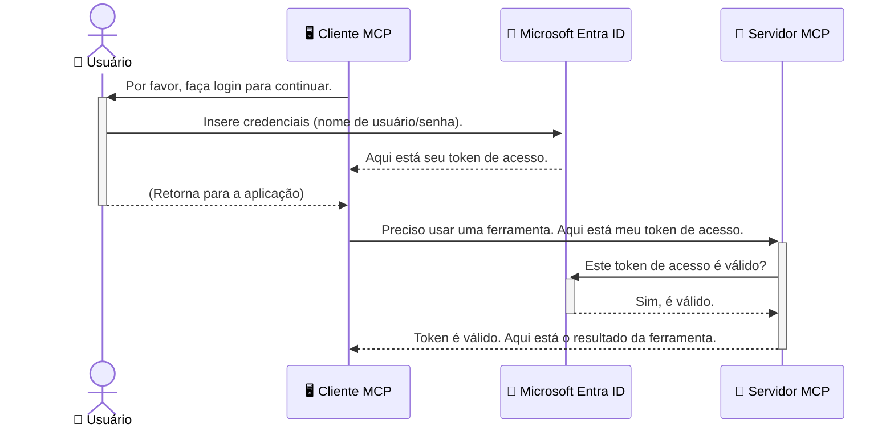

# Protegendo Fluxos de Trabalho de IA: Autenticação Entra ID para Servidores do Protocolo de Contexto do Modelo

> [!NOTE]
> O código do servidor remoto nesta lição protege os endpoints legados `/sse` e `/message`
> e visa o MCP `2025-11-25`. Mantenha suas práticas de validação de identidade e token,
> mas use um transporte HTTP Streamable compatível com `2026-07-28` para novas
> implementações.

## Introdução
Proteger seu servidor do Protocolo de Contexto do Modelo (MCP) é tão importante quanto trancar a porta da frente da sua casa. Deixar seu servidor MCP aberto expõe suas ferramentas e dados a acessos não autorizados, o que pode levar a falhas de segurança. O Microsoft Entra ID oferece uma solução robusta de gerenciamento de identidade e acesso baseada em nuvem, ajudando a garantir que somente usuários e aplicações autorizadas possam interagir com seu servidor MCP. Nesta seção, você aprenderá como proteger seus fluxos de trabalho de IA usando a autenticação Entra ID.

## Objetivos de Aprendizagem
Ao final desta seção, você será capaz de:

- Compreender a importância de proteger servidores MCP.
- Explicar os fundamentos do Microsoft Entra ID e da autenticação OAuth 2.0.
- Reconhecer a diferença entre clientes públicos e confidenciais.
- Implementar autenticação Entra ID tanto em cenários locais (cliente público) quanto remotos (cliente confidencial) para servidores MCP.
- Aplicar as melhores práticas de segurança ao desenvolver fluxos de trabalho de IA.

## Segurança e MCP

Assim como você não deixaria a porta da frente da sua casa destrancada, você não deve deixar seu servidor MCP aberto para acesso de qualquer pessoa. Proteger seus fluxos de trabalho de IA é essencial para construir aplicações robustas, confiáveis e seguras. Este capítulo irá apresentar o uso do Microsoft Entra ID para proteger seus servidores MCP, garantindo que somente usuários e aplicações autorizados possam interagir com suas ferramentas e dados.

## Por Que a Segurança é Importante para Servidores MCP

Imagine que seu servidor MCP possua uma ferramenta que pode enviar e-mails ou acessar um banco de dados de clientes. Um servidor não protegido significaria que qualquer pessoa poderia potencialmente usar essa ferramenta, levando a acessos não autorizados a dados, spam ou outras atividades maliciosas.

Ao implementar autenticação, você garante que cada solicitação ao seu servidor seja verificada, confirmando a identidade do usuário ou aplicação que faz a requisição. Este é o primeiro e mais crítico passo para proteger seus fluxos de trabalho de IA.

## Introdução ao Microsoft Entra ID

[**Microsoft Entra ID**](https://adoption.microsoft.com/microsoft-security/entra/) é um serviço baseado em nuvem para gerenciamento de identidade e acesso. Pense nele como um segurança universal para suas aplicações. Ele lida com o processo complexo de verificar identidades de usuários (autenticação) e determinar o que eles podem fazer (autorização).

Ao usar o Entra ID, você pode:

- Habilitar login seguro para usuários.
- Proteger APIs e serviços.
- Gerenciar políticas de acesso a partir de um local central.

Para servidores MCP, o Entra ID oferece uma solução robusta e amplamente confiável para gerenciar quem pode acessar as funcionalidades do seu servidor.

---

## Entendendo a Magia: Como Funciona a Autenticação Entra ID

O Entra ID usa padrões abertos como **OAuth 2.0** para gerenciar a autenticação. Embora os detalhes possam ser complexos, o conceito principal é simples e pode ser entendido com uma analogia.

### Uma Introdução Suave ao OAuth 2.0: A Chave-Valet

Pense em OAuth 2.0 como um serviço de valet para seu carro. Quando você chega a um restaurante, você não entrega sua chave mestra ao valet. Em vez disso, fornece uma **chave-valet** que tem permissões limitadas — ela pode ligar o carro e trancar as portas, mas não pode abrir o porta-malas ou o porta-luvas.

Nesta analogia:

- **Você** é o **Usuário**.
- **Seu carro** é o **Servidor MCP** com suas valiosas ferramentas e dados.
- O **Valet** é o **Microsoft Entra ID**.
- O **Atendente de Estacionamento** é o **Cliente MCP** (a aplicação tentando acessar o servidor).
- A **Chave-Valet** é o **Token de Acesso**.

O token de acesso é uma cadeia segura de texto que o cliente MCP recebe do Entra ID após você fazer login. O cliente então apresenta este token ao servidor MCP a cada requisição. O servidor pode verificar o token para assegurar que a solicitação é legítima e que o cliente tem as permissões necessárias, tudo isso sem precisar manusear suas credenciais reais (como sua senha).

### O Fluxo de Autenticação

Veja como o processo funciona na prática:



### Apresentando a Microsoft Authentication Library (MSAL)

Antes de entrarmos no código, é importante apresentar um componente-chave que você verá nos exemplos: a **Microsoft Authentication Library (MSAL)**.

MSAL é uma biblioteca desenvolvida pela Microsoft que facilita muito o trabalho dos desenvolvedores para lidar com autenticação. Em vez de você escrever todo o código complexo para manipular tokens de segurança, gerenciar logins e renovar sessões, a MSAL cuida do trabalho pesado.

Usar uma biblioteca como a MSAL é altamente recomendado porque:

- **É Segura:** Implementa protocolos padrão da indústria e melhores práticas de segurança, reduzindo o risco de vulnerabilidades no seu código.
- **Simplifica o Desenvolvimento:** Abstrai a complexidade dos protocolos OAuth 2.0 e OpenID Connect, permitindo que você adicione autenticação robusta à sua aplicação com poucas linhas de código.
- **É Mantida:** A Microsoft mantém e atualiza ativamente a MSAL para responder a novas ameaças de segurança e mudanças de plataforma.

A MSAL suporta uma grande variedade de linguagens e frameworks de aplicação, incluindo .NET, JavaScript/TypeScript, Python, Java, Go, e plataformas móveis como iOS e Android. Isso significa que você pode usar os mesmos padrões de autenticação consistentes em toda sua pilha tecnológica.

Para aprender mais sobre a MSAL, você pode conferir a documentação oficial da [visão geral do MSAL](https://learn.microsoft.com/entra/identity-platform/msal-overview).

---

## Protegendo Seu Servidor MCP com Entra ID: Um Guia Passo a Passo

Agora, vamos percorrer como proteger um servidor MCP local (que se comunica via `stdio`) usando Entra ID. Este exemplo usa um **cliente público**, que é adequado para aplicações rodando na máquina do usuário, como um aplicativo desktop ou servidor local de desenvolvimento.

### Cenário 1: Protegendo um Servidor MCP Local (com Cliente Público)

Neste cenário, veremos um servidor MCP que roda localmente, se comunica via `stdio` e usa Entra ID para autenticar o usuário antes de permitir acesso às suas ferramentas. O servidor terá uma ferramenta única que busca informações do perfil do usuário na API Microsoft Graph.

#### 1. Configurando a Aplicação no Entra ID

Antes de escrever qualquer código, você precisa registrar sua aplicação no Microsoft Entra ID. Isso informa ao Entra ID sobre sua aplicação e concede permissão para usar o serviço de autenticação.

1. Navegue até o **[portal Microsoft Entra](https://entra.microsoft.com/)**.
2. Vá para **App registrations** e clique em **New registration**.
3. Dê um nome para sua aplicação (ex.: "Meu Servidor MCP Local").
4. Para **Supported account types**, selecione **Accounts in this organizational directory only**.
5. Você pode deixar o **Redirect URI** em branco para este exemplo.
6. Clique em **Register**.

Uma vez registrado, anote o **Application (client) ID** e o **Directory (tenant) ID**. Você precisará deles em seu código.

#### 2. O Código: Um Desdobramento

Vamos observar as partes principais do código que lidam com a autenticação. O código completo deste exemplo está disponível na pasta [Entra ID - Local - WAM](https://github.com/Azure-Samples/mcp-auth-servers/tree/main/src/entra-id-local-wam) do repositório [mcp-auth-servers GitHub](https://github.com/Azure-Samples/mcp-auth-servers).

**`AuthenticationService.cs`**

Esta classe é responsável por gerenciar a interação com o Entra ID.

- **`CreateAsync`**: Este método inicializa o `PublicClientApplication` da MSAL (Microsoft Authentication Library). É configurado com o `clientId` e `tenantId` da sua aplicação.
- **`WithBroker`**: Isto habilita o uso de um broker (como o Windows Web Account Manager), que proporciona uma experiência de single sign-on mais segura e fluida.
- **`AcquireTokenAsync`**: Este é o método central. Primeiro, tenta obter um token silenciosamente (significando que o usuário não precisará fazer login de novo se já tiver uma sessão válida). Se um token silencioso não puder ser obtido, ele solicitará que o usuário faça login interativamente.

```csharp
// Simplified for clarity
public static async Task<AuthenticationService> CreateAsync(ILogger<AuthenticationService> logger)
{
    var msalClient = PublicClientApplicationBuilder
        .Create(_clientId) // Your Application (client) ID
        .WithAuthority(AadAuthorityAudience.AzureAdMyOrg)
        .WithTenantId(_tenantId) // Your Directory (tenant) ID
        .WithBroker(new BrokerOptions(BrokerOptions.OperatingSystems.Windows))
        .Build();

    // ... cache registration ...

    return new AuthenticationService(logger, msalClient);
}

public async Task<string> AcquireTokenAsync()
{
    try
    {
        // Try silent authentication first
        var accounts = await _msalClient.GetAccountsAsync();
        var account = accounts.FirstOrDefault();

        AuthenticationResult? result = null;

        if (account != null)
        {
            result = await _msalClient.AcquireTokenSilent(_scopes, account).ExecuteAsync();
        }
        else
        {
            // If no account, or silent fails, go interactive
            result = await _msalClient.AcquireTokenInteractive(_scopes).ExecuteAsync();
        }

        return result.AccessToken;
    }
    catch (Exception ex)
    {
        _logger.LogError(ex, "An error occurred while acquiring the token.");
        throw; // Optionally rethrow the exception for higher-level handling
    }
}
```

**`Program.cs`**

Aqui é onde o servidor MCP é configurado e o serviço de autenticação é integrado.

- **`AddSingleton<AuthenticationService>`**: Isto registra o `AuthenticationService` no container de injeção de dependência, para que outras partes da aplicação possam usar (como nossa ferramenta).
- **Ferramenta `GetUserDetailsFromGraph`**: Esta ferramenta requer uma instância do `AuthenticationService`. Antes de fazer qualquer coisa, ela chama `authService.AcquireTokenAsync()` para obter um token de acesso válido. Se a autenticação for bem-sucedida, ela usa o token para chamar a API Microsoft Graph e buscar os detalhes do usuário.

```csharp
// Simplified for clarity
[McpServerTool(Name = "GetUserDetailsFromGraph")]
public static async Task<string> GetUserDetailsFromGraph(
    AuthenticationService authService)
{
    try
    {
        // This will trigger the authentication flow
        var accessToken = await authService.AcquireTokenAsync();

        // Use the token to create a GraphServiceClient
        var graphClient = new GraphServiceClient(
            new BaseBearerTokenAuthenticationProvider(new TokenProvider(authService)));

        var user = await graphClient.Me.GetAsync();

        return System.Text.Json.JsonSerializer.Serialize(user);
    }
    catch (Exception ex)
    {
        return $"Error: {ex.Message}";
    }
}
```

#### 3. Como Tudo Funciona em Conjunto

1. Quando o cliente MCP tenta usar a ferramenta `GetUserDetailsFromGraph`, a ferramenta primeiro chama `AcquireTokenAsync`.
2. `AcquireTokenAsync` aciona a biblioteca MSAL para verificar se existe um token válido.
3. Se nenhum token é encontrado, a MSAL, através do broker, solicitará que o usuário faça login com sua conta Entra ID.
4. Após o usuário se autenticar, o Entra ID emite um token de acesso.
5. A ferramenta recebe o token e o usa para fazer uma chamada segura à API Microsoft Graph.
6. Os detalhes do usuário são retornados ao cliente MCP.

Este processo garante que apenas usuários autenticados possam usar a ferramenta, protegendo efetivamente seu servidor MCP local.

### Cenário 2: Protegendo um Servidor MCP Remoto (com Cliente Confidencial)

Quando seu servidor MCP está rodando em uma máquina remota (como um servidor na nuvem) e se comunica por um protocolo como HTTP Streaming, os requisitos de segurança são diferentes. Nesse caso, você deve usar um **cliente confidencial** e o **Fluxo de Código de Autorização**. Este é um método mais seguro porque os segredos da aplicação nunca são expostos ao navegador.

Este exemplo usa um servidor MCP baseado em TypeScript que utiliza Express.js para lidar com requisições HTTP.

#### 1. Configurando a Aplicação no Entra ID

A configuração no Entra ID é similar à do cliente público, mas com uma diferença chave: você precisa criar um **segredo de cliente**.

1. Navegue até o **[portal Microsoft Entra](https://entra.microsoft.com/)**.
2. Na sua inscrição de aplicativo, vá para a aba **Certificates & secrets**.
3. Clique em **New client secret**, dê uma descrição e clique em **Add**.
4. **Importante:** Copie o valor do segredo imediatamente. Você não poderá vê-lo novamente.
5. Você também precisa configurar um **Redirect URI**. Vá para a aba **Authentication**, clique em **Add a platform**, selecione **Web**, e insira o URI de redirecionamento para sua aplicação (ex.: `http://localhost:3001/auth/callback`).

> **⚠️ Nota Importante de Segurança:** Para aplicações em produção, a Microsoft recomenda fortemente usar métodos de autenticação sem segredo, como **Managed Identity** ou **Workload Identity Federation**, em vez de segredos de cliente. Segredos de cliente apresentam riscos de segurança pois podem ser expostos ou comprometidos. Identidades gerenciadas oferecem uma abordagem mais segura eliminando a necessidade de armazenar credenciais em seu código ou configuração.
>
> Para mais informações sobre identidades gerenciadas e como implementá-las, consulte a [Visão geral das identidades gerenciadas para recursos Azure](https://learn.microsoft.com/entra/identity/managed-identities-azure-resources/overview).

#### 2. O Código: Um Desdobramento

Este exemplo usa uma abordagem baseada em sessão. Quando o usuário autentica, o servidor armazena o token de acesso e o token de atualização em uma sessão, e fornece ao usuário um token de sessão. Este token de sessão é então usado para requisições subsequentes. O código completo deste exemplo está disponível na pasta [Entra ID - Cliente confidencial](https://github.com/Azure-Samples/mcp-auth-servers/tree/main/src/entra-id-cca-session) do repositório [mcp-auth-servers GitHub](https://github.com/Azure-Samples/mcp-auth-servers).

**`Server.ts`**

Este arquivo configura o servidor Express e a camada de transporte MCP.

- **`requireBearerAuth`**: Este é um middleware que protege os endpoints `/sse` e `/message`. Ele verifica a presença de um token bearer válido no cabeçalho `Authorization` da requisição.
- **`EntraIdServerAuthProvider`**: Esta é uma classe personalizada que implementa a interface `McpServerAuthorizationProvider`. Ela é responsável por gerenciar o fluxo OAuth 2.0.
- **`/auth/callback`**: Este endpoint lida com o redirecionamento do Entra ID após o usuário se autenticar. Ele troca o código de autorização por um token de acesso e um token de atualização.

```typescript
// Simplificado para clareza
const app = express();
const { server } = createServer();
const provider = new EntraIdServerAuthProvider();

// Proteger o endpoint SSE
app.get("/sse", requireBearerAuth({
  provider,
  requiredScopes: ["User.Read"]
}), async (req, res) => {
  // ... conectar ao transporte ...
});

// Proteger o endpoint de mensagens
app.post("/message", requireBearerAuth({
  provider,
  requiredScopes: ["User.Read"]
}), async (req, res) => {
  // ... tratar a mensagem ...
});

// Tratar o callback do OAuth 2.0
app.get("/auth/callback", (req, res) => {
  provider.handleCallback(req.query.code, req.query.state)
    .then(result => {
      // ... tratar sucesso ou falha ...
    });
});
```

**`Tools.ts`**

Este arquivo define as ferramentas que o servidor MCP oferece. A ferramenta `getUserDetails` é semelhante à do exemplo anterior, mas obtém o token de acesso da sessão.

```typescript
// Simplificado para clareza
server.setRequestHandler(CallToolRequestSchema, async (request) => {
  const { name } = request.params;
  const context = request.params?.context as { token?: string } | undefined;
  const sessionToken = context?.token;

  if (name === ToolName.GET_USER_DETAILS) {
    if (!sessionToken) {
      throw new AuthenticationError("Authentication token is missing or invalid. Ensure the token is provided in the request context.");
    }

    // Obter o token Entra ID da sessão
    const tokenData = tokenStore.getToken(sessionToken);
    const entraIdToken = tokenData.accessToken;

    const graphClient = Client.init({
      authProvider: (done) => {
        done(null, entraIdToken);
      }
    });

    const user = await graphClient.api('/me').get();

    // ... retornar detalhes do usuário ...
  }
});
```

**`auth/EntraIdServerAuthProvider.ts`**

Esta classe gerencia a lógica para:

- Redirecionar o usuário para a página de login do Entra ID.
- Trocar o código de autorização por um token de acesso.
- Armazenar os tokens no `tokenStore`.
- Renovar o token de acesso quando expirar.


#### 3. Como Tudo Funciona Junto

1. Quando um usuário tenta se conectar pela primeira vez ao servidor MCP, o middleware `requireBearerAuth` verificará que ele não possui uma sessão válida e o redirecionará para a página de login do Entra ID.
2. O usuário faz login com sua conta do Entra ID.
3. O Entra ID redireciona o usuário de volta para o endpoint `/auth/callback` com um código de autorização.
4. O servidor troca o código por um token de acesso e um token de atualização, armazena-os e cria um token de sessão que é enviado ao cliente.
5. O cliente agora pode usar esse token de sessão no cabeçalho `Authorization` para todas as futuras requisições ao servidor MCP.
6. Quando a ferramenta `getUserDetails` é chamada, ela usa o token de sessão para localizar o token de acesso do Entra ID e, em seguida, usa esse token para chamar a API Microsoft Graph.

Esse fluxo é mais complexo que o fluxo de cliente público, mas é necessário para endpoints acessíveis pela internet. Como servidores MCP remotos são acessíveis pela internet pública, eles precisam de medidas de segurança mais fortes para proteger contra acessos não autorizados e possíveis ataques.


## Melhores Práticas de Segurança

- **Sempre use HTTPS**: Criptografe a comunicação entre cliente e servidor para proteger os tokens contra interceptação.
- **Implemente Controle de Acesso Baseado em Funções (RBAC)**: Não verifique apenas *se* um usuário está autenticado; verifique *o que* ele está autorizado a fazer. Você pode definir funções no Entra ID e verificá-las no seu servidor MCP.
- **Monitore e audite**: Registre todos os eventos de autenticação para que você possa detectar e responder a atividades suspeitas.
- **Trate limitação e controle de taxa**: Microsoft Graph e outras APIs implementam limitação de taxa para evitar abusos. Implemente retorno exponencial e lógica de tentativas em seu servidor MCP para lidar graciosamente com respostas HTTP 429 (Muitas Solicitações). Considere armazenar dados frequentemente acessados em cache para reduzir chamadas de API.
- **Armazenamento seguro de tokens**: Armazene tokens de acesso e tokens de atualização de forma segura. Para aplicações locais, use os mecanismos de armazenamento seguro do sistema. Para aplicações servidoras, considere usar armazenamento criptografado ou serviços de gerenciamento de chaves seguros como Azure Key Vault.
- **Gerenciamento da expiração dos tokens**: Tokens de acesso possuem tempo de vida limitado. Implemente atualização automática de token usando tokens de atualização para manter uma experiência contínua do usuário sem exigir reautenticação.
- **Considere usar Azure API Management**: Embora implementar segurança diretamente no servidor MCP dê controle detalhado, gateways de API como Azure API Management podem tratar muitas dessas preocupações automaticamente, incluindo autenticação, autorização, limitação de taxa e monitoramento. Eles fornecem uma camada centralizada de segurança entre seus clientes e seus servidores MCP. Para mais detalhes sobre o uso de gateways de API com MCP, veja nosso [Azure API Management Your Auth Gateway For MCP Servers](https://techcommunity.microsoft.com/blog/integrationsonazureblog/azure-api-management-your-auth-gateway-for-mcp-servers/4402690).


## Pontos-Chave

- Proteger seu servidor MCP é crucial para proteger seus dados e ferramentas.
- O Microsoft Entra ID fornece uma solução robusta e escalável para autenticação e autorização.
- Use um **cliente público** para aplicações locais e um **cliente confidencial** para servidores remotos.
- O **Authorization Code Flow** é a opção mais segura para aplicações web.


## Exercício

1. Pense em um servidor MCP que você poderia construir. Seria um servidor local ou remoto?
2. Com base na sua resposta, você usaria um cliente público ou confidencial?
3. Qual permissão seu servidor MCP requisitaria para realizar ações contra o Microsoft Graph?


## Exercícios Práticos

### Exercício 1: Registrar uma Aplicação no Entra ID
Navegue até o portal Microsoft Entra.
Registre uma nova aplicação para seu servidor MCP.
Anote o ID da Aplicação (cliente) e o ID do Diretório (tenant).

### Exercício 2: Proteger um Servidor MCP Local (Cliente Público)
- Siga o exemplo de código para integrar o MSAL (Microsoft Authentication Library) para autenticação do usuário.
- Teste o fluxo de autenticação chamando a ferramenta MCP que obtém detalhes do usuário do Microsoft Graph.

### Exercício 3: Proteger um Servidor MCP Remoto (Cliente Confidencial)
- Registre um cliente confidencial no Entra ID e crie um segredo do cliente.
- Configure seu servidor MCP Express.js para usar o Authorization Code Flow.
- Teste os endpoints protegidos e confirme o acesso baseado em token.

### Exercício 4: Aplicar Melhores Práticas de Segurança
- Ative HTTPS para seu servidor local ou remoto.
- Implemente controle de acesso baseado em função (RBAC) na lógica do seu servidor.
- Adicione tratamento de expiração de token e armazenamento seguro de tokens.

## Recursos

1. **Documentação de Visão Geral do MSAL**  
   Aprenda como a Microsoft Authentication Library (MSAL) habilita a aquisição segura de tokens em múltiplas plataformas:  
   [MSAL Overview on Microsoft Learn](https://learn.microsoft.com/en-gb/entra/msal/overview)

2. **Repositório Azure-Samples/mcp-auth-servers no GitHub**  
   Implementações de referência de servidores MCP demonstrando fluxos de autenticação:  
   [Azure-Samples/mcp-auth-servers on GitHub](https://github.com/Azure-Samples/mcp-auth-servers)

3. **Visão Geral de Identidades Gerenciadas para Recursos Azure**  
   Entenda como eliminar segredos usando identidades gerenciadas de sistema ou de usuário:  
   [Managed Identities Overview on Microsoft Learn](https://learn.microsoft.com/en-us/entra/identity/managed-identities-azure-resources/)

4. **Azure API Management: Seu Gateway de Autenticação para Servidores MCP**  
   Uma análise aprofundada sobre o uso do APIM como gateway OAuth2 seguro para servidores MCP:  
   [Azure API Management Your Auth Gateway For MCP Servers](https://techcommunity.microsoft.com/blog/integrationsonazureblog/azure-api-management-your-auth-gateway-for-mcp-servers/4402690)

5. **Referência de Permissões do Microsoft Graph**  
   Lista abrangente de permissões delegadas e de aplicação para o Microsoft Graph:  
   [Microsoft Graph Permissions Reference](https://learn.microsoft.com/zh-tw/graph/permissions-reference)


## Resultados de Aprendizagem
Após concluir esta seção, você será capaz de:

- Explicar por que a autenticação é crítica para servidores MCP e fluxos de trabalho de IA.
- Configurar e configurar a autenticação Entra ID para cenários de servidores MCP locais e remotos.
- Escolher o tipo correto de cliente (público ou confidencial) com base na implantação do servidor.
- Implementar práticas seguras de codificação, incluindo armazenamento de tokens e autorização baseada em função.
- Proteger com confiança seu servidor MCP e suas ferramentas contra acessos não autorizados.

## O que vem a seguir

- [5.13 Modelo de Protocolo de Contexto (MCP) Integração com Microsoft Foundry](../mcp-foundry-agent-integration/README.md)

---

<!-- CO-OP TRANSLATOR DISCLAIMER START -->
**Aviso Legal**:
Este documento foi traduzido usando o serviço de tradução por IA [Co-op Translator](https://github.com/Azure/co-op-translator). Embora nos esforcemos pela precisão, por favor, esteja ciente de que traduções automatizadas podem conter erros ou imprecisões. O documento original em seu idioma nativo deve ser considerado a fonte autorizada. Para informações críticas, recomenda-se tradução profissional humana. Não nos responsabilizamos por quaisquer mal-entendidos ou interpretações incorretas decorrentes do uso desta tradução.
<!-- CO-OP TRANSLATOR DISCLAIMER END -->