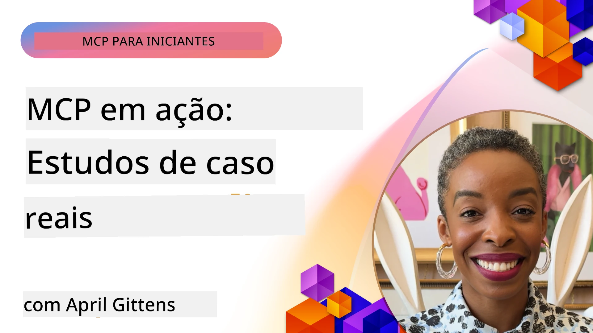

# MCP em Ação: Estudos de Caso do Mundo Real

_(Clique na imagem acima para assistir ao vídeo desta lição)_

O Protocolo de Contexto de Modelo (MCP) está transformando a maneira como aplicações de IA interagem com dados, ferramentas e serviços. Esta seção apresenta estudos de caso do mundo real que demonstram aplicações práticas do MCP em vários cenários empresariais.

## Visão Geral

Esta seção apresenta exemplos concretos de implementações do MCP, destacando como organizações estão aproveitando este protocolo para resolver desafios complexos de negócio. Ao examinar esses estudos de caso, você obterá insights sobre a versatilidade, escalabilidade e benefícios práticos do MCP em cenários reais.

## Principais Objetivos de Aprendizagem

Ao explorar esses estudos de caso, você irá:

- Entender como o MCP pode ser aplicado para resolver problemas específicos de negócio
- Aprender sobre diferentes padrões de integração e abordagens arquiteturais
- Reconhecer melhores práticas para implementar MCP em ambientes empresariais
- Obter insights sobre os desafios e soluções encontrados em implementações reais
- Identificar oportunidades para aplicar padrões semelhantes em seus próprios projetos

## Estudos de Caso em Destaque

### 1. [Azure AI Travel Agents – Implementação de Referência](./travelagentsample.md)

Este estudo de caso examina a solução de referência abrangente da Microsoft que demonstra como construir uma aplicação de planejamento de viagens com múltiplos agentes e IA usando MCP, Azure OpenAI, e Azure AI Search. O projeto apresenta:

- Orquestração multi-agente via MCP
- Integração de dados empresariais com Azure AI Search
- Arquitetura segura e escalável usando serviços Azure
- Ferramentas extensíveis com componentes MCP reutilizáveis
- Experiência de usuário conversacional alimentada pelo Azure OpenAI

A arquitetura e os detalhes de implementação fornecem insights valiosos para construir sistemas complexos multi-agente com o MCP como camada de coordenação.

### 2. [Atualizando Itens do Azure DevOps a partir de Dados do YouTube](./UpdateADOItemsFromYT.md)

Este estudo de caso demonstra uma aplicação prática do MCP para automatizar processos de workflow. Mostra como as ferramentas MCP podem ser usadas para:

- Extrair dados de plataformas online (YouTube)
- Atualizar itens de trabalho em sistemas Azure DevOps
- Criar fluxos de automação repetíveis
- Integrar dados entre sistemas distintos

Este exemplo ilustra como implementações relativamente simples do MCP podem proporcionar ganhos significativos de eficiência ao automatizar tarefas rotineiras e melhorar a consistência dos dados entre sistemas.

### 3. [Recuperação de Documentação em Tempo Real com MCP](./docs-mcp/README.md)

Este estudo de caso guia você pela conexão de um cliente de console Python a um servidor Model Context Protocol (MCP) para recuperar e registrar documentação Microsoft em tempo real e consciente do contexto. Você aprenderá como:

- Conectar-se a um servidor MCP usando um cliente Python e o SDK oficial MCP
- Usar clientes HTTP streaming para recuperação eficiente de dados em tempo real
- Chamar ferramentas de documentação no servidor e registrar respostas diretamente no console
- Integrar documentação Microsoft atualizada em seu fluxo de trabalho sem sair do terminal

O capítulo inclui uma tarefa prática, um exemplo mínimo de código funcional e links para recursos adicionais para aprendizado aprofundado. Veja o passo a passo completo e o código no capítulo vinculado para entender como o MCP pode transformar o acesso à documentação e a produtividade do desenvolvedor em ambientes de console.

### 4. [Aplicativo Web Gerador de Plano de Estudo Interativo com MCP](./docs-mcp/README.md)

Este estudo de caso demonstra como construir um aplicativo web interativo usando Chainlit e o Model Context Protocol (MCP) para gerar planos de estudo personalizados para qualquer tópico. Usuários podem especificar um assunto (como "certificação AI-900") e uma duração de estudo (por exemplo, 8 semanas), e o app fornecerá um detalhamento semana a semana do conteúdo recomendado. O Chainlit habilita uma interface de chat conversacional, tornando a experiência envolvente e adaptativa.

- Aplicativo web conversacional alimentado por Chainlit
- Comandos direcionados pelo usuário para tópico e duração
- Recomendações de conteúdo semana a semana usando MCP
- Respostas adaptativas e em tempo real na interface de chat

O projeto ilustra como a IA conversacional e o MCP podem ser combinados para criar ferramentas educacionais dinâmicas e orientadas pelo usuário em um ambiente web moderno.

### 5. [Documentação no Editor com MCP Server no VS Code](./docs-mcp/README.md)

Este estudo de caso demonstra como trazer a documentação Microsoft Learn diretamente para seu ambiente VS Code usando o servidor MCP—sem precisar alternar abas do navegador! Você verá como:

- Pesquisar e ler docs instantaneamente dentro do VS Code usando o painel MCP ou a paleta de comandos
- Referenciar documentação e inserir links diretamente em seus arquivos README ou markdown de curso
- Usar GitHub Copilot e MCP juntos para workflows de documentação e código com IA integrados
- Validar e melhorar sua documentação com feedback em tempo real e precisão originada pela Microsoft
- Integrar MCP com workflows do GitHub para validação contínua de documentação

A implementação inclui:

- Configuração de exemplo `.vscode/mcp.json` para fácil setup
- Tutoriais baseados em capturas de tela da experiência no editor
- Dicas para combinar Copilot e MCP para máxima produtividade

Este cenário é ideal para autores de curso, escritores técnicos e desenvolvedores que querem manter o foco no editor enquanto trabalham com docs, Copilot e ferramentas de validação—all powered by MCP.

### 6. [Criação de Servidor MCP com APIM](./apimsample.md)

Este estudo de caso oferece um guia passo a passo sobre como criar um servidor MCP usando o Azure API Management (APIM). Ele abrange:

- Configuração de um servidor MCP no Azure API Management
- Exposição de operações API como ferramentas MCP
- Configuração de políticas para limitação de taxa e segurança
- Testes do servidor MCP usando Visual Studio Code e GitHub Copilot

Este exemplo ilustra como aproveitar as capacidades do Azure para criar um servidor MCP robusto que pode ser utilizado em várias aplicações, aprimorando a integração de sistemas de IA com APIs empresariais.

### 7. [Registro MCP do GitHub — Acelerando a Integração Agentiva](https://github.com/mcp)

Este estudo de caso examina como o Registro MCP do GitHub, lançado em setembro de 2025, resolve um desafio crítico no ecossistema de IA: a descoberta fragmentada e implantação de servidores Model Context Protocol (MCP).

#### Visão Geral
O **Registro MCP** resolve a dor crescente dos servidores MCP dispersos em repositórios e registros, que anteriormente tornavam a integração lenta e propensa a erros. Esses servidores permitem que agentes de IA interajam com sistemas externos como APIs, bancos de dados e fontes de documentação.

#### Declaração do Problema
Desenvolvedores que constroem workflows agentivos enfrentam vários desafios:
- **Baixa descobribilidade** de servidores MCP em diferentes plataformas
- **Perguntas repetidas de configuração** espalhadas em fóruns e documentação
- **Riscos de segurança** vindos de fontes não verificadas e não confiáveis
- **Falta de padronização** na qualidade e compatibilidade dos servidores

#### Arquitetura da Solução
O Registro MCP do GitHub centraliza servidores MCP confiáveis com recursos chave:
- **Instalação com um clique** via VS Code para setup simplificado
- **Ordenação sinal-sobre-ruído** por estrelas, atividade e validação comunitária
- **Integração direta** com GitHub Copilot e outras ferramentas compatíveis MCP
- **Modelo aberto de contribuição** permitindo contribuições tanto da comunidade quanto de parceiros empresariais

#### Impacto nos Negócios
O registro trouxe melhorias mensuráveis:
- **Onboarding mais rápido** para desenvolvedores usando ferramentas como o Microsoft Learn MCP Server, que transmite documentação oficial diretamente aos agentes
- **Produtividade aprimorada** via servidores especializados como o `github-mcp-server`, habilitando automação natural em linguagem GitHub (criação de PR, reexecução de CI, varredura de código)
- **Confiança mais forte no ecossistema** por meio de listagens curadas e padrões de configuração transparentes

#### Valor Estratégico
Para profissionais especializados em gestão do ciclo de vida do agente e workflows reproduzíveis, o Registro MCP oferece:
- **Capacidades modulares de implantação de agentes** com componentes padronizados
- **Pipelines de avaliação baseados no registro** para testes e validação consistentes
- **Interoperabilidade entre ferramentas** permitindo integração fluida entre diferentes plataformas de IA

Este estudo de caso demonstra que o Registro MCP é mais que um diretório—é uma plataforma fundamental para integração escalável de modelos no mundo real e implantação de sistemas agentivos.

### 8. [Publicação em Redes Sociais a partir de um Agente](./publora-social-publishing.md)

Este estudo de caso guia através de um **servidor MCP remoto com capacidade de escrita** — cujas ferramentas realizam ações irreversíveis em nome do usuário — usando publicação social como exemplo prático. Um agente elabora uma postagem, um humano aprova, e o servidor agenda a publicação nas redes.

A parte interessante são as restrições de design que a publicação impõe, aplicáveis a qualquer servidor que escreva em vez de apenas ler:

- **Descoberta aberta, execução autenticada** — `tools/list` respondida sem credenciais para que registros e clientes possam inspecionar, enquanto cada `tools/call` exige um token e, caso contrário, retorna `401` com um cabeçalho `WWW-Authenticate`
- **Registro OAuth sem etapa fora de banda** — registro dinâmico de cliente hoje, com Documentos de Metadados de ID de Cliente conforme especificação `2026-07-28`
- **Anotações de ferramentas** (`readOnlyHint`, `destructiveHint`, `idempotentHint`) usadas pelos clientes para decidir o que confirmar—sugestões em vez de imposição, e algo que diretórios de conectores agora esperam durante revisão
- **Identificadores não inventáveis**, para que um valor alucinado falhe claramente em vez de agir em um valor plausível
- **Chaves de idempotência nas ferramentas de criação de postagens**, para que uma nova tentativa do runtime do agente não cause publicação duplicada
- **Um alvo no-op descrito no esquema da ferramenta** que exercita todo o caminho de escrita mas não publica nada, para revisores e CI

O capítulo encerra com uma breve checklist que pode ser aplicada a um servidor que você esteja construindo.

## Conclusão

Estes oito estudos de caso abrangentes demonstram a notável versatilidade e aplicações práticas do Protocolo de Contexto de Modelo em diversos cenários do mundo real. Desde sistemas complexos multi-agentes para planejamento de viagens e gestão de APIs empresariais até workflows de documentação otimizados e o revolucionário Registro MCP do GitHub, esses exemplos mostram como o MCP fornece uma maneira padronizada e escalável para conectar sistemas de IA com as ferramentas, dados e serviços necessários para entregar valor excepcional.

Os estudos de caso abrangem múltiplas dimensões da implementação MCP:
- **Integração Empresarial**: Azure API Management e automatização Azure DevOps
- **Orquestração Multi-Agente**: Planejamento de viagens com agentes de IA coordenados
- **Produtividade do Desenvolvedor**: Integração no VS Code e acesso em tempo real à documentação
- **Desenvolvimento do Ecossistema**: Registro MCP do GitHub como plataforma fundamental
- **Aplicações Educacionais**: Geradores interativos de planos de estudo e interfaces conversacionais

Ao estudar essas implementações, você obtém insights críticos sobre:
- **Padrões arquiteturais** para diferentes escalas e casos de uso
- **Estratégias de implementação** que equilibram funcionalidade com manutenção
- **Considerações de segurança e escalabilidade** para implantações em produção
- **Melhores práticas** para desenvolvimento de servidores MCP e integração de clientes
- **Pensamento de ecossistema** para construção de soluções interconectadas com IA integrada

Esses exemplos coletivamente demonstram que o MCP não é apenas um framework teórico, mas um protocolo maduro e pronto para produção que possibilita soluções práticas para desafios empresariais complexos. Seja construindo ferramentas de automação simples ou sistemas sofisticados multi-agentes, os padrões e abordagens ilustrados aqui fornecem uma base sólida para seus próprios projetos MCP.

## Recursos Adicionais

- [Repositório GitHub Azure AI Travel Agents](https://github.com/Azure-Samples/azure-ai-travel-agents)
- [Ferramenta MCP Azure DevOps](https://github.com/microsoft/azure-devops-mcp)
- [Ferramenta MCP Playwright](https://github.com/microsoft/playwright-mcp)
- [Servidor MCP Microsoft Docs](https://github.com/MicrosoftDocs/mcp)
- [Registro MCP do GitHub — Acelerando a Integração Agentiva](https://github.com/mcp)
- [Exemplos da Comunidade MCP](https://github.com/microsoft/mcp)

## O que vem a seguir

- Anterior: [Módulo 8: Melhores Práticas](../08-BestPractices/README.md)
- Próximo: [Módulo 10: Otimizando Workflows de IA: Construindo um Servidor MCP com AI Toolkit](../10-StreamliningAIWorkflowsBuildingAnMCPServerWithAIToolkit/README.md)

---

<!-- CO-OP TRANSLATOR DISCLAIMER START -->
**Aviso Legal**:
Este documento foi traduzido usando o serviço de tradução por IA [Co-op Translator](https://github.com/Azure/co-op-translator). Embora nos esforcemos pela precisão, por favor, esteja ciente de que traduções automatizadas podem conter erros ou imprecisões. O documento original em seu idioma nativo deve ser considerado a fonte autorizada. Para informações críticas, recomenda-se tradução profissional humana. Não nos responsabilizamos por quaisquer mal-entendidos ou interpretações incorretas decorrentes do uso desta tradução.
<!-- CO-OP TRANSLATOR DISCLAIMER END -->