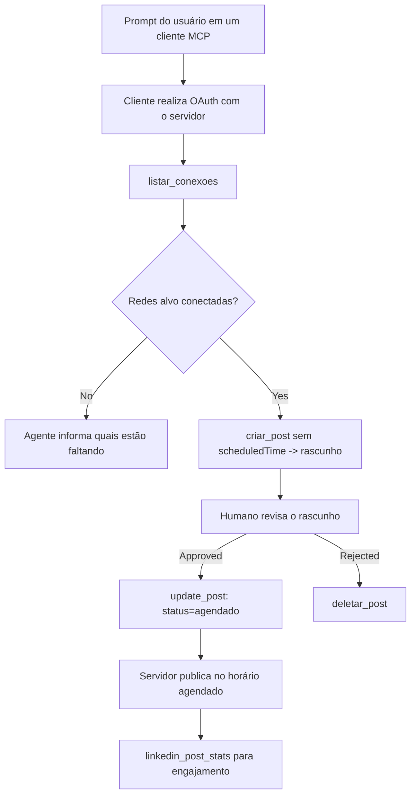

# Estudo de Caso: Publicação em Redes Sociais a partir de um Agente com um Servidor MCP Remoto

> **Aviso Legal:** Vários serviços e projetos open-source podem publicar em redes sociais, e uma equipe também poderia integrar diretamente a API de cada rede. O cenário abaixo é fornecido como um exemplo prático de como um **servidor MCP remoto com capacidade de escrita** pode ser projetado e consumido. Publora é um serviço comercial com um nível gratuito; os padrões descritos aqui se aplicam a qualquer servidor MCP que realiza ações irreversíveis em nome de um usuário.

## Visão Geral

Agentes são bons em redigir conteúdo e ruins em entregá-lo. Um modelo pode escrever um anúncio de lançamento em segundos, e então o trabalho para: publicar significa uma API por rede, um app OAuth por rede e um conjunto diferente de regras de mídia para cada uma. A maioria das equipes resolve isso copiando o texto em um navegador manualmente.

Este estudo de caso examina como essa última etapa é fechada com um único servidor MCP remoto e — mais útil para quem está construindo um — as decisões de design que um servidor **com capacidade de escrita** deve acertar. Ler dados é tolerante. Publicar não é: uma chamada de ferramenta errada é visível para o público e não pode ser desfeita.

## Cenário

Uma pequena equipe de relações com desenvolvedores redige posts dentro de um agente (Claude, VS Code, Cursor — o cliente não importa). Eles querem que o agente:

- veja quais contas sociais a equipe conectou,
- redija um post e o mantenha como rascunho para um humano aprovar,
- anexe uma imagem,
- agende para várias redes em um horário escolhido,
- e depois reporte como teve desempenho.

Fundamentalmente, eles querem que o agente *não possa* publicar acidentalmente enquanto ainda estiverem experimentando.

## Ferramentas Usadas

- [Publora MCP Server](https://github.com/publora/mcp-server) — um servidor MCP remoto (`streamable-http`) que expõe ferramentas para publicação, agendamento, mídia e análise do LinkedIn. Registrado no registro oficial MCP como `com.publora/mcp-server`.

## Fluxo Passo a Passo

1. **Conecte o servidor.** Clientes que usam OAuth completam o fluxo de código de autorização com PKCE contra a própria tela de consentimento do servidor; clientes que não usam, como CLIs sem interface, usam uma chave de API do Publora em um cabeçalho. Ambos os caminhos são suportados, e qual você usa depende do cliente, não do servidor.
2. **Liste conexões.** O agente chama `list_connections` e recebe as contas conectadas com seus identificadores.
3. **Rascunhar.** O agente chama `create_post` *sem* um horário agendado. O post é armazenado como rascunho — nada é publicado.
4. **Anexar mídia.** URLs públicos de imagem são passados na mesma chamada; o servidor os baixa e valida.
5. **Agendar.** Após aprovação humana, `update_post` define o status como agendado com um horário ISO 8601.
6. **Medir.** Para o LinkedIn, `linkedin_post_stats` retorna engajamento assim que o post está ativo.

## Exemplo de Prompt

```text
Which social accounts do I have connected?
Draft a post announcing our new changelog page, attach the screenshot at
https://example.com/changelog.png, and keep it as a draft — do not publish it.
Once I approve, schedule it to LinkedIn and Bluesky for tomorrow at 09:00 UTC.
```

## Fluxograma Mermaid



## Implementação Técnica

As lições abaixo são a parte transferível deste estudo de caso.

### Descoberta aberta, execução autenticada

`tools/list` é servido sem credenciais; toda chamada `tools/call` requer um token e caso contrário retorna `401` com um cabeçalho `WWW-Authenticate` apontando para os metadados do recurso protegido. (O servidor também responde a um `initialize` não autenticado, que importa apenas para clientes em versões do protocolo antes de `2026-07-28`; essa revisão removeu totalmente o handshake.)

Essa divisão importa na prática. Registros, catálogos e clientes podem inspecionar a superfície da ferramenta — nomes, esquemas, anotações — sem possuir segredo, enquanto nada pode ser *executado* anonimamente. Um servidor que exige token para `initialize` é efetivamente invisível para ferramentas; um servidor que permite `tools/call` anônimo é um risco.

### Registro: registro dinâmico de clientes, e o que substitui isso

O servidor anuncia `/.well-known/oauth-protected-resource` e `/.well-known/oauth-authorization-server`, e suporta o fluxo de código de autorização com PKCE (`S256`), tokens de atualização e **registro dinâmico de cliente**.

O registro dinâmico elimina a etapa manual: sem ele, cada cliente precisa de um `client_id` pré-emitido, o que significa uma solicitação fora de banda ao fornecedor para cada novo cliente.

Trate isso como um comportamento de compatibilidade e não como o design a copiar. A revisão da especificação de `2026-07-28` desaprova o registro dinâmico de clientes em favor dos Documentos de Metadados de ID do Cliente, onde o cliente hospeda um documento de metadados em uma URL HTTPS estável e essa URL *é* o `client_id`. DCR continua funcionando por enquanto, mas um servidor sendo construído hoje deve planejar para CIMD e manter DCR apenas para clientes antigos.

### Anotações de ferramentas não são decoração

Cada ferramenta carrega um `title` e as dicas aplicáveis: `readOnlyHint`, `destructiveHint`, `idempotentHint`, `openWorldHint`.

Dois motivos para investir nelas. Primeiro, clientes usam as dicas para decidir o que confirmar com o usuário — um cliente pode executar automaticamente uma consulta somente leitura e parar para aprovação antes de um delete. A especificação é explícita que anotações são dicas não confiáveis, não um mecanismo de autorização: elas moldam o que um cliente oferece fazer, não impedem nada no servidor, e o servidor ainda deve aplicar suas regras. Segundo, os principais diretórios de conectores agora *exigem* essas anotações para revisão; um servidor cujas ferramentas não possuem títulos e dicas será rejeitado independentemente de sua qualidade.

### Faça os identificadores impossíveis de inventar

Identificadores de plataforma são strings opacas retornadas por `list_connections`, e a descrição do esquema diz explicitamente que eles devem ser copiados exatamente e nunca adivinhados. O servidor rejeita qualquer outra coisa.

Modelos têm facilidade para adivinhar. Qualquer servidor com capacidade de escrita deve assumir que um identificador será eventualmente fabricado e fazer esse caminho falhar alto e cedo, em vez de agir sobre um valor plausível.

### Falhe antes de publicar, com uma mensagem acionável

Algumas redes rejeitam posts só com texto e exigem imagem ou vídeo. Isso é validado quando o post é agendado, e o erro indica a plataforma e o requisito faltante.

Um agente pode se recuperar de "Instagram exige mídia — anexe uma imagem ou vídeo" sem uma ida e volta adicional. Não pode se recuperar de um `400` genérico.

### Torne as tentativas de repetição seguras

As duas ferramentas que criam conteúdo, `create_post` e `update_post`, aceitam uma chave de idempotência: reutilizá-la com uma solicitação idêntica repete a resposta original em vez de criar um segundo post. Ambientes de execução de agente tentam novamente em timeouts; sem idempotência, uma resposta lenta vira uma publicação duplicada. As outras ferramentas de escrita — deleções, etapas de mídia, reações e comentários no LinkedIn — não aceitam, então uma nova tentativa nelas não é automaticamente segura. Vale saber quais mutações suas são protegidas e quais não.

### Proporcione uma forma de testar que não publica nada

O servidor aceita um destino reservado, `publora-playground`, que é validado e reconhecido como um destino real e então descartado — nada chega a uma conta real. Isso é descrito no próprio esquema da ferramenta, que qualquer cliente pode ler sem credenciais: o campo `platforms` de `create_post` documenta isso como "um destino de teste de conexão que não requer conexão real — o post é reconhecido e descartado, nada é publicado". Use-o passando-o como a única entrada: `platforms: ["publora-playground"]`.

Isso se mostrou um dos detalhes mais úteis de toda a superfície. Revisores de diretórios de conectores, contribuidores e CI podem exercitar o caminho completo de escrita sem risco para um público real. Qualquer servidor MCP com ações irreversíveis se beneficia de um destino no-op documentado.

## Resultados e Impacto

- A etapa de publicação mudou de um navegador para a mesma conversa onde o conteúdo é escrito, e o hábito de rascunho primeiro mantém um humano no loop. Seja preciso quanto ao que isso é: um rascunho é uma convenção, não uma fronteira. A mesma credencial pode agendar ou publicar, então quem precisa de uma aprovação real deve aplicá-la fora da superfície da ferramenta — credenciais separadas ou uma camada de política na frente do servidor.
- Diferenças por rede — exigências de mídia, encadeamento, controles de resposta — são tratadas uma vez no servidor ao invés de em cada agente que fala com ele.
- O mesmo servidor suporta vários clientes MCP sem trabalho por cliente, porque a descoberta é aberta e o registro é dinâmico.
- As restrições de design acima foram moldadas tanto por revisões de diretórios de conectores quanto por usuários: anotações, OAuth e um destino de teste seguro foram exigidos por pelo menos um deles.

## Referências

- [Publora MCP Server (código fonte)](https://github.com/publora/mcp-server)
- [Documentação da API e MCP da Publora](https://docs.publora.com)
- [Entrada no Registro MCP: `com.publora/mcp-server`](https://registry.modelcontextprotocol.io/v0/servers?search=com.publora/mcp-server)
- [Especificação MCP — Autorização](https://modelcontextprotocol.io/specification/draft/basic/authorization)
- [Especificação MCP — Anotações de Ferramentas](https://modelcontextprotocol.io/docs/concepts/tools)

## O Que Vem a Seguir

- Pegue um servidor MCP que você está construindo e verifique as três vitórias mais baratas aqui: anotações em cada ferramenta, uma chave de idempotência em cada escrita e um destino no-op documentado.
- Experimente a divisão descoberta aberta: chame `tools/list` contra um servidor remoto público sem credenciais, depois chame uma ferramenta e inspecione o desafio `401`.
- Considere o que "desfazer" significa para seu domínio. Publicação tem rascunhos e deleção; se suas ações não têm equivalentes, confirmação pertence ao design da ferramenta, não ao prompt.

---

<!-- CO-OP TRANSLATOR DISCLAIMER START -->
**Aviso Legal**:
Este documento foi traduzido usando o serviço de tradução por IA [Co-op Translator](https://github.com/Azure/co-op-translator). Embora nos esforcemos pela precisão, por favor, esteja ciente de que traduções automatizadas podem conter erros ou imprecisões. O documento original em seu idioma nativo deve ser considerado a fonte autorizada. Para informações críticas, recomenda-se tradução profissional humana. Não nos responsabilizamos por quaisquer mal-entendidos ou interpretações incorretas decorrentes do uso desta tradução.
<!-- CO-OP TRANSLATOR DISCLAIMER END -->