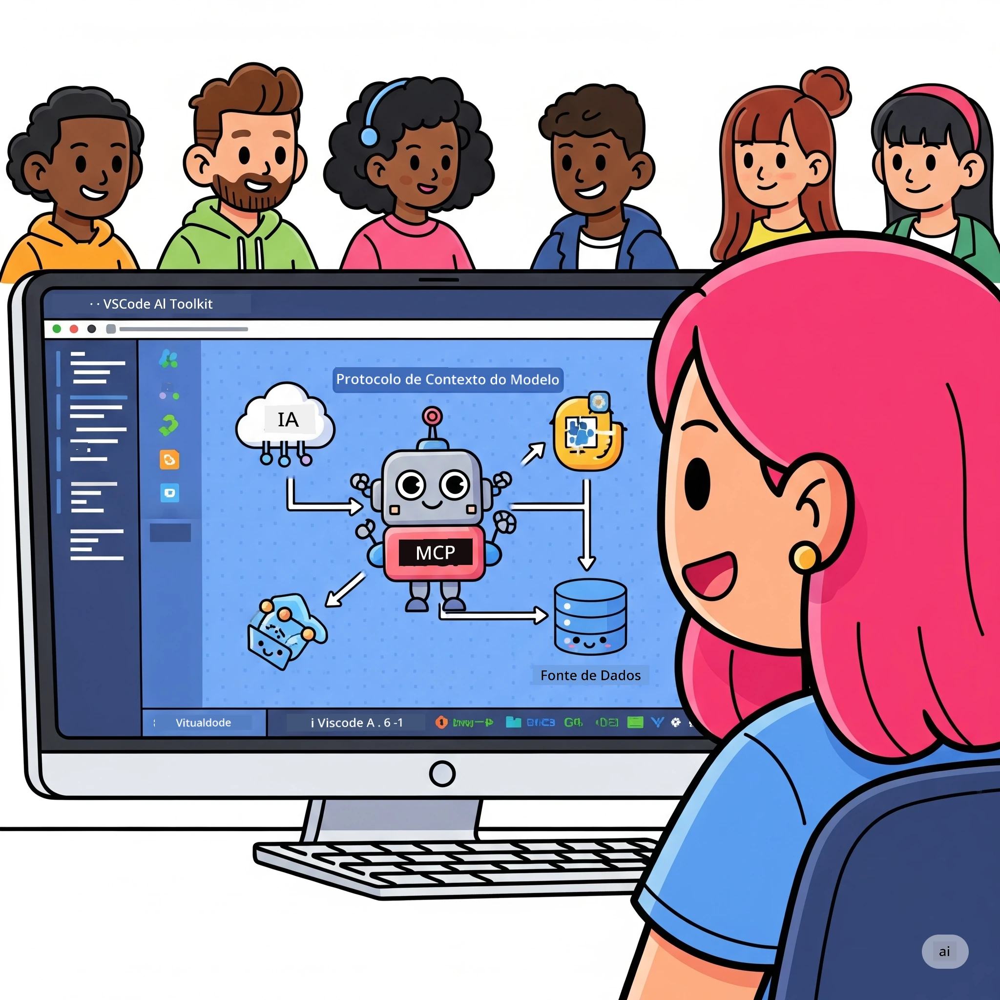
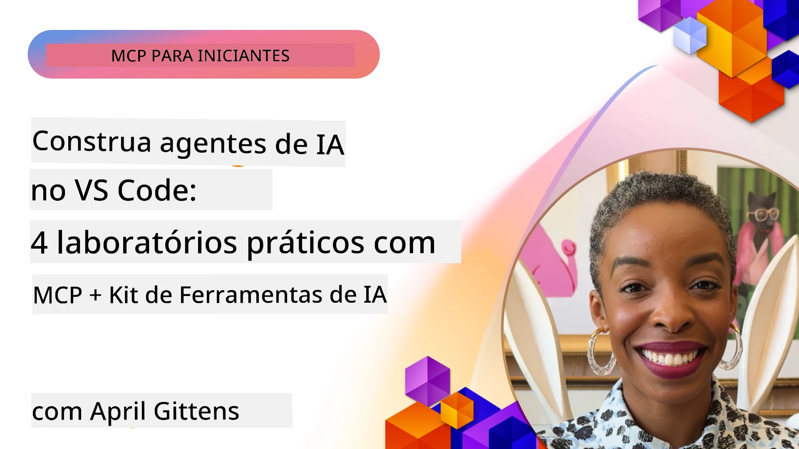

# Otimizando Fluxos de Trabalho de IA: Construindo um Servidor MCP com Microsoft Foundry Toolkit

## 🎯 Visão Geral

_(Clique na imagem acima para assistir ao vídeo desta aula)_

Bem-vindo ao **Workshop do Modelo Protocolo de Contexto (MCP)**! Este workshop prático e abrangente combina duas tecnologias de ponta para revolucionar o desenvolvimento de aplicações de IA:

> **Nota de compatibilidade:** o código do workshop foi construído e testado com o MCP
> `2025-11-25`, conforme indicado pelo emblema acima. Use a
> [especificação atual `2026-07-28`](https://modelcontextprotocol.io/specification/2026-07-28/)
> para novas implementações do protocolo e revise as notas da versão do SDK antes de
> migrar os laboratórios.

- **🔗 Modelo Protocolo de Contexto (MCP)**: Um padrão aberto para integração fluida de ferramentas de IA
- **🛠️ Extensão Microsoft Foundry Toolkit para VS Code**: A poderosa extensão de desenvolvimento AI da Microsoft

### 🎓 O que você vai aprender

Ao final deste workshop, você dominará a arte de construir aplicações inteligentes que conectam modelos de IA com ferramentas e serviços do mundo real. Desde testes automáticos até integrações personalizadas de API, você adquirirá habilidades práticas para resolver desafios complexos de negócios.

## 🏗️ Pilha Tecnológica

### 🔌 Modelo Protocolo de Contexto (MCP)

MCP é o **"USB-C para IA"** - um padrão universal que conecta modelos de IA a ferramentas externas e fontes de dados.

**✨ Principais Características:**

- 🔄 **Integração Padronizada**: Interface universal para conexões de ferramenta IA
- 🏛️ **Arquitetura Flexível**: Servidores locais e remotos via transporte stdio/SSE
- 🧰 **Ecossistema Rico**: Ferramentas, prompts e recursos em um único protocolo
- 🔒 **Pronto para Empresas**: Segurança e confiabilidade incorporadas

**🎯 Por que o MCP é importante:**
Assim como o USB-C eliminou a confusão dos cabos, MCP elimina a complexidade das integrações de IA. Um protocolo, possibilidades infinitas.

### 🤖 Extensão Microsoft Foundry Toolkit para VS Code

A principal extensão de desenvolvimento de IA da Microsoft que transforma o VS Code em uma potência de IA.

**🚀 Capacidades Principais:**

- 📦 **Catálogo de Modelos**: Acesse modelos do Azure AI, GitHub, Hugging Face, Ollama
- ⚡ **Inferência Local**: Execução otimizada ONNX para CPU/GPU/NPU
- 🏗️ **Construtor de Agentes**: Desenvolvimento visual de agentes IA com integração MCP
- 🎭 **Multi-Modal**: Suporte para texto, visão e saída estruturada

**💡 Benefícios de Desenvolvimento:**

- Implantação de modelos sem configuração
- Engenharia visual de prompts
- Playground de testes em tempo real
- Integração fluida com servidores MCP

## 📚 Jornada de Aprendizado

### [🚀 Módulo 1: Fundamentos do Microsoft Foundry Toolkit](./lab1/README.md)

**Duração**: 15 minutos

- 🛠️ Instale e configure o Microsoft Foundry Toolkit para VS Code
- 🗂️ Explore o Catálogo de Modelos (mais de 100 modelos do GitHub, ONNX, OpenAI, Anthropic, Google)
- 🎮 Domine o Playground Interativo para teste de modelos em tempo real
- 🤖 Construa seu primeiro agente de IA com o Agent Builder
- 📊 Avalie o desempenho do modelo com métricas integradas (F1, relevância, similaridade, coerência)
- ⚡ Aprenda processamento em lote e suporte multimodalidade

**🎯 Resultado do Aprendizado**: Criar um agente de IA funcional com compreensão abrangente das capacidades do Microsoft Foundry Toolkit

### [🌐 Módulo 2: MCP com Fundamentos do Microsoft Foundry Toolkit](./lab2/README.md)

**Duração**: 20 minutos

- 🧠 Domine a arquitetura e conceitos do Modelo Protocolo de Contexto (MCP)
- 🌐 Explore o ecossistema de servidores MCP da Microsoft
- 🤖 Construa um agente de automação de navegador usando o servidor MCP Playwright
- 🔧 Integre servidores MCP com Microsoft Foundry Toolkit Agent Builder
- 📊 Configure e teste ferramentas MCP dentro de seus agentes
- 🚀 Exporte e implante agentes com suporte MCP para uso em produção

**🎯 Resultado do Aprendizado**: Implantar um agente de IA turboalimentado com ferramentas externas via MCP

### [🔧 Módulo 3: Desenvolvimento Avançado MCP com Microsoft Foundry Toolkit](./lab3/README.md)

**Duração**: 20 minutos

- 💻 Crie servidores MCP personalizados usando Microsoft Foundry Toolkit
- 🐍 Configure e use o mais recente SDK MCP em Python (v1.9.3)
- 🔍 Configure e utilize MCP Inspector para depuração
- 🛠️ Construa um Servidor MCP de Clima com fluxos de trabalho profissionais de depuração
- 🧪 Depure servidores MCP tanto no Agent Builder quanto nos ambientes Inspector

**🎯 Resultado do Aprendizado**: Desenvolver e depurar servidores MCP personalizados com ferramentas modernas

### [🐙 Módulo 4: Desenvolvimento Prático MCP - Servidor Customizado de Clonagem GitHub](./lab4/README.md)

**Duração**: 30 minutos

- 🏗️ Construa um servidor MCP de clonagem GitHub real para fluxos de trabalho de desenvolvimento
- 🔄 Implemente clonagem inteligente de repositório com validação e tratamento de erros
- 📁 Crie gerenciamento inteligente de diretórios e integração com VS Code
- 🤖 Use o modo de agente GitHub Copilot com ferramentas MCP personalizadas
- 🛡️ Aplique confiabilidade pronta para produção e compatibilidade multiplataforma

**🎯 Resultado do Aprendizado**: Implante um servidor MCP pronto para produção que otimiza fluxos de trabalho reais de desenvolvimento

## 💡 Aplicações e Impacto no Mundo Real

### 🏢 Casos de Uso Empresariais

#### 🔄 Automação DevOps

Transforme seu fluxo de trabalho de desenvolvimento com automação inteligente:

- **Gerenciamento Inteligente de Repositórios**: Revisão de código e decisões de merge conduzidas por IA
- **CI/CD Inteligente**: Otimização automatizada de pipeline baseada em mudanças de código
- **Triagem de Issues**: Classificação e atribuição automática de bugs

#### 🧪 Revolução em Garantia de Qualidade

Eleve os testes com automação alimentada por IA:

- **Geração Inteligente de Testes**: Crie suítes de testes completas automaticamente
- **Teste de Regressão Visual**: Detecção de mudanças na UI com IA
- **Monitoramento de Desempenho**: Identificação e resolução proativa de problemas

#### 📊 Inteligência em Pipelines de Dados

Construa fluxos de trabalho de processamento de dados mais inteligentes:

- **Processos ETL Adaptativos**: Transformações de dados auto-otimizáveis
- **Detecção de Anomalias**: Monitoramento de qualidade de dados em tempo real
- **Roteamento Inteligente**: Gestão inteligente do fluxo de dados

#### 🎧 Melhoria na Experiência do Cliente

Crie interações excepcionais com clientes:

- **Suporte Sensível ao Contexto**: Agentes de IA com acesso ao histórico do cliente
- **Resolução Proativa de Problemas**: Atendimento preditivo ao cliente
- **Integração Multicanal**: Experiência unificada de IA em várias plataformas

## 🛠️ Pré-requisitos e Configuração

### 💻 Requisitos do Sistema

| Componente | Requisito | Observações |
|-----------|------------|------------|
| **Sistema Operacional** | Windows 10+, macOS 10.15+, Linux | Qualquer sistema moderno |
| **Visual Studio Code** | Versão estável mais recente | Necessário para Microsoft Foundry Toolkit |
| **Node.js** | v18.0+ e npm | Para desenvolvimento de servidor MCP |
| **Python** | 3.10+ | Opcional para servidores MCP em Python |
| **Memória** | mínimo 8GB RAM | 16GB recomendado para modelos locais |

### 🔧 Ambiente de Desenvolvimento

#### Extensões do VS Code Recomendadas

- **Microsoft Foundry Toolkit** (ms-windows-ai-studio.windows-ai-studio)
- **Python** (ms-python.python)
- **Depurador Python** (ms-python.debugpy)
- **GitHub Copilot** (GitHub.copilot) - Opcional mas útil

#### Ferramentas Opcionais

- **uv**: Gerenciador moderno de pacotes Python
- **MCP Inspector**: Ferramenta visual para depuração de servidores MCP
- **Playwright**: Para exemplos de automação web

## 🎖️ Resultados do Aprendizado e Caminho para Certificação

### 🏆 Lista de Verificação de Domínio de Competências

Ao completar este workshop, você atingirá domínio em:

#### 🎯 Competências Essenciais

- [ ] **Domínio do Protocolo MCP**: Compreensão profunda da arquitetura e padrões de implementação
- [ ] **Proficiência no Microsoft Foundry Toolkit**: Uso avançado do Microsoft Foundry Toolkit para desenvolvimento acelerado
- [ ] **Desenvolvimento de Servidor Customizado**: Construção, implantação e manutenção de servidores MCP em produção
- [ ] **Excelência em Integração de Ferramentas**: Conectar IA com fluxos de trabalho existentes de desenvolvimento sem falhas
- [ ] **Aplicação em Resolução de Problemas**: Aplicar habilidades aprendidas em desafios reais de negócio

#### 🔧 Habilidades Técnicas

- [ ] Configurar e configurar o Microsoft Foundry Toolkit no VS Code
- [ ] Projetar e implementar servidores MCP personalizados
- [ ] Integrar modelos GitHub com a arquitetura MCP
- [ ] Construir fluxos de trabalho de testes automáticos com Playwright
- [ ] Implantar agentes de IA para uso em produção
- [ ] Depurar e otimizar o desempenho do servidor MCP

#### 🚀 Capacidades Avançadas

- [ ] Arquitetar integrações de IA em escala empresarial
- [ ] Implementar melhores práticas de segurança para aplicações de IA
- [ ] Projetar arquiteturas escaláveis de servidores MCP
- [ ] Criar cadeias de ferramentas customizadas para domínios específicos
- [ ] Orientar outros no desenvolvimento nativo de IA

## 📖 Recursos Adicionais

- [Especificação MCP (2026-07-28)](https://modelcontextprotocol.io/specification/2026-07-28/)
- [Repositório GitHub do Microsoft Foundry Toolkit](https://github.com/microsoft/vscode-ai-toolkit)
- [Coleção de Servidores MCP de Exemplo](https://github.com/modelcontextprotocol/servers)
- [Guia Melhores Práticas](https://modelcontextprotocol.io/docs/best-practices)
- [OWASP MCP Top 10](https://microsoft.github.io/mcp-azure-security-guide/mcp/) - Melhores práticas de segurança

---

**🚀 Pronto para revolucionar seu fluxo de trabalho de desenvolvimento de IA?**

Vamos construir juntos o futuro das aplicações inteligentes com MCP e Microsoft Foundry Toolkit!

## O Que Vem a Seguir

Continue para: [Módulo 11: Laboratórios Práticos de Servidor MCP](../11-MCPServerHandsOnLabs/README.md)

---

<!-- CO-OP TRANSLATOR DISCLAIMER START -->
**Aviso Legal**:
Este documento foi traduzido usando o serviço de tradução por IA [Co-op Translator](https://github.com/Azure/co-op-translator). Embora nos esforcemos pela precisão, por favor, esteja ciente de que traduções automatizadas podem conter erros ou imprecisões. O documento original em seu idioma nativo deve ser considerado a fonte autorizada. Para informações críticas, recomenda-se tradução profissional humana. Não nos responsabilizamos por quaisquer mal-entendidos ou interpretações incorretas decorrentes do uso desta tradução.
<!-- CO-OP TRANSLATOR DISCLAIMER END -->