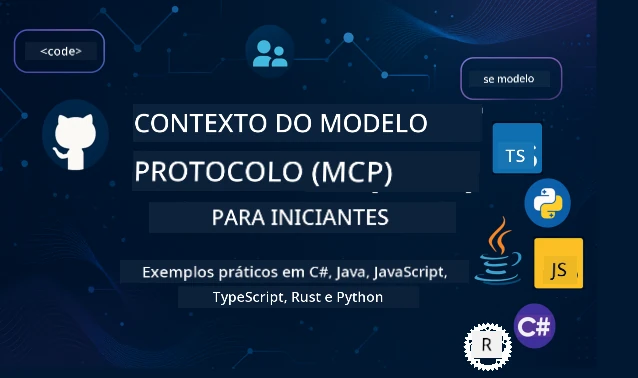

 

[](https://GitHub.com/microsoft/mcp-for-beginners/graphs/contributors)
[](https://GitHub.com/microsoft/mcp-for-beginners/issues)
[](https://GitHub.com/microsoft/mcp-for-beginners/pulls)
[](http://makeapullrequest.com)

[](https://GitHub.com/microsoft/mcp-for-beginners/watchers)
[](https://GitHub.com/microsoft/mcp-for-beginners/fork)
[](https://GitHub.com/microsoft/mcp-for-beginners/stargazers)


[](https://discord.gg/nTYy5BXMWG)

Siga estes passos para começar a usar esses recursos:
1. **Faça um fork do repositório**: Clique [](https://GitHub.com/microsoft/mcp-for-beginners/fork)
2. **Clone o repositório**:   `git clone https://github.com/microsoft/mcp-for-beginners.git`
3. **Participe do** [](https://discord.gg/nTYy5BXMWG)


### 🌐 Suporte Multilíngue

#### Suportado via GitHub Action (Automatizado e Sempre Atualizado)

<!-- CO-OP TRANSLATOR LANGUAGES TABLE START -->
[Árabe](../ar/README.md) | [Bengali](../bn/README.md) | [Búlgaro](../bg/README.md) | [Birmanês (Myanmar)](../my/README.md) | [Chinês (Simplificado)](../zh-CN/README.md) | [Chinês (Tradicional, Hong Kong)](../zh-HK/README.md) | [Chinês (Tradicional, Macau)](../zh-MO/README.md) | [Chinês (Tradicional, Taiwan)](../zh-TW/README.md) | [Croata](../hr/README.md) | [Tcheco](../cs/README.md) | [Dinamarquês](../da/README.md) | [Holandês](../nl/README.md) | [Estoniano](../et/README.md) | [Finlandês](../fi/README.md) | [Francês](../fr/README.md) | [Alemão](../de/README.md) | [Grego](../el/README.md) | [Hebraico](../he/README.md) | [Hindi](../hi/README.md) | [Húngaro](../hu/README.md) | [Indonésio](../id/README.md) | [Italiano](../it/README.md) | [Japonês](../ja/README.md) | [Kannada](../kn/README.md) | [Coreano](../ko/README.md) | [Lituano](../lt/README.md) | [Malaio](../ms/README.md) | [Malaiala](../ml/README.md) | [Marathi](../mr/README.md) | [Nepali](../ne/README.md) | [Pidgin Nigeriano](../pcm/README.md) | [Norueguês](../no/README.md) | [Persa (Farsi)](../fa/README.md) | [Polonês](../pl/README.md) | [Português (Brasil)](./README.md) | [Português (Portugal)](../pt-PT/README.md) | [Punjabi (Gurmukhi)](../pa/README.md) | [Romeno](../ro/README.md) | [Russo](../ru/README.md) | [Sérvio (Cirílico)](../sr/README.md) | [Eslovaco](../sk/README.md) | [Esloveno](../sl/README.md) | [Espanhol](../es/README.md) | [Suaíli](../sw/README.md) | [Sueco](../sv/README.md) | [Tagalo (Filipino)](../tl/README.md) | [Tâmil](../ta/README.md) | [Telugu](../te/README.md) | [Tailandês](../th/README.md) | [Turco](../tr/README.md) | [Ucraniano](../uk/README.md) | [Urdu](../ur/README.md) | [Vietnamita](../vi/README.md)

> **Prefere clonar localmente?**
>
> Este repositório inclui traduções para mais de 50 idiomas, o que aumenta significativamente o tamanho do download. Para clonar sem as traduções, use sparse checkout:
>
> **Bash / macOS / Linux:**
> ```bash
> git clone --filter=blob:none --sparse https://github.com/microsoft/mcp-for-beginners.git
> cd mcp-for-beginners
> git sparse-checkout set --no-cone '/*' '!translations' '!translated_images'
> ```
>
> **CMD (Windows):**
> ```cmd
> git clone --filter=blob:none --sparse https://github.com/microsoft/mcp-for-beginners.git
> cd mcp-for-beginners
> git sparse-checkout set --no-cone "/*" "!translations" "!translated_images"
> ```
>
> Isso oferece tudo que você precisa para completar o curso com um download muito mais rápido.
<!-- CO-OP TRANSLATOR LANGUAGES TABLE END -->

# 🚀 Currículo do Model Context Protocol (MCP) para Iniciantes

## **Aprenda MCP com exemplos práticos em C#, Java, JavaScript, Rust, Python e TypeScript**

## 🧠 Visão Geral do Currículo do Model Context Protocol
Bem-vindo à sua jornada no Model Context Protocol! Se você já se perguntou como aplicações de IA se comunicam com diferentes ferramentas e serviços, está prestes a descobrir a solução elegante que está transformando a forma como desenvolvedores constroem sistemas inteligentes.

Pense no MCP como um tradutor universal para aplicações de IA - assim como as portas USB permitem conectar qualquer dispositivo ao seu computador, o MCP permite que modelos de IA se conectem a qualquer ferramenta ou serviço de maneira padronizada. Seja você um iniciante construindo seu primeiro chatbot, ou trabalhando em fluxos de IA complexos, entender o MCP lhe dará o poder de criar aplicações mais capazes e flexíveis.

Este currículo foi pensado com paciência e cuidado para a sua jornada de aprendizado. Começaremos com conceitos simples que você já entende e gradualmente construiremos sua expertise através da prática em sua linguagem de programação favorita. Cada passo inclui explicações claras, exemplos práticos e muito incentivo no caminho.

Quando você terminar essa jornada, terá confiança para construir seus próprios servidores MCP, integrá-los a plataformas populares de IA e compreender como essa tecnologia está remodelando o futuro do desenvolvimento de IA. Vamos iniciar essa aventura empolgante juntos!

### Documentação Oficial e Especificações

Este currículo está alinhado com **Especificação MCP 2025-11-25** (a versão estável mais recente). A especificação MCP usa versionamento baseado em data (formato AAAA-MM-DD) para garantir rastreamento claro da versão do protocolo.

Esses recursos se tornarão mais valiosos conforme seu entendimento cresce, mas não se sinta pressionado a ler tudo imediatamente. Comece pelas áreas que mais lhe interessam!
- 📘 [Documentação MCP](https://modelcontextprotocol.io/) – Este é seu recurso principal para tutoriais passo a passo e guias de usuário. A documentação é escrita pensando em iniciantes, oferecendo exemplos claros para você acompanhar no seu ritmo.
- 📜 [Especificação MCP](https://modelcontextprotocol.io/specification/2025-11-25) – Considere este o seu manual de referência completo. Conforme você avança no currículo, voltará aqui para consultar detalhes específicos e explorar recursos avançados.
- 📜 [Versionamento da Especificação MCP](https://modelcontextprotocol.io/specification/versioning) – Contém informações sobre o histórico de versões do protocolo e como o MCP usa versionamento baseado em data (formato AAAA-MM-DD).
- 🧑‍💻 [Repositório MCP no GitHub](https://github.com/modelcontextprotocol) – Aqui você encontrará SDKs, ferramentas e exemplos de código em múltiplas linguagens. É um verdadeiro tesouro de exemplos práticos e componentes prontos para usar.
- 🌐 [Comunidade MCP](https://github.com/orgs/modelcontextprotocol/discussions) – Participe de discussões com outros aprendizes e desenvolvedores experientes sobre MCP. É uma comunidade acolhedora onde perguntas são bem-vindas e o conhecimento é compartilhado livremente.
  
## Objetivos de Aprendizagem

Ao final deste currículo, você se sentirá confiante e entusiasmado com suas novas habilidades. Veja o que você vai conquistar:

• **Compreender fundamentos do MCP**: Entenderá o que é o Model Context Protocol e por que ele está revolucionando a forma como aplicações de IA trabalham juntas, usando analogias e exemplos que fazem sentido.

• **Criar seu primeiro servidor MCP**: Construirá um servidor MCP funcional em sua linguagem de programação preferida, começando por exemplos simples e ampliando suas habilidades passo a passo.

• **Conectar modelos de IA a ferramentas reais**: Aprenderá a fazer a ponte entre modelos de IA e serviços reais, dando novas capacidades poderosas às suas aplicações.

• **Implementar boas práticas de segurança**: Entenderá como manter suas implementações MCP seguras, protegendo suas aplicações e usuários.

• **Fazer deploy com confiança**: Saberá levar seus projetos MCP do desenvolvimento à produção, com estratégias práticas de implantação que funcionam no mundo real.

• **Ingressar na comunidade MCP**: Tornar-se-á parte de uma comunidade crescente de desenvolvedores que estão moldando o futuro do desenvolvimento de aplicações de IA. 

## Conhecimentos Básicos Essenciais

Antes de mergulharmos nas especificidades do MCP, vamos garantir que você esteja confortável com alguns conceitos fundamentais. Não se preocupe se você não for um expert nessas áreas - explicaremos tudo que precisar conforme avançamos!

### Entendendo Protocolos (A Base)

Pense em um protocolo como as regras para uma conversa. Quando você liga para um amigo, vocês sabem dizer “olá” ao atender, falar turnos e se despedir ao final. Programas de computador precisam de regras similares para se comunicarem efetivamente.

O MCP é um protocolo – um conjunto de regras combinadas que ajudam modelos de IA e aplicações a terem “conversas” produtivas com ferramentas e serviços. Assim como regras de conversa tornam a comunicação humana mais suave, o MCP torna a comunicação entre aplicações de IA mais confiável e poderosa.

### Relação Cliente-Servidor (Como Programas Trabalham Juntos)

Você já usa relações cliente-servidor todo dia! Quando usa um navegador (cliente) para visitar um site, conecta-se a um servidor web que envia o conteúdo da página. O navegador sabe como pedir informações, e o servidor sabe como responder.

No MCP, temos uma relação semelhante: modelos de IA agem como clientes que solicitam informações ou ações, enquanto servidores MCP fornecem essas capacidades. É como ter um assistente prestativo (servidor) que a IA pode pedir para executar tarefas específicas.

### Por que a Padronização Importa (Fazendo as Coisas Funcionarem Juntas)

Imagine se cada fabricante de carro usasse bombas de gasolina de formato diferente - você precisaria de um adaptador diferente para cada carro! Padronização significa concordar em abordagens comuns para que as coisas funcionem juntas sem problemas.

O MCP provê essa padronização para aplicações de IA. Em vez de cada modelo de IA precisar de código customizado para funcionar com cada ferramenta, o MCP cria uma maneira universal para eles se comunicarem. Isso permite que desenvolvedores criem ferramentas uma vez e façam elas funcionarem com muitos sistemas diferentes de IA.

## 🧭 Visão Geral do Seu Caminho de Aprendizado

Sua jornada no MCP está cuidadosamente estruturada para construir sua confiança e habilidades progressivamente. Cada fase apresenta novos conceitos enquanto reforça o que você já aprendeu.

### 🌱 Fase Fundamental: Entendendo o Básico (Módulos 0-2)

Aqui começa sua aventura! Apresentaremos conceitos do MCP usando analogias familiares e exemplos simples. Você entenderá o que é o MCP, por que ele existe e como se encaixa no mundo maior do desenvolvimento de IA.

• **Módulo 0 - Introdução ao MCP**: Começaremos explorando o que é o MCP e por que é tão importante para aplicações modernas de IA. Você verá exemplos reais do MCP em ação e como ele resolve problemas comuns que desenvolvedores enfrentam.

• **Módulo 1 - Conceitos Centrais Explicados**: Aqui você aprenderá os blocos essenciais do MCP. Usaremos muitas analogias e exemplos visuais para garantir que os conceitos fiquem naturais e compreensíveis.

• **Módulo 2 - Segurança no MCP**: Segurança pode parecer intimidadora, mas mostraremos como o MCP inclui recursos de segurança embutidos e ensinaremos boas práticas que protegem suas aplicações desde o início.

### 🔨 Fase de Construção: Criando Suas Primeiras Implementações (Módulo 3)

Agora a diversão de verdade começa! Você terá experiência prática construindo servidores e clientes MCP reais. Não se preocupe - começaremos simples e guiaremos você a cada passo.
Este módulo inclui vários guias práticos que permitem que você pratique na sua linguagem de programação preferida. Você criará seu primeiro servidor, construirá um cliente para se conectar a ele e até integrará com ferramentas de desenvolvimento populares como o VS Code.

Cada guia inclui exemplos completos de código, dicas para solução de problemas e explicações de por que fazemos escolhas específicas de design. Ao final desta fase, você terá implementações MCP funcionando das quais poderá se orgulhar!

### 🚀 Fase de Crescimento: Conceitos Avançados e Aplicação no Mundo Real (Módulos 4-5)

Com o básico dominado, você estará pronto para explorar recursos mais sofisticados do MCP. Cobrirá estratégias práticas de implementação, técnicas de depuração e tópicos avançados como integração multimodal de IA.

Você também aprenderá como escalar suas implementações MCP para uso em produção e integrar com plataformas em nuvem como Azure. Esses módulos preparam você para construir soluções MCP que possam lidar com demandas do mundo real.

### 🌟 Fase de Mestrado: Comunidade e Especialização (Módulos 6-11)

A fase final foca em ingressar na comunidade MCP e se especializar nas áreas que mais te interessam. Você aprenderá a contribuir para projetos MCP open-source, implementar padrões avançados de autenticação e construir soluções abrangentes integradas a bancos de dados.

O Módulo 11 merece menção especial - é um caminho de aprendizado prático completo com 13 laboratórios que ensinam a construir servidores MCP prontos para produção com integração PostgreSQL. É como um projeto final que reúne tudo o que você aprendeu!

### 📚 Estrutura Completa do Currículo

| Módulo | Tópico | Descrição | Link |
|--------|--------|------------|-------|
| **Módulos 0-3: Fundamentos** | | | |
| 00 | Introdução ao MCP | Visão geral do Protocolo de Contexto de Modelo e sua importância em pipelines de IA | [Leia mais](./00-Introduction/README.md) |
| 01 | Conceitos Básicos Explicados | Exploração aprofundada dos conceitos centrais do MCP | [Leia mais](./01-CoreConcepts/README.md) |
| 02 | Segurança no MCP | Ameaças de segurança e melhores práticas | [Leia mais](./02-Security/README.md) |
| 03 | Começando com MCP | Configuração do ambiente, servidores/clients básicos, integração | [Leia mais](./03-GettingStarted/README.md) |
| **Módulo 3: Construindo Seu Primeiro Servidor & Cliente** | | | |
| 3.1 | Primeiro Servidor | Crie seu primeiro servidor MCP | [Guia](./03-GettingStarted/01-first-server/README.md) |
| 3.2 | Primeiro Cliente | Desenvolva um cliente MCP básico | [Guia](./03-GettingStarted/02-client/README.md) |
| 3.3 | Cliente com LLM | Integre grandes modelos de linguagem | [Guia](./03-GettingStarted/03-llm-client/README.md) |
| 3.4 | Integração com VS Code | Consuma servidores MCP no VS Code | [Guia](./03-GettingStarted/04-vscode/README.md) |
| 3.5 | Servidor stdio | Crie servidores usando transporte stdio | [Guia](./03-GettingStarted/05-stdio-server/README.md) |
| 3.6 | Streaming HTTP | Implemente streaming HTTP no MCP | [Guia](./03-GettingStarted/06-http-streaming/README.md) |
| 3.7 | Kit de Ferramentas de IA | Use o Kit de Ferramentas de IA com MCP | [Guia](./03-GettingStarted/07-aitk/README.md) |
| 3.8 | Testes | Teste sua implementação de servidor MCP | [Guia](./03-GettingStarted/08-testing/README.md) |
| 3.9 | Implantação | Implemente servidores MCP em produção | [Guia](./03-GettingStarted/09-deployment/README.md) |
| 3.10 | Uso avançado do servidor | Use servidores avançados para recursos avançados e arquitetura aprimorada | [Guia](./03-GettingStarted/10-advanced/README.md) |
| 3.11 | Autenticação simples | Um capítulo mostrando autenticação desde o início e RBAC | [Guia](./03-GettingStarted/11-simple-auth/README.md) |
| 3.12 | Hosts MCP | Configure Claude Desktop, Cursor, Cline e outros hosts MCP | [Guia](./03-GettingStarted/12-mcp-hosts/README.md) |
| 3.13 | Inspetor MCP | Depure e teste servidores MCP com a ferramenta Inspector | [Guia](./03-GettingStarted/13-mcp-inspector/README.md) |
| 3.14 | Amostragem | Use amostragem para colaborar com o cliente | [Guia](./03-GettingStarted/14-sampling/README.md) |
| 3.15 | Aplicativos MCP | Construa Aplicativos MCP | [Guia](./03-GettingStarted/15-mcp-apps/README.md) |

| **Módulos 4-5: Prático & Avançado** | | | |
| 04 | Implementação Prática | SDKs, depuração, testes, templates reutilizáveis de prompt | [Leia mais](./04-PracticalImplementation/README.md) |
| 4.1 | Paginação | Gerencie grandes conjuntos de resultados com paginação baseada em cursor | [Guia](./04-PracticalImplementation/pagination/README.md) |
| 05 | Tópicos Avançados no MCP | IA multimodal, escalabilidade, uso corporativo | [Leia mais](./05-AdvancedTopics/README.md) |
| 5.1 | Integração Azure | Integração MCP com Azure | [Guia](./05-AdvancedTopics/mcp-integration/README.md) |
| 5.2 | Multimodalidade | Trabalhando com múltiplas modalidades | [Guia](./05-AdvancedTopics/mcp-multi-modality/README.md) |
| 5.3 | Demonstração OAuth2 | Implemente autenticação OAuth2 | [Guia](./05-AdvancedTopics/mcp-oauth2-demo/README.md) |
| 5.4 | Contextos Raiz | Entenda e implemente contextos raiz | [Guia](./05-AdvancedTopics/mcp-root-contexts/README.md) |
| 5.5 | Roteamento | Estratégias de roteamento MCP | [Guia](./05-AdvancedTopics/mcp-routing/README.md) |
| 5.6 | Amostragem | Técnicas de amostragem no MCP | [Guia](./05-AdvancedTopics/mcp-sampling/README.md) |
| 5.7 | Escalabilidade | Escale implementações MCP | [Guia](./05-AdvancedTopics/mcp-scaling/README.md) |
| 5.8 | Segurança | Considerações avançadas de segurança | [Guia](./05-AdvancedTopics/mcp-security/README.md) |
| 5.9 | Pesquisa na Web | Implemente capacidades de pesquisa na web | [Guia](./05-AdvancedTopics/web-search-mcp/README.md) |
| 5.10 | Streaming em Tempo Real | Construa funcionalidades de streaming em tempo real | [Guia](./05-AdvancedTopics/mcp-realtimestreaming/README.md) |
| 5.11 | Pesquisa em Tempo Real | Implemente pesquisa em tempo real | [Guia](./05-AdvancedTopics/mcp-realtimesearch/README.md) |
| 5.12 | Autenticação Entra ID | Autenticação com Microsoft Entra ID | [Guia](./05-AdvancedTopics/mcp-security-entra/README.md) |
| 5.13 | Integração Foundry | Integre com Azure AI Foundry | [Guia](./05-AdvancedTopics/mcp-foundry-agent-integration/README.md) |
| 5.14 | Engenharia de Contexto | Técnicas para engenharia eficaz de contexto | [Guia](./05-AdvancedTopics/mcp-contextengineering/README.md) |
| 5.15 | Transporte Personalizado MCP | Implementações de transporte personalizadas | [Guia](./05-AdvancedTopics/mcp-transport/README.md) |
| 5.16 | Recursos do Protocolo | Notificações de progresso, cancelamento, templates de recurso | [Guia](./05-AdvancedTopics/mcp-protocol-features/README.md) |
| **Módulos 6-10: Comunidade & Melhores Práticas** | | | |
| 06 | Contribuições da Comunidade | Como contribuir para o ecossistema MCP | [Guia](./06-CommunityContributions/README.md) |
| 07 | Insights da Adoção Inicial | Histórias de implementação no mundo real | [Guia](./07-LessonsfromEarlyAdoption/README.md) |
| 08 | Melhores Práticas para MCP | Performance, tolerância a falhas, resiliência | [Guia](./08-BestPractices/README.md) |
| 09 | Estudos de Caso MCP | Exemplos práticos de implementação | [Guia](./09-CaseStudy/README.md) |
| 10 | Workshop Prático | Construindo um Servidor MCP com Kit de Ferramentas de IA | [Lab](./10-StreamliningAIWorkflowsBuildingAnMCPServerWithAIToolkit/README.md) |
| **Módulo 11: Laboratório Prático de Servidor MCP** | | | |
| 11 | Integração MCP Server com Banco de Dados | Caminho completo de aprendizado prático com 13 laboratórios para integração PostgreSQL | [Labs](./11-MCPServerHandsOnLabs/README.md) |
| 11.1 | Introdução | Visão geral do MCP com integração a banco de dados e caso de uso em varejo | [Lab 00](./11-MCPServerHandsOnLabs/00-Introduction/README.md) |
| 11.2 | Arquitetura Central | Compreensão da arquitetura do servidor MCP, camadas de banco de dados e padrões de segurança | [Lab 01](./11-MCPServerHandsOnLabs/01-Architecture/README.md) |
| 11.3 | Segurança & Multitenancy | Segurança a nível de linha, autenticação e acesso a dados multitenant | [Lab 02](./11-MCPServerHandsOnLabs/02-Security/README.md) |
| 11.4 | Configuração do Ambiente | Preparação do ambiente de desenvolvimento, Docker, recursos Azure | [Lab 03](./11-MCPServerHandsOnLabs/03-Setup/README.md) |
| 11.5 | Design do Banco de Dados | Configuração PostgreSQL, design de esquema varejista e dados de exemplo | [Lab 04](./11-MCPServerHandsOnLabs/04-Database/README.md) |
| 11.6 | Implementação do Servidor MCP | Construção do servidor FastMCP com integração de banco de dados | [Lab 05](./11-MCPServerHandsOnLabs/05-MCP-Server/README.md) |
| 11.7 | Desenvolvimento de Ferramentas | Criação de ferramentas de consulta ao banco e introspecção de esquema | [Lab 06](./11-MCPServerHandsOnLabs/06-Tools/README.md) |
| 11.8 | Busca Semântica | Implementação de embeddings vetoriais com Azure OpenAI e pgvector | [Lab 07](./11-MCPServerHandsOnLabs/07-Semantic-Search/README.md) |
| 11.9 | Testes & Depuração | Estratégias de testes, ferramentas de depuração e abordagens de validação | [Lab 08](./11-MCPServerHandsOnLabs/08-Testing/README.md) |
| 11.10 | Integração VS Code | Configuração da integração MCP no VS Code e uso do AI Chat | [Lab 09](./11-MCPServerHandsOnLabs/09-VS-Code/README.md) |
| 11.11 | Estratégias de Implantação | Implantação com Docker, Azure Container Apps e considerações de escalabilidade | [Lab 10](./11-MCPServerHandsOnLabs/10-Deployment/README.md) |
| 11.12 | Monitoramento | Application Insights, logging, monitoramento de performance | [Lab 11](./11-MCPServerHandsOnLabs/11-Monitoring/README.md) |
| 11.13 | Melhores Práticas | Otimização de performance, fortalecimento de segurança e dicas para produção | [Lab 12](./11-MCPServerHandsOnLabs/12-Best-Practices/README.md) |

### 💻 Projetos de Código Exemplares

Uma das partes mais empolgantes de aprender MCP é ver suas habilidades de programação se desenvolverem progressivamente. Projetamos nossos exemplos de código para começar simples e ficar mais sofisticados conforme sua compreensão aprofunda. Veja como apresentamos conceitos - com código fácil de entender, mas que demonstra princípios reais do MCP, você entenderá não apenas o que esse código faz, mas por que ele é estruturado dessa forma e como se encaixa em aplicações MCP maiores.

#### Exemplos Básicos de Calculadora MCP

| Linguagem | Descrição | Link |
|-----------|------------|------|
| C# | Exemplo de Servidor MCP | [Ver Código](./03-GettingStarted/samples/csharp/README.md) |
| Java | Calculadora MCP | [Ver Código](./03-GettingStarted/samples/java/calculator/README.md) |
| JavaScript | Demonstração MCP | [Ver Código](./03-GettingStarted/samples/javascript/README.md) |
| Python | Servidor MCP | [Ver Código](../../03-GettingStarted/samples/python/mcp_calculator_server.py) |
| TypeScript | Exemplo MCP | [Ver Código](./03-GettingStarted/samples/typescript/README.md) |
| Rust | Exemplo MCP | [Ver Código](./03-GettingStarted/samples/rust/README.md) |

#### Implementações Avançadas MCP

| Linguagem | Descrição | Link |
|-----------|------------|------|
| C# | Exemplo Avançado | [Ver Código](./04-PracticalImplementation/samples/csharp/README.md) |
| Java com Spring | Exemplo Container App | [Ver Código](./04-PracticalImplementation/samples/java/containerapp/README.md) |
| JavaScript | Exemplo Avançado | [Ver Código](./04-PracticalImplementation/samples/javascript/README.md) |
| Python | Implementação Complexa | [Ver Código](./04-PracticalImplementation/samples/python/README.md) |
| TypeScript | Exemplo Container | [Ver Código](./04-PracticalImplementation/samples/typescript/README.md) |


## 🎯 Pré-requisitos para Aprender MCP

Para aproveitar ao máximo este currículo, você deve ter:
- Conhecimentos básicos de programação em pelo menos uma das seguintes linguagens: C#, Java, JavaScript, Python ou TypeScript  
- Compreensão do modelo cliente-servidor e APIs  
- Familiaridade com conceitos REST e HTTP  
- (Opcional) Conhecimento em conceitos de IA/ML  

- Participar das discussões em nossa comunidade para suporte  

## 📚 Guia de Estudo & Recursos  

Este repositório inclui vários recursos para ajudar você a navegar e aprender de forma eficaz:  

### Guia de Estudo  

Um [Guia de Estudo](./study_guide.md) completo está disponível para ajudar você a navegar neste repositório de forma eficaz. Este mapa curricular visual mostra como todos os tópicos se conectam e fornece orientações sobre como usar os projetos de exemplo de forma eficaz. É especialmente útil se você é um aprendiz visual que gosta de ver o panorama geral.  

O guia inclui:  
- Um mapa curricular visual mostrando todos os tópicos abordados  
- Detalhamento de cada seção do repositório  
- Orientações sobre como usar os projetos de exemplo  
- Trilhas recomendadas de aprendizado para diferentes níveis de habilidade  
- Recursos adicionais para complementar sua jornada de aprendizado  

### Changelog  

Mantemos um [Changelog](./changelog.md) detalhado que acompanha todas as atualizações importantes nos materiais do currículo, para que você possa se manter atualizado com as últimas melhorias e adições.  
- Adições de novos conteúdos  
- Mudanças estruturais  
- Melhorias de funcionalidades  
- Atualizações de documentação  

## 🛠️ Como Usar Este Currículo de Forma Eficaz  

Cada lição neste guia inclui:  

1. Explicações claras dos conceitos MCP  
2. Exemplos de código ao vivo em várias linguagens  
3. Exercícios para construir aplicações reais MCP  
4. Recursos extras para aprendizes avançados  

### Vamos Aprender MCP com C# - Série Tutorial  
Vamos conhecer o Model Context Protocol (MCP), uma estrutura inovadora projetada para padronizar as interações entre modelos de IA e aplicações clientes. Nesta sessão para iniciantes, apresentaremos o MCP e guiaremos você na criação do seu primeiro servidor MCP.  
#### C#: [https://aka.ms/letslearnmcp-csharp](https://aka.ms/letslearnmcp-csharp)  
#### Java: [https://aka.ms/letslearnmcp-java](https://aka.ms/letslearnmcp-java)  
#### JavaScript: [https://aka.ms/letslearnmcp-javascript](https://aka.ms/letslearnmcp-javascript)  
#### Python: [https://aka.ms/letslearnmcp-python](https://aka.ms/letslearnmcp-python)  

## 🎓 Sua Jornada MCP Começa  

Parabéns! Você acabou de dar o primeiro passo em uma jornada empolgante que expandirá suas habilidades de programação e conectará você ao que há de mais avançado no desenvolvimento de IA.  

### O Que Você Já Conquistou  

Ao ler esta introdução, você já começou a construir sua base de conhecimento em MCP. Você entende o que é MCP, por que é importante e como este currículo apoiará sua jornada de aprendizado. Isso é uma conquista significativa e o início da sua expertise nesta importante tecnologia.  

### A Aventura que Segue  

À medida que avançar pelos módulos, lembre-se que todo especialista já foi um iniciante. Os conceitos que agora parecem complexos se tornarão naturais à medida que você praticar e aplicá-los. Cada pequeno passo contribui para capacidades poderosas que servirão ao longo da sua carreira de desenvolvimento.  

### Sua Rede de Suporte  

Você está se juntando a uma comunidade de aprendizes e especialistas apaixonados por MCP e dispostos a ajudar outros a terem sucesso. Quer esteja enfrentando um desafio de codificação ou animado por compartilhar uma inovação, a comunidade está aqui para apoiar sua jornada.  

Se você ficar preso ou tiver dúvidas sobre construir aplicativos de IA, junte-se a outros aprendizes e desenvolvedores experientes nas discussões sobre MCP. É uma comunidade acolhedora onde perguntas são bem-vindas e o conhecimento é compartilhado livremente.  

[](https://discord.gg/nTYy5BXMWG)  

Se você tiver feedback de produto ou encontrar erros durante o desenvolvimento, visite:  

[](https://aka.ms/foundry/forum)  

### Pronto para Começar?  

Sua aventura MCP começa agora! Inicie pelo Módulo 0 para mergulhar nas suas primeiras experiências práticas com MCP, ou explore os projetos de exemplo para ver o que você irá construir. Lembre-se - todo especialista começou exatamente onde você está agora, e com paciência e prática, você ficará impressionado com o que pode conquistar.  

Bem-vindo ao mundo do desenvolvimento com Model Context Protocol. Vamos construir algo incrível juntos!  

## 🤝 Contribuindo para a Comunidade de Aprendizagem  

Este currículo fica mais forte com contribuições de aprendizes como você! Seja corrigindo um erro de digitação, sugerindo uma explicação mais clara ou adicionando um novo exemplo, suas contribuições ajudam outros iniciantes a terem sucesso.  

Agradecemos ao Microsoft Valued Professional [Shivam Goyal](https://www.linkedin.com/in/shivam2003/) por contribuir com exemplos de código.  

O processo de contribuição é feito para ser acolhedor e de suporte. A maioria das contribuições exige um Acordo de Licença de Contribuidor (CLA), mas as ferramentas automatizadas irão guiar você pelo processo de forma tranquila.  

## 📜 Aprendizado Open Source  

Todo este currículo está disponível sob a licença MIT [LICENSE](../../LICENSE), o que significa que você pode usar, modificar e compartilhar livremente. Isso apoia nossa missão de tornar o conhecimento MCP acessível para desenvolvedores em todo lugar.  
## 🤝 Diretrizes de Contribuição  

Este projeto recebe contribuições e sugestões de bom grado. A maioria das contribuições exige que você concorde com um  
Acordo de Licença de Contribuidor (CLA) declarando que você tem o direito e realmente concede a nós  
os direitos para usar sua contribuição. Para mais detalhes, visite <https://cla.opensource.microsoft.com>.  

Ao enviar uma pull request, um bot de CLA irá determinar automaticamente se você precisa fornecer  
um CLA e sinalizar a PR apropriadamente (ex.: verificação de status, comentário). Basta seguir as instruções  
fornecidas pelo bot. Você precisará fazer isso apenas uma vez em todos os repositórios que utilizam nosso CLA.  

Este projeto adotou o [Código de Conduta Open Source da Microsoft](https://opensource.microsoft.com/codeofconduct/).  
Para mais informações consulte o [FAQ do Código de Conduta](https://opensource.microsoft.com/codeofconduct/faq/) ou  
contate [opencode@microsoft.com](mailto:opencode@microsoft.com) para perguntas ou comentários adicionais.  

---

*Pronto para começar sua jornada MCP? Inicie pelo [Módulo 00 - Introdução ao MCP](./00-Introduction/README.md) e dê seus primeiros passos no mundo do desenvolvimento Model Context Protocol!*  


## 🎒 Outros Cursos  
Nossa equipe produz outros cursos! Confira:  

<!-- CO-OP TRANSLATOR OTHER COURSES START -->  
### LangChain  
[](https://aka.ms/langchain4j-for-beginners)  
[](https://aka.ms/langchainjs-for-beginners?WT.mc_id=m365-94501-dwahlin)  
[](https://github.com/microsoft/langchain-for-beginners?WT.mc_id=m365-94501-dwahlin)  
---  

### Azure / Edge / MCP / Agents  
[](https://github.com/microsoft/AZD-for-beginners?WT.mc_id=academic-105485-koreyst)  
[](https://github.com/microsoft/edgeai-for-beginners?WT.mc_id=academic-105485-koreyst)  
[](https://github.com/microsoft/mcp-for-beginners?WT.mc_id=academic-105485-koreyst)  
[](https://github.com/microsoft/ai-agents-for-beginners?WT.mc_id=academic-105485-koreyst)  

---  

### Série de IA Generativa  
[](https://github.com/microsoft/generative-ai-for-beginners?WT.mc_id=academic-105485-koreyst)  
[-9333EA?style=for-the-badge&labelColor=E5E7EB&color=9333EA)](https://github.com/microsoft/Generative-AI-for-beginners-dotnet?WT.mc_id=academic-105485-koreyst)  
[-C084FC?style=for-the-badge&labelColor=E5E7EB&color=C084FC)](https://github.com/microsoft/generative-ai-for-beginners-java?WT.mc_id=academic-105485-koreyst)  
[-E879F9?style=for-the-badge&labelColor=E5E7EB&color=E879F9)](https://github.com/microsoft/generative-ai-with-javascript?WT.mc_id=academic-105485-koreyst)  

---  

### Aprendizado Essencial  
[](https://aka.ms/ml-beginners?WT.mc_id=academic-105485-koreyst)  
[](https://aka.ms/datascience-beginners?WT.mc_id=academic-105485-koreyst)  
[](https://aka.ms/ai-beginners?WT.mc_id=academic-105485-koreyst)  
[](https://github.com/microsoft/Security-101?WT.mc_id=academic-96948-sayoung)  
[](https://aka.ms/webdev-beginners?WT.mc_id=academic-105485-koreyst)  
[](https://aka.ms/iot-beginners?WT.mc_id=academic-105485-koreyst)  
[](https://github.com/microsoft/xr-development-for-beginners?WT.mc_id=academic-105485-koreyst)  

---  

### Série Copilot  
[](https://aka.ms/GitHubCopilotAI?WT.mc_id=academic-105485-koreyst)
[](https://github.com/microsoft/mastering-github-copilot-for-dotnet-csharp-developers?WT.mc_id=academic-105485-koreyst)
[](https://github.com/microsoft/CopilotAdventures?WT.mc_id=academic-105485-koreyst)
<!-- CO-OP TRADUTOR OUTROS CURSOS FIM -->

---

<!-- CO-OP TRANSLATOR DISCLAIMER START -->
**Aviso Legal**:  
Este documento foi traduzido utilizando o serviço de tradução automática [Co-op Translator](https://github.com/Azure/co-op-translator). Embora nos esforcemos pela precisão, esteja ciente de que traduções automáticas podem conter erros ou imprecisões. O documento original em sua língua nativa deve ser considerado a fonte autorizada. Para informações críticas, recomenda-se a tradução profissional humana. Não nos responsabilizamos por quaisquer mal-entendidos ou interpretações incorretas decorrentes do uso desta tradução.
<!-- CO-OP TRANSLATOR DISCLAIMER END -->