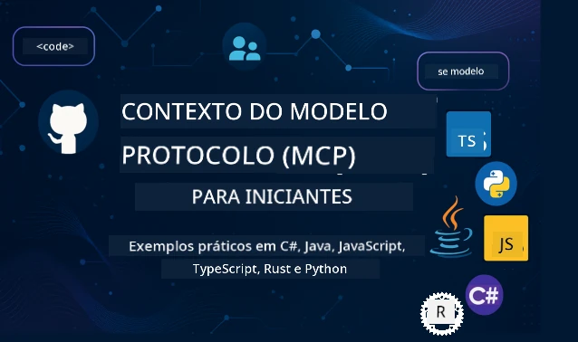

 

[](https://GitHub.com/microsoft/mcp-for-beginners/graphs/contributors)
[](https://GitHub.com/microsoft/mcp-for-beginners/issues)
[](https://GitHub.com/microsoft/mcp-for-beginners/pulls)
[](http://makeapullrequest.com)
[](https://mcptoplist.com/server/mcp.so%2Fmcp-for-beginners%2Fmicrosoft)

[](https://GitHub.com/microsoft/mcp-for-beginners/watchers)
[](https://GitHub.com/microsoft/mcp-for-beginners/fork)
[](https://GitHub.com/microsoft/mcp-for-beginners/stargazers)


[](https://discord.gg/nTYy5BXMWG)

Siga estes passos para começar a usar estes recursos:
1. **Faça um Fork do Repositório**: Clique [](https://GitHub.com/microsoft/mcp-for-beginners/fork)
2. **Clone o Repositório**:   `git clone https://github.com/microsoft/mcp-for-beginners.git`
3. **Junte-se ao** [](https://discord.gg/nTYy5BXMWG)


### 🌐 Suporte Multilíngue

#### Suportado via GitHub Action (Automatizado & Sempre Atualizado)

<!-- CO-OP TRANSLATOR LANGUAGES TABLE START -->
[Arabic](../ar/README.md) | [Bengali](../bn/README.md) | [Bulgarian](../bg/README.md) | [Burmese (Myanmar)](../my/README.md) | [Chinese (Simplified)](../zh-CN/README.md) | [Chinese (Traditional, Hong Kong)](../zh-HK/README.md) | [Chinese (Traditional, Macau)](../zh-MO/README.md) | [Chinese (Traditional, Taiwan)](../zh-TW/README.md) | [Croatian](../hr/README.md) | [Czech](../cs/README.md) | [Danish](../da/README.md) | [Dutch](../nl/README.md) | [Estonian](../et/README.md) | [Finnish](../fi/README.md) | [French](../fr/README.md) | [German](../de/README.md) | [Greek](../el/README.md) | [Hebrew](../he/README.md) | [Hindi](../hi/README.md) | [Hungarian](../hu/README.md) | [Indonesian](../id/README.md) | [Italian](../it/README.md) | [Japanese](../ja/README.md) | [Kannada](../kn/README.md) | [Khmer](../km/README.md) | [Korean](../ko/README.md) | [Lithuanian](../lt/README.md) | [Malay](../ms/README.md) | [Malayalam](../ml/README.md) | [Marathi](../mr/README.md) | [Nepali](../ne/README.md) | [Nigerian Pidgin](../pcm/README.md) | [Norwegian](../no/README.md) | [Persian (Farsi)](../fa/README.md) | [Polish](../pl/README.md) | [Portuguese (Brazil)](./README.md) | [Portuguese (Portugal)](../pt-PT/README.md) | [Punjabi (Gurmukhi)](../pa/README.md) | [Romanian](../ro/README.md) | [Russian](../ru/README.md) | [Serbian (Cyrillic)](../sr/README.md) | [Slovak](../sk/README.md) | [Slovenian](../sl/README.md) | [Spanish](../es/README.md) | [Swahili](../sw/README.md) | [Swedish](../sv/README.md) | [Tagalog (Filipino)](../tl/README.md) | [Tamil](../ta/README.md) | [Telugu](../te/README.md) | [Thai](../th/README.md) | [Turkish](../tr/README.md) | [Ukrainian](../uk/README.md) | [Urdu](../ur/README.md) | [Vietnamese](../vi/README.md)

> **Prefere Clonar Localmente?**
>
> Este repositório inclui mais de 50 traduções de idiomas, o que aumenta significativamente o tamanho do download. Para clonar sem as traduções, use o sparse checkout:
>
> **Bash / macOS / Linux:**
> ```bash
> git clone --filter=blob:none --sparse https://github.com/microsoft/mcp-for-beginners.git
> cd mcp-for-beginners
> git sparse-checkout set --no-cone '/*' '!translations' '!translated_images'
> ```
>
> **CMD (Windows):**
> ```cmd
> git clone --filter=blob:none --sparse https://github.com/microsoft/mcp-for-beginners.git
> cd mcp-for-beginners
> git sparse-checkout set --no-cone "/*" "!translations" "!translated_images"
> ```
>
> Isso fornece tudo que você precisa para completar o curso com um download muito mais rápido.
<!-- CO-OP TRANSLATOR LANGUAGES TABLE END -->

# 🚀 Currículo do Model Context Protocol (MCP) para Iniciantes

## **Aprenda MCP com Exemplos Práticos em C#, Java, JavaScript, Rust, Python e TypeScript**

## 🧠 Visão Geral do Currículo do Model Context Protocol
Bem-vindo à sua jornada pelo Model Context Protocol! Se você já se perguntou como aplicações de IA se comunicam com diferentes ferramentas e serviços, você está prestes a descobrir a solução elegante que está transformando a forma como os desenvolvedores constroem sistemas inteligentes.

Pense no MCP como um tradutor universal para aplicações de IA - assim como as portas USB permitem conectar qualquer dispositivo ao seu computador, o MCP permite que modelos de IA se conectem a qualquer ferramenta ou serviço de maneira padronizada. Seja você criando seu primeiro chatbot ou trabalhando em fluxos complexos de IA, entender MCP lhe dará o poder de criar aplicações mais capazes e flexíveis.

Este currículo foi elaborado com paciência e cuidado para a sua jornada de aprendizado. Começaremos com conceitos simples que você já conhece e gradualmente construiremos sua expertise por meio de prática direta na sua linguagem de programação favorita. Cada passo inclui explicações claras, exemplos práticos e muito incentivo ao longo do caminho.

Ao completar esta jornada, você terá confiança para construir seus próprios servidores MCP, integrá-los com plataformas populares de IA e entender como essa tecnologia está remodelando o futuro do desenvolvimento de IA. Vamos começar essa aventura emocionante juntos!

### Documentação Oficial e Especificações

Este currículo está alinhado com a **Especificação MCP 2025-11-25** (a versão estável mais recente). A especificação MCP utiliza versionamento baseado em datas (formato AAAA-MM-DD) para garantir o acompanhamento claro da versão do protocolo.

> **Olhando para o futuro:** um release candidate para a próxima versão da especificação, **2026-07-28**, está programado para ser lançado em 28 de julho de 2026. Ele torna o protocolo sem estado na camada de transporte, formaliza um framework de Extensões (Aplicativos MCP, Tarefas), fortalece a autorização e descontinua Roots, Sampling e Logging. Veja [O que está mudando no MCP: O Release Candidate 2026-07-28](./01-CoreConcepts/mcp-2026-07-28-release-candidate.md) para um detalhamento completo.

Esses recursos se tornam mais valiosos conforme seu entendimento cresce, mas não se sinta pressionado a ler tudo imediatamente. Comece pelas áreas que mais lhe interessam!
- 📘 [Documentação MCP](https://modelcontextprotocol.io/) – Este é seu recurso principal para tutoriais passo a passo e guias do usuário. A documentação é escrita pensando em iniciantes, fornecendo exemplos claros que você pode acompanhar no seu próprio ritmo.
- 📜 [Especificação MCP](https://modelcontextprotocol.io/specification/2025-11-25) – Pense nisso como seu manual de referência completo. Conforme você avança no currículo, você vai voltar aqui para consultar detalhes específicos e explorar funcionalidades avançadas.
- 📜 [Versionamento da Especificação MCP](https://modelcontextprotocol.io/specification/versioning) – Contém informações sobre o histórico de versões do protocolo e sobre como o MCP usa versionamento baseado em datas (formato AAAA-MM-DD).
- 🧑‍💻 [Repositório MCP no GitHub](https://github.com/modelcontextprotocol) – Aqui você encontrará SDKs, ferramentas e exemplos de código em várias linguagens de programação. É como um tesouro de exemplos práticos e componentes prontos para uso.
- 🌐 [Comunidade MCP](https://github.com/orgs/modelcontextprotocol/discussions) – Junte-se a outros aprendizes e desenvolvedores experientes em discussões sobre MCP. É uma comunidade acolhedora onde perguntas são bem-vindas e o conhecimento é compartilhado livremente.
  
## Objetivos de Aprendizagem

Ao final deste currículo, você se sentirá confiante e entusiasmado com suas novas habilidades. Aqui está o que você irá alcançar:

• **Compreender os fundamentos do MCP**: Você entenderá o que é o Model Context Protocol e por que ele está revolucionando a forma como aplicações de IA trabalham juntas, usando analogias e exemplos que fazem sentido.

• **Construir seu primeiro servidor MCP**: Você criará um servidor MCP funcional na sua linguagem de programação preferida, começando com exemplos simples e desenvolvendo suas habilidades passo a passo.

• **Conectar modelos de IA a ferramentas reais**: Você aprenderá como fazer a ponte entre modelos de IA e serviços reais, dando às suas aplicações capacidades poderosas.

• **Implementar práticas recomendadas de segurança**: Você entenderá como manter suas implementações de MCP seguras, protegendo tanto suas aplicações quanto seus usuários.

• **Fazer deploy com confiança**: Você saberá como levar seus projetos MCP do desenvolvimento à produção, com estratégias práticas de implantação que funcionam no mundo real.

• **Entrar para a comunidade MCP**: Você fará parte de uma comunidade crescente de desenvolvedores que estão moldando o futuro do desenvolvimento de aplicações de IA. 

## Fundamentos Essenciais

Antes de mergulharmos nos detalhes do MCP, vamos garantir que você esteja confortável com alguns conceitos fundamentais. Não se preocupe se você não for um especialista nessas áreas - vamos explicar tudo que você precisa saber conforme avançamos!

### Compreendendo Protocolos (A Fundação)

Pense em um protocolo como as regras para uma conversa. Quando você liga para um amigo, vocês dois sabem dizer "olá" ao atender, revezar para falar e dizer "tchau" quando terminam. Programas de computador precisam de regras semelhantes para se comunicarem efetivamente.

MCP é um protocolo - um conjunto de regras acordadas que ajudam modelos e aplicações de IA a terem "conversas" produtivas com ferramentas e serviços. Assim como as regras de conversa tornam a comunicação humana mais fluida, o MCP torna a comunicação de aplicações de IA muito mais confiável e poderosa.

### Relações Cliente-Servidor (Como Programas Trabalham Juntos)

Você já usa relações cliente-servidor todos os dias! Quando você usa um navegador (o cliente) para visitar um site, você está se conectando a um servidor web que envia o conteúdo da página. O navegador sabe como pedir informações, e o servidor sabe como responder.

No MCP, temos uma relação semelhante: modelos de IA atuam como clientes que solicitam informações ou ações, enquanto servidores MCP fornecem essas capacidades. É como ter um assistente prestativo (o servidor) que a IA pode pedir para realizar tarefas específicas.

### Por Que a Padronização Importa (Fazendo as Coisas Funcionar Juntas)

Imagine se cada fabricante de carro usasse bicos de gasolina com formatos diferentes - você precisaria de um adaptador diferente para cada carro! Padronização significa concordar em abordagens comuns para que as coisas funcionem juntas perfeitamente.

O MCP fornece essa padronização para aplicações de IA. Em vez de cada modelo de IA precisar de código personalizado para trabalhar com cada ferramenta, o MCP cria uma maneira universal para eles se comunicarem. Isso significa que desenvolvedores podem construir ferramentas uma vez e fazê-las funcionar com muitos sistemas de IA diferentes.

## 🧭 Visão Geral do Seu Caminho de Aprendizagem

Sua jornada MCP é cuidadosamente estruturada para aumentar sua confiança e habilidades progressivamente. Cada fase introduz novos conceitos enquanto reforça o que você já aprendeu.

### 🌱 Fase Fundação: Entendendo o Básico (Módulos 0-2)

Aqui é onde sua aventura começa! Vamos apresentar os conceitos do MCP usando analogias familiares e exemplos simples. Você entenderá o que é o MCP, por que ele existe e como ele se encaixa no mundo maior do desenvolvimento de IA.


• **Módulo 0 - Introdução ao MCP**: Começaremos explorando o que é MCP e por que ele é tão importante para aplicações modernas de IA. Você verá exemplos reais de MCP em ação e entenderá como ele resolve problemas comuns enfrentados por desenvolvedores.

• **Módulo 1 - Conceitos Básicos Explicados**: Aqui você aprenderá os blocos de construção essenciais do MCP. Usaremos muitas analogias e exemplos visuais para garantir que esses conceitos pareçam naturais e compreensíveis.

• **Módulo 2 - Segurança no MCP**: Segurança pode parecer intimidadora, mas mostraremos como o MCP inclui recursos de segurança embutidos e ensinaremos as melhores práticas para proteger suas aplicações desde o início.

### 🔨 Fase de Construção: Criando Suas Primeiras Implementações (Módulo 3)

Agora a diversão começa de verdade! Você terá experiência prática construindo servidores e clientes MCP reais. Não se preocupe - começaremos simples e o guiaremos em cada passo.

Este módulo inclui vários guias práticos que permitem que você pratique na linguagem de programação preferida. Você criará seu primeiro servidor, construirá um cliente para se conectar a ele e até integrará com ferramentas populares de desenvolvimento como o VS Code.

Cada guia inclui exemplos completos de código, dicas de solução de problemas e explicações de por que fazemos escolhas de design específicas. Ao final desta fase, você terá implementações MCP funcionando das quais poderá se orgulhar!

### 🚀 Fase de Expansão: Conceitos Avançados e Aplicação no Mundo Real (Módulos 4-5)

Com o básico dominado, você está pronto para explorar recursos mais sofisticados do MCP. Cobriremos estratégias práticas de implementação, técnicas de depuração e tópicos avançados como integração de IA multimodal.

Você também aprenderá como escalar suas implementações MCP para uso em produção e integrar com plataformas em nuvem como Azure. Estes módulos preparam você para construir soluções MCP que podem lidar com demandas reais.

### 🌟 Fase de Maestria: Comunidade e Especialização (Módulos 6-11)

A fase final foca em ingressar na comunidade MCP e se especializar nas áreas que mais lhe interessam. Você aprenderá como contribuir para projetos MCP open source, implementar padrões avançados de autenticação e construir soluções integradas com banco de dados.

O Módulo 11 merece menção especial - é um caminho completo de aprendizado prático com 13 laboratórios que ensina a construir servidores MCP prontos para produção com integração PostgreSQL. É como um projeto final que reúne tudo que você aprendeu!

### 📚 Estrutura Completa do Currículo

| Módulo | Tópico | Descrição | Link |
|--------|--------|-----------|------|
| **Módulo 0-3: Fundamentos** | | | |
| 00 | Introdução ao MCP | Visão geral do Model Context Protocol e sua importância em pipelines de IA | [Leia mais](./00-Introduction/README.md) |
| 01 | Conceitos Básicos Explicados | Exploração aprofundada dos conceitos centrais do MCP | [Leia mais](./01-CoreConcepts/README.md) |
| 1.1 | O Que Está Mudando no MCP (RC 2026-07-28) | Protocolo sem estado, framework de extensões e descontinuações de recursos na próxima versão da especificação | [Guia](./01-CoreConcepts/mcp-2026-07-28-release-candidate.md) |
| 02 | Segurança no MCP | Ameaças à segurança e melhores práticas | [Leia mais](./02-Security/README.md) |
| 03 | Começando com MCP | Configuração do ambiente, servidores/clientes básicos, integração | [Leia mais](./03-GettingStarted/README.md) |
| **Módulo 3: Construindo Seu Primeiro Servidor & Cliente** | | | |
| 3.1 | Primeiro Servidor | Crie seu primeiro servidor MCP | [Guia](./03-GettingStarted/01-first-server/README.md) |
| 3.2 | Primeiro Cliente | Desenvolva um cliente MCP básico | [Guia](./03-GettingStarted/02-client/README.md) |
| 3.3 | Cliente com LLM | Integre modelos de linguagem grandes | [Guia](./03-GettingStarted/03-llm-client/README.md) |
| 3.4 | Integração com VS Code | Consuma servidores MCP no VS Code | [Guia](./03-GettingStarted/04-vscode/README.md) |
| 3.5 | Servidor stdio | Crie servidores usando transporte stdio | [Guia](./03-GettingStarted/05-stdio-server/README.md) |
| 3.6 | Streaming HTTP | Implemente streaming HTTP no MCP | [Guia](./03-GettingStarted/06-http-streaming/README.md) |
| 3.7 | Microsoft Foundry Toolkit | Use Microsoft Foundry Toolkit com MCP | [Guia](./03-GettingStarted/07-aitk/README.md) |
| 3.8 | Testes | Teste sua implementação de servidor MCP | [Guia](./03-GettingStarted/08-testing/README.md) |
| 3.9 | Implantação | Faça deploy de servidores MCP para produção | [Guia](./03-GettingStarted/09-deployment/README.md) |
| 3.10 | Uso avançado de servidor | Use servidores avançados para uso de recursos avançados e arquitetura aprimorada | [Guia](./03-GettingStarted/10-advanced/README.md) |
| 3.11 | Autenticação simples | Um capítulo mostrando autenticação desde o início e RBAC | [Guia](./03-GettingStarted/11-simple-auth/README.md) |
| 3.12 | Hosts MCP | Configure Claude Desktop, Cursor, Cline e outros hosts MCP | [Guia](./03-GettingStarted/12-mcp-hosts/README.md) |
| 3.13 | MCP Inspector | Depure e teste servidores MCP com a ferramenta Inspector | [Guia](./03-GettingStarted/13-mcp-inspector/README.md) |
| 3.14 | Amostragem | Use amostragem para colaborar com o cliente | [Guia](./03-GettingStarted/14-sampling/README.md) |
| 3.15 | Aplicativos MCP | Construa Aplicativos MCP | [Guia](./03-GettingStarted/15-mcp-apps/README.md) |
| **Módulo 4-5: Prático & Avançado** | | | |
| 04 | Implementação Prática | SDKs, depuração, testes, templates reutilizáveis de prompt | [Leia mais](./04-PracticalImplementation/README.md) |
| 4.1 | Paginação | Gerencie grandes conjuntos de resultados com paginação baseada em cursor | [Guia](./04-PracticalImplementation/pagination/README.md) |
| 05 | Tópicos Avançados no MCP | IA multimodal, escalabilidade, uso empresarial | [Leia mais](./05-AdvancedTopics/README.md) |
| 5.1 | Integração Azure | Integração MCP com Azure | [Guia](./05-AdvancedTopics/mcp-integration/README.md) |
| 5.2 | Multimodalidade | Trabalhando com múltiplas modalidades | [Guia](./05-AdvancedTopics/mcp-multi-modality/README.md) |
| 5.3 | Demonstração OAuth2 | Implemente autenticação OAuth2 | [Guia](./05-AdvancedTopics/mcp-oauth2-demo/README.md) |
| 5.4 | Contextos Raiz | Entenda e implemente contextos raiz | [Guia](./05-AdvancedTopics/mcp-root-contexts/README.md) |
| 5.5 | Roteamento | Estratégias de roteamento MCP | [Guia](./05-AdvancedTopics/mcp-routing/README.md) |
| 5.6 | Amostragem | Técnicas de amostragem no MCP | [Guia](./05-AdvancedTopics/mcp-sampling/README.md) |
| 5.7 | Escalabilidade | Escale implementações MCP | [Guia](./05-AdvancedTopics/mcp-scaling/README.md) |
| 5.8 | Segurança | Considerações avançadas de segurança | [Guia](./05-AdvancedTopics/mcp-security/README.md) |
| 5.9 | Pesquisa Web | Implemente capacidades de pesquisa web | [Guia](./05-AdvancedTopics/web-search-mcp/README.md) |
| 5.10 | Streaming em Tempo Real | Construa funcionalidade de streaming em tempo real | [Guia](./05-AdvancedTopics/mcp-realtimestreaming/README.md) |
| 5.11 | Pesquisa em Tempo Real | Implemente pesquisa em tempo real | [Guia](./05-AdvancedTopics/mcp-realtimesearch/README.md) |
| 5.12 | Autenticação Entra ID | Autenticação com Microsoft Entra ID | [Guia](./05-AdvancedTopics/mcp-security-entra/README.md) |
| 5.13 | Integração Foundry | Integre com Microsoft Foundry | [Guia](./05-AdvancedTopics/mcp-foundry-agent-integration/README.md) |
| 5.14 | Engenharia de Contexto | Técnicas para engenharia eficaz de contexto | [Guia](./05-AdvancedTopics/mcp-contextengineering/README.md) |
| 5.15 | Transporte Personalizado MCP | Implementações de transporte personalizado | [Guia](./05-AdvancedTopics/mcp-transport/README.md) |
| 5.16 | Recursos do Protocolo | Notificações de progresso, cancelamento, templates de recursos | [Guia](./05-AdvancedTopics/mcp-protocol-features/README.md) |
| 5.17 | Raciocínio Multiagente Adversarial | Dois agentes argumentam lados opostos usando ferramentas MCP compartilhadas, avaliados por um agente juiz | [Guia](./05-AdvancedTopics/mcp-adversarial-agents/README.md) |
| **Módulo 6-10: Comunidade & Melhores Práticas** | | | |
| 06 | Contribuições da Comunidade | Como contribuir para o ecossistema MCP | [Guia](./06-CommunityContributions/README.md) |
| 07 | Lições da Adoção Inicial | Histórias de implementação no mundo real | [Guia](./07-LessonsfromEarlyAdoption/README.md) |
| 08 | Melhores Práticas para MCP | Performance, tolerância a falhas, resiliência | [Guia](./08-BestPractices/README.md) |
| 09 | Estudos de Caso MCP | Exemplos de implementação prática | [Guia](./09-CaseStudy/README.md) |
| 10 | Workshop Prático | Construindo um Servidor MCP com Microsoft Foundry Toolkit | [Laboratório](./10-StreamliningAIWorkflowsBuildingAnMCPServerWithAIToolkit/README.md) |
| **Módulo 11: Laboratório Prático de Servidor MCP** | | | |
| 11 | Integração de Banco de Dados do Servidor MCP | Caminho completo de aprendizado prático com 13 laboratórios para integração PostgreSQL | [Laboratórios](./11-MCPServerHandsOnLabs/README.md) |
| 11.1 | Introdução | Visão geral do MCP com integração de banco de dados e caso de uso de análise no varejo | [Laboratório 00](./11-MCPServerHandsOnLabs/00-Introduction/README.md) |
| 11.2 | Arquitetura Central | Entendendo arquitetura do servidor MCP, camadas de banco de dados e padrões de segurança | [Laboratório 01](./11-MCPServerHandsOnLabs/01-Architecture/README.md) |
| 11.3 | Segurança & Multi-Tenancy | Segurança a nível de linha, autenticação e acesso multi-inquilino a dados | [Laboratório 02](./11-MCPServerHandsOnLabs/02-Security/README.md) |
| 11.4 | Configuração do Ambiente | Configurando ambiente de desenvolvimento, Docker, recursos Azure | [Laboratório 03](./11-MCPServerHandsOnLabs/03-Setup/README.md) |
| 11.5 | Design do Banco de Dados | Configuração PostgreSQL, design de esquema para varejo e dados de amostra | [Laboratório 04](./11-MCPServerHandsOnLabs/04-Database/README.md) |
| 11.6 | Implementação do Servidor MCP | Construindo o servidor FastMCP com integração de banco de dados | [Laboratório 05](./11-MCPServerHandsOnLabs/05-MCP-Server/README.md) |
| 11.7 | Desenvolvimento de Ferramentas | Criando ferramentas de consulta a banco de dados e introspecção de esquema | [Laboratório 06](./11-MCPServerHandsOnLabs/06-Tools/README.md) |
| 11.8 | Pesquisa Semântica | Implementando embeddings vetoriais com Azure OpenAI e pgvector | [Laboratório 07](./11-MCPServerHandsOnLabs/07-Semantic-Search/README.md) |
| 11.9 | Testes & Depuração | Estratégias de teste, ferramentas de depuração e abordagens de validação | [Laboratório 08](./11-MCPServerHandsOnLabs/08-Testing/README.md) |
| 11.10 | Integração VS Code | Configuração da integração MCP no VS Code e uso de AI Chat | [Laboratório 09](./11-MCPServerHandsOnLabs/09-VS-Code/README.md) |
| 11.11 | Estratégias de Implantação | Implantação com Docker, Azure Container Apps e considerações de escalonamento | [Laboratório 10](./11-MCPServerHandsOnLabs/10-Deployment/README.md) |
| 11.12 | Monitoramento | Application Insights, logging, monitoramento de performance | [Laboratório 11](./11-MCPServerHandsOnLabs/11-Monitoring/README.md) |
| 11.13 | Melhores Práticas | Otimização de performance, fortalecimento de segurança e dicas para produção | [Laboratório 12](./11-MCPServerHandsOnLabs/12-Best-Practices/README.md) |
| **Módulo 12: Ferramentas MCP** | | | |
| 12.1 | Ferramentas | Uso do MCP no Copilot App | [ Guia ](./12-tooling/README.md) |

### 💻 Projetos de Código de Exemplo

Uma das partes mais empolgantes de aprender MCP é ver suas habilidades de código se desenvolverem progressivamente. Projetamos nossos exemplos de código para começar simples e se tornarem mais sofisticados à medida que seu entendimento aprofunda. Aqui está como introduzimos conceitos - com código fácil de entender, mas que demonstra princípios reais do MCP, você entenderá não apenas o que este código faz, mas por que está estruturado dessa maneira e como ele se encaixa em aplicações maiores do MCP.

#### Exemplos Básicos de Calculadora MCP

| Linguagem | Descrição | Link |
|----------|-----------|------|

| C# | Exemplo de Servidor MCP | [Ver Código](./03-GettingStarted/samples/csharp/README.md) |
| Java | Calculadora MCP | [Ver Código](./03-GettingStarted/samples/java/calculator/README.md) |
| JavaScript | Demonstração MCP | [Ver Código](./03-GettingStarted/samples/javascript/README.md) |
| Python | Servidor MCP | [Ver Código](../../03-GettingStarted/samples/python/mcp_calculator_server.py) |
| TypeScript | Exemplo MCP | [Ver Código](./03-GettingStarted/samples/typescript/README.md) |
| Rust | Exemplo MCP | [Ver Código](./03-GettingStarted/samples/rust/README.md) |

#### Implementações Avançadas de MCP

| Linguagem | Descrição | Link |
|----------|-------------|------|
| C# | Exemplo Avançado | [Ver Código](./04-PracticalImplementation/samples/csharp/README.md) |
| Java com Spring | Exemplo de Aplicativo Container | [Ver Código](./04-PracticalImplementation/samples/java/containerapp/README.md) |
| JavaScript | Exemplo Avançado | [Ver Código](./04-PracticalImplementation/samples/javascript/README.md) |
| Python | Implementação Complexa | [Ver Código](./04-PracticalImplementation/samples/python/README.md) |
| TypeScript | Exemplo Container | [Ver Código](./04-PracticalImplementation/samples/typescript/README.md) |


## 🎯 Pré-requisitos para Aprender MCP

Para aproveitar ao máximo este currículo, você deve ter:

- Conhecimento básico de programação em pelo menos uma das seguintes linguagens: C#, Java, JavaScript, Python ou TypeScript
- Compreensão do modelo cliente-servidor e APIs
- Familiaridade com conceitos de REST e HTTP
- (Opcional) Conhecimentos básicos em conceitos de IA/ML

- Participação em discussões da comunidade para suporte

## 📚 Guia de Estudo e Recursos

Este repositório inclui vários recursos para ajudar você a navegar e aprender de forma eficaz:

### Guia de Estudo

Um [Guia de Estudo](./study_guide.md) abrangente está disponível para ajudar você a navegar neste repositório de forma eficaz. Este mapa visual do currículo mostra como todos os tópicos se conectam e oferece orientações sobre como usar os projetos de exemplo de modo eficiente. É especialmente útil se você for um aprendiz visual que gosta de ver o panorama geral.

O guia inclui:
- Um mapa visual do currículo mostrando todos os tópicos abordados
- Divisão detalhada de cada seção do repositório
- Orientação sobre como usar os projetos de exemplo
- Caminhos de aprendizado recomendados para diferentes níveis de habilidade
- Recursos adicionais para complementar sua jornada de aprendizado

### Registro de Alterações

Mantemos um [Registro de Alterações](./changelog.md) detalhado que acompanha todas as atualizações significativas dos materiais do currículo, para que você possa ficar atualizado com as últimas melhorias e adições.
- Adições de novos conteúdos
- Mudanças estruturais
- Melhorias de funcionalidades
- Atualizações na documentação

## 🛠️ Como Usar Este Currículo de Forma Eficaz

Cada lição neste guia inclui:

1. Explicações claras dos conceitos do MCP  
2. Exemplos de código ao vivo em várias linguagens  
3. Exercícios para construir aplicações reais de MCP  
4. Recursos extras para aprendizes avançados

### Vamos Aprender MCP com C# - Série de Tutoriais
Vamos aprender sobre o Model Context Protocol (MCP), uma estrutura inovadora projetada para padronizar as interações entre modelos de IA e aplicativos clientes. Nesta sessão amigável para iniciantes, vamos apresentar o MCP e guiá-lo na criação do seu primeiro servidor MCP.
#### C#: [https://aka.ms/letslearnmcp-csharp](https://aka.ms/letslearnmcp-csharp)
#### Java: [https://aka.ms/letslearnmcp-java](https://aka.ms/letslearnmcp-java)
#### JavaScript: [https://aka.ms/letslearnmcp-javascript](https://aka.ms/letslearnmcp-javascript)
#### Python: [https://aka.ms/letslearnmcp-python](https://aka.ms/letslearnmcp-python)

## 🎓 Sua Jornada com MCP Começa

Parabéns! Você acaba de dar o primeiro passo em uma jornada empolgante que vai expandir suas capacidades de programação e conectá-lo à vanguarda do desenvolvimento de IA.

### O Que Você Já Conquistou

Ao ler esta introdução, você já começou a construir sua base de conhecimento sobre MCP. Você entende o que é MCP, por que é importante e como este currículo apoiará sua jornada de aprendizado. Isso é uma conquista significativa e o início de sua expertise nesta tecnologia importante.

### A Aventura que Está por Vir

À medida que você avança pelos módulos, lembre-se de que todo especialista já foi um iniciante. Os conceitos que parecem complexos agora se tornarão naturais conforme você pratica e aplica-os. Cada pequeno passo constrói capacidades poderosas que vão servir para toda a sua carreira de desenvolvimento.

### Sua Rede de Apoio

Você está entrando para uma comunidade de aprendizes e especialistas apaixonados por MCP e ansiosos para ajudar outros a terem sucesso. Quer você esteja travado em um desafio de codificação ou empolgado para compartilhar uma descoberta, a comunidade está aqui para apoiar sua jornada.

Se você ficar travado ou tiver perguntas sobre como construir aplicativos de IA, junte-se a outros aprendizes e desenvolvedores experientes em discussões sobre MCP. É uma comunidade acolhedora onde perguntas são bem-vindas e o conhecimento é compartilhado livremente.

[](https://discord.gg/nTYy5BXMWG)

Se você tiver feedback sobre o produto ou encontrar erros durante a construção, visite:

[](https://aka.ms/foundry/forum)

### Pronto para Começar?

Sua aventura MCP começa agora! Inicie pelo Módulo 0 para mergulhar em suas primeiras experiências práticas com MCP, ou explore os projetos de exemplo para ver o que você vai construir. Lembre-se - todo especialista começou exatamente onde você está agora e, com paciência e prática, você ficará impressionado com o que pode alcançar.

Bem-vindo ao mundo do desenvolvimento do Model Context Protocol. Vamos construir algo incrível juntos!

## 🤝 Contribuindo para a Comunidade de Aprendizado

Este currículo se fortalece com contribuições de aprendizes como você! Seja corrigindo um erro de digitação, sugerindo uma explicação mais clara ou adicionando um novo exemplo, suas contribuições ajudam outros iniciantes a terem sucesso.

Agradecimentos ao Microsoft Valued Professional [Shivam Goyal](https://www.linkedin.com/in/shivam2003/) por contribuir com amostras de código.

O processo de contribuição é projetado para ser acolhedor e solidário. A maioria das contribuições exige um Acordo de Licença de Contribuinte (CLA), mas as ferramentas automatizadas irão orientá-lo pelo processo de forma tranquila.

## 📜 Aprendizado Open Source

Todo este currículo está disponível sob a licença MIT [LICENSE](../../LICENSE), o que significa que você pode usar, modificar e compartilhar livremente. Isso apoia nossa missão de tornar o conhecimento do MCP acessível para desenvolvedores em todo lugar.
## 🤝 Diretrizes de Contribuição

Este projeto aceita contribuições e sugestões. A maioria das contribuições exige que você concorde com um
Acordo de Licença de Contribuinte (CLA) declarando que você tem o direito e realmente concede a nós
os direitos para usar sua contribuição. Para mais detalhes, visite <https://cla.opensource.microsoft.com>.

Quando você enviar um pull request, um bot de CLA determinará automaticamente se é necessário fornecer
um CLA e decorará a PR apropriadamente (por exemplo, verificação de status, comentário). Basta seguir as instruções
fornecidas pelo bot. Você precisará fazer isso apenas uma vez em todos os repositórios que usam nosso CLA.

Este projeto adotou o [Código de Conduta de Código Aberto da Microsoft](https://opensource.microsoft.com/codeofconduct/).
Para mais informações, consulte o [FAQ do Código de Conduta](https://opensource.microsoft.com/codeofconduct/faq/) ou
contate [opencode@microsoft.com](mailto:opencode@microsoft.com) para quaisquer perguntas ou comentários adicionais.

---

*Pronto para começar sua jornada no MCP? Comece com [Módulo 00 - Introdução ao MCP](./00-Introduction/README.md) e dê seus primeiros passos no mundo do desenvolvimento do Model Context Protocol!*


## 🎒 Outros Cursos
Nossa equipe produz outros cursos! Confira:

<!-- CO-OP TRANSLATOR OTHER COURSES START -->
### LangChain
[](https://aka.ms/langchain4j-for-beginners)
[](https://aka.ms/langchainjs-for-beginners?WT.mc_id=m365-94501-dwahlin)
[](https://github.com/microsoft/langchain-for-beginners?WT.mc_id=m365-94501-dwahlin)
---

### Azure / Edge / MCP / Agentes
[](https://github.com/microsoft/AZD-for-beginners?WT.mc_id=academic-105485-koreyst)
[](https://github.com/microsoft/edgeai-for-beginners?WT.mc_id=academic-105485-koreyst)
[](https://github.com/microsoft/mcp-for-beginners?WT.mc_id=academic-105485-koreyst)
[](https://github.com/microsoft/ai-agents-for-beginners?WT.mc_id=academic-105485-koreyst)

---
 
### Série de IA Generativa
[](https://github.com/microsoft/generative-ai-for-beginners?WT.mc_id=academic-105485-koreyst)
[-9333EA?style=for-the-badge&labelColor=E5E7EB&color=9333EA)](https://github.com/microsoft/Generative-AI-for-beginners-dotnet?WT.mc_id=academic-105485-koreyst)
[-C084FC?style=for-the-badge&labelColor=E5E7EB&color=C084FC)](https://github.com/microsoft/generative-ai-for-beginners-java?WT.mc_id=academic-105485-koreyst)
[-E879F9?style=for-the-badge&labelColor=E5E7EB&color=E879F9)](https://github.com/microsoft/generative-ai-with-javascript?WT.mc_id=academic-105485-koreyst)

---
 
### Aprendizado Básico
[](https://aka.ms/ml-beginners?WT.mc_id=academic-105485-koreyst)
[](https://aka.ms/datascience-beginners?WT.mc_id=academic-105485-koreyst)
[](https://aka.ms/ai-beginners?WT.mc_id=academic-105485-koreyst)

[](https://github.com/microsoft/Security-101?WT.mc_id=academic-96948-sayoung)
[](https://aka.ms/webdev-beginners?WT.mc_id=academic-105485-koreyst)
[](https://aka.ms/iot-beginners?WT.mc_id=academic-105485-koreyst)
[](https://github.com/microsoft/xr-development-for-beginners?WT.mc_id=academic-105485-koreyst)

---
 
### Série Copilot
[](https://aka.ms/GitHubCopilotAI?WT.mc_id=academic-105485-koreyst)
[](https://github.com/microsoft/mastering-github-copilot-for-dotnet-csharp-developers?WT.mc_id=academic-105485-koreyst)
[](https://github.com/microsoft/CopilotAdventures?WT.mc_id=academic-105485-koreyst)
<!-- CO-OP TRANSLATOR OTHER COURSES END -->

---

<!-- CO-OP TRANSLATOR DISCLAIMER START -->
**Aviso Legal**:
Este documento foi traduzido usando o serviço de tradução por IA [Co-op Translator](https://github.com/Azure/co-op-translator). Embora nos esforcemos pela precisão, por favor, esteja ciente de que traduções automatizadas podem conter erros ou imprecisões. O documento original em seu idioma nativo deve ser considerado a fonte autorizada. Para informações críticas, recomenda-se tradução profissional humana. Não nos responsabilizamos por quaisquer mal-entendidos ou interpretações incorretas decorrentes do uso desta tradução.
<!-- CO-OP TRANSLATOR DISCLAIMER END -->