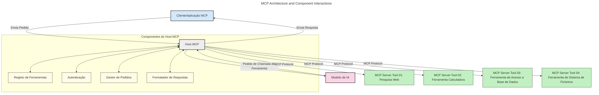
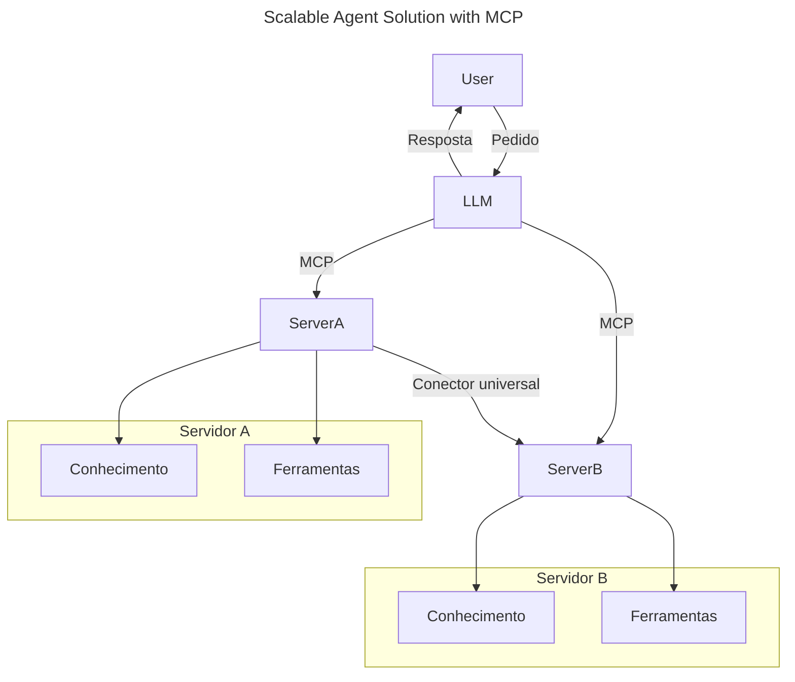
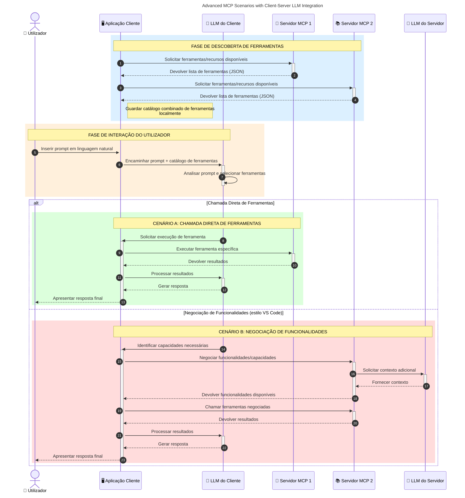

# Introdução ao Protocolo de Contexto do Modelo (MCP): Por que é importante para aplicações de IA escaláveis

_(Clique na imagem acima para ver o vídeo desta lição)_

As aplicações de IA generativa representam um grande avanço, pois frequentemente permitem ao utilizador interagir com a aplicação usando comandos em linguagem natural. No entanto, à medida que mais tempo e recursos são investidos nestas aplicações, é importante garantir que se podem integrar funcionalidades e recursos de forma fácil, de modo a que seja simples expandir, que a sua aplicação possa suportar mais do que um modelo e lidar com várias complexidades dos modelos. Em resumo, construir aplicações de IA generativa é fácil no início, mas à medida que crescem e se tornam mais complexas, precisa começar a definir uma arquitetura e provavelmente terá de recorrer a um padrão para garantir que as suas aplicações são construídas de forma consistente. É aqui que o MCP entra para organizar as coisas e fornecer um padrão.

---

## **🔍 O que é o Protocolo de Contexto do Modelo (MCP)?**

O **Protocolo de Contexto do Modelo (MCP)** é uma **interface aberta e padronizada** que permite que Grandes Modelos de Linguagem (LLMs) interajam de forma fluida com ferramentas externas, APIs e fontes de dados. Proporciona uma arquitetura consistente para melhorar a funcionalidade dos modelos de IA para além dos seus dados de treino, possibilitando sistemas de IA mais inteligentes, escaláveis e responsivos.

---

## **🎯 Por que a padronização em IA é importante**

À medida que as aplicações de IA generativa se tornam mais complexas, torna-se essencial adotar padrões que assegurem **escalabilidade, extensibilidade, manutenibilidade** e **evitem o aprisionamento a fornecedores**. O MCP responde a estas necessidades ao:

- Unificar as integrações modelo-ferramenta
- Reduzir soluções personalizadas frágeis e isoladas
- Permitir a coexistência de múltiplos modelos de diferentes fornecedores num único ecossistema

**Nota:** Embora o MCP se apresente como um padrão aberto, não há planos para a sua padronização através de organismos existentes como IEEE, IETF, W3C, ISO ou qualquer outra entidade de padronização.

---

## **📚 Objetivos de Aprendizagem**

No final deste artigo, será capaz de:

- Definir o **Protocolo de Contexto do Modelo (MCP)** e seus casos de uso
- Compreender como o MCP padroniza a comunicação entre modelo e ferramenta
- Identificar os componentes essenciais da arquitetura do MCP
- Explorar aplicações reais do MCP em contextos empresariais e de desenvolvimento

---

## **💡 Por que o Protocolo de Contexto do Modelo (MCP) é uma revolução**

### **🔗 MCP resolve a fragmentação nas interações de IA**

Antes do MCP, integrar modelos com ferramentas exigia:

- Código personalizado por par ferramenta-modelo
- APIs não padronizadas para cada fornecedor
- Quebras frequentes devido a atualizações
- Baixa escalabilidade com o aumento das ferramentas

### **✅ Benefícios da padronização MCP**

| **Benefício**            | **Descrição**                                                                   |
|--------------------------|--------------------------------------------------------------------------------|
| Interoperabilidade       | LLMs funcionam perfeitamente com ferramentas de diferentes fornecedores          |
| Consistência            | Comportamento uniforme em plataformas e ferramentas                              |
| Reutilização            | Ferramentas criadas uma vez podem ser usadas em vários projetos e sistemas       |
| Desenvolvimento acelerado | Reduz o tempo de desenvolvimento usando interfaces padronizadas e plug-and-play |

---

## **🧱 Visão geral da arquitetura MCP de alto nível**

O MCP segue um **modelo cliente-servidor**, onde:

- **Hosts MCP** executam os modelos de IA
- **Clientes MCP** iniciam as solicitações
- **Servidores MCP** fornecem contexto, ferramentas e capacidades

### **Componentes-chave:**

- **Recursos** – Dados estáticos ou dinâmicos para os modelos  
- **Prompts** – Fluxos de trabalho predefinidos para geração orientada  
- **Ferramentas** – Funções executáveis como pesquisa e cálculos  
- **Amostragem** – Comportamento agente via interações recursivas (obsoleto no
    MCP `2026-07-28`; novas implementações devem integrar diretamente com um fornecedor LLM)

- **Elicitação** – Solicitações iniciadas pelo servidor para entrada do utilizador
- **Raízes** – Localizações informacionais do sistema de ficheiros relevantes para um servidor
    (obsoleto no MCP `2026-07-28`; prefira parâmetros de ferramentas, URIs de recursos ou
    configuração do servidor)

### **Arquitetura do protocolo:**

O MCP usa uma arquitetura em duas camadas:
- **Camada de Dados**: mensagens JSON-RPC 2.0, metadados por pedido, descoberta e
    primitivas do protocolo
- **Camada de Transporte**: stdio para subprocessos locais e HTTP transmissível para
    servidores remotos. HTTP transmissível pode usar framing SSE para respostas transmitidas,
    mas o transporte HTTP+SSE mais antigo está obsoleto.

---

## Como funcionam os Servidores MCP

Os servidores MCP funcionam da seguinte maneira:

- **Fluxo de Requisição**:
    1. Uma solicitação é iniciada por um utilizador final ou software em seu nome.
    2. O **Cliente MCP** envia a solicitação para um **Host MCP**, que gere o runtime do Modelo de IA.
    3. O **Modelo de IA** recebe o prompt do utilizador e pode solicitar acesso a ferramentas externas ou dados através de uma ou mais chamadas de ferramentas.
    4. O **Host MCP**, e não o modelo diretamente, comunica com os **Servidores MCP** apropriados usando o protocolo padronizado.
- **Funcionalidade do Host MCP**:
    - **Registro de Ferramentas**: Mantém um catálogo de ferramentas disponíveis e suas capacidades.
    - **Autenticação**: Verifica permissões para acesso às ferramentas.
    - **Gestor de Solicitações**: Processa pedidos de ferramentas provenientes do modelo.
    - **Formatador de Respostas**: Estrutura as saídas das ferramentas num formato compreensível para o modelo.
- **Execução do Servidor MCP**:
    - O **Host MCP** direciona chamadas de ferramentas para um ou mais **Servidores MCP**, cada um expondo funções especializadas (ex.: pesquisa, cálculos, consultas a bases de dados).
    - Os **Servidores MCP** realizam as operações respectivas e devolvem os resultados ao **Host MCP** num formato consistente.
    - O **Host MCP** formata e encaminha esses resultados para o **Modelo de IA**.
- **Conclusão da Resposta**:
    - O **Modelo de IA** incorpora as saídas das ferramentas numa resposta final.
    - O **Host MCP** envia essa resposta de volta ao **Cliente MCP**, que a entrega ao utilizador final ou software que fez a chamada.
    

## 👨‍💻 Como construir um Servidor MCP (com exemplos)

Os servidores MCP permitem-lhe expandir as capacidades dos LLM fornecendo dados e funcionalidades. 

Pronto para experimentar? Aqui estão SDKs específicos de linguagem e/ou stack com exemplos de criação de servidores MCP simples em diferentes linguagens/stacks:

- **SDK Python**: https://github.com/modelcontextprotocol/python-sdk

- **SDK TypeScript**: https://github.com/modelcontextprotocol/typescript-sdk

- **SDK Java**: https://github.com/modelcontextprotocol/java-sdk

- **SDK C#/.NET**: https://github.com/modelcontextprotocol/csharp-sdk

## 🌍 Casos de uso reais do MCP

O MCP permite uma ampla gama de aplicações ao expandir as capacidades da IA:

| **Aplicação**               | **Descrição**                                                                |
|------------------------------|--------------------------------------------------------------------------------|
| Integração de Dados Empresariais | Conectar LLMs a bases de dados, CRMs ou ferramentas internas               |
| Sistemas de IA Agente         | Permitir agentes autónomos com acesso a ferramentas e fluxos de decisão       |
| Aplicações multimodais        | Combinar texto, imagem e áudio numa única aplicação de IA unificada           |
| Integração de Dados em Tempo Real | Trazer dados ao vivo para interações de IA para respostas mais precisas e atuais |

### 🧠 MCP = Padrão universal para interações de IA

O Protocolo de Contexto do Modelo (MCP) atua como um padrão universal para interações de IA, assim como o USB-C padronizou as ligações físicas para dispositivos. No mundo da IA, o MCP fornece uma interface consistente, permitindo que modelos (clientes) integrem-se sem problemas com ferramentas externas e fornecedores de dados (servidores). Isto elimina a necessidade de diversos protocolos personalizados para cada API ou fonte de dados.

Sob o MCP, uma ferramenta compatível (referida como servidor MCP) segue um padrão unificado. Estes servidores podem listar as ferramentas ou ações que oferecem e executar essas ações quando solicitadas por um agente de IA. Plataformas de agentes de IA que suportam MCP são capazes de descobrir ferramentas disponíveis nos servidores e invocá-las através deste protocolo padrão.

### 💡 Facilita o acesso ao conhecimento

Para além de oferecer ferramentas, o MCP também facilita o acesso ao conhecimento. Permite que aplicações forneçam contexto a grandes modelos de linguagem (LLMs) ligando-os a várias fontes de dados. Por exemplo, um servidor MCP pode representar o repositório de documentos de uma empresa, permitindo que agentes recuperem informações relevantes sob demanda. Outro servidor pode tratar ações específicas, como envio de emails ou atualização de registos. Da perspetiva do agente, estas são simplesmente ferramentas que pode usar – algumas ferramentas devolvem dados (contexto de conhecimento), enquanto outras executam ações. O MCP gere eficazmente ambos os casos.

Um agente que se conecta a um servidor MCP aprende automaticamente as capacidades disponíveis do servidor e os dados acessíveis através de um formato padrão. Esta padronização permite disponibilidade dinâmica das ferramentas. Por exemplo, adicionar um novo servidor MCP ao sistema do agente torna as suas funções imediatamente utilizáveis sem necessidade de personalização adicional das instruções do agente.

Esta integração simplificada alinha-se com o fluxo representado no seguinte diagrama, onde os servidores fornecem tanto ferramentas como conhecimento, garantindo uma colaboração fluida entre sistemas. 

### 👉 Exemplo: Solução de agente escalável

O Conector Universal permite que servidores MCP comuniquem e partilhem capacidades entre si, permitindo que o ServerA delegue tarefas ao ServerB ou aceda às suas ferramentas e conhecimento. Isto federar ferramentas e dados através de servidores, apoiando arquiteturas de agentes modulares e escaláveis. Porque o MCP padroniza a exposição de ferramentas, agentes podem descobrir dinamicamente e encaminhar pedidos entre servidores sem integrações codificadas.

Federação de ferramentas e conhecimento: ferramentas e dados podem ser acedidos entre servidores, permitindo arquiteturas agentes mais escaláveis e modulares.

### 🔄 Cenários avançados MCP com integração de LLM lado cliente

Para além da arquitetura básica MCP, existem cenários avançados onde tanto cliente como servidor contêm LLMs, permitindo interações mais sofisticadas. No diagrama seguinte, **Aplicação Cliente** poderia ser um IDE com várias ferramentas MCP disponíveis para uso pelo LLM:

## 🔐 Benefícios práticos do MCP

Aqui estão os benefícios práticos de usar o MCP:

- **Atualização**: Os modelos podem aceder a informação atualizada para além dos seus dados de treino
- **Extensão de capacidades**: Os modelos podem aproveitar ferramentas especializadas para tarefas para as quais não foram treinados
- **Redução de delírios**: Fontes externas de dados fornecem um fundamento factual
- **Privacidade**: Dados sensíveis podem permanecer em ambientes seguros em vez de serem incorporados nos prompts

## 📌 Conclusões principais

Seguem-se as principais conclusões para utilizar o MCP:

- O **MCP** padroniza como os modelos de IA interagem com ferramentas e dados
- Promove **extensibilidade, consistência, e interoperabilidade**
- O MCP ajuda a **reduzir tempo de desenvolvimento, melhorar a confiabilidade e expandir as capacidades do modelo**
- A arquitetura cliente-servidor **permite aplicações de IA flexíveis e extensíveis**

## 🧠 Exercício

Pense numa aplicação de IA que gostaria de construir.

- Quais **ferramentas externas ou dados** poderiam melhorar as suas capacidades?
- Como é que o MCP poderia tornar a integração **mais simples e fiável?**

## Recursos Adicionais

- [Repositório MCP no GitHub](https://github.com/modelcontextprotocol)

## O que vem a seguir

A seguir: [Capítulo 1: Conceitos Básicos](../01-CoreConcepts/README.md)

---

<!-- CO-OP TRANSLATOR DISCLAIMER START -->
**Aviso Legal**:
Este documento foi traduzido utilizando o serviço de tradução automática [Co-op Translator](https://github.com/Azure/co-op-translator). Embora nos esforcemos pela precisão, esteja ciente de que traduções automáticas podem conter erros ou imprecisões. O documento original na sua língua nativa deve ser considerado a fonte autorizada. Para informações críticas, recomenda-se tradução profissional humana. Não nos responsabilizamos por quaisquer mal-entendidos ou interpretações incorretas resultantes da utilização desta tradução.
<!-- CO-OP TRANSLATOR DISCLAIMER END -->