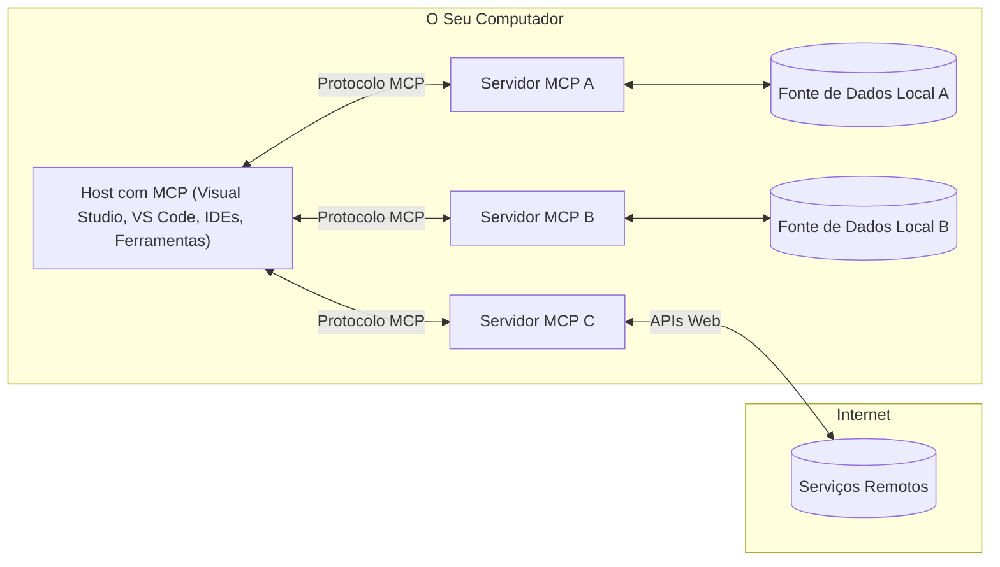

# Conceitos Fundamentais do MCP: Dominando o Protocolo de Contexto de Modelo para Integração de IA

[](https://youtu.be/earDzWGtE84)

_(Clique na imagem acima para ver o vídeo desta lição)_

O [Protocolo de Contexto de Modelo (MCP)](https://github.com/modelcontextprotocol) é uma estrutura poderosa e padronizada que otimiza a comunicação entre Grandes Modelos de Linguagem (LLMs) e ferramentas externas, aplicações e fontes de dados.  
Este guia irá conduzi-lo pelos conceitos fundamentais do MCP. Você aprenderá sobre a sua arquitetura cliente-servidor, componentes essenciais, mecânicas de comunicação e melhores práticas de implementação.

- **Consentimento Explícito do Utilizador**: Todo o acesso a dados e operações requer aprovação explícita do utilizador antes da execução. Os utilizadores devem compreender claramente quais dados serão acedidos e que ações serão realizadas, com controlo granular sobre permissões e autorizações.

- **Proteção da Privacidade dos Dados**: Os dados do utilizador só são expostos com consentimento explícito e devem ser protegidos por controlos de acesso robustos durante todo o ciclo de vida da interação. As implementações devem prevenir a transmissão não autorizada de dados e manter limites rigorosos de privacidade.

- **Segurança na Execução de Ferramentas**: Cada invocação de ferramenta requer consentimento explícito do utilizador com compreensão clara da funcionalidade da ferramenta, parâmetros e impacto potencial. Limites de segurança robustos devem prevenir execuções não intencionais, inseguras ou maliciosas.

- **Segurança na Camada de Transporte**: Todos os canais de comunicação devem usar mecanismos adequados de encriptação e autenticação. As ligações remotas devem implementar protocolos de transporte seguros e gestão adequada de credenciais.

#### Diretrizes de Implementação:

- **Gestão de Permissões**: Implementar sistemas de permissões granulares que permitam aos utilizadores controlar quais servidores, ferramentas e recursos são acessíveis  
- **Autenticação & Autorização**: Usar métodos seguros de autenticação (OAuth, chaves API) com gestão adequada de tokens e expiração  
- **Validação de Entrada**: Validar todos os parâmetros e entradas de dados conforme esquemas definidos para prevenir ataques de injeção  
- **Registo de Auditoria**: Manter registos abrangentes de todas as operações para monitorização de segurança e conformidade

## Visão Geral

Esta lição explora a arquitetura fundamental e os componentes que constituem o ecossistema do Protocolo de Contexto de Modelo (MCP). Você aprenderá sobre a arquitetura cliente-servidor, componentes chave e mecanismos de comunicação que alimentam as interações MCP.

## Objetivos Principais de Aprendizagem

No final desta lição, você irá:

- Compreender a arquitetura cliente-servidor do MCP.  
- Identificar os papéis e responsabilidades de Hosts, Clientes e Servidores.  
- Analisar as características centrais que tornam o MCP uma camada de integração flexível.  
- Aprender como a informação flui dentro do ecossistema MCP.  
- Obter insights práticos através de exemplos de código em .NET, Java, Python e JavaScript.

## Arquitetura MCP: Um Olhar Mais Profundo

O ecossistema MCP é construído sobre um modelo cliente-servidor. Esta estrutura modular permite que aplicações de IA interajam eficientemente com ferramentas, bases de dados, APIs e recursos contextuais. Vamos decompor esta arquitetura nos seus componentes principais.

No seu núcleo, o MCP segue uma arquitetura cliente-servidor onde uma aplicação host pode conectar-se a múltiplos servidores:


- **Hosts MCP**: Programas como VSCode, Claude Desktop, IDEs ou ferramentas de IA que querem aceder a dados através do MCP  
- **Clientes MCP**: Clientes do protocolo que mantêm ligações 1:1 com servidores  
- **Servidores MCP**: Programas leves que expõem capacidades específicas através do Protocolo de Contexto de Modelo padronizado  
- **Fontes de Dados Locais**: Ficheiros, bases de dados e serviços do seu computador que os servidores MCP podem aceder de forma segura  
- **Serviços Remotos**: Sistemas externos disponíveis pela internet que os servidores MCP podem conectar via APIs.

O Protocolo MCP é um padrão em evolução que usa versionamento baseado em datas (formato AAAA-MM-DD). A versão atual do protocolo é **2025-11-25**. Pode ver as últimas atualizações na [especificação do protocolo](https://modelcontextprotocol.io/specification/2025-11-25/)

### 1. Hosts

No Protocolo de Contexto de Modelo (MCP), os **Hosts** são aplicações de IA que servem como a interface principal através da qual os utilizadores interagem com o protocolo. Os Hosts coordenam e gerem ligações a múltiplos servidores MCP criando clientes MCP dedicados para cada ligação de servidor. Exemplos de Hosts incluem:

- **Aplicações de IA**: Claude Desktop, Visual Studio Code, Claude Code  
- **Ambientes de Desenvolvimento**: IDEs e editores de código com integração MCP  
- **Aplicações Personalizadas**: Agentes e ferramentas de IA construídos para propósitos específicos

Os **Hosts** são aplicações que coordenam interações com modelos de IA. Eles:

- **Orquestram Modelos de IA**: Executam ou interagem com LLMs para gerar respostas e coordenar fluxos de trabalho de IA  
- **Gerem Ligações de Clientes**: Criam e mantêm um cliente MCP por ligação a servidor MCP  
- **Controlam a Interface do Utilizador**: Gerem o fluxo da conversa, interações do utilizador e apresentação de respostas  
- **Imponhem Segurança**: Controlam permissões, restrições de segurança e autenticação  
- **Gerem Consentimento do Utilizador**: Administram a aprovação do utilizador para partilha de dados e execução de ferramentas

### 2. Clientes

Os **Clientes** são componentes essenciais que mantêm ligações dedicadas um-para-um entre Hosts e servidores MCP. Cada cliente MCP é instanciado pelo Host para conectar-se a um servidor MCP específico, garantindo canais de comunicação organizados e seguros. Múltiplos clientes permitem que Hosts se conectem a vários servidores simultaneamente.

Os **Clientes** são componentes de ligação dentro da aplicação host. Eles:

- **Comunicação do Protocolo**: Enviam pedidos JSON-RPC 2.0 aos servidores com prompts e instruções  
- **Negociação de Capacidades**: Negociam funcionalidades suportadas e versões do protocolo com servidores durante a inicialização  
- **Execução de Ferramentas**: Gerem pedidos de execução de ferramentas dos modelos e processam respostas  
- **Atualizações em Tempo Real**: Gerem notificações e atualizações em tempo real dos servidores  
- **Processamento de Respostas**: Processam e formatam respostas do servidor para apresentação aos utilizadores

### 3. Servidores

Os **Servidores** são programas que fornecem contexto, ferramentas e capacidades aos clientes MCP. Podem executar localmente (na mesma máquina que o Host) ou remotamente (em plataformas externas), e são responsáveis por tratar pedidos dos clientes e fornecer respostas estruturadas. Os servidores expõem funcionalidades específicas através do Protocolo de Contexto de Modelo padronizado.

Os **Servidores** são serviços que fornecem contexto e capacidades. Eles:

- **Registo de Funcionalidades**: Registam e expõem primitivas disponíveis (recursos, prompts, ferramentas) aos clientes  
- **Processamento de Pedidos**: Recebem e executam chamadas de ferramentas, pedidos de recursos e prompts dos clientes  
- **Fornecimento de Contexto**: Proporcionam informação contextual e dados para melhorar respostas do modelo  
- **Gestão de Estado**: Mantêm estado de sessão e gerem interações com estado quando necessário  
- **Notificações em Tempo Real**: Enviam notificações sobre alterações de capacidades e atualizações aos clientes ligados

Os servidores podem ser desenvolvidos por qualquer pessoa para estender capacidades do modelo com funcionalidades especializadas, e suportam cenários de implantação local e remota.

### 4. Primitivas do Servidor

Os servidores no Protocolo de Contexto de Modelo (MCP) fornecem três **primitivas** centrais que definem os blocos fundamentais para interações ricas entre clientes, hosts e modelos de linguagem. Estas primitivas especificam os tipos de informação contextual e ações disponíveis através do protocolo.

Os servidores MCP podem expor qualquer combinação das seguintes três primitivas centrais:

#### Recursos

**Recursos** são fontes de dados que fornecem informação contextual para aplicações de IA. Representam conteúdo estático ou dinâmico que pode melhorar a compreensão e tomada de decisão do modelo:

- **Dados Contextuais**: Informação estruturada e contexto para consumo do modelo de IA  
- **Bases de Conhecimento**: Repositórios de documentos, artigos, manuais e artigos de investigação  
- **Fontes de Dados Locais**: Ficheiros, bases de dados e informação do sistema local  
- **Dados Externos**: Respostas de APIs, serviços web e dados de sistemas remotos  
- **Conteúdo Dinâmico**: Dados em tempo real que se atualizam com base em condições externas

Os recursos são identificados por URIs e suportam descoberta através dos métodos `resources/list` e recuperação via `resources/read`:

```text
file://documents/project-spec.md
database://production/users/schema
api://weather/current
```

#### Prompts

**Prompts** são modelos reutilizáveis que ajudam a estruturar interações com modelos de linguagem. Fornecem padrões de interação padronizados e fluxos de trabalho modelados:

- **Interações Baseadas em Modelos**: Mensagens pré-estruturadas e iniciadores de conversa  
- **Modelos de Fluxo de Trabalho**: Sequências padronizadas para tarefas e interações comuns  
- **Exemplos Few-shot**: Modelos baseados em exemplos para instrução do modelo  
- **Prompts de Sistema**: Prompts fundamentais que definem comportamento e contexto do modelo  
- **Modelos Dinâmicos**: Prompts parametrizados que se adaptam a contextos específicos

Os prompts suportam substituição de variáveis e podem ser descobertos via `prompts/list` e recuperados com `prompts/get`:

```markdown
Generate a {{task_type}} for {{product}} targeting {{audience}} with the following requirements: {{requirements}}
```

#### Ferramentas

**Ferramentas** são funções executáveis que os modelos de IA podem invocar para realizar ações específicas. Representam os "verbos" do ecossistema MCP, permitindo que os modelos interajam com sistemas externos:

- **Funções Executáveis**: Operações discretas que os modelos podem invocar com parâmetros específicos  
- **Integração com Sistemas Externos**: Chamadas API, consultas a bases de dados, operações em ficheiros, cálculos  
- **Identidade Única**: Cada ferramenta tem um nome distinto, descrição e esquema de parâmetros  
- **I/O Estruturado**: Ferramentas aceitam parâmetros validados e retornam respostas estruturadas e tipadas  
- **Capacidades de Ação**: Permitem que modelos realizem ações no mundo real e obtenham dados em tempo real

As ferramentas são definidas com JSON Schema para validação de parâmetros e descobertas através de `tools/list` e executadas via `tools/call`:

```typescript
server.tool(
  "search_products", 
  {
    query: z.string().describe("Search query for products"),
    category: z.string().optional().describe("Product category filter"),
    max_results: z.number().default(10).describe("Maximum results to return")
  }, 
  async (params) => {
    // Executar pesquisa e retornar resultados estruturados
    return await productService.search(params);
  }
);
```

## Primitivas do Cliente

No Protocolo de Contexto de Modelo (MCP), os **clientes** podem expor primitivas que permitem aos servidores solicitar capacidades adicionais da aplicação host. Estas primitivas do lado do cliente permitem implementações de servidor mais ricas e interativas que podem aceder a capacidades do modelo de IA e interações do utilizador.

### Amostragem

A **Amostragem** permite que os servidores solicitem conclusões do modelo de linguagem da aplicação de IA do cliente. Esta primitiva permite que os servidores acedam às capacidades LLM sem incorporar as suas próprias dependências de modelo:

- **Acesso Independente do Modelo**: Os servidores podem solicitar conclusões sem incluir SDKs LLM ou gerir acesso ao modelo  
- **IA Iniciada pelo Servidor**: Permite que servidores gerem conteúdo autonomamente usando o modelo de IA do cliente  
- **Interações Recursivas LLM**: Suporta cenários complexos onde servidores precisam de assistência de IA para processamento  
- **Geração Dinâmica de Conteúdo**: Permite que servidores criem respostas contextuais usando o modelo do host

A amostragem é iniciada através do método `sampling/complete`, onde os servidores enviam pedidos de conclusão aos clientes.

### Elicitação

A **Elicitação** permite que os servidores solicitem informação adicional ou confirmação dos utilizadores através da interface do cliente:

- **Pedidos de Entrada do Utilizador**: Os servidores podem pedir informação adicional quando necessário para execução de ferramentas  
- **Diálogos de Confirmação**: Solicitar aprovação do utilizador para operações sensíveis ou impactantes  
- **Fluxos de Trabalho Interativos**: Permitem que servidores criem interações passo a passo com o utilizador  
- **Recolha Dinâmica de Parâmetros**: Recolher parâmetros em falta ou opcionais durante a execução da ferramenta

Os pedidos de elicitação são feitos usando o método `elicitation/request` para recolher entrada do utilizador através da interface do cliente.

### Registo

O **Registo** permite que os servidores enviem mensagens de log estruturadas aos clientes para depuração, monitorização e visibilidade operacional:

- **Suporte à Depuração**: Permite que servidores forneçam registos detalhados de execução para resolução de problemas  
- **Monitorização Operacional**: Enviar atualizações de estado e métricas de desempenho aos clientes  
- **Relato de Erros**: Fornecer contexto detalhado de erros e informação diagnóstica  
- **Traços de Auditoria**: Criar registos abrangentes das operações e decisões do servidor

As mensagens de registo são enviadas aos clientes para proporcionar transparência nas operações do servidor e facilitar a depuração.

## Fluxo de Informação no MCP

O Protocolo de Contexto de Modelo (MCP) define um fluxo estruturado de informação entre hosts, clientes, servidores e modelos. Compreender este fluxo ajuda a clarificar como os pedidos dos utilizadores são processados e como ferramentas externas e dados são integrados nas respostas do modelo.

- **Host Inicia Ligação**  
  A aplicação host (como um IDE ou interface de chat) estabelece uma ligação a um servidor MCP, tipicamente via STDIO, WebSocket ou outro transporte suportado.

- **Negociação de Capacidades**  
  O cliente (embutido no host) e o servidor trocam informação sobre as funcionalidades, ferramentas, recursos e versões do protocolo suportadas. Isto assegura que ambos os lados compreendem as capacidades disponíveis para a sessão.

- **Pedido do Utilizador**  
  O utilizador interage com o host (ex.: insere um prompt ou comando). O host recolhe esta entrada e passa-a ao cliente para processamento.

- **Uso de Recurso ou Ferramenta**  
  - O cliente pode solicitar contexto adicional ou recursos ao servidor (como ficheiros, entradas de base de dados ou artigos de base de conhecimento) para enriquecer a compreensão do modelo.  
  - Se o modelo determinar que uma ferramenta é necessária (ex.: para obter dados, realizar um cálculo ou chamar uma API), o cliente envia um pedido de invocação de ferramenta ao servidor, especificando o nome da ferramenta e parâmetros.

- **Execução pelo Servidor**  
  O servidor recebe o pedido de recurso ou ferramenta, executa as operações necessárias (como correr uma função, consultar uma base de dados ou recuperar um ficheiro) e devolve os resultados ao cliente num formato estruturado.

- **Geração de Resposta**  
  O cliente integra as respostas do servidor (dados de recurso, saídas de ferramentas, etc.) na interação contínua com o modelo. O modelo usa esta informação para gerar uma resposta abrangente e contextualmente relevante.

- **Apresentação do Resultado**  
  O host recebe a saída final do cliente e apresenta-a ao utilizador, frequentemente incluindo tanto o texto gerado pelo modelo como quaisquer resultados de execuções de ferramentas ou pesquisas de recursos.

Este fluxo permite que o MCP suporte aplicações de IA avançadas, interativas e conscientes do contexto, conectando modelos com ferramentas externas e fontes de dados de forma fluida.

## Arquitetura & Camadas do Protocolo

O MCP consiste em duas camadas arquitetónicas distintas que trabalham em conjunto para fornecer uma estrutura completa de comunicação:

### Camada de Dados

A **Camada de Dados** implementa o protocolo central MCP usando **JSON-RPC 2.0** como base. Esta camada define a estrutura das mensagens, semântica e padrões de interação:

#### Componentes Centrais:

- **Protocolo JSON-RPC 2.0**: Toda a comunicação usa o formato padronizado de mensagens JSON-RPC 2.0 para chamadas de método, respostas e notificações
- **Gestão do Ciclo de Vida**: Gere a inicialização da ligação, negociação de capacidades e terminação da sessão entre clientes e servidores
- **Primitivas do Servidor**: Permite que os servidores forneçam funcionalidades principais através de ferramentas, recursos e prompts
- **Primitivas do Cliente**: Permite que os servidores solicitem amostragem de LLMs, obtenham input do utilizador e enviem mensagens de registo
- **Notificações em Tempo Real**: Suporta notificações assíncronas para atualizações dinâmicas sem polling

#### Funcionalidades Principais:

- **Negociação da Versão do Protocolo**: Utiliza versionamento baseado em datas (AAAA-MM-DD) para garantir compatibilidade
- **Descoberta de Capacidades**: Clientes e servidores trocam informações sobre funcionalidades suportadas durante a inicialização
- **Sessões com Estado**: Mantém o estado da ligação ao longo de múltiplas interações para continuidade de contexto

### Camada de Transporte

A **Camada de Transporte** gere canais de comunicação, enquadramento de mensagens e autenticação entre participantes MCP:

#### Mecanismos de Transporte Suportados:

1. **Transporte STDIO**:
   - Utiliza fluxos de entrada/saída padrão para comunicação direta entre processos
   - Óptimo para processos locais na mesma máquina sem overhead de rede
   - Comumente usado para implementações locais de servidores MCP

2. **Transporte HTTP Streamable**:
   - Utiliza HTTP POST para mensagens cliente-servidor  
   - Opcionalmente Server-Sent Events (SSE) para streaming servidor-cliente
   - Permite comunicação remota entre servidores através de redes
   - Suporta autenticação HTTP padrão (tokens bearer, chaves API, cabeçalhos personalizados)
   - MCP recomenda OAuth para autenticação segura baseada em tokens

#### Abstração do Transporte:

A camada de transporte abstrai os detalhes de comunicação da camada de dados, permitindo o mesmo formato de mensagem JSON-RPC 2.0 em todos os mecanismos de transporte. Esta abstração permite que aplicações alternem entre servidores locais e remotos sem problemas.

### Considerações de Segurança

As implementações MCP devem aderir a vários princípios críticos de segurança para garantir interações seguras, confiáveis e protegidas em todas as operações do protocolo:

- **Consentimento e Controlo do Utilizador**: Os utilizadores devem fornecer consentimento explícito antes de qualquer acesso a dados ou execução de operações. Devem ter controlo claro sobre que dados são partilhados e quais ações são autorizadas, suportado por interfaces intuitivas para rever e aprovar atividades.

- **Privacidade dos Dados**: Os dados do utilizador só devem ser expostos com consentimento explícito e devem ser protegidos por controlos de acesso adequados. As implementações MCP devem proteger contra transmissão não autorizada de dados e garantir que a privacidade é mantida em todas as interações.

- **Segurança das Ferramentas**: Antes de invocar qualquer ferramenta, é necessário consentimento explícito do utilizador. Os utilizadores devem compreender claramente a funcionalidade de cada ferramenta, e limites de segurança robustos devem ser aplicados para evitar execuções não intencionais ou inseguras.

Seguindo estes princípios de segurança, o MCP assegura a confiança, privacidade e segurança do utilizador em todas as interações do protocolo, ao mesmo tempo que permite integrações poderosas de IA.

## Exemplos de Código: Componentes-Chave

A seguir estão exemplos de código em várias linguagens populares que ilustram como implementar componentes principais do servidor MCP e ferramentas.

### Exemplo .NET: Criar um Servidor MCP Simples com Ferramentas

Aqui está um exemplo prático em .NET que demonstra como implementar um servidor MCP simples com ferramentas personalizadas. Este exemplo mostra como definir e registar ferramentas, tratar pedidos e ligar o servidor usando o Model Context Protocol.

```csharp
using System;
using System.Threading.Tasks;
using ModelContextProtocol.Server;
using ModelContextProtocol.Server.Transport;
using ModelContextProtocol.Server.Tools;

public class WeatherServer
{
    public static async Task Main(string[] args)
    {
        // Create an MCP server
        var server = new McpServer(
            name: "Weather MCP Server",
            version: "1.0.0"
        );
        
        // Register our custom weather tool
        server.AddTool<string, WeatherData>("weatherTool", 
            description: "Gets current weather for a location",
            execute: async (location) => {
                // Call weather API (simplified)
                var weatherData = await GetWeatherDataAsync(location);
                return weatherData;
            });
        
        // Connect the server using stdio transport
        var transport = new StdioServerTransport();
        await server.ConnectAsync(transport);
        
        Console.WriteLine("Weather MCP Server started");
        
        // Keep the server running until process is terminated
        await Task.Delay(-1);
    }
    
    private static async Task<WeatherData> GetWeatherDataAsync(string location)
    {
        // This would normally call a weather API
        // Simplified for demonstration
        await Task.Delay(100); // Simulate API call
        return new WeatherData { 
            Temperature = 72.5,
            Conditions = "Sunny",
            Location = location
        };
    }
}

public class WeatherData
{
    public double Temperature { get; set; }
    public string Conditions { get; set; }
    public string Location { get; set; }
}
```

### Exemplo Java: Componentes do Servidor MCP

Este exemplo demonstra o mesmo servidor MCP e registo de ferramentas do exemplo .NET acima, mas implementado em Java.

```java
import io.modelcontextprotocol.server.McpServer;
import io.modelcontextprotocol.server.McpToolDefinition;
import io.modelcontextprotocol.server.transport.StdioServerTransport;
import io.modelcontextprotocol.server.tool.ToolExecutionContext;
import io.modelcontextprotocol.server.tool.ToolResponse;

public class WeatherMcpServer {
    public static void main(String[] args) throws Exception {
        // Criar um servidor MCP
        McpServer server = McpServer.builder()
            .name("Weather MCP Server")
            .version("1.0.0")
            .build();
            
        // Registar uma ferramenta de meteorologia
        server.registerTool(McpToolDefinition.builder("weatherTool")
            .description("Gets current weather for a location")
            .parameter("location", String.class)
            .execute((ToolExecutionContext ctx) -> {
                String location = ctx.getParameter("location", String.class);
                
                // Obter dados meteorológicos (simplificado)
                WeatherData data = getWeatherData(location);
                
                // Retornar resposta formatada
                return ToolResponse.content(
                    String.format("Temperature: %.1f°F, Conditions: %s, Location: %s", 
                    data.getTemperature(), 
                    data.getConditions(), 
                    data.getLocation())
                );
            })
            .build());
        
        // Ligar o servidor usando transporte stdio
        try (StdioServerTransport transport = new StdioServerTransport()) {
            server.connect(transport);
            System.out.println("Weather MCP Server started");
            // Manter o servidor a funcionar até o processo ser terminado
            Thread.currentThread().join();
        }
    }
    
    private static WeatherData getWeatherData(String location) {
        // A implementação chamaria uma API de meteorologia
        // Simplificado para fins de exemplo
        return new WeatherData(72.5, "Sunny", location);
    }
}

class WeatherData {
    private double temperature;
    private String conditions;
    private String location;
    
    public WeatherData(double temperature, String conditions, String location) {
        this.temperature = temperature;
        this.conditions = conditions;
        this.location = location;
    }
    
    public double getTemperature() {
        return temperature;
    }
    
    public String getConditions() {
        return conditions;
    }
    
    public String getLocation() {
        return location;
    }
}
```

### Exemplo Python: Construir um Servidor MCP

Este exemplo usa fastmcp, por favor assegure-se de o instalar primeiro:

```python
pip install fastmcp
```
Exemplo de Código:

```python
#!/usr/bin/env python3
import asyncio
from fastmcp import FastMCP
from fastmcp.transports.stdio import serve_stdio

# Criar um servidor FastMCP
mcp = FastMCP(
    name="Weather MCP Server",
    version="1.0.0"
)

@mcp.tool()
def get_weather(location: str) -> dict:
    """Gets current weather for a location."""
    return {
        "temperature": 72.5,
        "conditions": "Sunny",
        "location": location
    }

# Abordagem alternativa usando uma classe
class WeatherTools:
    @mcp.tool()
    def forecast(self, location: str, days: int = 1) -> dict:
        """Gets weather forecast for a location for the specified number of days."""
        return {
            "location": location,
            "forecast": [
                {"day": i+1, "temperature": 70 + i, "conditions": "Partly Cloudy"}
                for i in range(days)
            ]
        }

# Registar ferramentas da classe
weather_tools = WeatherTools()

# Iniciar o servidor
if __name__ == "__main__":
    asyncio.run(serve_stdio(mcp))
```

### Exemplo JavaScript: Criar um Servidor MCP

Este exemplo mostra a criação de um servidor MCP em JavaScript e como registar duas ferramentas relacionadas com o tempo.

```javascript
// Usar o SDK oficial do Protocolo de Contexto do Modelo
import { McpServer } from "@modelcontextprotocol/sdk/server/mcp.js";
import { StdioServerTransport } from "@modelcontextprotocol/sdk/server/stdio.js";
import { z } from "zod"; // Para validação de parâmetros

// Criar um servidor MCP
const server = new McpServer({
  name: "Weather MCP Server",
  version: "1.0.0"
});

// Definir uma ferramenta de meteorologia
server.tool(
  "weatherTool",
  {
    location: z.string().describe("The location to get weather for")
  },
  async ({ location }) => {
    // Normalmente, isto chamaria uma API de meteorologia
    // Simplificado para demonstração
    const weatherData = await getWeatherData(location);
    
    return {
      content: [
        { 
          type: "text", 
          text: `Temperature: ${weatherData.temperature}°F, Conditions: ${weatherData.conditions}, Location: ${weatherData.location}` 
        }
      ]
    };
  }
);

// Definir uma ferramenta de previsão
server.tool(
  "forecastTool",
  {
    location: z.string(),
    days: z.number().default(3).describe("Number of days for forecast")
  },
  async ({ location, days }) => {
    // Normalmente, isto chamaria uma API de meteorologia
    // Simplificado para demonstração
    const forecast = await getForecastData(location, days);
    
    return {
      content: [
        { 
          type: "text", 
          text: `${days}-day forecast for ${location}: ${JSON.stringify(forecast)}` 
        }
      ]
    };
  }
);

// Funções auxiliares
async function getWeatherData(location) {
  // Simular chamada à API
  return {
    temperature: 72.5,
    conditions: "Sunny",
    location: location
  };
}

async function getForecastData(location, days) {
  // Simular chamada à API
  return Array.from({ length: days }, (_, i) => ({
    day: i + 1,
    temperature: 70 + Math.floor(Math.random() * 10),
    conditions: i % 2 === 0 ? "Sunny" : "Partly Cloudy"
  }));
}

// Ligar o servidor usando transporte stdio
const transport = new StdioServerTransport();
server.connect(transport).catch(console.error);

console.log("Weather MCP Server started");
```

Este exemplo em JavaScript demonstra como criar um cliente MCP que se liga a um servidor, envia um prompt e processa a resposta incluindo quaisquer chamadas a ferramentas que foram feitas.

## Segurança e Autorização

O MCP inclui vários conceitos e mecanismos incorporados para gerir segurança e autorização ao longo do protocolo:

1. **Controlo de Permissões das Ferramentas**:  
  Os clientes podem especificar quais ferramentas um modelo pode usar durante uma sessão. Isto assegura que apenas ferramentas explicitamente autorizadas estão acessíveis, reduzindo o risco de operações não intencionais ou inseguras. As permissões podem ser configuradas dinamicamente com base nas preferências do utilizador, políticas organizacionais ou contexto da interação.

2. **Autenticação**:  
  Os servidores podem exigir autenticação antes de conceder acesso a ferramentas, recursos ou operações sensíveis. Isto pode envolver chaves API, tokens OAuth ou outros esquemas de autenticação. A autenticação adequada garante que apenas clientes e utilizadores confiáveis possam invocar capacidades do lado do servidor.

3. **Validação**:  
  A validação de parâmetros é aplicada para todas as invocações de ferramentas. Cada ferramenta define os tipos, formatos e restrições esperados para os seus parâmetros, e o servidor valida os pedidos recebidos em conformidade. Isto previne que entradas malformadas ou maliciosas cheguem às implementações das ferramentas e ajuda a manter a integridade das operações.

4. **Limitação de Taxa**:  
  Para prevenir abusos e garantir uso justo dos recursos do servidor, os servidores MCP podem implementar limitação de taxa para chamadas a ferramentas e acesso a recursos. Os limites podem ser aplicados por utilizador, por sessão ou globalmente, ajudando a proteger contra ataques de negação de serviço ou consumo excessivo de recursos.

Combinando estes mecanismos, o MCP fornece uma base segura para integrar modelos de linguagem com ferramentas externas e fontes de dados, ao mesmo tempo que oferece aos utilizadores e desenvolvedores controlo detalhado sobre acesso e uso.

## Mensagens do Protocolo & Fluxo de Comunicação

A comunicação MCP usa mensagens estruturadas **JSON-RPC 2.0** para facilitar interações claras e fiáveis entre anfitriões, clientes e servidores. O protocolo define padrões específicos de mensagens para diferentes tipos de operações:

### Tipos de Mensagens Principais:

#### **Mensagens de Inicialização**
- Pedido **`initialize`**: Estabelece ligação e negocia versão do protocolo e capacidades
- Resposta **`initialize`**: Confirma funcionalidades suportadas e informações do servidor  
- **`notifications/initialized`**: Indica que a inicialização está completa e a sessão pronta

#### **Mensagens de Descoberta**
- Pedido **`tools/list`**: Descobre ferramentas disponíveis no servidor
- Pedido **`resources/list`**: Lista recursos disponíveis (fontes de dados)
- Pedido **`prompts/list`**: Obtém templates de prompts disponíveis

#### **Mensagens de Execução**  
- Pedido **`tools/call`**: Executa uma ferramenta específica com parâmetros fornecidos
- Pedido **`resources/read`**: Obtém conteúdo de um recurso específico
- Pedido **`prompts/get`**: Busca um template de prompt com parâmetros opcionais

#### **Mensagens do Lado do Cliente**
- Pedido **`sampling/complete`**: Servidor solicita conclusão LLM ao cliente
- **`elicitation/request`**: Servidor solicita input do utilizador via interface cliente
- Mensagens de Registo: Servidor envia mensagens de log estruturadas ao cliente

#### **Mensagens de Notificação**
- **`notifications/tools/list_changed`**: Servidor notifica cliente sobre alterações nas ferramentas
- **`notifications/resources/list_changed`**: Servidor notifica cliente sobre alterações nos recursos  
- **`notifications/prompts/list_changed`**: Servidor notifica cliente sobre alterações nos prompts

### Estrutura da Mensagem:

Todas as mensagens MCP seguem o formato JSON-RPC 2.0 com:
- **Mensagens de Pedido**: Incluem `id`, `method` e `params` opcionais
- **Mensagens de Resposta**: Incluem `id` e `result` ou `error`  
- **Mensagens de Notificação**: Incluem `method` e `params` opcionais (sem `id` nem resposta esperada)

Esta comunicação estruturada assegura interações fiáveis, rastreáveis e extensíveis, suportando cenários avançados como atualizações em tempo real, encadeamento de ferramentas e tratamento robusto de erros.

## Principais Conclusões

- **Arquitetura**: MCP usa arquitetura cliente-servidor onde anfitriões gerem múltiplas ligações de clientes a servidores
- **Participantes**: O ecossistema inclui anfitriões (aplicações de IA), clientes (conectores de protocolo) e servidores (fornecedores de capacidades)
- **Mecanismos de Transporte**: Comunicação suporta STDIO (local) e HTTP Streamable com SSE opcional (remoto)
- **Primitivas Centrais**: Servidores expõem ferramentas (funções executáveis), recursos (fontes de dados) e prompts (templates)
- **Primitivas do Cliente**: Servidores podem solicitar amostragem (completions LLM), elicitação (input do utilizador) e registo dos clientes
- **Fundação do Protocolo**: Baseado em JSON-RPC 2.0 com versionamento baseado em datas (atual: 2025-11-25)
- **Capacidades em Tempo Real**: Suporta notificações para atualizações dinâmicas e sincronização em tempo real
- **Segurança em Primeiro Lugar**: Consentimento explícito do utilizador, proteção da privacidade dos dados e transporte seguro são requisitos essenciais

## Exercício

Desenhe uma ferramenta MCP simples que seria útil no seu domínio. Defina:
1. Qual seria o nome da ferramenta
2. Que parâmetros aceitaria
3. Que saída retornaria
4. Como um modelo poderia usar esta ferramenta para resolver problemas do utilizador


---

## O que vem a seguir

Seguinte: [Capítulo 2: Segurança](../02-Security/README.md)

---

<!-- CO-OP TRANSLATOR DISCLAIMER START -->
**Aviso Legal**:
Este documento foi traduzido utilizando o serviço de tradução automática [Co-op Translator](https://github.com/Azure/co-op-translator). Embora nos esforcemos para garantir a precisão, por favor tenha em conta que traduções automáticas podem conter erros ou imprecisões. O documento original na sua língua nativa deve ser considerado a fonte autorizada. Para informações críticas, recomenda-se a tradução profissional humana. Não nos responsabilizamos por quaisquer mal-entendidos ou interpretações erradas decorrentes do uso desta tradução.
<!-- CO-OP TRANSLATOR DISCLAIMER END -->