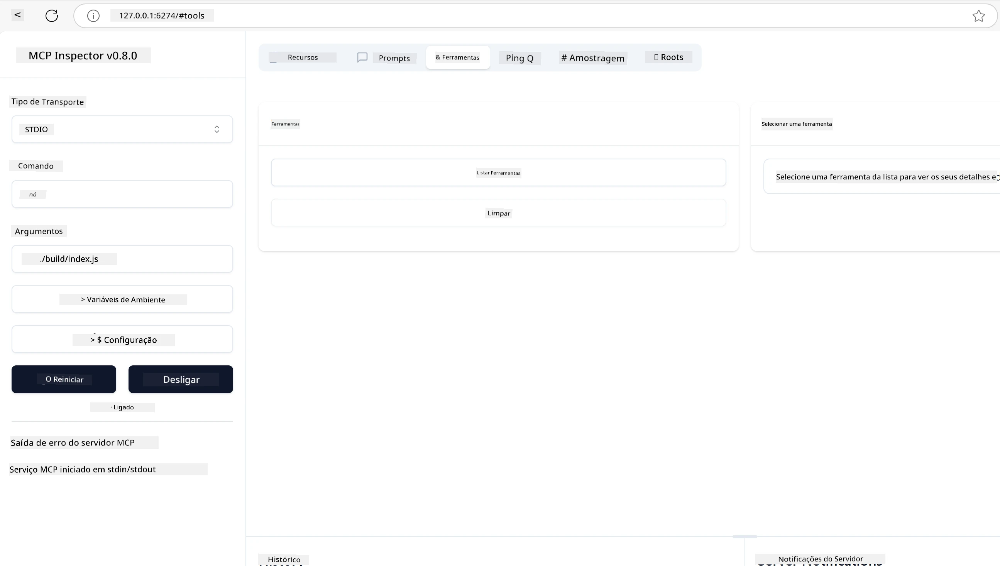
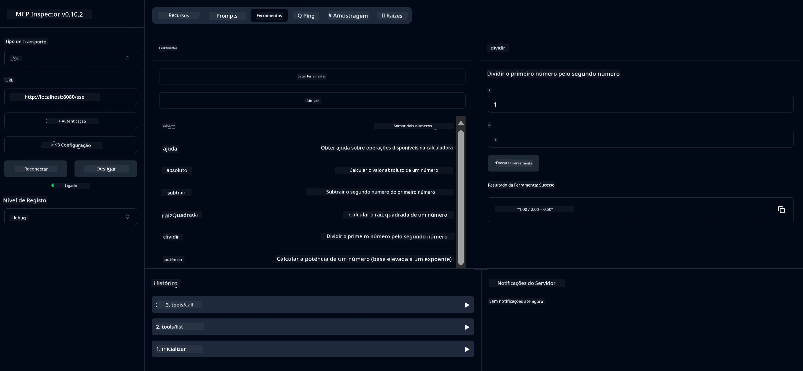
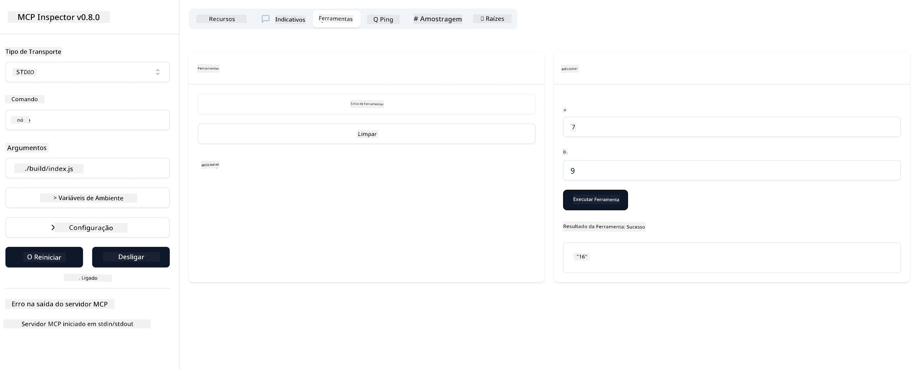

# Começar com MCP

> [!NOTE]
> O exemplo HTTP em Java nesta lição utiliza o transporte legado HTTP+SSE e
> destina-se a um SDK compatível com MCP `2025-11-25`. Para novos servidores remotos, utilize
> o transporte HTTP Streamable `2026-07-28` e verifique o suporte no seu SDK.

Bem-vindo aos seus primeiros passos com o Protocolo de Contexto do Modelo (MCP)! Quer seja novo no MCP ou queira aprofundar o seu conhecimento, este guia irá acompanhá-lo no processo essencial de configuração e desenvolvimento. Vai descobrir como o MCP permite uma integração perfeita entre modelos de IA e aplicações, e aprender como preparar rapidamente o seu ambiente para construir e testar soluções potenciadas por MCP.

> Resumo; Se constrói aplicações de IA, sabe que pode adicionar ferramentas e outros recursos ao seu LLM (modelo de linguagem grande), para tornar o LLM mais informado. No entanto, se colocar essas ferramentas e recursos num servidor, as capacidades da aplicação e do servidor podem ser usadas por qualquer cliente com/sem um LLM.

## Visão Geral

Esta lição fornece orientações práticas sobre como configurar ambientes MCP e construir as suas primeiras aplicações MCP. Vai aprender a configurar as ferramentas e frameworks necessários, construir servidores MCP básicos, criar aplicações anfitriãs e testar as suas implementações.

O Protocolo de Contexto do Modelo (MCP) é um protocolo aberto que padroniza a forma como as aplicações fornecem contexto aos LLMs. Pense no MCP como uma porta USB-C para aplicações de IA — fornece uma forma padronizada de ligar modelos de IA a diferentes fontes de dados e ferramentas.

## Objetivos de Aprendizagem

Ao final desta lição, será capaz de:

- Configurar ambientes de desenvolvimento para MCP em C#, Java, Python, TypeScript e Rust
- Construir e implementar servidores MCP básicos com funcionalidades personalizadas (recursos, prompts e ferramentas)
- Criar aplicações anfitriãs que se conectam a servidores MCP
- Testar e depurar implementações MCP

## Configurar o Seu Ambiente MCP

Antes de começar a trabalhar com MCP, é importante preparar o seu ambiente de desenvolvimento e compreender o fluxo de trabalho básico. Esta secção irá guiá-lo pelos passos iniciais para garantir um início tranquilo com MCP.

### Pré-requisitos

Antes de se lançar no desenvolvimento MCP, certifique-se que tem:

- **Ambiente de Desenvolvimento**: para a linguagem escolhida (C#, Java, Python, TypeScript ou Rust)
- **IDE/Editor**: Visual Studio, Visual Studio Code, IntelliJ, Eclipse, PyCharm ou qualquer editor de código moderno
- **Gestores de Pacotes**: NuGet, Maven/Gradle, pip, npm/yarn ou Cargo
- **Chaves API**: para quaisquer serviços de IA que planeie usar nas suas aplicações anfitriãs

## Estrutura Básica do Servidor MCP

Um servidor MCP inclui tipicamente:

- **Configuração do Servidor**: Configurar porta, autenticação e outras definições
- **Recursos**: Dados e contexto disponibilizados aos LLMs
- **Ferramentas**: Funcionalidades que os modelos podem invocar
- **Prompts**: Modelos para gerar ou estruturar texto

Aqui está um exemplo simplificado em TypeScript:

```typescript
import { McpServer, ResourceTemplate } from "@modelcontextprotocol/sdk/server/mcp.js";
import { StdioServerTransport } from "@modelcontextprotocol/sdk/server/stdio.js";
import { z } from "zod";

// Criar um servidor MCP
const server = new McpServer({
  name: "Demo",
  version: "1.0.0"
});

// Adicionar uma ferramenta de adição
server.tool("add",
  { a: z.number(), b: z.number() },
  async ({ a, b }) => ({
    content: [{ type: "text", text: String(a + b) }]
  })
);

// Adicionar um recurso de saudação dinâmica
server.resource(
  "file",
  // O parâmetro 'list' controla como o recurso lista os ficheiros disponíveis. Definir como undefined desativa a listagem para este recurso.
  new ResourceTemplate("file://{path}", { list: undefined }),
  async (uri, { path }) => ({
    contents: [{
      uri: uri.href,
      text: `File, ${path}!`
    }]
  })
);

// Adicionar um recurso de ficheiro que lê o conteúdo do ficheiro
server.resource(
  "file",
  new ResourceTemplate("file://{path}", { list: undefined }),
  async (uri, { path }) => {
    let text;
    try {
      text = await fs.readFile(path, "utf8");
    } catch (err) {
      text = `Error reading file: ${err.message}`;
    }
    return {
      contents: [{
        uri: uri.href,
        text
      }]
    };
  }
);

server.prompt(
  "review-code",
  { code: z.string() },
  ({ code }) => ({
    messages: [{
      role: "user",
      content: {
        type: "text",
        text: `Please review this code:\n\n${code}`
      }
    }]
  })
);

// Começar a receber mensagens no stdin e enviar mensagens no stdout
const transport = new StdioServerTransport();
await server.connect(transport);
```

No código acima nós:

- Importamos as classes necessárias do SDK MCP para TypeScript.
- Criamos e configuramos uma nova instância do servidor MCP.
- Registamos uma ferramenta personalizada (`calculator`) com uma função manipuladora.
- Iniciamos o servidor para escutar pedidos MCP.

## Testes e Depuração

Antes de começar a testar o seu servidor MCP, é importante compreender as ferramentas disponíveis e as melhores práticas para depuração. Testar eficazmente assegura que o seu servidor se comporta conforme esperado e ajuda a identificar e resolver problemas rapidamente. A secção seguinte descreve abordagens recomendadas para validar a sua implementação MCP.

O MCP fornece ferramentas para ajudar a testar e depurar os seus servidores:

- **Ferramenta Inspector**, esta interface gráfica permite-lhe conectar ao seu servidor e testar suas ferramentas, prompts e recursos.
- **curl**, pode também conectar ao seu servidor usando uma ferramenta de linha de comandos como curl ou outros clientes que podem criar e executar comandos HTTP.

### Usando o MCP Inspector

O [MCP Inspector](https://github.com/modelcontextprotocol/inspector) é uma ferramenta visual de testes que o ajuda a:

1. **Descobrir Capacidades do Servidor**: Detetar automaticamente recursos, ferramentas e prompts disponíveis
2. **Testar Execução de Ferramentas**: Experimentar diferentes parâmetros e ver respostas em tempo real
3. **Ver Metadata do Servidor**: Examinar informação do servidor, esquemas e configurações

```bash
# ex TypeScript, instalar e executar o MCP Inspector
npx @modelcontextprotocol/inspector node build/index.js
```

Ao executar os comandos acima, o MCP Inspector irá lançar uma interface web local no seu browser. Pode esperar ver um painel que exibe os seus servidores MCP registados, as suas ferramentas, recursos e prompts disponíveis. A interface permite testar interativamente a execução das ferramentas, inspecionar a metadata do servidor e ver respostas em tempo real, facilitando a validação e depuração das suas implementações MCP.

Aqui está um screenshot de como pode parecer:



## Problemas Comuns de Configuração e Soluções

| Problema | Possível Solução |
|---------|------------------|
| Ligação recusada | Verifique se o servidor está a correr e se a porta está correta |
| Erros na execução de ferramentas | Revise a validação dos parâmetros e o tratamento de erros |
| Falhas de autenticação | Verifique as chaves API e permissões |
| Erros de validação do esquema | Assegure que os parâmetros correspondem ao esquema definido |
| Servidor não inicia | Verifique conflitos de porta ou dependências em falta |
| Erros de CORS | Configure corretamente os headers CORS para pedidos cross-origin |
| Problemas de autenticação | Verifique a validade do token e permissões |

## Desenvolvimento Local

Para desenvolvimento e testes locais, pode executar servidores MCP diretamente na sua máquina:

1. **Inicie o processo do servidor**: Execute a sua aplicação servidor MCP
2. **Configure a rede**: Certifique-se que o servidor está acessível na porta esperada
3. **Conecte clientes**: Utilize URLs de conexão local como `http://localhost:3000`

```bash
# Exemplo: Executar um servidor MCP TypeScript localmente
npm run start
# Servidor a correr em http://localhost:3000
```

## Construindo o seu primeiro Servidor MCP

Já abordámos os [Conceitos Básicos](../../01-CoreConcepts/README.md) numa lição anterior, agora é tempo de pôr esse conhecimento em prática.

### O que um servidor pode fazer

Antes de começarmos a escrever código, vamos relembrar o que um servidor pode fazer:

Um servidor MCP pode, por exemplo:

- Aceder a ficheiros locais e bases de dados
- Ligar a APIs remotas
- Efetuar cálculos
- Integrar com outras ferramentas e serviços
- Fornecer uma interface de utilizador para interação

Excelente, agora que sabemos o que pode fazer por ele, vamos começar a codificar.

## Exercício: Criar um servidor

Para criar um servidor, precisa seguir estes passos:

- Instalar o SDK MCP.
- Criar um projeto e configurar a estrutura do projeto.
- Escrever o código do servidor.
- Testar o servidor.

### -1- Criar projeto

#### TypeScript

```sh
# Criar diretório do projeto e inicializar projeto npm
mkdir calculator-server
cd calculator-server
npm init -y
```

#### Python

```sh
# Criar diretoria do projeto
mkdir calculator-server
cd calculator-server
# Abrir a pasta no Visual Studio Code - Ignore isto se estiver a usar um IDE diferente
code .
```

#### .NET

```sh
dotnet new console -n McpCalculatorServer
cd McpCalculatorServer
```

#### Java

Para Java, crie um projeto Spring Boot:

```bash
curl https://start.spring.io/starter.zip \
  -d dependencies=web \
  -d javaVersion=21 \
  -d type=maven-project \
  -d groupId=com.example \
  -d artifactId=calculator-server \
  -d name=McpServer \
  -d packageName=com.microsoft.mcp.sample.server \
  -o calculator-server.zip
```

Extraia o ficheiro zip:

```bash
unzip calculator-server.zip -d calculator-server
cd calculator-server
# remover opcionalmente o teste não utilizado
rm -rf src/test/java
```

Adicione a seguinte configuração completa ao seu ficheiro *pom.xml*:

```xml
<?xml version="1.0" encoding="UTF-8"?>
<project xmlns="http://maven.apache.org/POM/4.0.0"
    xmlns:xsi="http://www.w3.org/2001/XMLSchema-instance"
    xsi:schemaLocation="http://maven.apache.org/POM/4.0.0 http://maven.apache.org/xsd/maven-4.0.0.xsd">
    <modelVersion>4.0.0</modelVersion>
    
    <!-- Spring Boot parent for dependency management -->
    <parent>
        <groupId>org.springframework.boot</groupId>
        <artifactId>spring-boot-starter-parent</artifactId>
        <version>3.5.0</version>
        <relativePath />
    </parent>

    <!-- Project coordinates -->
    <groupId>com.example</groupId>
    <artifactId>calculator-server</artifactId>
    <version>0.0.1-SNAPSHOT</version>
    <name>Calculator Server</name>
    <description>Basic calculator MCP service for beginners</description>

    <!-- Properties -->
    <properties>
        <java.version>21</java.version>
        <maven.compiler.source>21</maven.compiler.source>
        <maven.compiler.target>21</maven.compiler.target>
    </properties>

    <!-- Spring AI BOM for version management -->
    <dependencyManagement>
        <dependencies>
            <dependency>
                <groupId>org.springframework.ai</groupId>
                <artifactId>spring-ai-bom</artifactId>
                <version>1.0.0-SNAPSHOT</version>
                <type>pom</type>
                <scope>import</scope>
            </dependency>
        </dependencies>
    </dependencyManagement>

    <!-- Dependencies -->
    <dependencies>
        <dependency>
            <groupId>org.springframework.ai</groupId>
            <artifactId>spring-ai-starter-mcp-server-webflux</artifactId>
        </dependency>
        <dependency>
            <groupId>org.springframework.boot</groupId>
            <artifactId>spring-boot-starter-actuator</artifactId>
        </dependency>
        <dependency>
         <groupId>org.springframework.boot</groupId>
         <artifactId>spring-boot-starter-test</artifactId>
         <scope>test</scope>
      </dependency>
    </dependencies>

    <!-- Build configuration -->
    <build>
        <plugins>
            <plugin>
                <groupId>org.springframework.boot</groupId>
                <artifactId>spring-boot-maven-plugin</artifactId>
            </plugin>
            <plugin>
                <groupId>org.apache.maven.plugins</groupId>
                <artifactId>maven-compiler-plugin</artifactId>
                <configuration>
                    <release>21</release>
                </configuration>
            </plugin>
        </plugins>
    </build>

    <!-- Repositories for Spring AI snapshots -->
    <repositories>
        <repository>
            <id>spring-milestones</id>
            <name>Spring Milestones</name>
            <url>https://repo.spring.io/milestone</url>
            <snapshots>
                <enabled>false</enabled>
            </snapshots>
        </repository>
        <repository>
            <id>spring-snapshots</id>
            <name>Spring Snapshots</name>
            <url>https://repo.spring.io/snapshot</url>
            <releases>
                <enabled>false</enabled>
            </releases>
        </repository>
    </repositories>
</project>
```

#### Rust

```sh
mkdir calculator-server
cd calculator-server
cargo init
```

### -2- Adicionar dependências

Agora que criou o seu projeto, vamos adicionar as dependências:

#### TypeScript

```sh
# Se ainda não estiver instalado, instale o TypeScript globalmente
npm install typescript -g

# Instale o MCP SDK e o Zod para validação de esquemas
npm install @modelcontextprotocol/sdk zod
npm install -D @types/node typescript
```

#### Python

```sh
# Criar um ambiente virtual e instalar as dependências
python -m venv venv
venv\Scripts\activate
pip install "mcp[cli]"
```

#### Java

```bash
cd calculator-server
./mvnw clean install -DskipTests
```

#### Rust

```sh
cargo add rmcp --features server,transport-io
cargo add serde
cargo add tokio --features rt-multi-thread
```

### -3- Criar ficheiros do projeto

#### TypeScript

Abra o ficheiro *package.json* e substitua o conteúdo pelo seguinte para garantir que pode construir e executar o servidor:

```json
{
  "name": "calculator-server",
  "version": "1.0.0",
  "main": "index.js",
  "type": "module",
  "scripts": {
    "build": "tsc",
    "start": "npm run build && node ./build/index.js",
  },
  "keywords": [],
  "author": "",
  "license": "ISC",
  "description": "A simple calculator server using Model Context Protocol",
  "dependencies": {
    "@modelcontextprotocol/sdk": "^1.16.0",
    "zod": "^3.25.76"
  },
  "devDependencies": {
    "@types/node": "^24.0.14",
    "typescript": "^5.8.3"
  }
}
```

Crie um *tsconfig.json* com o seguinte conteúdo:

```json
{
  "compilerOptions": {
    "target": "ES2022",
    "module": "Node16",
    "moduleResolution": "Node16",
    "outDir": "./build",
    "rootDir": "./src",
    "strict": true,
    "esModuleInterop": true,
    "skipLibCheck": true,
    "forceConsistentCasingInFileNames": true
  },
  "include": ["src/**/*"],
  "exclude": ["node_modules"]
}
```

Crie um diretório para o seu código fonte:

```sh
mkdir src
touch src/index.ts
```

#### Python

Crie um ficheiro *server.py*

```sh
touch server.py
```

#### .NET

Instale os pacotes NuGet requeridos:

```sh
dotnet add package ModelContextProtocol --prerelease
dotnet add package Microsoft.Extensions.Hosting
```

#### Java

Para projetos Java Spring Boot, a estrutura do projeto é criada automaticamente.

#### Rust

Para Rust, um ficheiro *src/main.rs* é criado por defeito quando executa `cargo init`. Abra o ficheiro e apague o código padrão.

### -4- Criar código do servidor

#### TypeScript

Crie um ficheiro *index.ts* e acrescente o seguinte código:

```typescript
import { McpServer, ResourceTemplate } from "@modelcontextprotocol/sdk/server/mcp.js";
import { StdioServerTransport } from "@modelcontextprotocol/sdk/server/stdio.js";
import { z } from "zod";
 
// Criar um servidor MCP
const server = new McpServer({
  name: "Calculator MCP Server",
  version: "1.0.0"
});
```

Agora tem um servidor, mas ele não faz muito, vamos corrigir isso.

#### Python

```python
# server.py
from mcp.server.fastmcp import FastMCP

# Criar um servidor MCP
mcp = FastMCP("Demo")
```

#### .NET

```csharp
using Microsoft.Extensions.DependencyInjection;
using Microsoft.Extensions.Hosting;
using Microsoft.Extensions.Logging;
using ModelContextProtocol.Server;
using System.ComponentModel;

var builder = Host.CreateApplicationBuilder(args);
builder.Logging.AddConsole(consoleLogOptions =>
{
    // Configure all logs to go to stderr
    consoleLogOptions.LogToStandardErrorThreshold = LogLevel.Trace;
});

builder.Services
    .AddMcpServer()
    .WithStdioServerTransport()
    .WithToolsFromAssembly();
await builder.Build().RunAsync();

// add features
```

#### Java

Para Java, crie os componentes principais do servidor. Primeiro, modifique a classe principal da aplicação:

*src/main/java/com/microsoft/mcp/sample/server/McpServerApplication.java*:

```java
package com.microsoft.mcp.sample.server;

import org.springframework.ai.tool.ToolCallbackProvider;
import org.springframework.ai.tool.method.MethodToolCallbackProvider;
import org.springframework.boot.SpringApplication;
import org.springframework.boot.autoconfigure.SpringBootApplication;
import org.springframework.context.annotation.Bean;
import com.microsoft.mcp.sample.server.service.CalculatorService;

@SpringBootApplication
public class McpServerApplication {

    public static void main(String[] args) {
        SpringApplication.run(McpServerApplication.class, args);
    }
    
    @Bean
    public ToolCallbackProvider calculatorTools(CalculatorService calculator) {
        return MethodToolCallbackProvider.builder().toolObjects(calculator).build();
    }
}
```

Crie o serviço de calculadora *src/main/java/com/microsoft/mcp/sample/server/service/CalculatorService.java*:

```java
package com.microsoft.mcp.sample.server.service;

import org.springframework.ai.tool.annotation.Tool;
import org.springframework.stereotype.Service;

/**
 * Service for basic calculator operations.
 * This service provides simple calculator functionality through MCP.
 */
@Service
public class CalculatorService {

    /**
     * Add two numbers
     * @param a The first number
     * @param b The second number
     * @return The sum of the two numbers
     */
    @Tool(description = "Add two numbers together")
    public String add(double a, double b) {
        double result = a + b;
        return formatResult(a, "+", b, result);
    }

    /**
     * Subtract one number from another
     * @param a The number to subtract from
     * @param b The number to subtract
     * @return The result of the subtraction
     */
    @Tool(description = "Subtract the second number from the first number")
    public String subtract(double a, double b) {
        double result = a - b;
        return formatResult(a, "-", b, result);
    }

    /**
     * Multiply two numbers
     * @param a The first number
     * @param b The second number
     * @return The product of the two numbers
     */
    @Tool(description = "Multiply two numbers together")
    public String multiply(double a, double b) {
        double result = a * b;
        return formatResult(a, "*", b, result);
    }

    /**
     * Divide one number by another
     * @param a The numerator
     * @param b The denominator
     * @return The result of the division
     */
    @Tool(description = "Divide the first number by the second number")
    public String divide(double a, double b) {
        if (b == 0) {
            return "Error: Cannot divide by zero";
        }
        double result = a / b;
        return formatResult(a, "/", b, result);
    }

    /**
     * Calculate the power of a number
     * @param base The base number
     * @param exponent The exponent
     * @return The result of raising the base to the exponent
     */
    @Tool(description = "Calculate the power of a number (base raised to an exponent)")
    public String power(double base, double exponent) {
        double result = Math.pow(base, exponent);
        return formatResult(base, "^", exponent, result);
    }

    /**
     * Calculate the square root of a number
     * @param number The number to find the square root of
     * @return The square root of the number
     */
    @Tool(description = "Calculate the square root of a number")
    public String squareRoot(double number) {
        if (number < 0) {
            return "Error: Cannot calculate square root of a negative number";
        }
        double result = Math.sqrt(number);
        return String.format("√%.2f = %.2f", number, result);
    }

    /**
     * Calculate the modulus (remainder) of division
     * @param a The dividend
     * @param b The divisor
     * @return The remainder of the division
     */
    @Tool(description = "Calculate the remainder when one number is divided by another")
    public String modulus(double a, double b) {
        if (b == 0) {
            return "Error: Cannot divide by zero";
        }
        double result = a % b;
        return formatResult(a, "%", b, result);
    }

    /**
     * Calculate the absolute value of a number
     * @param number The number to find the absolute value of
     * @return The absolute value of the number
     */
    @Tool(description = "Calculate the absolute value of a number")
    public String absolute(double number) {
        double result = Math.abs(number);
        return String.format("|%.2f| = %.2f", number, result);
    }

    /**
     * Get help about available calculator operations
     * @return Information about available operations
     */
    @Tool(description = "Get help about available calculator operations")
    public String help() {
        return "Basic Calculator MCP Service\n\n" +
               "Available operations:\n" +
               "1. add(a, b) - Adds two numbers\n" +
               "2. subtract(a, b) - Subtracts the second number from the first\n" +
               "3. multiply(a, b) - Multiplies two numbers\n" +
               "4. divide(a, b) - Divides the first number by the second\n" +
               "5. power(base, exponent) - Raises a number to a power\n" +
               "6. squareRoot(number) - Calculates the square root\n" + 
               "7. modulus(a, b) - Calculates the remainder of division\n" +
               "8. absolute(number) - Calculates the absolute value\n\n" +
               "Example usage: add(5, 3) will return 5 + 3 = 8";
    }

    /**
     * Format the result of a calculation
     */
    private String formatResult(double a, String operator, double b, double result) {
        return String.format("%.2f %s %.2f = %.2f", a, operator, b, result);
    }
}
```

**Componentes opcionais para um serviço pronto para produção:**

Crie uma configuração de arranque *src/main/java/com/microsoft/mcp/sample/server/config/StartupConfig.java*:

```java
package com.microsoft.mcp.sample.server.config;

import org.springframework.boot.CommandLineRunner;
import org.springframework.context.annotation.Bean;
import org.springframework.context.annotation.Configuration;

@Configuration
public class StartupConfig {
    
    @Bean
    public CommandLineRunner startupInfo() {
        return args -> {
            System.out.println("\n" + "=".repeat(60));
            System.out.println("Calculator MCP Server is starting...");
            System.out.println("SSE endpoint: http://localhost:8080/sse");
            System.out.println("Health check: http://localhost:8080/actuator/health");
            System.out.println("=".repeat(60) + "\n");
        };
    }
}
```

Crie um controlador de saúde *src/main/java/com/microsoft/mcp/sample/server/controller/HealthController.java*:

```java
package com.microsoft.mcp.sample.server.controller;

import org.springframework.http.ResponseEntity;
import org.springframework.web.bind.annotation.GetMapping;
import org.springframework.web.bind.annotation.RestController;
import java.time.LocalDateTime;
import java.util.HashMap;
import java.util.Map;

@RestController
public class HealthController {
    
    @GetMapping("/health")
    public ResponseEntity<Map<String, Object>> healthCheck() {
        Map<String, Object> response = new HashMap<>();
        response.put("status", "UP");
        response.put("timestamp", LocalDateTime.now().toString());
        response.put("service", "Calculator MCP Server");
        return ResponseEntity.ok(response);
    }
}
```

Crie um manipulador de exceções *src/main/java/com/microsoft/mcp/sample/server/exception/GlobalExceptionHandler.java*:

```java
package com.microsoft.mcp.sample.server.exception;

import org.springframework.http.HttpStatus;
import org.springframework.http.ResponseEntity;
import org.springframework.web.bind.annotation.ExceptionHandler;
import org.springframework.web.bind.annotation.RestControllerAdvice;

@RestControllerAdvice
public class GlobalExceptionHandler {

    @ExceptionHandler(IllegalArgumentException.class)
    public ResponseEntity<ErrorResponse> handleIllegalArgumentException(IllegalArgumentException ex) {
        ErrorResponse error = new ErrorResponse(
            "Invalid_Input", 
            "Invalid input parameter: " + ex.getMessage());
        return new ResponseEntity<>(error, HttpStatus.BAD_REQUEST);
    }

    public static class ErrorResponse {
        private String code;
        private String message;

        public ErrorResponse(String code, String message) {
            this.code = code;
            this.message = message;
        }

        // Getters
        public String getCode() { return code; }
        public String getMessage() { return message; }
    }
}
```

Crie um banner personalizado *src/main/resources/banner.txt*:

```text
_____      _            _       _             
 / ____|    | |          | |     | |            
| |     __ _| | ___ _   _| | __ _| |_ ___  _ __ 
| |    / _` | |/ __| | | | |/ _` | __/ _ \| '__|
| |___| (_| | | (__| |_| | | (_| | || (_) | |   
 \_____\__,_|_|\___|\__,_|_|\__,_|\__\___/|_|   
                                                
Calculator MCP Server v1.0
Spring Boot MCP Application
```

</details>

#### Rust

Acrescente o seguinte código no topo do ficheiro *src/main.rs*. Isto importa as bibliotecas e módulos necessários para o seu servidor MCP.

```rust
use rmcp::{
    handler::server::{router::tool::ToolRouter, tool::Parameters},
    model::{ServerCapabilities, ServerInfo},
    schemars, tool, tool_handler, tool_router,
    transport::stdio,
    ServerHandler, ServiceExt,
};
use std::error::Error;
```

O servidor da calculadora será simples e pode somar dois números. Vamos criar uma struct para representar o pedido da calculadora.

```rust
#[derive(Debug, serde::Deserialize, schemars::JsonSchema)]
pub struct CalculatorRequest {
    pub a: f64,
    pub b: f64,
}
```

Em seguida, crie uma struct para representar o servidor da calculadora. Esta struct terá o router da ferramenta, que é usado para registar ferramentas.

```rust
#[derive(Debug, Clone)]
pub struct Calculator {
    tool_router: ToolRouter<Self>,
}
```

Agora, podemos implementar a struct `Calculator` para criar uma nova instância do servidor e implementar o manipulador do servidor para fornecer informação do servidor.

```rust
#[tool_router]
impl Calculator {
    pub fn new() -> Self {
        Self {
            tool_router: Self::tool_router(),
        }
    }
}

#[tool_handler]
impl ServerHandler for Calculator {
    fn get_info(&self) -> ServerInfo {
        ServerInfo {
            instructions: Some("A simple calculator tool".into()),
            capabilities: ServerCapabilities::builder().enable_tools().build(),
            ..Default::default()
        }
    }
}
```

Finalmente, precisamos implementar a função main para arrancar o servidor. Esta função irá criar uma instância da struct `Calculator` e servi-la sobre entrada/saída padrão.

```rust
#[tokio::main]
async fn main() -> Result<(), Box<dyn Error>> {
    let service = Calculator::new().serve(stdio()).await?;
    service.waiting().await?;
    Ok(())
}
```

O servidor está agora configurado para fornecer informação básica sobre si mesmo. Em seguida, adicionaremos uma ferramenta para realizar adição.

### -5- Adicionar uma ferramenta e um recurso

Adicione uma ferramenta e um recurso adicionando o seguinte código:

#### TypeScript

```typescript
server.tool(
  "add",
  { a: z.number(), b: z.number() },
  async ({ a, b }) => ({
    content: [{ type: "text", text: String(a + b) }]
  })
);

server.resource(
  "greeting",
  new ResourceTemplate("greeting://{name}", { list: undefined }),
  async (uri, { name }) => ({
    contents: [{
      uri: uri.href,
      text: `Hello, ${name}!`
    }]
  })
);
```

A sua ferramenta recebe os parâmetros `a` e `b` e executa uma função que produz uma resposta na forma:

```typescript
{
  contents: [{
    type: "text", content: "some content"
  }]
}
```

O seu recurso é acedido através da string "greeting" e recebe um parâmetro `name`, produzindo uma resposta semelhante à da ferramenta:

```typescript
{
  uri: "<href>",
  text: "a text"
}
```

#### Python

```python
# Adicionar uma ferramenta de adição
@mcp.tool()
def add(a: int, b: int) -> int:
    """Add two numbers"""
    return a + b


# Adicionar um recurso de saudação dinâmico
@mcp.resource("greeting://{name}")
def get_greeting(name: str) -> str:
    """Get a personalized greeting"""
    return f"Hello, {name}!"
```

No código anterior, nós:

- Definimos uma ferramenta `add` que recebe os parâmetros `a` e `b`, ambos inteiros.
- Criámos um recurso chamado `greeting` que recebe o parâmetro `name`.

#### .NET

Adicione isto ao seu ficheiro Program.cs:

```csharp
[McpServerToolType]
public static class CalculatorTool
{
    [McpServerTool, Description("Adds two numbers")]
    public static string Add(int a, int b) => $"Sum {a + b}";
}
```

#### Java

As ferramentas já foram criadas no passo anterior.

#### Rust

Adicione uma nova ferramenta dentro do bloco `impl Calculator`:

```rust
#[tool(description = "Adds a and b")]
async fn add(
    &self,
    Parameters(CalculatorRequest { a, b }): Parameters<CalculatorRequest>,
) -> String {
    (a + b).to_string()
}
```

### -6- Código final

Vamos adicionar o último código necessário para o servidor poder arrancar:

#### TypeScript

```typescript
// Comece a receber mensagens na entrada padrão e a enviar mensagens na saída padrão
const transport = new StdioServerTransport();
await server.connect(transport);
```

Aqui está o código completo:

```typescript
// index.ts
import { McpServer, ResourceTemplate } from "@modelcontextprotocol/sdk/server/mcp.js";
import { StdioServerTransport } from "@modelcontextprotocol/sdk/server/stdio.js";
import { z } from "zod";

// Criar um servidor MCP
const server = new McpServer({
  name: "Calculator MCP Server",
  version: "1.0.0"
});

// Adicionar uma ferramenta de adição
server.tool(
  "add",
  { a: z.number(), b: z.number() },
  async ({ a, b }) => ({
    content: [{ type: "text", text: String(a + b) }]
  })
);

// Adicionar um recurso de saudação dinâmica
server.resource(
  "greeting",
  new ResourceTemplate("greeting://{name}", { list: undefined }),
  async (uri, { name }) => ({
    contents: [{
      uri: uri.href,
      text: `Hello, ${name}!`
    }]
  })
);

// Começar a receber mensagens no stdin e a enviar mensagens no stdout
const transport = new StdioServerTransport();
server.connect(transport);
```

#### Python

```python
# server.py
from mcp.server.fastmcp import FastMCP

# Criar um servidor MCP
mcp = FastMCP("Demo")


# Adicionar uma ferramenta de adição
@mcp.tool()
def add(a: int, b: int) -> int:
    """Add two numbers"""
    return a + b


# Adicionar um recurso de saudação dinâmica
@mcp.resource("greeting://{name}")
def get_greeting(name: str) -> str:
    """Get a personalized greeting"""
    return f"Hello, {name}!"

# Bloco principal de execução - isto é necessário para executar o servidor
if __name__ == "__main__":
    mcp.run()
```

#### .NET

Crie um ficheiro Program.cs com o seguinte conteúdo:

```csharp
using Microsoft.Extensions.DependencyInjection;
using Microsoft.Extensions.Hosting;
using Microsoft.Extensions.Logging;
using ModelContextProtocol.Server;
using System.ComponentModel;

var builder = Host.CreateApplicationBuilder(args);
builder.Logging.AddConsole(consoleLogOptions =>
{
    // Configure all logs to go to stderr
    consoleLogOptions.LogToStandardErrorThreshold = LogLevel.Trace;
});

builder.Services
    .AddMcpServer()
    .WithStdioServerTransport()
    .WithToolsFromAssembly();
await builder.Build().RunAsync();

[McpServerToolType]
public static class CalculatorTool
{
    [McpServerTool, Description("Adds two numbers")]
    public static string Add(int a, int b) => $"Sum {a + b}";
}
```

#### Java

A sua classe principal da aplicação completa deverá ser assim:

```java
// McpServerApplication.java
package com.microsoft.mcp.sample.server;

import org.springframework.ai.tool.ToolCallbackProvider;
import org.springframework.ai.tool.method.MethodToolCallbackProvider;
import org.springframework.boot.SpringApplication;
import org.springframework.boot.autoconfigure.SpringBootApplication;
import org.springframework.context.annotation.Bean;
import com.microsoft.mcp.sample.server.service.CalculatorService;

@SpringBootApplication
public class McpServerApplication {

    public static void main(String[] args) {
        SpringApplication.run(McpServerApplication.class, args);
    }
    
    @Bean
    public ToolCallbackProvider calculatorTools(CalculatorService calculator) {
        return MethodToolCallbackProvider.builder().toolObjects(calculator).build();
    }
}
```

#### Rust

O código final para o servidor Rust deverá ser assim:

```rust
use rmcp::{
    ServerHandler, ServiceExt,
    handler::server::{router::tool::ToolRouter, tool::Parameters},
    model::{ServerCapabilities, ServerInfo},
    schemars, tool, tool_handler, tool_router,
    transport::stdio,
};
use std::error::Error;

#[derive(Debug, serde::Deserialize, schemars::JsonSchema)]
pub struct CalculatorRequest {
    pub a: f64,
    pub b: f64,
}

#[derive(Debug, Clone)]
pub struct Calculator {
    tool_router: ToolRouter<Self>,
}

#[tool_router]
impl Calculator {
    pub fn new() -> Self {
        Self {
            tool_router: Self::tool_router(),
        }
    }
    
    #[tool(description = "Adds a and b")]
    async fn add(
        &self,
        Parameters(CalculatorRequest { a, b }): Parameters<CalculatorRequest>,
    ) -> String {
        (a + b).to_string()
    }
}

#[tool_handler]
impl ServerHandler for Calculator {
    fn get_info(&self) -> ServerInfo {
        ServerInfo {
            instructions: Some("A simple calculator tool".into()),
            capabilities: ServerCapabilities::builder().enable_tools().build(),
            ..Default::default()
        }
    }
}

#[tokio::main]
async fn main() -> Result<(), Box<dyn Error>> {
    let service = Calculator::new().serve(stdio()).await?;
    service.waiting().await?;
    Ok(())
}
```

### -7- Testar o servidor

Inicie o servidor com o seguinte comando:

#### TypeScript

```sh
npm run build
```

#### Python

```sh
mcp run server.py
```

> Para usar o MCP Inspector, use `mcp dev server.py` que lança automaticamente o Inspector e fornece o token de sessão proxy necessário. Se usar `mcp run server.py`, terá de iniciar manualmente o Inspector e configurar a conexão.

#### .NET

Certifique-se que está no diretório do seu projeto:

```sh
cd McpCalculatorServer
dotnet run
```

#### Java

```bash
./mvnw clean install -DskipTests
java -jar target/calculator-server-0.0.1-SNAPSHOT.jar
```

#### Rust

Execute os seguintes comandos para formatar e executar o servidor:

```sh
cargo fmt
cargo run
```

### -8- Executar usando o inspector

O inspector é uma ótima ferramenta que pode arrancar o seu servidor e permite interagir com ele para testar o seu funcionamento. Vamos arrancá-lo:

> [!NOTE]
> poderá parecer diferente no campo "command" pois contém o comando para executar um servidor com o seu runtime específico/

#### TypeScript

```sh
npx @modelcontextprotocol/inspector node build/index.js
```

ou adicione-o ao seu *package.json* assim: `"inspector": "npx @modelcontextprotocol/inspector node build/index.js"` e depois execute `npm run inspector`

#### Python

O Python encapsula uma ferramenta Node.js chamada inspector. É possível chamar essa ferramenta assim:

```sh
mcp dev server.py
```


No entanto, não implementa todos os métodos disponíveis na ferramenta, pelo que é recomendado executar a ferramenta Node.js diretamente como abaixo:

```sh
npx @modelcontextprotocol/inspector mcp run server.py
```

Se estiver a usar uma ferramenta ou IDE que lhe permita configurar comandos e argumentos para executar scripts, 
certifique-se de definir `python` no campo `Command` e `server.py` como `Arguments`. Isto garante que o script é executado corretamente.

#### .NET

Certifique-se de que está no diretório do seu projeto:

```sh
cd McpCalculatorServer
npx @modelcontextprotocol/inspector dotnet run
```

#### Java

Certifique-se de que o seu servidor calculator está em execução
Depois execute o inspector:

```cmd
npx @modelcontextprotocol/inspector
```

Na interface web do inspector:

1. Selecione "SSE" como tipo de transporte
2. Defina a URL para: `http://localhost:8080/sse`
3. Clique em "Connect"



**Está agora ligado ao servidor**
**A secção de testes do servidor Java está concluída**

A próxima secção é sobre como interagir com o servidor.

Deverá ver a seguinte interface de utilizador:


1. Ligue ao servidor selecionando o botão Connect
  Depois de se ligar ao servidor, deverá ver o seguinte:

  

1. Selecione "Tools" e "listTools", deverá aparecer "Add", selecione "Add" e preencha os valores dos parâmetros.

  Deverá ver a resposta seguinte, ou seja, um resultado da ferramenta "add":

  

Parabéns, conseguiu criar e executar o seu primeiro servidor!

#### Rust

Para executar o servidor Rust com o MCP Inspector CLI, use o seguinte comando:

```sh
npx @modelcontextprotocol/inspector cargo run --cli --method tools/call --tool-name add --tool-arg a=1 b=2
```

### SDKs Oficiais

O MCP fornece SDKs oficiais para várias linguagens:

- [C# SDK](https://github.com/modelcontextprotocol/csharp-sdk) - Mantido em colaboração com a Microsoft
- [Java SDK](https://github.com/modelcontextprotocol/java-sdk) - Mantido em colaboração com a Spring AI
- [TypeScript SDK](https://github.com/modelcontextprotocol/typescript-sdk) - A implementação oficial em TypeScript
- [Python SDK](https://github.com/modelcontextprotocol/python-sdk) - A implementação oficial em Python
- [Kotlin SDK](https://github.com/modelcontextprotocol/kotlin-sdk) - A implementação oficial em Kotlin
- [Swift SDK](https://github.com/modelcontextprotocol/swift-sdk) - Mantido em colaboração com a Loopwork AI
- [Rust SDK](https://github.com/modelcontextprotocol/rust-sdk) - A implementação oficial em Rust

## Principais Conclusões

- Configurar um ambiente de desenvolvimento MCP é simples com SDKs específicos para cada linguagem
- Construir servidores MCP envolve criar e registar ferramentas com esquemas claros
- Testar e depurar são essenciais para implementações MCP fiáveis

## Exemplos

- [Calculadora Java](../samples/java/calculator/README.md)
- [Calculadora .NET](../../../../03-GettingStarted/samples/csharp)
- [Calculadora JavaScript](../samples/javascript/README.md)
- [Calculadora TypeScript](../samples/typescript/README.md)
- [Calculadora Python](../../../../03-GettingStarted/samples/python)
- [Calculadora Rust](../../../../03-GettingStarted/samples/rust)

## Tarefa

Crie um servidor MCP simples com uma ferramenta à sua escolha:

1. Implemente a ferramenta na sua linguagem preferida (.NET, Java, Python, TypeScript, ou Rust).
2. Defina os parâmetros de entrada e os valores de retorno.
3. Corra a ferramenta inspector para garantir que o servidor funciona conforme esperado.
4. Teste a implementação com diversas entradas.

## Solução

[Solução](./solution/README.md)

## Recursos Adicionais

- [Construir Agentes usando Model Context Protocol na Azure](https://learn.microsoft.com/azure/developer/ai/intro-agents-mcp)
- [MCP Remoto com Azure Container Apps (Node.js/TypeScript/JavaScript)](https://learn.microsoft.com/samples/azure-samples/mcp-container-ts/mcp-container-ts/)
- [Agente MCP OpenAI .NET](https://learn.microsoft.com/samples/azure-samples/openai-mcp-agent-dotnet/openai-mcp-agent-dotnet/)

## O que vem a seguir

A seguir: [Começar com Clientes MCP](../02-client/README.md)

---

<!-- CO-OP TRANSLATOR DISCLAIMER START -->
**Aviso Legal**:
Este documento foi traduzido utilizando o serviço de tradução automática [Co-op Translator](https://github.com/Azure/co-op-translator). Embora nos esforcemos pela precisão, esteja ciente de que traduções automáticas podem conter erros ou imprecisões. O documento original na sua língua nativa deve ser considerado a fonte autorizada. Para informações críticas, recomenda-se tradução profissional humana. Não nos responsabilizamos por quaisquer mal-entendidos ou interpretações incorretas resultantes da utilização desta tradução.
<!-- CO-OP TRANSLATOR DISCLAIMER END -->