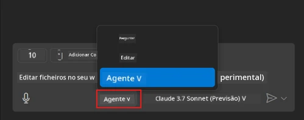
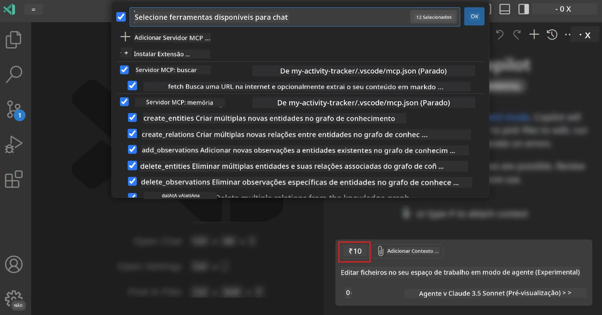
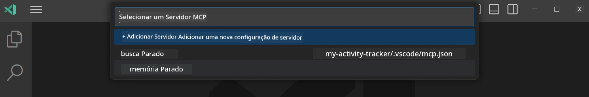
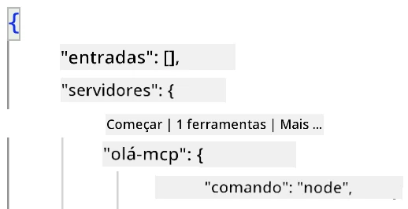
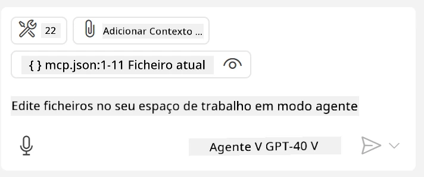
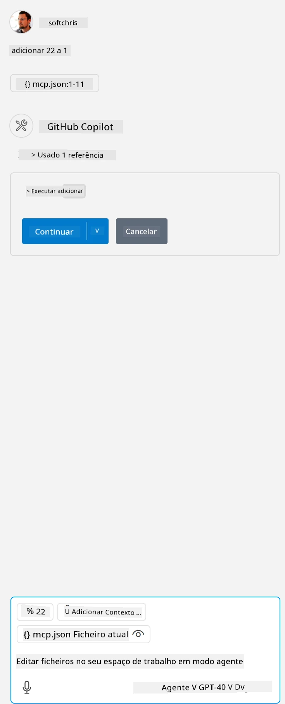

# Consumir um servidor a partir do modo Agente do GitHub Copilot

O Visual Studio Code e o GitHub Copilot podem atuar como clientes e consumir um Servidor MCP. Porque é que quereríamos fazer isso, pode perguntar? Bem, isso significa que quaisquer funcionalidades que o Servidor MCP tenha podem agora ser usadas a partir do seu IDE. Imagine, por exemplo, adicionar o servidor MCP do GitHub, isso permitiria controlar o GitHub através de prompts em vez de digitar comandos específicos no terminal. Ou imagine qualquer outra coisa em geral que pudesse melhorar a sua experiência de programador, tudo controlado por linguagem natural. Agora começa a perceber a vantagem, certo?

## Visão Geral

Esta lição explica como usar o Visual Studio Code e o modo Agente do GitHub Copilot como cliente para o seu Servidor MCP.

## Objetivos de Aprendizagem

No final desta lição, será capaz de:

- Consumir um Servidor MCP via Visual Studio Code.
- Executar funcionalidades como ferramentas através do GitHub Copilot.
- Configurar o Visual Studio Code para encontrar e gerir o seu Servidor MCP.

## Utilização

Pode controlar o seu servidor MCP de duas formas diferentes:

- Interface de utilizador, verá como isso é feito mais à frente neste capítulo.
- Terminal, é possível controlar coisas a partir do terminal usando o executável `code`:

  Para adicionar um servidor MCP ao seu perfil de utilizador, use a opção de linha de comando --add-mcp, e forneça a configuração do servidor em formato JSON, como {\"name\":\"server-name\",\"command\":...}.

  ```
  code --add-mcp "{\"name\":\"my-server\",\"command\": \"uvx\",\"args\": [\"mcp-server-fetch\"]}"
  ```

### Capturas de ecrã





Vamos falar mais sobre como usar a interface visual nas próximas secções.

## Abordagem

Eis como devemos abordar isto, em alto nível:

- Configurar um ficheiro para encontrar o nosso Servidor MCP.
- Iniciar/Conectar ao servidor para que liste as suas funcionalidades.
- Usar essas funcionalidades através da interface do GitHub Copilot Chat.

Ótimo, agora que entendemos o fluxo, vamos tentar usar um Servidor MCP através do Visual Studio Code com um exercício.

## Exercício: Consumir um servidor

Neste exercício vamos configurar o Visual Studio Code para encontrar o seu servidor MCP para que possa ser usado a partir da interface GitHub Copilot Chat.

### -0- Passo prévio, ativar a descoberta do Servidor MCP

Pode ser necessário ativar a descoberta dos Servidores MCP.

1. Aceda a `Ficheiro -> Preferências -> Definições` no Visual Studio Code.

1. Procure por "MCP" e ative `chat.mcp.discovery.enabled` no ficheiro settings.json.

### -1- Criar ficheiro de configuração

Comece por criar um ficheiro de configuração na raíz do seu projeto, vai precisar de um ficheiro chamado MCP.json e colocá-lo numa pasta chamada .vscode. Deve parecer-se com isto:

```text
.vscode
|-- mcp.json
```

De seguida, vejamos como adicionar uma entrada de servidor.

### -2- Configurar um servidor

Adicione o seguinte conteúdo ao *mcp.json*:

```json
{
    "inputs": [],
    "servers": {
       "hello-mcp": {
           "command": "node",
           "args": [
               "build/index.js"
           ]
       }
    }
}
```

Aqui está um exemplo simples acima de como iniciar um servidor escrito em Node.js, para outras plataformas indique o comando correto para iniciar o servidor usando `command` e `args`.

### -3- Iniciar o servidor

Agora que adicionou uma entrada, vamos iniciar o servidor:

1. Localize a sua entrada em *mcp.json* e certifique-se que encontra o ícone "play":

    

1. Clique no ícone "play", deverá ver o ícone das ferramentas no GitHub Copilot Chat aumentar o número de ferramentas disponíveis. Se clicar no ícone das ferramentas, verá uma lista das ferramentas registadas. Pode assinalar/desassinalar cada ferramenta dependendo se quer que o GitHub Copilot as use como contexto:

  

1. Para executar uma ferramenta, escreva um prompt que saiba que corresponde à descrição de uma das suas ferramentas, por exemplo um prompt assim "add 22 to 1":

  

  Deverá ver uma resposta a dizer 23.

## Tarefa

Tente adicionar uma entrada de servidor no seu ficheiro *mcp.json* e assegure-se de que consegue iniciar/parar o servidor. Assegure-se também de que consegue comunicar com as ferramentas no seu servidor via interface GitHub Copilot Chat.

## Solução

[Solução](./solution/README.md)

## Principais Aprendizagens

Os principais ensinamentos deste capítulo são os seguintes:

- O Visual Studio Code é um excelente cliente que lhe permite consumir vários Servidores MCP e as suas ferramentas.
- A interface GitHub Copilot Chat é como interage com os servidores.
- Pode solicitar ao utilizador entradas como chaves API que podem ser passadas ao Servidor MCP ao configurar a entrada do servidor no ficheiro *mcp.json*.

## Exemplos

- [Calculadora Java](../samples/java/calculator/README.md)
- [Calculadora .Net](../../../../03-GettingStarted/samples/csharp)
- [Calculadora JavaScript](../samples/javascript/README.md)
- [Calculadora TypeScript](../samples/typescript/README.md)
- [Calculadora Python](../../../../03-GettingStarted/samples/python)

## Recursos Adicionais

- [Documentação do Visual Studio](https://code.visualstudio.com/docs/copilot/chat/mcp-servers)

## O que vem a seguir

- A seguir: [Criar um servidor stdio](../05-stdio-server/README.md)

---

<!-- CO-OP TRANSLATOR DISCLAIMER START -->
**Aviso Legal**:
Este documento foi traduzido utilizando o serviço de tradução automática [Co-op Translator](https://github.com/Azure/co-op-translator). Embora nos esforcemos pela precisão, esteja ciente de que traduções automáticas podem conter erros ou imprecisões. O documento original na sua língua nativa deve ser considerado a fonte autorizada. Para informações críticas, recomenda-se tradução profissional humana. Não nos responsabilizamos por quaisquer mal-entendidos ou interpretações incorretas resultantes da utilização desta tradução.
<!-- CO-OP TRANSLATOR DISCLAIMER END -->