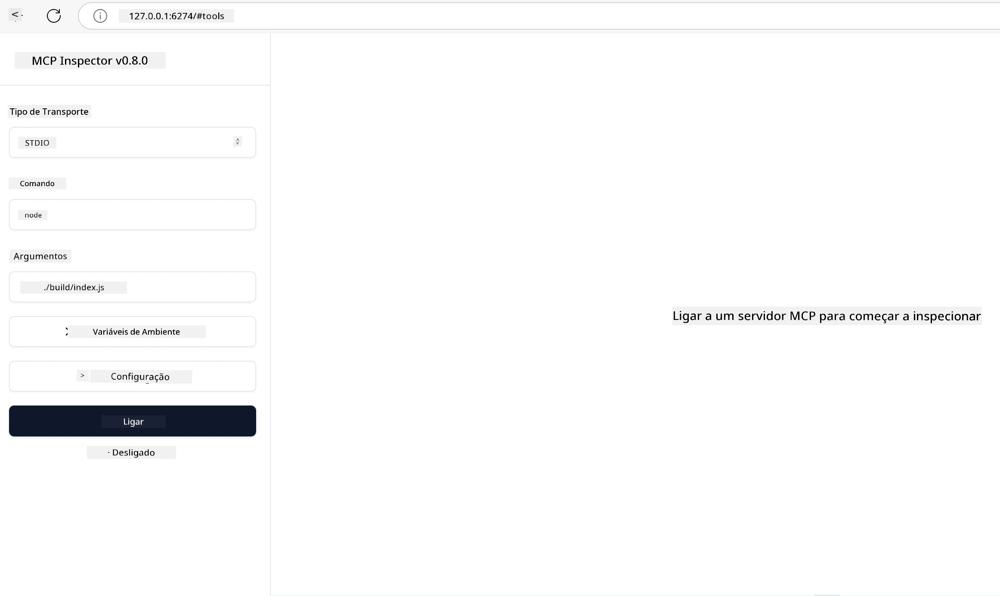

## Testes e Depuração

Antes de começar a testar o seu servidor MCP, é importante compreender as ferramentas disponíveis e as melhores práticas para a depuração. Testes eficazes garantem que o seu servidor se comporta como esperado e ajudam a identificar e resolver problemas rapidamente. A secção seguinte descreve as abordagens recomendadas para validar a implementação do seu MCP.

## Visão Geral

Esta lição cobre como selecionar a abordagem de teste correta e a ferramenta de teste mais eficaz.

## Objetivos de Aprendizagem

No final desta lição, será capaz de:

- Descrever várias abordagens para testes.
- Utilizar diferentes ferramentas para testar eficazmente o seu código.


## Testar Servidores MCP

O MCP fornece ferramentas para o ajudar a testar e depurar os seus servidores:

- **MCP Inspector**: Uma ferramenta de linha de comandos que pode ser executada tanto como ferramenta CLI como ferramenta visual.
- **Teste manual**: Pode usar uma ferramenta como o curl para executar pedidos web, mas qualquer ferramenta capaz de executar HTTP serve.
- **Teste unitário**: É possível usar o seu framework de testes preferido para testar as funcionalidades tanto do servidor como do cliente.

### Usar o MCP Inspector

Descrevemos o uso desta ferramenta em lições anteriores, mas vamos falar um pouco sobre ela a um nível mais geral. É uma ferramenta construída em Node.js e pode usá-la chamando o executável `npx`, que fará o download e instalação temporária da ferramenta e limpará tudo assim que terminar de executar o seu pedido.

O [MCP Inspector](https://github.com/modelcontextprotocol/inspector) ajuda-o a:

- **Descobrir Capacidades do Servidor**: Detectar automaticamente recursos, ferramentas e prompts disponíveis
- **Testar Execução das Ferramentas**: Experimentar diferentes parâmetros e ver respostas em tempo real
- **Ver Metadados do Servidor**: Examinar informações do servidor, esquemas e configurações

Uma execução típica da ferramenta é assim:

```bash
npx @modelcontextprotocol/inspector node build/index.js
```

O comando acima inicia um MCP e sua interface visual, lançando uma interface web local no seu navegador. Pode esperar ver um painel que exibe os servidores MCP registados, as suas ferramentas, recursos e prompts disponíveis. A interface permite testar interativamente a execução das ferramentas, inspecionar os metadados do servidor e ver respostas em tempo real, facilitando a validação e depuração das suas implementações MCP.

Assim pode parecer: 

Também pode executar esta ferramenta no modo CLI, caso em que adiciona o atributo `--cli`. Aqui está um exemplo de execução da ferramenta no modo "CLI" que lista todas as ferramentas no servidor:

```sh
npx @modelcontextprotocol/inspector --cli node build/index.js --method tools/list
```

### Teste Manual

Para além de executar a ferramenta inspector para testar as capacidades do servidor, outra abordagem semelhante é executar um cliente capaz de usar HTTP, como por exemplo o curl.

Com o curl, pode testar servidores MCP diretamente usando pedidos HTTP:

```bash
# Exemplo: Metadados do servidor de teste
curl http://localhost:3000/v1/metadata

# Exemplo: Executar uma ferramenta
curl -X POST http://localhost:3000/v1/tools/execute \
  -H "Content-Type: application/json" \
  -d '{"name": "calculator", "parameters": {"expression": "2+2"}}'
```

Como pode ver no uso do curl acima, utiliza um pedido POST para invocar uma ferramenta usando uma carga útil que consiste no nome da ferramenta e nos seus parâmetros. Use a abordagem que melhor lhe convier. As ferramentas CLI tendem a ser mais rápidas de usar e permitem ser automatizadas, o que pode ser útil num ambiente CI/CD.

### Teste Unitário

Crie testes unitários para as suas ferramentas e recursos para garantir que funcionam como esperado. Aqui está algum código de exemplo para testes.

```python
import pytest

from mcp.server.fastmcp import FastMCP
from mcp.shared.memory import (
    create_connected_server_and_client_session as create_session,
)

# Marcar todo o módulo para testes assíncronos
pytestmark = pytest.mark.anyio


async def test_list_tools_cursor_parameter():
    """Test that the cursor parameter is accepted for list_tools.

    Note: FastMCP doesn't currently implement pagination, so this test
    only verifies that the cursor parameter is accepted by the client.
    """

 server = FastMCP("test")

    # Criar um par de ferramentas de teste
    @server.tool(name="test_tool_1")
    async def test_tool_1() -> str:
        """First test tool"""
        return "Result 1"

    @server.tool(name="test_tool_2")
    async def test_tool_2() -> str:
        """Second test tool"""
        return "Result 2"

    async with create_session(server._mcp_server) as client_session:
        # Testar sem o parâmetro cursor (omitido)
        result1 = await client_session.list_tools()
        assert len(result1.tools) == 2

        # Testar com cursor=None
        result2 = await client_session.list_tools(cursor=None)
        assert len(result2.tools) == 2

        # Testar com cursor como string
        result3 = await client_session.list_tools(cursor="some_cursor_value")
        assert len(result3.tools) == 2

        # Testar com cursor como string vazia
        result4 = await client_session.list_tools(cursor="")
        assert len(result4.tools) == 2
    
```

O código anterior faz o seguinte:

- Aproveita o framework pytest, que permite criar testes como funções e usar declarações assert.
- Cria um Servidor MCP com duas ferramentas diferentes.
- Usa a declaração `assert` para verificar que certas condições são cumpridas.

Veja o [ficheiro completo aqui](https://github.com/modelcontextprotocol/python-sdk/blob/main/tests/client/test_list_methods_cursor.py)

Com base neste ficheiro, pode testar o seu próprio servidor para garantir que as capacidades são criadas como devem ser.

Todos os principais SDKs têm secções de testes semelhantes, pelo que pode ajustar ao runtime escolhido.

## Exemplos 

- [Calculadora Java](../samples/java/calculator/README.md)
- [Calculadora .Net](../../../../03-GettingStarted/samples/csharp)
- [Calculadora JavaScript](../samples/javascript/README.md)
- [Calculadora TypeScript](../samples/typescript/README.md)
- [Calculadora Python](../../../../03-GettingStarted/samples/python) 

## Recursos Adicionais

- [SDK Python](https://github.com/modelcontextprotocol/python-sdk)

## O que vem a seguir

- Seguir: [Deploy](../09-deployment/README.md)

---

<!-- CO-OP TRANSLATOR DISCLAIMER START -->
**Aviso Legal**:
Este documento foi traduzido utilizando o serviço de tradução automática [Co-op Translator](https://github.com/Azure/co-op-translator). Embora nos esforcemos pela precisão, esteja ciente de que traduções automáticas podem conter erros ou imprecisões. O documento original na sua língua nativa deve ser considerado a fonte autorizada. Para informações críticas, recomenda-se tradução profissional humana. Não nos responsabilizamos por quaisquer mal-entendidos ou interpretações incorretas resultantes da utilização desta tradução.
<!-- CO-OP TRANSLATOR DISCLAIMER END -->