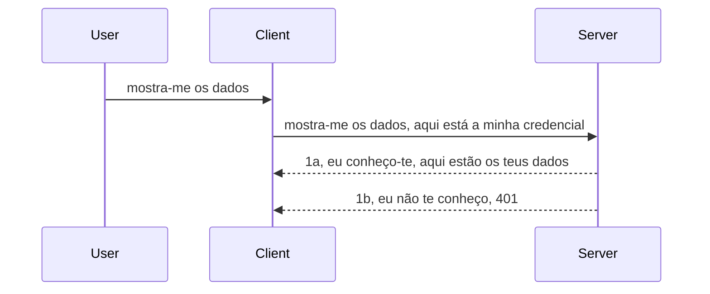

# Autenticação simples

Os SDKs MCP suportam o uso de OAuth 2.1 que, para ser justo, é um processo bastante complexo envolvendo conceitos como servidor de autenticação, servidor de recursos, envio de credenciais, obtenção de um código, troca do código por um token bearer até finalmente conseguir os dados do recurso. Se não estiver habituado ao OAuth, que é uma ótima coisa para implementar, é uma boa ideia começar com um nível básico de autenticação e evoluir para uma segurança cada vez melhor. É por isso que este capítulo existe, para o ajudar a progredir para uma autenticação mais avançada.

## Autenticação, o que queremos dizer?

Autenticação é a abreviatura de autenticação e autorização. A ideia é que precisamos fazer duas coisas:

- **Autenticação**, que é o processo de descobrir se deixamos uma pessoa entrar em nossa casa, que tem o direito de estar "aqui", ou seja, ter acesso ao nosso servidor de recursos onde vivem as funcionalidades do nosso MCP Server.
- **Autorização**, que é o processo de descobrir se um utilizador deve ter acesso a esses recursos específicos que está a pedir, por exemplo, essas encomendas ou esses produtos, ou se está autorizado apenas a ler o conteúdo mas não a eliminar, como outro exemplo.

## Credenciais: como dizemos ao sistema quem somos

Bem, a maioria dos programadores web começa a pensar em termos de fornecer uma credencial ao servidor, geralmente um segredo que diz se estão autorizados a estar aqui "Autenticação". Essa credencial é normalmente uma versão codificada em base64 do nome de utilizador e senha ou uma chave de API que identifica unicamente um utilizador específico.

Isso envolve enviá-la via um cabeçalho chamado "Authorization" da seguinte forma:

```json
{ "Authorization": "secret123" }
```

Isto é geralmente referido como autenticação básica. Como o fluxo geral funciona é da seguinte maneira:



Agora que entendemos como funciona do ponto de vista do fluxo, como implementamos isso? Bem, a maioria dos servidores web tem um conceito chamado middleware, uma peça de código que é executada como parte do pedido que pode verificar as credenciais, e se as credenciais forem válidas pode deixar o pedido passar. Se o pedido não tiver credenciais válidas, recebe um erro de autenticação. Vamos ver como isso pode ser implementado:

**Python**

```python
class AuthMiddleware(BaseHTTPMiddleware):
    async def dispatch(self, request, call_next):

        has_header = request.headers.get("Authorization")
        if not has_header:
            print("-> Missing Authorization header!")
            return Response(status_code=401, content="Unauthorized")

        if not valid_token(has_header):
            print("-> Invalid token!")
            return Response(status_code=403, content="Forbidden")

        print("Valid token, proceeding...")
       
        response = await call_next(request)
        # adicionar quaisquer cabeçalhos do cliente ou alterar a resposta de alguma forma
        return response


starlette_app.add_middleware(CustomHeaderMiddleware)
```

Aqui temos:

- Criado um middleware chamado `AuthMiddleware` onde o seu método `dispatch` é invocado pelo servidor web.
- Adicionado o middleware ao servidor web:

    ```python
    starlette_app.add_middleware(AuthMiddleware)
    ```

- Escrit lógica de validação que verifica se o cabeçalho Authorization está presente e se o segredo enviado é válido:

    ```python
    has_header = request.headers.get("Authorization")
    if not has_header:
        print("-> Missing Authorization header!")
        return Response(status_code=401, content="Unauthorized")

    if not valid_token(has_header):
        print("-> Invalid token!")
        return Response(status_code=403, content="Forbidden")
    ```

    se o segredo estiver presente e for válido, deixamos o pedido passar chamando `call_next` e retornamos a resposta.

    ```python
    response = await call_next(request)
    # adicionar quaisquer cabeçalhos personalizados ou alterar a resposta de alguma forma
    return response
    ```

Como funciona é que, se um pedido web for feito ao servidor, o middleware será invocado e dada sua implementação, ele deixará o pedido passar ou acabará por retornar um erro que indica que o cliente não tem permissão para continuar.

**TypeScript**

Aqui criamos um middleware com o popular framework Express e interceptamos o pedido antes de chegar ao MCP Server. Aqui está o código para isso:

```typescript
function isValid(secret) {
    return secret === "secret123";
}

app.use((req, res, next) => {
    // 1. Cabeçalho de autorização presente?
    if(!req.headers["Authorization"]) {
        res.status(401).send('Unauthorized');
    }
    
    let token = req.headers["Authorization"];

    // 2. Verificar validade.
    if(!isValid(token)) {
        res.status(403).send('Forbidden');
    }

   
    console.log('Middleware executed');
    // 3. Passa a requisição para o próximo passo na cadeia de requisições.
    next();
});
```

Neste código:

1. Verificamos se o cabeçalho Authorization está presente, se não estiver enviamos um erro 401.
2. Garantimos que a credencial/token é válido, se não enviamos um erro 403.
3. Finalmente, deixamos o pedido seguir na pipeline e retorna o recurso solicitado.

## Exercício: Implementar autenticação

Vamos usar os nossos conhecimentos e experimentar implementar isto. Aqui está o plano:

Servidor

- Criar um servidor web e uma instância MCP.
- Implementar um middleware para o servidor.

Cliente

- Enviar pedido web, com credencial, via cabeçalho.

### -1- Criar um servidor web e instância MCP

> [!WARNING]
> O exemplo TypeScript abaixo é direcionado ao MCP `2025-11-25`. Rastreia transportes
> por `mcp-session-id` e não é um exemplo de transporte atual `2026-07-28`. MCP
> `2026-07-28` remove o handshake `initialize` e o ID de sessão do protocolo; novas
> implementações usam pedidos autocontidos. Veja
> [O que mudou no MCP: A especificação de 2026-07-28](../../01-CoreConcepts/mcp-2026-07-28.md).

No nosso primeiro passo, precisamos criar a instância do servidor web e o MCP Server.

**Python**

Aqui criamos uma instância do MCP server, criamos uma aplicação web starlette e a hospedamos com uvicorn.

```python
# a criar Servidor MCP

app = FastMCP(
    name="MCP Resource Server",
    instructions="Resource Server that validates tokens via Authorization Server introspection",
    host=settings["host"],
    port=settings["port"],
    debug=True
)

# a criar aplicação web starlette
starlette_app = app.streamable_http_app()

# a servir aplicação via uvicorn
async def run(starlette_app):
    import uvicorn
    config = uvicorn.Config(
            starlette_app,
            host=app.settings.host,
            port=app.settings.port,
            log_level=app.settings.log_level.lower(),
        )
    server = uvicorn.Server(config)
    await server.serve()

run(starlette_app)
```

Neste código:

- Criamos o MCP Server.
- Construímos a aplicação web starlette a partir do MCP Server, `app.streamable_http_app()`.
- Hospedamos e servimos a aplicação web usando uvicorn `server.serve()`.

**TypeScript**

Aqui criamos uma instância do MCP Server.

```typescript
const server = new McpServer({
      name: "example-server",
      version: "1.0.0"
    });

    // ... configurar recursos do servidor, ferramentas e prompts ...
```

Esta criação do MCP Server precisará acontecer dentro da definição da rota POST /mcp, por isso vamos pegar o código acima e movê-lo assim:

```typescript
import express from "express";
import { randomUUID } from "node:crypto";
import { McpServer } from "@modelcontextprotocol/sdk/server/mcp.js";
import { StreamableHTTPServerTransport } from "@modelcontextprotocol/sdk/server/streamableHttp.js";
import { isInitializeRequest } from "@modelcontextprotocol/sdk/types.js"

const app = express();
app.use(express.json());

// Mapa para armazenar transportes por ID de sessão
const transports: { [sessionId: string]: StreamableHTTPServerTransport } = {};

// Lidar com pedidos POST para comunicação cliente-servidor
app.post('/mcp', async (req, res) => {
  // Verificar existência do ID de sessão
  const sessionId = req.headers['mcp-session-id'] as string | undefined;
  let transport: StreamableHTTPServerTransport;

  if (sessionId && transports[sessionId]) {
    // Reutilizar transporte existente
    transport = transports[sessionId];
  } else if (!sessionId && isInitializeRequest(req.body)) {
    // Novo pedido de inicialização
    transport = new StreamableHTTPServerTransport({
      sessionIdGenerator: () => randomUUID(),
      onsessioninitialized: (sessionId) => {
        // Armazenar o transporte pelo ID da sessão
        transports[sessionId] = transport;
      },
      // A proteção contra DNS rebinding está desativada por defeito para compatibilidade com versões anteriores. Se estiver a executar este servidor
      // localmente, certifique-se de definir:
      // enableDnsRebindingProtection: true,
      // allowedHosts: ['127.0.0.1'],
    });

    // Limpar transporte quando for fechado
    transport.onclose = () => {
      if (transport.sessionId) {
        delete transports[transport.sessionId];
      }
    };
    const server = new McpServer({
      name: "example-server",
      version: "1.0.0"
    });

    // ... configurar recursos do servidor, ferramentas e prompts ...

    // Ligar ao servidor MCP
    await server.connect(transport);
  } else {
    // Pedido inválido
    res.status(400).json({
      jsonrpc: '2.0',
      error: {
        code: -32000,
        message: 'Bad Request: No valid session ID provided',
      },
      id: null,
    });
    return;
  }

  // Lidar com o pedido
  await transport.handleRequest(req, res, req.body);
});

// Gestor reutilizável para pedidos GET e DELETE
const handleSessionRequest = async (req: express.Request, res: express.Response) => {
  const sessionId = req.headers['mcp-session-id'] as string | undefined;
  if (!sessionId || !transports[sessionId]) {
    res.status(400).send('Invalid or missing session ID');
    return;
  }
  
  const transport = transports[sessionId];
  await transport.handleRequest(req, res);
};

// Lidar com pedidos GET para notificações do servidor para o cliente via SSE
app.get('/mcp', handleSessionRequest);

// Lidar com pedidos DELETE para terminação de sessão
app.delete('/mcp', handleSessionRequest);

app.listen(3000);
```

Agora pode ver como a criação do MCP Server foi movida para dentro de `app.post("/mcp")`.

Vamos passar para o próximo passo de criar o middleware para que possamos validar a credencial recebida.

### -2- Implementar um middleware para o servidor

Vamos passar para a parte do middleware. Aqui vamos criar um middleware que procura uma credencial no cabeçalho `Authorization` e a valida. Se for aceitável, o pedido continuará para fazer o que precisa (por ex. listar ferramentas, ler um recurso ou qualquer funcionalidade MCP que o cliente pediu).

**Python**

Para criar o middleware, precisamos criar uma classe que herde de `BaseHTTPMiddleware`. Existem duas partes interessantes:

- O pedido `request`, do qual lemos a informação do cabeçalho.
- `call_next`, o callback que precisamos invocar se o cliente trouxe uma credencial que aceitamos.

Primeiro, precisamos tratar o caso se o cabeçalho `Authorization` estiver em falta:

```python
has_header = request.headers.get("Authorization")

# sem cabeçalho presente, falhar com 401, caso contrário continuar.
if not has_header:
    print("-> Missing Authorization header!")
    return Response(status_code=401, content="Unauthorized")
```

Aqui enviamos uma mensagem 401 unauthorized pois o cliente está a falhar a autenticação.

De seguida, se foi enviada uma credencial, é necessário verificar a sua validade assim:

```python
 if not valid_token(has_header):
    print("-> Invalid token!")
    return Response(status_code=403, content="Forbidden")
```

Note como enviamos uma mensagem 403 forbidden acima. Vamos ver o middleware completo abaixo implementando tudo o que mencionámos acima:

```python
class AuthMiddleware(BaseHTTPMiddleware):
    async def dispatch(self, request, call_next):

        has_header = request.headers.get("Authorization")
        if not has_header:
            print("-> Missing Authorization header!")
            return Response(status_code=401, content="Unauthorized")

        if not valid_token(has_header):
            print("-> Invalid token!")
            return Response(status_code=403, content="Forbidden")

        print("Valid token, proceeding...")
        print(f"-> Received {request.method} {request.url}")
        response = await call_next(request)
        response.headers['Custom'] = 'Example'
        return response

```

Ótimo, mas e a função `valid_token`? Aqui está abaixo:

```python
# NÃO utilize em produção - melhore-o !!
def valid_token(token: str) -> bool:
    # remova o prefixo "Bearer "
    if token.startswith("Bearer "):
        token = token[7:]
        return token == "secret-token"
    return False
```

Isto obviamente deveria melhorar.

IMPORTANTE: Nunca deve ter segredos como este no código. Idealmente, deve recuperar o valor para comparação de uma fonte de dados ou de um IDP (fornecedor de serviço de identidade) ou melhor ainda, deixar que o IDP faça a validação.

**TypeScript**

Para implementar isto com Express, precisamos chamar o método `use` que recebe funções middleware.

Precisamos:

- Interagir com o objeto pedido para verificar a credencial passada na propriedade `Authorization`.
- Validar a credencial, e se tudo estiver bem, deixar o pedido continuar e executar o pedido MCP do cliente (por ex. listar ferramentas, ler recurso ou qualquer outra coisa MCP relacionada).

Aqui verificamos se o cabeçalho `Authorization` está presente e se não estiver, paramos o pedido:

```typescript
if(!req.headers["authorization"]) {
    res.status(401).send('Unauthorized');
    return;
}
```

Se o cabeçalho não for enviado, recebe um 401.

De seguida, verificamos se a credencial é válida, e caso não seja, paramos o pedido novamente mas com uma mensagem um pouco diferente:

```typescript
if(!isValid(token)) {
    res.status(403).send('Forbidden');
    return;
} 
```

Note como agora obtém um erro 403.

Aqui está o código completo:

```typescript
app.use((req, res, next) => {
    console.log('Request received:', req.method, req.url, req.headers);
    console.log('Headers:', req.headers["authorization"]);
    if(!req.headers["authorization"]) {
        res.status(401).send('Unauthorized');
        return;
    }
    
    let token = req.headers["authorization"];

    if(!isValid(token)) {
        res.status(403).send('Forbidden');
        return;
    }  

    console.log('Middleware executed');
    next();
});
```

Configurámos o servidor web para aceitar um middleware que verifica a credencial que o cliente esperamos que nos envie. E o cliente em si?

### -3- Enviar pedido web com credencial via cabeçalho

Precisamos garantir que o cliente está a passar a credencial através do cabeçalho. Como vamos usar um cliente MCP para isso, precisamos descobrir como é feito.

**Python**

Para o cliente, precisamos passar um cabeçalho com a nossa credencial assim:

```python
# NÃO codifique o valor diretamente, tenha-o no mínimo numa variável de ambiente ou num armazenamento mais seguro
token = "secret-token"

async with streamablehttp_client(
        url = f"http://localhost:{port}/mcp",
        headers = {"Authorization": f"Bearer {token}"}
    ) as (
        read_stream,
        write_stream,
        session_callback,
    ):
        async with ClientSession(
            read_stream,
            write_stream
        ) as session:
            await session.initialize()
      
            # TODO, o que quer que seja feito no cliente, por exemplo listar ferramentas, chamar ferramentas, etc.
```

Note como preenchemos a propriedade `headers` da seguinte forma ` headers = {"Authorization": f"Bearer {token}"}`.

**TypeScript**

Podemos resolver isto em dois passos:

1. Preencher um objeto de configuração com a nossa credencial.
2. Passar o objeto de configuração para o transporte.

```typescript

// NÃO codifique o valor diretamente como mostrado aqui. No mínimo, tenha-o como uma variável de ambiente e use algo como dotenv (em modo de desenvolvimento).
let token = "secret123"

// defina um objeto de opções de transporte do cliente
let options: StreamableHTTPClientTransportOptions = {
  sessionId: sessionId,
  requestInit: {
    headers: {
      "Authorization": "secret123"
    }
  }
};

// passe o objeto de opções para o transporte
async function main() {
   const transport = new StreamableHTTPClientTransport(
      new URL(serverUrl),
      options
   );
```

Aqui acima, pode ver como criámos um objeto `options` e colocámos os nossos cabeçalhos na propriedade `requestInit`.

IMPORTANTE: Como melhorar isso daqui em diante? Bem, a implementação atual tem alguns problemas. Primeiro, passar uma credencial assim é bastante arriscado a menos que tenha pelo menos HTTPS. Mesmo assim, a credencial pode ser roubada, por isso precisa de um sistema onde possa facilmente revogar o token e adicionar verificações adicionais como de onde no mundo está vindo, se o pedido acontece com muita frequência (comportamento de bot), em suma, há uma série de preocupações.

Deve-se dizer que para APIs muito simples onde não quer que ninguém chame sua API sem estar autenticado, o que temos aqui é um bom começo.

Dito isto, vamos tentar reforçar a segurança um pouco usando um formato padronizado como JSON Web Token, também conhecido como JWT ou tokens "JOT".

## JSON Web Tokens, JWT

Então, estamos a tentar melhorar de enviar credenciais muito simples. Quais as melhorias imediatas que obtemos ao adotar o JWT?

- **Melhorias de segurança**. Na autenticação básica, envia-se o nome de utilizador e senha como um token codificado em base64 (ou uma chave API) repetidamente, o que aumenta o risco. Com JWT, envia o seu nome de utilizador e senha e recebe um token em retorno, que também é temporário, significando que vai expirar. JWT permite usar facilmente controlo de acesso detalhado usando roles, scopes e permissões.
- **Sem estado e escalabilidade**. JWTs são autocontidos, transportam toda a informação do utilizador e eliminam a necessidade de armazenar sessões no servidor. O token pode também ser validado localmente.
- **Interoperabilidade e federação**. JWTs são centrais no Open ID Connect e usados com fornecedores conhecidos de identidade como Entra ID, Google Identity e Auth0. Também possibilitam uso de single sign-on e muito mais, tornando-os de nível empresarial.
- **Modularidade e flexibilidade**. JWTs também podem ser usados com API Gateways como Azure API Management, NGINX e outros. Suportam cenários de autenticação e comunicação de servidor para serviço incluindo impersonação e delegação.
- **Desempenho e cache**. JWTs podem ser cacheados após a decodificação, reduzindo a necessidade de parsing. Isso ajuda especialmente com apps de alto tráfego, melhorando rendimento e reduzindo carga na infraestrutura escolhida.
- **Funcionalidades avançadas**. Também suportam introspecção (verificação de validade no servidor) e revogação (tornar um token inválido).

Com todos estes benefícios, vamos ver como podemos levar nossa implementação ao próximo nível.

## Transformar autenticação básica em JWT

Então, as mudanças que precisamos fazer, a alto nível, são:

- **Aprender a construir um token JWT** e prepará-lo para ser enviado de cliente para servidor.
- **Validar um token JWT**, e se válido, permitir que o cliente aceda aos nossos recursos.
- **Armazenamento seguro do token**. Como armazenamos este token.
- **Proteger as rotas**. Precisamos proteger as rotas, no nosso caso, proteger rotas e funcionalidades MCP específicas.
- **Adicionar tokens de atualização**. Garantir que criamos tokens de curta duração mas tokens de atualização de longa duração que podem ser usados para adquirir novos tokens se expirarem. Também garantir que existe um endpoint de refresh e uma estratégia de rotação.

### -1- Construir um token JWT

Primeiro, um token JWT tem as seguintes partes:

- **cabeçalho**, algoritmo usado e tipo do token.
- **payload**, claims, como sub (o utilizador ou entidade que o token representa. Num cenário de autenticação, normalmente é o userid), exp (quando expira), role (papel).
- **assinatura**, assinada com um segredo ou chave privada.

Para isso, precisaremos construir o cabeçalho, payload e o token codificado.

**Python**

```python

import jwt
import jwt
from jwt.exceptions import ExpiredSignatureError, InvalidTokenError
import datetime

# Chave secreta usada para assinar o JWT
secret_key = 'your-secret-key'

header = {
    "alg": "HS256",
    "typ": "JWT"
}

# as informações do utilizador, as suas reivindicações e o tempo de expiração
payload = {
    "sub": "1234567890",               # Assunto (ID do utilizador)
    "name": "User Userson",                # Reivindicação personalizada
    "admin": True,                     # Reivindicação personalizada
    "iat": datetime.datetime.utcnow(),# Emitido em
    "exp": datetime.datetime.utcnow() + datetime.timedelta(hours=1)  # Expiração
}

# codificá-lo
encoded_jwt = jwt.encode(payload, secret_key, algorithm="HS256", headers=header)
```

No código acima:

- Definimos um cabeçalho usando HS256 como algoritmo e tipo como JWT.
- Construímos um payload que contém um sub ou id do utilizador, um nome de utilizador, um papel, quando foi emitido e quando está definido para expirar, implementando assim o aspecto temporário que mencionámos anteriormente.

**TypeScript**

Aqui vamos precisar de algumas dependências que nos ajudarão a construir o token JWT.

Dependências

```sh

npm install jsonwebtoken
npm install --save-dev @types/jsonwebtoken
```

Agora que temos isso, vamos criar o cabeçalho, payload e através disso criar o token codificado.

```typescript
import jwt from 'jsonwebtoken';

const secretKey = 'your-secret-key'; // Usar variáveis de ambiente em produção

// Definir a carga útil
const payload = {
  sub: '1234567890',
  name: 'User usersson',
  admin: true,
  iat: Math.floor(Date.now() / 1000), // Emitido em
  exp: Math.floor(Date.now() / 1000) + 60 * 60 // Expira em 1 hora
};

// Definir o cabeçalho (opcional, jsonwebtoken define padrões)
const header = {
  alg: 'HS256',
  typ: 'JWT'
};

// Criar o token
const token = jwt.sign(payload, secretKey, {
  algorithm: 'HS256',
  header: header
});

console.log('JWT:', token);
```

Este token é:

Assinado usando HS256
Válido por 1 hora
Inclui claims como sub, name, admin, iat, e exp.

### -2- Validar um token

Também precisaremos validar um token, isto é algo que devemos fazer no servidor para garantir que o que o cliente está a enviar é de facto válido. Existem muitas verificações que devemos fazer aqui desde validar a sua estrutura até à sua validade. Também é aconselhável adicionar outras verificações para ver se o utilizador está no seu sistema e mais.

Para validar um token, precisamos decodificá-lo para poder lê-lo e depois começar a verificar sua validade:

**Python**

```python

# Decodificar e verificar o JWT
try:
    decoded = jwt.decode(token, secret_key, algorithms=["HS256"])
    print("✅ Token is valid.")
    print("Decoded claims:")
    for key, value in decoded.items():
        print(f"  {key}: {value}")
except ExpiredSignatureError:
    print("❌ Token has expired.")
except InvalidTokenError as e:
    print(f"❌ Invalid token: {e}")

```


Neste código, chamamos `jwt.decode` usando o token, a chave secreta e o algoritmo escolhido como entrada. Note como usamos uma estrutura try-catch já que uma validação falhada leva a que seja gerado um erro.

**TypeScript**

Aqui precisamos chamar `jwt.verify` para obter uma versão descodificada do token que possamos analisar mais a fundo. Se esta chamada falhar, isso significa que a estrutura do token está incorreta ou que já não é válido.

```typescript

try {
  const decoded = jwt.verify(token, secretKey);
  console.log('Decoded Payload:', decoded);
} catch (err) {
  console.error('Token verification failed:', err);
}
```

NOTA: como mencionado anteriormente, devemos realizar verificações adicionais para garantir que este token aponta para um utilizador no nosso sistema e garantir que o utilizador tem os direitos que afirma possuir.

A seguir, vamos analisar o controlo de acesso baseado em funções, também conhecido como RBAC.

## Adicionar controlo de acesso baseado em funções

A ideia é que queremos expressar que diferentes funções têm permissões diferentes. Por exemplo, assumimos que um administrador pode fazer tudo, que um utilizador normal pode ler/escrever e que um convidado só pode ler. Portanto, aqui estão alguns níveis de permissão possíveis:

- Admin.Write 
- User.Read
- Guest.Read

Vamos ver como podemos implementar este controlo com middleware. Middlewares podem ser adicionados por rota assim como para todas as rotas.

**Python**

```python
from starlette.middleware.base import BaseHTTPMiddleware
from starlette.responses import JSONResponse
import jwt

# NÃO tenha o segredo no código, isto é apenas para fins de demonstração. Leia-o de um local seguro.
SECRET_KEY = "your-secret-key" # coloque isto numa variável de ambiente
REQUIRED_PERMISSION = "User.Read"

class JWTPermissionMiddleware(BaseHTTPMiddleware):
    async def dispatch(self, request, call_next):
        auth_header = request.headers.get("Authorization")
        if not auth_header or not auth_header.startswith("Bearer "):
            return JSONResponse({"error": "Missing or invalid Authorization header"}, status_code=401)

        token = auth_header.split(" ")[1]
        try:
            decoded = jwt.decode(token, SECRET_KEY, algorithms=["HS256"])
        except jwt.ExpiredSignatureError:
            return JSONResponse({"error": "Token expired"}, status_code=401)
        except jwt.InvalidTokenError:
            return JSONResponse({"error": "Invalid token"}, status_code=401)

        permissions = decoded.get("permissions", [])
        if REQUIRED_PERMISSION not in permissions:
            return JSONResponse({"error": "Permission denied"}, status_code=403)

        request.state.user = decoded
        return await call_next(request)


```

Existem algumas formas diferentes de adicionar o middleware como abaixo:

```python

# Alt 1: adicionar middleware durante a construção da aplicação starlette
middleware = [
    Middleware(JWTPermissionMiddleware)
]

app = Starlette(routes=routes, middleware=middleware)

# Alt 2: adicionar middleware depois da aplicação starlette estar já construída
starlette_app.add_middleware(JWTPermissionMiddleware)

# Alt 3: adicionar middleware por rota
routes = [
    Route(
        "/mcp",
        endpoint=..., # manipulador
        middleware=[Middleware(JWTPermissionMiddleware)]
    )
]
```

**TypeScript**

Podemos usar `app.use` e um middleware que será executado para todos os pedidos.

```typescript
app.use((req, res, next) => {
    console.log('Request received:', req.method, req.url, req.headers);
    console.log('Headers:', req.headers["authorization"]);

    // 1. Verificar se o cabeçalho de autorização foi enviado

    if(!req.headers["authorization"]) {
        res.status(401).send('Unauthorized');
        return;
    }
    
    let token = req.headers["authorization"];

    // 2. Verificar se o token é válido
    if(!isValid(token)) {
        res.status(403).send('Forbidden');
        return;
    }  

    // 3. Verificar se o utilizador do token existe no nosso sistema
    if(!isExistingUser(token)) {
        res.status(403).send('Forbidden');
        console.log("User does not exist");
        return;
    }
    console.log("User exists");

    // 4. Verificar se o token tem as permissões corretas
    if(!hasScopes(token, ["User.Read"])){
        res.status(403).send('Forbidden - insufficient scopes');
    }

    console.log("User has required scopes");

    console.log('Middleware executed');
    next();
});

```

Há várias coisas que podemos deixar que o nosso middleware faça e que o nosso middleware DEVE fazer, nomeadamente:

1. Verificar se o cabeçalho de autorização está presente
2. Verificar se o token é válido, chamamos `isValid` que é um método que escrevemos que verifica a integridade e validade do token JWT.
3. Verificar se o utilizador existe no nosso sistema, devemos verificar isto.

   ```typescript
    // utilizadores na BD
   const users = [
     "user1",
     "User usersson",
   ]

   function isExistingUser(token) {
     let decodedToken = verifyToken(token);

     // TODO, verificar se o utilizador existe na BD
     return users.includes(decodedToken?.name || "");
   }
   ```

   Acima, criámos uma lista de `users` muito simples, que obviamente deveria estar numa base de dados.

4. Além disso, também devemos verificar se o token tem as permissões corretas.

   ```typescript
   if(!hasScopes(token, ["User.Read"])){
        res.status(403).send('Forbidden - insufficient scopes');
   }
   ```

   Neste código acima do middleware, verificamos que o token contém a permissão User.Read, se não enviamos um erro 403. Abaixo está o método auxiliar `hasScopes`.

   ```typescript
   function hasScopes(scope: string, requiredScopes: string[]) {
     let decodedToken = verifyToken(scope);
    return requiredScopes.every(scope => decodedToken?.scopes.includes(scope));
  }
   ```

Have a think which additional checks you should be doing, but these are the absolute minimum of checks you should be doing.

Using Express as a web framework is a common choice. There are helpers library when you use JWT so you can write less code.

- `express-jwt`, helper library that provides a middleware that helps decode your token.
- `express-jwt-permissions`, this provides a middleware `guard` that helps check if a certain permission is on the token.

Here's what these libraries can look like when used:

```typescript
const express = require('express');
const jwt = require('express-jwt');
const guard = require('express-jwt-permissions')();

const app = express();
const secretKey = 'your-secret-key'; // put this in env variable

// Decode JWT and attach to req.user
app.use(jwt({ secret: secretKey, algorithms: ['HS256'] }));

// Check for User.Read permission
app.use(guard.check('User.Read'));

// multiple permissions
// app.use(guard.check(['User.Read', 'Admin.Access']));

app.get('/protected', (req, res) => {
  res.json({ message: `Welcome ${req.user.name}` });
});

// Error handler
app.use((err, req, res, next) => {
  if (err.code === 'permission_denied') {
    return res.status(403).send('Forbidden');
  }
  next(err);
});

```

Agora que viu como middleware pode ser usado tanto para autenticação como para autorização, e quanto ao MCP? Ele muda a forma como fazemos autenticação? Vamos descobrir na secção seguinte.

### -3- Adicionar RBAC ao MCP

Viu até agora como pode adicionar RBAC via middleware, contudo, para MCP não há uma forma fácil de adicionar um RBAC por funcionalidade MCP, então o que fazemos? Bem, temos apenas que adicionar código como este que verifica neste caso se o cliente tem os direitos para chamar uma ferramenta específica:

Tem algumas opções diferentes para conseguir RBAC por funcionalidade, aqui estão algumas:

- Adicione uma verificação para cada ferramenta, recurso, prompt onde precisar verificar o nível de permissão.

   **python**

   ```python
   @tool()
   def delete_product(id: int):
      try:
          check_permissions(role="Admin.Write", request)
      catch:
        pass # cliente falhou na autorização, levantar erro de autorização
   ```

   **typescript**

   ```typescript
   server.registerTool(
    "delete-product",
    {
      title: Delete a product",
      description: "Deletes a product",
      inputSchema: { id: z.number() }
    },
    async ({ id }) => {
      
      try {
        checkPermissions("Admin.Write", request);
        // todo, enviar id para productService e entrada remota
      } catch(Exception e) {
        console.log("Authorization error, you're not allowed");  
      }

      return {
        content: [{ type: "text", text: `Deletected product with id ${id}` }]
      };
    }
   );
   ```


- Use uma abordagem avançada do servidor e os manipuladores de pedido para minimizar quantos locais precisa de fazer a verificação.

   **Python**

   ```python
   
   tool_permission = {
      "create_product": ["User.Write", "Admin.Write"],
      "delete_product": ["Admin.Write"]
   }

   def has_permission(user_permissions, required_permissions) -> bool:
      # user_permissions: lista de permissões que o utilizador tem
      # required_permissions: lista de permissões necessárias para a ferramenta
      return any(perm in user_permissions for perm in required_permissions)

   @server.call_tool()
   async def handle_call_tool(
     name: str, arguments: dict[str, str] | None
   ) -> list[types.TextContent]:
    # Assuma que request.user.permissions é uma lista de permissões do utilizador
     user_permissions = request.user.permissions
     required_permissions = tool_permission.get(name, [])
     if not has_permission(user_permissions, required_permissions):
        # Levantar erro "Não tem permissão para usar a ferramenta {name}"
        raise Exception(f"You don't have permission to call tool {name}")
     # continuar e chamar a ferramenta
     # ...
   ```   
   

   **TypeScript**

   ```typescript
   function hasPermission(userPermissions: string[], requiredPermissions: string[]): boolean {
       if (!Array.isArray(userPermissions) || !Array.isArray(requiredPermissions)) return false;
       // Retorna verdadeiro se o utilizador tiver pelo menos uma permissão necessária
       
       return requiredPermissions.some(perm => userPermissions.includes(perm));
   }
  
   server.setRequestHandler(CallToolRequestSchema, async (request) => {
      const { params: { name } } = request;
  
      let permissions = request.user.permissions;
  
      if (!hasPermission(permissions, toolPermissions[name])) {
         return new Error(`You don't have permission to call ${name}`);
      }
  
      // continua..
   });
   ```

   Note, terá que garantir que o seu middleware atribui um token descodificado à propriedade user do pedido para que o código acima seja simples.

### Resumindo

Agora que discutimos como adicionar suporte para RBAC em geral e para MCP em particular, é hora de tentar implementar segurança por sua conta para garantir que compreendeu os conceitos apresentados.

## Exercício 1: Construir um servidor mcp e cliente mcp usando autenticação básica

Aqui irá usar o que aprendeu em termos de enviar credenciais através dos cabeçalhos.

## Solução 1

[Solução 1](./code/basic/README.md)

## Exercício 2: Atualizar a solução do Exercício 1 para usar JWT

Use a primeira solução, mas desta vez, vamos melhorá-la.

Em vez de usar Basic Auth, vamos usar JWT.

## Solução 2

[Solução 2](./solution/jwt-solution/README.md)

## Desafio

Adicione o RBAC por ferramenta que descrevemos na secção "Adicionar RBAC ao MCP".

## Resumo

Esperamos que tenha aprendido muito neste capítulo, desde nenhuma segurança, até à segurança básica, até JWT e como pode ser adicionado ao MCP.

Construímos uma base sólida com JWTs personalizados, mas conforme escalamos, estamos a avançar para um modelo de identidade baseado em standards. Adotar um IdP como Entra ou Keycloak permite-nos descarregar a emissão, validação e gestão do ciclo de vida dos tokens para uma plataforma confiável — libertando-nos para nos concentrarmos na lógica da aplicação e na experiência do utilizador.

Para isso, temos um capítulo mais [avançado sobre Entra](../../05-AdvancedTopics/mcp-security-entra/README.md)

## O que vem a seguir

- Seguinte: [Configurar Hosts MCP](../12-mcp-hosts/README.md)

---

<!-- CO-OP TRANSLATOR DISCLAIMER START -->
**Aviso Legal**:
Este documento foi traduzido utilizando o serviço de tradução automática [Co-op Translator](https://github.com/Azure/co-op-translator). Embora nos esforcemos pela precisão, esteja ciente de que traduções automáticas podem conter erros ou imprecisões. O documento original na sua língua nativa deve ser considerado a fonte autorizada. Para informações críticas, recomenda-se tradução profissional humana. Não nos responsabilizamos por quaisquer mal-entendidos ou interpretações incorretas resultantes da utilização desta tradução.
<!-- CO-OP TRANSLATOR DISCLAIMER END -->