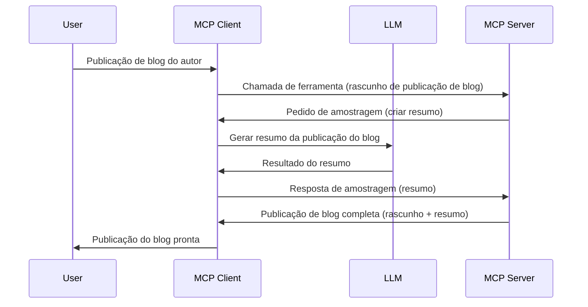

> [!WARNING]
> A amostragem está obsoleta no MCP `2026-07-28`. Esta lição é mantida para
> implementações legadas. Novos servidores devem integrar-se diretamente com uma API de
> fornecedor LLM.

# Amostragem - delegar funcionalidades ao Cliente

> A amostragem permanece na especificação `2026-07-28` para compatibilidade e é
> elegível para remoção na primeira revisão lançada a partir de 28 de julho de
> 2027. Exemplos nesta lição podem usar APIs do SDK que implementam `2025-11-25`.
> Ver [O que mudou no MCP: A especificação 2026-07-28](../../01-CoreConcepts/mcp-2026-07-28.md).

Em implementações legadas, a amostragem permite a um servidor MCP pedir ajuda a um LLM
gerido pelo cliente. Para novas implementações, chame o fornecedor LLM escolhido
diretamente.

Vamos explorar alguns casos de uso e como construir uma solução que envolva amostragem.

## Visão geral

Nesta lição, focamos em explicar quando e onde usar amostragem e como configurá-la.

## Objetivos de aprendizagem

Neste capítulo, iremos:

- Explicar o que é a amostragem e quando usá-la.
- Mostrar como configurar a amostragem no MCP.
- Fornecer exemplos práticos da amostragem em ação.

## O que é amostragem e porque usá-la?

A amostragem é uma funcionalidade avançada que funciona da seguinte forma:



### Pedido de amostragem

Ok, agora que temos uma visão geral de um cenário credível, vamos falar sobre o pedido de amostragem que o servidor envia ao cliente. Eis como tal pedido pode parecer em formato JSON-RPC:

```json
{
  "jsonrpc": "2.0",
  "id": 1,
  "method": "sampling/createMessage",
  "params": {
    "messages": [
      {
        "role": "user",
        "content": {
          "type": "text",
          "text": "Create a blog post summary of the following blog post: <BLOG POST>"
        }
      }
    ],
    "modelPreferences": {
      "hints": [
        {
          "name": "claude-3-sonnet"
        }
      ],
      "intelligencePriority": 0.8,
      "speedPriority": 0.5
    },
    "systemPrompt": "You are a helpful assistant.",
    "maxTokens": 100
  }
}
```

Há algumas coisas aqui que vale a pena destacar:

- O prompt, em content -> text, é o nosso prompt que é uma instrução para o LLM resumir o conteúdo de um post de blog.

- **modelPreferences**. Esta secção é exatamente isso, uma preferência, uma recomendação da configuração a usar com o LLM. O utilizador pode decidir seguir estas recomendações ou alterá-las. Neste caso há recomendações sobre o modelo a usar e prioridade para rapidez e inteligência.
- **systemPrompt**, este é o seu prompt normal do sistema que dá personalidade ao seu LLM e contém instruções de orientação.
- **maxTokens**, esta é outra propriedade usada para indicar quantos tokens se recomenda usar para esta tarefa.

### Resposta de amostragem

Esta resposta é o que o Cliente MCP acaba por enviar de volta ao Servidor MCP e é o resultado do cliente chamar o LLM, esperar por essa resposta e depois construir esta mensagem. Eis como isto pode parecer em JSON-RPC:

```json
{
  "jsonrpc": "2.0",
  "id": 1,
  "result": {
    "role": "assistant",
    "content": {
      "type": "text",
      "text": "Here's your abstract <ABSTRACT>"
    },
    "model": "gpt-5",
    "stopReason": "endTurn"
  }
}
```

Note como a resposta é um resumo do post do blog exatamente como pedimos. Note também como o `model` usado não é o que pedimos, mas "gpt-5" em vez de "claude-3-sonnet". Isto serve para ilustrar que o utilizador pode mudar de opinião sobre o que usar e que o seu pedido de amostragem é uma recomendação.

Ok, agora que entendemos o fluxo principal, e a tarefa útil para a usar "criação de post de blog + resumo", vamos ver o que precisamos fazer para que funcione.

### Tipos de mensagens

As mensagens de amostragem não se limitam a texto, pode também enviar imagens e áudio. Eis como o JSON-RPC fica diferente:

**Texto**

```json
{
  "type": "text",
  "text": "The message content"
}
```

**Conteúdo de imagem**


```json
{
  "type": "image",
  "data": "base64-encoded-image-data",
  "mimeType": "image/jpeg"
}
```

**Conteúdo de áudio**

```json
{
  "type": "audio",
  "data": "base64-encoded-audio-data",
  "mimeType": "audio/wav"
}
```

> NOTA: Para o estado atual e orientações de migração, veja a
> [documentação de Sampling descontinuada](https://modelcontextprotocol.io/specification/2026-07-28/client/sampling).

## Como Configurar Sampling no Cliente

> Nota: se estiver apenas a construir um servidor, não precisa de fazer muito aqui.

Num cliente, precisa de especificar a seguinte funcionalidade da seguinte forma:

```json
{
  "capabilities": {
    "sampling": {}
  }
}
```

Isto será então detetado quando o seu cliente escolhido inicializar com o servidor.

## Exemplo de Sampling em Ação - Criar um Post de Blog

Vamos codificar um servidor de sampling juntos, teremos de fazer o seguinte:

1. Criar uma ferramenta no Servidor.
1. Essa ferramenta deve criar um pedido de sampling.
1. A ferramenta deve esperar pela resposta ao pedido de sampling do cliente.
1. Depois o resultado da ferramenta deve ser produzido.

Vamos ver o código passo a passo:

### -1- Criar a ferramenta

**python**

```python
@mcp.tool()
async def create_blog(title: str, content: str, ctx: Context[ServerSession, None]) -> str:
    """Create a blog post and generate a summary"""

```

### -2- Criar um pedido de sampling

Estenda a sua ferramenta com o seguinte código:

**python**

```python
post = BlogPost(
        id=len(posts) + 1,
        title=title,
        content=content,
        abstract=""
    )

prompt = f"Create an abstract of the following blog post: title: {title} and draft: {content} "

result = await ctx.session.create_message(
        messages=[
            SamplingMessage(
                role="user",
                content=TextContent(type="text", text=prompt),
            )
        ],
        max_tokens=100,
)

```

### -3- Esperar pela resposta e devolver resposta

**python**

```python
post.abstract = result.content.text

posts.append(post)

# devolver o produto completo
return json.dumps({
    "id": post.title,
    "abstract": post.abstract
})
```

### -4- Código completo

**python**

```python
from starlette.applications import Starlette
from starlette.routing import Mount, Host

from mcp.server.fastmcp import Context, FastMCP

from mcp.server.session import ServerSession
from mcp.types import SamplingMessage, TextContent

import json


from uuid import uuid4
from typing import List
from pydantic import BaseModel


mcp = FastMCP("Blog post generator")

# app = FastAPI()

posts = []

class BlogPost(BaseModel):
    id: int
    title: str
    content: str
    abstract: str

posts: List[BlogPost] = []

@mcp.tool()
async def create_blog(title: str, content: str, ctx: Context[ServerSession, None]) -> str:
    """Create a blog post and generate a summary"""

    post = BlogPost(
        id=len(posts) + 1,
        title=title,
        content=content,
        abstract=""
    )

    prompt = f"Create an abstract of the following blog post: title: {title} and draft: {content} "

    result = await ctx.session.create_message(
        messages=[
            SamplingMessage(
                role="user",
                content=TextContent(type="text", text=prompt),
            )
        ],
        max_tokens=100,
    )

    post.abstract = result.content.text

    posts.append(post)

    # retorna o artigo completo do blog
    return json.dumps({
        "id": post.title,
        "abstract": post.abstract
    })

if __name__ == "__main__":
    print("Starting server...")
    # mcp.run()
    mcp.run(transport="streamable-http")

# executar a app com: python server.py
```

### -5- Testar no Visual Studio Code

Para testar isto no Visual Studio Code, faça o seguinte:

1. Inicie o servidor no terminal
1. Adicione-o ao *mcp.json* (e assegure-se de que está iniciado) por exemplo assim:

   ```json
   "servers": {
      "blog-server": {
        "type": "http",
        "url": "http://localhost:8000/mcp"
      }
   }
   ```

1. Escreva um prompt:

   ```text
   create a blog post named "Where Python comes from", the content is "Python is actually named after Monty Python Flying Circus"
   ```

1. Permita que o sampling aconteça. Na primeira vez que testar, será apresentado um diálogo adicional que terá de aceitar, depois verá o diálogo normal a pedir para executar uma ferramenta

1. Inspecione os resultados. Verá os resultados bem apresentados no GitHub Copilot Chat mas também pode inspecionar a resposta JSON bruta.

**Bónus**. A ferramenta do Visual Studio Code tem excelente suporte para sampling. Pode configurar o acesso a Sampling no seu servidor instalado navegando desta forma:

1. Navegue para a secção de extensões.
1. Selecione o ícone de engrenagem para o seu servidor instalado na secção "MCP SERVERS - INSTALLED".
1 Selecione "Configurar Acesso ao Modelo", aqui pode selecionar quais Modelos o GitHub Copilot pode usar ao realizar sampling. Também pode ver todos os pedidos de sampling recentes selecionando "Mostrar pedidos de Sampling".

## Tarefa

Nesta tarefa, vai construir um Sampling ligeiramente diferente, nomeadamente uma integração de sampling que suporta a geração de descrição de produto. Eis o seu cenário:

**Cenário**: O trabalhador back office num e-commerce precisa de ajuda, demorar muito tempo a gerar descrições de produtos. Portanto, deve construir uma solução onde possa chamar uma ferramenta "create_product" com "title" e "keywords" como argumentos, e esta deve produzir um produto completo incluindo um campo "description" que deve ser preenchido pelo LLM do cliente.

DICA: use o que aprendeu anteriormente para construir este servidor e a sua ferramenta usando um pedido de sampling.

## Solução

[Solução](./solution/README.md)

## Principais Lições


A amostragem é uma funcionalidade poderosa que permite ao servidor delegar tarefas ao cliente quando precisa da ajuda de um LLM.

## O que vem a seguir

- [Capítulo 4 - Implementação prática](../../04-PracticalImplementation/README.md)

---

<!-- CO-OP TRANSLATOR DISCLAIMER START -->
**Aviso Legal**:
Este documento foi traduzido utilizando o serviço de tradução automática [Co-op Translator](https://github.com/Azure/co-op-translator). Embora nos esforcemos pela precisão, esteja ciente de que traduções automáticas podem conter erros ou imprecisões. O documento original na sua língua nativa deve ser considerado a fonte autorizada. Para informações críticas, recomenda-se tradução profissional humana. Não nos responsabilizamos por quaisquer mal-entendidos ou interpretações incorretas resultantes da utilização desta tradução.
<!-- CO-OP TRANSLATOR DISCLAIMER END -->