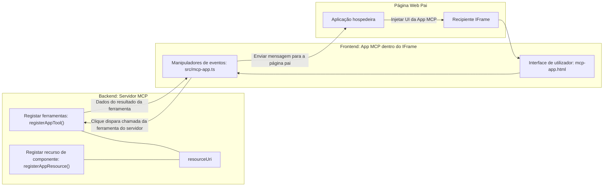
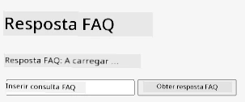
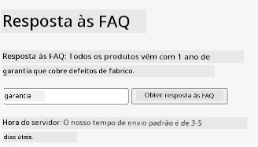
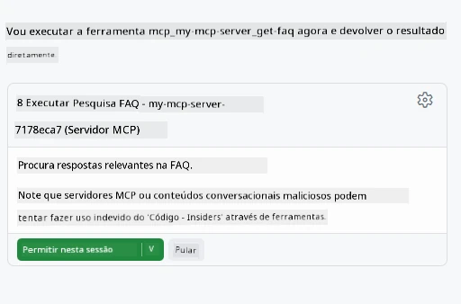

# MCP Apps

MCP Apps é um novo paradigma no MCP. A ideia é que não só respondes com dados de volta de uma chamada a uma ferramenta, como também forneces informação sobre como esta informação deve ser interagida. Isso significa que os resultados da ferramenta agora podem conter informação de UI. Mas porque é que quereríamos isso? Bem, considera como fazes as coisas hoje. Provavelmente comes os resultados de um MCP Server colocando algum tipo de frontend à frente, que é código que precisas de escrever e manter. Por vezes é isso que queres, mas outras vezes seria ótimo se pudesses simplesmente trazer um fragmento de informação auto-contido que tenha tudo, desde os dados até à interface do utilizador.

## Visão Geral

Esta lição fornece orientação prática sobre MCP Apps, como começar com eles e como integrá-los nas tuas Web Apps existentes. MCP Apps é uma adição muito nova ao Standard MCP.

## Objetivos de Aprendizagem

No final desta lição, serás capaz de:

- Explicar o que são MCP Apps.
- Quando usar MCP Apps.
- Construir e integrar os teus próprios MCP Apps.

## MCP Apps - como funciona

A ideia com MCP Apps é fornecer uma resposta que essencialmente é um componente a ser renderizado. Tal componente pode ter visuais e interatividade, por exemplo, cliques de botão, input do utilizador e mais. Vamos começar pelo lado do servidor e nosso MCP Server. Para criar um componente MCP App precisas de criar uma ferramenta mas também o recurso da aplicação. Estas duas partes estão ligadas por um resourceUri.

Aqui está um exemplo. Vamos tentar visualizar o que está envolvido e que partes fazem o quê:

```text
server.ts -- responsible for registering tools and the component as a UI component
src/
  mcp-app.ts -- wiring up event handlers
mcp-app.html -- the user interface
```

Este visual descreve a arquitetura para criar um componente e a sua lógica.


Vamos tentar descrever as responsabilidades a seguir para backend e frontend respetivamente.

### O backend

Há duas coisas que precisamos de realizar aqui:

- Registar as ferramentas com as quais queremos interagir.
- Definir o componente.

**Registar a ferramenta**

```typescript
registerAppTool(
    server,
    "get-time",
    {
      title: "Get Time",
      description: "Returns the current server time.",
      inputSchema: {},
      _meta: { ui: { resourceUri } }, // Liga esta ferramenta ao seu recurso de interface de utilizador
    },
    async () => {
      const time = new Date().toISOString();
      return { content: [{ type: "text", text: time }] };
    },
  );

```

O código anterior descreve o comportamento, onde expõe uma ferramenta chamada `get-time`. Esta não recebe inputs mas acaba por produzir a hora atual. Temos a capacidade de definir um `inputSchema` para ferramentas onde precisamos de aceitar input do utilizador.

**Registar o componente**

No mesmo ficheiro, também precisamos de registar o componente:

```typescript
const resourceUri = "ui://get-time/mcp-app.html";

// Regista o recurso, que devolve o HTML/JavaScript empacotado para a interface de utilizador.
registerAppResource(
  server,
  resourceUri,
  resourceUri,
  { mimeType: RESOURCE_MIME_TYPE },
  async () => {
    const html = await fs.readFile(path.join(DIST_DIR, "mcp-app.html"), "utf-8");

    return {
    contents: [
        { uri: resourceUri, mimeType: RESOURCE_MIME_TYPE, text: html },
    ],
    };
  },
);
```

Repara como mencionamos `resourceUri` para conectar o componente às suas ferramentas. De interesse é também o callback onde carregamos o ficheiro UI e retornamos o componente.

### O frontend do componente

Tal como o backend, há duas partes aqui:

- Um frontend escrito em HTML puro.
- Código que trata os eventos e o que fazer, por exemplo, chamar ferramentas ou enviar mensagens à janela pai.

**Interface de utilizador**

Vamos ver a interface do utilizador.

```html
<!-- mcp-app.html -->
<!DOCTYPE html>
<html lang="en">
  <head>
    <meta charset="UTF-8" />
    <title>Get Time App</title>
  </head>
  <body>
    <p>
      <strong>Server Time:</strong> <code id="server-time">Loading...</code>
    </p>
    <button id="get-time-btn">Get Server Time</button>
    <script type="module" src="/src/mcp-app.ts"></script>
  </body>
</html>
```

**Ligação dos eventos**

A última parte é a ligação dos eventos. Isso significa que identificamos qual parte da nossa UI precisa de tratadores de eventos e o que fazer se os eventos forem disparados:

```typescript
// mcp-app.ts

import { App } from "@modelcontextprotocol/ext-apps";

// Obter referências de elementos
const serverTimeEl = document.getElementById("server-time")!;
const getTimeBtn = document.getElementById("get-time-btn")!;

// Criar instância da aplicação
const app = new App({ name: "Get Time App", version: "1.0.0" });

// Tratar resultados de ferramentas do servidor. Definir antes de `app.connect()` para evitar
// perder o resultado inicial da ferramenta.
app.ontoolresult = (result) => {
  const time = result.content?.find((c) => c.type === "text")?.text;
  serverTimeEl.textContent = time ?? "[ERROR]";
};

// Ligar o clique do botão
getTimeBtn.addEventListener("click", async () => {
  // `app.callServerTool()` permite à UI solicitar dados atualizados do servidor
  const result = await app.callServerTool({ name: "get-time", arguments: {} });
  const time = result.content?.find((c) => c.type === "text")?.text;
  serverTimeEl.textContent = time ?? "[ERROR]";
});

// Conectar ao host
app.connect();
```

Como podes ver acima, este é código normal para ligar elementos DOM a eventos. Vale a pena destacar a chamada a `callServerTool` que acaba por chamar uma ferramenta no backend.

## Lidando com input do utilizador

Até agora, vimos um componente que tem um botão que ao ser clicado chama uma ferramenta. Vamos ver se podemos adicionar mais elementos UI como um campo de input e ver se conseguimos enviar argumentos para uma ferramenta. Vamos implementar uma funcionalidade de FAQ. Eis como deve funcionar:

- Deve haver um botão e um elemento de input onde o utilizador digita uma palavra-chave para pesquisar, por exemplo "Shipping". Isto deve chamar uma ferramenta no backend que faz uma pesquisa nos dados de FAQ.
- Uma ferramenta que suporte a pesquisa FAQ mencionada.

Vamos adicionar o suporte necessário ao backend primeiro:

```typescript
const faq: { [key: string]: string } = {
    "shipping": "Our standard shipping time is 3-5 business days.",
    "return policy": "You can return any item within 30 days of purchase.",
    "warranty": "All products come with a 1-year warranty covering manufacturing defects.",
  }

registerAppTool(
    server,
    "get-faq",
    {
      title: "Search FAQ",
      description: "Searches the FAQ for relevant answers.",
      inputSchema: zod.object({
        query: zod.string().default("shipping"),
      }),
      _meta: { ui: { resourceUri: faqResourceUri } }, // Liga esta ferramenta ao seu recurso de interface utilizador
    },
    async ({ query }) => {
      const answer: string = faq[query.toLowerCase()] || "Sorry, I don't have an answer for that.";
      return { content: [{ type: "text", text: answer }] };
    },
  );
```

O que estamos a ver aqui é como preenchemos o `inputSchema` e damos um esquema `zod` assim:

```typescript
inputSchema: zod.object({
  query: zod.string().default("shipping"),
})
```

No esquema acima declaramos que temos um parâmetro de entrada chamado `query` e que é opcional com um valor predefinido de "shipping".

Ok, vamos avançar para *mcp-app.html* para ver que UI precisamos de criar para isto:

```html
<div class="faq">
    <h1>FAQ response</h1>
    <p>FAQ Response: <code id="faq-response">Loading...</code></p>
    <input type="text" id="faq-query" placeholder="Enter FAQ query" />
    <button id="get-faq-btn">Get FAQ Response</button>
  </div>
```

Ótimo, agora temos um elemento input e um botão. Vamos a *mcp-app.ts* a seguir para ligar esses eventos:

```typescript
const getFaqBtn = document.getElementById("get-faq-btn")!;
const faqQueryInput = document.getElementById("faq-query") as HTMLInputElement;

getFaqBtn.addEventListener("click", async () => {
  const query = faqQueryInput.value;
  const result = await app.callServerTool({ name: "get-faq", arguments: { query } });
  const faq = result.content?.find((c) => c.type === "text")?.text;
  faqResponseEl.textContent = faq ?? "[ERROR]";
});
```

No código acima nós:

- Criamos referências aos elementos UI interessantes.
- Tratamos um clique no botão para analisar o valor do elemento input e também chamamos `app.callServerTool()` com `name` e `arguments` onde este último passa `query` como valor.

O que realmente acontece quando chamas `callServerTool` é que envia uma mensagem para a janela pai e essa janela acaba por chamar o MCP Server.

### Experimenta

Ao experimentar isso, devemos agora ver o seguinte:



e aqui onde tentamos com input como "warranty"



Para executar este código, dirige-te à [secção de código](./code/README.md)

## Testar no Visual Studio Code

O Visual Studio Code tem ótimo suporte para MVP Apps e é provavelmente uma das formas mais fáceis de testar os teus MCP Apps. Para usar o Visual Studio Code, adiciona uma entrada de servidor ao *mcp.json* assim:

```json
"my-mcp-server-7178eca7": {
    "url": "http://localhost:3001/mcp",
    "type": "http"
  }
```

Depois inicia o servidor, deverás ser capaz de comunicar com o teu MVP App através da Janela de Chat desde que tenhas o GitHub Copilot instalado.

activando via prompt, por exemplo "#get-faq":



e tal como quando o executaste através de um navegador web, é renderizado da mesma forma assim:


## Tarefa

Cria um jogo de pedra, papel, tesoura. Deve consistir no seguinte:

UI:

- uma lista dropdown com opções
- um botão para submeter uma escolha
- um rótulo a mostrar quem escolheu o quê e quem ganhou

Servidor:

- deve ter uma ferramenta pedra, papel, tesoura que recebe "choice" como input. Deve também renderizar a escolha do computador e determinar o vencedor

## Solução

[Solução](./assignment/README.md)

## Resumo

Aprendemos sobre este novo paradigma MCP Apps. É um novo paradigma que permite aos MCP Servers ter uma opinião não só sobre os dados mas também sobre como esses dados devem ser apresentados.

Adicionalmente, aprendemos que estes MCP Apps estão alojados numa IFrame e para comunicarem com MCP Servers precisam de enviar mensagens para a aplicação web pai. Existem várias bibliotecas para JavaScript puro, React e mais que tornam esta comunicação mais fácil.

## Principais Conclusões

Aqui está o que aprendeste:

- MCP Apps é um novo standard que pode ser útil quando queres enviar tanto dados como funcionalidades de UI.
- Este tipo de apps corre numa IFrame por razões de segurança.

## O que vem a seguir

- [Capítulo 4](../../04-PracticalImplementation/README.md)

---

<!-- CO-OP TRANSLATOR DISCLAIMER START -->
**Aviso Legal**:
Este documento foi traduzido utilizando o serviço de tradução automática [Co-op Translator](https://github.com/Azure/co-op-translator). Embora nos esforcemos para garantir a precisão, por favor tenha em atenção que traduções automáticas podem conter erros ou imprecisões. O documento original na sua língua nativa deve ser considerado a fonte autorizada. Para informações críticas, recomenda-se tradução profissional efetuada por humanos. Não nos responsabilizamos por quaisquer mal-entendidos ou interpretações erradas resultantes da utilização desta tradução.
<!-- CO-OP TRANSLATOR DISCLAIMER END -->