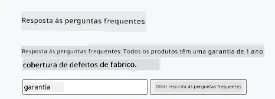
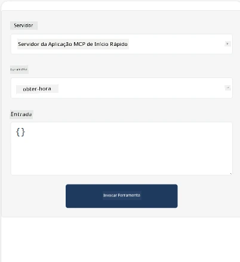
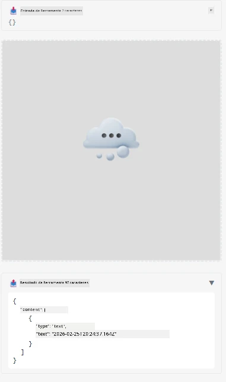

Aqui está um exemplo a demonstrar a App MCP

## Instalar

1. Navegue até à pasta *mcp-app*
1. Execute `npm install`, isto deve instalar as dependências do frontend e backend

Verifique se o backend compila executando:

```sh
npx tsc --noEmit
```

Não deverá haver qualquer saída se estiver tudo correto.

## Executar backend

> Isto requer um pouco mais de trabalho se estiver numa máquina Windows, pois a solução MCP Apps usa a biblioteca `concurrently` para correr, para a qual precisa encontrar um substituto. Aqui está a linha problemática no *package.json* da MCP App:

    ```json
    "start": "concurrently \"cross-env NODE_ENV=development INPUT=mcp-app.html vite build --watch\" \"tsx watch main.ts\""
    ```

Esta app tem duas partes, uma parte backend e uma parte host.

Inicie o backend chamando:

```sh
npm start
```

Isto deve arrancar o backend em `http://localhost:3001/mcp`. 

> Nota, se estiver num Codespace, poderá precisar definir a visibilidade da porta como pública. Verifique se consegue aceder ao endpoint no navegador através de https://<nome do Codespace>.app.github.dev/mcp

## Opção -1 Testar a app no Visual Studio Code

Para testar a solução no Visual Studio Code, faça o seguinte:

- Adicione uma entrada de servidor a `mcp.json` assim:

    ```json
    {
        "servers": {
            "my-mcp-server-7178eca7": {
                "url": "http://localhost:3001/mcp",
                "type": "http"
            }
        },
        "inputs": []
    }
    ```

1. Clique no botão "start" em *mcp.json*
1. Certifique-se que uma janela de chat está aberta e escreva `get-faq`, deverá ver um resultado assim:

    

## Opção -2- Testar a app com um host

O repositório <https://github.com/modelcontextprotocol/ext-apps> contém vários hosts diferentes que pode usar para testar as suas MVP Apps.

Apresentamos-lhe aqui duas opções diferentes:

### Máquina local

- Navegue até *ext-apps* depois de clonar o repositório.

- Instale as dependências

   ```sh
   npm install
   ```

- Numa janela de terminal separada, navegue até *ext-apps/examples/basic-host*

    > se estiver num Codespace, precisa de navegar até ao serve.ts na linha 27 e substituir http://localhost:3001/mcp pelo URL do Codespace para o backend, por exemplo https://psychic-xylophone-657rpjgvxpc5g64-3001.app.github.dev/mcp

- Execute o host:

    ```sh
    npm start
    ```

    Isto deve ligar o host ao backend e deverá ver a app a correr assim:

    

### Codespace

É necessário algum trabalho extra para fazer o ambiente Codespace funcionar. Para usar um host através do Codespace:

- Veja o diretório *ext-apps* e navegue até *examples/basic-host*.
- Execute `npm install` para instalar dependências
- Execute `npm start` para arrancar o host.

## Testar a app

Experimente a app da seguinte forma:

- Selecione o botão "Call Tool" e deverá ver os resultados assim:

    

Ótimo, está tudo a funcionar.

---

<!-- CO-OP TRANSLATOR DISCLAIMER START -->
**Aviso Legal**:
Este documento foi traduzido utilizando o serviço de tradução automática [Co-op Translator](https://github.com/Azure/co-op-translator). Embora nos esforcemos por garantir a precisão, esteja ciente de que traduções automatizadas podem conter erros ou imprecisões. O documento original na sua língua nativa deve ser considerado a fonte oficial. Para informações críticas, recomenda-se a tradução profissional humana. Não nos responsabilizamos por quaisquer mal-entendidos ou interpretações incorretas decorrentes da utilização desta tradução.
<!-- CO-OP TRANSLATOR DISCLAIMER END -->