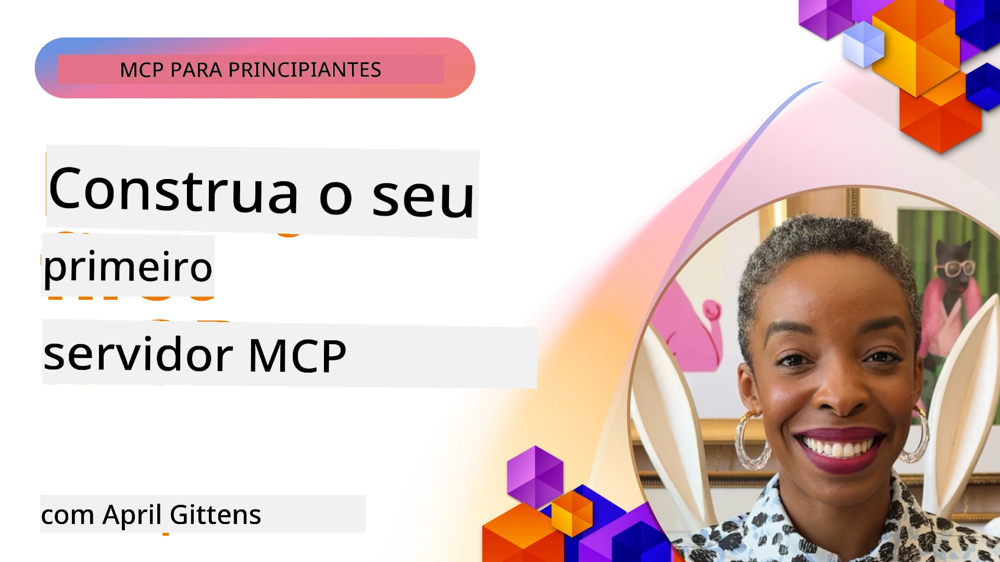

## Começando  

_(Clique na imagem acima para ver o vídeo desta lição)_

Esta secção consiste em várias lições:

- **1 O seu primeiro servidor**, nesta primeira lição, aprenderá como criar o seu primeiro servidor e inspecioná-lo com a ferramenta de inspeção, uma forma valiosa de testar e depurar o seu servidor, [para a lição](01-first-server/README.md)

- **2 Cliente**, nesta lição, aprenderá a escrever um cliente que pode conectar-se ao seu servidor, [para a lição](02-client/README.md)

- **3 Cliente com LLM**, uma forma ainda melhor de escrever um cliente é adicionando-lhe um LLM para que possa "negociar" com o seu servidor sobre o que fazer, [para a lição](03-llm-client/README.md)

- **4 Consumir um modo agente do servidor GitHub Copilot no Visual Studio Code**. Aqui, vamos ver como executar o nosso Servidor MCP a partir do Visual Studio Code, [para a lição](04-vscode/README.md)

- **5 Servidor de Transporte stdio** stdio transport é o padrão recomendado para comunicação local entre servidor e cliente MCP, fornecendo comunicação segura baseada em subprocessos com isolamento de processos integrado [para a lição](05-stdio-server/README.md)

- **6 Streaming HTTP com MCP (HTTP Transmissível)**. Aprenda sobre o moderno transporte de streaming HTTP (a abordagem recomendada para servidores MCP remotos conforme [Especificação MCP 2025-11-25](https://spec.modelcontextprotocol.io/specification/2025-11-25/basic/transports/#streamable-http)), notificações de progresso e como implementar servidores e clientes MCP escaláveis e em tempo real usando HTTP Transmissível. [para a lição](06-http-streaming/README.md)

- **7 Utilização do AI Toolkit para VSCode** para consumir e testar os seus Clientes e Servidores MCP [para a lição](07-aitk/README.md)

- **8 Testes**. Aqui focaremos especialmente como podemos testar o nosso servidor e cliente de várias formas, [para a lição](08-testing/README.md)

- **9 Desdobramento (Deployment)**. Este capítulo aborda diferentes formas de desdobrar as suas soluções MCP, [para a lição](09-deployment/README.md)

- **10 Uso avançado de servidor**. Este capítulo cobre o uso avançado do servidor, [para a lição](./10-advanced/README.md)

- **11 Autenticação (Auth)**. Este capítulo explica como adicionar autenticação simples, desde Basic Auth a usar JWT e RBAC. É recomendado começar aqui e depois consultar os Tópicos Avançados no Capítulo 5 e realizar reforços adicionais de segurança através das recomendações no Capítulo 2, [para a lição](./11-simple-auth/README.md)

- **12 Hosts MCP**. Configure e use clientes populares host MCP incluindo Claude Desktop, Cursor, Cline e Windsurf. Aprenda tipos de transporte e resolução de problemas, [para a lição](./12-mcp-hosts/README.md)

- **13 Inspetor MCP**. Depure e teste os seus servidores MCP de forma interativa usando a ferramenta Inspetor MCP. Aprenda a resolver problemas, recursos e mensagens do protocolo, [para a lição](./13-mcp-inspector/README.md)

- **14 Amostragem (Sampling)**. Crie Servidores MCP que colaboram com clientes MCP em tarefas relacionadas com LLM. [para a lição](./14-sampling/README.md)

- **15 Aplicações MCP (MCP Apps)**. Construa Servidores MCP que também respondem com instruções de UI, [para a lição](./15-mcp-apps/README.md)

O Protocolo de Contexto de Modelo (MCP) é um protocolo aberto que padroniza a forma como as aplicações fornecem contexto aos LLMs. Pense no MCP como uma porta USB-C para aplicações de IA – fornece uma forma padronizada de conectar modelos de IA a diferentes fontes de dados e ferramentas.

## Objetivos de Aprendizagem

No final desta lição, será capaz de:

- Configurar ambientes de desenvolvimento para MCP em C#, Java, Python, TypeScript e JavaScript
- Construir e implantar servidores MCP básicos com funcionalidades personalizadas (recursos, prompts e ferramentas)
- Criar aplicações host que conectem a servidores MCP
- Testar e depurar implementações MCP
- Compreender desafios comuns de configuração e as suas soluções
- Conectar as suas implementações MCP a serviços LLM populares

## Preparar o Seu Ambiente MCP

Antes de começar a trabalhar com MCP, é importante preparar o seu ambiente de desenvolvimento e entender o fluxo de trabalho básico. Esta secção irá guiá-lo nas etapas iniciais para garantir um início tranquilo com o MCP.

### Pré-requisitos

Antes de se lançar no desenvolvimento MCP, certifique-se de ter:

- **Ambiente de Desenvolvimento**: Para a sua linguagem escolhida (C#, Java, Python, TypeScript ou JavaScript)
- **IDE/Editores**: Visual Studio, Visual Studio Code, IntelliJ, Eclipse, PyCharm ou qualquer editor de código moderno
- **Gestores de Pacotes**: NuGet, Maven/Gradle, pip, ou npm/yarn
- **Chaves API**: Para quaisquer serviços de IA que planeie usar nas suas aplicações host

### SDKs Oficiais

Nos próximos capítulos verá soluções construídas usando Python, TypeScript, Java e .NET. Aqui estão todos os SDKs oficialmente suportados.

O MCP fornece SDKs oficiais para múltiplas linguagens (alinhados com a [Especificação MCP 2025-11-25](https://spec.modelcontextprotocol.io/specification/2025-11-25/)):
- [SDK C#](https://github.com/modelcontextprotocol/csharp-sdk) - Mantido em colaboração com a Microsoft
- [SDK Java](https://github.com/modelcontextprotocol/java-sdk) - Mantido em colaboração com Spring AI
- [SDK TypeScript](https://github.com/modelcontextprotocol/typescript-sdk) - A implementação oficial TypeScript
- [SDK Python](https://github.com/modelcontextprotocol/python-sdk) - A implementação oficial Python (FastMCP)
- [SDK Kotlin](https://github.com/modelcontextprotocol/kotlin-sdk) - A implementação oficial Kotlin
- [SDK Swift](https://github.com/modelcontextprotocol/swift-sdk) - Mantido em colaboração com Loopwork AI
- [SDK Rust](https://github.com/modelcontextprotocol/rust-sdk) - A implementação oficial Rust
- [SDK Go](https://github.com/modelcontextprotocol/go-sdk) - A implementação oficial Go

## Pontos-chave

- Configurar um ambiente de desenvolvimento MCP é simples com SDKs específicos para cada linguagem
- Construir servidores MCP envolve criar e registar ferramentas com esquemas claros
- Clientes MCP conectam-se a servidores e modelos para aproveitar capacidades estendidas
- Testar e depurar são essenciais para implementações MCP confiáveis
- As opções de desdobramento vão desde desenvolvimento local a soluções baseadas em cloud

## Prática

Temos um conjunto de exemplos que complementa os exercícios que verá em todos os capítulos desta secção. Adicionalmente, cada capítulo também possui os seus próprios exercícios e tarefas

- [Calculadora Java](./samples/java/calculator/README.md)
- [Calculadora .Net](../../../03-GettingStarted/samples/csharp)
- [Calculadora JavaScript](./samples/javascript/README.md)
- [Calculadora TypeScript](./samples/typescript/README.md)
- [Calculadora Python](../../../03-GettingStarted/samples/python)

## Recursos Adicionais

- [Construir Agentes usando Model Context Protocol na Azure](https://learn.microsoft.com/azure/developer/ai/intro-agents-mcp)
- [MCP Remoto com Azure Container Apps (Node.js/TypeScript/JavaScript)](https://learn.microsoft.com/samples/azure-samples/mcp-container-ts/mcp-container-ts/)
- [Agente MCP OpenAI .NET](https://learn.microsoft.com/samples/azure-samples/openai-mcp-agent-dotnet/openai-mcp-agent-dotnet/)

## O que vem a seguir

Comece com a primeira lição: [Criar o seu primeiro Servidor MCP](01-first-server/README.md)

Assim que completar este módulo, continue para: [Módulo 4: Implementação Prática](../04-PracticalImplementation/README.md)

---

<!-- CO-OP TRANSLATOR DISCLAIMER START -->
**Aviso Legal**:
Este documento foi traduzido utilizando o serviço de tradução automática [Co-op Translator](https://github.com/Azure/co-op-translator). Embora nos esforcemos para garantir a precisão, esteja ciente de que traduções automáticas podem conter erros ou imprecisões. O documento original na sua língua nativa deve ser considerado a fonte autorizada. Para informações críticas, recomenda-se a tradução profissional por um tradutor humano. Não nos responsabilizamos por quaisquer mal-entendidos ou interpretações erradas decorrentes do uso desta tradução.
<!-- CO-OP TRANSLATOR DISCLAIMER END -->