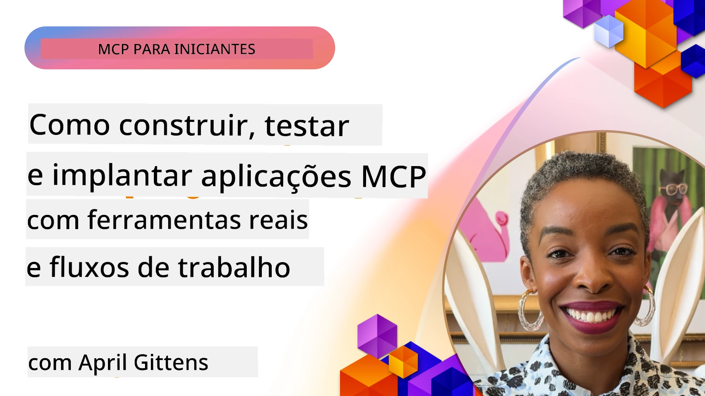
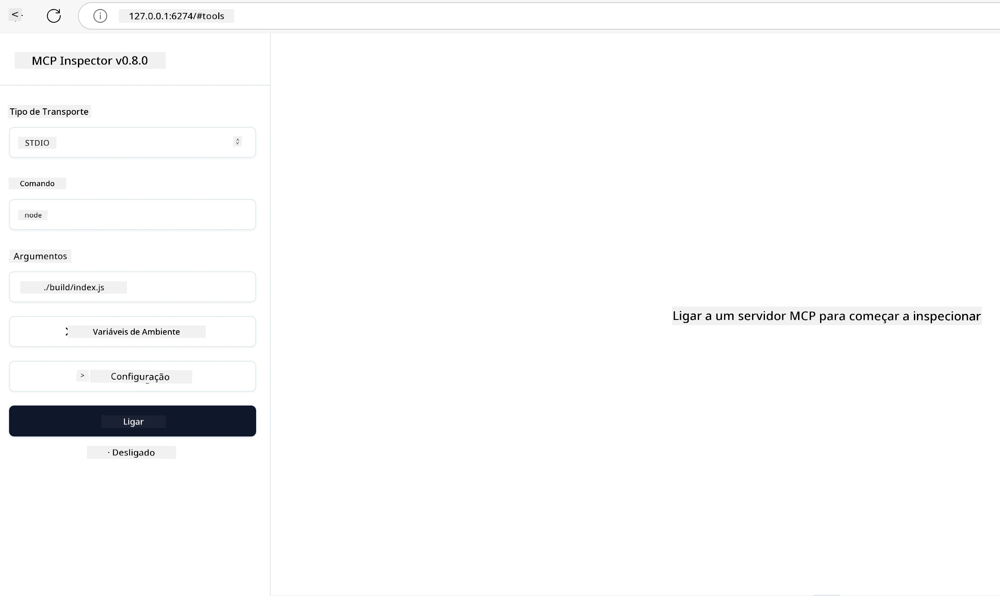

# Implementação Prática

[](https://youtu.be/vCN9-mKBDfQ)

_(Clique na imagem acima para ver o vídeo desta lição)_

A implementação prática é onde o poder do Model Context Protocol (MCP) se torna tangível. Embora compreender a teoria e a arquitetura por detrás do MCP seja importante, o verdadeiro valor surge quando aplica estes conceitos para construir, testar e implantar soluções que resolvem problemas do mundo real. Este capítulo faz a ponte entre o conhecimento conceptual e o desenvolvimento prático, guiando-o no processo de dar vida a aplicações baseadas em MCP.

Quer esteja a desenvolver assistentes inteligentes, a integrar IA em fluxos de trabalho empresariais, ou a construir ferramentas personalizadas para processamento de dados, o MCP oferece uma base flexível. O seu design independente da linguagem e os SDKs oficiais para linguagens de programação populares tornam-no acessível a uma ampla gama de programadores. Tirando partido destes SDKs, pode prototipar rapidamente, iterar e escalar as suas soluções através de diferentes plataformas e ambientes.

Nas secções seguintes, encontrará exemplos práticos, código de exemplo, e estratégias de implantação que demonstram como implementar MCP em C#, Java com Spring, TypeScript, JavaScript e Python. Aprenderá também a depurar e testar os seus servidores MCP, gerir APIs, e implantar soluções na cloud utilizando Azure. Estes recursos práticos foram concebidos para acelerar a sua aprendizagem e ajudá-lo a construir com confiança aplicações MCP robustas e prontas para produção.

## Visão Geral

Esta lição foca-se nos aspetos práticos da implementação MCP em múltiplas linguagens de programação. Exploraremos como usar os SDKs MCP em C#, Java com Spring, TypeScript, JavaScript e Python para construir aplicações robustas, depurar e testar servidores MCP, e criar recursos, prompts e ferramentas reutilizáveis.

## Objetivos de Aprendizagem

No final desta lição, será capaz de:

- Implementar soluções MCP utilizando SDKs oficiais em várias linguagens de programação
- Depurar e testar servidores MCP de forma sistemática
- Criar e usar funcionalidades do servidor (Recursos, Prompts e Ferramentas)
- Projetar fluxos de trabalho MCP eficazes para tarefas complexas
- Otimizar implementações MCP para desempenho e fiabilidade

## Recursos dos SDKs Oficiais

O Model Context Protocol oferece SDKs oficiais para várias linguagens (alinhados com a [Especificação MCP 2025-11-25](https://spec.modelcontextprotocol.io/specification/2025-11-25/)):

- [SDK C#](https://github.com/modelcontextprotocol/csharp-sdk)
- [SDK Java com Spring](https://github.com/modelcontextprotocol/java-sdk) **Nota:** requer dependência do [Project Reactor](https://projectreactor.io). (Veja [discussão issue 246](https://github.com/orgs/modelcontextprotocol/discussions/246).)
- [SDK TypeScript](https://github.com/modelcontextprotocol/typescript-sdk)
- [SDK Python](https://github.com/modelcontextprotocol/python-sdk)
- [SDK Kotlin](https://github.com/modelcontextprotocol/kotlin-sdk)
- [SDK Go](https://github.com/modelcontextprotocol/go-sdk)

## Trabalhar com os SDKs MCP

Esta secção fornece exemplos práticos de implementação MCP em várias linguagens de programação. Pode encontrar código de exemplo no diretório `samples` organizado por linguagem.

### Exemplos Disponíveis

O repositório inclui [implementações de exemplo](../../../04-PracticalImplementation/samples) nas seguintes linguagens:

- [C#](./samples/csharp/README.md)
- [Java com Spring](./samples/java/containerapp/README.md)
- [TypeScript](./samples/typescript/README.md)
- [JavaScript](./samples/javascript/README.md)
- [Python](./samples/python/README.md)

Cada exemplo demonstra conceitos chave do MCP e padrões de implementação para essa linguagem e ecossistema específicos.

### Guias Práticos

Guias adicionais para implementação prática MCP:

- [Paginação e Conjuntos de Resultados Grandes](./pagination/README.md) - Gerir paginação baseada em cursor para ferramentas, recursos e grandes conjuntos de dados

## Funcionalidades Principais do Servidor

Os servidores MCP podem implementar qualquer combinação destas funcionalidades:

### Recursos

Os recursos fornecem contexto e dados para o utilizador ou modelo de IA usar:

- Repositórios de documentos
- Bases de conhecimento
- Fontes de dados estruturados
- Sistemas de ficheiros

### Prompts

Prompts são mensagens e fluxos de trabalho modelados para os utilizadores:

- Templates de conversação pré-definidos
- Padrões de interação guiada
- Estruturas de diálogo especializadas

### Ferramentas

Ferramentas são funções que o modelo de IA pode executar:

- Utilitários de processamento de dados
- Integrações com APIs externas
- Capacidades computacionais
- Funcionalidade de pesquisa

## Implementações de Exemplo: Implementação em C#

O repositório oficial do SDK C# contém várias implementações de exemplo que demonstram diferentes aspetos do MCP:

- **Cliente MCP Básico**: Exemplo simples que mostra como criar um cliente MCP e chamar ferramentas
- **Servidor MCP Básico**: Implementação mínima de servidor com registo básico de ferramentas
- **Servidor MCP Avançado**: Servidor completo com registo de ferramentas, autenticação e tratamento de erros
- **Integração ASP.NET**: Exemplos que demonstram a integração com ASP.NET Core
- **Padrões de Implementação de Ferramentas**: Vários padrões para implementar ferramentas com diferentes níveis de complexidade

O SDK MCP C# está em pré-visualização e as APIs podem mudar. Vamos atualizar continuamente este blog à medida que o SDK evolui.

### Funcionalidades Principais

- [Nuget MCP C# ModelContextProtocol](https://www.nuget.org/packages/ModelContextProtocol)
- Construir o seu [primeiro Servidor MCP](https://devblogs.microsoft.com/dotnet/build-a-model-context-protocol-mcp-server-in-csharp/).

Para amostras completas de implementação em C#, visite o [repositório oficial de amostras do SDK C#](https://github.com/modelcontextprotocol/csharp-sdk)

## Implementação de exemplo: Implementação Java com Spring

O SDK Java com Spring oferece opções robustas para implementação MCP com funcionalidades ao nível empresarial.

### Funcionalidades Principais

- Integração com o Spring Framework
- Forte segurança de tipos
- Suporte a programação reativa
- Gestão completa de erros

Para uma amostra completa de implementação Java com Spring, veja [exemplo Java com Spring](samples/java/containerapp/README.md) no diretório de exemplos.

## Implementação de exemplo: Implementação JavaScript

O SDK JavaScript oferece uma abordagem leve e flexível para implementação MCP.

### Funcionalidades Principais

- Suporte para Node.js e browsers
- API baseada em Promises
- Integração fácil com Express e outros frameworks
- Suporte a WebSocket para streaming

Para uma amostra completa de implementação JavaScript, veja [exemplo JavaScript](samples/javascript/README.md) no diretório de exemplos.

## Implementação de exemplo: Implementação Python

O SDK Python oferece uma abordagem Pythonica à implementação MCP com integrações excelentes em frameworks ML.

### Funcionalidades Principais

- Suporte async/await com asyncio
- Integração FastAPI``
- Registo simples de ferramentas
- Integração nativa com bibliotecas populares de ML

Para uma amostra completa de implementação Python, veja [exemplo Python](samples/python/README.md) no diretório de exemplos.

## Gestão de API

O Azure API Management é uma excelente solução para proteger servidores MCP. A ideia é colocar uma instância do Azure API Management em frente ao seu servidor MCP e deixar que ela trate funcionalidades que provavelmente desejará, como:

- limitação de taxa
- gestão de tokens
- monitorização
- balanceamento de carga
- segurança

### Exemplo Azure

Aqui está um exemplo Azure a fazer exatamente isso, ou seja, [criar um Servidor MCP e protegê-lo com Azure API Management](https://github.com/Azure-Samples/remote-mcp-apim-functions-python).

Veja como ocorre o fluxo de autorização na imagem abaixo:


Na imagem precedente, acontece o seguinte:

- A autenticação/autorização ocorre usando Microsoft Entra.
- O Azure API Management atua como gateway e usa políticas para direcionar e gerir o tráfego.
- O Azure Monitor regista todas as requisições para análise futura.

#### Fluxo de Autorização

Vamos analisar o fluxo de autorização em mais detalhe:


#### Especificação de Autorização MCP

Saiba mais sobre a [especificação de Autorização MCP](https://spec.modelcontextprotocol.io/specification/2025-11-25/basic/authorization/)

## Implantar Servidor MCP Remoto no Azure

Vamos ver se conseguimos implantar o exemplo que mencionámos antes:

1. Clone o repositório

    ```bash
    git clone https://github.com/Azure-Samples/remote-mcp-apim-functions-python.git
    cd remote-mcp-apim-functions-python
    ```

1. Registe o fornecedor de recursos `Microsoft.App`.

   - Se estiver a usar Azure CLI, execute `az provider register --namespace Microsoft.App --wait`.
   - Se estiver a usar Azure PowerShell, execute `Register-AzResourceProvider -ProviderNamespace Microsoft.App`. Depois execute `(Get-AzResourceProvider -ProviderNamespace Microsoft.App).RegistrationState` após algum tempo para verificar se o registo está completo.

1. Execute este comando [azd](https://aka.ms/azd) para provisionar o serviço API Management, a função app (com código) e todos os outros recursos Azure necessários

    ```shell
    azd up
    ```

    Este comando deverá implantar todos os recursos na cloud no Azure

### Testar o seu servidor com MCP Inspector

1. Numa **nova janela do terminal**, instale e execute o MCP Inspector

    ```shell
    npx @modelcontextprotocol/inspector
    ```

    Deverá ver uma interface semelhante a:

    

1. CTRL clique para carregar a app web MCP Inspector a partir do URL apresentado pela aplicação (ex.: [http://127.0.0.1:6274/#resources](http://127.0.0.1:6274/#resources))
1. Defina o tipo de transporte para `SSE`
1. Defina o URL para o seu endpoint SSE do API Management em execução apresentado após o comando `azd up` e **Conectar**:

    ```shell
    https://<apim-servicename-from-azd-output>.azure-api.net/mcp/sse
    ```

1. **Listar Ferramentas**. Clique numa ferramenta e **Executar Ferramenta**.  

Se todos os passos tiverem funcionado, deve agora estar ligado ao servidor MCP e conseguir chamar uma ferramenta.

## Servidores MCP para Azure

[Remote-mcp-functions](https://github.com/Azure-Samples/remote-mcp-functions-dotnet): Este conjunto de repositórios são templates de início rápido para construir e implantar servidores MCP remotos personalizados usando Azure Functions com Python, C# .NET ou Node/TypeScript.

Os exemplos fornecem uma solução completa que permite aos programadores:

- Construir e executar localmente: desenvolver e depurar um servidor MCP numa máquina local
- Implantar no Azure: implantar facilmente na cloud com um simples comando azd up
- Ligar a partir de clientes: conectar ao servidor MCP a partir de vários clientes incluindo o modo agente Copilot do VS Code e a ferramenta MCP Inspector

### Funcionalidades Principais

- Segurança por design: o servidor MCP está protegido utilizando chaves e HTTPS
- Opções de autenticação: suporta OAuth usando autenticação embutida e/ou API Management
- Isolamento de rede: permite isolamento de rede usando Azure Virtual Networks (VNET)
- Arquitetura serverless: usa Azure Functions para execução escalável e orientada a eventos
- Desenvolvimento local: suporte abrangente para desenvolvimento e debugging local
- Implantação simples: processo simplificado de implantação no Azure

O repositório inclui todos os ficheiros de configuração necessários, código fonte e definições de infraestrutura para começar rapidamente com uma implementação de servidor MCP pronta para produção.

- [Azure Remote MCP Functions Python](https://github.com/Azure-Samples/remote-mcp-functions-python) - Implementação exemplo MCP usando Azure Functions com Python

- [Azure Remote MCP Functions .NET](https://github.com/Azure-Samples/remote-mcp-functions-dotnet) - Implementação exemplo MCP usando Azure Functions com C# .NET

- [Azure Remote MCP Functions Node/Typescript](https://github.com/Azure-Samples/remote-mcp-functions-typescript) - Implementação exemplo MCP usando Azure Functions com Node/TypeScript.

## Principais Conclusões

- Os SDKs MCP fornecem ferramentas específicas por linguagem para implementar soluções MCP robustas
- O processo de depuração e teste é crítico para aplicações MCP fiáveis
- Templates de prompt reutilizáveis permitem interações consistentes com IA
- Fluxos de trabalho bem desenhados podem orquestrar tarefas complexas usando múltiplas ferramentas
- Implementar soluções MCP requer consideração sobre segurança, desempenho e gestão de erros

## Exercício

Projete um fluxo de trabalho MCP prático que resolva um problema do mundo real no seu domínio:

1. Identifique 3-4 ferramentas que seriam úteis para resolver esse problema
2. Crie um diagrama de fluxo mostrando como estas ferramentas interagem
3. Implemente uma versão básica de uma das ferramentas usando a sua linguagem preferida
4. Crie um template de prompt que ajude o modelo a usar eficazmente a sua ferramenta

## Recursos Adicionais

---

## Próximo Passo

Seguir para: [Tópicos Avançados](../05-AdvancedTopics/README.md)

---

<!-- CO-OP TRANSLATOR DISCLAIMER START -->
**Aviso Legal**:
Este documento foi traduzido usando o serviço de tradução por IA [Co-op Translator](https://github.com/Azure/co-op-translator). Embora nos esforcemos por garantir a precisão, por favor tenha em conta que traduções automáticas podem conter erros ou imprecisões. O documento original na sua língua nativa deve ser considerado a fonte autoritativa. Para informações críticas, recomenda-se tradução profissional humana. Não nos responsabilizamos por quaisquer mal-entendidos ou interpretações erradas decorrentes do uso desta tradução.
<!-- CO-OP TRANSLATOR DISCLAIMER END -->