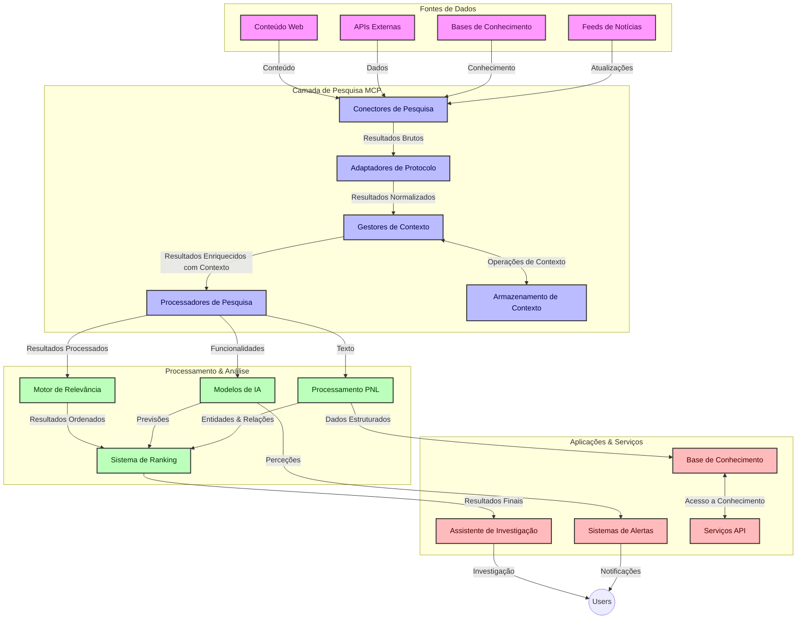
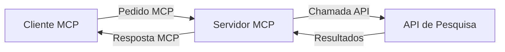
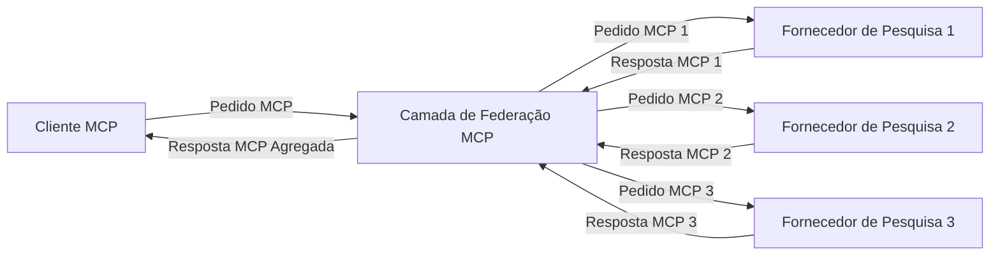
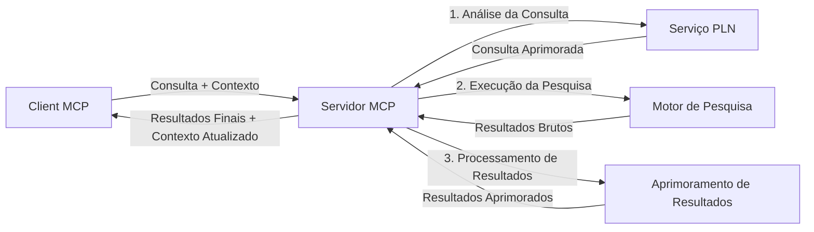

# Protocolo de Contexto de Modelo para Pesquisa Web em Tempo Real

## Visão Geral

A pesquisa web em tempo real tornou-se essencial no ambiente atual orientado à informação, onde as aplicações precisam de acesso imediato a informações atualizadas na internet para fornecer respostas relevantes e oportunas. O Protocolo de Contexto de Modelo (MCP) representa um avanço significativo na otimização destes processos de pesquisa em tempo real, melhorando a eficiência da pesquisa, mantendo a integridade contextual e aperfeiçoando o desempenho geral do sistema.

Este módulo explora como o MCP transforma a pesquisa web em tempo real, fornecendo uma abordagem padronizada para a gestão de contexto entre modelos de IA, motores de pesquisa e aplicações.

### O que Vai Aprender

Neste guia abrangente, vai descobrir:

- Como o MCP cria uma ponte contínua entre modelos de IA e capacidades de pesquisa web em tempo real
- Padrões arquitetónicos para implementar soluções de pesquisa eficientes e escaláveis com MCP
- Técnicas para preservar o contexto da pesquisa ao longo de múltiplas consultas e interações
- Implementações práticas de código em Python e JavaScript para vários cenários de pesquisa
- Métodos para equilibrar relevância, atualidade e desempenho em sistemas de pesquisa potenciados por MCP

## Introdução à Pesquisa Web em Tempo Real

A pesquisa web em tempo real é uma abordagem tecnológica que permite consultas contínuas, processamento e análise de informações baseadas na web à medida que são publicadas ou atualizadas, permitindo aos sistemas fornecer informações frescas e relevantes com latência mínima. Ao contrário dos sistemas tradicionais de pesquisa que operam sobre dados indexados que podem ter horas ou dias de antiguidade, a pesquisa em tempo real processa dados vivos da web, entregando informações e insights que refletem o estado atual do conteúdo online.

### Conceitos Fundamentais da Pesquisa Web em Tempo Real:

- **Processamento Contínuo de Consultas**: As consultas de pesquisa são processadas contra fontes de dados que se atualizam constantemente
- **Priorização da Atualidade**: Sistemas desenhados para priorizar informações recentes
- **Equilíbrio da Relevância**: Manter um equilíbrio entre relevância e atualidade
- **Arquitetura Escalável**: Sistemas devem lidar com cargas variáveis de consultas e volumes de dados
- **Compreensão Contextual**: Manter o contexto do utilizador ao longo das iterações de pesquisa é crucial para resultados significativos
- **Reformulação Dinâmica de Consultas**: Modificar as consultas de forma adaptativa com base no contexto e resultados anteriores
- **Integração Multifuente**: Combinar resultados de múltiplos provedores de pesquisa e fontes web
- **Compreensão Semântica**: Processar consultas e conteúdos com base no significado, e não apenas nas palavras-chave
- **Classificação em Tempo Real**: Ajustar continuamente as classificações dos resultados conforme novas informações ficam disponíveis

### O Protocolo de Contexto de Modelo e a Pesquisa Web em Tempo Real

O Protocolo de Contexto de Modelo (MCP) aborda vários desafios críticos em ambientes de pesquisa web em tempo real:

1. **Preservação do Contexto de Pesquisa**: O MCP padroniza como o contexto é mantido através de componentes de pesquisa distribuídos, garantindo que modelos de IA e nós de processamento tenham acesso ao histórico relevante da consulta e preferências dos utilizadores.

2. **Gestão Eficiente de Consultas**: Ao fornecer mecanismos estruturados para a transmissão de contexto, o MCP reduz a sobrecarga de repetir o contexto em cada iteração de pesquisa.

3. **Interoperabilidade**: O MCP cria uma linguagem comum para partilha de contexto entre diversas tecnologias de pesquisa e modelos de IA, permitindo arquiteturas mais flexíveis e extensíveis.

4. **Contexto Otimizado para Pesquisa**: Implementações do MCP podem priorizar quais elementos do contexto são mais relevantes para uma pesquisa eficaz, otimizando tanto o desempenho quanto a precisão.

5. **Processamento Adaptativo de Pesquisa**: Com a gestão adequada de contexto através do MCP, os sistemas de pesquisa podem ajustar dinamicamente o processamento com base nas necessidades em evolução dos utilizadores e nos panoramas informativos.

Em aplicações modernas que vão desde agregação de notícias a assistentes de pesquisa, a integração do MCP com tecnologias de pesquisa web permite uma pesquisa mais inteligente, consciente do contexto, capaz de fornecer resultados cada vez mais relevantes à medida que as interações do utilizador prosseguem.

## Objetivos de Aprendizagem

No final desta lição, será capaz de:

- Compreender os fundamentos da pesquisa web em tempo real e os seus desafios em aplicações modernas
- Explicar como o Protocolo de Contexto de Modelo (MCP) melhora as capacidades de pesquisa web em tempo real
- Implementar soluções de pesquisa baseadas em MCP utilizando frameworks e APIs populares
- Projetar e implementar arquiteturas de pesquisa escaláveis e de alto desempenho com MCP
- Aplicar conceitos do MCP em vários casos de uso incluindo pesquisa semântica, assistência em investigação e navegação aumentada por IA
- Avaliar tendências emergentes e futuras inovações em tecnologias de pesquisa baseadas em MCP
- Desenvolver sistemas de pesquisa conscientes do contexto que aprendam com as interações do utilizador
- Integrar capacidades de pesquisa web em assistentes de IA usando protocolos MCP padronizados
- Criar pipelines de pesquisa em múltiplas etapas que refinem progressivamente os resultados com base no contexto
- Otimizar o desempenho da pesquisa mantendo ampla consciência contextual

### Definição e Significado

A pesquisa web em tempo real envolve a consulta, recuperação e entrega contínua de informações baseadas na web com latência mínima. Ao contrário dos motores de pesquisa tradicionais que rastreiam e indexam a web periodicamente, a pesquisa em tempo real pretende mostrar a informação assim que esta fica disponível, permitindo acesso imediato ao conteúdo mais atual.

As características principais da pesquisa web em tempo real incluem:

- **Atualidade**: Priorização de conteúdo e atualizações recentes
- **Processamento Contínuo**: Monitorização constante para novas informações
- **Adaptação de Consultas**: Refinamento das consultas de pesquisa com base no contexto e feedback
- **Entrega Imediata**: Fornecimento de resultados de pesquisa com atraso mínimo
- **Retenção de Contexto**: Construção baseada em consultas anteriores para melhorar a relevância

### Desafios na Pesquisa Web Tradicional

As abordagens tradicionais de pesquisa web enfrentam várias limitações quando aplicadas a cenários em tempo real:

1. **Fragmentação do Contexto**: Dificuldade em manter o contexto da pesquisa ao longo de múltiplas consultas
2. **Atualidade da Informação**: Desafios no acesso e priorização da informação mais recente
3. **Complexidade de Integração**: Problemas de interoperabilidade entre sistemas de pesquisa e aplicações
4. **Problemas de Latência**: Equilíbrio entre pesquisa abrangente e requisitos de tempo de resposta
5. **Ajuste de Relevância**: Garantir precisão e relevância enquanto se prioriza a atualidade

## Compreendendo o Protocolo de Contexto de Modelo (MCP) para Pesquisa

### O que é o MCP em Contextos de Pesquisa?

O Protocolo de Contexto de Modelo (MCP) é um protocolo de comunicação padronizado concebido para facilitar a interação eficiente entre modelos de IA e aplicações. No contexto da pesquisa web em tempo real, o MCP oferece uma estrutura para:

- Preservar o contexto da pesquisa ao longo das sequências de consultas
- Padronizar os formatos de consulta e resultados de pesquisa
- Otimizar a transmissão de parâmetros e resultados de pesquisa
- Melhorar a comunicação entre modelos e motores de pesquisa

### Componentes e Arquitetura Principais

A arquitetura MCP para pesquisa web em tempo real é composta por vários componentes chave:

1. **Controladores de Contexto de Consulta**: Gerem e mantêm o contexto da pesquisa ao longo de múltiplas consultas
2. **Processadores de Pesquisa**: Processam pedidos de pesquisa recebidos usando técnicas conscientes do contexto
3. **Adaptadores de Protocolo**: Convertem entre diferentes APIs de pesquisa mantendo o contexto
4. **Armazenamento de Contexto**: Guarda e recupera eficazmente histórico de pesquisa e preferências
5. **Conectores de Pesquisa**: Ligam a vários motores de pesquisa e APIs web



### Como o MCP Melhora a Pesquisa Web em Tempo Real

O MCP aborda desafios tradicionais da pesquisa web através de:

- **Continuidade Contextual**: Mantém as relações entre consultas ao longo de toda a sessão de pesquisa
- **Transmissão Otimizada**: Reduz a redundância nos parâmetros de pesquisa através de gestão inteligente do contexto
- **Interfaces Padronizadas**: Fornece APIs consistentes para componentes de pesquisa
- **Latência Reduzida**: Minimiza sobrecarga de processamento através de manipulação eficiente do contexto
- **Relevância Aprimorada**: Melhora a relevância da pesquisa preservando a intenção do utilizador ao longo de múltiplas consultas

## Integração e Implementação

Sistemas de pesquisa web em tempo real requerem um desenho arquitetónico cuidadoso e implementação para manter tanto o desempenho quanto a integridade contextual. O Protocolo de Contexto de Modelo oferece uma abordagem padronizada para integrar modelos de IA e tecnologias de pesquisa, permitindo pipelines de pesquisa mais sofisticados e conscientes do contexto.

### Visão Geral da Integração MCP em Arquiteturas de Pesquisa

Implementar o MCP em ambientes de pesquisa web em tempo real envolve várias considerações importantes:

1. **Serialização do Contexto de Pesquisa**: O MCP oferece mecanismos eficientes para codificar informação contextual dentro dos pedidos de pesquisa, garantindo que o contexto essencial acompanha a consulta ao longo do pipeline de processamento. Isto inclui formatos padronizados de serialização otimizados para metadados relacionados à pesquisa.

2. **Processamento de Pesquisa com Estado**: O MCP permite um processamento com estado mais inteligente ao manter representações consistentes de contexto ao longo das iterações de pesquisa. Isto é particularmente valioso em pipelines de pesquisa em múltiplas etapas, onde o refinamento do contexto melhora os resultados.

3. **Expansão e Refinamento de Consultas**: Implementações do MCP em sistemas de pesquisa podem facilitar a expansão e o refinamento sofisticado de consultas com base no contexto acumulado, permitindo resultados progressivamente mais relevantes à medida que a sessão de pesquisa avança.

4. **Cache e Priorização de Resultados**: Ao padronizar a gestão do contexto, o MCP ajuda a gerir cache e priorização de resultados, permitindo que os componentes se adaptem com base no contexto de pesquisa em evolução.

5. **Federação e Agregação de Pesquisa**: O MCP facilita uma federação mais sofisticada da pesquisa através de múltiplos backends, fornecendo representações estruturadas do contexto de pesquisa, permitindo uma agregação mais significativa de resultados de fontes diversas.

A implementação do MCP em várias tecnologias de pesquisa cria uma abordagem unificada para a gestão de contexto, reduzindo a necessidade de código de integração personalizado enquanto melhora a capacidade do sistema em manter um contexto significativo conforme as consultas de pesquisa evoluem.

### MCP em Diversas Implementações de Pesquisa Web

Estes exemplos seguem a especificação atual do MCP que foca num protocolo baseado em JSON-RPC com mecanismos de transporte distintos. O código demonstra como pode implementar integrações personalizadas de pesquisa mantendo total compatibilidade com o protocolo MCP.


<details>
<summary>Implementação em Python com API Genérica de Pesquisa</summary>

```python
import asyncio
import json
import aiohttp
from typing import Dict, Any, Optional, List
from contextlib import asynccontextmanager
from collections.abc import AsyncIterator

# Importar bibliotecas MCP padrão
from mcp.client.session import ClientSession
from mcp.client.streamable_http import streamablehttp_client
from mcp.types import TextContent, CreateMessageRequestParams, CreateMessageResult
from mcp.server.fastmcp import FastMCP

# Criar um servidor FastMCP para pesquisa na web
search_server = FastMCP("WebSearch")

# Classe para gerir operações de pesquisa na web
class WebSearchHandler:
    def __init__(self, api_endpoint: str, api_key: str):
        self.api_endpoint = api_endpoint
        self.api_key = api_key
        self.session = None
        
    async def initialize(self):
        """Initialize the HTTP session"""
        self.session = aiohttp.ClientSession(
            headers={"Authorization": f"Bearer {self.api_key}"}
        )
    
    async def close(self):
        """Close the HTTP session"""
        if self.session:
            await self.session.close()
            
    async def perform_search(self, query: str, max_results: int = 5, 
                           include_domains: List[str] = None, 
                           exclude_domains: List[str] = None,
                           time_period: str = "any") -> Dict[str, Any]:
        """Perform web search using the search API"""
        # Construir parâmetros de pesquisa
        search_params = {
            "q": query,
            "limit": max_results,
            "time": time_period
        }
        
        if include_domains:
            search_params["site"] = ",".join(include_domains)
            
        if exclude_domains:
            search_params["exclude_site"] = ",".join(exclude_domains)
        
        # Executar o pedido de pesquisa
        try:
            async with self.session.get(
                self.api_endpoint,
                params=search_params
            ) as response:
                if response.status != 200:
                    error_text = await response.text()
                    raise Exception(f"Search API error: {response.status} - {error_text}")
                
                search_data = await response.json()
                
                # Transformar a resposta específica da API para um formato padrão
                results = []
                for item in search_data.get("results", []):
                    results.append({
                        "title": item.get("title", ""),
                        "url": item.get("url", ""),
                        "snippet": item.get("snippet", ""),
                        "date": item.get("published_date", ""),
                        "source": item.get("source", "")
                    })
                
                return {
                    "query": query,
                    "totalResults": len(results),
                    "results": results
                }
        except Exception as e:
            print(f"Search API request error: {e}")
            raise

# Inicializar o gestor de pesquisa
search_handler = WebSearchHandler(
    api_endpoint="https://api.search-service.example/search",
    api_key="your-api-key-here"
)

# Configurar lifespan para gerir o gestor de pesquisa
@asyncio.asynccontextmanager
async def app_lifespan(server: FastMCP):
    """Manage application lifecycle"""
    await search_handler.initialize()
    try:
        yield {"search_handler": search_handler}
    finally:
        await search_handler.close()

# Definir lifespan para o servidor
search_server = FastMCP("WebSearch", lifespan=app_lifespan)

# Registar uma ferramenta de pesquisa na web
@search_server.tool()
async def web_search(query: str, max_results: int = 5, 
                   include_domains: List[str] = None,
                   exclude_domains: List[str] = None,
                   time_period: str = "any") -> Dict[str, Any]:
    """
    Search the web for information
    
    Args:
        query: The search query
        max_results: Maximum number of results to return (default: 5)
        include_domains: List of domains to include in search results
        exclude_domains: List of domains to exclude from search results
        time_period: Time period for results ("day", "week", "month", "any")
        
    Returns:
        Dictionary containing search results
    """
    ctx = search_server.get_context()
    search_handler = ctx.request_context.lifespan_context["search_handler"]
    
    results = await search_handler.perform_search(
        query=query,
        max_results=max_results,
        include_domains=include_domains,
        exclude_domains=exclude_domains,
        time_period=time_period
    )
    
    return results

# Exemplo de uso do cliente
async def client_example():
    # Ligar ao servidor de pesquisa usando transporte HTTP Streamable
    async with streamablehttp_client("http://localhost:8000/mcp") as (read, write, _):
        async with ClientSession(read, write) as session:
            # Inicializar a conexão
            await session.initialize()
            
            # Chamar a ferramenta web_search
            search_results = await session.call_tool(
                "web_search", 
                {
                    "query": "latest developments in AI and Model Context Protocol",
                    "max_results": 5,
                    "time_period": "day",
                    "include_domains": ["github.com", "microsoft.com"]
                }
            )
            
            print(f"Search results: {search_results}")

# Exemplo de execução do servidor
if __name__ == "__main__":
    # Executar o servidor com transporte HTTP Streamable
    search_server.run(transport="streamable-http")
```
</details> 

<details>
<summary>Implementação em JavaScript com Pesquisa Baseada em Browser</summary>


```javascript
// Implementação do servidor MCP para pesquisa na web
import { McpServer, ResourceTemplate } from '@modelcontextprotocol/sdk/server/mcp.js';
import { StreamableHTTPServerTransport } from '@modelcontextprotocol/sdk/server/streamableHttp.js';
import { z } from 'zod';

// Criar um servidor MCP para pesquisa na web
const searchServer = new McpServer({
    name: "BrowserSearch",
    description: "A server that provides web search capabilities"
});

// Classe de serviço de pesquisa
class SearchService {
    constructor(searchApiUrl, apiKey) {
        this.searchApiUrl = searchApiUrl;
        this.apiKey = apiKey;
    }

    async performSearch(parameters) {
        const {
            query = '',
            maxResults = 5,
            includeDomains = [],
            excludeDomains = [],
            timePeriod = 'any'
        } = parameters;
        
        // Construir URL de pesquisa com parâmetros
        const url = new URL(this.searchApiUrl);
        url.searchParams.append('q', query);
        url.searchParams.append('limit', maxResults);
        url.searchParams.append('time', timePeriod);
        
        if (includeDomains.length > 0) {
            url.searchParams.append('site', includeDomains.join(','));
        }
        
        if (excludeDomains.length > 0) {
            url.searchParams.append('exclude_site', excludeDomains.join(','));
        }
        
        try {
            const response = await fetch(url.toString(), {
                method: 'GET',
                headers: {
                    'Authorization': `Bearer ${this.apiKey}`,
                    'Content-Type': 'application/json'
                }
            });
            
            if (!response.ok) {
                const errorText = await response.text();
                throw new Error(`Search API error: ${response.status} - ${errorText}`);
            }
            
            const searchData = await response.json();
            
            // Transformar resposta específica da API para um formato padrão
            const results = searchData.results?.map(item => ({
                title: item.title || '',
                url: item.url || '',
                snippet: item.snippet || '',
                date: item.published_date || '',
                source: item.source || ''
            })) || [];
            
            return {
                query,
                totalResults: results.length,
                results
            };
        } catch (error) {
            console.error('Search API request error:', error);
            throw error;
        }
    }
}

// Inicializar o serviço de pesquisa
const searchService = new SearchService(
    'https://api.search-service.example/search',
    'your-api-key-here'
);

// Configurar o fornecedor de contexto para o servidor
searchServer.setContextProvider(() => {
    return {
        searchService
    };
});

// Registar ferramenta de pesquisa na web
searchServer.tool({
    name: 'web_search',
    description: 'Search the web for information',
    parameters: {
        type: 'object',
        properties: {
            query: {
                type: 'string',
                description: 'The search query'
            },
            maxResults: {
                type: 'integer',
                description: 'Maximum number of results to return',
                default: 5
            },
            includeDomains: {
                type: 'array',
                items: { type: 'string' },
                description: 'List of domains to include in search results'
            },
            excludeDomains: {
                type: 'array',
                items: { type: 'string' },
                description: 'List of domains to exclude from search results'
            },
            timePeriod: {
                type: 'string',
                description: 'Time period for results',
                enum: ['day', 'week', 'month', 'any'],
                default: 'any'
            }
        },
        required: ['query']
    },
    handler: async (params, context) => {
        const { searchService } = context;
        return await searchService.performSearch(params);
    }
});

// Código de exemplo do cliente para ligar ao servidor de pesquisa
import { Client } from '@modelcontextprotocol/sdk/client/index.js';
import { StreamableHTTPClientTransport } from '@modelcontextprotocol/sdk/client/streamableHttp.js';

async function connectToSearchServer() {
    // Ligar ao servidor de pesquisa
    const transport = new StreamableHTTPClientTransport(
        new URL('http://localhost:8000/mcp')
    );
    
    const client = new Client({
        name: 'search-client',
        version: '1.0.0'
    });
    
    await client.connect(transport);
    
    // Executar a ferramenta de pesquisa
    const searchResults = await client.callTool({
        name: 'web_search',
        arguments: {
            query: 'Model Context Protocol implementation examples',
            maxResults: 10,
            timePeriod: 'week',
            includeDomains: ['github.com', 'docs.microsoft.com']
        }
    });
    
    console.log('Search results:', searchResults);
    
    // Limpeza
    await client.disconnect();
}

// Iniciar o servidor
const transport = new StreamableHTTPServerTransport();
await searchServer.connect(transport);
console.log('Search server running at http://localhost:8000/mcp');

// Num processo separado ou depois de o servidor estar iniciado
// connectToSearchServer().catch(console.error);
```
</details> 


## Aviso Sobre Exemplos de Código

> **Nota Importante**: Os exemplos de código abaixo demonstram a integração do Protocolo de Contexto de Modelo (MCP) com funcionalidade de pesquisa web. Embora sigam os padrões e estruturas dos SDKs MCP oficiais, foram simplificados para fins educacionais.
> 
> Estes exemplos apresentam:
> 
> 1. **Implementação em Python**: Uma implementação do servidor FastMCP que fornece uma ferramenta de pesquisa web e liga-se a uma API de pesquisa externa. Este exemplo demonstra a gestão adequada do ciclo de vida, manipulação de contexto e implementação da ferramenta seguindo os padrões do [SDK MCP Python oficial](https://github.com/modelcontextprotocol/python-sdk). O servidor utiliza o transporte HTTP Streamable recomendado, que substituiu o transporte SSE antigo para implementações em produção.
> 
> 2. **Implementação em JavaScript**: Uma implementação em TypeScript/JavaScript usando o padrão FastMCP do [SDK MCP TypeScript oficial](https://github.com/modelcontextprotocol/typescript-sdk) para criar um servidor de pesquisa com definições apropriadas de ferramentas e ligações cliente. Segue os padrões mais recentes recomendados para gestão de sessões e preservação de contexto.
> 
> Estes exemplos requereriam tratamento extra de erros, autenticação e código específico de integração de API para uso em produção. Os endpoints da API de pesquisa mostrados (`https://api.search-service.example/search`) são espaços reservados e teriam de ser substituídos por endpoints reais de serviços de pesquisa.
> 
> Para detalhes completos de implementação e abordagens mais atualizadas,
> consulte a [especificação oficial do MCP](https://modelcontextprotocol.io/specification/2026-07-28/)
> e documentação do SDK.

## Conceitos Fundamentais

### A Estrutura do Protocolo de Contexto de Modelo (MCP)

Na sua base, o Protocolo de Contexto de Modelo proporciona uma forma padronizada para modelos de IA, aplicações e serviços trocarem contexto. Na pesquisa web em tempo real, esta estrutura é essencial para criar experiências de pesquisa coerentes e multi-turno. Componentes chave incluem:

1. **Arquitetura Cliente-Servidor**: O MCP estabelece uma separação clara entre clientes de pesquisa (solicitantes) e servidores de pesquisa (fornecedores), permitindo modelos de implementação flexíveis.

2. **Comunicação JSON-RPC**: O protocolo usa JSON-RPC para troca de mensagens, tornando-o compatível com tecnologias web e fácil de implementar em diversas plataformas.

3. **Gestão de Contexto**: O MCP define métodos estruturados para manter, atualizar e aproveitar o contexto da pesquisa ao longo de múltiplas interações.

4. **Definições de Ferramentas**: Capacidades de pesquisa expostas como ferramentas padronizadas com parâmetros e valores de retorno bem definidos.

5. **Suporte a Streaming**: O protocolo suporta transmissão de resultados em streaming, essencial para pesquisa em tempo real onde os resultados podem chegar progressivamente.

### Padrões de Integração de Pesquisa Web

Ao integrar o MCP com a pesquisa web, surgem vários padrões:

#### 1. Integração Direta com Provedor de Pesquisa



Neste padrão, o servidor MCP interage diretamente com uma ou mais APIs de pesquisa, traduzindo pedidos MCP em chamadas específicas da API e formatando os resultados como respostas MCP.

#### 2. Pesquisa Federada com Preservação de Contexto



Este padrão distribui consultas de pesquisa através de múltiplos provedores de pesquisa compatíveis com MCP, cada um potencialmente especializado em diferentes tipos de conteúdo ou capacidades de pesquisa, mantendo um contexto unificado.

#### 3. Cadeia de Pesquisa com Contexto Reforçado



Neste padrão, o processo de pesquisa é dividido em múltiplas etapas, com o contexto sendo enriquecido a cada passo, resultando em resultados progressivamente mais relevantes.

### Componentes do Contexto de Pesquisa

Na pesquisa web baseada em MCP, o contexto normalmente inclui:

- **Histórico de Consultas**: Consultas de pesquisa anteriores na sessão
- **Preferências do Utilizador**: Língua, região, configurações de pesquisa segura
- **Histórico de Interação**: Quais resultados foram clicados, tempo passado nos resultados
- **Parâmetros de Pesquisa**: Filtros, ordens de classificação e outros modificadores de pesquisa
- **Conhecimento de Domínio**: Contexto específico do assunto relevante para a pesquisa
- **Contexto Temporal**: Fatores de relevância baseados no tempo
- **Preferências de Fonte**: Fontes de informação confiáveis ou preferidas

## Casos de Uso e Aplicações

### Investigação e Recolha de Informação

O MCP melhora fluxos de trabalho de investigação ao:

- Preservar o contexto de investigação ao longo de sessões de pesquisa
- Permitir consultas mais sofisticadas e contextualmente relevantes
- Apoiar federação de pesquisa multifuente
- Facilitar a extração de conhecimento a partir dos resultados de pesquisa

### Monitorização de Notícias e Tendências em Tempo Real

A pesquisa potenciadda pelo MCP oferece vantagens para monitorização de notícias:

- Descoberta quase em tempo real de notícias emergentes
- Filtragem contextual de informação relevante
- Acompanhamento de tópicos e entidades através de múltiplas fontes
- Alertas de notícias personalizados baseados no contexto do utilizador

### Navegação e Investigação Aumentadas por IA

O MCP cria novas possibilidades para navegação aumentada por IA:

- Sugestões de pesquisa contextuais baseadas na atividade atual do navegador
- Integração contínua da pesquisa web com assistentes potenciados por LLM
- Refinamento de pesquisa multi-turno com contexto mantido
- Verificação melhorada de factos e validação de informação

## Tendências e Inovações Futuras

### Evolução do MCP na Pesquisa Web

Olhando para o futuro, prevemos que o MCP evolua para abordar:


- **Pesquisa Multimodal**: Integração de pesquisa de texto, imagem, áudio e vídeo com preservação do contexto
- **Pesquisa Descentralizada**: Suporte a ecossistemas de pesquisa distribuída e federada
- **Privacidade da Pesquisa**: Mecanismos de pesquisa preservadores de privacidade conscientes do contexto
- **Compreensão de Consultas**: Análise semântica profunda de consultas de pesquisa em linguagem natural

### Potenciais Avanços na Tecnologia

Tecnologias emergentes que irão moldar o futuro da pesquisa MCP:

1. **Arquiteturas de Pesquisa Neural**: Sistemas de pesquisa baseados em embeddings otimizados para MCP
2. **Contexto de Pesquisa Personalizado**: Aprendizagem dos padrões de pesquisa individual dos utilizadores ao longo do tempo
3. **Integração de Grafos de Conhecimento**: Pesquisa contextual melhorada por grafos de conhecimento específicos de domínio
4. **Contexto Cross-Modal**: Manutenção do contexto através de diferentes modalidades de pesquisa

## Exercícios Práticos

### Exercício 1: Configuração de um Pipeline Básico de Pesquisa MCP

Neste exercício, irá aprender a:
- Configurar um ambiente básico de pesquisa MCP
- Implementar manipuladores de contexto para pesquisa web
- Testar e validar a preservação do contexto através de iterações de pesquisa

### Exercício 2: Construir um Assistente de Pesquisa com Pesquisa MCP

Crie uma aplicação completa que:
- Processa perguntas de pesquisa em linguagem natural
- Executa pesquisas web conscientes do contexto
- Sintetiza informações de múltiplas fontes
- Apresenta resultados de pesquisa organizados

### Exercício 3: Implementação de Federação de Pesquisa Multi-Fonte com MCP

Exercício avançado que cobre:
- Despacho de consultas conscientes do contexto para múltiplos motores de pesquisa
- Ranking e agregação de resultados
- Deduplicação contextual de resultados de pesquisa
- Gestão de metadados específicos da fonte

## Recursos Adicionais

- [Model Context Protocol Specification](https://modelcontextprotocol.io/specification/2026-07-28/) - Especificação oficial MCP e documentação detalhada do protocolo
- [Model Context Protocol Documentation](https://modelcontextprotocol.io/) - Tutoriais detalhados e guias de implementação
- [MCP Python SDK](https://github.com/modelcontextprotocol/python-sdk) - Implementação oficial em Python do protocolo MCP
- [MCP TypeScript SDK](https://github.com/modelcontextprotocol/typescript-sdk) - Implementação oficial em TypeScript do protocolo MCP
- [MCP Reference Servers](https://github.com/modelcontextprotocol/servers) - Implementações de referência de servidores MCP
- [Bing Web Search API Documentation](https://learn.microsoft.com/en-us/bing/search-apis/bing-web-search/overview) - API de pesquisa web da Microsoft
- [Google Custom Search JSON API](https://developers.google.com/custom-search/v1/overview) - Motor de pesquisa programável da Google
- [SerpAPI Documentation](https://serpapi.com/search-api) - API de página de resultados de motores de pesquisa
- [Meilisearch Documentation](https://www.meilisearch.com/docs) - Motor de pesquisa open-source
- [Elasticsearch Documentation](https://www.elastic.co/guide/index.html) - Motor de pesquisa e análise distribuído
- [LangChain Documentation](https://python.langchain.com/docs/get_started/introduction) - Construção de aplicações com LLMs

## Resultados de Aprendizagem

Ao completar este módulo, será capaz de:

- Compreender os fundamentos da pesquisa web em tempo real e os seus desafios
- Explicar como o Model Context Protocol (MCP) melhora as capacidades de pesquisa web em tempo real
- Implementar soluções de pesquisa baseadas em MCP usando frameworks e APIs populares
- Projetar e implantar arquiteturas de pesquisa escaláveis e de alta performance com MCP
- Aplicar conceitos MCP a vários casos de uso, incluindo pesquisa semântica, assistência de pesquisa, e navegação aumentada por IA
- Avaliar tendências emergentes e inovações futuras em tecnologias de pesquisa baseadas em MCP


### Considerações de Confiança e Segurança

Ao implementar soluções de pesquisa web baseadas em MCP, lembre-se destes princípios importantes da especificação MCP:

1. **Consentimento e Controlo do Utilizador**: Os utilizadores devem consentir explicitamente e compreender todos os acessos e operações de dados. Isto é especialmente importante para implementações de pesquisa web que possam aceder a fontes externas de dados.

2. **Privacidade dos Dados**: Assegurar a gestão adequada de consultas e resultados de pesquisa, especialmente quando possam conter informação sensível. Implementar controlos de acesso adequados para proteger os dados do utilizador.

3. **Segurança das Ferramentas**: Implementar autorização e validação apropriadas para ferramentas de pesquisa, pois representam riscos de segurança potenciais por meio da execução arbitrária de código. As descrições do comportamento das ferramentas devem ser consideradas não confiáveis, a menos que obtidas de um servidor confiável.

4. **Documentação Clara**: Fornecer documentação clara acerca das capacidades, limitações e considerações de segurança da sua implementação de pesquisa baseada em MCP, seguindo as diretrizes de implementação da especificação MCP.

5. **Fluxos de Consentimento Robustos**: Construir fluxos robustos de consentimento e autorização que expliquem claramente o que cada ferramenta faz antes de autorizar o seu uso, especialmente para ferramentas que interagem com recursos web externos.

Para detalhes completos sobre segurança e considerações de confiança no MCP, consulte a
[documentação oficial](https://modelcontextprotocol.io/specification/2026-07-28/basic/security_best_practices).

## E o que vem a seguir

- [5.12 Autenticação Entra ID para Servidores Model Context Protocol](../mcp-security-entra/README.md)

---

<!-- CO-OP TRANSLATOR DISCLAIMER START -->
**Aviso Legal**:
Este documento foi traduzido utilizando o serviço de tradução automática [Co-op Translator](https://github.com/Azure/co-op-translator). Embora nos esforcemos pela precisão, esteja ciente de que traduções automáticas podem conter erros ou imprecisões. O documento original na sua língua nativa deve ser considerado a fonte autorizada. Para informações críticas, recomenda-se tradução profissional humana. Não nos responsabilizamos por quaisquer mal-entendidos ou interpretações incorretas resultantes da utilização desta tradução.
<!-- CO-OP TRANSLATOR DISCLAIMER END -->