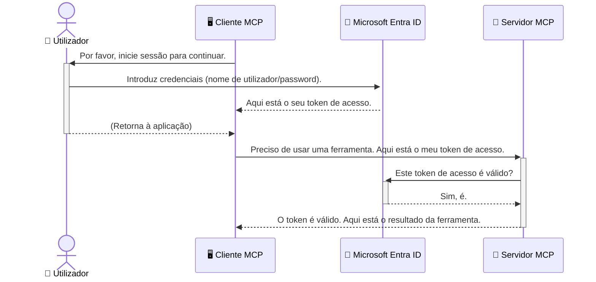

# Segurança nos Fluxos de Trabalho de IA: Autenticação Entra ID para Servidores do Protocolo de Contexto de Modelo

> [!NOTE]
> O código do servidor remoto nesta lição protege os endpoints legados `/sse` e `/message`
> e tem como alvo o MCP `2025-11-25`. Mantenha as práticas de validação de identidade e token,
> mas use um transporte HTTP Streamable compatível com `2026-07-28` para novas
> implementações.

## Introdução
Garantir a segurança do seu servidor do Protocolo de Contexto de Modelo (MCP) é tão importante quanto trancar a porta da frente da sua casa. Deixar o seu servidor MCP aberto expõe as suas ferramentas e dados a acessos não autorizados, o que pode levar a falhas de segurança. O Microsoft Entra ID fornece uma solução robusta baseada na nuvem para gestão de identidade e acesso, ajudando a garantir que apenas utilizadores e aplicações autorizados possam interagir com o seu servidor MCP. Nesta secção, irá aprender como proteger os seus fluxos de trabalho de IA usando a autenticação Entra ID.

## Objetivos de Aprendizagem
No final desta secção, será capaz de:

- Compreender a importância de assegurar servidores MCP.
- Explicar os conceitos básicos do Microsoft Entra ID e da autenticação OAuth 2.0.
- Reconhecer a diferença entre clientes públicos e confidential.
- Implementar autenticação Entra ID em cenários de servidor MCP local (cliente público) e remoto (cliente confidential).
- Aplicar as melhores práticas de segurança ao desenvolver fluxos de trabalho de IA.

## Segurança e MCP

Tal como não deixaria a porta da frente de casa destrancada, não deve deixar o seu servidor MCP aberto para acesso de qualquer pessoa. Garantir a segurança dos seus fluxos de trabalho de IA é essencial para construir aplicações robustas, confiáveis e seguras. Este capítulo irá apresentar-lhe o uso do Microsoft Entra ID para proteger os seus servidores MCP, assegurando que apenas utilizadores e aplicações autorizados possam interagir com as suas ferramentas e dados.

## Por Que a Segurança é Importante para Servidores MCP

Imagine que o seu servidor MCP tem uma ferramenta que pode enviar emails ou aceder a uma base de dados de clientes. Um servidor sem segurança significaria que qualquer pessoa poderia potencialmente usar essa ferramenta, conduzindo a acessos não autorizados a dados, spam ou outras atividades maliciosas.

Ao implementar a autenticação, assegura que cada pedido ao seu servidor é verificado, confirmando a identidade do utilizador ou da aplicação que faz o pedido. Este é o primeiro e mais crítico passo para proteger os seus fluxos de trabalho de IA.

## Introdução ao Microsoft Entra ID

[**Microsoft Entra ID**](https://adoption.microsoft.com/microsoft-security/entra/) é um serviço baseado na nuvem para gestão de identidade e acesso. Pense nele como um segurança universal para as suas aplicações. Trata do processo complexo de verificar identidades de utilizadores (autenticação) e determinar o que eles têm autorização para fazer (autorização).

Ao usar Entra ID, pode:

- Permitir um início de sessão seguro para os utilizadores.
- Proteger APIs e serviços.
- Gerir políticas de acesso a partir de um local central.

Para servidores MCP, o Entra ID fornece uma solução robusta e amplamente confiável para gerir quem pode aceder às capacidades do seu servidor.

---

## Compreendendo a Magia: Como Funciona a Autenticação Entra ID

O Entra ID usa padrões abertos como **OAuth 2.0** para gerir a autenticação. Embora os detalhes possam ser complexos, o conceito principal é simples e pode ser entendido com uma analogia.

### Uma Introdução Suave ao OAuth 2.0: A Chave de Estacionamento

Pense no OAuth 2.0 como um serviço de estacionamento para o seu carro. Quando chega a um restaurante, não entrega ao manobrista a sua chave mestra. Em vez disso, fornece uma **chave de estacionamento** que tem permissões limitadas—pode arrancar o carro e trancar as portas, mas não pode abrir o porta-bagagens ou a luva.

Nesta analogia:

- **Você** é o **Utilizador**.
- **O seu carro** é o **Servidor MCP** com as suas ferramentas e dados valiosos.
- O **Manobrista** é o **Microsoft Entra ID**.
- O **Estacionador** é o **Cliente MCP** (a aplicação que tenta aceder ao servidor).
- A **Chave de Estacionamento** é o **Token de Acesso**.

O token de acesso é uma cadeia segura de texto que o cliente MCP recebe do Entra ID após iniciar sessão. O cliente apresenta então este token ao servidor MCP em cada pedido. O servidor pode verificar o token para garantir que o pedido é legítimo e que o cliente tem as permissões necessárias, tudo sem precisar de lidar com as suas credenciais reais (como a sua palavra-passe).

### O Fluxo de Autenticação

Eis como o processo funciona na prática:



### Apresentando a Biblioteca de Autenticação Microsoft (MSAL)

Antes de mergulharmos no código, é importante apresentar um componente chave que verá nos exemplos: a **Biblioteca de Autenticação Microsoft (MSAL)**.

O MSAL é uma biblioteca desenvolvida pela Microsoft que facilita muito para os programadores tratar a autenticação. Em vez de ter de escrever todo o código complexo para gerir tokens de segurança, gerir inícios de sessão e atualizar sessões, o MSAL trata do trabalho pesado.

Usar uma biblioteca como o MSAL é altamente recomendado porque:

- **É Seguro:** Implementa protocolos padrão da indústria e as melhores práticas de segurança, reduzindo o risco de vulnerabilidades no seu código.
- **Simplifica o Desenvolvimento:** Abstrai a complexidade dos protocolos OAuth 2.0 e OpenID Connect, permitindo adicionar autenticação robusta à sua aplicação com poucas linhas de código.
- **É Mantido:** A Microsoft mantém e atualiza ativamente o MSAL para responder a novas ameaças de segurança e mudanças na plataforma.

O MSAL suporta uma grande variedade de linguagens e frameworks de aplicações, incluindo .NET, JavaScript/TypeScript, Python, Java, Go e plataformas móveis como iOS e Android. Isto significa que pode usar os mesmos padrões consistentes de autenticação por toda a sua stack tecnológica.

Para saber mais sobre o MSAL, pode consultar a documentação oficial da [visão geral do MSAL](https://learn.microsoft.com/entra/identity-platform/msal-overview).

---

## Protegendo o Seu Servidor MCP com Entra ID: Um Guia Passo a Passo

Agora, vamos percorrer como assegurar um servidor MCP local (que comunica via `stdio`) usando Entra ID. Este exemplo usa um **cliente público**, adequado para aplicações que correm na máquina do utilizador, como uma aplicação desktop ou um servidor de desenvolvimento local.

### Cenário 1: Assegurar um Servidor MCP Local (com Cliente Público)

Neste cenário, vamos analisar um servidor MCP que corre localmente, comunica por `stdio` e usa Entra ID para autenticar o utilizador antes de permitir o acesso às ferramentas. O servidor terá uma única ferramenta que obtém as informações do perfil do utilizador da API Microsoft Graph.

#### 1. Configurar a Aplicação no Entra ID

Antes de escrever qualquer código, precisa de registar a sua aplicação no Microsoft Entra ID. Isto informa o Entra ID sobre a sua aplicação e concede-lhe permissão para usar o serviço de autenticação.

1. Navegue para o **[portal Microsoft Entra](https://entra.microsoft.com/)**.
2. Vá a **Registos de aplicação** e clique em **Novo registo**.
3. Dê um nome à sua aplicação (por exemplo, "O Meu Servidor MCP Local").
4. Para **Tipos de conta suportados**, selecione **Contas neste diretório organizacional apenas**.
5. Pode deixar o **URI de Reencaminhamento** em branco para este exemplo.
6. Clique em **Registar**.

Depois de registado, tome nota do **ID da aplicação (cliente)** e do **ID do diretório (inquilino)**. Vai precisar destes no seu código.

#### 2. O Código: Uma Análise

Vamos ver as partes chave do código que tratam da autenticação. O código completo deste exemplo está disponível na pasta [Entra ID - Local - WAM](https://github.com/Azure-Samples/mcp-auth-servers/tree/main/src/entra-id-local-wam) do [repositório GitHub mcp-auth-servers](https://github.com/Azure-Samples/mcp-auth-servers).

**`AuthenticationService.cs`**

Esta classe é responsável por gerir a interação com o Entra ID.

- **`CreateAsync`**: Este método inicializa o `PublicClientApplication` do MSAL (Microsoft Authentication Library). Está configurado com o `clientId` e `tenantId` da sua aplicação.
- **`WithBroker`**: Permite o uso de um broker (como o Windows Web Account Manager), que fornece uma experiência de início de sessão único mais segura e fluida.
- **`AcquireTokenAsync`**: É o método principal. Primeiro tenta obter um token silenciosamente (isto é, o utilizador não precisa de iniciar sessão novamente se já tiver uma sessão válida). Se não for possível obter um token silencioso, irá solicitar ao utilizador que faça login interativamente.

```csharp
// Simplified for clarity
public static async Task<AuthenticationService> CreateAsync(ILogger<AuthenticationService> logger)
{
    var msalClient = PublicClientApplicationBuilder
        .Create(_clientId) // Your Application (client) ID
        .WithAuthority(AadAuthorityAudience.AzureAdMyOrg)
        .WithTenantId(_tenantId) // Your Directory (tenant) ID
        .WithBroker(new BrokerOptions(BrokerOptions.OperatingSystems.Windows))
        .Build();

    // ... cache registration ...

    return new AuthenticationService(logger, msalClient);
}

public async Task<string> AcquireTokenAsync()
{
    try
    {
        // Try silent authentication first
        var accounts = await _msalClient.GetAccountsAsync();
        var account = accounts.FirstOrDefault();

        AuthenticationResult? result = null;

        if (account != null)
        {
            result = await _msalClient.AcquireTokenSilent(_scopes, account).ExecuteAsync();
        }
        else
        {
            // If no account, or silent fails, go interactive
            result = await _msalClient.AcquireTokenInteractive(_scopes).ExecuteAsync();
        }

        return result.AccessToken;
    }
    catch (Exception ex)
    {
        _logger.LogError(ex, "An error occurred while acquiring the token.");
        throw; // Optionally rethrow the exception for higher-level handling
    }
}
```

**`Program.cs`**

É aqui que o servidor MCP é configurado e o serviço de autenticação é integrado.

- **`AddSingleton<AuthenticationService>`**: Regista o `AuthenticationService` no contentor de injeção de dependências, para que possa ser usado por outras partes da aplicação (como a nossa ferramenta).
- **A ferramenta `GetUserDetailsFromGraph`**: Esta ferramenta requer uma instância do `AuthenticationService`. Antes de executar qualquer ação, chama `authService.AcquireTokenAsync()` para obter um token de acesso válido. Se a autenticação for bem-sucedida, utiliza o token para chamar a API Microsoft Graph e obter os detalhes do utilizador.

```csharp
// Simplified for clarity
[McpServerTool(Name = "GetUserDetailsFromGraph")]
public static async Task<string> GetUserDetailsFromGraph(
    AuthenticationService authService)
{
    try
    {
        // This will trigger the authentication flow
        var accessToken = await authService.AcquireTokenAsync();

        // Use the token to create a GraphServiceClient
        var graphClient = new GraphServiceClient(
            new BaseBearerTokenAuthenticationProvider(new TokenProvider(authService)));

        var user = await graphClient.Me.GetAsync();

        return System.Text.Json.JsonSerializer.Serialize(user);
    }
    catch (Exception ex)
    {
        return $"Error: {ex.Message}";
    }
}
```

#### 3. Como Tudo Funciona Junto

1. Quando o cliente MCP tenta usar a ferramenta `GetUserDetailsFromGraph`, a ferramenta chama primeiro `AcquireTokenAsync`.
2. `AcquireTokenAsync` faz com que a biblioteca MSAL verifique se existe um token válido.
3. Se nenhum token for encontrado, o MSAL, através do broker, solicitará ao utilizador que inicie sessão com a sua conta Entra ID.
4. Quando o utilizador inicia sessão, o Entra ID emite um token de acesso.
5. A ferramenta recebe o token e usa-o para fazer uma chamada segura à API Microsoft Graph.
6. Os detalhes do utilizador são devolvidos ao cliente MCP.

Este processo assegura que só utilizadores autenticados podem usar a ferramenta, protegendo efetivamente o seu servidor MCP local.

### Cenário 2: Assegurar um Servidor MCP Remoto (com Cliente Confidencial)

Quando o seu servidor MCP está a correr numa máquina remota (como um servidor na nuvem) e comunica por um protocolo como Streaming HTTP, os requisitos de segurança são diferentes. Neste caso, deve usar um **cliente confidencial** e o **Fluxo de Código de Autorização**. Este é um método mais seguro porque os segredos da aplicação nunca são expostos ao navegador.

Este exemplo usa um servidor MCP baseado em TypeScript que utiliza Express.js para tratar pedidos HTTP.

#### 1. Configurar a Aplicação no Entra ID

A configuração no Entra ID é semelhante ao cliente público, mas com uma diferença chave: precisa criar um **segredo de cliente**.

1. Navegue para o **[portal Microsoft Entra](https://entra.microsoft.com/)**.
2. No registo da sua aplicação, vá ao separador **Certificados e segredos**.
3. Clique em **Novo segredo de cliente**, dê uma descrição e clique em **Adicionar**.
4. **Importante:** Copie o valor do segredo imediatamente. Não poderá vê-lo novamente.
5. Também precisa de configurar um **URI de redirecionamento**. Vá ao separador **Autenticação**, clique em **Adicionar uma plataforma**, selecione **Web** e insira o URI de redirecionamento da sua aplicação (por exemplo, `http://localhost:3001/auth/callback`).

> **⚠️ Nota Importante de Segurança:** Para aplicações em produção, a Microsoft recomenda fortemente o uso de métodos de autenticação **sem segredos** como **Identidade Gerida** ou **Federação de Identidade de Workload** em vez de segredos de cliente. Segredos de cliente representam riscos de segurança porque podem ser expostos ou comprometidos. Identidades geridas fornecem uma abordagem mais segura ao eliminar a necessidade de armazenar credenciais no seu código ou configuração.
>
> Para mais informações sobre identidades geridas e como implementá-las, consulte a [Visão geral das identidades geridas para recursos Azure](https://learn.microsoft.com/entra/identity/managed-identities-azure-resources/overview).

#### 2. O Código: Uma Análise

Este exemplo usa uma abordagem baseada em sessão. Quando o utilizador se autentica, o servidor armazena o token de acesso e o token de atualização numa sessão e dá ao utilizador um token de sessão. Este token de sessão é depois usado para pedidos subsequentes. O código completo deste exemplo está disponível na pasta [Entra ID - Cliente confidencial](https://github.com/Azure-Samples/mcp-auth-servers/tree/main/src/entra-id-cca-session) do [repositório GitHub mcp-auth-servers](https://github.com/Azure-Samples/mcp-auth-servers).

**`Server.ts`**

Este ficheiro configura o servidor Express e a camada de transporte MCP.

- **`requireBearerAuth`**: Este é um middleware que protege os endpoints `/sse` e `/message`. Verifica se há um token bearer válido no cabeçalho `Authorization` do pedido.
- **`EntraIdServerAuthProvider`**: Esta é uma classe personalizada que implementa a interface `McpServerAuthorizationProvider`. É responsável por gerir o fluxo OAuth 2.0.
- **`/auth/callback`**: Este endpoint trata o redirecionamento do Entra ID após o utilizador se autenticar. Troca o código de autorização por um token de acesso e um token de atualização.

```typescript
// Simplificado para clareza
const app = express();
const { server } = createServer();
const provider = new EntraIdServerAuthProvider();

// Proteger o endpoint SSE
app.get("/sse", requireBearerAuth({
  provider,
  requiredScopes: ["User.Read"]
}), async (req, res) => {
  // ... ligar ao transporte ...
});

// Proteger o endpoint de mensagens
app.post("/message", requireBearerAuth({
  provider,
  requiredScopes: ["User.Read"]
}), async (req, res) => {
  // ... lidar com a mensagem ...
});

// Tratar o callback OAuth 2.0
app.get("/auth/callback", (req, res) => {
  provider.handleCallback(req.query.code, req.query.state)
    .then(result => {
      // ... tratar sucesso ou falha ...
    });
});
```

**`Tools.ts`**

Este ficheiro define as ferramentas que o servidor MCP fornece. A ferramenta `getUserDetails` é semelhante à do exemplo anterior, mas obtém o token de acesso da sessão.

```typescript
// Simplificado para clareza
server.setRequestHandler(CallToolRequestSchema, async (request) => {
  const { name } = request.params;
  const context = request.params?.context as { token?: string } | undefined;
  const sessionToken = context?.token;

  if (name === ToolName.GET_USER_DETAILS) {
    if (!sessionToken) {
      throw new AuthenticationError("Authentication token is missing or invalid. Ensure the token is provided in the request context.");
    }

    // Obter o token Entra ID da loja de sessão
    const tokenData = tokenStore.getToken(sessionToken);
    const entraIdToken = tokenData.accessToken;

    const graphClient = Client.init({
      authProvider: (done) => {
        done(null, entraIdToken);
      }
    });

    const user = await graphClient.api('/me').get();

    // ... retornar detalhes do utilizador ...
  }
});
```

**`auth/EntraIdServerAuthProvider.ts`**

Esta classe trata da lógica para:

- Redirecionar o utilizador para a página de início de sessão do Entra ID.
- Trocar o código de autorização por um token de acesso.
- Armazenar os tokens no `tokenStore`.
- Atualizar o token de acesso quando este expirar.


#### 3. Como Tudo Funciona em Conjunto

1. Quando um utilizador tenta ligar-se pela primeira vez ao servidor MCP, o middleware `requireBearerAuth` verifica que não tem uma sessão válida e redireciona-o para a página de início de sessão do Entra ID.
2. O utilizador inicia sessão com a sua conta Entra ID.
3. O Entra ID redireciona o utilizador de volta ao endpoint `/auth/callback` com um código de autorização.
4. O servidor troca o código por um token de acesso e um token de atualização, armazena-os e cria um token de sessão que é enviado ao cliente.
5. O cliente pode agora usar este token de sessão no cabeçalho `Authorization` para todos os pedidos futuros ao servidor MCP.
6. Quando a ferramenta `getUserDetails` é chamada, utiliza o token de sessão para procurar o token de acesso Entra ID e depois usa isso para chamar a API Microsoft Graph.

Este fluxo é mais complexo do que o fluxo do cliente público, mas é necessário para endpoints expostos na internet. Como os servidores MCP remotos são acessíveis pela internet pública, precisam de medidas de segurança mais rigorosas para se protegerem contra acessos não autorizados e ataques potenciais.


## Melhores Práticas de Segurança

- **Use sempre HTTPS**: Encripte a comunicação entre cliente e servidor para proteger os tokens de serem interceptados.
- **Implemente Controlo de Acesso Baseado em Funções (RBAC)**: Não verifique apenas *se* o utilizador está autenticado; verifique *o que* está autorizado a fazer. Pode definir funções no Entra ID e verificar essas funções no seu servidor MCP.
- **Monitorize e audite**: Registe todos os eventos de autenticação para poder detetar e responder a atividades suspeitas.
- **Lide com limitação e controlo de taxa**: O Microsoft Graph e outras APIs aplicam limitação de taxa para prevenir abusos. Implemente a lógica de retentativa com backoff exponencial no seu servidor MCP para lidar graciosamente com respostas HTTP 429 (Demasiados pedidos). Considere armazenar em cache dados frequentemente acedidos para reduzir chamadas à API.
- **Armazenamento seguro de tokens**: Armazene os tokens de acesso e de atualização de forma segura. Para aplicações locais, use os mecanismos de armazenamento seguro do sistema. Para aplicações de servidor, considere usar armazenamento encriptado ou serviços seguros de gestão de chaves como o Azure Key Vault.
- **Gestão da expiração do token**: Os tokens de acesso têm um tempo de vida limitado. Implemente a atualização automática do token usando tokens de atualização para manter uma experiência de utilizador contínua sem necessidade de reautenticação.
- **Considere usar o Azure API Management**: Embora implementar segurança diretamente no seu servidor MCP lhe dê controlo detalhado, gateways de API como o Azure API Management podem tratar muitas destas preocupações de segurança automaticamente, incluindo autenticação, autorização, limitação de taxa e monitorização. Fornecem uma camada de segurança centralizada entre os seus clientes e os seus servidores MCP. Para mais detalhes sobre o uso de gateways API com MCP, veja o nosso [Azure API Management Your Auth Gateway For MCP Servers](https://techcommunity.microsoft.com/blog/integrationsonazureblog/azure-api-management-your-auth-gateway-for-mcp-servers/4402690).


## Principais Conclusões

- Proteger o seu servidor MCP é crucial para a proteção dos seus dados e ferramentas.
- O Microsoft Entra ID fornece uma solução robusta e escalável para autenticação e autorização.
- Use um **cliente público** para aplicações locais e um **cliente confidencial** para servidores remotos.
- O **Fluxo de Código de Autorização** é a opção mais segura para aplicações web.


## Exercício

1. Pense num servidor MCP que possa construir. Seria um servidor local ou remoto?
2. Com base na sua resposta, usaria um cliente público ou confidencial?
3. Que permissões o seu servidor MCP pediria para executar ações contra o Microsoft Graph?


## Exercícios Práticos

### Exercício 1: Registar uma Aplicação no Entra ID
Navegue até ao portal Microsoft Entra.
Registe uma nova aplicação para o seu servidor MCP.
Registe o ID da Aplicação (cliente) e o ID do Diretório (tenant).

### Exercício 2: Proteger um Servidor MCP Local (Cliente Público)
- Siga o exemplo de código para integrar o MSAL (Microsoft Authentication Library) para autenticação de utilizadores.
- Teste o fluxo de autenticação chamando a ferramenta MCP que busca detalhes de utilizador do Microsoft Graph.

### Exercício 3: Proteger um Servidor MCP Remoto (Cliente Confidencial)
- Registe um cliente confidencial no Entra ID e crie um segredo de cliente.
- Configure o seu servidor MCP Express.js para usar o Fluxo de Código de Autorização.
- Teste os endpoints protegidos e confirme o acesso baseado em token.

### Exercício 4: Aplicar Melhores Práticas de Segurança
- Ative o HTTPS para o seu servidor local ou remoto.
- Implemente controlo de acesso baseado em funções (RBAC) na lógica do servidor.
- Adicione gestão da expiração do token e armazenamento seguro de tokens.

## Recursos

1. **Documentação de Visão Geral do MSAL**  
   Saiba como a Microsoft Authentication Library (MSAL) permite a aquisição segura de tokens em várias plataformas:  
   [Visão Geral do MSAL na Microsoft Learn](https://learn.microsoft.com/en-gb/entra/msal/overview)

2. **Repositório GitHub Azure-Samples/mcp-auth-servers**  
   Implementações de referência de servidores MCP demonstrando fluxos de autenticação:  
   [Azure-Samples/mcp-auth-servers no GitHub](https://github.com/Azure-Samples/mcp-auth-servers)

3. **Visão Geral das Identidades Geridas para Recursos Azure**  
   Compreenda como eliminar segredos usando identidades geridas atribuídas pelo sistema ou utilizador:  
   [Visão Geral das Identidades Geridas na Microsoft Learn](https://learn.microsoft.com/en-us/entra/identity/managed-identities-azure-resources/)

4. **Azure API Management: O Seu Gateway de Autenticação para Servidores MCP**  
   Uma análise detalhada do uso do APIM como gateway OAuth2 seguro para servidores MCP:  
   [Azure API Management Your Auth Gateway For MCP Servers](https://techcommunity.microsoft.com/blog/integrationsonazureblog/azure-api-management-your-auth-gateway-for-mcp-servers/4402690)

5. **Referência de Permissões do Microsoft Graph**  
   Lista completa de permissões delegadas e de aplicação para o Microsoft Graph:  
   [Referência de Permissões do Microsoft Graph](https://learn.microsoft.com/zh-tw/graph/permissions-reference)


## Resultados de Aprendizagem
Depois de completar esta secção, será capaz de:

- Articular porque a autenticação é crítica para servidores MCP e fluxos de trabalho de IA.
- Configurar e configurar a autenticação Entra ID para cenários de servidor MCP locais e remotos.
- Escolher o tipo de cliente apropriado (público ou confidencial) com base na implementação do seu servidor.
- Implementar práticas de codificação segura, incluindo armazenamento de tokens e autorização baseada em funções.
- Proteger confiadamente o seu servidor MCP e as suas ferramentas contra acessos não autorizados.

## O que vem a seguir 

- [5.13 Protocolo de Contexto do Modelo (MCP) Integração com Microsoft Foundry](../mcp-foundry-agent-integration/README.md)

---

<!-- CO-OP TRANSLATOR DISCLAIMER START -->
**Aviso Legal**:
Este documento foi traduzido utilizando o serviço de tradução automática [Co-op Translator](https://github.com/Azure/co-op-translator). Embora nos esforcemos pela precisão, esteja ciente de que traduções automáticas podem conter erros ou imprecisões. O documento original na sua língua nativa deve ser considerado a fonte autorizada. Para informações críticas, recomenda-se tradução profissional humana. Não nos responsabilizamos por quaisquer mal-entendidos ou interpretações incorretas resultantes da utilização desta tradução.
<!-- CO-OP TRANSLATOR DISCLAIMER END -->