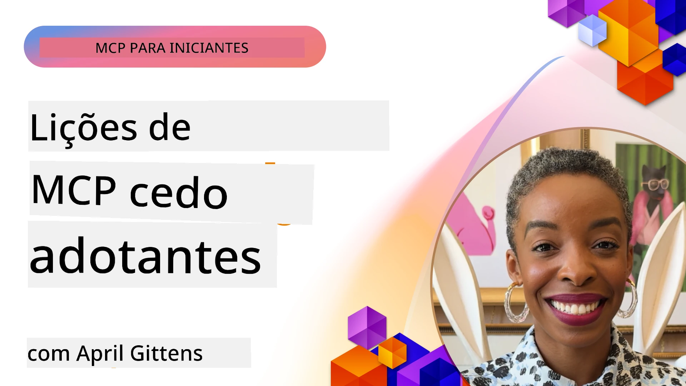

# 🌟 Lições dos Primeiros Utilizadores

[](https://youtu.be/jds7dSmNptE)

_(Clique na imagem acima para ver o vídeo desta lição)_

## 🎯 O Que Este Módulo Aborda

Este módulo explora como organizações e programadores reais estão a aproveitar o Model Context Protocol (MCP) para resolver desafios reais e impulsionar a inovação. Através de estudos de caso detalhados, projetos práticos e exemplos concretos, irá descobrir como o MCP permite uma integração segura e escalável de IA que liga modelos de linguagem, ferramentas e dados empresariais.

### 📚 Veja o MCP em Ação

Quer ver estes princípios aplicados a ferramentas prontas para produção? Consulte os nossos [**10 Servidores MCP da Microsoft que Estão a Transformar a Produtividade dos Programadores**](microsoft-mcp-servers.md), que mostram servidores MCP reais da Microsoft que pode usar hoje.

## Visão Geral

Esta lição explora como os primeiros utilizadores aproveitaram o Model Context Protocol (MCP) para resolver desafios do mundo real e impulsionar a inovação em vários setores. Através de estudos de caso detalhados e projetos práticos, verá como o MCP possibilita uma integração de IA padronizada, segura e escalável—ligando grandes modelos de linguagem, ferramentas e dados empresariais num quadro unificado. Ganhará experiência prática a desenhar e construir soluções baseadas em MCP, aprenderá padrões comprovados de implementação e descobrirá as melhores práticas para implementar o MCP em ambientes de produção. A lição também destaca tendências emergentes, direções futuras e recursos de código aberto para o ajudar a manter-se na vanguarda da tecnologia MCP e do seu ecossistema em evolução.

## Objetivos de Aprendizagem

- Analisar implementações reais do MCP em diferentes setores
- Projetar e construir aplicações completas baseadas em MCP
- Explorar tendências emergentes e direções futuras na tecnologia MCP
- Aplicar melhores práticas em cenários reais de desenvolvimento

## Implementações Reais do MCP

### Estudo de Caso 1: Automação do Suporte ao Cliente em Empresas

Uma empresa multinacional implementou uma solução baseada em MCP para padronizar as interações de IA nos seus sistemas de suporte ao cliente. Isto permitiu-lhes:

- Criar uma interface unificada para múltiplos fornecedores de LLM
- Manter uma gestão consistente de prompts entre departamentos
- Implementar controlos robustos de segurança e conformidade
- Alternar facilmente entre diferentes modelos de IA conforme necessidades específicas

**Implementação Técnica:**

```python
# Implementação do servidor MCP em Python para suporte ao cliente
import logging
import asyncio
from modelcontextprotocol import create_server, ServerConfig
from modelcontextprotocol.server import MCPServer
from modelcontextprotocol.transports import create_http_transport
from modelcontextprotocol.resources import ResourceDefinition
from modelcontextprotocol.prompts import PromptDefinition
from modelcontextprotocol.tool import ToolDefinition

# Configurar o registo
logging.basicConfig(level=logging.INFO)

async def main():
    # Criar configuração do servidor
    config = ServerConfig(
        name="Enterprise Customer Support Server",
        version="1.0.0",
        description="MCP server for handling customer support inquiries"
    )
    
    # Inicializar o servidor MCP
    server = create_server(config)
    
    # Registar recursos da base de conhecimento
    server.resources.register(
        ResourceDefinition(
            name="customer_kb",
            description="Customer knowledge base documentation"
        ),
        lambda params: get_customer_documentation(params)
    )
    
    # Registar templates de prompt
    server.prompts.register(
        PromptDefinition(
            name="support_template",
            description="Templates for customer support responses"
        ),
        lambda params: get_support_templates(params)
    )
    
    # Registar ferramentas de suporte
    server.tools.register(
        ToolDefinition(
            name="ticketing",
            description="Create and update support tickets"
        ),
        handle_ticketing_operations
    )
    
    # Iniciar servidor com transporte HTTP
    transport = create_http_transport(port=8080)
    await server.run(transport)

if __name__ == "__main__":
    asyncio.run(main())
```

**Resultados:** Redução de 30% nos custos dos modelos, melhoria de 45% na consistência das respostas e reforço da conformidade em operações globais.

### Estudo de Caso 2: Assistente Diagnóstico na Saúde

Um prestador de serviços de saúde desenvolveu uma infraestrutura MCP para integrar múltiplos modelos médicos especializados de IA garantindo que os dados sensíveis dos pacientes permanecem protegidos:

- Alternância fluida entre modelos médicos generalistas e especialistas
- Controlos rigorosos de privacidade e registos de auditoria
- Integração com sistemas existentes de Registos Eletrónicos de Saúde (EHR)
- Engenharia consistente de prompts para terminologia médica

**Implementação Técnica:**

```csharp
// C# MCP host application implementation in healthcare application
using Microsoft.Extensions.DependencyInjection;
using ModelContextProtocol.SDK.Client;
using ModelContextProtocol.SDK.Security;
using ModelContextProtocol.SDK.Resources;

public class DiagnosticAssistant
{
    private readonly MCPHostClient _mcpClient;
    private readonly PatientContext _patientContext;
    
    public DiagnosticAssistant(PatientContext patientContext)
    {
        _patientContext = patientContext;
        
        // Configure MCP client with healthcare-specific settings
        var clientOptions = new ClientOptions
        {
            Name = "Healthcare Diagnostic Assistant",
            Version = "1.0.0",
            Security = new SecurityOptions
            {
                Encryption = EncryptionLevel.Medical,
                AuditEnabled = true
            }
        };
        
        _mcpClient = new MCPHostClientBuilder()
            .WithOptions(clientOptions)
            .WithTransport(new HttpTransport("https://healthcare-mcp.example.org"))
            .WithAuthentication(new HIPAACompliantAuthProvider())
            .Build();
    }
    
    public async Task<DiagnosticSuggestion> GetDiagnosticAssistance(
        string symptoms, string patientHistory)
    {
        // Create request with appropriate resources and tool access
        var resourceRequest = new ResourceRequest
        {
            Name = "patient_records",
            Parameters = new Dictionary<string, object>
            {
                ["patientId"] = _patientContext.PatientId,
                ["requestingProvider"] = _patientContext.ProviderId
            }
        };
        
        // Request diagnostic assistance using appropriate prompt
        var response = await _mcpClient.SendPromptRequestAsync(
            promptName: "diagnostic_assistance",
            parameters: new Dictionary<string, object>
            {
                ["symptoms"] = symptoms,
                patientHistory = patientHistory,
                relevantGuidelines = _patientContext.GetRelevantGuidelines()
            });
            
        return DiagnosticSuggestion.FromMCPResponse(response);
    }
}
```

**Resultados:** Melhoria nas sugestões de diagnóstico para médicos mantendo total conformidade HIPAA e redução significativa na mudança de contexto entre sistemas.

### Estudo de Caso 3: Análise de Risco em Serviços Financeiros

Uma instituição financeira implementou MCP para padronizar os seus processos de análise de risco através de diferentes departamentos:

- Criou interface unificada para modelos de risco de crédito, deteção de fraude e risco de investimento
- Implementou controlos de acesso rigorosos e versionamento dos modelos
- Assegurou auditoria de todas as recomendações de IA
- Manteve formatação consistente dos dados entre sistemas diversos

**Implementação Técnica:**

```java
// Servidor Java MCP para avaliação de risco financeiro
import org.mcp.server.*;
import org.mcp.security.*;

public class FinancialRiskMCPServer {
    public static void main(String[] args) {
        // Criar servidor MCP com funcionalidades de conformidade financeira
        MCPServer server = new MCPServerBuilder()
            .withModelProviders(
                new ModelProvider("risk-assessment-primary", new AzureOpenAIProvider()),
                new ModelProvider("risk-assessment-audit", new LocalLlamaProvider())
            )
            .withPromptTemplateDirectory("./compliance/templates")
            .withAccessControls(new SOCCompliantAccessControl())
            .withDataEncryption(EncryptionStandard.FINANCIAL_GRADE)
            .withVersionControl(true)
            .withAuditLogging(new DatabaseAuditLogger())
            .build();
            
        server.addRequestValidator(new FinancialDataValidator());
        server.addResponseFilter(new PII_RedactionFilter());
        
        server.start(9000);
        
        System.out.println("Financial Risk MCP Server running on port 9000");
    }
}
```

**Resultados:** Melhor conformidade regulatória, ciclos de implementação de modelos 40% mais rápidos e melhor consistência na avaliação de risco entre departamentos.

### Estudo de Caso 4: Servidor MCP Microsoft Playwright para Automatização de Browsers

A Microsoft desenvolveu o [servidor MCP Playwright](https://github.com/microsoft/playwright-mcp) para permitir automação de browser segura e padronizada através do Model Context Protocol. Este servidor pronto para produção permite que agentes IA e LLMs interajam com browsers web de forma controlada, auditável e extensível—capacitando casos de uso como testes web automatizados, extração de dados e fluxos de trabalho ponta a ponta.

> **🎯 Ferramenta Pronta para Produção**
> 
> Este estudo de caso mostra um servidor MCP real que pode usar hoje! Saiba mais sobre o Servidor MCP Playwright e outros 9 servidores MCP prontos para produção da Microsoft no nosso [**Guia dos Servidores MCP da Microsoft**](microsoft-mcp-servers.md#8--playwright-mcp-server).

**Características Principais:**
- Expõe capacidades de automação de browser (navegação, preenchimento de formulários, captura de ecrãs, etc.) como ferramentas MCP
- Implementa controlos de acesso rigorosos e sandboxing para prevenir ações não autorizadas
- Fornece registos de auditoria detalhados para todas as interações com browsers
- Suporta integração com Azure OpenAI e outros fornecedores de LLM para automação orientada por agentes
- Alimenta o Agente de Codificação do GitHub Copilot com capacidades de navegação web

**Implementação Técnica:**

```typescript
// TypeScript: Registar ferramentas de automação do navegador Playwright num servidor MCP
import { createServer, ToolDefinition } from 'modelcontextprotocol';
import { launch } from 'playwright';

const server = createServer({
  name: 'Playwright MCP Server',
  version: '1.0.0',
  description: 'MCP server for browser automation using Playwright'
});

// Registar uma ferramenta para navegar para um URL e capturar uma captura de ecrã
server.tools.register(
  new ToolDefinition({
    name: 'navigate_and_screenshot',
    description: 'Navigate to a URL and capture a screenshot',
    parameters: {
      url: { type: 'string', description: 'The URL to visit' }
    }
  }),
  async ({ url }) => {
    const browser = await launch();
    const page = await browser.newPage();
    await page.goto(url);
    const screenshot = await page.screenshot();
    await browser.close();
    return { screenshot };
  }
);

// Iniciar o servidor MCP
server.listen(8080);
```

**Resultados:**

- Permitida automação programática segura de browsers para agentes IA e LLMs
- Redução do esforço em testes manuais e melhoria da cobertura de testes para aplicações web
- Fornecido framework reutilizável e extensível para integração de ferramentas baseadas em browser em ambientes empresariais
- Alimenta as capacidades de navegação web do GitHub Copilot

**Referências:**

- [Repositório GitHub do Servidor MCP Playwright](https://github.com/microsoft/playwright-mcp)
- [Soluções Microsoft AI e Automação](https://azure.microsoft.com/en-us/products/ai-services/)

### Estudo de Caso 5: Azure MCP – Modelo Context Protocol Empresarial como Serviço

O Azure MCP Server ([https://aka.ms/azmcp](https://aka.ms/azmcp)) é a implementação gerida e empresarial do Model Context Protocol da Microsoft, concebida para fornecer capacidades de servidor MCP escaláveis, seguras e em conformidade como serviço na cloud. O Azure MCP permite que organizações implementem, geram e integrem rapidamente servidores MCP com serviços Azure AI, dados e de segurança, reduzindo a carga operacional e acelerando a adoção da IA.

> **🎯 Ferramenta Pronta para Produção**
> 
> Este é um servidor MCP real que pode usar hoje! Saiba mais sobre o Servidor MCP Microsoft Foundry no nosso [**Guia dos Servidores MCP da Microsoft**](microsoft-mcp-servers.md).


- Alojamento de servidor MCP totalmente gerido com escalabilidade, monitorização e segurança integradas
- Integração nativa com Azure OpenAI, Azure AI Search e outros serviços Azure
- Autenticação e autorização empresarial via Microsoft Entra ID
- Suporte a ferramentas personalizadas, modelos de prompt e conectores de recursos
- Conformidade com requisitos de segurança e regulamentares empresariais

**Implementação Técnica:**

```yaml
# Example: Azure MCP server deployment configuration (YAML)
apiVersion: mcp.microsoft.com/v1
kind: McpServer
metadata:
  name: enterprise-mcp-server
spec:
  modelProviders:
    - name: azure-openai
      type: AzureOpenAI
      endpoint: https://<your-openai-resource>.openai.azure.com/
      apiKeySecret: <your-azure-keyvault-secret>
  tools:
    - name: document_search
      type: AzureAISearch
      endpoint: https://<your-search-resource>.search.windows.net/
      apiKeySecret: <your-azure-keyvault-secret>
  authentication:
    type: EntraID
    tenantId: <your-tenant-id>
  monitoring:
    enabled: true
    logAnalyticsWorkspace: <your-log-analytics-id>
```

**Resultados:**  
- Redução do tempo para valor em projetos empresariais de IA ao providenciar uma plataforma servidor MCP pronta a usar e em conformidade
- Integração simplificada de LLMs, ferramentas e fontes de dados empresariais
- Reforço da segurança, observabilidade e eficiência operacional para cargas MCP
- Melhoria da qualidade do código com melhores práticas Azure SDK e padrões atuais de autenticação

**Referências:**  
- [Documentação Azure MCP](https://aka.ms/azmcp)
- [Repositório GitHub do Azure MCP Server](https://github.com/Azure/azure-mcp)
- [Serviços Azure AI](https://azure.microsoft.com/en-us/products/ai-services/)
- [Centro MCP Microsoft](https://mcp.azure.com)

## Estudo de Caso 6: NLWeb 
MCP (Model Context Protocol) é um protocolo emergente para Chatbots e assistentes IA interagirem com ferramentas. Cada instância NLWeb é também um servidor MCP, que suporta um método central, ask, usado para perguntar a um website em linguagem natural. A resposta devolvida utiliza schema.org, um vocabulário amplamente usado para descrever dados web. Grosso modo, MCP é para NLWeb o que Http é para HTML. O NLWeb combina protocolos, formatos Schema.org e código de exemplo para ajudar sites a criar rapidamente estes endpoints, beneficiando humanos através de interfaces conversacionais e máquinas através de interação natural entre agentes.

Existem dois componentes distintos no NLWeb.
- Um protocolo, muito simples para começar, para interagir com um site em linguagem natural e um formato, utilizando json e schema.org para a resposta devolvida. Veja a documentação da API REST para mais detalhes.
- Uma implementação direta de (1) que aproveita marcação existente, para sites que podem ser abstraídos como listas de itens (produtos, receitas, atrações, avaliações, etc.). Juntamente com um conjunto de widgets de interface de utilizador, os sites podem facilmente fornecer interfaces conversacionais para o seu conteúdo. Veja a documentação sobre o Ciclo de vida de uma consulta de conversa para mais detalhes de como isto funciona.
 
**Referências:**  
- [Documentação Azure MCP](https://aka.ms/azmcp)
- [NLWeb](https://github.com/microsoft/NlWeb)

### Estudo de Caso 7: Servidor MCP Microsoft Foundry – Integração de Agente de IA Empresarial

Os servidores Microsoft Foundry MCP demonstram como o MCP pode ser usado para orquestrar e gerir agentes IA e fluxos de trabalho em ambientes empresariais. Ao integrar o MCP com o Microsoft Foundry, as organizações podem padronizar interações de agentes, aproveitar a gestão de fluxos de trabalho Foundry e garantir implementações seguras e escaláveis.

> **🎯 Ferramenta Pronta para Produção**
> 
> Este é um servidor MCP real que pode usar hoje! Saiba mais sobre o Servidor MCP Microsoft Foundry no nosso [**Guia dos Servidores MCP da Microsoft**](microsoft-mcp-servers.md#9--microsoft-foundry-mcp-server).

**Características Principais:**
- Acesso abrangente ao ecossistema IA da Azure, incluindo catálogos de modelos e gestão de implementações
- Indexação de conhecimento com Azure AI Search para aplicações RAG
- Ferramentas de avaliação para desempenho e garantia de qualidade de modelos IA
- Integração com Microsoft Foundry Catalog e Labs para modelos de investigação inovadores
- Capacidades de gestão e avaliação de agentes para cenários de produção

**Resultados:**
- Protótipos rápidos e monitorização robusta de fluxos de trabalho de agentes IA
- Integração perfeita com serviços Azure AI para cenários avançados
- Interface unificada para construir, implementar e monitorizar pipelines de agentes
- Melhoria da segurança, conformidade e eficiência operacional para empresas
- Adoção acelerada de IA mantendo controlo sobre processos complexos orientados por agentes

**Referências:**
- [Repositório GitHub do Servidor MCP Microsoft Foundry](https://github.com/azure-ai-foundry/mcp-foundry)
- [Integração de Agentes Azure AI com MCP (Blog Microsoft Foundry)](https://devblogs.microsoft.com/foundry/integrating-azure-ai-agents-mcp/)

### Estudo de Caso 8: Foundry MCP Playground – Experimentação e Prototipagem

O Foundry MCP Playground oferece um ambiente pronto a usar para experimentar com servidores MCP e integrações Microsoft Foundry. Os programadores podem rapidamente prototipar, testar e avaliar modelos IA e fluxos de trabalho de agentes usando recursos do Microsoft Foundry Catalog e Labs. O playground simplifica a configuração, fornece projetos de exemplo e suporta desenvolvimento colaborativo, facilitando a exploração das melhores práticas e novos cenários com custos mínimos. É especialmente útil para equipas que procuram validar ideias, partilhar experiências e acelerar a aprendizagem sem necessidade de infraestruturas complexas. Ao baixar a barreira de entrada, o playground promove a inovação e contribuições comunitárias no ecossistema MCP e Microsoft Foundry.

**Referências:**

- [Repositório GitHub do Foundry MCP Playground](https://github.com/azure-ai-foundry/foundry-mcp-playground)

### Estudo de Caso 9: Servidor MCP Microsoft Learn Docs – Acesso a Documentação Potenciado por IA

O Servidor MCP Microsoft Learn Docs é um serviço alojado na cloud que fornece assistentes IA com acesso em tempo real à documentação oficial da Microsoft através do Model Context Protocol. Este servidor pronto para produção liga ao abrangente ecossistema Microsoft Learn e permite pesquisa semântica em todas as fontes oficiais da Microsoft.

> **🎯 Ferramenta Pronta para Produção**
> 
> Este é um servidor MCP real que pode usar hoje! Saiba mais sobre o Servidor MCP Microsoft Learn Docs no nosso [**Guia dos Servidores MCP da Microsoft**](microsoft-mcp-servers.md#1--microsoft-learn-docs-mcp-server).

**Características Principais:**
- Acesso em tempo real à documentação oficial da Microsoft, docs Azure e documentação Microsoft 365
- Capacidades avançadas de pesquisa semântica que compreendem contexto e intenção
- Informação sempre atualizada conforme o conteúdo Microsoft Learn é publicado
- Cobertura abrangente em Microsoft Learn, documentação Azure, e fontes Microsoft 365
- Retorna até 10 fragmentos de conteúdo de alta qualidade com títulos de artigos e URLs

**Por que é Crítico:**
- Resolve o problema do "conhecimento de IA desatualizado" para tecnologias Microsoft
- Assegura que assistentes IA têm acesso às últimas funcionalidades .NET, C#, Azure e Microsoft 365
- Fornece informação autorizada e de primeira mão para geração precisa de código
- Essencial para programadores que trabalham com tecnologias Microsoft em rápida evolução

**Resultados:**
- Precisão dramaticamente melhorada no código gerado por IA para tecnologias Microsoft
- Redução do tempo gasto a procurar documentação atual e melhores práticas
- Produtividade do programador aumentada com recuperação de documentação contextualizada
- Integração perfeita com fluxos de trabalho de desenvolvimento sem sair do IDE

**Referências:**
- [Repositório GitHub do Servidor MCP Microsoft Learn Docs](https://github.com/MicrosoftDocs/mcp)
- [Documentação Microsoft Learn](https://learn.microsoft.com/)

## Projetos Práticos

### Projeto 1: Construir um Servidor MCP Multi-Fornecedor

**Objetivo:** Criar um servidor MCP que possa encaminhar pedidos para múltiplos fornecedores de modelos IA com base em critérios específicos.

**Requisitos:**

- Suportar pelo menos três fornecedores de modelos diferentes (ex.: OpenAI, Anthropic, modelos locais)
- Implementar um mecanismo de encaminhamento baseado em metadados do pedido
- Criar um sistema de configuração para gestão de credenciais dos fornecedores
- Adicionar caching para otimizar desempenho e custos
- Construir um painel simples para monitorização do uso

**Passos de Implementação:**

1. Configurar a infraestrutura básica do servidor MCP
2. Implementar adaptadores de fornecedores para cada serviço de modelo IA
3. Criar a lógica de encaminhamento baseada em atributos do pedido
4. Adicionar mecanismos de caching para pedidos frequentes
5. Desenvolver o painel de monitorização
6. Testar com vários padrões de pedido

**Tecnologias:** Escolha entre Python (.NET/Java/Python conforme preferência), Redis para caching e um framework web simples para o painel.

### Projeto 2: Sistema Empresarial de Gestão de Prompts

**Objetivo:** Desenvolver um sistema baseado em MCP para gerir, versionar e implementar modelos de prompt numa organização.

**Requisitos:**


- Criar um repositório centralizado para modelos de prompts
- Implementar versionamento e fluxos de aprovação
- Construir capacidades de teste de modelos com entradas de exemplo
- Desenvolver controlos de acesso baseados em funções
- Criar uma API para recuperação e implementação de modelos

**Passos para a Implementação:**

1. Desenhar o esquema da base de dados para armazenamento dos modelos
2. Criar a API principal para operações CRUD dos modelos
3. Implementar o sistema de versionamento
4. Construir o fluxo de aprovação
5. Desenvolver o framework de testes
6. Criar uma interface web simples para gestão
7. Integrar com um servidor MCP

**Tecnologias:** A sua escolha de framework backend, base de dados SQL ou NoSQL, e um framework frontend para a interface de gestão.

### Projeto 3: Plataforma de Geração de Conteúdo Baseada em MCP

**Objetivo:** Construir uma plataforma de geração de conteúdo que aproveite o MCP para fornecer resultados consistentes em diferentes tipos de conteúdo.

**Requisitos:**

- Suportar múltiplos formatos de conteúdo (posts de blog, redes sociais, texto de marketing)
- Implementar geração baseada em modelos com opções de personalização
- Criar um sistema de revisão e feedback de conteúdo
- Acompanhar métricas de desempenho do conteúdo
- Suportar versionamento e iteração do conteúdo

**Passos para a Implementação:**

1. Configurar a infraestrutura cliente MCP
2. Criar modelos para diferentes tipos de conteúdo
3. Construir a pipeline de geração de conteúdo
4. Implementar o sistema de revisão
5. Desenvolver o sistema de acompanhamento de métricas
6. Criar uma interface de utilizador para gestão de modelos e geração de conteúdo

**Tecnologias:** A sua linguagem de programação preferida, framework web e sistema de base de dados.

## Direções Futuras para a Tecnologia MCP

### Tendências Emergentes

1. **MCP Multimodal**
   - Expansão do MCP para padronizar interações com modelos de imagem, áudio e vídeo
   - Desenvolvimento de capacidades de raciocínio cross-modal
   - Formatos padrão de prompts para diferentes modalidades

2. **Infraestrutura MCP Federada**
   - Redes MCP distribuídas que podem partilhar recursos entre organizações
   - Protocolos padronizados para partilha segura de modelos
   - Técnicas de computação preservadora de privacidade

3. **Mercados MCP**
   - Ecossistemas para partilha e monetização de modelos MCP e plugins
   - Processos de garantia de qualidade e certificação
   - Integração com mercados de modelos

4. **MCP para Computação de Borda**
   - Adaptação dos padrões MCP para dispositivos de borda com recursos limitados
   - Protocolos otimizados para ambientes de baixa largura de banda
   - Implementações especializadas de MCP para ecossistemas IoT

5. **Molduras Regulamentares**
   - Desenvolvimento de extensões MCP para conformidade regulamentar
   - Registos de auditoria padronizados e interfaces de explicabilidade
   - Integração com molduras emergentes de governação de IA

### Soluções MCP da Microsoft

A Microsoft e a Azure desenvolveram vários repositórios open source para ajudar os desenvolvedores a implementar MCP em diversos cenários:

#### Organização Microsoft

1. [playwright-mcp](https://github.com/microsoft/playwright-mcp) - Um servidor MCP Playwright para automação e testes de browser
2. [files-mcp-server](https://github.com/microsoft/files-mcp-server) - Uma implementação de servidor MCP OneDrive para testes locais e contribuição comunitária
3. [NLWeb](https://github.com/microsoft/NlWeb) - NLWeb é uma coleção de protocolos abertos e ferramentas open source associadas. O seu foco principal é estabelecer uma camada base para a Web de IA

#### Organização Azure-Samples

1. [mcp](https://github.com/Azure-Samples/mcp) - Links para exemplos, ferramentas e recursos para construir e integrar servidores MCP no Azure usando múltiplas linguagens
2. [mcp-auth-servers](https://github.com/Azure-Samples/mcp-auth-servers) - Servidores MCP de referência demonstrando autenticação conforme a especificação atual do Model Context Protocol
3. [remote-mcp-functions](https://github.com/Azure-Samples/remote-mcp-functions) - Página de aterragem para implementações de Remote MCP Server em Azure Functions com links para repositórios por linguagem
4. [remote-mcp-functions-python](https://github.com/Azure-Samples/remote-mcp-functions-python) - Template Quickstart para construir e implementar servidores MCP remotos personalizados usando Azure Functions com Python
5. [remote-mcp-functions-dotnet](https://github.com/Azure-Samples/remote-mcp-functions-dotnet) - Template Quickstart para construir e implementar servidores MCP remotos personalizados usando Azure Functions com .NET/C#
6. [remote-mcp-functions-typescript](https://github.com/Azure-Samples/remote-mcp-functions-typescript) - Template Quickstart para construir e implementar servidores MCP remotos personalizados usando Azure Functions com TypeScript
7. [remote-mcp-apim-functions-python](https://github.com/Azure-Samples/remote-mcp-apim-functions-python) - Azure API Management como Gateway de IA para servidores MCP remotos usando Python
8. [AI-Gateway](https://github.com/Azure-Samples/AI-Gateway) - Experimentos APIM ❤️ IA incluindo capacidades MCP, integrando com Azure OpenAI e AI Foundry

Estes repositórios fornecem várias implementações, modelos e recursos para trabalhar com o Model Context Protocol em diferentes linguagens de programação e serviços Azure. Cobrem uma gama de casos de uso desde implementações básicas de servidores até autenticação, implantação na cloud e cenários de integração empresarial.

#### Diretório de Recursos MCP

O [diretório MCP Resources](https://github.com/microsoft/mcp/tree/main/Resources) no repositório oficial Microsoft MCP fornece uma coleção curada de recursos de exemplo, modelos de prompt e definições de ferramentas para uso com servidores do Model Context Protocol. Este diretório foi desenhado para ajudar os desenvolvedores a iniciar rapidamente com MCP oferecendo blocos reutilizáveis e exemplos de melhores práticas para:

- **Modelos de Prompt:** Modelos prontos para uso para tarefas e cenários comuns de IA, que podem ser adaptados para as suas próprias implementações de servidor MCP.
- **Definições de Ferramenta:** Esquemas de ferramentas de exemplo e metadados para padronizar a integração e invocação de ferramentas entre diferentes servidores MCP.
- **Amostras de Recursos:** Definições de recursos de exemplo para ligação a fontes de dados, APIs, e serviços externos dentro do framework MCP.
- **Implementações de Referência:** Exemplos práticos que demonstram como estruturar e organizar recursos, prompts e ferramentas em projetos MCP no mundo real.

Estes recursos aceleram o desenvolvimento, promovem a padronização e ajudam a garantir as melhores práticas ao construir e implantar soluções baseadas em MCP.

#### Diretório de Recursos MCP

- [Recursos MCP (Prompts de Exemplo, Ferramentas e Definições de Recursos)](https://github.com/microsoft/mcp/tree/main/Resources)

### Oportunidades de Investigação

- Técnicas eficientes de otimização de prompts dentro de frameworks MCP
- Modelos de segurança para implementações MCP multi-inquilino
- Benchmarking de desempenho entre diferentes implementações MCP
- Métodos formais de verificação para servidores MCP

## Conclusão

O Model Context Protocol (MCP) está a moldar rapidamente o futuro da integração de IA padronizada, segura e interoperável entre indústrias. Através dos estudos de caso e projetos práticos desta lição, viu como os primeiros adotantes — incluindo Microsoft e Azure — estão a aproveitar o MCP para resolver desafios reais, acelerar a adoção da IA e garantir conformidade, segurança e escalabilidade. A abordagem modular do MCP permite às organizações conectar grandes modelos linguísticos, ferramentas e dados empresariais num framework unificado e auditável. À medida que o MCP evolui, manter-se envolvido com a comunidade, explorar recursos open source e aplicar as melhores práticas será fundamental para construir soluções robustas e preparadas para o futuro da IA.

## Recursos Adicionais

- [Repositório MCP Foundry no GitHub](https://github.com/azure-ai-foundry/mcp-foundry)
- [Foundry MCP Playground](https://github.com/azure-ai-foundry/foundry-mcp-playground)
- [Integração de Agentes Azure AI com MCP (Blog Microsoft Foundry)](https://devblogs.microsoft.com/foundry/integrating-azure-ai-agents-mcp/)
- [Repositório MCP no GitHub (Microsoft)](https://github.com/microsoft/mcp)
- [Diretório de Recursos MCP (Prompts de Exemplo, Ferramentas e Definições de Recursos)](https://github.com/microsoft/mcp/tree/main/Resources)
- [Comunidade & Documentação MCP](https://modelcontextprotocol.io/introduction)
- [Especificação MCP (2026-07-28)](https://modelcontextprotocol.io/specification/2026-07-28/)
- [Documentação Azure MCP](https://aka.ms/azmcp)
- [OWASP MCP Top 10](https://microsoft.github.io/mcp-azure-security-guide/mcp/) - Melhores práticas de segurança
- [Repositório Playwright MCP Server no GitHub](https://github.com/microsoft/playwright-mcp)
- [Files MCP Server (OneDrive)](https://github.com/microsoft/files-mcp-server)
- [Azure-Samples MCP](https://github.com/Azure-Samples/mcp)
- [MCP Auth Servers (Azure-Samples)](https://github.com/Azure-Samples/mcp-auth-servers)
- [Remote MCP Functions (Azure-Samples)](https://github.com/Azure-Samples/remote-mcp-functions)
- [Remote MCP Functions Python (Azure-Samples)](https://github.com/Azure-Samples/remote-mcp-functions-python)
- [Remote MCP Functions .NET (Azure-Samples)](https://github.com/Azure-Samples/remote-mcp-functions-dotnet)
- [Remote MCP Functions TypeScript (Azure-Samples)](https://github.com/Azure-Samples/remote-mcp-functions-typescript)
- [Remote MCP APIM Functions Python (Azure-Samples)](https://github.com/Azure-Samples/remote-mcp-apim-functions-python)
- [AI-Gateway (Azure-Samples)](https://github.com/Azure-Samples/AI-Gateway)
- [Soluções de IA e Automação Microsoft](https://azure.microsoft.com/en-us/products/ai-services/)

## Exercícios

1. Analise um dos estudos de caso e proponha uma abordagem alternativa de implementação.
2. Escolha uma das ideias de projetos e crie uma especificação técnica detalhada.
3. Pesquise uma indústria não abordada nos estudos de caso e descreva como o MCP poderia resolver os seus desafios específicos.
4. Explore uma das direções futuras e crie um conceito para uma nova extensão MCP para a suportar.

## O Que Vem a Seguir

Explore mais: [Servidores MCP Microsoft](./microsoft-mcp-servers.md)

Continue para: [Módulo 8: Melhores Práticas](../08-BestPractices/README.md)

---

<!-- CO-OP TRANSLATOR DISCLAIMER START -->
**Aviso Legal**:
Este documento foi traduzido utilizando o serviço de tradução automática [Co-op Translator](https://github.com/Azure/co-op-translator). Embora nos esforcemos pela precisão, esteja ciente de que traduções automáticas podem conter erros ou imprecisões. O documento original na sua língua nativa deve ser considerado a fonte autorizada. Para informações críticas, recomenda-se tradução profissional humana. Não nos responsabilizamos por quaisquer mal-entendidos ou interpretações incorretas resultantes da utilização desta tradução.
<!-- CO-OP TRANSLATOR DISCLAIMER END -->