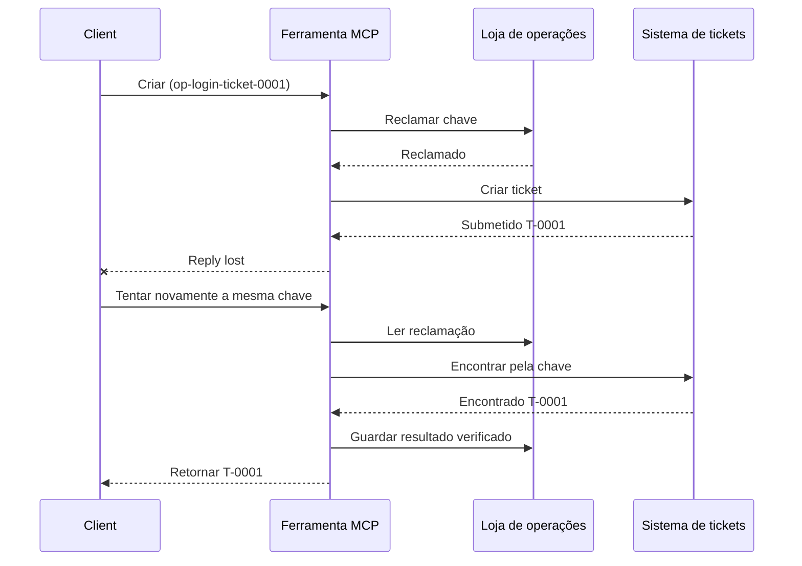
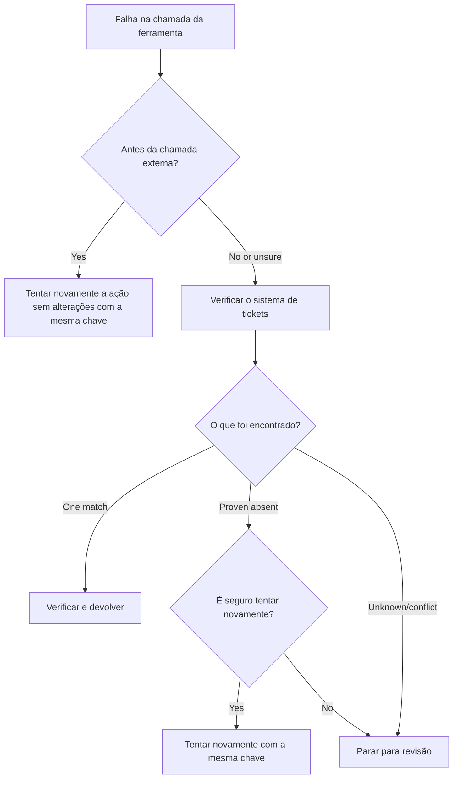

# Repetições Seguras para Ferramentas MCP: Um Padrão Sidecar de Confiabilidade

Uma resposta em falta não significa que a ação está em falta. Uma ferramenta de
suporte pode criar o ticket `T-0001` e depois perder a ligação antes do cliente ver
o resultado. Se o cliente tentar novamente cegamente, poderá criar o `T-0002`.

Esta lição mostra como reconhecer esse resultado incerto, manter uma identidade
estável para a ação pretendida e consultar o sistema de tickets antes de tentar
novamente. O exercício Python acompanhante executa localmente com a biblioteca
padrão e SQLite.

## Porque o Timeout Significa "Resultado Desconhecido"

Suponha que o cliente chama `create_support_ticket` com a chave de operação
`op-login-ticket-0001`:



A ligação falha depois de o ticket ser registado mas antes do resultado chegar.
O cliente sabe apenas que a resposta falta. Não sabe se o ticket está em falta.
Reutilizar a chave de operação permite à ferramenta encontrar e devolver
`T-0001` em vez de criar `T-0002`.

## O Que Faz um Sidecar de Confiabilidade

Um sidecar de confiabilidade é um código de aplicação que mantém o estado de recuperação
em redor de uma ferramenta. Pode ser uma biblioteca, middleware, um serviço suportado
por base de dados, ou simplesmente parte da implementação da ferramenta. Não tem de
ser um processo separado, e não é uma funcionalidade do protocolo MCP.

O sidecar tem quatro funções:

1. guardar a ação pretendida antes de chamar o sistema externo;
2. permitir que apenas um trabalhador reivindique essa ação;
3. memorizar estado suficiente para recuperar após um crash; e
4. verificar o sistema externo quando o resultado é incerto.

Esta lição aponta para a especificação MCP final `2026-07-28`. MCP não tem
sessão a nível de protocolo, por isso a chave da operação é um argumento comum da ferramenta,
suportado por estado duradouro da aplicação. O mesmo padrão também funciona com versões
anteriores do MCP.

## Quatro IDs Que Resolvem Problemas Diferentes

Estes identificadores estão relacionados, mas não são intercambiáveis:

| Identificador | O que identifica | Sobrevive a uma repetição? |
| --- | --- | --- |
| ID JSON-RPC | Um pedido e resposta | Não; use um novo ID de pedido |
| ID de Tarefa MCP | Uma tarefa longa | Sim; mantenha-o para polling |
| Chave da operação | Uma ação pretendida | Sim; reutilize-a para essa ação |
| ID de Ticket | O resultado guardado | Sim; devolva-o após verificação |

Notificações de progresso e contexto de rastreio ajudam a observar um pedido.
Cancelamento pede para parar o trabalho. Nenhum deles previne um ticket duplicado.

## Construa o Guardião

Crie a chave da operação antes da primeira chamada da ferramenta e guarde-a com o
workflow. Cada tentativa de criar o mesmo ticket pretendido usa a mesma chave:

```json
{
  "operation_key": "op-login-ticket-0001",
  "title": "Cannot sign in"
}
```

Um ticket pretendido diferente obtém uma nova chave. Em produção, gere um valor
opaco, impossível de adivinhar, em vez de colocar dados do cliente na chave.

Aqui está o esquema completo da ferramenta MCP usado nesta lição:

```json
{
  "name": "create_support_ticket",
  "title": "Create support ticket",
  "description": "Creates or recovers one support ticket for an operation key.",
  "inputSchema": {
    "$schema": "https://json-schema.org/draft/2020-12/schema",
    "type": "object",
    "properties": {
      "operation_key": {
        "type": "string",
        "minLength": 16,
        "maxLength": 128,
        "description": "Stable key reused for the same intended action."
      },
      "title": {
        "type": "string",
        "minLength": 1,
        "maxLength": 200
      }
    },
    "required": ["operation_key", "title"],
    "additionalProperties": false
  },
  "outputSchema": {
    "$schema": "https://json-schema.org/draft/2020-12/schema",
    "type": "object",
    "properties": {
      "ticket_id": {
        "type": "string"
      },
      "operation_key": {
        "type": "string"
      },
      "status": {
        "type": "string",
        "const": "verified"
      }
    },
    "required": ["ticket_id", "operation_key", "status"],
    "additionalProperties": false
  }
}
```

A identidade do chamador autenticado vem do contexto do servidor, não da
entrada do modelo fornecida à ferramenta. Delimite cada operação guardada para:

- esse chamador, inquilino ou conta de serviço;
- o nome e versão da ferramenta; e
- um hash das entradas normalizadas que definem a ação externa.

O hash da entrada responde a uma pergunta simples: "Esta repetição está a pedir o mesmo
ticket?" Se a chave já pertencer a um título diferente, rejeite a chamada.

Retornar um resultado anterior para uma entrada alterada esconderia um erro de contrato.

Guarde a reclamação com uma operação atómica na base de dados. "Atómica" significa que dois trabalhadores
não podem ambos observar um registo vazio e ambos se tornarem proprietários. Um bloqueio local ao processo
não é suficiente quando outra instância de servidor pode receber a repetição.

O fluxo de trabalho cria a chave enquanto a ação está `planeada`. O exemplo depois
persiste estes estados:

- `reclamado`: um trabalhador reservou a operação;
- `concluído`: o sistema de bilhetes retornou um resultado; e
- `verificado`: uma leitura ao sistema de bilhetes confirma o resultado.

Uma falha pode deixar o estado armazenado em `reclamado` mesmo depois do bilhete ter sido
criado. Considere toda reclamação não terminal como incerta até que prova externa
a confirme. Não presuma que `reclamado` significa "nada aconteceu."

## Recupere Antes de Repetir

Quando uma chamada de ferramenta falha, decida o que se sabe antes de enviar outra
gravação externa:



Validação que falha antes de a API do bilhete ser chamada é uma falha conhecida.
Repita uma ação não alterada com a mesma chave de operação. Se corrigir a entrada
mudar o bilhete pretendido, crie uma nova chave para essa nova ação.

Se o pedido pode ter chegado ao sistema de bilhetes, reconcilie-o primeiro.
Reconciliação significa comparar a reclamação guardada com o registo de bilhete autoritário.
Retorne o bilhete existente quando exatamente um registo correspondente for encontrado.
Repita somente quando o bilhete estiver conclusivamente ausente e o contrato descendente
tornar uma outra tentativa segura.

"Não encontrado" nem sempre é conclusivo. Um fornecedor com pesquisa eventual consistente
pode necessitar de uma espera limitada e outra verificação. Se o sistema não puder ser
pesquisado, der resultados conflitantes, ou não puder eliminar duplicações em segurança de outra
tentativa, pare e reporte `resultado desconhecido`. Parar aqui é por vezes chamado
"falhar fechado": o fluxo de trabalho recusa adivinhar.

## Evidência, Tarefas e Cancelamento

Uma resposta da ferramenta diz o que a ferramenta reportou. Um ponto de verificação armazenado diz o que o
fluxo de trabalho registou. A evidência mais forte vem do sistema que detém o
resultado: para este exemplo, uma leitura ao sistema de bilhetes que encontra exatamente um
bilhete correspondente.

Combine a evidência com o risco. Um ID de mensagem do fornecedor pode ser suficiente para uma
notificação de baixo risco. Pagamentos, implementações e ações destrutivas podem
necessitar de estado do fornecedor, livro-razão, ou revisão manual como evidência.

A extensão MCP Tarefas complementa este padrão para trabalho de longa duração. Um ID
de Tarefa permite ao cliente retomar a interrogação após uma desconexão, mas não identifica
nem elimina duplicações do bilhete em si. Quando Tarefas é usado, as identidades conectam-se
assim:

```text
operation key -> Task ID -> ticket ID -> verification evidence
```

Cancelamento é cooperativo, não um rollback. O bilhete pode ainda ser criado
depois do cancelamento ser reconhecido, portanto um resultado incerto ainda necessita de
reconciliação.

## Execute o Exercício de Injeção de Falhas

O exemplo usa dois ficheiros SQLite: um representa o armazém de operações e o
outro representa o sistema de bilhetes externo. Não há transação que abranja
ambos os ficheiros. A falha é injetada após o commit do bilhete mas antes do
sidecar registar a conclusão.

O método Python direto aceita `caller_id` como substituto para contexto de servidor autenticado.
Não adicione `caller_id` ao esquema de entrada MCP controlado pelo modelo.


Preveja o resultado antes de executar os testes:

| Caminho | Resultado após repetição | Contagem de bilhetes |
| --- | --- | --- |
| Repetição cega | Cria `T-0002` depois de perder a resposta para `T-0001` | 2 |

| Retentativa protegida | Encontra e retorna `T-0001` | 1 |

Execute:

```bash
cd 08-BestPractices/reliability-sidecars/python
python -m unittest discover -p "test_*.py" -v
```

Os seis testes mostram que:

1. uma retentativa cega cria um duplicado;
2. perda de resposta mais uma reinicialização recupera um bilhete de uma reclamação durável;
3. uma retentativa verificada reutiliza o resultado guardado;
4. entrada alterada ou prova externa conflitante é rejeitada;
5. uma reclamação existente sem prova externa para por um fim seguro; e
6. reclamações concorrentes admitem um único proprietário sem regredir um resultado verificado.

Abra o exemplo:

- [Implementação em Python](../../../../08-BestPractices/reliability-sidecars/python/reliability_sidecar.py)
- [Testes determinísticos](../../../../08-BestPractices/reliability-sidecars/python/test_reliability_sidecar.py)

O exemplo omite intencionalmente arrendamentos de reclamações obsoletas. Uma política de
tomada de controlo de produção precisa de um arrendamento limitado, transferência
atómica de propriedade, e outra verificação externa antes de executar.

## Implementação Comunitária Opcional

Agent Enhancer Utilities é uma implementação comunitária deste padrão a nível de aplicação.
O seu planner seleciona uma abordagem de recuperação, enquanto seu checkpoint regista
estados de reclamação e resultados incertos. A ferramenta de domínio ou servidor MCP
ainda executa e verifica a ação real. Este serviço não faz parte da especificação MCP
e não é obrigatório para esta lição.

| Conceito da lição | Parte do Agent Enhancer | Limite importante |
| --- | --- | --- |
| Plano de recuperação | `workflow-guard-planner` | Não chama a ferramenta de domínio |
| Reclamação e recuperação | `workflow-checkpoint` | `external_proof` permanece `false` |
| Repetição exata do sidecar | `lab.invoke_tool` | Usa uma chave de idempotência separada |
| Verificar a ação real | Pesquisa/leitura de destino | MCP de Domínio detém isso |

Para uma retentativa exata de uma chamada sidecar, `lab.invoke_tool` aceita uma
`idempotency_key` externa. Essa chave identifica a invocação do sidecar; não é a
`operation_key` de negócio usada para o bilhete.

O contrato público marcado e um exemplo opcional em rede estão disponíveis
aqui:

- [Contrato Reliability Sidecar v1](https://github.com/artiehinz/Agent-Enhancer-Utilities/blob/v1.6.0/docs/RELIABILITY_SIDECAR_CONTRACT_V1.md)
- [Exemplo de planner e domínio simulado](https://github.com/artiehinz/Agent-Enhancer-Utilities/tree/v1.6.0/examples/reliability-sidecar)

Estes links ilustram o padrão de aplicação. Não afirmam que o serviço hospedado
está em conformidade com o MCP `2026-07-28`, e o estado do checkpoint nunca conta
como prova externa do bilhete.

## Lista de Verificação para Produção

- [ ] Criar e guardar a chave da operação antes da primeira tentativa externa.
- [ ] Associar a chave ao chamador, versão da ferramenta e hash normalizado da entrada.
- [ ] Rejeitar entrada alterada em chave existente.
- [ ] Admitir um proprietário com uma operação atómica na loja partilhada.
- [ ] Encaminhar a chave ao fornecedor a jusante quando suporta idempotência.
- [ ] Conciliar resultados incertos antes de outra escrita.
- [ ] Manter resultados e provas verificadas durante toda a janela de retentativa.
- [ ] Parar para revisão quando o resultado externo não puder ser estabelecido de forma segura.

## Referências

- [Especificação MCP `2026-07-28`](https://modelcontextprotocol.io/specification/2026-07-28)
- [Orientação da ferramenta MCP `2026-07-28`](https://modelcontextprotocol.io/specification/2026-07-28/server/tools)
- [Extensão de Tarefas MCP](https://modelcontextprotocol.io/extensions/tasks/overview)
- [Especificação JSON-RPC 2.0](https://www.jsonrpc.org/specification)

---

<!-- CO-OP TRANSLATOR DISCLAIMER START -->
**Aviso Legal**:
Este documento foi traduzido utilizando o serviço de tradução automática [Co-op Translator](https://github.com/Azure/co-op-translator). Embora nos esforcemos pela precisão, esteja ciente de que traduções automáticas podem conter erros ou imprecisões. O documento original na sua língua nativa deve ser considerado a fonte autorizada. Para informações críticas, recomenda-se tradução profissional humana. Não nos responsabilizamos por quaisquer mal-entendidos ou interpretações incorretas resultantes da utilização desta tradução.
<!-- CO-OP TRANSLATOR DISCLAIMER END -->