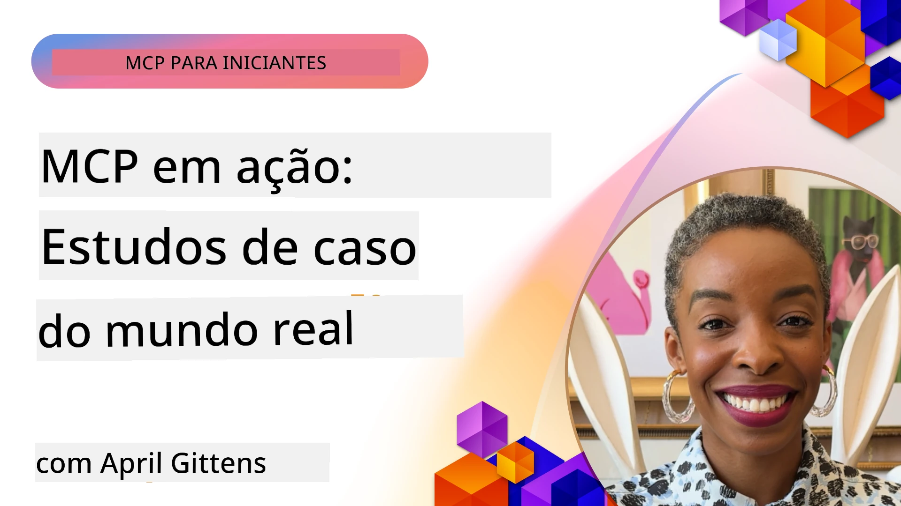

# MCP em Ação: Estudos de Caso do Mundo Real

_(Clique na imagem acima para ver o vídeo desta lição)_

O Protocolo de Contexto do Modelo (MCP) está a transformar a forma como as aplicações de IA interagem com dados, ferramentas e serviços. Esta secção apresenta estudos de caso do mundo real que demonstram aplicações práticas do MCP em vários cenários empresariais.

## Visão Geral

Esta secção mostra exemplos concretos de implementações de MCP, destacando como as organizações estão a aproveitar este protocolo para resolver desafios empresariais complexos. Ao examinar estes estudos de caso, obterá insights sobre a versatilidade, escalabilidade e benefícios práticos do MCP em cenários do mundo real.

## Objetivos de Aprendizagem Principais

Ao explorar estes estudos de caso, irá:

- Compreender como o MCP pode ser aplicado para resolver problemas empresariais específicos
- Aprender sobre diferentes padrões de integração e abordagens arquitetónicas
- Reconhecer as melhores práticas para implementar o MCP em ambientes empresariais
- Obter insights sobre os desafios e soluções encontrados em implementações do mundo real
- Identificar oportunidades para aplicar padrões semelhantes nos seus próprios projetos

## Estudos de Caso em Destaque

### 1. [Agentes de Viagens Azure AI – Implementação de Referência](./travelagentsample.md)

Este estudo de caso examina a solução de referência abrangente da Microsoft que demonstra como construir uma aplicação de planeamento de viagens com múltiplos agentes e AI, usando MCP, Azure OpenAI e Azure AI Search. O projeto mostra:

- Orquestração de múltiplos agentes através do MCP
- Integração de dados empresariais com Azure AI Search
- Arquitetura segura e escalável usando serviços Azure
- Ferramentas extensíveis com componentes MCP reutilizáveis
- Experiência de utilizador conversacional alimentada pelo Azure OpenAI

A arquitetura e os detalhes de implementação fornecem insights valiosos para construir sistemas complexos com múltiplos agentes com o MCP como camada de coordenação.

### 2. [Atualizar Itens do Azure DevOps a partir de Dados do YouTube](./UpdateADOItemsFromYT.md)

Este estudo de caso demonstra uma aplicação prática do MCP para automatizar processos de fluxo de trabalho. Mostra como as ferramentas MCP podem ser usadas para:

- Extrair dados de plataformas online (YouTube)
- Atualizar itens de trabalho em sistemas Azure DevOps
- Criar fluxos de trabalho de automação repetíveis
- Integrar dados através de sistemas dispares

Este exemplo ilustra como mesmo implementações relativamente simples do MCP podem proporcionar ganhos significativos de eficiência ao automatizar tarefas rotineiras e melhorar a consistência dos dados entre sistemas.

### 3. [Recuperação de Documentação em Tempo Real com MCP](./docs-mcp/README.md)

Este estudo de caso orienta-o a conectar um cliente de consola Python a um servidor do Protocolo de Contexto do Modelo (MCP) para recuperar e registar documentação Microsoft em tempo real e contextualizada. Aprenderá a:

- Ligar-se a um servidor MCP usando um cliente Python e o SDK oficial MCP
- Usar clientes HTTP em streaming para uma recuperação eficiente e em tempo real dos dados
- Chamar ferramentas de documentação no servidor e registar respostas diretamente na consola
- Integrar documentação Microsoft atualizada no seu fluxo de trabalho sem sair do terminal

O capítulo inclui um exercício prático, um exemplo mínimo de código funcional e ligações para recursos adicionais para aprendizagem aprofundada. Veja o passo a passo completo e o código no capítulo vinculado para entender como o MCP pode transformar o acesso à documentação e a produtividade dos desenvolvedores em ambientes baseados em consola.

### 4. [Aplicação Web Geradora de Plano de Estudo Interativo com MCP](./docs-mcp/README.md)

Este estudo de caso demonstra como construir uma aplicação web interativa usando Chainlit e o Protocolo de Contexto do Modelo (MCP) para gerar planos de estudo personalizados para qualquer tópico. Os utilizadores podem especificar uma matéria (como "certificação AI-900") e a duração do estudo (por exemplo, 8 semanas), e a aplicação fornecerá uma decomposição semana a semana do conteúdo recomendado. O Chainlit permite uma interface de chat conversacional, tornando a experiência envolvente e adaptativa.

- Aplicação web conversacional alimentada pelo Chainlit
- Pedidos feitos pelo utilizador para tópico e duração
- Recomendações de conteúdo semana a semana usando MCP
- Respostas adaptativas e em tempo real numa interface de chat

O projeto ilustra como a IA conversacional e o MCP podem ser combinados para criar ferramentas educacionais dinâmicas e orientadas pelos utilizadores num ambiente web moderno.

### 5. [Documentação no Editor com Servidor MCP no VS Code](./docs-mcp/README.md)

Este estudo de caso demonstra como pode trazer a documentação Microsoft Learn diretamente para o seu ambiente VS Code usando o servidor MCP—sem precisar alternar entre separadores do navegador! Verá como:

- Pesquisar e ler documentação instantaneamente dentro do VS Code usando o painel MCP ou a paleta de comandos
- Referenciar documentação e inserir links diretamente em ficheiros README ou documentos markdown de cursos
- Usar GitHub Copilot e MCP juntos para fluxos de trabalho de documentação e código alimentados por IA de forma contínua
- Validar e melhorar a sua documentação com feedback em tempo real e precisão fornecida pela Microsoft
- Integrar o MCP com fluxos de trabalho GitHub para validação contínua da documentação

A implementação inclui:

- Exemplo de configuração `.vscode/mcp.json` para fácil instalação
- Guias passo a passo baseados em capturas de ecrã da experiência no editor
- Sugestões para combinar o Copilot e o MCP para máxima produtividade

Este cenário é ideal para autores de cursos, escritores de documentação e desenvolvedores que querem manter o foco no editor enquanto trabalham com documentação, Copilot e ferramentas de validação—tudo alimentado pelo MCP.

### 6. [Criação de Servidor MCP no APIM](./apimsample.md)

Este estudo de caso fornece um guia passo a passo sobre como criar um servidor MCP usando o Azure API Management (APIM). Cobre:

- Configurar um servidor MCP no Azure API Management
- Expor operações de API como ferramentas MCP
- Configurar políticas para limitação de taxa e segurança
- Testar o servidor MCP usando Visual Studio Code e GitHub Copilot

Este exemplo ilustra como aproveitar as capacidades Azure para criar um servidor MCP robusto que pode ser usado em várias aplicações, melhorando a integração dos sistemas IA com APIs empresariais.

### 7. [Registo MCP do GitHub — Acelerando a Integração Agentica](https://github.com/mcp)

Este estudo de caso examina como o Registo MCP do GitHub, lançado em setembro de 2025, resolve um desafio crítico no ecossistema de IA: a descoberta e implementação fragmentada de servidores do Protocolo de Contexto do Modelo (MCP).

#### Visão Geral
O **Registo MCP** resolve a dor crescente de servidores MCP espalhados por repositórios e registos, tornando anteriormente a integração lenta e propensa a erros. Estes servidores permitem que agentes IA interajam com sistemas externos como APIs, bases de dados e fontes de documentação.

#### Declaração do Problema
Os desenvolvedores que constroem fluxos agenticos enfrentavam vários desafios:
- **Má descoberta** de servidores MCP entre plataformas diferentes
- **Questões redundantes de configuração** espalhadas por fóruns e documentação
- **Riscos de segurança** provenientes de fontes não verificadas e não confiáveis
- **Falta de padronização** na qualidade e compatibilidade dos servidores

#### Arquitetura da Solução
O Registo MCP do GitHub centraliza servidores MCP confiáveis com características principais:
- **Instalação com um clique** via VS Code para configuração simplificada
- **Ordenação sinal-ruído** por estrelas, atividade e validação comunitária
- **Integração direta** com GitHub Copilot e outras ferramentas compatíveis MCP
- **Modelo aberto de contribuição** permitindo participação tanto da comunidade como parceiros empresariais

#### Impacto Empresarial
O registo proporcionou melhorias mensuráveis:
- **Integração mais rápida** para desenvolvedores ao usar ferramentas como o Servidor MCP Microsoft Learn, que transmite documentação oficial diretamente aos agentes
- **Produtividade melhorada** via servidores especializados como o `github-mcp-server`, que permite automação GitHub em linguagem natural (criação de PR, reexecução de CI, escaneamento de código)
- **Maior confiança no ecossistema** através de listagens curadas e padrões de configuração transparentes

#### Valor Estratégico
Para profissionais especializados em gestão do ciclo de vida de agentes e fluxos de trabalho reprodutíveis, o Registo MCP oferece:
- **Capacidades modulares de implementação de agentes** com componentes padronizados
- **Pipelines de avaliação suportados pelo registo** para testes e validação consistentes
- **Interoperabilidade entre ferramentas** que permite integração fluida entre plataformas IA diferentes

Este estudo de caso demonstra que o Registo MCP é mais do que um diretório—é uma plataforma fundamental para integração de modelos em escala e implementação de sistemas agenticos no mundo real.

### 8. [Publicação em Redes Sociais a partir de um Agente](./publora-social-publishing.md)

Este estudo de caso percorre um **servidor MCP remoto com capacidade de escrita** — cujas ferramentas fazem ações irreversíveis em nome do utilizador — usando publicação social como o exemplo prático. Um agente redige uma publicação, um humano aprova e o servidor agenda a publicação nas redes.

A parte interessante são as restrições de design que a publicação impõe, aplicáveis a qualquer servidor que escreve em vez de ler:

- **Descoberta aberta, execução autenticada** — `tools/list` responde sem credenciais para que registos e clientes possam introspectar, enquanto cada `tools/call` requer um token e caso contrário retorna `401` com um cabeçalho `WWW-Authenticate`
- **Registo OAuth sem passo fora da banda** — registo dinâmico de cliente hoje, com Documentos de Metadados de ID de Cliente na direção da especificação `2026-07-28`
- **Anotações de ferramentas** (`readOnlyHint`, `destructiveHint`, `idempotentHint`) que clientes usam para decidir o que confirmar — pistas em vez de imposição, e algo que diretórios de conectores agora esperam na revisão
- **Identificadores não inventáveis**, para que um valor alucinado falhe ruidosamente em vez de agir sobre um valor plausível
- **Chaves de idempotência nas ferramentas que criam publicação**, para que uma nova tentativa de runtime do agente não resulte em publicação duplicada
- **Um alvo no-op descrito no esquema da ferramenta** que percorre todo o caminho de escrita sem publicar nada, para revisores e CI

O capítulo termina com uma pequena lista de verificação que pode aplicar a um servidor que está a construir.

## Conclusão

Estes oito estudos de caso abrangentes demonstram a notável versatilidade e aplicações práticas do Protocolo de Contexto do Modelo em diversos cenários do mundo real. Desde sistemas complexos de planeamento de viagens com múltiplos agentes e gestão de API empresariais até fluxos de trabalho de documentação simplificados e o revolucionário Registo MCP do GitHub, estes exemplos mostram como o MCP fornece uma forma padronizada e escalável para conectar sistemas de IA com as ferramentas, dados e serviços necessários para entregar valor excecional.

Os estudos de caso abrangem múltiplas dimensões da implementação MCP:
- **Integração Empresarial**: Gestão de API Azure e automatização Azure DevOps
- **Orquestração Multi-Agente**: Planeamento de viagens com agentes IA coordenados
- **Produtividade do Desenvolvedor**: Integração VS Code e acesso à documentação em tempo real
- **Desenvolvimento do Ecossistema**: Registo MCP do GitHub como plataforma fundamental
- **Aplicações Educacionais**: Geradores de planos de estudo interativos e interfaces conversacionais

Ao estudar estas implementações, ganha insights cruciais sobre:
- **Padrões arquitetónicos** para diferentes escalas e casos de uso
- **Estratégias de implementação** que equilibram funcionalidade com manutenção
- **Considerações de segurança e escalabilidade** para implementações de produção
- **Melhores práticas** para desenvolvimento de servidores MCP e integração de clientes
- **Pensamento de ecossistema** para construir soluções IA interligadas e potenciadas por IA

Estes exemplos demonstram em conjunto que o MCP não é apenas um quadro teórico mas sim um protocolo maduro, pronto para produção, que possibilita soluções práticas para desafios empresariais complexos. Quer esteja a construir ferramentas de automação simples ou sistemas multi-agente sofisticados, os padrões e abordagens aqui ilustrados fornecem uma base sólida para os seus próprios projetos MCP.

## Recursos Adicionais

- [Repositório GitHub Azure AI Travel Agents](https://github.com/Azure-Samples/azure-ai-travel-agents)
- [Ferramenta MCP Azure DevOps](https://github.com/microsoft/azure-devops-mcp)
- [Ferramenta MCP Playwright](https://github.com/microsoft/playwright-mcp)
- [Servidor MCP Microsoft Docs](https://github.com/MicrosoftDocs/mcp)
- [Registo MCP GitHub — Acelerando a Integração Agentica](https://github.com/mcp)
- [Exemplos da Comunidade MCP](https://github.com/microsoft/mcp)

## O Que Segue

- Anterior: [Módulo 8: Melhores Práticas](../08-BestPractices/README.md)
- Seguinte: [Módulo 10: Otimizando Fluxos de Trabalho de IA: Construindo um Servidor MCP com AI Toolkit](../10-StreamliningAIWorkflowsBuildingAnMCPServerWithAIToolkit/README.md)

---

<!-- CO-OP TRANSLATOR DISCLAIMER START -->
**Aviso Legal**:
Este documento foi traduzido utilizando o serviço de tradução automática [Co-op Translator](https://github.com/Azure/co-op-translator). Embora nos esforcemos pela precisão, esteja ciente de que traduções automáticas podem conter erros ou imprecisões. O documento original na sua língua nativa deve ser considerado a fonte autorizada. Para informações críticas, recomenda-se tradução profissional humana. Não nos responsabilizamos por quaisquer mal-entendidos ou interpretações incorretas resultantes da utilização desta tradução.
<!-- CO-OP TRANSLATOR DISCLAIMER END -->