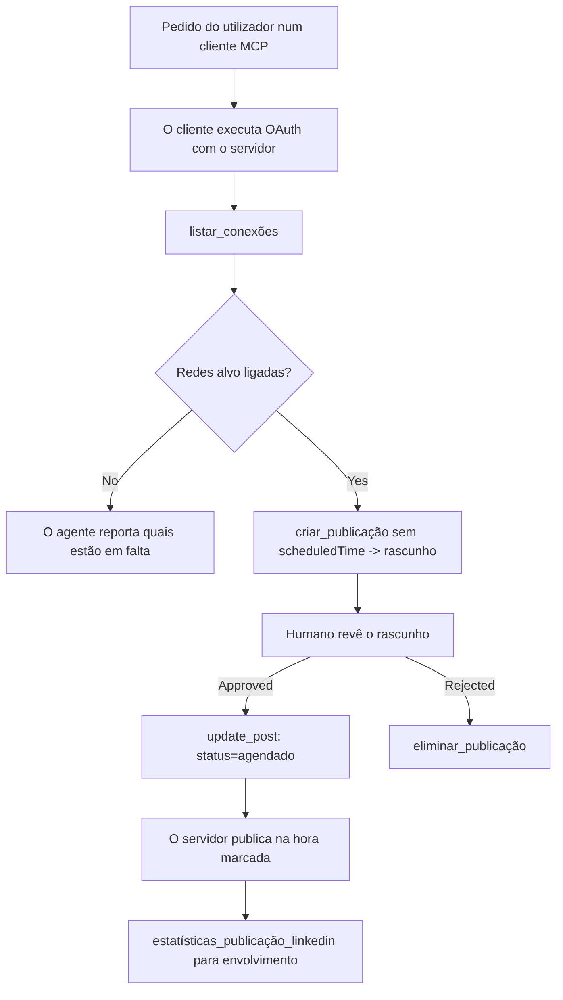

# Estudo de Caso: Publicação em Redes Sociais a partir de um Agente com um Servidor MCP Remoto

> **Aviso:** Vários serviços e projetos open-source podem publicar em redes sociais, e uma equipa também poderia integrar diretamente a API de cada rede. O cenário abaixo é apresentado como um exemplo prático de como um **servidor MCP remoto com capacidade de escrita** pode ser desenhado e consumido. Publora é um serviço comercial com um plano gratuito; os padrões descritos aqui aplicam-se a qualquer servidor MCP que execute ações irreversíveis em nome do utilizador.

## Visão Geral

Os agentes são bons a redigir conteúdo e maus a entregá-lo. Um modelo pode escrever um anúncio de lançamento em segundos, e depois o trabalho para: publicar significa uma API por rede, uma app OAuth por rede, e um conjunto diferente de regras de meios por cada uma. A maioria das equipas resolve isto copiando o texto manualmente para um browser.

Este estudo de caso examina como essa última etapa é fechada com um único servidor MCP remoto e — mais útil para quem estiver a construir um — as decisões de design que um servidor **com capacidade de escrita** tem de acertar. Ler dados é tolerante. Publicar não é: um comando errado é visível para o público e não pode ser desfeito.

## Cenário

Uma pequena equipa de relações com desenvolvedores redige publicações dentro de um agente (Claude, VS Code, Cursor — o cliente não importa). Querem que o agente:

- veja quais contas sociais a equipa tem ligadas,
- redija uma publicação e a mantenha como rascunho para aprovação humana,
- anexe uma imagem,
- agende-a para várias redes numa hora escolhida,
- e posteriormente reporte o seu desempenho.

Crucialmente, querem que o agente seja *incapaz* de publicar acidentalmente enquanto ainda estão a experimentar.

## Ferramentas Utilizadas

- [Publora MCP Server](https://github.com/publora/mcp-server) — um servidor MCP remoto (`streamable-http`) que expõe ferramentas para publicação, agendamento, media e análises LinkedIn. Registado no registo oficial MCP como `com.publora/mcp-server`.

## Fluxo de Trabalho Passo a Passo

1. **Ligar o servidor.** Clientes que usam OAuth completam o fluxo de código de autorização com PKCE através do ecrã de consentimento do servidor; clientes que não usam, como CLIs headless, usam uma chave API Publora num cabeçalho. Ambos os caminhos são suportados, e qual deles obtém depende do cliente, não do servidor.
2. **Listar ligações.** O agente chama `list_connections` e recebe as contas ligadas com os seus identificadores.
3. **Redigir.** O agente chama `create_post` *sem* hora agendada. A publicação fica guardada como rascunho — nada é publicado.
4. **Anexar media.** URLs de imagens públicas são passados na mesma chamada; o servidor descarrega e valida-os.
5. **Agendar.** Após aprovação humana, `update_post` define o estado para agendado com um horário ISO 8601.
6. **Medir.** Para LinkedIn, `linkedin_post_stats` retorna o envolvimento assim que a publicação está ativa.

## Exemplo de Prompt

```text
Which social accounts do I have connected?
Draft a post announcing our new changelog page, attach the screenshot at
https://example.com/changelog.png, and keep it as a draft — do not publish it.
Once I approve, schedule it to LinkedIn and Bluesky for tomorrow at 09:00 UTC.
```

## Diagrama de Fluxo Mermaid



## Implementação Técnica

As lições abaixo são a parte transferível deste estudo de caso.

### Descoberta aberta, execução autenticada

`tools/list` é servido sem credenciais; cada `tools/call` exige um token e caso contrário devolve `401` com um cabeçalho `WWW-Authenticate` apontando para o metadado do recurso protegido. (O servidor também responde a um `initialize` não autenticado, que importa apenas para clientes em versões de protocolo anteriores a `2026-07-28`; essa revisão removeu totalmente o handshake.)

Esta separação importa na prática. Registos, catálogos e clientes podem introspeccionar as ferramentas — nomes, esquemas, anotações — sem necessitar de segredo, enquanto nada pode ser *executado* anonimamente. Um servidor que exige token para `initialize` é efetivamente invisível para as ferramentas; um servidor que permite `tools/call` anónimo é uma responsabilidade.

### Registo: registo dinâmico de clientes, e o que o substitui

O servidor anuncia `/.well-known/oauth-protected-resource` e `/.well-known/oauth-authorization-server`, e suporta o fluxo de código de autorização com PKCE (`S256`), refresh tokens, e **registo dinâmico de clientes**.

O registo dinâmico elimina o passo manual: sem ele, cada cliente precisa de um `client_id` pré-emitido, o que implica um pedido fora de banda ao fornecedor para cada novo cliente.

Trate isto como comportamento de compatibilidade e não como o design a copiar. A revisão `2026-07-28` da especificação desaconselha o registo dinâmico de clientes em favor dos Documentos de Metadados de Client ID, onde o cliente hospeda um documento de metadados num URL HTTPS estável e esse URL *é* o `client_id`. DCR continua a funcionar por agora, mas um servidor a ser construído hoje deve planear para CIMD e manter o DCR apenas para clientes antigos.

### Anotações das ferramentas não são decoração

Cada ferramenta transporta um `title` e os avisos aplicáveis: `readOnlyHint`, `destructiveHint`, `idempotentHint`, `openWorldHint`.

Duas razões para investir neles. Primeiro, os clientes usam os avisos para decidir o que confirmar com o utilizador — um cliente pode executar automaticamente uma consulta de leitura e parar para aprovação antes da eliminação. A especificação é explícita que as anotações são avisos não confiáveis, não um mecanismo de autorização: moldam o que um cliente oferece fazer, não impedem nada no servidor, e um servidor deve aplicar sempre as suas próprias regras. Segundo, os maiores diretórios de conectores agora *exigem* estes para revisão; um servidor cujas ferramentas carecem de títulos e avisos será rejeitado independentemente da sua funcionalidade.

### Faça os identificadores invenções impossíveis

Os identificadores da plataforma são strings opacas devolvidas por `list_connections`, e a descrição do esquema diz explicitamente que devem ser copiados literalmente e nunca adivinhados. O servidor rejeita qualquer outro valor.

Os modelos são adivinhadores fluidos. Qualquer servidor com capacidade de escrita deve assumir que um identificador será eventualmente fabricado e fazer esse caminho falhar ruidosamente e cedo, em vez de agir sobre um valor plausível.

### Falhe antes de publicar, com uma mensagem acionável

Algumas redes recusam publicações só com texto e requerem uma imagem ou vídeo. Isso é validado quando a publicação é agendada, e o erro nomeia a plataforma e o requisito em falta.

Um agente pode recuperar de "Instagram requer media — anexe uma imagem ou vídeo" sem ida e volta. Não pode recuperar de um `400` genérico.

### Torne as tentativas seguras

As duas ferramentas que criam conteúdo, `create_post` e `update_post`, aceitam uma chave de idempotência: reutilizá-la com um pedido idêntico reproduz a resposta original em vez de criar uma segunda publicação. Ambientes de execução de agentes tentam novamente em tempos de timeout; sem idempotência, uma resposta lenta torna-se uma publicação duplicada. As outras ferramentas de escrita — eliminações, passos de media, reações e comentários LinkedIn — não aceitam esta chave, pelo que tentar novamente não é automaticamente seguro. É útil saber quais das suas mutações são protegidas e quais não.

### Providencie uma forma de testar que nada publica

O servidor aceita um destino reservado, `publora-playground`, que é validado e reconhecido como um destino real e depois descartado — nada chega a uma conta real. Está descrito no próprio esquema da ferramenta, que qualquer cliente pode ler sem credenciais: o campo `platforms` de `create_post` documenta-o como "um destino de teste de ligação que não requer ligação real — a publicação é acreditada e descartada, nada é publicado". Use passando-o como única entrada: `platforms: ["publora-playground"]`.

Isto revelou-se um dos detalhes mais úteis de toda a superfície. Revisores de diretórios de conectores, colaboradores e CI podem exercitar o caminho completo da escrita do início ao fim sem risco para um público real. Qualquer servidor MCP com ações irreversíveis beneficia com um destino no-op documentado.

## Resultados e Impacto

- A etapa de publicação mudou de um browser para a mesma conversa onde o conteúdo é escrito, e o hábito do rascunho primeiro mantém um humano no circuito. Seja preciso sobre o que isso é: um rascunho é uma convenção, não um limite. A mesma credencial pode agendar ou publicar, pelo que quem precisa de um portão real de aprovação tem de o aplicar fora da superfície da ferramenta — credenciais separadas, ou uma camada de política à frente do servidor.
- Diferenças por rede — requisitos de media, encadeamentos, controlos de resposta — são tratados uma vez no servidor em vez de em cada agente que com ele comunica.
- O mesmo servidor suporta vários clientes MCP sem trabalho por cliente, porque o descobrimento é aberto e o registo é dinâmico.
- As restrições de design acima foram moldadas tanto por revisões de diretórios de conectores como por utilizadores: anotações, OAuth e um destino de teste seguro foram cada um exigidos por pelo menos um deles.

## Referências

- [Publora MCP Server (código fonte)](https://github.com/publora/mcp-server)
- [Documentação de API e MCP Publora](https://docs.publora.com)
- [Entrada no Registo MCP: `com.publora/mcp-server`](https://registry.modelcontextprotocol.io/v0/servers?search=com.publora/mcp-server)
- [Especificação MCP — Autorização](https://modelcontextprotocol.io/specification/draft/basic/authorization)
- [Especificação MCP — Anotações das ferramentas](https://modelcontextprotocol.io/docs/concepts/tools)

## Próximos Passos

- Pegue num servidor MCP que está a construir e verifique as três melhorias mais fáceis aqui: anotações em cada ferramenta, uma chave de idempotência em cada escrita, e um destino no-op documentado.
- Experimente a separação descoberta aberta: chame `tools/list` num servidor remoto público sem credenciais, depois chame uma ferramenta e inspecione o desafio `401`.
- Considere o que "desfazer" significa para o seu domínio. A publicação tem rascunhos e eliminação; se as suas ações não têm equivalente, a confirmação pertence ao design da ferramenta, não ao prompt.

---

<!-- CO-OP TRANSLATOR DISCLAIMER START -->
**Aviso Legal**:
Este documento foi traduzido utilizando o serviço de tradução automática [Co-op Translator](https://github.com/Azure/co-op-translator). Embora nos esforcemos pela precisão, esteja ciente de que traduções automáticas podem conter erros ou imprecisões. O documento original na sua língua nativa deve ser considerado a fonte autorizada. Para informações críticas, recomenda-se tradução profissional humana. Não nos responsabilizamos por quaisquer mal-entendidos ou interpretações incorretas resultantes da utilização desta tradução.
<!-- CO-OP TRANSLATOR DISCLAIMER END -->