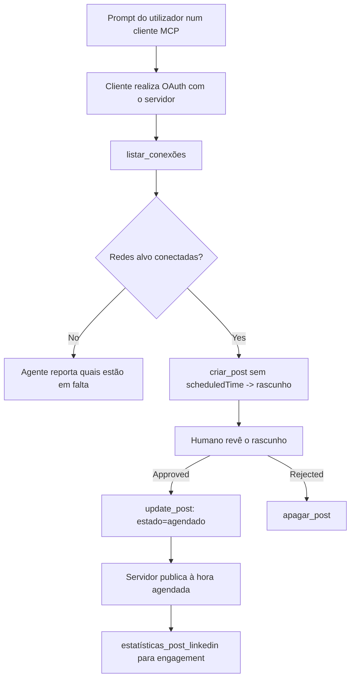

# Estudo de Caso: Publicação em Redes Sociais a partir de um Agente com um Servidor MCP Remoto

> **Aviso:** Vários serviços e projetos open-source podem publicar em redes sociais, e uma equipa também poderia integrar diretamente a API de cada rede. O cenário abaixo é fornecido como um exemplo prático de como um **servidor MCP remoto com capacidade de escrita** pode ser concebido e utilizado. O Publora é um serviço comercial com um plano gratuito; os padrões aqui descritos aplicam-se a qualquer servidor MCP que realize ações irreversíveis em nome de um utilizador.

## Visão Geral

Os agentes são bons a redigir conteúdo e maus a entregá-lo. Um modelo pode escrever um anúncio de lançamento em segundos, e depois o trabalho pára: publicar significa uma API por rede, uma app OAuth por rede, e um conjunto diferente de regras para médias em cada uma. A maioria das equipas resolve isto copiando o texto manualmente para um navegador.

Este estudo de caso examina como essa última etapa é resolvida com um único servidor MCP remoto e — mais útil para quem constrói um — as decisões de design que um servidor **com capacidade de escrita** tem de acertar. Ler dados é permissivo. Publicar não: uma chamada errada é visível a uma audiência e não pode ser revertida.

## Cenário

Uma pequena equipa de relações com desenvolvedores redige publicações dentro de um agente (Claude, VS Code, Cursor — o cliente não importa). Querem que o agente:

- veja quais contas sociais a equipa conectou,
- crie um rascunho de publicação e o mantenha até aprovação humana,
- anexe uma imagem,
- agende para várias redes a um horário escolhido,
- e depois reporte o desempenho.

Fundamentalmente, querem que o agente *não possa* publicar acidentalmente enquanto estiverem a experimentar.

## Ferramentas Utilizadas

- [Publora MCP Server](https://github.com/publora/mcp-server) — um servidor MCP remoto (`streamable-http`) que expõe ferramentas de publicação, agendamento, multimédia e análises LinkedIn. Registado no registo oficial MCP como `com.publora/mcp-server`.

## Fluxo de Trabalho Passo a Passo

1. **Conectar o servidor.** Clientes que usam OAuth realizam o fluxo de código de autorização com PKCE através do ecrã de consentimento do servidor; clientes que não usam, como CLIs headless, usam uma chave API Publora num cabeçalho. Ambos os caminhos são suportados, sendo que o cliente determina qual utiliza e não o servidor.
2. **Listar conexões.** O agente chama `list_connections` e recebe as contas conectadas com os seus identificadores.
3. **Rascunhar.** O agente chama `create_post` *sem* hora agendada. A publicação é armazenada como rascunho — nada é publicado.
4. **Anexar multimédia.** URLs públicos de imagem são passados na mesma chamada; o servidor descarrega e valida-os.
5. **Agendar.** Após aprovação humana, `update_post` define o estado para agendado com hora em formato ISO 8601.
6. **Medir.** Para LinkedIn, `linkedin_post_stats` retorna o envolvimento quando a publicação fica ativa.

## Exemplo de Prompt

```text
Which social accounts do I have connected?
Draft a post announcing our new changelog page, attach the screenshot at
https://example.com/changelog.png, and keep it as a draft — do not publish it.
Once I approve, schedule it to LinkedIn and Bluesky for tomorrow at 09:00 UTC.
```

## Diagrama de fluxo Mermaid



## Implementação Técnica

As lições abaixo são a parte transferível deste estudo de caso.

### Descoberta aberta, execução autenticada

`tools/list` é servido sem credenciais; cada `tools/call` requer um token
e caso contrário retorna `401` com um cabeçalho `WWW-Authenticate` que aponta para os
metadados de recurso protegido. O endpoint legado do servidor também responde a um
`initialize` não autenticado para clientes em versões de protocolo anteriores a
`2026-07-28`; clientes atuais não usam essa negociação.

Esta divisão específica do servidor permite que registos, catálogos e clientes inspecionem nomes,
esquemas e anotações das ferramentas sem segredo, prevenindo execução anónima.
A descoberta aberta é uma escolha de implantação, não um requisito MCP; um
ambiente protegido pode também exigir autorização para `tools/list`.

### Registo: registo dinâmico de cliente e o que o substitui

O servidor anuncia `/.well-known/oauth-protected-resource` e `/.well-known/oauth-authorization-server`, e suporta o fluxo de código de autorização com PKCE (`S256`), tokens de atualização e **registo dinâmico de cliente**.

O registo dinâmico removeu o passo manual para clientes legados: sem ele,
cada cliente precisava de um `client_id` pré-emissor pelo vendedor.

Considere isto como comportamento de compatibilidade em vez de um design a copiar. A revisão da especificação de `2026-07-28` descontinua o registo dinâmico de cliente em favor dos Documentos de Metadados de ID de Cliente, onde o cliente aloja um documento de metadados numa URL HTTPS estável e essa URL *é* o `client_id`. O DCR continua a funcionar para já, mas um servidor construído hoje deve planear para CIMD e manter DCR apenas para clientes antigos.

### As anotações das ferramentas não são decoração

Cada ferramenta carrega um `title` e os avisos aplicáveis: `readOnlyHint`, `destructiveHint`, `idempotentHint`, `openWorldHint`.

Duas razões para investir nelas. Primeiro, os clientes usam os avisos para decidir o que confirmar com o utilizador — um cliente pode executar automaticamente uma busca só de leitura e parar para aprovação antes de apagar. A especificação é explícita que as anotações são avisos não confiáveis, não um mecanismo de autorização: elas moldam o que o cliente oferece para fazer, não impedem nada no servidor, e o servidor deve impor as suas próprias regras. Em segundo lugar, os principais diretórios de conectores agora *exigem* essas anotações para revisão; um servidor cujas ferramentas carecem de títulos e avisos será rejeitado independentemente do seu funcionamento.

### Faça identificadores impossíveis de inventar

Identificadores de plataforma são strings opacas retornadas por `list_connections`, e a descrição do esquema diz explicitamente que devem ser copiados à letra e nunca adivinhados. O servidor rejeita qualquer outra coisa.

Modelos são adivinhadores fluentes. Qualquer servidor com capacidade de escrita deve assumir que um identificador será eventualmente hallucinatório e fazer esse caminho falhar claramente e cedo, em vez de agir sobre um valor plausível.

### Falhe antes de publicar, com uma mensagem acionável

Algumas redes recusam publicações só de texto e exigem imagem ou vídeo. Isso é validado ao agendar a publicação, e o erro nomeia a plataforma e o requisito em falta.

Um agente pode recuperar-se de "Instagram exige multimédia — anexe uma imagem ou vídeo" sem outra viagem de ida e volta. Não pode recuperar-se de um `400` genérico.

### Torne as tentativas de reenvio seguras

As duas ferramentas que criam conteúdo, `create_post` e `update_post`, aceitam uma chave de idempotência: reutilizá-la com um pedido idêntico repete a resposta original em vez de criar uma segunda publicação. Os ambientes de execução do agente reenviam em timeout; sem idempotência, uma resposta lenta torna-se publicação duplicada. As outras ferramentas de escrita — eliminações, passos de multimédia, reações e comentários do LinkedIn — não aceitam chave, pelo que um reenvio não é automaticamente seguro. É importante saber quais das suas próprias mutações são protegidas e quais não são.

### Forneça uma forma de testar que não publica nada


O servidor aceita um destino reservado, `publora-playground`, que é validado e reconhecido como um destino real e depois descartado — nada chega a uma conta real. Está descrito no próprio esquema da ferramenta, que qualquer cliente pode ler sem credenciais: o campo `platforms` de `create_post` documenta-o como "um destino de teste de conexão que não requer uma conexão real — a publicação é reconhecida e descartada, nada é publicado". Invoque-o passando-o como a única entrada: `platforms: ["publora-playground"]`.

Isto revelou-se um dos detalhes mais úteis de toda a interface. Revisores de diretórios de conectores, colaboradores e CI podem exercitar o caminho completo de escrita de ponta a ponta sem risco para um público real. Qualquer servidor MCP com ações irreversíveis beneficia de um destino no-op documentado.

## Resultados e Impacto

- A etapa de publicação mudou de um navegador para a mesma conversa onde o conteúdo é escrito, e um hábito de esboço primeiro mantém um humano no circuito. Seja preciso sobre o que isso é: um esboço é uma convenção, não um limite. A mesma credencial pode agendar ou publicar, por isso quem precisa de uma porta de aprovação real tem de a aplicar fora da interface da ferramenta — credenciais separadas, ou uma camada de política antes do servidor.
- As diferenças por rede — requisitos de mídia, encadeamento, controlos de resposta — são tratadas uma vez no servidor em vez de em cada agente que lhe fala.
- O mesmo servidor suporta vários clientes MCP sem credenciais pré-emITIDAS.
    Os clientes atuais podem usar Documentos de Metadados do ID do Cliente; o DCR permanece como alternativa
    para clientes mais antigos.
- As restrições de design acima foram moldadas tanto por revisões de diretórios de conectores quanto por utilizadores: anotações, OAuth e um destino de teste seguro foram exigidos por pelo menos um deles.

## Referências

- [Servidor MCP Publora (código-fonte)](https://github.com/publora/mcp-server)
- [Documentação da API e MCP Publora](https://docs.publora.com)
- [Entrada do Registo MCP: `com.publora/mcp-server`](https://registry.modelcontextprotocol.io/v0/servers?search=com.publora/mcp-server)
- [Especificação MCP — Autorização](https://modelcontextprotocol.io/specification/2026-07-28/basic/authorization)
- [Especificação MCP — Anotações de ferramentas](https://modelcontextprotocol.io/docs/concepts/tools)

## O Que Vem a Seguir

- Pegue num servidor MCP que esteja a construir e verifique as três melhores soluções mais baratas aqui: anotações em cada ferramenta, uma chave de idempotência em cada escrita, e um destino no-op documentado.
- Experimente a divisão de descoberta aberta: chame `tools/list` contra um servidor remoto público sem credenciais, e depois chame uma ferramenta e inspecione o desafio `401`.
- Considere o que "desfazer" significa para o seu domínio. A publicação tem esboços e eliminação; se as suas ações não têm equivalente, a confirmação pertence ao design da ferramenta, não ao prompt.

---

<!-- CO-OP TRANSLATOR DISCLAIMER START -->
**Aviso Legal**:
Este documento foi traduzido utilizando o serviço de tradução automática [Co-op Translator](https://github.com/Azure/co-op-translator). Embora nos esforcemos pela precisão, esteja ciente de que traduções automáticas podem conter erros ou imprecisões. O documento original na sua língua nativa deve ser considerado a fonte autorizada. Para informações críticas, recomenda-se tradução profissional humana. Não nos responsabilizamos por quaisquer mal-entendidos ou interpretações incorretas resultantes da utilização desta tradução.
<!-- CO-OP TRANSLATOR DISCLAIMER END -->