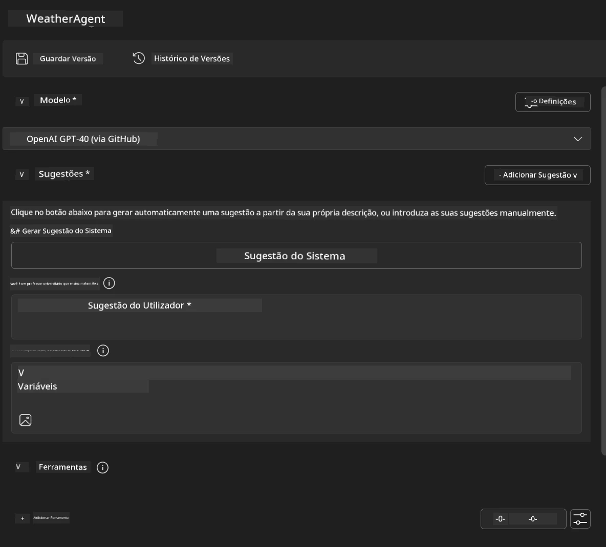
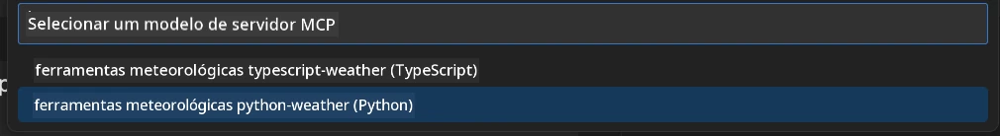
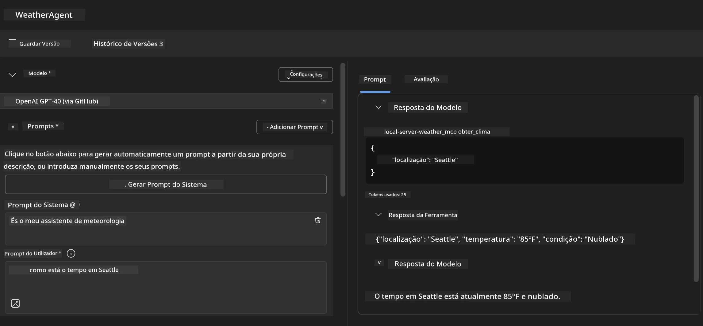
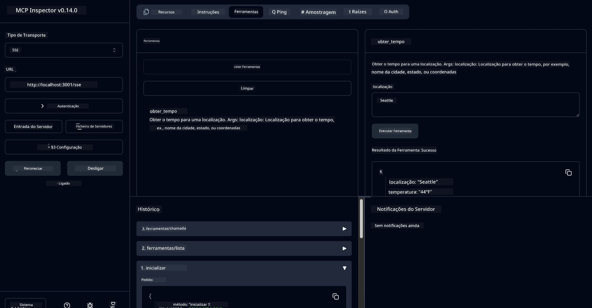

# 🔧 Módulo 3: Desenvolvimento Avançado de MCP com Microsoft Foundry Toolkit

> [!NOTE]
> As URLs do Inspector neste laboratório usam o endpoint legado `/sse` e apontam para as
> dependências fixas MCP SDK `1.9.3` e Inspector `0.14.0`. Não são
> exemplos Streamable HTTP atuais de `2026-07-28`.


## 🎯 Objetivos de Aprendizagem

No final deste laboratório, será capaz de:

- ✅ Criar servidores MCP personalizados usando o Microsoft Foundry Toolkit
- ✅ Configurar e usar o mais recente SDK Python MCP (v1.9.3)
- ✅ Configurar e utilizar o MCP Inspector para depuração
- ✅ Depurar servidores MCP tanto no Agent Builder como no Inspector
- ✅ Compreender fluxos de trabalho avançados de desenvolvimento de servidores MCP

## 📋 Pré-requisitos

- Conclusão do Laboratório 2 (Fundamentos MCP)
- VS Code com extensão Microsoft Foundry Toolkit instalada
- Ambiente Python 3.10+
- Node.js e npm para configuração do Inspector

## 🏗️ O Que Vai Construir

Neste laboratório, irá criar um **Servidor MCP de Clima** que demonstra:
- Implementação personalizada de servidor MCP
- Integração com o Microsoft Foundry Toolkit Agent Builder
- Fluxos de trabalho profissionais de depuração
- Padrões modernos de uso do SDK MCP

---

## 🔧 Visão Geral dos Componentes Principais

### 🐍 SDK Python MCP
O Model Context Protocol Python SDK fornece a base para construir servidores MCP personalizados. Vai usar a versão 1.9.3 com capacidades de depuração melhoradas.

### 🔍 MCP Inspector
Uma ferramenta poderosa de depuração que oferece:
- Monitorização do servidor em tempo real
- Visualização da execução das ferramentas
- Inspeção das requisições/respostas de rede
- Ambiente de teste interativo

---

## 📖 Implementação Passo a Passo

### Passo 1: Criar um WeatherAgent no Agent Builder

1. **Abra o Agent Builder** no VS Code através da extensão Microsoft Foundry Toolkit
2. **Crie um novo agente** com a seguinte configuração:
   - Nome do Agente: `WeatherAgent`



### Passo 2: Inicializar Projeto de Servidor MCP

1. **Navegue para Ferramentas** → **Adicionar Ferramenta** no Agent Builder
2. **Selecione "Servidor MCP"** das opções disponíveis
3. **Escolha "Criar um novo Servidor MCP"**
4. **Selecione o template `python-weather`**
5. **Nomeie o seu servidor:** `weather_mcp`



### Passo 3: Abrir e Analisar o Projeto

1. **Abra o projeto gerado** no VS Code
2. **Revise a estrutura do projeto:**
   ```
   weather_mcp/
   ├── src/
   │   ├── __init__.py
   │   └── server.py
   ├── inspector/
   │   ├── package.json
   │   └── package-lock.json
   ├── .vscode/
   │   ├── launch.json
   │   └── tasks.json
   ├── pyproject.toml
   └── README.md
   ```

### Passo 4: Atualizar para o Último SDK MCP

> **🔍 Porquê Atualizar?** Queremos usar o último SDK MCP (v1.9.3) e o serviço Inspector (0.14.0) para funcionalidades avançadas e melhor capacidade de depuração.

#### 4a. Atualizar Dependências Python

**Edite o `pyproject.toml`:** atualizar [./code/weather_mcp/pyproject.toml](../../../../10-StreamliningAIWorkflowsBuildingAnMCPServerWithAIToolkit/lab3/code/weather_mcp/pyproject.toml)


#### 4b. Atualizar Configuração do Inspector

**Edite o `inspector/package.json`:** atualizar [./code/weather_mcp/inspector/package.json](../../../../10-StreamliningAIWorkflowsBuildingAnMCPServerWithAIToolkit/lab3/code/weather_mcp/inspector/package.json)

#### 4c. Atualizar Dependências do Inspector

**Edite o `inspector/package-lock.json`:** atualizar [./code/weather_mcp/inspector/package-lock.json](../../../../10-StreamliningAIWorkflowsBuildingAnMCPServerWithAIToolkit/lab3/code/weather_mcp/inspector/package-lock.json)

> **📝 Nota:** Este ficheiro contém definições extensas de dependências. Abaixo está a estrutura essencial - o conteúdo completo garante a resolução correta das dependências.


> **⚡ Package Lock Completo:** O package-lock.json completo contém cerca de 3000 linhas de definições de dependências. O acima mostra a estrutura chave - use o ficheiro fornecido para resolução completa.

### Passo 5: Configurar Depuração no VS Code

*Nota: Por favor copie o ficheiro no caminho especificado para substituir o correspondente ficheiro local*

#### 5a. Atualizar Configuração de Lançamento

**Edite `.vscode/launch.json`:**

```json
{
  "version": "0.2.0",
  "configurations": [
    {
      "name": "Attach to Local MCP",
      "type": "debugpy",
      "request": "attach",
      "connect": {
        "host": "localhost",
        "port": 5678
      },
      "presentation": {
        "hidden": true
      },
      "internalConsoleOptions": "neverOpen",
      "postDebugTask": "Terminate All Tasks"
    },
    {
      "name": "Launch Inspector (Edge)",
      "type": "msedge",
      "request": "launch",
      "url": "http://localhost:6274?timeout=60000&serverUrl=http://localhost:3001/sse#tools",
      "cascadeTerminateToConfigurations": [
        "Attach to Local MCP"
      ],
      "presentation": {
        "hidden": true
      },
      "internalConsoleOptions": "neverOpen"
    },
    {
      "name": "Launch Inspector (Chrome)",
      "type": "chrome",
      "request": "launch",
      "url": "http://localhost:6274?timeout=60000&serverUrl=http://localhost:3001/sse#tools",
      "cascadeTerminateToConfigurations": [
        "Attach to Local MCP"
      ],
      "presentation": {
        "hidden": true
      },
      "internalConsoleOptions": "neverOpen"
    }
  ],
  "compounds": [
    {
      "name": "Debug in Agent Builder",
      "configurations": [
        "Attach to Local MCP"
      ],
      "preLaunchTask": "Open Agent Builder",
    },
    {
      "name": "Debug in Inspector (Edge)",
      "configurations": [
        "Launch Inspector (Edge)",
        "Attach to Local MCP"
      ],
      "preLaunchTask": "Start MCP Inspector",
      "stopAll": true
    },
    {
      "name": "Debug in Inspector (Chrome)",
      "configurations": [
        "Launch Inspector (Chrome)",
        "Attach to Local MCP"
      ],
      "preLaunchTask": "Start MCP Inspector",
      "stopAll": true
    }
  ]
}
```

**Edite `.vscode/tasks.json`:**

```
{
  "version": "2.0.0",
  "tasks": [
    {
      "label": "Start MCP Server",
      "type": "shell",
      "command": "python -m debugpy --listen 127.0.0.1:5678 src/__init__.py sse",
      "isBackground": true,
      "options": {
        "cwd": "${workspaceFolder}",
        "env": {
          "PORT": "3001"
        }
      },
      "problemMatcher": {
        "pattern": [
          {
            "regexp": "^.*$",
            "file": 0,
            "location": 1,
            "message": 2
          }
        ],
        "background": {
          "activeOnStart": true,
          "beginsPattern": ".*",
          "endsPattern": "Application startup complete|running"
        }
      }
    },
    {
      "label": "Start MCP Inspector",
      "type": "shell",
      "command": "npm run dev:inspector",
      "isBackground": true,
      "options": {
        "cwd": "${workspaceFolder}/inspector",
        "env": {
          "CLIENT_PORT": "6274",
          "SERVER_PORT": "6277",
        }
      },
      "problemMatcher": {
        "pattern": [
          {
            "regexp": "^.*$",
            "file": 0,
            "location": 1,
            "message": 2
          }
        ],
        "background": {
          "activeOnStart": true,
          "beginsPattern": "Starting MCP inspector",
          "endsPattern": "Proxy server listening on port"
        }
      },
      "dependsOn": [
        "Start MCP Server"
      ]
    },
    {
      "label": "Open Agent Builder",
      "type": "shell",
      "command": "echo ${input:openAgentBuilder}",
      "presentation": {
        "reveal": "never"
      },
      "dependsOn": [
        "Start MCP Server"
      ],
    },
    {
      "label": "Terminate All Tasks",
      "command": "echo ${input:terminate}",
      "type": "shell",
      "problemMatcher": []
    }
  ],
  "inputs": [
    {
      "id": "openAgentBuilder",
      "type": "command",
      "command": "ai-mlstudio.agentBuilder",
      "args": {
        "initialMCPs": [ "local-server-weather_mcp" ],
        "triggeredFrom": "vsc-tasks"
      }
    },
    {
      "id": "terminate",
      "type": "command",
      "command": "workbench.action.tasks.terminate",
      "args": "terminateAll"
    }
  ]
}
```


---

## 🚀 Executar e Testar o Seu Servidor MCP

### Passo 6: Instalar Dependências

Após fazer as alterações de configuração, execute os seguintes comandos:

**Instalar dependências Python:**
```bash
uv sync
```

**Instalar dependências do Inspector:**
```bash
cd inspector
npm install
```

### Passo 7: Depurar com Agent Builder

1. **Pressione F5** ou use a configuração **"Debug in Agent Builder"**
2. **Selecione a configuração composta** no painel de depuração
3. **Espere o servidor iniciar** e o Agent Builder abrir
4. **Teste o seu servidor MCP de clima** com consultas em linguagem natural

Prompt de entrada como este

SYSTEM_PROMPT

```
You are my weather assistant
```

USER_PROMPT

```
How's the weather like in Seattle
```



### Passo 8: Depurar com MCP Inspector

1. **Use a configuração "Debug in Inspector"** (Edge ou Chrome)
2. **Abra a interface do Inspector** em `http://localhost:6274`
3. **Explore o ambiente de testes interativo:**
   - Veja as ferramentas disponíveis
   - Teste a execução das ferramentas
   - Monitorize as requisições de rede
   - Depure as respostas do servidor



---

## 🎯 Resultados Principais da Aprendizagem

Ao completar este laboratório, você:

- [x] **Criou um servidor MCP personalizado** usando os templates Microsoft Foundry Toolkit
- [x] **Atualizou para o último SDK MCP** (v1.9.3) para funcionalidade avançada
- [x] **Configurou fluxos de trabalho profissionais de depuração** para Agent Builder e Inspector
- [x] **Configurou o MCP Inspector** para testes interativos no servidor
- [x] **Dominou configurações de depuração no VS Code** para desenvolvimento MCP

## 🔧 Funcionalidades Avançadas Exploras

| Funcionalidade | Descrição | Caso de Uso |
|---------|-------------|----------|
| **SDK Python MCP v1.9.3** | Implementação mais recente do protocolo | Desenvolvimento moderno de servidores |
| **MCP Inspector 0.14.0** | Ferramenta de depuração interativa | Testes em tempo real de servidores |
| **Depuração VS Code** | Ambiente de desenvolvimento integrado | Fluxo profissional de depuração |
| **Integração Agent Builder** | Conexão direta com Microsoft Foundry Toolkit | Testes completos de agentes |

## 📚 Recursos Adicionais

- [Documentação do SDK Python MCP](https://modelcontextprotocol.io/docs/sdk/python)
- [Guia da Extensão Microsoft Foundry Toolkit](https://code.visualstudio.com/docs/ai/ai-toolkit)
- [Documentação de Depuração VS Code](https://code.visualstudio.com/docs/editor/debugging)
- [Especificação Model Context Protocol](https://modelcontextprotocol.io/docs/concepts/architecture)

---

**🎉 Parabéns!** Completou com sucesso o Laboratório 3 e agora pode criar, depurar e implementar servidores MCP personalizados usando fluxos de trabalho profissionais de desenvolvimento.

### 🔜 Continue para o Próximo Módulo

Pronto para aplicar as suas competências MCP num fluxo de trabalho de desenvolvimento real? Continue para o **[Módulo 4: Desenvolvimento Prático MCP – Servidor Personalizado de Clone GitHub](../lab4/README.md)** onde irá:
- Construir um servidor MCP pronto para produção que automatiza operações de repositórios GitHub
- Implementar funcionalidades de clonagem de repositórios GitHub via MCP
- Integrar servidores MCP personalizados com VS Code e o Modo Agente GitHub Copilot
- Testar e implementar servidores MCP personalizados em ambientes de produção
- Aprender automação prática do fluxo de trabalho para programadores

---

<!-- CO-OP TRANSLATOR DISCLAIMER START -->
**Aviso Legal**:
Este documento foi traduzido utilizando o serviço de tradução automática [Co-op Translator](https://github.com/Azure/co-op-translator). Embora nos esforcemos pela precisão, esteja ciente de que traduções automáticas podem conter erros ou imprecisões. O documento original na sua língua nativa deve ser considerado a fonte autorizada. Para informações críticas, recomenda-se tradução profissional humana. Não nos responsabilizamos por quaisquer mal-entendidos ou interpretações incorretas resultantes da utilização desta tradução.
<!-- CO-OP TRANSLATOR DISCLAIMER END -->