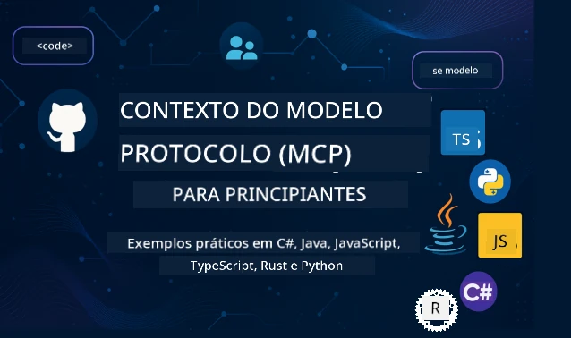

 

[](https://GitHub.com/microsoft/mcp-for-beginners/graphs/contributors)
[](https://GitHub.com/microsoft/mcp-for-beginners/issues)
[](https://GitHub.com/microsoft/mcp-for-beginners/pulls)
[](http://makeapullrequest.com)
[](https://mcptoplist.com/server/mcp.so%2Fmcp-for-beginners%2Fmicrosoft)

[](https://GitHub.com/microsoft/mcp-for-beginners/watchers)
[](https://GitHub.com/microsoft/mcp-for-beginners/fork)
[](https://GitHub.com/microsoft/mcp-for-beginners/stargazers)


[](https://discord.gg/nTYy5BXMWG)

Siga estes passos para começar a usar estes recursos:
1. **Fork ao Repositório**: Clique em [](https://GitHub.com/microsoft/mcp-for-beginners/fork)
2. **Clone o Repositório**:   `git clone https://github.com/microsoft/mcp-for-beginners.git`
3. **Junte-se ao** [](https://discord.gg/nTYy5BXMWG)


### 🌐 Suporte Multilíngue

#### Suportado via GitHub Action (Automatizado e Sempre Atualizado)

<!-- CO-OP TRANSLATOR LANGUAGES TABLE START -->
[Arabic](../ar/README.md) | [Bengali](../bn/README.md) | [Bulgarian](../bg/README.md) | [Burmese (Myanmar)](../my/README.md) | [Chinese (Simplified)](../zh-CN/README.md) | [Chinese (Traditional, Hong Kong)](../zh-HK/README.md) | [Chinese (Traditional, Macau)](../zh-MO/README.md) | [Chinese (Traditional, Taiwan)](../zh-TW/README.md) | [Croatian](../hr/README.md) | [Czech](../cs/README.md) | [Danish](../da/README.md) | [Dutch](../nl/README.md) | [Estonian](../et/README.md) | [Finnish](../fi/README.md) | [French](../fr/README.md) | [German](../de/README.md) | [Greek](../el/README.md) | [Hebrew](../he/README.md) | [Hindi](../hi/README.md) | [Hungarian](../hu/README.md) | [Indonesian](../id/README.md) | [Italian](../it/README.md) | [Japanese](../ja/README.md) | [Kannada](../kn/README.md) | [Khmer](../km/README.md) | [Korean](../ko/README.md) | [Lithuanian](../lt/README.md) | [Malay](../ms/README.md) | [Malayalam](../ml/README.md) | [Marathi](../mr/README.md) | [Nepali](../ne/README.md) | [Nigerian Pidgin](../pcm/README.md) | [Norwegian](../no/README.md) | [Persian (Farsi)](../fa/README.md) | [Polish](../pl/README.md) | [Portuguese (Brazil)](../pt-BR/README.md) | [Portuguese (Portugal)](./README.md) | [Punjabi (Gurmukhi)](../pa/README.md) | [Romanian](../ro/README.md) | [Russian](../ru/README.md) | [Serbian (Cyrillic)](../sr/README.md) | [Slovak](../sk/README.md) | [Slovenian](../sl/README.md) | [Spanish](../es/README.md) | [Swahili](../sw/README.md) | [Swedish](../sv/README.md) | [Tagalog (Filipino)](../tl/README.md) | [Tamil](../ta/README.md) | [Telugu](../te/README.md) | [Thai](../th/README.md) | [Turkish](../tr/README.md) | [Ukrainian](../uk/README.md) | [Urdu](../ur/README.md) | [Vietnamese](../vi/README.md)

> **Prefere Clonar Localmente?**
>
> Este repositório inclui mais de 50 traduções de idiomas, o que aumenta significativamente o tamanho do download. Para clonar sem as traduções, use o checkout esparso:
>
> **Bash / macOS / Linux:**
> ```bash
> git clone --filter=blob:none --sparse https://github.com/microsoft/mcp-for-beginners.git
> cd mcp-for-beginners
> git sparse-checkout set --no-cone '/*' '!translations' '!translated_images'
> ```
>
> **CMD (Windows):**
> ```cmd
> git clone --filter=blob:none --sparse https://github.com/microsoft/mcp-for-beginners.git
> cd mcp-for-beginners
> git sparse-checkout set --no-cone "/*" "!translations" "!translated_images"
> ```
>
> Isto dá-lhe tudo o que precisa para completar o curso com um download muito mais rápido.
<!-- CO-OP TRANSLATOR LANGUAGES TABLE END -->

# 🚀 Currículo do Model Context Protocol (MCP) para Iniciantes

## **Aprenda MCP com Exemplos Práticos em Código em C#, Java, JavaScript, Rust, Python e TypeScript**

## 🧠 Visão Geral do Currículo do Model Context Protocol
Bem-vindo à sua jornada pelo Model Context Protocol! Se alguma vez se perguntou como as aplicações de IA comunicam com diferentes ferramentas e serviços, está prestes a descobrir a elegante solução que está a transformar a forma como os programadores constroem sistemas inteligentes.

Pense no MCP como um tradutor universal para aplicações de IA - tal como as portas USB permitem que conecte qualquer dispositivo ao seu computador, o MCP permite que os modelos de IA se liguem a qualquer ferramenta ou serviço de forma padronizada. Quer esteja a construir o seu primeiro chatbot ou a trabalhar em fluxos de IA complexos, compreender o MCP dará-lhe o poder de criar aplicações mais capazes e flexíveis.

Este currículo foi desenhado com paciência e cuidado para a sua jornada de aprendizagem. Vamos começar com conceitos simples que já compreende e gradualmente construir a sua experiência com prática prática na sua linguagem de programação favorita. Cada passo inclui explicações claras, exemplos práticos e muito incentivo ao longo do caminho.

Na altura em que concluir esta jornada, terá a confiança para construir os seus próprios servidores MCP, integrá-los com plataformas populares de IA e compreender como esta tecnologia está a remodelar o futuro do desenvolvimento de IA. Vamos começar esta aventura emocionante juntos!

### Documentação e Especificações Oficiais

Este currículo está alinhado com a **Especificação MCP 2025-11-25** (a versão estável mais recente). A especificação MCP usa versionamento baseado em datas (formato AAAA-MM-DD) para assegurar um rastreamento claro da versão do protocolo.

> **Olhando para o futuro:** um candidato a lançamento para a próxima versão da especificação, **2026-07-28**, está agendado para ser lançado a 28 de julho de 2026. Torna o protocolo sem estado na camada de transporte, formaliza uma framework de Extensões (MCP Apps, Tasks), reforça a autorização e descontinua Roots, Sampling e Logging. Veja [O Que Está a Mudar no MCP: O Candidato a Lançamento de 2026-07-28](./01-CoreConcepts/mcp-2026-07-28-release-candidate.md) para uma descrição completa.

Estes recursos tornam-se mais valiosos à medida que a sua compreensão cresce, mas não se sinta pressionado a ler tudo imediatamente. Comece pelas áreas que mais lhe interessam!
- 📘 [Documentação MCP](https://modelcontextprotocol.io/) – Este é o seu recurso principal para tutoriais passo-a-passo e guias do utilizador. A documentação é escrita com iniciantes em mente, fornecendo exemplos claros que pode seguir ao seu ritmo.
- 📜 [Especificação MCP](https://modelcontextprotocol.io/specification/2025-11-25) – Considere isto como o seu manual de referência completo. À medida que avança no currículo, irá consultá-lo para verificar detalhes específicos e explorar funcionalidades avançadas.
- 📜 [Versionamento da Especificação MCP](https://modelcontextprotocol.io/specification/versioning) – Contém informações sobre o histórico de versões do protocolo e como o MCP usa versionamento baseado em datas (formato AAAA-MM-DD).
- 🧑‍💻 [Repositório MCP no GitHub](https://github.com/modelcontextprotocol) – Aqui encontrará SDKs, ferramentas e exemplos de código em várias linguagens de programação. É como um tesouro de exemplos práticos e componentes prontos a usar.
- 🌐 [Comunidade MCP](https://github.com/orgs/modelcontextprotocol/discussions) – Junte-se a outros aprendizes e programadores experientes em discussões sobre MCP. É uma comunidade de apoio onde as perguntas são bem-vindas e o conhecimento é partilhado livremente.
  
## Objetivos de Aprendizagem

No final deste currículo, sentir-se-á confiante e entusiasmado com as suas novas capacidades. Eis o que irá alcançar:

• **Compreender os fundamentos do MCP**: Perceberá o que é o Model Context Protocol e por que está a revolucionar a forma como as aplicações de IA trabalham juntas, usando analogias e exemplos que fazem sentido.

• **Construir o seu primeiro servidor MCP**: Criará um servidor MCP funcional na sua linguagem de programação preferida, começando com exemplos simples e desenvolvendo as suas competências passo a passo.

• **Ligar modelos de IA a ferramentas reais**: Aprenderá como integrar a lacuna entre modelos de IA e serviços reais, dando às suas aplicações novas capacidades poderosas.

• **Implementar as melhores práticas de segurança**: Compreenderá como manter as suas implementações MCP seguras, protegendo tanto as suas aplicações como os seus utilizadores.

• **Desdobrar com confiança**: Saberá como levar os seus projetos MCP desde o desenvolvimento até à produção, com estratégias de implantação práticas que funcionam no mundo real.

• **Juntar-se à comunidade MCP**: Tornar-se-á parte de uma comunidade crescente de programadores que estão a moldar o futuro do desenvolvimento de aplicações de IA.

## Fundamentos Essenciais

Antes de mergulharmos nas especificidades do MCP, vamos garantir que se sente confortável com alguns conceitos fundamentais. Não se preocupe se não é um especialista nestas áreas - vamos explicar tudo o que precisa de saber à medida que avançamos!

### Compreender Protocolos (A Base)

Pense num protocolo como as regras para uma conversa. Quando liga a um amigo, ambos sabem dizer "olá" quando atendem, falar por turno e dizer "adeus" quando terminam. Os programas de computador precisam de regras semelhantes para comunicarem eficazmente.

O MCP é um protocolo - um conjunto de regras acordadas que ajudam modelos e aplicações de IA a terem "conversas" produtivas com ferramentas e serviços. Tal como ter regras para a conversa torna a comunicação humana mais fácil, ter MCP torna a comunicação das aplicações de IA muito mais fiável e poderosa.

### Relações Cliente-Servidor (Como os Programas Trabalham em Conjunto)

Já utiliza relações cliente-servidor todos os dias! Quando usa um navegador web (o cliente) para visitar um site, está a ligar-se a um servidor web que lhe envia o conteúdo da página. O navegador sabe como pedir informação, e o servidor sabe como responder.

No MCP, temos uma relação semelhante: os modelos de IA atuam como clientes que pedem informação ou ações, enquanto os servidores MCP fornecem essas capacidades. É como ter um assistente útil (o servidor) que a IA pode pedir para executar tarefas específicas.

### Por Que a Padronização Importa (Fazer as Coisas Funcionar Juntas)

Imagine se cada fabricante de carros usasse bombas de gasolina de formatos diferentes - precisaria de um adaptador diferente para cada carro! A padronização significa acordar abordagens comuns para que as coisas funcionem perfeitamente em conjunto.

O MCP fornece esta padronização para aplicações de IA. Em vez de cada modelo de IA precisar de código personalizado para cada ferramenta, o MCP cria uma forma universal de comunicação. Isto significa que os programadores podem construir ferramentas uma vez e fazê-las funcionar com muitos sistemas de IA diferentes.

## 🧭 Vista Geral do Seu Caminho de Aprendizagem

A sua jornada MCP está cuidadosamente estruturada para construir progressivamente a sua confiança e competências. Cada fase introduz novos conceitos enquanto reforça o que já aprendeu.

### 🌱 Fase de Fundação: Compreender os Fundamentos (Módulos 0-2)

É aqui que a sua aventura começa! Vamos apresentar-lhe os conceitos MCP usando analogias familiares e exemplos simples. Vai compreender o que é o MCP, porque existe e como se encaixa no mundo mais amplo do desenvolvimento de IA.


• **Módulo 0 - Introdução ao MCP**: Começaremos por explorar o que é MCP e por que é tão importante para as aplicações de IA modernas. Verá exemplos reais de MCP em ação e compreenderá como resolve problemas comuns que os programadores enfrentam.

• **Módulo 1 - Conceitos Fundamentais Explicados**: Aqui aprenderá os blocos essenciais do MCP. Usaremos muitas analogias e exemplos visuais para garantir que estes conceitos pareçam naturais e compreensíveis.

• **Módulo 2 - Segurança no MCP**: Segurança pode parecer intimidante, mas mostraremos como o MCP inclui funcionalidades de segurança incorporadas e ensinaremos as melhores práticas para proteger as suas aplicações desde o início.

### 🔨 Fase de Construção: Criando as Suas Primeiras Implementações (Módulo 3)

Agora começa a parte divertida! Terá experiência prática a construir servidores e clientes MCP reais. Não se preocupe - começaremos pelo simples e guiaremos cada passo.

Este módulo inclui vários guias práticos que permitem praticar na sua linguagem de programação preferida. Criará o seu primeiro servidor, construirá um cliente para se ligar a ele, e até integrará com ferramentas de desenvolvimento populares como o VS Code.

Cada guia inclui exemplos completos de código, dicas para resolução de problemas e explicações sobre as razões das escolhas de design. No final desta fase, terá implementações MCP funcionais das quais poderá orgulhar-se!

### 🚀 Fase de Crescimento: Conceitos Avançados e Aplicação no Mundo Real (Módulos 4-5)

Com o básico dominado, está pronto para explorar funcionalidades MCP mais sofisticadas. Abordaremos estratégias práticas de implementação, técnicas de depuração, e temas avançados como integração multi-modal de IA.

Também aprenderá a escalar as suas implementações MCP para uso em produção e a integrar com plataformas cloud como o Azure. Estes módulos preparam-no para construir soluções MCP que suportem demandas reais.

### 🌟 Fase de Mestria: Comunidade e Especialização (Módulos 6-11)

A fase final foca-se em juntar-se à comunidade MCP e em especializar-se nas áreas que mais lhe interessam. Irá aprender a contribuir para projetos open-source MCP, implementar padrões avançados de autenticação e construir soluções integradas de bancos de dados abrangentes.

O Módulo 11 merece uma menção especial - é um percurso completo de 13 laboratórios práticos que o ensina a construir servidores MCP prontos para produção com integração PostgreSQL. É como um projeto final que reúne tudo o que aprendeu!

### 📚 Estrutura Completa do Currículo

| Módulo | Tema | Descrição | Link |
|--------|-------|-------------|------|
| **Módulos 0-3: Fundamentos** | | | |
| 00 | Introdução ao MCP | Visão geral do Model Context Protocol e sua importância em pipelines de IA | [Leia mais](./00-Introduction/README.md) |
| 01 | Conceitos Fundamentais Explicados | Exploração aprofundada dos conceitos centrais do MCP | [Leia mais](./01-CoreConcepts/README.md) |
| 1.1 | O Que Está a Mudar no MCP (2026-07-28 RC) | Protocolo stateless, framework de Extensões e descontinuações na próxima versão da especificação | [Guia](./01-CoreConcepts/mcp-2026-07-28-release-candidate.md) |
| 02 | Segurança no MCP | Ameaças de segurança e melhores práticas | [Leia mais](./02-Security/README.md) |
| 03 | Começar com MCP | Configuração do ambiente, servidores/clientes básicos, integração | [Leia mais](./03-GettingStarted/README.md) |
| **Módulo 3: Construindo o Seu Primeiro Servidor & Cliente** | | | |
| 3.1 | Primeiro Servidor | Crie o seu primeiro servidor MCP | [Guia](./03-GettingStarted/01-first-server/README.md) |
| 3.2 | Primeiro Cliente | Desenvolva um cliente MCP básico | [Guia](./03-GettingStarted/02-client/README.md) |
| 3.3 | Cliente com LLM | Integre modelos de linguagem grandes | [Guia](./03-GettingStarted/03-llm-client/README.md) |
| 3.4 | Integração com VS Code | Utilize servidores MCP no VS Code | [Guia](./03-GettingStarted/04-vscode/README.md) |
| 3.5 | Servidor stdio | Crie servidores usando transporte stdio | [Guia](./03-GettingStarted/05-stdio-server/README.md) |
| 3.6 | Streaming HTTP | Implemente streaming HTTP no MCP | [Guia](./03-GettingStarted/06-http-streaming/README.md) |
| 3.7 | Microsoft Foundry Toolkit | Use o Microsoft Foundry Toolkit com MCP | [Guia](./03-GettingStarted/07-aitk/README.md) |
| 3.8 | Testes | Teste a sua implementação de servidor MCP | [Guia](./03-GettingStarted/08-testing/README.md) |
| 3.9 | Implantação | Faça o deploy de servidores MCP para produção | [Guia](./03-GettingStarted/09-deployment/README.md) |
| 3.10 | Uso avançado do servidor | Use servidores avançados para funcionalidades complexas e melhor arquitetura | [Guia](./03-GettingStarted/10-advanced/README.md) |
| 3.11 | Autenticação simples | Um capítulo que explica autenticação desde o início e RBAC | [Guia](./03-GettingStarted/11-simple-auth/README.md) |
| 3.12 | Hosts MCP | Configure Claude Desktop, Cursor, Cline e outros hosts MCP | [Guia](./03-GettingStarted/12-mcp-hosts/README.md) |
| 3.13 | Inspetor MCP | Depure e teste servidores MCP com a ferramenta Inspector | [Guia](./03-GettingStarted/13-mcp-inspector/README.md) |
| 3.14 | Amostragem | Use amostragem para colaborar com o cliente | [Guia](./03-GettingStarted/14-sampling/README.md) |
| 3.15 | Apps MCP | Construa Apps MCP | [Guia](./03-GettingStarted/15-mcp-apps/README.md) |
| **Módulos 4-5: Prático & Avançado** | | | |
| 04 | Implementação Prática | SDKs, depuração, testes, templates de prompt reutilizáveis | [Leia mais](./04-PracticalImplementation/README.md) |
| 4.1 | Paginação | Lide com grandes conjuntos de resultados com paginação baseada em cursor | [Guia](./04-PracticalImplementation/pagination/README.md) |
| 05 | Temas Avançados no MCP | IA multimodal, escalabilidade, uso empresarial | [Leia mais](./05-AdvancedTopics/README.md) |
| 5.1 | Integração com Azure | Integração MCP com Azure | [Guia](./05-AdvancedTopics/mcp-integration/README.md) |
| 5.2 | Multimodalidade | Trabalho com múltiplas modalidades | [Guia](./05-AdvancedTopics/mcp-multi-modality/README.md) |
| 5.3 | Demo OAuth2 | Implemente autenticação OAuth2 | [Guia](./05-AdvancedTopics/mcp-oauth2-demo/README.md) |
| 5.4 | Contextos Raiz | Compreender e implementar contextos raiz | [Guia](./05-AdvancedTopics/mcp-root-contexts/README.md) |
| 5.5 | Roteamento | Estratégias de roteamento MCP | [Guia](./05-AdvancedTopics/mcp-routing/README.md) |
| 5.6 | Amostragem | Técnicas de amostragem no MCP | [Guia](./05-AdvancedTopics/mcp-sampling/README.md) |
| 5.7 | Escalabilidade | Escale implementações MCP | [Guia](./05-AdvancedTopics/mcp-scaling/README.md) |
| 5.8 | Segurança | Considerações avançadas de segurança | [Guia](./05-AdvancedTopics/mcp-security/README.md) |
| 5.9 | Pesquisa Web | Implemente capacidades de pesquisa web | [Guia](./05-AdvancedTopics/web-search-mcp/README.md) |
| 5.10 | Streaming em Tempo Real | Construa funcionalidades de streaming em tempo real | [Guia](./05-AdvancedTopics/mcp-realtimestreaming/README.md) |
| 5.11 | Pesquisa em Tempo Real | Implemente pesquisa em tempo real | [Guia](./05-AdvancedTopics/mcp-realtimesearch/README.md) |
| 5.12 | Autenticação Entra ID | Autenticação com Microsoft Entra ID | [Guia](./05-AdvancedTopics/mcp-security-entra/README.md) |
| 5.13 | Integração Foundry | Integre com Microsoft Foundry | [Guia](./05-AdvancedTopics/mcp-foundry-agent-integration/README.md) |
| 5.14 | Engenharia de Contexto | Técnicas para engenharia eficaz de contexto | [Guia](./05-AdvancedTopics/mcp-contextengineering/README.md) |
| 5.15 | Transporte Customizado MCP | Implementações de transporte customizado | [Guia](./05-AdvancedTopics/mcp-transport/README.md) |
| 5.16 | Funcionalidades do Protocolo | Notificações de progresso, cancelamento, templates de recursos | [Guia](./05-AdvancedTopics/mcp-protocol-features/README.md) |
| 5.17 | Raciocínio Multi-Agente Adversarial | Dois agentes argumentam lados opostos usando ferramentas MCP partilhadas, avaliados por agente juiz | [Guia](./05-AdvancedTopics/mcp-adversarial-agents/README.md) |
| **Módulos 6-10: Comunidade & Melhores Práticas** | | | |
| 06 | Contribuições da Comunidade | Como contribuir para o ecossistema MCP | [Guia](./06-CommunityContributions/README.md) |
| 07 | Lições da Adoção Precoce | Histórias reais de implementação | [Guia](./07-LessonsfromEarlyAdoption/README.md) |
| 08 | Melhores Práticas para MCP | Performance, tolerância a falhas, resiliência | [Guia](./08-BestPractices/README.md) |
| 09 | Estudos de Caso MCP | Exemplos práticos de implementação | [Guia](./09-CaseStudy/README.md) |
| 10 | Workshop Prático | Construindo um Servidor MCP com Microsoft Foundry Toolkit | [Lab](./10-StreamliningAIWorkflowsBuildingAnMCPServerWithAIToolkit/README.md) |
| **Módulo 11: Laboratório Prático de Servidor MCP** | | | |
| 11 | Integração de Banco de Dados no Servidor MCP | Percurso prático completo de 13 laboratórios para integração PostgreSQL | [Labores](./11-MCPServerHandsOnLabs/README.md) |
| 11.1 | Introdução | Visão geral do MCP com integração de banco de dados e caso de uso de análise de retalho | [Lab 00](./11-MCPServerHandsOnLabs/00-Introduction/README.md) |
| 11.2 | Arquitetura Principal | Compreensão da arquitetura do servidor MCP, camadas de banco de dados e padrões de segurança | [Lab 01](./11-MCPServerHandsOnLabs/01-Architecture/README.md) |
| 11.3 | Segurança & Multi-Tenancy | Segurança a nível de linha, autenticação e acesso multi-inquilino a dados | [Lab 02](./11-MCPServerHandsOnLabs/02-Security/README.md) |
| 11.4 | Configuração do Ambiente | Configuração do ambiente de desenvolvimento, Docker, recursos Azure | [Lab 03](./11-MCPServerHandsOnLabs/03-Setup/README.md) |
| 11.5 | Design de Banco de Dados | Configuração PostgreSQL, design de esquema para retalho e dados de exemplo | [Lab 04](./11-MCPServerHandsOnLabs/04-Database/README.md) |
| 11.6 | Implementação do Servidor MCP | Construindo o servidor FastMCP com integração de banco de dados | [Lab 05](./11-MCPServerHandsOnLabs/05-MCP-Server/README.md) |
| 11.7 | Desenvolvimento de Ferramentas | Criando ferramentas de consulta de banco de dados e introspeção de esquema | [Lab 06](./11-MCPServerHandsOnLabs/06-Tools/README.md) |
| 11.8 | Pesquisa Semântica | Implementação de embeddings vetoriais com Azure OpenAI e pgvector | [Lab 07](./11-MCPServerHandsOnLabs/07-Semantic-Search/README.md) |
| 11.9 | Testes & Depuração | Estratégias de teste, ferramentas de depuração e abordagens de validação | [Lab 08](./11-MCPServerHandsOnLabs/08-Testing/README.md) |
| 11.10 | Integração VS Code | Configuração da integração MCP no VS Code e uso do AI Chat | [Lab 09](./11-MCPServerHandsOnLabs/09-VS-Code/README.md) |
| 11.11 | Estratégias de Implantação | Implantação com Docker, Azure Container Apps e considerações de escalabilidade | [Lab 10](./11-MCPServerHandsOnLabs/10-Deployment/README.md) |
| 11.12 | Monitorização | Application Insights, logging, monitorização de performance | [Lab 11](./11-MCPServerHandsOnLabs/11-Monitoring/README.md) |
| 11.13 | Melhores Práticas | Otimização da performance, fortalecimento da segurança e dicas para produção | [Lab 12](./11-MCPServerHandsOnLabs/12-Best-Practices/README.md) |
| **Módulo 12: Ferramentas MCP** | | | |
| 12.1 | Ferramentas | Uso MCP na App Copilot | [ Guia ](./12-tooling/README.md) |

### 💻 Projetos de Código de Exemplo

Uma das partes mais entusiasmantes de aprender MCP é ver as suas capacidades de codificação desenvolverem-se progressivamente. Projetámos os nossos exemplos de código para começar simples e tornar-se mais sofisticados conforme aprofunda a sua compreensão. Eis como introduzimos conceitos - com código fácil de entender mas que demonstra princípios reais de MCP, compreenderá não só o que este código faz, mas por que está estruturado dessa forma e como se encaixa em aplicações MCP maiores.

#### Exemplos Básicos de Calculadora MCP

| Linguagem | Descrição | Link |
|----------|-------------|------|

| C# | Exemplo de Servidor MCP | [Ver Código](./03-GettingStarted/samples/csharp/README.md) |
| Java | Calculadora MCP | [Ver Código](./03-GettingStarted/samples/java/calculator/README.md) |
| JavaScript | Demonstração MCP | [Ver Código](./03-GettingStarted/samples/javascript/README.md) |
| Python | Servidor MCP | [Ver Código](../../03-GettingStarted/samples/python/mcp_calculator_server.py) |
| TypeScript | Exemplo MCP | [Ver Código](./03-GettingStarted/samples/typescript/README.md) |
| Rust | Exemplo MCP | [Ver Código](./03-GettingStarted/samples/rust/README.md) |

#### Implementações Avançadas MCP

| Linguagem | Descrição | Link |
|----------|-------------|------|
| C# | Exemplo Avançado | [Ver Código](./04-PracticalImplementation/samples/csharp/README.md) |
| Java com Spring | Exemplo de Aplicação Container | [Ver Código](./04-PracticalImplementation/samples/java/containerapp/README.md) |
| JavaScript | Exemplo Avançado | [Ver Código](./04-PracticalImplementation/samples/javascript/README.md) |
| Python | Implementação Complexa | [Ver Código](./04-PracticalImplementation/samples/python/README.md) |
| TypeScript | Exemplo Container | [Ver Código](./04-PracticalImplementation/samples/typescript/README.md) |


## 🎯 Pré-requisitos para Aprender MCP

Para tirar o máximo proveito deste currículo, deve ter:

- Conhecimentos básicos de programação em pelo menos uma das seguintes linguagens: C#, Java, JavaScript, Python ou TypeScript
- Compreensão do modelo cliente-servidor e APIs
- Familiaridade com conceitos REST e HTTP
- (Opcional) Conhecimentos de conceitos de IA/ML

- Participar nas nossas discussões comunitárias para apoio

## 📚 Guia de Estudo & Recursos

Este repositório inclui vários recursos para o ajudar a navegar e aprender eficazmente:

### Guia de Estudo

Está disponível um completo [Guia de Estudo](./study_guide.md) para o ajudar a navegar neste repositório de forma eficaz. Este mapa curricular visual mostra como todos os tópicos se ligam e fornece orientações sobre como usar os projetos de exemplo de forma eficaz. É especialmente útil se é um aprendiz visual que gosta de ver o panorama geral.

O guia inclui:
- Um mapa curricular visual mostrando todos os tópicos abordados
- Quebra detalhada de cada secção do repositório
- Orientações sobre como usar os projetos de exemplo
- Caminhos de aprendizagem recomendados para diferentes níveis de habilidade
- Recursos adicionais para complementar a sua jornada de aprendizagem

### Registo de Alterações

Mantemos um detalhado [Registo de Alterações](./changelog.md) que acompanha todas as atualizações significativas aos materiais do currículo, para que possa manter-se atualizado com as últimas melhorias e adições.
- Novos conteúdos adicionados
- Alterações estruturais
- Melhorias de funcionalidades
- Atualizações de documentação

## 🛠️ Como Usar Este Currículo de Forma Eficaz

Cada lição neste guia inclui:

1. Explicações claras dos conceitos MCP  
2. Exemplos de código em direto em várias linguagens  
3. Exercícios para construir aplicações MCP reais  
4. Recursos adicionais para aprendizes avançados

### Vamos Aprender MCP com C# - Série de Tutoriais
Vamos aprender sobre o Protocolo de Contexto de Modelo (MCP), um framework inovador projetado para padronizar as interações entre modelos de IA e aplicações cliente. Através desta sessão para iniciantes, iremos apresentar o MCP e guiá-lo na criação do seu primeiro servidor MCP.
#### C#: [https://aka.ms/letslearnmcp-csharp](https://aka.ms/letslearnmcp-csharp)
#### Java: [https://aka.ms/letslearnmcp-java](https://aka.ms/letslearnmcp-java)
#### JavaScript: [https://aka.ms/letslearnmcp-javascript](https://aka.ms/letslearnmcp-javascript)
#### Python: [https://aka.ms/letslearnmcp-python](https://aka.ms/letslearnmcp-python)

## 🎓 A Sua Jornada MCP Começa Aqui

Parabéns! Acabou de dar o primeiro passo numa jornada entusiasmante que irá expandir as suas capacidades de programação e conectá-lo à vanguarda do desenvolvimento de IA.

### O Que Já Conquistou

Ao ler esta introdução, já começou a construir a sua base de conhecimento em MCP. Compreende o que é o MCP, porque é importante e como este currículo irá apoiar a sua jornada de aprendizagem. Isto é uma grande conquista e o início da sua especialização nesta tecnologia importante.

### A Aventura À Frente

À medida que avança pelos módulos, lembre-se que todo especialista foi um dia um iniciante. Os conceitos que agora parecem complexos tornar-se-ão naturais à medida que praticar e aplicar. Cada pequeno passo constrói capacidades poderosas que o irão acompanhar ao longo da sua carreira de desenvolvimento.

### A Sua Rede de Apoio

Está a juntar-se a uma comunidade de aprendizes e especialistas que são apaixonados pelo MCP e desejam ajudar outros a ter sucesso. Quer esteja bloqueado num desafio de programação ou entusiasmado para partilhar uma descoberta, a comunidade está aqui para apoiar a sua jornada.

Se ficar preso ou tiver alguma questão sobre criação de aplicações de IA, junte-se a outros aprendizes e desenvolvedores experientes em discussões sobre MCP. É uma comunidade solidária onde as perguntas são bem-vindas e o conhecimento é partilhado livremente.

[](https://discord.gg/nTYy5BXMWG)

Se tiver feedback de produto ou encontrar erros durante a construção, visite:

[](https://aka.ms/foundry/forum)

### Pronto para Começar?

A sua aventura MCP começa agora! Comece pelo Módulo 0 para mergulhar nas suas primeiras experiências práticas com MCP, ou explore os projetos de exemplo para ver o que irá construir. Lembre-se - todo especialista começou exatamente onde você está agora, e com paciência e prática, ficará surpreendido com o que pode alcançar.

Bem-vindo ao mundo do desenvolvimento do Protocolo de Contexto de Modelo. Vamos construir algo incrível juntos!

## 🤝 Contribuir para a Comunidade de Aprendizagem

Este currículo torna-se mais forte com contribuições de aprendizes como você! Quer esteja a corrigir um erro tipográfico, a sugerir uma explicação mais clara ou a adicionar um novo exemplo, as suas contribuições ajudam outros iniciantes a ter sucesso.

Obrigado ao Microsoft Valued Professional [Shivam Goyal](https://www.linkedin.com/in/shivam2003/) por contribuir com exemplos de código.

O processo de contribuição é desenhado para ser acolhedor e suportivo. A maioria das contribuições requer um Acordo de Licença de Contribuinte (CLA), mas as ferramentas automatizadas irão guiá-lo no processo sem dificuldades.

## 📜 Aprendizagem Open Source

Todo este currículo está disponível sob a licença MIT [LICENSE](../../LICENSE), o que significa que pode usar, modificar e partilhar livremente. Isto apoia a nossa missão de tornar o conhecimento MCP acessível a desenvolvedores em todo o lado.
## 🤝 Diretrizes para Contribuições

Este projeto aceita contribuições e sugestões. A maioria das contribuições requer que concorde com um
Acordo de Licença de Contribuinte (CLA) declarando que tem o direito e efetivamente nos concede
os direitos de usar a sua contribuição. Para mais detalhes, visite <https://cla.opensource.microsoft.com>.

Quando submeter um pull request, um bot CLA determinará automaticamente se precisa fornecer
um CLA e irá decorar o PR adequadamente (ex.: verificação de estado, comentário). Simplesmente siga as instruções
fornecidas pelo bot. Só precisará de fazer isto uma vez para todos os repositórios que usam o nosso CLA.

Este projeto adotou o [Código de Conduta Open Source da Microsoft](https://opensource.microsoft.com/codeofconduct/).
Para mais informações, veja as [FAQ do Código de Conduta](https://opensource.microsoft.com/codeofconduct/faq/) ou
contacte [opencode@microsoft.com](mailto:opencode@microsoft.com) para quaisquer questões ou comentários adicionais.

---

*Pronto para começar a sua jornada MCP? Comece com [Módulo 00 - Introdução ao MCP](./00-Introduction/README.md) e dê os seus primeiros passos no mundo do desenvolvimento do Protocolo de Contexto de Modelo!*


## 🎒 Outros Cursos
A nossa equipa produz outros cursos! Veja:

<!-- CO-OP TRANSLATOR OTHER COURSES START -->
### LangChain
[](https://aka.ms/langchain4j-for-beginners)
[](https://aka.ms/langchainjs-for-beginners?WT.mc_id=m365-94501-dwahlin)
[](https://github.com/microsoft/langchain-for-beginners?WT.mc_id=m365-94501-dwahlin)
---

### Azure / Edge / MCP / Agentes
[](https://github.com/microsoft/AZD-for-beginners?WT.mc_id=academic-105485-koreyst)
[](https://github.com/microsoft/edgeai-for-beginners?WT.mc_id=academic-105485-koreyst)
[](https://github.com/microsoft/mcp-for-beginners?WT.mc_id=academic-105485-koreyst)
[](https://github.com/microsoft/ai-agents-for-beginners?WT.mc_id=academic-105485-koreyst)

---
 
### Série de IA Generativa
[](https://github.com/microsoft/generative-ai-for-beginners?WT.mc_id=academic-105485-koreyst)
[-9333EA?style=for-the-badge&labelColor=E5E7EB&color=9333EA)](https://github.com/microsoft/Generative-AI-for-beginners-dotnet?WT.mc_id=academic-105485-koreyst)
[-C084FC?style=for-the-badge&labelColor=E5E7EB&color=C084FC)](https://github.com/microsoft/generative-ai-for-beginners-java?WT.mc_id=academic-105485-koreyst)
[-E879F9?style=for-the-badge&labelColor=E5E7EB&color=E879F9)](https://github.com/microsoft/generative-ai-with-javascript?WT.mc_id=academic-105485-koreyst)

---
 
### Aprendizagem Essencial
[](https://aka.ms/ml-beginners?WT.mc_id=academic-105485-koreyst)
[](https://aka.ms/datascience-beginners?WT.mc_id=academic-105485-koreyst)
[](https://aka.ms/ai-beginners?WT.mc_id=academic-105485-koreyst)

[](https://github.com/microsoft/Security-101?WT.mc_id=academic-96948-sayoung)
[](https://aka.ms/webdev-beginners?WT.mc_id=academic-105485-koreyst)
[](https://aka.ms/iot-beginners?WT.mc_id=academic-105485-koreyst)
[](https://github.com/microsoft/xr-development-for-beginners?WT.mc_id=academic-105485-koreyst)

---
 
### Série Copilot
[](https://aka.ms/GitHubCopilotAI?WT.mc_id=academic-105485-koreyst)
[](https://github.com/microsoft/mastering-github-copilot-for-dotnet-csharp-developers?WT.mc_id=academic-105485-koreyst)
[](https://github.com/microsoft/CopilotAdventures?WT.mc_id=academic-105485-koreyst)
<!-- CO-OP TRANSLATOR OTHER COURSES END -->

---

<!-- CO-OP TRANSLATOR DISCLAIMER START -->
**Aviso Legal**:
Este documento foi traduzido utilizando o serviço de tradução automática [Co-op Translator](https://github.com/Azure/co-op-translator). Embora nos esforcemos pela precisão, esteja ciente de que traduções automáticas podem conter erros ou imprecisões. O documento original na sua língua nativa deve ser considerado a fonte autorizada. Para informações críticas, recomenda-se tradução profissional humana. Não nos responsabilizamos por quaisquer mal-entendidos ou interpretações incorretas resultantes da utilização desta tradução.
<!-- CO-OP TRANSLATOR DISCLAIMER END -->