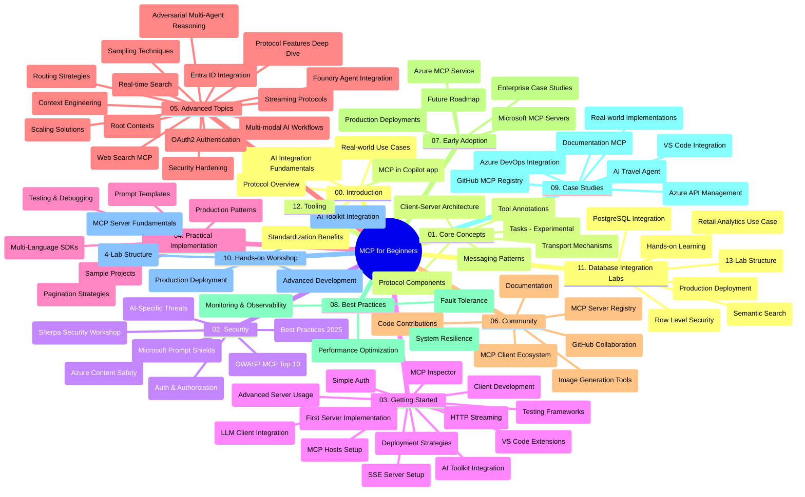

# Protocolo de Contexto de Modelo (MCP) para Iniciantes - Guia de Estudo

Este guia de estudo fornece uma visão geral da estrutura e conteúdo do repositório para o currículo "Protocolo de Contexto de Modelo (MCP) para Iniciantes". Utilize este guia para navegar no repositório de forma eficiente e aproveitar ao máximo os recursos disponíveis.

## Visão Geral do Repositório

O Protocolo de Contexto de Modelo (MCP) é uma estrutura padronizada para interações entre modelos de IA e aplicações cliente. Inicialmente criado pela Anthropic, o MCP é agora mantido pela comunidade MCP mais ampla através da organização oficial no GitHub. Este repositório fornece um currículo completo com exemplos práticos de código em C#, Java, JavaScript, Python e TypeScript, destinado a desenvolvedores de IA, arquitetos de sistemas e engenheiros de software.

## Mapa Visual do Currículo

## Estrutura do Repositório

O repositório está organizado em doze secções principais, cada uma focada em diferentes aspetos do MCP:

1. **Introdução (00-Introduction/)**
   - Visão geral do Protocolo de Contexto de Modelo
   - Porque a padronização é importante em pipelines de IA
   - Casos de uso práticos e benefícios

2. **Conceitos Básicos (01-CoreConcepts/)**
   - Arquitectura cliente-servidor
   - Componentes principais do protocolo
   - Padrões de mensagens no MCP
   - Especificação atual: [O que mudou no MCP: Especificação de 2026-07-28](./01-CoreConcepts/mcp-2026-07-28.md) — o núcleo stateless do protocolo, framework de Extensões, e descontinuação de Roots/Sampling/Logging

3. **Segurança (02-Security/)**
   - Ameaças de segurança em sistemas baseados em MCP
   - Melhores práticas para garantir implementações seguras
   - Estratégias de autenticação e autorização
   - Exemplo prático de autorização [CIMD e DCR](./02-Security/samples/cimd-dcr-auth/README.md)
   - **Documentação Abrangente sobre Segurança**:
     - Melhores Práticas de Segurança MCP
     - Guia de Implementação de Segurança de Conteúdo Azure
     - Controles e Técnicas de Segurança MCP
     - Referência Rápida sobre Melhores Práticas MCP
   - **Tópicos Chave de Segurança**:
     - Injeção de prompts e ataques de envenenamento de ferramentas
     - Sequestro de sessão e problemas de delegado confuso
     - Vulnerabilidades de passagem de token
     - Permissões excessivas e controlo de acesso
     - Segurança da cadeia de fornecimento para componentes de IA
     - Integração com Microsoft Prompt Shields

4. **Começar (03-GettingStarted/)**
   - Configuração e preparação do ambiente
   - Criação de servidores e clientes MCP básicos
   - Integração com aplicações existentes
   - Inclui secções para:
     - Primeira implementação de servidor
     - Desenvolvimento do cliente
     - Integração de cliente LLM
     - Integração com VS Code
     - Servidor Server-Sent Events (SSE)
     - Utilização avançada do servidor
     - Streaming HTTP
     - Integração com AI Toolkit
     - Estratégias de testes
     - Diretrizes de implantação

5. **Implementação Prática (04-PracticalImplementation/)**
   - Utilização de SDKs em várias linguagens de programação
   - Técnicas de debugging, testes e validação
   - Criação de templates e fluxos de trabalho reutilizáveis para prompts
   - Projetos de exemplo com casos práticos de implementação

6. **Tópicos Avançados (05-AdvancedTopics/)**
   - Técnicas de engenharia de contexto
   - Integração de agente Foundry
   - Fluxos de trabalho multi-modais de IA
   - Demonstrações de autenticação OAuth2
   - Capacidades de pesquisa em tempo real
   - Streaming em tempo real
   - Implementação de contextos raiz
   - Estratégias de roteamento
   - Técnicas de sampling
   - Abordagens de escalabilidade
   - Considerações de segurança
   - Integração de segurança Entra ID
   - Integração de pesquisa web
   - Raciocínio multi-agente adversarial (padrões de debate)

7. **Contribuições da Comunidade (06-CommunityContributions/)**
   - Como contribuir com código e documentação
   - Colaboração via GitHub
   - Melhorias e feedback liderados pela comunidade
   - Utilização de vários clientes MCP (Claude Desktop, Cline, VSCode)
   - Trabalho com servidores MCP populares incluindo geração de imagem

8. **Lições da Adoção Inicial (07-LessonsfromEarlyAdoption/)**
   - Implementações no mundo real e histórias de sucesso
   - Construção e implantação de soluções baseadas em MCP
   - Tendências e roteiro futuro
   - **Guia de Servidores MCP Microsoft**: Guia abrangente para 10 servidores MCP da Microsoft prontos para produção incluindo:
     - Servidor MCP Microsoft Learn Docs
     - Servidor MCP Azure (15+ conectores especializados)
     - Servidor MCP GitHub
     - Servidor MCP Azure DevOps
     - Servidor MCP MarkItDown
     - Servidor MCP SQL Server
     - Servidor MCP Playwright
     - Servidor MCP Dev Box
     - Servidor MCP Microsoft Foundry
     - Servidor MCP Microsoft 365 Agents Toolkit

9. **Melhores Práticas (08-BestPractices/)**
   - Otimização e afinação de desempenho
   - Design de sistemas MCP tolerantes a falhas
   - Estratégias de teste e resiliência

10. **Estudos de Caso (09-CaseStudy/)**
    - **Sete estudos de caso abrangentes** demonstrando a versatilidade do MCP em diversos cenários:
    - **Agentes de Viagem Azure AI**: Orquestração multi-agente com Azure OpenAI e AI Search
    - **Integração Azure DevOps**: Automatização de processos de workflow com atualizações de dados do YouTube
    - **Recuperação de Documentação em Tempo Real**: Cliente console Python com streaming HTTP
    - **Gerador Interativo de Planos de Estudo**: Aplicação web Chainlit com IA conversacional
    - **Documentação no Editor**: Integração VS Code com workflows GitHub Copilot
    - **Gestão de API Azure**: Integração empresarial de API com criação de servidor MCP
    - **Registro MCP GitHub**: Desenvolvimento de ecossistema e plataforma de integração agenteica
    - Exemplos de implementação abrangendo integração empresarial, produtividade do desenvolvedor e desenvolvimento de ecossistema

11. **Workshop Prático (10-StreamliningAIWorkflowsBuildingAnMCPServerWithAIToolkit/)**
    - Workshop prático abrangente combinando MCP com AI Toolkit
    - Construção de aplicações inteligentes que interligam modelos de IA com ferramentas do mundo real
    - Módulos práticos cobrindo fundamentos, desenvolvimento de servidor personalizado e estratégias de implantação para produção
    - **Estrutura do Laboratório**:
      - Laboratório 1: Fundamentos do Servidor MCP
      - Laboratório 2: Desenvolvimento Avançado de Servidor MCP
      - Laboratório 3: Integração com AI Toolkit
      - Laboratório 4: Implantação e Escalabilidade em Produção
    - Abordagem de aprendizagem baseada em laboratório com instruções passo a passo

12. **Laboratórios de Integração de Base de Dados MCP Server (11-MCPServerHandsOnLabs/)**
    - **Percurso de aprendizagem abrangente com 13 laboratórios** para construção de servidores MCP prontos para produção com integração PostgreSQL
    - **Implementação real de análise de retalho** usando o caso de uso Zava Retail
    - **Padrões de nível empresarial** incluindo Row Level Security (RLS), pesquisa semântica e acesso multi-inquilino a dados
    - **Estrutura Completa dos Laboratórios**:
      - **Laboratórios 00-03: Fundamentos** - Introdução, Arquitetura, Segurança, Configuração do Ambiente
      - **Laboratórios 04-06: Construção do Servidor MCP** - Design da Base de Dados, Implementação do Servidor MCP, Desenvolvimento de Ferramentas

      - **Laboratórios 07-09: Funcionalidades Avançadas** - Pesquisa Semântica, Testes & Depuração, Integração com VS Code
      - **Laboratórios 10-12: Produção & Boas Práticas** - Implementação, Monitorização, Otimização
    - **Tecnologias Abrangidas**: framework FastMCP, PostgreSQL, Azure OpenAI, Azure Container Apps, Application Insights
    - **Resultados de Aprendizagem**: servidores MCP prontos para produção, padrões de integração de bases de dados, análises potenciadas por IA, segurança empresarial

13. **Ferramentas (12-tooling/)**
    - Aprenda a usar o MCP na aplicação Copilot e noutras ferramentas

## Recursos Adicionais

O repositório inclui recursos de apoio:

- **Pasta de Imagens**: Contém diagramas e ilustrações usadas ao longo do currículo
- **Traduções**: Suporte multilíngue com traduções automáticas da documentação
- **Recursos Oficiais do MCP**:
  - [Documentação MCP](https://modelcontextprotocol.io/)
  - [Especificação MCP](https://modelcontextprotocol.io/specification/2026-07-28/)
  - [Repositório MCP no GitHub](https://github.com/modelcontextprotocol)

## Como Usar Este Repositório

1. **Aprendizagem Sequencial**: Siga os capítulos por ordem (00 até 11) para uma experiência estruturada de aprendizagem.
2. **Foco por Linguagem**: Se estiver interessado numa linguagem de programação específica, explore os diretórios de exemplos para implementações na sua linguagem preferida.
3. **Implementação Prática**: Comece pela secção "Introdução" para configurar o seu ambiente e criar o seu primeiro servidor e cliente MCP.
4. **Exploração Avançada**: Assim que se sentir confortável com os conceitos básicos, mergulhe nos tópicos avançados para expandir os seus conhecimentos.
5. **Envolvimento na Comunidade**: Junte-se à comunidade MCP através das discussões no GitHub e canais Discord para conectar-se com especialistas e outros desenvolvedores.

## Clientes e Ferramentas MCP

O currículo cobre vários clientes e ferramentas MCP:

1. **Clientes Oficiais**:
   - Visual Studio Code 
   - MCP no Visual Studio Code
   - Claude Desktop
   - Claude no VSCode 
   - Claude API

2. **Clientes da Comunidade**:
   - Cline (baseado em terminal)
   - Cursor (editor de código)
   - ChatMCP
   - Windsurf

3. **Ferramentas de Gestão MCP**:
   - MCP CLI
   - MCP Manager
   - MCP Linker
   - MCP Router

## Servidores MCP Populares

O repositório apresenta vários servidores MCP, incluindo:

1. **Servidores Oficiais Microsoft MCP**:
   - Servidor MCP Microsoft Learn Docs
   - Servidor MCP Azure (mais de 15 conectores especializados)
   - Servidor MCP GitHub
   - Servidor MCP Azure DevOps
   - Servidor MCP MarkItDown
   - Servidor MCP SQL Server
   - Servidor MCP Playwright
   - Servidor MCP Dev Box
   - Servidor MCP Microsoft Foundry
   - Servidor MCP Microsoft 365 Agents Toolkit

2. **Servidores de Referência Oficiais**:
   - Filesystem
   - Fetch
   - Memory
   - Sequential Thinking

3. **Geração de Imagens**:
   - Azure OpenAI DALL-E 3
   - Stable Diffusion WebUI
   - Replicate

4. **Ferramentas de Desenvolvimento**:
   - Git MCP
   - Terminal Control
   - Code Assistant

5. **Servidores Especializados**:
   - Salesforce
   - Microsoft Teams
   - Jira & Confluence

## Contribuições

Este repositório acolhe contribuições da comunidade. Veja a secção de Contribuições Comunitárias para orientações sobre como contribuir eficazmente para o ecossistema MCP.

----

*Este guia de estudo foi atualizado pela última vez a 9 de setembro de 2026. Reflete a
Especificação MCP `2026-07-28`, a revisão atual do protocolo. Alguns exemplos práticos
permanecem explicitamente versionados para `2025-11-25` enquanto os seus SDKs e ferramentas
adotam as APIs de protocolo sem estado.*

---

<!-- CO-OP TRANSLATOR DISCLAIMER START -->
**Aviso Legal**:
Este documento foi traduzido utilizando o serviço de tradução automática [Co-op Translator](https://github.com/Azure/co-op-translator). Embora nos esforcemos pela precisão, esteja ciente de que traduções automáticas podem conter erros ou imprecisões. O documento original na sua língua nativa deve ser considerado a fonte autorizada. Para informações críticas, recomenda-se tradução profissional humana. Não nos responsabilizamos por quaisquer mal-entendidos ou interpretações incorretas resultantes da utilização desta tradução.
<!-- CO-OP TRANSLATOR DISCLAIMER END -->